# Requirements

```mermaid
graph LR;
  %% REQVIRE-AUTOGENERATED-DIAGRAM
  %% Graph styling
  classDef userRequirement fill:#f9d6d6,stroke:#f55f5f,stroke-width:1px;
  classDef systemRequirement fill:#fce4e4,stroke:#e68a8a,stroke-width:1px;
  classDef verification fill:#d6f9d6,stroke:#5fd75f,stroke-width:1px;
  classDef default fill:#f5f5f5,stroke:#333333,stroke-width:1px;

  e9aa10046e23e76c["Attach Command Verification"];
  class e9aa10046e23e76c verification;
  click e9aa10046e23e76c "AttachmentsVerifications.md#attach-command-verification";
  1940de2d7d61adab["test.sh"];
  class 1940de2d7d61adab default;
  click 1940de2d7d61adab "../../tests/test-attachments/test.sh";
  e9aa10046e23e76c -->|satisfiedBy| 1940de2d7d61adab;
  a4d507bff359d303["Attachment Output Rendering Verification"];
  class a4d507bff359d303 verification;
  click a4d507bff359d303 "AttachmentsVerifications.md#attachment-output-rendering-verification";
  1940de2d7d61adab["test.sh"];
  class 1940de2d7d61adab default;
  click 1940de2d7d61adab "../../tests/test-attachments/test.sh";
  a4d507bff359d303 -->|satisfiedBy| 1940de2d7d61adab;
  c5f21359e4574c2b["Attachment Search Filters Verification"];
  class c5f21359e4574c2b verification;
  click c5f21359e4574c2b "AttachmentsVerifications.md#attachment-search-filters-verification";
  1940de2d7d61adab["test.sh"];
  class 1940de2d7d61adab default;
  click 1940de2d7d61adab "../../tests/test-attachments/test.sh";
  c5f21359e4574c2b -->|satisfiedBy| 1940de2d7d61adab;
  1e80cec5af56a72c["Attachments Change Impact Verification"];
  class 1e80cec5af56a72c verification;
  click 1e80cec5af56a72c "AttachmentsVerifications.md#attachments-change-impact-verification";
  1940de2d7d61adab["test.sh"];
  class 1940de2d7d61adab default;
  click 1940de2d7d61adab "../../tests/test-attachments/test.sh";
  1e80cec5af56a72c -->|satisfiedBy| 1940de2d7d61adab;
  f7ea2ade9f0cb1fe["Attachments Subsection Parsing Verification"];
  class f7ea2ade9f0cb1fe verification;
  click f7ea2ade9f0cb1fe "AttachmentsVerifications.md#attachments-subsection-parsing-verification";
  1940de2d7d61adab["test.sh"];
  class 1940de2d7d61adab default;
  click 1940de2d7d61adab "../../tests/test-attachments/test.sh";
  f7ea2ade9f0cb1fe -->|satisfiedBy| 1940de2d7d61adab;
  71fc5a8b1616ecd["Attachments Validation Verification"];
  class 71fc5a8b1616ecd verification;
  click 71fc5a8b1616ecd "AttachmentsVerifications.md#attachments-validation-verification";
  1940de2d7d61adab["test.sh"];
  class 1940de2d7d61adab default;
  click 1940de2d7d61adab "../../tests/test-attachments/test.sh";
  71fc5a8b1616ecd -->|satisfiedBy| 1940de2d7d61adab;
  356e1341797a881b["Detach Command Verification"];
  class 356e1341797a881b verification;
  click 356e1341797a881b "AttachmentsVerifications.md#detach-command-verification";
  1940de2d7d61adab["test.sh"];
  class 1940de2d7d61adab default;
  click 1940de2d7d61adab "../../tests/test-attachments/test.sh";
  356e1341797a881b -->|satisfiedBy| 1940de2d7d61adab;
  a456b31063afc5d8["Move Attachment Command Verification"];
  class a456b31063afc5d8 verification;
  click a456b31063afc5d8 "AttachmentsVerifications.md#move-attachment-command-verification";
  1940de2d7d61adab["test.sh"];
  class 1940de2d7d61adab default;
  click 1940de2d7d61adab "../../tests/test-attachments/test.sh";
  a456b31063afc5d8 -->|satisfiedBy| 1940de2d7d61adab;
  26e41fb78f24abd["Remove Attachment Command Verification"];
  class 26e41fb78f24abd verification;
  click 26e41fb78f24abd "AttachmentsVerifications.md#remove-attachment-command-verification";
  1940de2d7d61adab["test.sh"];
  class 1940de2d7d61adab default;
  click 1940de2d7d61adab "../../tests/test-attachments/test.sh";
  26e41fb78f24abd -->|satisfiedBy| 1940de2d7d61adab;
  a957c400a0de2045["Attachment Commands"];
  class a957c400a0de2045 systemRequirement;
  click a957c400a0de2045 "../Interfaces/CLI.md#attachment-commands";
  a957c400a0de2045 -.->|verifiedBy| e9aa10046e23e76c;
  a957c400a0de2045 -.->|verifiedBy| 356e1341797a881b;
  a957c400a0de2045 -.->|verifiedBy| a456b31063afc5d8;
  a957c400a0de2045 -.->|verifiedBy| 26e41fb78f24abd;
  e342a2a82ef67934["CLI Search Command"];
  class e342a2a82ef67934 systemRequirement;
  click e342a2a82ef67934 "../Interfaces/CLI.md#cli-search-command";
  80defdd4cbc7ee18["cli.rs"];
  class 80defdd4cbc7ee18 default;
  click 80defdd4cbc7ee18 "../../cli/src/cli.rs";
  e342a2a82ef67934 -->|satisfiedBy| 80defdd4cbc7ee18;
  7ff28ff401dbaef7["CLI Help Structure Verification"];
  class 7ff28ff401dbaef7 verification;
  click 7ff28ff401dbaef7 "../Interfaces/CLI.md#cli-help-structure-verification";
  e342a2a82ef67934 -.->|verifiedBy| 7ff28ff401dbaef7;
  e342a2a82ef67934 -.->|verifiedBy| c5f21359e4574c2b;
  aba20c01c777da73["Search Command Tests"];
  class aba20c01c777da73 verification;
  click aba20c01c777da73 "Reporting.md#search-command-tests";
  e342a2a82ef67934 -.->|verifiedBy| aba20c01c777da73;
  2a29f1f7ce22846e["Requirements Change Propagation"];
  class 2a29f1f7ce22846e systemRequirement;
  click 2a29f1f7ce22846e "ChangeImpact.md#requirements-change-propagation";
  4b89dbed94c08c3e["change_impact.rs"];
  class 4b89dbed94c08c3e default;
  click 4b89dbed94c08c3e "../../core/src/change_impact.rs";
  2a29f1f7ce22846e -->|satisfiedBy| 4b89dbed94c08c3e;
  2a29f1f7ce22846e -.->|verifiedBy| 1e80cec5af56a72c;
  3f87bd87eadd90fb["Change Impact Detection Test"];
  class 3f87bd87eadd90fb verification;
  click 3f87bd87eadd90fb "ChangeImpact.md#change-impact-detection-test";
  2a29f1f7ce22846e -.->|verifiedBy| 3f87bd87eadd90fb;
  5c87ffb56362b634["Change Impact Relations Test"];
  class 5c87ffb56362b634 verification;
  click 5c87ffb56362b634 "ChangeImpact.md#change-impact-relations-test";
  2a29f1f7ce22846e -.->|verifiedBy| 5c87ffb56362b634;
  7c2dfd8fd2bf95ad["Change Impact Smart Filtering Test"];
  class 7c2dfd8fd2bf95ad verification;
  click 7c2dfd8fd2bf95ad "ChangeImpact.md#change-impact-smart-filtering-test";
  2a29f1f7ce22846e -.->|verifiedBy| 7c2dfd8fd2bf95ad;
  423634b0183d5b48["Element Content Extraction Test"];
  class 423634b0183d5b48 verification;
  click 423634b0183d5b48 "ChangeImpact.md#element-content-extraction-test";
  2a29f1f7ce22846e -.->|verifiedBy| 423634b0183d5b48;
  1d0bfcae44a9063["Reserved Subsections Support"];
  class 1d0bfcae44a9063 systemRequirement;
  click 1d0bfcae44a9063 "Subsections.md#reserved-subsections-support";
  1d0bfcae44a9063 -.->|deriveReqT| a957c400a0de2045;
  1d0bfcae44a9063 -.->|deriveReqT| e342a2a82ef67934;
  c80ab353c1242f1f["Supported Element Types"];
  class c80ab353c1242f1f systemRequirement;
  click c80ab353c1242f1f "ModelManagement.md#supported-element-types";
  1d0bfcae44a9063 -.->|deriveReqT| c80ab353c1242f1f;
  b0ca2a8e86aafe4b["Verification Type Categories"];
  class b0ca2a8e86aafe4b systemRequirement;
  click b0ca2a8e86aafe4b "ModelManagement.md#verification-type-categories";
  1d0bfcae44a9063 -.->|deriveReqT| b0ca2a8e86aafe4b;
  a814c4935e1a0449["element.rs"];
  class a814c4935e1a0449 default;
  click a814c4935e1a0449 "../../core/src/element.rs";
  1d0bfcae44a9063 -->|satisfiedBy| a814c4935e1a0449;
  f22d93285fcd7664["parser.rs"];
  class f22d93285fcd7664 default;
  click f22d93285fcd7664 "../../core/src/parser.rs";
  1d0bfcae44a9063 -->|satisfiedBy| f22d93285fcd7664;
  1d0bfcae44a9063 -.->|verifiedBy| a4d507bff359d303;
  1d0bfcae44a9063 -.->|verifiedBy| f7ea2ade9f0cb1fe;
  1d0bfcae44a9063 -.->|verifiedBy| 71fc5a8b1616ecd;
  c8dd29521fe145e9["Element Subsection Parsing Test"];
  class c8dd29521fe145e9 verification;
  click c8dd29521fe145e9 "ParsingAndValidationVerifications.md#element-subsection-parsing-test";
  1d0bfcae44a9063 -.->|verifiedBy| c8dd29521fe145e9;
```

This document specifies verifications for the Attachments feature requirements.

### Attachments Subsection Parsing Verification

Verify the system correctly parses Attachments subsections.

#### Details
Test cases:
- Parse markdown links in Attachments subsection
- Extract paths where link text equals href
- Normalize paths to git-root-relative
- Handle multiple attachments in single element
- Reject links where text ≠ href

#### Metadata
  * type: test-verification

#### Relations
  * verify: [Reserved Subsections Support](Subsections.md#reserved-subsections-support)
  * satisfiedBy: [test.sh](../../tests/test-attachments/test.sh)
---

### Attachments Validation Verification

Verify the system validates attachment file existence.

#### Details
Test cases:
- Validation passes when attachment files exist
- Validation fails for missing attachment files
- Error message includes element identifier and missing path
- Validation occurs in Pass 2

#### Metadata
  * type: test-verification

#### Relations
  * verify: [Reserved Subsections Support](Subsections.md#reserved-subsections-support)
  * satisfiedBy: [test.sh](../../tests/test-attachments/test.sh)
---

### Attachments Change Impact Verification

Verify attach/detach operations trigger change impact analysis.

#### Details
CRITICAL: Detach operation must trigger change impact.

Test cases:
- Attach operation marks element as changed
- Detach operation marks element as changed
- mv-attachment operation marks affected elements as changed
- rm-attachment operation marks affected elements as changed
- Element hash changes when attachments modified
- Change impact propagates through derivedFrom relations

#### Metadata
  * type: test-verification

#### Relations
  * verify: [Requirements Change Propagation](ChangeImpact.md#requirements-change-propagation)
  * satisfiedBy: [test.sh](../../tests/test-attachments/test.sh)
---

### Attach Command Verification

Verify attach command creates Attachments subsection and adds links.

#### Details
Test cases:
- Create Attachments subsection if missing
- Add link with format `[path](path)`
- Idempotent: duplicate attach doesn't create duplicate entry
- Many-to-many: same file attaches to multiple elements
- Dry-run mode makes no changes
- Validation passes after attach

#### Metadata
  * type: test-verification

#### Relations
  * verify: [Attachment Commands](../Interfaces/CLI.md#attachment-commands)
  * satisfiedBy: [test.sh](../../tests/test-attachments/test.sh)
---

### Detach Command Verification

Verify detach command removes links and cleans up empty subsections.

#### Details
CRITICAL: Must verify detach triggers change impact.

Test cases:
- Remove link from Attachments subsection
- Remove subsection when no attachments remain
- Detach from one element doesn't affect others
- Dry-run mode makes no changes
- Change impact analysis shows element as changed

#### Metadata
  * type: test-verification

#### Relations
  * verify: [Attachment Commands](../Interfaces/CLI.md#attachment-commands)
  * satisfiedBy: [test.sh](../../tests/test-attachments/test.sh)
---

### Move Attachment Command Verification

Verify mv-attachment updates all references across elements.

#### Details
Test cases:
- Update ALL elements with attachment
- Update both link text and href
- Link text equals path after move
- Report all affected elements
- Dry-run mode makes no changes
- Validation passes after move

#### Metadata
  * type: test-verification

#### Relations
  * verify: [Attachment Commands](../Interfaces/CLI.md#attachment-commands)
  * satisfiedBy: [test.sh](../../tests/test-attachments/test.sh)
---

### Remove Attachment Command Verification

Verify rm-attachment deletes file and detaches from all elements.

#### Details
Test cases:
- Delete physical file from filesystem
- Detach from ALL elements
- Remove empty Attachments subsections
- Report all affected elements
- Dry-run mode makes no changes (file not deleted)
- Validation passes after removal

#### Metadata
  * type: test-verification

#### Relations
  * verify: [Attachment Commands](../Interfaces/CLI.md#attachment-commands)
  * satisfiedBy: [test.sh](../../tests/test-attachments/test.sh)
---

### Attachment Search Filters Verification

Verify search filters correctly find elements by attachments.

#### Details
Test cases:
- `--has-attachments` finds only elements with attachments
- `--filter-attachment` with glob pattern matches correctly
- Pattern `*.pdf` matches PDF files only
- Pattern `docs/*` matches all files in docs directory
- No false positives or false negatives

#### Metadata
  * type: test-verification

#### Relations
  * verify: [CLI Search Command](../Interfaces/CLI.md#cli-search-command)
  * satisfiedBy: [test.sh](../../tests/test-attachments/test.sh)
---

### Attachment Output Rendering Verification

Verify attachments render correctly in all output formats.

#### Details
Test cases:
- Markdown output preserves format
- HTML export renders clickable links
- JSON includes attachments array
- JSON file_path field contains git-root-relative path
- Consistent indentation in markdown

#### Metadata
  * type: test-verification

#### Relations
  * verify: [Reserved Subsections Support](Subsections.md#reserved-subsections-support)
  * satisfiedBy: [test.sh](../../tests/test-attachments/test.sh)
---
