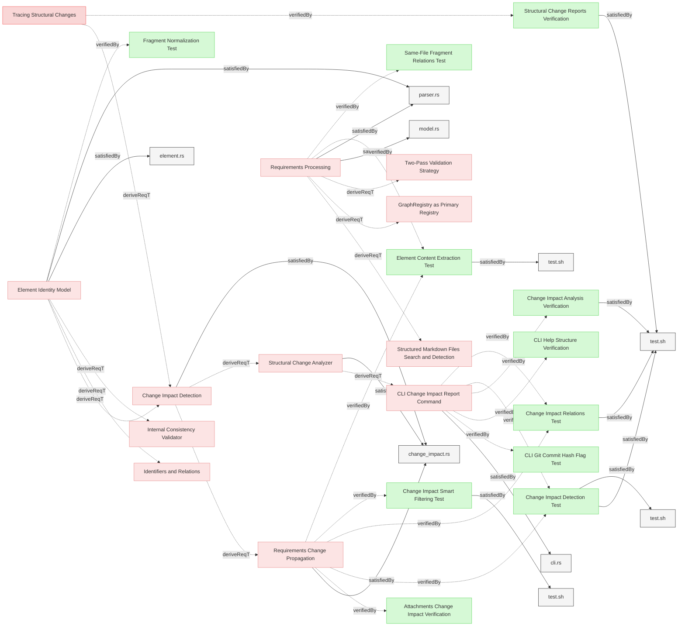
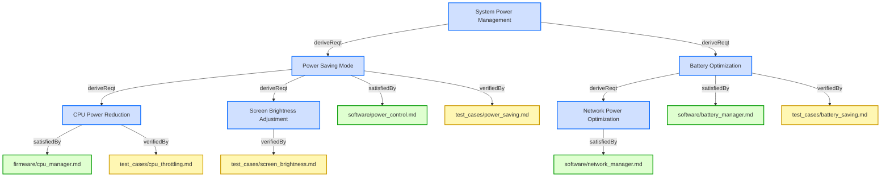
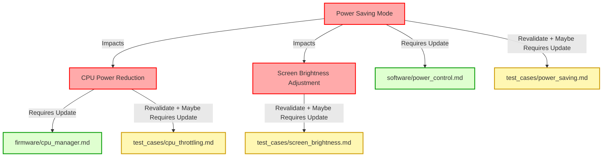

# Requirements


### Change Impact Detection

The system shall detect, analyze, and report changes to model elements between versions by comparing element content hashes, tracking relocations, and propagating impact through relationships.

#### Details
Change impact detection encompasses:
1. **Detection**: Identify what changed (content, additions, removals, relocations)
2. **Propagation**: Determine how changes flow through model relationships
3. **Reporting**: Present change analysis results to users

#### Relations
  * derivedFrom: [Tracing Structural Changes](Reporting.md#tracing-structural-changes)
  * derivedFrom: [Element Identity Model](StructureAndParsing.md#element-identity-model)
  * satisfiedBy: [change_impact.rs](../../core/src/change_impact.rs)
---

### Structural Change Analyzer

The system shall implement a model change analyzer that identifies structural modifications between model versions, determines affected elements through relationship traversal, and categorizes impacts according to change propagation rules.

#### Relations
  * derivedFrom: [Change Impact Detection](#change-impact-detection)
  * satisfiedBy: [change_impact.rs](../../core/src/change_impact.rs)
---

### Change Impact Detection Test

This test verifies that the system correctly implements change impact detection, including proper default handling of the git commit parameter and smart filtering.

#### Details

##### Acceptance Criteria
- System correctly detects changes between different versions of requirements
- System correctly identifies element relocations (same Element ID, different file_path or section)
- Relocated elements without content changes do not trigger impact propagation
- Relocated elements WITH content or relation changes appear in BOTH "Relocated" AND "Changed" sections
- Relocated elements appear in a separate "Relocated" section in the report
- System properly constructs a change impact report based on relationships between elements
- Relations are compared semantically by element name, not by identifier (prevents false positives when children relocate)
- Relocated parent with new relation to relocated+changed child is detected correctly
- Default git commit is HEAD when --git-commit parameter is not provided
- System provides output in both human-readable text and JSON formats
- Smart filtering removes redundant elements that appear in other elements' relations

##### Test Criteria
- Command exits with success (0) return code
- Change impact report shows expected elements
- Change impact report shows correct relationships between elements
- Changed elements referenced in other changed elements' relations are filtered out (e.g., "Power Saving" filtered when referenced by "Power Saving Mode")
- Relocated elements are reported with old location → new location format
- Pure relocations (same content, different location) do NOT appear in "Removed" + "Added" sections
- Pure relocations do NOT appear in impact propagation tree
- Relocated+changed elements appear in BOTH Relocated AND Changed sections
- Parent element with added relation to relocated+changed child shows in Changed with impact tree
- Relations to relocated elements don't cause false change detection in parent elements
- Summary statistics include count of relocated elements
- Element IDs remain stable when elements are relocated between files
- Output format matches requested format (text or JSON)
- Both explicit and implicit git commit parameters work properly
- JSON output is valid and contains all necessary information
- GitHub-style blob URLs are included in the output

#### Metadata
  * type: test-verification

#### Relations
  * verify: [Requirements Change Propagation](#requirements-change-propagation)
  * verify: [CLI Change Impact Report Command](../Interfaces/CLI.md#cli-change-impact-report-command)
  * satisfiedBy: [test.sh](../../tests/test-change-impact-detection/test.sh)
  * satisfiedBy: [test.sh](../../tests/test-change-impact-element-relocation/test.sh)
---

### Change Impact Relations Test

This test verifies that the system correctly handles different relation types when calculating change impact.

#### Details

##### Acceptance Criteria
- System correctly propagates changes through different relation types
- System respects the IMPACT_PROPAGATION_RELATIONS list when determining impact flow
- System does not propagate impact through containment (file location) changes
- Element relocations without content changes do not trigger impact propagation
- System handles complex chains of relations properly

##### Test Criteria
- Command exits with success (0) return code
- Change impact report shows expected propagation through derivedFrom/derive relations
- Change impact report shows expected propagation through satisfiedBy/satisfy relations
- Change impact report shows expected propagation through verifiedBy/verify relations
- Relocations without content changes do NOT propagate through relations
- When an element moves files without content change, related elements are not marked as impacted
- System correctly handles circular dependencies in relation chains

#### Metadata
  * type: test-verification

#### Relations
  * verify: [Requirements Change Propagation](#requirements-change-propagation)
  * verify: [CLI Change Impact Report Command](../Interfaces/CLI.md#cli-change-impact-report-command)
  * satisfiedBy: [test.sh](../../tests/test-change-impact-detection/test.sh)
---

### Element Content Extraction Test

This test verifies that the system correctly extracts element content for change impact detection.

#### Details

##### Acceptance Criteria
- System should properly extract requirement body for change impact detection
- Requirement body should include normalized main text and content from the Details subsection
- System should handle requirements with various combinations of subsections

##### Test Criteria
- Command exits with success (0) return code
- Output shows expected content for each element
- Content extraction correctly handles different subsection ordering
- Content extraction properly handles HTML details tags

##### Test Procedure
1. Create test fixtures with requirements containing various combinations of subsections
2. Run Reqvire model summary on the test fixtures
3. Verify that extracted content matches expected content for each element
4. Verify that content from Details subsection is properly included

#### Metadata
  * type: test-verification

#### Relations
  * verify: [Requirements Change Propagation](#requirements-change-propagation)
  * verify: [Requirements Processing](Configuration.md#requirements-processing)
  * satisfiedBy: [test.sh](../../tests/test-element-content-extraction/test.sh)
---

### Change Impact Analysis Verification

This test verifies that the system generates change impact reports when requested.

#### Details

##### Acceptance Criteria
- System should generate change impact reports in Markdown format
- System should support JSON output for change impact reports
- Reports should include an overview of model changes and their impact

##### Test Criteria
- Command exits with success (0) return code
- Reports contain expected impact information
- Both Markdown and JSON formats are properly supported

##### Test Procedure
TODO: write test procedure

#### Metadata
  * type: test-verification

#### Relations
  * verify: [CLI Change Impact Report Command](../Interfaces/CLI.md#cli-change-impact-report-command)
  * satisfiedBy: [test.sh](../../tests/test-change-impact-detection/test.sh)
---

### Structural Change Reports Verification

This test verifies that the system analyzes and reports on structural changes in the MBSE model.

#### Details

##### Acceptance Criteria
- System should analyze structural changes in the MBSE model
- System should identify affected components through relationship traversal
- System should generate reports of impacted elements and structures

##### Test Criteria
- Command exits with success (0) return code
- Change reports correctly identify affected elements
- Relationship traversal properly determines impact propagation

##### Test Procedure
TODO: write test procedure

#### Metadata
  * type: test-verification

#### Relations
  * verify: [Tracing Structural Changes](Reporting.md#tracing-structural-changes)
  * satisfiedBy: [test.sh](../../tests/test-change-impact-detection/test.sh)
---

### Change Impact Smart Filtering Test

This test verifies that the smart filtering correctly handles new elements in change impact reports, filtering child elements while showing parent elements.

#### Details

##### Acceptance Criteria
- New parent elements appear in the "New Elements" section
- New child elements (with parent relationships to other new elements) are filtered out
- Filtered child elements are shown in parent's relations with "(new)" marker
- Verification elements that are not children remain in the report

##### Test Criteria
- When adding a parent and child requirement together, only parent appears in "New Elements"
- When adding a requirement and its verification, both appear (verification is not a child)
- Child elements are visible in the parent's change impact tree with appropriate markers

##### Test Procedure
1. Create test repository with existing requirements
2. Add new parent requirement with derive relation to new child requirement
3. Add new child requirement with derivedFrom relation to parent
4. Run change impact detection
5. Verify only parent appears in "New Elements" section
6. Verify child appears in parent's relations with "(new)" marker

#### Metadata
  * type: test-verification

#### Relations
  * verify: [Requirements Change Propagation](#requirements-change-propagation)
  * satisfiedBy: [test.sh](../../tests/test-change-impact-smart-filtering/test.sh)
---

### Requirements Change Propagation

When a requirement is changed, the system shall propagate the change through related requirements, verification artifacts, and design elements according to relation type definitions and propagation rules.

#### Details
<details>
<summary>View Full Specification</summary>


## Change Impact Propagation in Requirements

Requirements are interconnected through relations, and changes to a requirement may affect related requirements, verification methods, design specifications, or software components.

Changes propagate based on the relation type, which determines the impact direction and scope.

Changes to high-level requirements cascade down to implementation.
Verification artifacts must be marked for revalidation to reflect changes.
Automated tools should flag all impacted requirements for review.

### Relation Categories for Change Propagation

For change propagation purposes, relations can be categorized into several groups:

1. **Hierarchical Relations** - Changes propagate from parent to child elements (derivedFrom)
2. **Satisfaction Relations** - Changes to requirements affect implementations (satisfiedBy)
3. **Verification Relations** - Changes to requirements invalidate verifications (verifiedBy)
4. **Traceability Relations** - No change propagation, for documentation only (trace)

---


## Change Propagation Mechanism

When a requirement changes, impact analysis must be conducted based on its relations. The following mechanism ensures traceability and controlled updates.

- Identify Modified Elements
- Identify Impacted Relations
  - When a element is modified, check its Relations subsection to identify linked elements.
- Determine Change Propagation Scope
  - Apply the rules in Relation Types and Change Propagation Rules to assess whether the change affects child requirements, design artifacts, verification, or other linked documents.
- Invalidate Affected Elements
  - If a related element is impacted, flag it for review.  
  - Example: If a requirement verified by a test changes, the test must be reviewed.
- Require Re-validation or Re-design
  - If changes affect satisfaction (e.g., code or architecture), update the relevant design.  
  - If changes affect verification, update test cases or validation documents.
- If a change results in a requirement being merged, split, or removed, update its Relations to maintain traceability.

## Identify Modified Elements Algorythm:

1. **Diff Analysis**:
   - Compare elements between versions using stable Element IDs (not location-based identifiers)
   - Identify changes by type:
     - **Content Changes**: Element ID exists in both versions, content hash differs
     - **Additions**: Element ID exists only in current version
     - **Removals**: Element ID exists only in previous version
     - **Relocations**: Element ID exists in both, but file_path or section differs
   - **Attachment Content Changes**:
     - Element content hash includes hashes of attached document content
     - Attach operation: adds document content hash → element hash changes → triggers impact
     - Detach operation: removes document content hash → element hash changes → triggers impact
     - mv-attachment operation: path change only → does NOT trigger impact (tracked for reporting like relation renames)
     - If attached document content changes: element hash changes → triggers impact
     - Path renames are tracked separately for reference updates without impact propagation
   - Generate a ChangeSet representing all detected changes
   - Associate changes with specific elements in the model
   - Note: Pure relocations (no content changes) do not trigger impact propagation

2. **Relocation Detection**:
   - For each element present in both versions (matched by Element ID):
     - Compare file_path field (implicit file containment)
     - Compare section field (implicit section containment)
     - If either differs → classify as relocation
     - Track old location and new location for reporting
   - Relocations without content changes do NOT propagate impact
   - Relocations WITH content changes propagate based on content change only

3. **Impact Determination**:
   - For each changed element, identify all relations from the element
   - Apply relation-specific propagation rules as defined in RelationTypesRegistry.md
   - Consider the relation direction and change impact direction for each relation
   - Build an impact tree representing the propagation of changes

4. **Recursive Traversal**:
   - Perform a depth-first traversal of relationships
   - Create a directed acyclic graph (DAG) of change impact
   - Handle circular dependencies by preventing infinite recursion
   - Track visited nodes to prevent duplicate processing

5. **Impact Classification**:
   - Assign impact severity levels based on relation types
   - Classify changes as:
     - Direct: Changes to the element itself
     - Indirect: Changes propagated from related elements
     - Potential: Changes that might affect an element based on semantic analysis
   - Calculate aggregated impact scores for each affected element

6. **Performance Optimization**:
   - Implement caching of traversal results
   - Use parallel processing for independent branches of the impact tree
   - Apply pruning techniques to limit traversal depth when appropriate
   - Support incremental impact analysis for large models

**Change Impact Visualization:**
The system shall provide visual representations of change impact to help users understand the scope and implications of changes.

The visualization shall include:

1. **Tree View**:
   - Display a hierarchical tree of affected elements
   - Group elements by change type (content changes, additions, removals, relocations)
   - Show relation types between elements
   - Show old and new locations for relocated elements
   - Support collapsing/expanding nodes for better navigation

2. **Color Coding**:
   - Use consistent color scheme for impact types (Direct: Red, Indirect: Yellow, Potential: Blue)
   - Indicate relation types with different line styles
   - Highlight newly introduced or removed relationships

3. **Interactive Elements**:
   - Allow clicking on elements to focus the view

4. **Summary Statistics**:
   - Display counts of affected elements by type
   - Show metrics for impact breadth and depth
   - Calculate change propagation fan-out metrics
   - Generate overall change impact assessment

**Smart Filtering for Change Impact Reports:**
The system shall implement intelligent filtering logic to eliminate redundant information from change impact reports and focus on primary changes and their relationships.

The smart filtering shall implement the following logic:

1. **Primary Change Detection**:
   - Distinguish between primary changes and secondary changes
   - Filter out elements already referenced in relations of other elements
   - Apply filtering to both new-to-new and changed-to-changed element relationships

2. **Comprehensive Filtering Rules**:
   - Eliminate redundant new elements referenced in relations of other elements
   - Eliminate redundant changed elements referenced in relations of other changed elements
   - Show only independent elements not already covered by relationships
   - Mark new elements with "(new)" suffix and changed elements with "⚠️" symbol

3. **Cross-Category Filtering**:
   - Apply filtering across all categories (new, changed, removed)
   - Preserve the most informative context for each filtered element

4. **Hierarchical Organization**:
   - Present changes in order of importance
   - Group related changes together to show impact chains clearly
   - Maintain complete traceability while reducing visual clutter

5. **Benefits**:
   - Reduced clutter by eliminating redundant information
   - Improved focus on primary changes
   - Clear context for elements shown in relevant relationship context
   - Better readability with concise reports
   
## Examples of Change Propagation


### Parent-Child Requirement Change

```markdown

---

### Parent Requirement
This requirement defines a high-level system constraint.

#### Relations
  * derive: [Child Requirement](#child-requirement)


---

### Child Requirement
This requirement defines additional functionality.

```

If Parent Requirement changes, Child Requirement must be reviewed and updated.


---

### Requirement Verified by a Test

```

---

### Safety Requirement

The system shall shut down if temperature exceeds 100°C.

#### Relations
  * verifiedBy: [test_cases/safety_verification.md/Overheat Shutdown Test](test_cases/safety_verification.md#overheat-shutdown-test)

```

If Safety Requirement changes, the Overheat Shutdown Test must be reviewed for update and executed again for verification.


---

### Requirement with Attached Document Change

```markdown

---

### Performance Requirements

The system shall meet defined performance criteria as specified in the attached SLA document.

#### Attachments
* [docs/SLA.pdf](docs/SLA.pdf)

#### Relations
  * satisfiedBy: [architecture/load_balancer.md](architecture/load_balancer.md)
  * verifiedBy: [test_cases/performance_tests.md](test_cases/performance_tests.md)
```

**Scenario 1: Attachment Content Changes**

If `docs/SLA.pdf` content is modified (e.g., performance targets updated from 99.9% to 99.99% uptime):
- Document content hash changes
- Element content hash changes → Performance Requirements marked as changed
- Change impact propagates through satisfiedBy → `architecture/load_balancer.md` requires review
- Change impact propagates through verifiedBy → `test_cases/performance_tests.md` requires update

**Scenario 2: Attachment Path Rename**

If `docs/SLA.pdf` is renamed to `docs/service_level_agreement.pdf` using `mv-attachment`:
- Path changes but document content unchanged
- Element content hash remains the same → NO change impact triggered
- Path update tracked for reporting (like relation renames)
- References automatically updated across all elements

**Key Distinction**:
- **Content change** in attached document = real change requiring review and verification
- **Path rename** of attached document = metadata update only, no impact propagation


---

### Example of Multi-Level Change Propagation in Requirements

The following analysis explains how a **change in the requirement**  propagates through multiple levels of related requirements, impacting their definitions, design artifacts, and verification processes.

---

```
### Root Requirement: System Power Management

The system shall implement power-saving mechanisms to optimize battery usage.  

---

### Power Saving Mode

The system shall activate power-saving mode when the battery level drops below 20%.  

#### Relations
  * deriveFrom: [System Power Management](#system-power-management)
  * satisfiedBy: [software/power_control.md](software/power_control.md)
  * verifiedBy: [test_cases/power_saving.md](test_cases/power_saving.md)

---

### CPU Power Reduction

The system shall reduce CPU frequency by 30% in power-saving mode.  

#### Relations
  * deriveFrom: [Power Saving Mode](#power-saving-mode)
  * satisfiedBy: [firmware/cpu_manager.md](firmware/cpu_manager.md)
  * verifiedBy: [test_cases/cpu_throttling.md](test_cases/cpu_throttling.md)

---

### Screen Brightness Adjustment

The system shall reduce screen brightness by 40% in power-saving mode.  

#### Relations
  * deriveFrom: [Power Saving Mode](#power-saving-mode)
  * verifiedBy: [test_cases/screen_brightness.md](test_cases/screen_brightness.md)

---

### Battery Optimization

The system shall disable non-essential background services when battery levels drop below 15%.  

#### Relations
  * deriveFrom: [System Power Management](#system-power-management)
  * satisfiedBy: [software/battery_manager.md](software/battery_manager.md)
  * verifiedBy: [test_cases/battery_saving.md](test_cases/battery_saving.md)

---

### Network Power Optimization
The system shall reduce network polling frequency when battery levels drop below 15%.  

#### Relations
  * deriveFrom: [Battery Optimization](#battery-optimization)
  * satisfiedBy: [software/network_manager.md](software/network_manager.md)
```

**Power Saving Mode** requirment has been changed to:
>The system shall activate power-saving mode when the battery level drops below 30%.


Change Propagation Flow:
1. A **change** in **Power Saving Mode** flows **downward** to **CPU Power Reduction**.
2. A **change** in **Power Saving Mode** flows **downward** to **Screen Brightness Adjustment**.
3. Additionally, all **satisfiedBy** and **verifiedBy** relations from affected requirements must be reviewed:
   - **Power Saving Mode** → **software/power_control.md** (implementation) & **test_cases/power_saving.md** (verification).  
   - **CPU Power Reduction** → **firmware/cpu_manager.md** (implementation) & **test_cases/cpu_throttling.md** (verification).  
   - **Screen Brightness Adjustment** → **[test_cases/screen_brightness.md** (verification).  


Mermaid diagram showing relations:


Legend:
- **🟦 Requirements (Blue)** → Directly from your provided requirements.  
- **🟩 Implementations (Green)** → Only **satisfiedBy** links
- **🟨 Verifications (Yellow)** → Only **verifiedBy** links

Change propagation flow diagram:


</details>

#### Relations
  * derivedFrom: [Change Impact Detection](#change-impact-detection)
  * satisfiedBy: [change_impact.rs](../../core/src/change_impact.rs)
---
