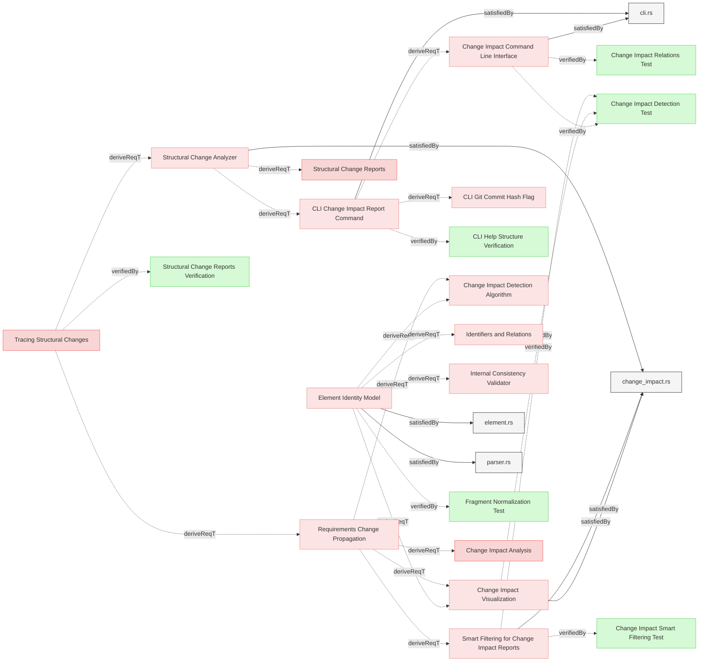
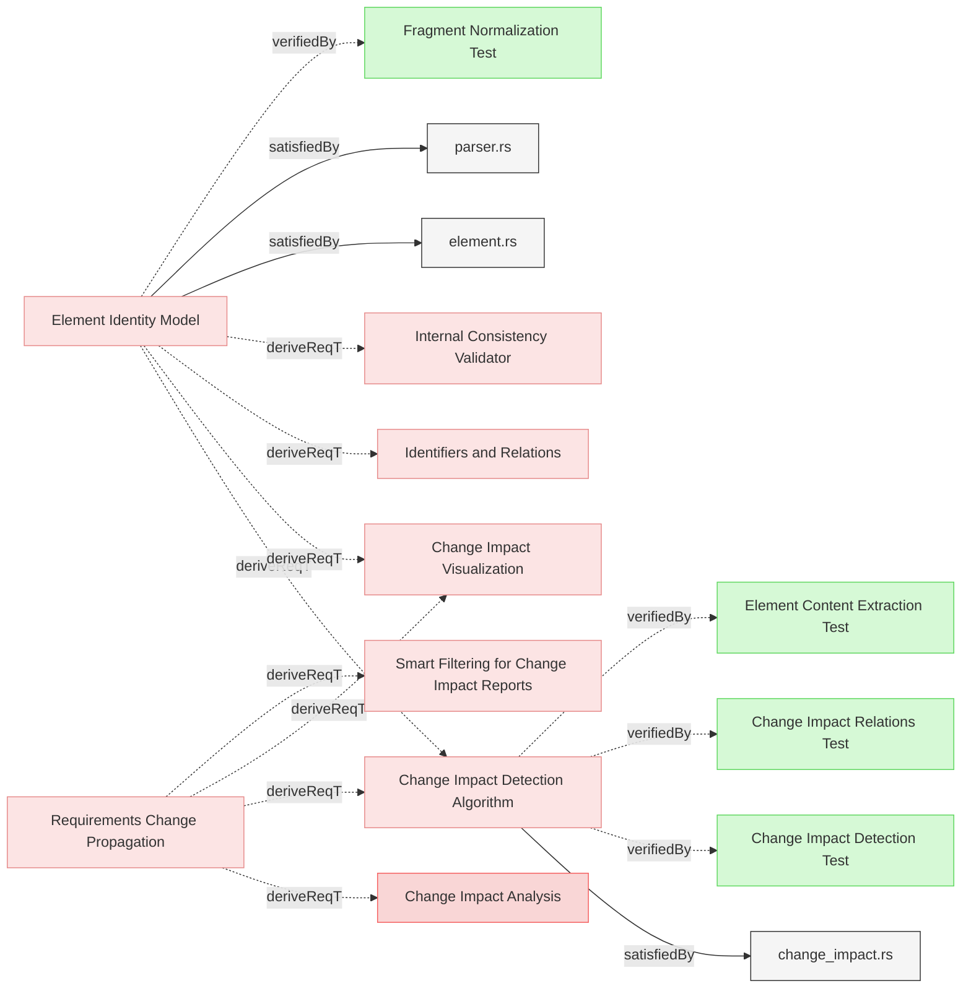

# ChangeImpact

## Change Analysis Requirements

### Structural Change Analyzer

The system shall implement a model change analyzer that identifies structural modifications between model versions, determines affected elements through relationship traversal, and categorizes impacts according to change propagation rules.

#### Relations
  * derivedFrom: [Tracing Structural Changes](Reporting.md#tracing-structural-changes)
  * satisfiedBy: [change_impact.rs](../../core/src/change_impact.rs)
---

### Structural Change Reports

The system shall generate detailed reports summarizing the impact of structural changes, including affected relationships and components.

#### Metadata
  * type: user-requirement

#### Relations
  * derivedFrom: [Structural Change Analyzer](#structural-change-analyzer)
---

### Change Impact Visualization

The system shall provide visual representations of change impact to help users understand the scope and implications of changes.

#### Details
The visualization shall include:

1. **Tree View**:
   - Display a hierarchical tree of affected elements
   - Group elements by change type:
     - Content changes (direct, indirect, potential)
     - Additions
     - Removals
     - Relocations (separate category)
   - Show relation types between elements
   - Show old and new locations for relocated elements
   - Support collapsing/expanding nodes for better navigation

2. **Color Coding**:
   - Use consistent color scheme for impact types:
     - Direct impacts: Red
     - Indirect impacts: Yellow
     - Potential impacts: Blue
   - Indicate relation types with different line styles
   - Highlight newly introduced or removed relationships

3. **Interactive Elements**:
   - Allow clicking on elements to focus the view

4. **Summary Statistics**:
   - Display counts of affected elements by type:
     - Elements with content changes
     - Elements added
     - Elements removed
     - Elements relocated (without content changes)
   - Show metrics for impact breadth and depth
   - Calculate change propagation fan-out metrics
   - Generate overall change impact assessment

#### Relations
  * derivedFrom: [Requirements Change Propagation](Reporting.md#requirements-change-propagation)
  * derivedFrom: [Element Identity Model](ModelManagement.md#element-identity-model)
  * satisfiedBy: [change_impact.rs](../../core/src/change_impact.rs)
  * verifiedBy: [Change Impact Detection Test](#change-impact-detection-test)
---

### Smart Filtering for Change Impact Reports

The system shall implement intelligent filtering logic to eliminate redundant information from change impact reports and focus on primary changes and their relationships.

#### Details
<details>
<summary>View Full Specification</summary>


The smart filtering shall implement the following logic:

1. **Primary Change Detection**:
   - Distinguish between primary changes (elements that are modified, added, or removed as the main focus) and secondary changes (elements that appear in relations of primary changes)
   - Filter out elements that are already referenced in the relations of other elements to prevent duplicate entries
   - Apply filtering to both new-to-new and changed-to-changed element relationships

2. **Comprehensive Filtering Rules**:
   - **Eliminate Redundant New Elements**: If a new element is referenced in the relations of another new or changed element, do not show it separately in the "New Elements" section
   - **Eliminate Redundant Changed Elements**: If a changed element is referenced in the relations of another changed element, do not show it separately in the "Changed Elements" section  
   - **Show Only Independent Elements**: Elements should only appear in their own section if they are not already covered by relationships from other elements in the same report
   - **Relation Context Marking**: When displaying relations, mark elements that are new with "(new)" suffix and changed elements with "⚠️" symbol to provide context about the status of relation targets

3. **Cross-Category Filtering**:
   - Apply filtering across all categories (new, changed, removed)
   - A changed element referenced by another changed element should not appear as standalone
   - A new element referenced by a changed element should not appear as standalone
   - Preserve the most informative context for each filtered element

4. **Hierarchical Organization**:
   - Present changes in order of importance: modified elements first, then independent new elements, then removed elements
   - Group related changes together to show impact chains clearly
   - Maintain complete traceability while reducing visual clutter

5. **Benefits**:
   - **Reduced Clutter**: Eliminates redundant information that appears in multiple places
   - **Improved Focus**: Readers can quickly identify primary changes without scanning duplicate entries
   - **Clear Context**: Elements are shown in their most relevant relationship context
   - **Better Readability**: Reports are more concise while maintaining complete information

#### Enhanced Filtering Examples

**Example 1: New Element Filtering**

Before Smart Filtering:
```
New Elements:
- Element A (new)
- Element B (new)  
- Element C (new)

Changed Elements:
- Element X
  Relations:
  * derivedFrom: Element A
  * verifiedBy: Element B
```

After Smart Filtering:
```
Changed Elements:
- Element X
  Relations:
  * derivedFrom: Element A (new)
  * verifiedBy: Element B (new)

New Elements:
- Element C (new)
```

**Example 2: Changed Element Filtering**

Before Smart Filtering:
```
Changed Elements:
- Power Saving Mode (changed)
  Relations:
  * verifiedBy: Power Saving
- Power Saving (changed)
```

After Smart Filtering:
```
Changed Elements:
- Power Saving Mode (changed)
  Relations:
  * verifiedBy: Power Saving ⚠️
```

**Example 3: Cross-Category Filtering**

Before Smart Filtering:
```
New Elements:
- New Verification (new)

Changed Elements:
- Updated Requirement (changed)
  Relations:
  * verifiedBy: New Verification
- New Verification (new)
```

After Smart Filtering:
```
Changed Elements:
- Updated Requirement (changed)
  Relations:
  * verifiedBy: New Verification (new)
```

</details>

#### Relations
  * derivedFrom: [Requirements Change Propagation](Reporting.md#requirements-change-propagation)
  * satisfiedBy: [change_impact.rs](../../core/src/change_impact.rs)
---

### Change Impact Command Line Interface

The system shall provide a command-line interface for initiating change impact analysis and controlling output formats.

#### Details
The CLI shall support the following functionality:

1. **Analysis Invocation**:
   - Support analyzing changes between git commits
   - Enable specifying elements to analyze by ID or pattern
   - Allow limiting analysis to specific relation types
   - Support depth limitations for large models

2. **Output Formats**:
   - Generate formatted text reports
   - Produce JSON-structured impact data
   - Create Mermaid diagrams of impact trees
   - Integrate with HTML report generation

3. **Integration Points**:
   - Support integration with CI/CD pipelines
   - Enable calling from external systems via API
   - Support webhook triggers for automated analysis
   - Allow scripting of analysis operations

#### Relations
  * derivedFrom: [CLI Change Impact Report Command](../Interfaces/CLI.md#cli-change-impact-report-command)
  * satisfiedBy: [cli.rs](../../cli/src/cli.rs)
---

## Requirements

```mermaid
graph LR;
  %% REQVIRE-AUTOGENERATED-DIAGRAM
  %% Graph styling
  classDef userRequirement fill:#f9d6d6,stroke:#f55f5f,stroke-width:1px;
  classDef systemRequirement fill:#fce4e4,stroke:#e68a8a,stroke-width:1px;
  classDef verification fill:#d6f9d6,stroke:#5fd75f,stroke-width:1px;
  classDef default fill:#f5f5f5,stroke:#333333,stroke-width:1px;

  82ea4bc7f0f030d0["Change Impact Analysis"];
  class 82ea4bc7f0f030d0 userRequirement;
  click 82ea4bc7f0f030d0 "ChangeImpact.md#change-impact-analysis";
  1e196c3f567a7eae["Change Impact Analysis Verification"];
  class 1e196c3f567a7eae verification;
  click 1e196c3f567a7eae "ChangeImpact.md#change-impact-analysis-verification";
  82ea4bc7f0f030d0 -.->|verifiedBy| 1e196c3f567a7eae;
  e95e3160edec8f1b["test.sh"];
  class e95e3160edec8f1b default;
  click e95e3160edec8f1b "../../tests/test-change-impact-detection/test.sh";
  1e196c3f567a7eae -->|satisfiedBy| e95e3160edec8f1b;
  3f87bd87eadd90fb["Change Impact Detection Test"];
  class 3f87bd87eadd90fb verification;
  click 3f87bd87eadd90fb "ChangeImpact.md#change-impact-detection-test";
  e95e3160edec8f1b["test.sh"];
  class e95e3160edec8f1b default;
  click e95e3160edec8f1b "../../tests/test-change-impact-detection/test.sh";
  3f87bd87eadd90fb -->|satisfiedBy| e95e3160edec8f1b;
  fe115b41c9238caf["test.sh"];
  class fe115b41c9238caf default;
  click fe115b41c9238caf "../../tests/test-change-impact-element-relocation/test.sh";
  3f87bd87eadd90fb -->|satisfiedBy| fe115b41c9238caf;
  5c87ffb56362b634["Change Impact Relations Test"];
  class 5c87ffb56362b634 verification;
  click 5c87ffb56362b634 "ChangeImpact.md#change-impact-relations-test";
  e95e3160edec8f1b["test.sh"];
  class e95e3160edec8f1b default;
  click e95e3160edec8f1b "../../tests/test-change-impact-detection/test.sh";
  5c87ffb56362b634 -->|satisfiedBy| e95e3160edec8f1b;
  7c2dfd8fd2bf95ad["Change Impact Smart Filtering Test"];
  class 7c2dfd8fd2bf95ad verification;
  click 7c2dfd8fd2bf95ad "ChangeImpact.md#change-impact-smart-filtering-test";
  6cc7cc8a3f2af10b["test.sh"];
  class 6cc7cc8a3f2af10b default;
  click 6cc7cc8a3f2af10b "../../tests/test-change-impact-smart-filtering/test.sh";
  7c2dfd8fd2bf95ad -->|satisfiedBy| 6cc7cc8a3f2af10b;
  8e66d38b3f4fd8a4["CLI Git Commit Hash Flag Test"];
  class 8e66d38b3f4fd8a4 verification;
  click 8e66d38b3f4fd8a4 "ChangeImpact.md#cli-git-commit-hash-flag-test";
  e95e3160edec8f1b["test.sh"];
  class e95e3160edec8f1b default;
  click e95e3160edec8f1b "../../tests/test-change-impact-detection/test.sh";
  8e66d38b3f4fd8a4 -->|satisfiedBy| e95e3160edec8f1b;
  423634b0183d5b48["Element Content Extraction Test"];
  class 423634b0183d5b48 verification;
  click 423634b0183d5b48 "ChangeImpact.md#element-content-extraction-test";
  c287b52ceb52aa04["test.sh"];
  class c287b52ceb52aa04 default;
  click c287b52ceb52aa04 "../../tests/test-element-content-extraction/test.sh";
  423634b0183d5b48 -->|satisfiedBy| c287b52ceb52aa04;
  ccac1b7eecc517ed["Structural Change Reports Verification"];
  class ccac1b7eecc517ed verification;
  click ccac1b7eecc517ed "ChangeImpact.md#structural-change-reports-verification";
  e95e3160edec8f1b["test.sh"];
  class e95e3160edec8f1b default;
  click e95e3160edec8f1b "../../tests/test-change-impact-detection/test.sh";
  ccac1b7eecc517ed -->|satisfiedBy| e95e3160edec8f1b;
  22117162ff572231["CLI Git Commit Hash Flag"];
  class 22117162ff572231 systemRequirement;
  click 22117162ff572231 "../Interfaces/CLI.md#cli-git-commit-hash-flag";
  80defdd4cbc7ee18["cli.rs"];
  class 80defdd4cbc7ee18 default;
  click 80defdd4cbc7ee18 "../../cli/src/cli.rs";
  22117162ff572231 -->|satisfiedBy| 80defdd4cbc7ee18;
  22117162ff572231 -.->|verifiedBy| 8e66d38b3f4fd8a4;
  b60dcbf8f89bb1d9["Change Impact Command Line Interface"];
  class b60dcbf8f89bb1d9 systemRequirement;
  click b60dcbf8f89bb1d9 "ChangeImpact.md#change-impact-command-line-interface";
  80defdd4cbc7ee18["cli.rs"];
  class 80defdd4cbc7ee18 default;
  click 80defdd4cbc7ee18 "../../cli/src/cli.rs";
  b60dcbf8f89bb1d9 -->|satisfiedBy| 80defdd4cbc7ee18;
  b60dcbf8f89bb1d9 -.->|verifiedBy| 3f87bd87eadd90fb;
  b60dcbf8f89bb1d9 -.->|verifiedBy| 5c87ffb56362b634;
  d1873d97791768a7["Change Impact Detection Algorithm"];
  class d1873d97791768a7 systemRequirement;
  click d1873d97791768a7 "ChangeImpact.md#change-impact-detection-algorithm";
  4b89dbed94c08c3e["change_impact.rs"];
  class 4b89dbed94c08c3e default;
  click 4b89dbed94c08c3e "../../core/src/change_impact.rs";
  d1873d97791768a7 -->|satisfiedBy| 4b89dbed94c08c3e;
  d1873d97791768a7 -.->|verifiedBy| 3f87bd87eadd90fb;
  d1873d97791768a7 -.->|verifiedBy| 5c87ffb56362b634;
  d1873d97791768a7 -.->|verifiedBy| 423634b0183d5b48;
  2e1b67cf3ab7ee73["Change Impact Visualization"];
  class 2e1b67cf3ab7ee73 systemRequirement;
  click 2e1b67cf3ab7ee73 "ChangeImpact.md#change-impact-visualization";
  4b89dbed94c08c3e["change_impact.rs"];
  class 4b89dbed94c08c3e default;
  click 4b89dbed94c08c3e "../../core/src/change_impact.rs";
  2e1b67cf3ab7ee73 -->|satisfiedBy| 4b89dbed94c08c3e;
  2e1b67cf3ab7ee73 -.->|verifiedBy| 3f87bd87eadd90fb;
  a4ca5220bffe5454["Smart Filtering for Change Impact Reports"];
  class a4ca5220bffe5454 systemRequirement;
  click a4ca5220bffe5454 "ChangeImpact.md#smart-filtering-for-change-impact-reports";
  4b89dbed94c08c3e["change_impact.rs"];
  class 4b89dbed94c08c3e default;
  click 4b89dbed94c08c3e "../../core/src/change_impact.rs";
  a4ca5220bffe5454 -->|satisfiedBy| 4b89dbed94c08c3e;
  a4ca5220bffe5454 -.->|verifiedBy| 3f87bd87eadd90fb;
  a4ca5220bffe5454 -.->|verifiedBy| 7c2dfd8fd2bf95ad;
  2de3037d86c97be2["Requirements Processing"];
  class 2de3037d86c97be2 systemRequirement;
  click 2de3037d86c97be2 "Configuration.md#requirements-processing";
  61dc6cf5b44dc78e["Structured Markdown Files Search and Detection"];
  class 61dc6cf5b44dc78e systemRequirement;
  click 61dc6cf5b44dc78e "Configuration.md#structured-markdown-files-search-and-detection";
  2de3037d86c97be2 -.->|deriveReqT| 61dc6cf5b44dc78e;
  1adb91a2a42359ac["GraphRegistry as Primary Registry"];
  class 1adb91a2a42359ac systemRequirement;
  click 1adb91a2a42359ac "Validation.md#graphregistry-as-primary-registry";
  2de3037d86c97be2 -.->|deriveReqT| 1adb91a2a42359ac;
  8e06d2864718a991["Two-Pass Validation Strategy"];
  class 8e06d2864718a991 systemRequirement;
  click 8e06d2864718a991 "Validation.md#two-pass-validation-strategy";
  2de3037d86c97be2 -.->|deriveReqT| 8e06d2864718a991;
  d50a859650933e55["model.rs"];
  class d50a859650933e55 default;
  click d50a859650933e55 "../../core/src/model.rs";
  2de3037d86c97be2 -->|satisfiedBy| d50a859650933e55;
  f22d93285fcd7664["parser.rs"];
  class f22d93285fcd7664 default;
  click f22d93285fcd7664 "../../core/src/parser.rs";
  2de3037d86c97be2 -->|satisfiedBy| f22d93285fcd7664;
  2de3037d86c97be2 -.->|verifiedBy| 423634b0183d5b48;
  a7191ddd998c390e["Same-File Fragment Relations Test"];
  class a7191ddd998c390e verification;
  click a7191ddd998c390e "Validation.md#same-file-fragment-relations-test";
  2de3037d86c97be2 -.->|verifiedBy| a7191ddd998c390e;
  f149ddb4d615640e["Deterministic Output for All Generated Content"];
  class f149ddb4d615640e systemRequirement;
  click f149ddb4d615640e "Reporting.md#deterministic-output-for-all-generated-content";
  59093bf57f656ef3["HTML Export"];
  class 59093bf57f656ef3 systemRequirement;
  click 59093bf57f656ef3 "../Interfaces/WebInterface.md#html-export";
  f149ddb4d615640e -.->|deriveReqT| 59093bf57f656ef3;
  f149ddb4d615640e -.->|deriveReqT| 82ea4bc7f0f030d0;
  71adfd59da9ff84f["Complete Model Structure Visualization"];
  class 71adfd59da9ff84f userRequirement;
  click 71adfd59da9ff84f "DiagramGeneration.md#complete-model-structure-visualization";
  f149ddb4d615640e -.->|deriveReqT| 71adfd59da9ff84f;
  5be870a7fe3078ce["Interactive Mermaid Diagrams"];
  class 5be870a7fe3078ce userRequirement;
  click 5be870a7fe3078ce "DiagramGeneration.md#interactive-mermaid-diagrams";
  f149ddb4d615640e -.->|deriveReqT| 5be870a7fe3078ce;
  c57d76a5aa346a53["Model Visualization and Exploration"];
  class c57d76a5aa346a53 userRequirement;
  click c57d76a5aa346a53 "DiagramGeneration.md#model-visualization-and-exploration";
  f149ddb4d615640e -.->|deriveReqT| c57d76a5aa346a53;
  99d6386e6ce8f5f9["Model Structure and Summaries"];
  class 99d6386e6ce8f5f9 userRequirement;
  click 99d6386e6ce8f5f9 "Reporting.md#model-structure-and-summaries";
  f149ddb4d615640e -.->|deriveReqT| 99d6386e6ce8f5f9;
  9c9b9aa3155688f3["Provide Validation Reports"];
  class 9c9b9aa3155688f3 userRequirement;
  click 9c9b9aa3155688f3 "Reporting.md#provide-validation-reports";
  f149ddb4d615640e -.->|deriveReqT| 9c9b9aa3155688f3;
  a7bb3c1af2e2d306["Verification Coverage Report"];
  class a7bb3c1af2e2d306 userRequirement;
  click a7bb3c1af2e2d306 "Reporting.md#verification-coverage-report";
  f149ddb4d615640e -.->|deriveReqT| a7bb3c1af2e2d306;
  df48df71ce18d6d2["Requirements Change Propagation"];
  class df48df71ce18d6d2 systemRequirement;
  click df48df71ce18d6d2 "Reporting.md#requirements-change-propagation";
  df48df71ce18d6d2 -.->|deriveReqT| 82ea4bc7f0f030d0;
  df48df71ce18d6d2 -.->|deriveReqT| d1873d97791768a7;
  df48df71ce18d6d2 -.->|deriveReqT| 2e1b67cf3ab7ee73;
  df48df71ce18d6d2 -.->|deriveReqT| a4ca5220bffe5454;
  a4e0aaa5c14c250b["Tracing Structural Changes"];
  class a4e0aaa5c14c250b userRequirement;
  click a4e0aaa5c14c250b "Reporting.md#tracing-structural-changes";
  6fad3eb745d39b47["Structural Change Analyzer"];
  class 6fad3eb745d39b47 systemRequirement;
  click 6fad3eb745d39b47 "ChangeImpact.md#structural-change-analyzer";
  a4e0aaa5c14c250b -.->|deriveReqT| 6fad3eb745d39b47;
  a4e0aaa5c14c250b -.->|deriveReqT| df48df71ce18d6d2;
  a4e0aaa5c14c250b -.->|verifiedBy| ccac1b7eecc517ed;
```

### Change Impact Analysis

When requested the system shall generate change impact report, in Markdown format by default and also supporting json output.

#### Metadata
  * type: user-requirement

#### Relations
  * derivedFrom: [Requirements Change Propagation](Reporting.md#requirements-change-propagation)
  * derivedFrom: [Deterministic Output for All Generated Content](Reporting.md#deterministic-output-for-all-generated-content)
---

### Change Impact Detection Test

This test verifies that the system correctly implements change impact detection, including proper default handling of the git commit parameter and smart filtering.

#### Details

##### Acceptance Criteria
- System correctly detects changes between different versions of requirements
- System correctly identifies element relocations (same Element ID, different file_path or section)
- Relocated elements without content changes do not trigger impact propagation
- Relocated elements WITH content or relation changes appear in BOTH "Relocated" AND "Changed" sections
- Relocated elements appear in a separate "Relocated" section in the report
- System properly constructs a change impact report based on relationships between elements
- Relations are compared semantically by element name, not by identifier (prevents false positives when children relocate)
- Relocated parent with new relation to relocated+changed child is detected correctly
- Default git commit is HEAD when --git-commit parameter is not provided
- System provides output in both human-readable text and JSON formats
- Smart filtering removes redundant elements that appear in other elements' relations

##### Test Criteria
- Command exits with success (0) return code
- Change impact report shows expected elements
- Change impact report shows correct relationships between elements
- Changed elements referenced in other changed elements' relations are filtered out (e.g., "Power Saving" filtered when referenced by "Power Saving Mode")
- Relocated elements are reported with old location → new location format
- Pure relocations (same content, different location) do NOT appear in "Removed" + "Added" sections
- Pure relocations do NOT appear in impact propagation tree
- Relocated+changed elements appear in BOTH Relocated AND Changed sections
- Parent element with added relation to relocated+changed child shows in Changed with impact tree
- Relations to relocated elements don't cause false change detection in parent elements
- Summary statistics include count of relocated elements
- Element IDs remain stable when elements are relocated between files
- Output format matches requested format (text or JSON)
- Both explicit and implicit git commit parameters work properly
- JSON output is valid and contains all necessary information
- GitHub-style blob URLs are included in the output

#### Metadata
  * type: test-verification

#### Relations
  * verify: [Change Impact Detection Algorithm](#change-impact-detection-algorithm)
  * verify: [Change Impact Command Line Interface](#change-impact-command-line-interface)
  * verify: [Smart Filtering for Change Impact Reports](#smart-filtering-for-change-impact-reports)
  * satisfiedBy: [test.sh](../../tests/test-change-impact-detection/test.sh)
  * satisfiedBy: [test.sh](../../tests/test-change-impact-element-relocation/test.sh)
---

### Change Impact Relations Test

This test verifies that the system correctly handles different relation types when calculating change impact.

#### Details

##### Acceptance Criteria
- System correctly propagates changes through different relation types
- System respects the IMPACT_PROPAGATION_RELATIONS list when determining impact flow
- System does not propagate impact through containment (file location) changes
- Element relocations without content changes do not trigger impact propagation
- System handles complex chains of relations properly

##### Test Criteria
- Command exits with success (0) return code
- Change impact report shows expected propagation through derivedFrom/derive relations
- Change impact report shows expected propagation through satisfiedBy/satisfy relations
- Change impact report shows expected propagation through verifiedBy/verify relations
- Relocations without content changes do NOT propagate through relations
- When an element moves files without content change, related elements are not marked as impacted
- System correctly handles circular dependencies in relation chains

#### Metadata
  * type: test-verification

#### Relations
  * verify: [Change Impact Detection Algorithm](#change-impact-detection-algorithm)
  * verify: [Change Impact Command Line Interface](#change-impact-command-line-interface)
  * satisfiedBy: [test.sh](../../tests/test-change-impact-detection/test.sh)
---

### CLI Git Commit Hash Flag Test

This test verifies that the system properly handles the git commit hash flag for change impact analysis.

#### Details

##### Acceptance Criteria
- System shall support --git-commit flag for change impact analysis
- System shall use specified commit hash as base for comparison
- System shall default to HEAD when flag is not specified
- System shall handle relative commit references (HEAD~1, etc.)

##### Test Criteria
- Command with explicit --git-commit flag runs successfully
- Command without flag defaults to HEAD commit
- Relative commit references are correctly resolved
- Invalid commit references are reported appropriately
- Change impact analysis correctly uses specified commit as baseline

##### Test Procedure
1. Create test fixtures with git repository containing multiple commits
2. Run Reqvire with --change-impact --git-commit=HEAD~1
3. Verify that the specified commit is used as baseline
4. Run Reqvire with --change-impact (no git-commit flag)
5. Verify that HEAD is used as default baseline
6. Run with invalid commit reference and verify appropriate error

#### Metadata
  * type: test-verification

#### Relations
  * verify: [CLI Git Commit Hash Flag](../Interfaces/CLI.md#cli-git-commit-hash-flag)
  * satisfiedBy: [test.sh](../../tests/test-change-impact-detection/test.sh)
---

### Element Content Extraction Test

This test verifies that the system correctly extracts element content for change impact detection.

#### Details

##### Acceptance Criteria
- System should properly extract requirement body for change impact detection
- Requirement body should include normalized main text and content from the Details subsection
- System should handle requirements with various combinations of subsections

##### Test Criteria
- Command exits with success (0) return code
- Output shows expected content for each element
- Content extraction correctly handles different subsection ordering
- Content extraction properly handles HTML details tags

##### Test Procedure
1. Create test fixtures with requirements containing various combinations of subsections
2. Run Reqvire model summary on the test fixtures
3. Verify that extracted content matches expected content for each element
4. Verify that content from Details subsection is properly included

#### Metadata
  * type: test-verification

#### Relations
  * verify: [Change Impact Detection Algorithm](#change-impact-detection-algorithm)
  * verify: [Requirements Processing](Configuration.md#requirements-processing)
  * satisfiedBy: [test.sh](../../tests/test-element-content-extraction/test.sh)
---

### Change Impact Analysis Verification

This test verifies that the system generates change impact reports when requested.

#### Details

##### Acceptance Criteria
- System should generate change impact reports in Markdown format
- System should support JSON output for change impact reports
- Reports should include an overview of model changes and their impact

##### Test Criteria
- Command exits with success (0) return code
- Reports contain expected impact information
- Both Markdown and JSON formats are properly supported

##### Test Procedure
TODO: write test procedure

#### Metadata
  * type: test-verification

#### Relations
  * verify: [Change Impact Analysis](#change-impact-analysis)
  * satisfiedBy: [test.sh](../../tests/test-change-impact-detection/test.sh)
---

### Structural Change Reports Verification

This test verifies that the system analyzes and reports on structural changes in the MBSE model.

#### Details

##### Acceptance Criteria
- System should analyze structural changes in the MBSE model
- System should identify affected components through relationship traversal
- System should generate reports of impacted elements and structures

##### Test Criteria
- Command exits with success (0) return code
- Change reports correctly identify affected elements
- Relationship traversal properly determines impact propagation

##### Test Procedure
TODO: write test procedure

#### Metadata
  * type: test-verification

#### Relations
  * verify: [Tracing Structural Changes](Reporting.md#tracing-structural-changes)
  * satisfiedBy: [test.sh](../../tests/test-change-impact-detection/test.sh)
---

### Change Impact Smart Filtering Test

This test verifies that the smart filtering correctly handles new elements in change impact reports, filtering child elements while showing parent elements.

#### Details

##### Acceptance Criteria
- New parent elements appear in the "New Elements" section
- New child elements (with parent relationships to other new elements) are filtered out
- Filtered child elements are shown in parent's relations with "(new)" marker
- Verification elements that are not children remain in the report

##### Test Criteria
- When adding a parent and child requirement together, only parent appears in "New Elements"
- When adding a requirement and its verification, both appear (verification is not a child)
- Child elements are visible in the parent's change impact tree with appropriate markers

##### Test Procedure
1. Create test repository with existing requirements
2. Add new parent requirement with derive relation to new child requirement
3. Add new child requirement with derivedFrom relation to parent
4. Run change impact detection
5. Verify only parent appears in "New Elements" section
6. Verify child appears in parent's relations with "(new)" marker

#### Metadata
  * type: test-verification

#### Relations
  * verify: [Smart Filtering for Change Impact Reports](#smart-filtering-for-change-impact-reports)
  * satisfiedBy: [test.sh](../../tests/test-change-impact-smart-filtering/test.sh)
---

## Change Impact Detection Components

### Change Impact Detection Algorithm

The system shall implement a requirement change detection algorithm that identifies changes between versions of the model and determines their impact through relationship traversal.

#### Details
The algorithm shall consist of the following steps:

1. **Diff Analysis**:
   - Compare elements between versions using stable Element IDs (not location-based identifiers)
   - Identify changes by type:
     - **Content Changes**: Element ID exists in both versions, content hash differs
     - **Additions**: Element ID exists only in current version
     - **Removals**: Element ID exists only in previous version
     - **Relocations**: Element ID exists in both, but file_path or section differs
   - Generate a ChangeSet representing all detected changes
   - Associate changes with specific elements in the model
   - Note: Pure relocations (no content changes) do not trigger impact propagation

2. **Relocation Detection**:
   - For each element present in both versions (matched by Element ID):
     - Compare file_path field (implicit file containment)
     - Compare section field (implicit section containment)
     - If either differs → classify as relocation
     - Track old location and new location for reporting
   - Relocations without content changes do NOT propagate impact
   - Relocations WITH content changes propagate based on content change only

3. **Impact Determination**:
   - For each changed element, identify all relations from the element
   - Apply relation-specific propagation rules as defined in RelationTypesRegistry.md
   - Consider the relation direction and change impact direction for each relation
   - Build an impact tree representing the propagation of changes

4. **Recursive Traversal**:
   - Perform a depth-first traversal of relationships
   - Create a directed acyclic graph (DAG) of change impact
   - Handle circular dependencies by preventing infinite recursion
   - Track visited nodes to prevent duplicate processing

5. **Impact Classification**:
   - Assign impact severity levels based on relation types
   - Classify changes as:
     - Direct: Changes to the element itself
     - Indirect: Changes propagated from related elements
     - Potential: Changes that might affect an element based on semantic analysis
   - Calculate aggregated impact scores for each affected element

6. **Performance Optimization**:
   - Implement caching of traversal results
   - Use parallel processing for independent branches of the impact tree
   - Apply pruning techniques to limit traversal depth when appropriate
   - Support incremental impact analysis for large models

#### Relations
  * derivedFrom: [Requirements Change Propagation](Reporting.md#requirements-change-propagation)
  * derivedFrom: [Element Identity Model](ModelManagement.md#element-identity-model)
  * satisfiedBy: [change_impact.rs](../../core/src/change_impact.rs)
---