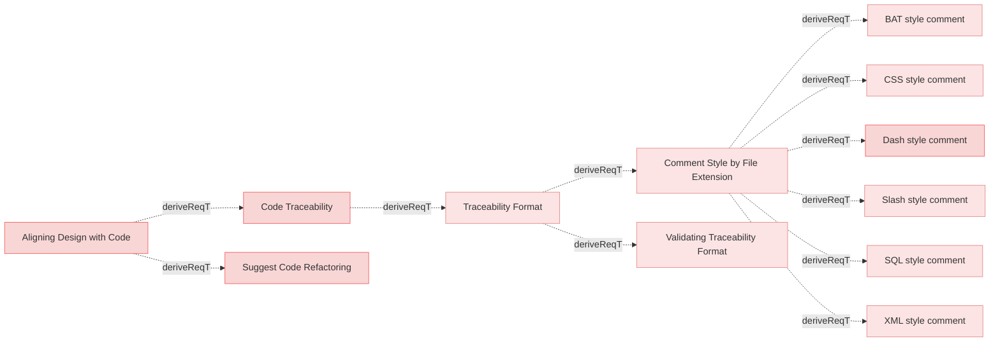

# Requirements


### BAT style comment

When a source file has a `.bat` or `.cmd` extension, the system shall use `REM` for comments.

#### Details
```
REM [reqvire::satisfies: Req1] START

echo Hello, World!

REM [reqvire::satisfies: Req1] END

```

#### Relations
  * derivedFrom: [Comment Style by File Extension](#comment-style-by-file-extension)
---

### Dash style comment

When a source file has a `.py`, `.sh`, `.rb`, or `.yml` extension, the system shall use `#` for single-line comments.

#### Details
```
# [reqvire::satisfies: Req1] START
def process_sensor_data():
    pass  # Implementation logic
# [reqvire::satisfies: Req1] END
```

#### Metadata
  * type: user-requirement

#### Relations
  * derivedFrom: [Comment Style by File Extension](#comment-style-by-file-extension)
---

### SQL style comment

When a source file has a `.sql` extension, the system shall use `--` for single-line comments.

```
-- [reqvire::satisfies: Req1] START
SELECT * FROM users;
-- [reqvire::satisfies: Req1] END
```

#### Relations
  * derivedFrom: [Comment Style by File Extension](#comment-style-by-file-extension)
---

### CSS style comment

When a source file has a `.css` or `.scss` extension, the system shall use `/* */` for comments.

#### Details
```
/* [reqvire::satisfies: Req1] START */
.button { background-color: blue; }
/* [reqvire::satisfies: Req1] END */
```

#### Relations
  * derivedFrom: [Comment Style by File Extension](#comment-style-by-file-extension)
---

### XML style comment

When a source file has a `.html`, `.xml`, or `.xsl` extension, the system shall use `<!-- -->` for comments.

#### Details
```
<!-- [reqvire::satisfies: Req1] START -->
<div> UI Component </div>
<!-- [reqvire::satisfies: Req1] END -->

```

#### Relations
  * derivedFrom: [Comment Style by File Extension](#comment-style-by-file-extension)
---

### Slash style comment

When a source file has a `.c`, `.cpp`, `.cs`, `.java`, `.js`, or `.ts` extension, the system shall use `//` for single-line comments.

#### Details
```
// [reqvire::satisfies: Req1] START
void processSensorData() {
    // Implementation logic
}
// [reqvire::satisfies: Req1] END
```

#### Relations
  * derivedFrom: [Comment Style by File Extension](#comment-style-by-file-extension)
---

### Traceability Format

When parsing a source file for traceability, the system shall identify and extract all `[reqvire::...]` markers along with their associated requirement element identifiers.

#### Details
Syntax used for `[reqvire::...]` markers:

```
[reqvire::<relation_type>: <element identifier>] START [reqvire::<relation_type>: <element idetifier>] END

```

Where:
- `<relation_type>` specifies the type of relation with only 2 types allowed:
  * satisfies
  * trace
- `<element identifier>` is the identifier of the requirement being traced.

#### Relations
  * derivedFrom: [Code Traceability](#code-traceability)
---

### Comment Style by File Extension

The system shall use different comment style based of file extension of the code source file.

#### Relations
  * derivedFrom: [Traceability Format](#traceability-format)
---

### Validating Traceability Format

While processing traceability in code, the system shall ensure that each `[reqvire::...] START` tag has a corresponding `[reqvire::...] END` tag.

#### Relations
  * derivedFrom: [Traceability Format](#traceability-format)
---

### Code Traceability

The system shall support code traceability by using structured comments to link code implementations to corresponding requirements in the MBSE model.

#### Metadata
  * type: user-requirement

#### Relations
  * derivedFrom: [Aligning Design with Code](../UserStories.md#aligning-design-with-code)
---

### Suggest Code Refactoring

The system shall suggest code refactoring opportunities to better align with the structure and relationships in the MBSE model.

#### Metadata
  * type: user-requirement

#### Relations
  * derivedFrom: [Aligning Design with Code](../UserStories.md#aligning-design-with-code)
---