# Requirements

```mermaid
graph LR;
  %% REQVIRE-AUTOGENERATED-DIAGRAM
  %% Graph styling
  classDef userRequirement fill:#f9d6d6,stroke:#f55f5f,stroke-width:1px;
  classDef systemRequirement fill:#fce4e4,stroke:#e68a8a,stroke-width:1px;
  classDef verification fill:#d6f9d6,stroke:#5fd75f,stroke-width:1px;
  classDef default fill:#f5f5f5,stroke:#333333,stroke-width:1px;

  c9211e23a87d8cf6["Automated Diagram Generation on PR Merge Verification"];
  class c9211e23a87d8cf6 verification;
  click c9211e23a87d8cf6 "DiagramGeneration.md#automated-diagram-generation-on-pr-merge-verification";
  98af8a1cf9c86822["generate_diagrams.yml"];
  class 98af8a1cf9c86822 default;
  click 98af8a1cf9c86822 "../../.github/workflows/generate_diagrams.yml";
  c9211e23a87d8cf6 -->|satisfiedBy| 98af8a1cf9c86822;
  71adfd59da9ff84f["Complete Model Structure Visualization"];
  class 71adfd59da9ff84f userRequirement;
  click 71adfd59da9ff84f "DiagramGeneration.md#complete-model-structure-visualization";
  b07859a209e66b4b["Model-Centric View Generation"];
  class b07859a209e66b4b systemRequirement;
  click b07859a209e66b4b "../Interfaces/WebInterface.md#model-centric-view-generation";
  71adfd59da9ff84f -.->|deriveReqT| b07859a209e66b4b;
  b740af57e790f8f0["Diagram Generation"];
  class b740af57e790f8f0 systemRequirement;
  click b740af57e790f8f0 "DiagramGeneration.md#diagram-generation";
  892e19ec234ec4d8["CLI Generate Diagrams Flag"];
  class 892e19ec234ec4d8 systemRequirement;
  click 892e19ec234ec4d8 "../Interfaces/CLI.md#cli-generate-diagrams-flag";
  b740af57e790f8f0 -.->|deriveReqT| 892e19ec234ec4d8;
  fe5b2cd21ded7398["Interactive Mermaid Diagram Node Behavior"];
  class fe5b2cd21ded7398 systemRequirement;
  click fe5b2cd21ded7398 "DiagramGeneration.md#interactive-mermaid-diagram-node-behavior";
  b740af57e790f8f0 -.->|deriveReqT| fe5b2cd21ded7398;
  fe680bbc91a15fb9["SysML-Compatible Relationship Rendering"];
  class fe680bbc91a15fb9 systemRequirement;
  click fe680bbc91a15fb9 "DiagramGeneration.md#sysml-compatible-relationship-rendering";
  b740af57e790f8f0 -.->|deriveReqT| fe680bbc91a15fb9;
  dad7eeb932afdb92["diagrams.rs"];
  class dad7eeb932afdb92 default;
  click dad7eeb932afdb92 "../../core/src/diagrams.rs";
  b740af57e790f8f0 -->|satisfiedBy| dad7eeb932afdb92;
  ce2625feec883e55["utils.rs"];
  class ce2625feec883e55 default;
  click ce2625feec883e55 "../../core/src/utils.rs";
  b740af57e790f8f0 -->|satisfiedBy| ce2625feec883e55;
  babbb4a0fd887157["Diagram Generation Test"];
  class babbb4a0fd887157 verification;
  click babbb4a0fd887157 "DiagramGeneration.md#diagram-generation-test";
  b740af57e790f8f0 -.->|verifiedBy| babbb4a0fd887157;
  b6df869eee5a5e8c["Diagram Relation Filtering Verification"];
  class b6df869eee5a5e8c verification;
  click b6df869eee5a5e8c "DiagramGeneration.md#diagram-relation-filtering-verification";
  b740af57e790f8f0 -.->|verifiedBy| b6df869eee5a5e8c;
  196bcb7d75f45d2b["Remove Generated Diagrams Verification"];
  class 196bcb7d75f45d2b verification;
  click 196bcb7d75f45d2b "DiagramGeneration.md#remove-generated-diagrams-verification";
  b740af57e790f8f0 -.->|verifiedBy| 196bcb7d75f45d2b;
  88a2a5cf6afe8fec["Visualize Model Relationships Verification"];
  class 88a2a5cf6afe8fec verification;
  click 88a2a5cf6afe8fec "DiagramGeneration.md#visualize-model-relationships-verification";
  b740af57e790f8f0 -.->|verifiedBy| 88a2a5cf6afe8fec;
  3df49fd1a91c3db7["test.sh"];
  class 3df49fd1a91c3db7 default;
  click 3df49fd1a91c3db7 "../../tests/test-diagram-generation/test.sh";
  babbb4a0fd887157 -->|satisfiedBy| 3df49fd1a91c3db7;
  f6a73030d877fc0f["test.sh"];
  class f6a73030d877fc0f default;
  click f6a73030d877fc0f "../../tests/test-diagram-filtering/test.sh";
  b6df869eee5a5e8c -->|satisfiedBy| f6a73030d877fc0f;
  e5bbe52f99fe7d46["Diagram Removal"];
  class e5bbe52f99fe7d46 systemRequirement;
  click e5bbe52f99fe7d46 "DiagramGeneration.md#diagram-removal";
  b3bb7792bbc95f02["CLI Remove Diagrams Flag"];
  class b3bb7792bbc95f02 systemRequirement;
  click b3bb7792bbc95f02 "../Interfaces/CLI.md#cli-remove-diagrams-flag";
  e5bbe52f99fe7d46 -.->|deriveReqT| b3bb7792bbc95f02;
  dad7eeb932afdb92["diagrams.rs"];
  class dad7eeb932afdb92 default;
  click dad7eeb932afdb92 "../../core/src/diagrams.rs";
  e5bbe52f99fe7d46 -->|satisfiedBy| dad7eeb932afdb92;
  80defdd4cbc7ee18["cli.rs"];
  class 80defdd4cbc7ee18 default;
  click 80defdd4cbc7ee18 "../../cli/src/cli.rs";
  fe5b2cd21ded7398 -->|satisfiedBy| 80defdd4cbc7ee18;
  dad7eeb932afdb92["diagrams.rs"];
  class dad7eeb932afdb92 default;
  click dad7eeb932afdb92 "../../core/src/diagrams.rs";
  fe5b2cd21ded7398 -->|satisfiedBy| dad7eeb932afdb92;
  5be870a7fe3078ce["Interactive Mermaid Diagrams"];
  class 5be870a7fe3078ce userRequirement;
  click 5be870a7fe3078ce "DiagramGeneration.md#interactive-mermaid-diagrams";
  5be870a7fe3078ce -.->|deriveReqT| b740af57e790f8f0;
  c57d76a5aa346a53["Model Visualization and Exploration"];
  class c57d76a5aa346a53 userRequirement;
  click c57d76a5aa346a53 "DiagramGeneration.md#model-visualization-and-exploration";
  ccf73e5865717df6["CLI Model Diagram Command"];
  class ccf73e5865717df6 systemRequirement;
  click ccf73e5865717df6 "../Interfaces/CLI.md#cli-model-diagram-command";
  c57d76a5aa346a53 -.->|deriveReqT| ccf73e5865717df6;
  c57d76a5aa346a53 -.->|deriveReqT| b07859a209e66b4b;
  8fccd7073a4d582["Remove Generated Diagrams"];
  class 8fccd7073a4d582 userRequirement;
  click 8fccd7073a4d582 "DiagramGeneration.md#remove-generated-diagrams";
  8fccd7073a4d582 -.->|deriveReqT| e5bbe52f99fe7d46;
  af81a7b6d75c2363["test.sh"];
  class af81a7b6d75c2363 default;
  click af81a7b6d75c2363 "../../tests/test-remove-diagrams/test.sh";
  196bcb7d75f45d2b -->|satisfiedBy| af81a7b6d75c2363;
  dad7eeb932afdb92["diagrams.rs"];
  class dad7eeb932afdb92 default;
  click dad7eeb932afdb92 "../../core/src/diagrams.rs";
  fe680bbc91a15fb9 -->|satisfiedBy| dad7eeb932afdb92;
  8c1984c480eb3d5e["Trace Relation Non-Directional Behavior"];
  class 8c1984c480eb3d5e systemRequirement;
  click 8c1984c480eb3d5e "DiagramGeneration.md#trace-relation-non-directional-behavior";
  400e3d7614d84c23["Invalid Relations Test"];
  class 400e3d7614d84c23 verification;
  click 400e3d7614d84c23 "Validation.md#invalid-relations-test";
  8c1984c480eb3d5e -.->|verifiedBy| 400e3d7614d84c23;
  15727fb61633283e["Trace Relations No Cycles Verification"];
  class 15727fb61633283e verification;
  click 15727fb61633283e "VerificationTraces.md#trace-relations-no-cycles-verification";
  8c1984c480eb3d5e -.->|verifiedBy| 15727fb61633283e;
  3df49fd1a91c3db7["test.sh"];
  class 3df49fd1a91c3db7 default;
  click 3df49fd1a91c3db7 "../../tests/test-diagram-generation/test.sh";
  88a2a5cf6afe8fec -->|satisfiedBy| 3df49fd1a91c3db7;
  80defdd4cbc7ee18["cli.rs"];
  class 80defdd4cbc7ee18 default;
  click 80defdd4cbc7ee18 "../../cli/src/cli.rs";
  892e19ec234ec4d8 -->|satisfiedBy| 80defdd4cbc7ee18;
  7ff28ff401dbaef7["CLI Help Structure Verification"];
  class 7ff28ff401dbaef7 verification;
  click 7ff28ff401dbaef7 "../Interfaces/CLI.md#cli-help-structure-verification";
  892e19ec234ec4d8 -.->|verifiedBy| 7ff28ff401dbaef7;
  892e19ec234ec4d8 -.->|verifiedBy| babbb4a0fd887157;
  80defdd4cbc7ee18["cli.rs"];
  class 80defdd4cbc7ee18 default;
  click 80defdd4cbc7ee18 "../../cli/src/cli.rs";
  b3bb7792bbc95f02 -->|satisfiedBy| 80defdd4cbc7ee18;
  b3bb7792bbc95f02 -.->|verifiedBy| 7ff28ff401dbaef7;
  b3bb7792bbc95f02 -.->|verifiedBy| 196bcb7d75f45d2b;
  ebfa0fa4fc77deab["Automated Diagram Generation on PR Merge"];
  class ebfa0fa4fc77deab systemRequirement;
  click ebfa0fa4fc77deab "GitHubIntegration.md#automated-diagram-generation-on-pr-merge";
  98af8a1cf9c86822["generate_diagrams.yml"];
  class 98af8a1cf9c86822 default;
  click 98af8a1cf9c86822 "../../.github/workflows/generate_diagrams.yml";
  ebfa0fa4fc77deab -->|satisfiedBy| 98af8a1cf9c86822;
  ebfa0fa4fc77deab -.->|verifiedBy| c9211e23a87d8cf6;
  c661b225443ae709["Relation Types and behaviors"];
  class c661b225443ae709 systemRequirement;
  click c661b225443ae709 "ModelManagement.md#relation-types-and-behaviors";
  c661b225443ae709 -.->|deriveReqT| 8c1984c480eb3d5e;
  75edbbb74412662d["Validate Relation Types"];
  class 75edbbb74412662d userRequirement;
  click 75edbbb74412662d "Validation.md#validate-relation-types";
  c661b225443ae709 -.->|deriveReqT| 75edbbb74412662d;
  9450d4313f47ef36["relation.rs"];
  class 9450d4313f47ef36 default;
  click 9450d4313f47ef36 "../../core/src/relation.rs";
  c661b225443ae709 -->|satisfiedBy| 9450d4313f47ef36;
  c8dd29521fe145e9["Element Subsection Parsing Test"];
  class c8dd29521fe145e9 verification;
  click c8dd29521fe145e9 "ParsingAndValidationVerifications.md#element-subsection-parsing-test";
  c661b225443ae709 -.->|verifiedBy| c8dd29521fe145e9;
  1c6b7180f4e0214a["Model Reports"];
  class 1c6b7180f4e0214a userRequirement;
  click 1c6b7180f4e0214a "Reporting.md#model-reports";
  59093bf57f656ef3["HTML Export"];
  class 59093bf57f656ef3 systemRequirement;
  click 59093bf57f656ef3 "../Interfaces/WebInterface.md#html-export";
  1c6b7180f4e0214a -.->|deriveReqT| 59093bf57f656ef3;
  1c6b7180f4e0214a -.->|deriveReqT| 71adfd59da9ff84f;
  1c6b7180f4e0214a -.->|deriveReqT| 5be870a7fe3078ce;
  1c6b7180f4e0214a -.->|deriveReqT| c57d76a5aa346a53;
  99d6386e6ce8f5f9["Model Structure and Summaries"];
  class 99d6386e6ce8f5f9 userRequirement;
  click 99d6386e6ce8f5f9 "Reporting.md#model-structure-and-summaries";
  1c6b7180f4e0214a -.->|deriveReqT| 99d6386e6ce8f5f9;
  9c9b9aa3155688f3["Provide Validation Reports"];
  class 9c9b9aa3155688f3 userRequirement;
  click 9c9b9aa3155688f3 "Reporting.md#provide-validation-reports";
  1c6b7180f4e0214a -.->|deriveReqT| 9c9b9aa3155688f3;
  a7bb3c1af2e2d306["Verification Coverage Report"];
  class a7bb3c1af2e2d306 userRequirement;
  click a7bb3c1af2e2d306 "Reporting.md#verification-coverage-report";
  1c6b7180f4e0214a -.->|deriveReqT| a7bb3c1af2e2d306;
  37a5b8e199a838f["Generate Diagrams"];
  class 37a5b8e199a838f userRequirement;
  click 37a5b8e199a838f "../UserStories.md#generate-diagrams";
  37a5b8e199a838f -.->|deriveReqT| 71adfd59da9ff84f;
  37a5b8e199a838f -.->|deriveReqT| 5be870a7fe3078ce;
  37a5b8e199a838f -.->|deriveReqT| c57d76a5aa346a53;
  37a5b8e199a838f -.->|deriveReqT| 8fccd7073a4d582;
```

### Diagram Generation Test

This test verifies that the generate-diagrams CLI command correctly generates and embeds mermaid diagrams in requirements documents.

#### Details

##### Acceptance Criteria
- System should process requirements files and add/update embedded mermaid diagrams
- System should create diagrams that represent relationships between elements
- System should preserve any existing custom mermaid diagrams in the documents
- System should update automatically generated diagrams when requirements change
- System should properly visualize all relationship types (verifies, trace, derives, satisfies, etc.)
- System should render relationships with appropriate arrows and formatting
- All auto-generated diagrams must include the REQVIRE-AUTOGENERATED-DIAGRAM marker for identification
- Marker should be embedded within the mermaid diagram as a comment for reliable identification

##### Test Criteria
- Command exits with success (0) return code
- Modified files contain the expected mermaid diagrams
- Custom mermaid diagrams are preserved
- Diagram content accurately reflects the relationships defined in the requirements
- All relationship types are correctly visualized with proper arrows and labels (verifies, trace, derives, satisfies)
- Special relationship types like "deriveReqT" are properly rendered
- All auto-generated diagrams contain the REQVIRE-AUTOGENERATED-DIAGRAM marker
- Marker appears as a mermaid comment within the diagram block

#### Metadata
  * type: test-verification

#### Relations
  * verify: [CLI Generate Diagrams Flag](../Interfaces/CLI.md#cli-generate-diagrams-flag)
  * verify: [Diagram Generation](#diagram-generation)
  * satisfiedBy: [test.sh](../../tests/test-diagram-generation/test.sh)
---

### Diagram Generation

When requested, the system shall automatically generate diagrams and save them to the required locations of the model.

#### Details
**Auto-Generated Diagram Identification:**
The system shall embed a unique identification marker "REQVIRE-AUTOGENERATED-DIAGRAM" as a comment within all auto-generated mermaid diagrams to distinguish them from user-created diagrams for reliable filtering and removal operations.

The marker must be:
- Embedded as a mermaid comment line using the `%% REQVIRE-AUTOGENERATED-DIAGRAM` format
- Present in every auto-generated diagram
- Used by diagram removal functionality to identify which diagrams to remove
- Not present in user-created custom diagrams

This enables the system to:
- Reliably identify auto-generated diagrams regardless of their location in documents
- Preserve user-created diagrams during removal operations
- Support mixed documents containing both auto-generated and custom diagrams

**Diagram Relation Filtering:**
The system shall implement relation filtering in diagram generation to render only forward relations while ensuring complete element hierarchy representation starting from top-level parent elements.

When generating diagrams, the system shall apply the following relation filtering rules:

1. **Diagram Relation Filtering**: Only relations specified in the DIAGRAM_RELATIONS list shall be rendered to prevent duplicate arrows representing the same logical relationship
2. **Complete Hierarchy Inclusion**: When any element in a hierarchical chain is included in a file, all parent elements up to the root of the hierarchy shall be automatically included in the diagram
3. **List-Based Rendering**: Relations shall be rendered according to the DIAGRAM_RELATIONS list which defines which relation from each opposite pair should be shown

The filtering ensures that:
- Bidirectional relationships (e.g., `derivedFrom`/`derive`) appear as single arrows using the relation specified in DIAGRAM_RELATIONS
- Hierarchical context is preserved by including parent elements even if they belong to different files
- Diagram readability is maintained while accurately representing the complete model structure

#### Relations
  * derivedFrom: [Interactive Mermaid Diagrams](#interactive-mermaid-diagrams)
  * satisfiedBy: [diagrams.rs](../../core/src/diagrams.rs)
  * satisfiedBy: [utils.rs](../../core/src/utils.rs)
---

### SysML-Compatible Relationship Rendering

The system shall implement a relationship rendering engine that adheres to SysML notation standards, defining specific arrow styles, line types, and visual properties for each relationship type to ensure diagram consistency and standards compliance.

#### Details
The visual representation and direction of relationships in diagrams aligns with the SysML specification.
Each relationship is represented using SysML standard notation with a specified arrow direction.
derive (Forward):
- Definition: Links a parent element to child elements derived from it.
- Notation: Dashed arrow with an open arrowhead.
- Arrow Direction: Parent → Child (derived)
- Used when: Parent element wants to show its derived children

derivedFrom (Backward):
- Definition: Links a child element to the parent element it is derived from.
- Notation: Dashed arrow with an open arrowhead.
- Arrow Direction: Child → Parent (source)
- Used when: Child element references its source parent

verify (Backward):
- Definition: Links a verification artifact to the requirement it verifies.
- Notation: Dashed arrow with an open arrowhead.
- Arrow Direction: Verification → Requirement
- Used when: Test/verification references the requirement it validates

verifiedBy (Forward):
- Definition: Links a requirement to verification artifacts.
- Notation: Dashed arrow with an open arrowhead.
- Arrow Direction: Requirement → Verification
- Used when: Requirement shows how it's verified

satisfy (Backward):
- Definition: Links an implementation to the requirement it satisfies.
- Notation: Solid arrow with an open arrowhead.
- Arrow Direction: Implementation → Requirement
- Used when: Implementation references the requirement it satisfies

satisfiedBy (Forward):
- Definition: Links a requirement to elements that satisfy it.
- Notation: Solid arrow with an open arrowhead.
- Arrow Direction: Requirement → Implementation
- Used when: Requirement shows how it's implemented

trace (Neutral):
- Definition: Shows a general traceability relationship without implying hierarchy.
- Notation: Dashed arrow with an open arrowhead.
- Arrow Direction: Tracing → Traced (neutral)
- Used when: Simple traceability connection is needed

**Summary Table**
| Relation        | Stereotype     | Line style            | Arrowhead               | Arrow Direction                   | Hierarchy Direction |
|-----------------|----------------|-----------------------|-------------------------|-----------------------------------|-------------------- |
| **derive**      | «deriveReqt»   | dashed dependency     | open (hollow) arrowhead | Parent → Child (derived)          | Forward             |
| **derivedFrom** | «deriveReqt»   | dashed dependency     | open (hollow) arrowhead | Child → Parent (source)           | Backward            |
| **satisfy**     | «satisfy»      | solid dependency      | open (hollow) arrowhead | Implementation → Requirement      | Backward            |
| **satisfiedBy** | «satisfy»      | solid dependency      | open (hollow) arrowhead | Requirement → Implementation      | Forward             |
| **verify**      | «verify»       | dashed dependency     | open (hollow) arrowhead | Verification → Requirement        | Backward            |
| **verifiedBy**  | «verify»       | dashed dependency     | open (hollow) arrowhead | Requirement → Verification        | Forward             |
| **trace**       | «trace»        | dashed dependency     | open (hollow) arrowhead | Tracing → Traced (neutral)        | Forward             |

#### Relations
  * derivedFrom: [Diagram Generation](#diagram-generation)
  * satisfiedBy: [diagrams.rs](../../core/src/diagrams.rs)
---

### Visualize Model Relationships Verification

This test verifies that the system provides visual representations of relationships within the MBSE model in the generated diagrams.

#### Details

##### Acceptance Criteria
- System should generate diagrams showing relationships between model elements
- Diagrams should clearly represent different relationship types
- Visual representation should aid in understanding dependencies between elements

##### Test Criteria
- Command exits with success (0) return code
- Generated diagrams contain all expected relationship types
- Relationships are visually differentiated based on their type
- Element dependencies are clearly displayed in the diagrams

#### Metadata
  * type: test-verification

#### Relations
  * verify: [Diagram Generation](#diagram-generation)
  * satisfiedBy: [test.sh](../../tests/test-diagram-generation/test.sh)
---

### Automated Diagram Generation on PR Merge Verification

This test verifies that the system automatically generates and updates diagrams when pull requests are merged to the main branch.

#### Details

##### Acceptance Criteria
- System should have a GitHub workflow that automatically generates diagrams on PR merge
- The workflow should only be triggered when PRs are merged to the main branch
- Generated diagrams should be committed back to the main branch
- The commit message should clearly indicate the automated nature of the change

##### Test Criteria
- Workflow defined in the GitHub workflow configuration correctly
- Workflow triggers only on PR merge to main branch
- Workflow correctly checks out code, builds the tool, and generates diagrams
- Workflow commits and pushes changes back to the main branch
- Commit message is informative and standardized

#### Metadata
  * type: test-verification

#### Relations
  * verify: [Automated Diagram Generation on PR Merge](GitHubIntegration.md#automated-diagram-generation-on-pr-merge)
  * satisfiedBy: [generate_diagrams.yml](../../.github/workflows/generate_diagrams.yml)
---

### Interactive Mermaid Diagrams

The system shall produce visual representations of relationships within the MBSE model in the form of Mermaid diagrams, enabling users to explore relations and understand dependencies and their impact.

#### Details
Diagram generation follows a file-based approach:
- One diagram is generated per specification file
- The diagram shows all elements in the file and their relationships
- External related resources are displayed as linked boxes to the actual resource

Color code for rendering diagrams:
- Red for requirement elements
- Yellow for resources which satisfy requirements
- Green for verification elements which verify requirements
- Light blue for boxes representing elements in other files

#### Metadata
  * type: user-requirement

#### Relations
  * derivedFrom: [Generate Diagrams](../UserStories.md#generate-diagrams)
  * derivedFrom: [Model Reports](Reporting.md#model-reports)
---

### Remove Generated Diagrams

The system shall provide functionality to remove all generated Mermaid diagrams from the model, allowing users to clean up generated artifacts when needed.

#### Metadata
  * type: user-requirement

#### Relations
  * derivedFrom: [Generate Diagrams](../UserStories.md#generate-diagrams)
---

### Diagram Relation Filtering Verification

This test verifies that the system correctly filters relations in diagram generation to render only forward relations while ensuring complete element hierarchy representation.

#### Details

##### Acceptance Criteria
- System should render only relations from DIAGRAM_RELATIONS list to prevent duplicate arrows for bidirectional relationships
- System should include parent elements in diagrams even when they belong to different files
- System should apply list-based rendering according to DIAGRAM_RELATIONS specification
- Generated diagrams should not contain both relations from opposite pairs for the same logical relationship

##### Test Criteria
- Command exits with success (0) return code
- Diagrams contain only relations specified in DIAGRAM_RELATIONS (e.g., `derive` but not `derivedFrom`)
- Bidirectional relationships appear as single arrows using the relation specified in DIAGRAM_RELATIONS
- Parent elements are included when child elements are in the file
- No duplicate arrows exist for the same logical relationship
- Arrow rendering follows the DIAGRAM_RELATIONS list specification

#### Metadata
  * type: test-verification

#### Relations
  * verify: [Diagram Generation](#diagram-generation)
  * satisfiedBy: [test.sh](../../tests/test-diagram-filtering/test.sh)
---

### Remove Generated Diagrams Verification

This test verifies that the system can remove all generated mermaid diagrams while preserving custom user-created diagrams and respecting file exclusion patterns.

#### Details

##### Acceptance Criteria
- System should remove all auto-generated mermaid diagrams identified by the REQVIRE-AUTOGENERATED-DIAGRAM marker
- System should preserve custom mermaid diagrams that do not contain the auto-generation marker
- System should respect exclusion patterns defined in .gitignore and .reqvireignore files
- System should handle files with multiple diagrams correctly, removing only marked ones
- System should work on files without any diagrams
- System should maintain file structure and content except for diagram removal
- Auto-generated diagrams must contain the REQVIRE-AUTOGENERATED-DIAGRAM marker for identification
- Marker-based identification should work regardless of diagram location in the document

##### Test Criteria
- Command exits with success (0) return code
- Auto-generated diagrams containing REQVIRE-AUTOGENERATED-DIAGRAM marker are removed from files
- Custom diagrams without the marker are preserved regardless of their location
- Files matching exclusion patterns are not processed for diagram removal
- File structure remains intact except for diagram removal
- Element text and relationships are preserved
- Section headers and element headers are preserved
- Mixed files with both auto-generated (marked) and custom (unmarked) diagrams handle removal correctly

#### Metadata
  * type: test-verification

#### Relations
  * verify: [Diagram Generation](#diagram-generation)
  * satisfiedBy: [test.sh](../../tests/test-remove-diagrams/test.sh)
---

### Trace Relation Non-Directional Behavior

The system shall treat trace relations as non-directional for circular dependency detection while maintaining their traceability purpose, ensuring that trace relations do not participate in cycle detection algorithms.

#### Details
The trace relation behavior shall include:

1. **Circular Dependency Exclusion**:
   - Trace relations shall not be traversed during circular dependency detection
   - The cycle detection algorithm shall skip trace relations to prevent false positive cycles
   - Trace relations exist solely for traceability and documentation purposes

2. **Non-Propagation Behavior**:
   - Changes shall not propagate through trace relations
   - Trace relations shall not be included in change impact analysis
   - Impact trees shall not traverse trace relation connections

3. **Bidirectional Traceability**:
   - Trace relations shall provide bidirectional navigational capability
   - Users can navigate from source to target and target to source
   - Both directions are semantically equivalent for traceability purposes

4. **Validation Behavior**:
   - Trace relations shall be validated for target existence
   - Trace relations shall not require type compatibility validation
   - Trace relations can connect any element type to any other element type

This ensures that trace relations serve their intended purpose of establishing lightweight traceability connections without creating artificial dependency constraints or participating in architectural validation logic.

#### Relations
  * derivedFrom: [Relation Types And Behaviors](ModelManagement.md#relation-types-and-behaviors)
  * verifiedBy: [Invalid Relations Test](Validation.md#invalid-relations-test)
  * verifiedBy: [Trace Relations No Cycles Verification](VerificationTraces.md#trace-relations-no-cycles-verification)
---

### Complete Model Structure Visualization

The system shall provide visualization of the complete model structure showing an element-centric view with nested relations.

#### Details
The visualization shall:
- Display elements with their properties (identifier, name, type, file location)
- Show relations nested inside elements with full target details
- Support recursive nesting for element-to-element relations
- Handle file path and external URL relations
- Provide metadata about total elements and relations
- Use consistent visual styling with mermaid diagrams showing hash-based node identifiers

The visualization helps users understand the model's logical structure, navigate relationships between elements, and explore the model from any starting point.

#### Metadata
  * type: user-requirement

#### Relations
  * derivedFrom: [Generate Diagrams](../UserStories.md#generate-diagrams)
  * derivedFrom: [Model Reports](Reporting.md#model-reports)
---

### Diagram Removal

When requested, the system shall remove all generated diagrams from the model by locating and deleting all mermaid code blocks that were automatically generated.

#### Relations
  * derivedFrom: [Remove Generated Diagrams](#remove-generated-diagrams)
  * satisfiedBy: [diagrams.rs](../../core/src/diagrams.rs)
---

### Interactive Mermaid Diagram Node Behavior

The system shall implement interactive click behavior for Mermaid diagram nodes that redirects to the referenced element.

#### Details
Clickable mermaid diagrams links by default must use relative links to the git repository.

CLI flag options must be provided that can change default behavior to use stable github repository links:
  * diagrams click links are not working on Github if not using stable github repository links
  * from another side that pollutes PR diffs thus choice must be given to the user
  * Commands that generate diagrams (`generate-diagrams`, `export`, `serve`) must expose `--links-with-blobs` CLI flag for that purpose
  * The flag defaults to `false` (use relative paths)

When generating diagram node links and when `--links-with-blobs` flag is set to `true`, the system shall:
- Use stable git repository links (`{repository-url}/blob/{commit-hash}/{file-path}`) when git repository information is available
- Fallback to relative markdown links when git repository information is not available
- Use the current commit hash to ensure links remain stable even as the repository evolves
- Match the same link format used in traceability matrices and change impact reports
- Preserve interactive behavior across all generated diagrams

The `traces` command shall always use relative paths (hardcoded to `false`, no flag needed).

The `change-impact` command shall continue to use GitHub blob URLs by default (unchanged behavior).

#### Relations
  * derivedFrom: [Diagram Generation](#diagram-generation)
  * satisfiedBy: [diagrams.rs](../../core/src/diagrams.rs)
  * satisfiedBy: [cli.rs](../../cli/src/cli.rs)
---

### Model Visualization and Exploration

Users shall be able to generate and view model structure diagrams from any starting point of the model.

#### Details
- Generate complete model structure with nested relations showing element details recursively
- Default view shows root requirements (no hierarchical parent)
- Filter from specific element using --from flag
- View both JSON and markdown output formats
- Nested structure shows relations with full target details
- Mermaid diagrams display all nested relations recursively

#### Metadata
  * type: user-requirement

#### Relations
  * derivedFrom: [Generate Diagrams](../UserStories.md#generate-diagrams)
  * derivedFrom: [Model Reports](Reporting.md#model-reports)
---
