# Requirements

```mermaid
graph LR;
  %% REQVIRE-AUTOGENERATED-DIAGRAM
  %% Graph styling
  classDef userRequirement fill:#f9d6d6,stroke:#f55f5f,stroke-width:1px;
  classDef systemRequirement fill:#fce4e4,stroke:#e68a8a,stroke-width:1px;
  classDef verification fill:#d6f9d6,stroke:#5fd75f,stroke-width:1px;
  classDef default fill:#f5f5f5,stroke:#333333,stroke-width:1px;

  fcc759d670a82bb5["Document Structure Normalization"];
  class fcc759d670a82bb5 systemRequirement;
  click fcc759d670a82bb5 "Formatting.md#document-structure-normalization";
  b7c871ab64a7059a["graph_registry.rs"];
  class b7c871ab64a7059a default;
  click b7c871ab64a7059a "../../core/src/graph_registry.rs";
  fcc759d670a82bb5 -->|satisfiedBy| b7c871ab64a7059a;
  f22d93285fcd7664["parser.rs"];
  class f22d93285fcd7664 default;
  click f22d93285fcd7664 "../../core/src/parser.rs";
  fcc759d670a82bb5 -->|satisfiedBy| f22d93285fcd7664;
  11434b30ee3de97b["Format Command Requirements Verification"];
  class 11434b30ee3de97b verification;
  click 11434b30ee3de97b "Formatting.md#format-command-requirements-verification";
  fcc759d670a82bb5 -.->|verifiedBy| 11434b30ee3de97b;
  b536f1d1c16d6734["File Pattern Exclusion for Format"];
  class b536f1d1c16d6734 systemRequirement;
  click b536f1d1c16d6734 "Formatting.md#file-pattern-exclusion-for-format";
  d67147b0311bf4fb["Excluded File Relation Validation"];
  class d67147b0311bf4fb systemRequirement;
  click d67147b0311bf4fb "Validation.md#excluded-file-relation-validation";
  b536f1d1c16d6734 -.->|deriveReqT| d67147b0311bf4fb;
  ce2625feec883e55["utils.rs"];
  class ce2625feec883e55 default;
  click ce2625feec883e55 "../../core/src/utils.rs";
  b536f1d1c16d6734 -->|satisfiedBy| ce2625feec883e55;
  eaf33ce1e6113c8a["test.sh"];
  class eaf33ce1e6113c8a default;
  click eaf33ce1e6113c8a "../../tests/test-advanced-format/test.sh";
  11434b30ee3de97b -->|satisfiedBy| eaf33ce1e6113c8a;
  416d98eefd31dee3["Format Consistency Enforcement"];
  class 416d98eefd31dee3 systemRequirement;
  click 416d98eefd31dee3 "Formatting.md#format-consistency-enforcement";
  416d98eefd31dee3 -.->|deriveReqT| fcc759d670a82bb5;
  8fbf4ca0471377ea["format.rs"];
  class 8fbf4ca0471377ea default;
  click 8fbf4ca0471377ea "../../core/src/format.rs";
  416d98eefd31dee3 -->|satisfiedBy| 8fbf4ca0471377ea;
  416d98eefd31dee3 -.->|verifiedBy| 11434b30ee3de97b;
  2cde97b8bbea0703["Formatting Output"];
  class 2cde97b8bbea0703 systemRequirement;
  click 2cde97b8bbea0703 "Formatting.md#formatting-output";
  de89d3cc32a25287["Git-Style Diff Output for Format"];
  class de89d3cc32a25287 userRequirement;
  click de89d3cc32a25287 "Formatting.md#git-style-diff-output-for-format";
  2cde97b8bbea0703 -.->|deriveReqT| de89d3cc32a25287;
  e69395f926bba6a5["diff.rs"];
  class e69395f926bba6a5 default;
  click e69395f926bba6a5 "../../core/src/diff.rs";
  de89d3cc32a25287 -->|satisfiedBy| e69395f926bba6a5;
  8fbf4ca0471377ea["format.rs"];
  class 8fbf4ca0471377ea default;
  click 8fbf4ca0471377ea "../../core/src/format.rs";
  de89d3cc32a25287 -->|satisfiedBy| 8fbf4ca0471377ea;
  de89d3cc32a25287 -.->|verifiedBy| 11434b30ee3de97b;
  8a37a2f2cdcda820["Model Formatting"];
  class 8a37a2f2cdcda820 userRequirement;
  click 8a37a2f2cdcda820 "Formatting.md#model-formatting";
  e21c06baba741337["Format Command"];
  class e21c06baba741337 systemRequirement;
  click e21c06baba741337 "../Interfaces/CLI.md#format-command";
  8a37a2f2cdcda820 -.->|deriveReqT| e21c06baba741337;
  8a37a2f2cdcda820 -.->|deriveReqT| 416d98eefd31dee3;
  8a37a2f2cdcda820 -.->|deriveReqT| 2cde97b8bbea0703;
  1869a2ddda635001["Replace Absolute Links with Relative Links"];
  class 1869a2ddda635001 systemRequirement;
  click 1869a2ddda635001 "Formatting.md#replace-absolute-links-with-relative-links";
  8a37a2f2cdcda820 -.->|deriveReqT| 1869a2ddda635001;
  1869a2ddda635001 -.->|verifiedBy| 11434b30ee3de97b;
  80defdd4cbc7ee18["cli.rs"];
  class 80defdd4cbc7ee18 default;
  click 80defdd4cbc7ee18 "../../cli/src/cli.rs";
  e21c06baba741337 -->|satisfiedBy| 80defdd4cbc7ee18;
  7ff28ff401dbaef7["CLI Help Structure Verification"];
  class 7ff28ff401dbaef7 verification;
  click 7ff28ff401dbaef7 "../Interfaces/CLI.md#cli-help-structure-verification";
  e21c06baba741337 -.->|verifiedBy| 7ff28ff401dbaef7;
  e21c06baba741337 -.->|verifiedBy| 11434b30ee3de97b;
  4eac83ebf624008b["Ignoring Unstructured Documents"];
  class 4eac83ebf624008b systemRequirement;
  click 4eac83ebf624008b "Configuration.md#ignoring-unstructured-documents";
  51f6a669348ab400["Ignore Files Integration"];
  class 51f6a669348ab400 systemRequirement;
  click 51f6a669348ab400 "Configuration.md#ignore-files-integration";
  4eac83ebf624008b -.->|deriveReqT| 51f6a669348ab400;
  2de3037d86c97be2["Requirements Processing"];
  class 2de3037d86c97be2 systemRequirement;
  click 2de3037d86c97be2 "Configuration.md#requirements-processing";
  4eac83ebf624008b -.->|deriveReqT| 2de3037d86c97be2;
  65dfd6faa150fe4["Reserved Repository Files Exclusion"];
  class 65dfd6faa150fe4 systemRequirement;
  click 65dfd6faa150fe4 "Configuration.md#reserved-repository-files-exclusion";
  4eac83ebf624008b -.->|deriveReqT| 65dfd6faa150fe4;
  4eac83ebf624008b -.->|deriveReqT| b536f1d1c16d6734;
  8419dcc77d92b609["config.rs"];
  class 8419dcc77d92b609 default;
  click 8419dcc77d92b609 "../../cli/src/config.rs";
  4eac83ebf624008b -->|satisfiedBy| 8419dcc77d92b609;
  9da2c9df563c07bb["Structure and Addressing in Markdown Documents"];
  class 9da2c9df563c07bb systemRequirement;
  click 9da2c9df563c07bb "StructureAndParsing.md#structure-and-addressing-in-markdown-documents";
  39b03efc9e2074f5["Create Element Operation"];
  class 39b03efc9e2074f5 systemRequirement;
  click 39b03efc9e2074f5 "ElementManipulation.md#create-element-operation";
  9da2c9df563c07bb -.->|deriveReqT| 39b03efc9e2074f5;
  af98a411c9028161["Element Identity Model"];
  class af98a411c9028161 systemRequirement;
  click af98a411c9028161 "StructureAndParsing.md#element-identity-model";
  9da2c9df563c07bb -.->|deriveReqT| af98a411c9028161;
  1d0bfcae44a9063["Reserved Subsections Support"];
  class 1d0bfcae44a9063 systemRequirement;
  click 1d0bfcae44a9063 "Subsections.md#reserved-subsections-support";
  9da2c9df563c07bb -.->|deriveReqT| 1d0bfcae44a9063;
  a814c4935e1a0449["element.rs"];
  class a814c4935e1a0449 default;
  click a814c4935e1a0449 "../../core/src/element.rs";
  9da2c9df563c07bb -->|satisfiedBy| a814c4935e1a0449;
  d50a859650933e55["model.rs"];
  class d50a859650933e55 default;
  click d50a859650933e55 "../../core/src/model.rs";
  9da2c9df563c07bb -->|satisfiedBy| d50a859650933e55;
  f22d93285fcd7664["parser.rs"];
  class f22d93285fcd7664 default;
  click f22d93285fcd7664 "../../core/src/parser.rs";
  9da2c9df563c07bb -->|satisfiedBy| f22d93285fcd7664;
  9450d4313f47ef36["relation.rs"];
  class 9450d4313f47ef36 default;
  click 9450d4313f47ef36 "../../core/src/relation.rs";
  9da2c9df563c07bb -->|satisfiedBy| 9450d4313f47ef36;
  398003c91b6b2cde["subsection.rs"];
  class 398003c91b6b2cde default;
  click 398003c91b6b2cde "../../core/src/subsection.rs";
  9da2c9df563c07bb -->|satisfiedBy| 398003c91b6b2cde;
  9da2c9df563c07bb -.->|verifiedBy| 11434b30ee3de97b;
  2fc995cfff6720de["Invalid Header Structure Test"];
  class 2fc995cfff6720de verification;
  click 2fc995cfff6720de "Validation.md#invalid-header-structure-test";
  9da2c9df563c07bb -.->|verifiedBy| 2fc995cfff6720de;
  b3410eccc9703232["Align with Industry Standards"];
  class b3410eccc9703232 userRequirement;
  click b3410eccc9703232 "../UserStories.md#align-with-industry-standards";
  b3410eccc9703232 -.->|deriveReqT| 416d98eefd31dee3;
  9c9b9aa3155688f3["Provide Validation Reports"];
  class 9c9b9aa3155688f3 userRequirement;
  click 9c9b9aa3155688f3 "Reporting.md#provide-validation-reports";
  b3410eccc9703232 -.->|deriveReqT| 9c9b9aa3155688f3;
  637c1508441834d0["Validate Cross-Component Dependencies"];
  class 637c1508441834d0 userRequirement;
  click 637c1508441834d0 "Validation.md#validate-cross-component-dependencies";
  b3410eccc9703232 -.->|deriveReqT| 637c1508441834d0;
  93dfcb0f0d842641["Validate Internal Consistency"];
  class 93dfcb0f0d842641 userRequirement;
  click 93dfcb0f0d842641 "Validation.md#validate-internal-consistency";
  b3410eccc9703232 -.->|deriveReqT| 93dfcb0f0d842641;
  7acb63b03cf52c6f["Validate Markdown Structure"];
  class 7acb63b03cf52c6f userRequirement;
  click 7acb63b03cf52c6f "Validation.md#validate-markdown-structure";
  b3410eccc9703232 -.->|deriveReqT| 7acb63b03cf52c6f;
  75edbbb74412662d["Validate Relation Types"];
  class 75edbbb74412662d userRequirement;
  click 75edbbb74412662d "Validation.md#validate-relation-types";
  b3410eccc9703232 -.->|deriveReqT| 75edbbb74412662d;
  113748a94885138d["Validating Structures"];
  class 113748a94885138d userRequirement;
  click 113748a94885138d "../UserStories.md#validating-structures";
  113748a94885138d -.->|deriveReqT| 8a37a2f2cdcda820;
  2158f3cb9fd89442["Model Linting"];
  class 2158f3cb9fd89442 userRequirement;
  click 2158f3cb9fd89442 "Linting.md#model-linting";
  113748a94885138d -.->|deriveReqT| 2158f3cb9fd89442;
  f7984d9de36af48f["Enhanced Validation Error Reporting"];
  class f7984d9de36af48f userRequirement;
  click f7984d9de36af48f "Validation.md#enhanced-validation-error-reporting";
  113748a94885138d -.->|deriveReqT| f7984d9de36af48f;
  113748a94885138d -.->|deriveReqT| 637c1508441834d0;
  500b81dacddd4c4f["Validate Filesystem Structure"];
  class 500b81dacddd4c4f userRequirement;
  click 500b81dacddd4c4f "Validation.md#validate-filesystem-structure";
  113748a94885138d -.->|deriveReqT| 500b81dacddd4c4f;
  113748a94885138d -.->|deriveReqT| 93dfcb0f0d842641;
  113748a94885138d -.->|deriveReqT| 7acb63b03cf52c6f;
  113748a94885138d -.->|deriveReqT| 75edbbb74412662d;
```

### Model Formatting

The system shall provide formatting capabilities to normalize and standardize MBSE models for consistency and readability.

#### Metadata
  * type: user-requirement

#### Relations
  * derivedFrom: [Validating Structures](../UserStories.md#validating-structures)
---

### Formatting Output

The system shall display formatting changes suggestion in similar manner as git diffs.

#### Relations
  * derivedFrom: [Model Formatting](#model-formatting)
---

### Format Consistency Enforcement

The system shall provide formatting capability to ensure consistent formatting in requirements documents.

#### Details
The system shall implement the following formatting fixes:

**Excess Whitespace:**
- Detect and fix excess whitespace after element headers, subsection headers, and relation identifiers
- Maintain consistent formatting across all requirements documents

**Inconsistent Newlines:**
- Detect and fix excess or missing newlines before element headers and subsection headers
- Normalize to exactly two newlines before subsections (e.g., "#### Details")
- Maintain consistent formatting across all requirements documents

**Missing Separators:**
- Detect consecutive element sections that lack a separator line (---) between them
- Insert the separator to maintain consistent visual separation in the documentation
- Automatically insert separator lines between elements if not already present
- Normalize consecutive separators to single separators

**Reserved Subsections:**
- Identify and fix inconsistent indentation and bullet types in relation lists and other reserved subsections
- Ensure consistent indentation in relation lists (2-space format)
- Normalize relation entries to proper 2-space indentation format
- Standardize to a consistent format across all requirements documents

**Output Formatting:**
- Display changes with sequential line numbering that reflects final file positions
- Provide context lines with proper line number continuity

#### Relations
  * derivedFrom: [Model Formatting](#model-formatting)
  * derivedFrom: [Align with Industry Standards](../UserStories.md#align-with-industry-standards)
  * satisfiedBy: [format.rs](../../core/src/format.rs)
  * verifiedBy: [Format Command Requirements Verification](#format-command-requirements-verification)
---

### Format Command Requirements Verification

This test verifies the format command requirements from SystemRequirements and UserRequirements, focusing on normalizing and standardizing MBSE models for consistency and readability.

#### Details

##### Acceptance Criteria
**Format Command Functionality:**
- System shall provide format command that normalizes and standardizes markdown documents
- System shall default to dry-run mode (preview changes without applying them)
- System shall require --fix flag to actually apply formatting changes to files
- System shall display changes in git diff style with line numbers and colors
- System shall show diff output in both preview mode and when applying changes with --fix
- System shall support --json flag for structured output of formatting results
- System shall preserve all document content while improving formatting consistency

**Content Preservation:**
- System shall preserve personas sections and other non-element content
- System shall maintain element ordering within files
- System shall preserve page content (frontmatter before first element)

**Formatting Consistency:**
- System shall trim excess whitespace from lines
- System shall normalize line endings consistently
- System shall insert proper separators between elements
- System shall normalize consecutive separators to single separators
- System shall normalize relation indentation to proper 2-space format
- System shall format relation links with human-readable names
- System shall clean up file references to show filename only for implementation files

**Document Structure Normalization:**
- System shall always output `# Requirements` as the page header
- System shall add `## Requirements` section header when elements exist without section header
- System shall preserve existing section headers (starting with `## `)
- System shall correctly distinguish level 1 headers from level 2+ headers

**Change Preview Quality:**
- System shall show file identification clearly in change output
- System shall display line references with consistent width based on maximum line number

**Known Limitations:**
- Diff output may not correctly display blank line additions in all cases (blank lines shown with ␤ character may have incorrect line numbering or positioning)
- System shall visualize trailing whitespace removal with special characters
- System shall use colors to distinguish additions (green) and removals (red)
- System shall group changes by file with clear separators
- System shall only show lines that have changes, omitting unchanged content
- System shall provide context lines before and after changes for better readability
- System shall maintain sequential line numbering that reflects final file positions
- System shall ensure line number continuity throughout diff output

**Relation Link Enhancement:**
- System shall convert simple identifiers (non-markdown format) to proper markdown link format
- System shall convert absolute links to relative links where appropriate
- System shall preserve already correct relative links without modification
- System shall replace fragment-only same-file references with full element names
- System shall convert implementation file paths to clean filename references
- System shall preserve external URLs without modification

##### Test Criteria
1. **Basic format functionality**
   - Format command runs successfully on test markdown files
   - Default mode (no --fix flag) shows preview without making changes
   - --fix flag applies changes correctly
   - Format command shows diff output in both preview and --fix modes
   - JSON flag produces structured output with formatting results

2. **Content preservation verification**
   - Personas sections remain intact after formatting
   - Element content and structure preserved
   - Element ordering maintained correctly within files
   - Page content preserved

3. **Change detection and preview**
   - Changes are clearly identified by file
   - Line references include consistent number width
   - Trailing whitespace removal is visualized
   - Color coding distinguishes addition/removal changes
   - Context lines provide readable context around changes
   - Line numbering maintains sequential continuity reflecting final file positions

4. **Relation link quality**
   - Simple identifiers are converted to proper markdown link format
   - Absolute links are converted to relative links where appropriate
   - Already correct relative links remain unchanged
   - Same-file references use human-readable element names
   - Implementation file references show clean filenames
   - Fragment references use proper notation

5. **Formatting consistency**
   - Excess whitespace is trimmed appropriately
   - Separators are inserted correctly between elements
   - Consecutive separators are normalized to single separators
   - Relation indentation is normalized to proper 2-space format
   - Line endings are normalized

6. **Line numbering accuracy**
   - Line numbers in diff output are sequential and consistent
   - Context lines maintain proper numbering continuity
   - Added lines show correct position in final file
   - Line numbering reflects final file structure accurately

#### Metadata
  * type: test-verification

#### Relations
  * verify: [Format Command](../Interfaces/CLI.md#format-command)
  * verify: [Document Structure Normalization](#document-structure-normalization)
  * verify: [Structure And Addressing In Markdown Documents](StructureAndParsing.md#structure-and-addressing-in-markdown-documents)
  * satisfiedBy: [test.sh](../../tests/test-advanced-format/test.sh)
---

### Replace Absolute Links with Relative Links

The system shall replace absolute links with relative links, where applicable and contextually appropriate, to conform to repository standards and enhance portability.

#### Relations
  * derivedFrom: [Model Formatting](#model-formatting)
  * verifiedBy: [Format Command Requirements Verification](#format-command-requirements-verification)
---

### Git-Style Diff Output for Format

The system shall display formatting change suggestions in a git-style diff format, color-coded when possible, to clearly show what modifications will be or have been made to the documents.

#### Metadata
  * type: user-requirement

#### Relations
  * derivedFrom: [Formatting Output](#formatting-output)
  * satisfiedBy: [format.rs](../../core/src/format.rs)
  * satisfiedBy: [diff.rs](../../core/src/diff.rs)
  * verifiedBy: [Format Command Requirements Verification](#format-command-requirements-verification)
---

### File Pattern Exclusion for Format

The system shall respect configured excluded filename patterns when performing formatting operations, ensuring that files intentionally excluded from processing do not receive inappropriate formatting suggestions.

#### Relations
  * derivedFrom: [Ignoring Unstructured Documents](Configuration.md#ignoring-unstructured-documents)
  * satisfiedBy: [utils.rs](../../core/src/utils.rs)
---

### Document Structure Normalization

When generating formatted output, the system shall ensure all documents follow a consistent hierarchical structure.

#### Details
When generating formatted output, the system shall:
- Always output `# Requirements` as the page header (all specification files must have this header)
- Add a default section header `## Requirements` when elements exist without an explicit section header
- Preserve existing section headers when present (starting with `## `)
- Correctly distinguish between level 1 headers (`# `) and level 2 or deeper headers (`##`, `###`)

**Default Header Names:**
- Page header: Always `# Requirements` (required for all specification files)
- Section header: "Requirements" (the default section name used by parser)

**Normalization Rules:**
1. If document has `# Requirements` then `###` (no `##`): Add section header only
2. If document has `# Requirements` and `##`: No header additions needed

#### Relations
  * derivedFrom: [Format Consistency Enforcement](#format-consistency-enforcement)
  * satisfiedBy: [graph_registry.rs](../../core/src/graph_registry.rs)
  * satisfiedBy: [parser.rs](../../core/src/parser.rs)
---
