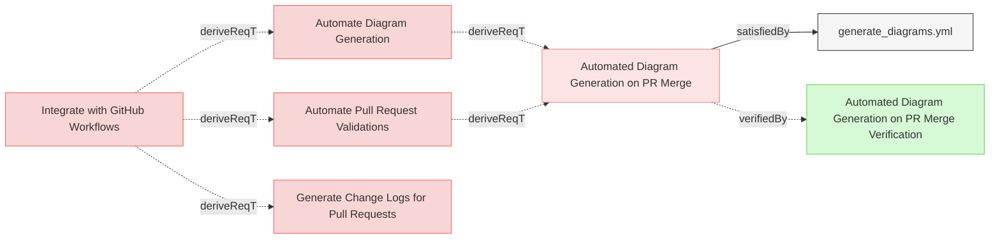

# Requirements

### Automate Pull Request Validations

The system shall automate validations of pull requests in the GitHub workflow to ensure model consistency before merging.

#### Metadata
  * type: user-requirement

#### Relations
  * derivedFrom: [Integrate with GitHub Workflows](../UserStories.md#integrate-with-github-workflows)
---

### Generate Change Logs for Pull Requests

The system shall generate detailed change logs for pull requests, summarizing modifications to the MBSE model and related components.

#### Metadata
  * type: user-requirement

#### Relations
  * derivedFrom: [Integrate with GitHub Workflows](../UserStories.md#integrate-with-github-workflows)
---

### Automate Diagram Generation

The system shall automate generation of diagrams in the GitHub workflow on PR merge event, so that the diagrams are always accessible and up-to-date.

#### Metadata
  * type: user-requirement

#### Relations
  * derivedFrom: [Integrate with GitHub Workflows](../UserStories.md#integrate-with-github-workflows)
---

### Automated Diagram Generation on PR Merge

The system shall implement a GitHub workflow that automatically generates and commits updated diagrams when pull requests are merged to the main branch.

#### Details
The GitHub workflow shall:
- Be triggered only when a pull request is merged to the main branch (not on PR creation or updates)
- Check out the latest code from the main branch post-merge
- Build the Reqvire tool from source
- Run the diagram generation process using the `--generate-diagrams` flag
- Check if any diagrams have been added or modified
- Commit any updated files with a standardized commit message
- Push the updates back to the main branch

This ensures that the Mermaid diagrams in the repository are always up-to-date after changes are merged to the main branch, providing accurate visual representations of the latest model state without requiring manual intervention.

#### Relations
  * derivedFrom: [Automate Diagram Generation](#automate-diagram-generation)
  * derivedFrom: [Automate Pull Request Validations](#automate-pull-request-validations)
  * satisfiedBy: [generate_diagrams.yml](../../.github/workflows/generate_diagrams.yml)
---