# Requirements

```mermaid
graph LR;
  %% REQVIRE-AUTOGENERATED-DIAGRAM
  %% Graph styling
  classDef userRequirement fill:#f9d6d6,stroke:#f55f5f,stroke-width:1px;
  classDef systemRequirement fill:#fce4e4,stroke:#e68a8a,stroke-width:1px;
  classDef verification fill:#d6f9d6,stroke:#5fd75f,stroke-width:1px;
  classDef default fill:#f5f5f5,stroke:#333333,stroke-width:1px;

  fc73aaf423ccdbca["Coexistence of Structured and Unstructured Documents"];
  class fc73aaf423ccdbca userRequirement;
  click fc73aaf423ccdbca "ModelManagement.md#coexistence-of-structured-and-unstructured-documents";
  4eac83ebf624008b["Ignoring Unstructured Documents"];
  class 4eac83ebf624008b systemRequirement;
  click 4eac83ebf624008b "Configuration.md#ignoring-unstructured-documents";
  fc73aaf423ccdbca -.->|deriveReqT| 4eac83ebf624008b;
  6809edf871add06a["Default Requirement Type Assignment"];
  class 6809edf871add06a userRequirement;
  click 6809edf871add06a "ModelManagement.md#default-requirement-type-assignment";
  c8dd29521fe145e9["Element Subsection Parsing Test"];
  class c8dd29521fe145e9 verification;
  click c8dd29521fe145e9 "ParsingAndValidationVerifications.md#element-subsection-parsing-test";
  6809edf871add06a -.->|verifiedBy| c8dd29521fe145e9;
  424094088fafec1f["Default Element Type Assignment Test"];
  class 424094088fafec1f verification;
  click 424094088fafec1f "Validation.md#default-element-type-assignment-test";
  6809edf871add06a -.->|verifiedBy| 424094088fafec1f;
  dd224415c58ae90f["Efficient Processing"];
  class dd224415c58ae90f userRequirement;
  click dd224415c58ae90f "ModelManagement.md#efficient-processing";
  8653ca8c1766105d["Element Manipulation Operations"];
  class 8653ca8c1766105d userRequirement;
  click 8653ca8c1766105d "ModelManagement.md#element-manipulation-operations";
  a8be62c9929ecba6["Element Manipulation File Persistence"];
  class a8be62c9929ecba6 systemRequirement;
  click a8be62c9929ecba6 "ElementManipulation.md#element-manipulation-file-persistence";
  8653ca8c1766105d -.->|deriveReqT| a8be62c9929ecba6;
  79981da8cf61470b["Relation Consistency Maintenance"];
  class 79981da8cf61470b systemRequirement;
  click 79981da8cf61470b "ElementManipulation.md#relation-consistency-maintenance";
  8653ca8c1766105d -.->|deriveReqT| 79981da8cf61470b;
  aabdd633a10c716b["Target Location Validation and Auto-Creation"];
  class aabdd633a10c716b systemRequirement;
  click aabdd633a10c716b "ElementManipulation.md#target-location-validation-and-auto-creation";
  8653ca8c1766105d -.->|deriveReqT| aabdd633a10c716b;
  674b333d552bcab0["Git Repository as Project Root"];
  class 674b333d552bcab0 userRequirement;
  click 674b333d552bcab0 "ModelManagement.md#git-repository-as-project-root";
  4fd92091a4cfac13["Subdirectory Processing Option"];
  class 4fd92091a4cfac13 systemRequirement;
  click 4fd92091a4cfac13 "../Interfaces/CLI.md#subdirectory-processing-option";
  674b333d552bcab0 -.->|deriveReqT| 4fd92091a4cfac13;
  674b333d552bcab0 -.->|deriveReqT| aabdd633a10c716b;
  c661b225443ae709["Relation Types and behaviors"];
  class c661b225443ae709 systemRequirement;
  click c661b225443ae709 "ModelManagement.md#relation-types-and-behaviors";
  8c1984c480eb3d5e["Trace Relation Non-Directional Behavior"];
  class 8c1984c480eb3d5e systemRequirement;
  click 8c1984c480eb3d5e "DiagramGeneration.md#trace-relation-non-directional-behavior";
  c661b225443ae709 -.->|deriveReqT| 8c1984c480eb3d5e;
  75edbbb74412662d["Validate Relation Types"];
  class 75edbbb74412662d userRequirement;
  click 75edbbb74412662d "Validation.md#validate-relation-types";
  c661b225443ae709 -.->|deriveReqT| 75edbbb74412662d;
  9450d4313f47ef36["relation.rs"];
  class 9450d4313f47ef36 default;
  click 9450d4313f47ef36 "../../core/src/relation.rs";
  c661b225443ae709 -->|satisfiedBy| 9450d4313f47ef36;
  c661b225443ae709 -.->|verifiedBy| c8dd29521fe145e9;
  c80ab353c1242f1f["Supported Element Types"];
  class c80ab353c1242f1f systemRequirement;
  click c80ab353c1242f1f "ModelManagement.md#supported-element-types";
  a814c4935e1a0449["element.rs"];
  class a814c4935e1a0449 default;
  click a814c4935e1a0449 "../../core/src/element.rs";
  c80ab353c1242f1f -->|satisfiedBy| a814c4935e1a0449;
  f22d93285fcd7664["parser.rs"];
  class f22d93285fcd7664 default;
  click f22d93285fcd7664 "../../core/src/parser.rs";
  c80ab353c1242f1f -->|satisfiedBy| f22d93285fcd7664;
  c80ab353c1242f1f -.->|verifiedBy| c8dd29521fe145e9;
  1d5ad841d768c48["Template-Based Model Bootstrapping"];
  class 1d5ad841d768c48 userRequirement;
  click 1d5ad841d768c48 "ModelManagement.md#template-based-model-bootstrapping";
  b0ca2a8e86aafe4b["Verification Type Categories"];
  class b0ca2a8e86aafe4b systemRequirement;
  click b0ca2a8e86aafe4b "ModelManagement.md#verification-type-categories";
  6e6ce5b5e93ac423["Identifiers and Relations"];
  class 6e6ce5b5e93ac423 systemRequirement;
  click 6e6ce5b5e93ac423 "StructureAndParsing.md#identifiers-and-relations";
  6e6ce5b5e93ac423 -.->|deriveReqT| c661b225443ae709;
  9450d4313f47ef36["relation.rs"];
  class 9450d4313f47ef36 default;
  click 9450d4313f47ef36 "../../core/src/relation.rs";
  6e6ce5b5e93ac423 -->|satisfiedBy| 9450d4313f47ef36;
  400e3d7614d84c23["Invalid Relations Test"];
  class 400e3d7614d84c23 verification;
  click 400e3d7614d84c23 "Validation.md#invalid-relations-test";
  6e6ce5b5e93ac423 -.->|verifiedBy| 400e3d7614d84c23;
  1d0bfcae44a9063["Reserved Subsections Support"];
  class 1d0bfcae44a9063 systemRequirement;
  click 1d0bfcae44a9063 "Subsections.md#reserved-subsections-support";
  a957c400a0de2045["Attachment Commands"];
  class a957c400a0de2045 systemRequirement;
  click a957c400a0de2045 "../Interfaces/CLI.md#attachment-commands";
  1d0bfcae44a9063 -.->|deriveReqT| a957c400a0de2045;
  e342a2a82ef67934["CLI Search Command"];
  class e342a2a82ef67934 systemRequirement;
  click e342a2a82ef67934 "../Interfaces/CLI.md#cli-search-command";
  1d0bfcae44a9063 -.->|deriveReqT| e342a2a82ef67934;
  1d0bfcae44a9063 -.->|deriveReqT| c80ab353c1242f1f;
  1d0bfcae44a9063 -.->|deriveReqT| b0ca2a8e86aafe4b;
  a814c4935e1a0449["element.rs"];
  class a814c4935e1a0449 default;
  click a814c4935e1a0449 "../../core/src/element.rs";
  1d0bfcae44a9063 -->|satisfiedBy| a814c4935e1a0449;
  f22d93285fcd7664["parser.rs"];
  class f22d93285fcd7664 default;
  click f22d93285fcd7664 "../../core/src/parser.rs";
  1d0bfcae44a9063 -->|satisfiedBy| f22d93285fcd7664;
  a4d507bff359d303["Attachment Output Rendering Verification"];
  class a4d507bff359d303 verification;
  click a4d507bff359d303 "AttachmentsVerifications.md#attachment-output-rendering-verification";
  1d0bfcae44a9063 -.->|verifiedBy| a4d507bff359d303;
  f7ea2ade9f0cb1fe["Attachments Subsection Parsing Verification"];
  class f7ea2ade9f0cb1fe verification;
  click f7ea2ade9f0cb1fe "AttachmentsVerifications.md#attachments-subsection-parsing-verification";
  1d0bfcae44a9063 -.->|verifiedBy| f7ea2ade9f0cb1fe;
  71fc5a8b1616ecd["Attachments Validation Verification"];
  class 71fc5a8b1616ecd verification;
  click 71fc5a8b1616ecd "AttachmentsVerifications.md#attachments-validation-verification";
  1d0bfcae44a9063 -.->|verifiedBy| 71fc5a8b1616ecd;
  1d0bfcae44a9063 -.->|verifiedBy| c8dd29521fe145e9;
  3f1b65e8cdc9ec2["Managing System Models"];
  class 3f1b65e8cdc9ec2 userRequirement;
  click 3f1b65e8cdc9ec2 "../UserStories.md#managing-system-models";
  1ac3e4fc194fd9d["CLI interface"];
  class 1ac3e4fc194fd9d userRequirement;
  click 1ac3e4fc194fd9d "../Interfaces/Interfaces.md#cli-interface";
  3f1b65e8cdc9ec2 -.->|deriveReqT| 1ac3e4fc194fd9d;
  adfe41db00d52285["Web Interface"];
  class adfe41db00d52285 userRequirement;
  click adfe41db00d52285 "../Interfaces/Interfaces.md#web-interface";
  3f1b65e8cdc9ec2 -.->|deriveReqT| adfe41db00d52285;
  3f1b65e8cdc9ec2 -.->|deriveReqT| fc73aaf423ccdbca;
  3f1b65e8cdc9ec2 -.->|deriveReqT| 6809edf871add06a;
  3f1b65e8cdc9ec2 -.->|deriveReqT| dd224415c58ae90f;
  3f1b65e8cdc9ec2 -.->|deriveReqT| 8653ca8c1766105d;
  3f1b65e8cdc9ec2 -.->|deriveReqT| 674b333d552bcab0;
  3f1b65e8cdc9ec2 -.->|deriveReqT| c661b225443ae709;
  3f1b65e8cdc9ec2 -.->|deriveReqT| 1d5ad841d768c48;
  8621d0377762987f["Specification File Identification"];
  class 8621d0377762987f systemRequirement;
  click 8621d0377762987f "StructureAndParsing.md#specification-file-identification";
  3f1b65e8cdc9ec2 -.->|deriveReqT| 8621d0377762987f;
  9da2c9df563c07bb["Structure and Addressing in Markdown Documents"];
  class 9da2c9df563c07bb systemRequirement;
  click 9da2c9df563c07bb "StructureAndParsing.md#structure-and-addressing-in-markdown-documents";
  3f1b65e8cdc9ec2 -.->|deriveReqT| 9da2c9df563c07bb;
  8c8c33ba0c6249d1["AI-Assisted System Model Management"];
  class 8c8c33ba0c6249d1 userRequirement;
  click 8c8c33ba0c6249d1 "../UserStories.md#ai-assisted-system-model-management";
  3f1b65e8cdc9ec2 -.->|deriveReqT| 8c8c33ba0c6249d1;
  fb0bd4dff95f6353["Promote Automation and Efficiency"];
  class fb0bd4dff95f6353 userRequirement;
  click fb0bd4dff95f6353 "../UserStories.md#promote-automation-and-efficiency";
  fb0bd4dff95f6353 -.->|deriveReqT| dd224415c58ae90f;
  98eaeddc27f99e11["Integrate with GitHub Workflows"];
  class 98eaeddc27f99e11 userRequirement;
  click 98eaeddc27f99e11 "../UserStories.md#integrate-with-github-workflows";
  fb0bd4dff95f6353 -.->|deriveReqT| 98eaeddc27f99e11;
```


### Coexistence of Structured and Unstructured Documents

The system shall allow structured markdown and unstructured. (eg., markdown, PDFs, DOCX, raw text) documents to coexist within the same MBSE model.

#### Metadata
  * type: user-requirement

#### Relations
  * derivedFrom: [Managing System Models](../UserStories.md#managing-system-models)
---

### Relation Types and behaviors

The system shall implement relations following clearly defined specifications for types and behaviors.

#### Details
<details>
<summary>View Full Specification</summary>


## Relation Type Definition

A relation type in Reqvire:
- Defines a semantic connection between elements
- Specifies the directionality of the relationship
- Determines change propagation behavior
- May have an opposite/inverse relation type

## Core Concepts

### Relation Usage Categories

Relations are categorized by their usage in different system functions:

1. **Diagram Rendering** - Relations that are rendered in visual diagrams to avoid duplicate arrows
   - Only one relation from each opposite pair is shown (e.g., `derive` but not `derivedFrom`)
   - Those are: `derive`, `satisfiedBy`, `verifiedBy`, `trace`

2. **Change Propagation** - Relations through which changes propagate to dependent elements
   - When an element changes, impact flows through these relation types
   - Those are: `derive`, `satisfiedBy`, `verifiedBy`

3. **Verification traces**: Relations through which propagation from the verification element to requirements in traced (verification roll-up)
   - Trace which requirements verification verifies: directly or indirecty  
     - Parents inherit status from children via «derive» (e.g., ALL children verified => parent Verified).  
   - Those are: `derivedFrom`

## Comprehensive Relation Type Table

| Relation Type | Opposite Type | Diagram Rendering | Change Propagation | Description |
|---------------|---------------|-------------------|-------------------|-------------|
| **derivedFrom** | derive | No | No | Links a child element to the parent element it is derived from |
| **derive** | derivedFrom | Yes | Yes | Links a parent element to child elements derived from it |
| **satisfiedBy** | satisfy | Yes | Yes | Links a requirement to elements that satisfy it |
| **satisfy** | satisfiedBy | No | No | Links an implementation to the requirement it satisfies |
| **verifiedBy** | verify | Yes | Yes | Links a requirement to verification artifacts |
| **verify** | verifiedBy | No | No | Links a verification artifact to the requirement it verifies |
| **trace** | None | Yes | No | Establishes a trace relationship without change propagation |

## Relation Categories

Relations are grouped into logical categories based on their semantic meaning:

### 1. Hierarchical/Transitive Relations

These relations define hierarchical structures and transitive ancestry within the model:
- **derivedFrom/derive**: Derivation of elements from higher-level elements

### 2. Satisfaction Relations

These relations connect requirements to implementations:

- **satisfiedBy/satisfy**: Links requirements to design, code, or architectural elements

### 3. Verification Relations

These relations connect requirements to verification elements:

- **verifiedBy/verify**: Links requirements to tests, validations, or other verification artifacts

### 4. Traceability Relations

These relations establish lightweight connections for documentation:

- **trace**: Simple non-directional traceability without strong semantic meaning or change propagation

## Change Impact Rules

When an element changes, the impact propagates according to these rules:

1. **Hierarchical Changes**:
   - Changes to parent elements propagate to all children
   - This includes derivation relationships

2. **Requirement Changes**:
   - Changes to requirements propagate to all satisfying implementations
   - Changes to requirements invalidate all verifications

3. **Implementation Changes**:
   - Changes to implementations rarely propagate upward to requirements
   - Implementations should be updated to maintain satisfaction

4. **Verification Changes**:
   - Changes to verification artifacts generally don't propagate
   - Verification updates may be needed after requirement changes

5. **Trace Relationships**:
   - Changes do not propagate through trace relationships
   - Trace relationships are used for documentation and discovery purposes only
   

</details>

#### Relations
  * derivedFrom: [Identifiers and Relations](StructureAndParsing.md#identifiers-and-relations)
  * derivedFrom: [Managing System Models](../UserStories.md#managing-system-models)
  * satisfiedBy: [relation.rs](../../core/src/relation.rs)
---

### Efficient Processing

The system shall process structured documents and relations to extract model-relevant information efficiently.

#### Metadata
  * type: user-requirement

#### Relations
  * derivedFrom: [Managing System Models](../UserStories.md#managing-system-models)
  * derivedFrom: [Promote Automation and Efficiency](../UserStories.md#promote-automation-and-efficiency)
---

### Default Requirement Type Assignment

The system shall automatically assign the **default type `requirement`** to all elements if not explicitly specified in their `metadata` subsection.

#### Details
<details>
<summary>Type Assignment Rules</summary>

When an element does not have a `#### Metadata` subsection with a `type` property, the system assigns the default type `requirement`.

**This behavior is location-independent:** All elements default to type `requirement` regardless of their folder location within the Git repository.

**To use other element types**, users must explicitly specify the type in the element's Metadata subsection:
```markdown
#### Metadata
  * type: user-requirement
```

**Supported element types:**
- `requirement` (default)
- `user-requirement`
- `verification` / `test-verification`
- `analysis-verification`
- `inspection-verification`
- `demonstration-verification`
- `other`

</details>

#### Metadata
  * type: user-requirement

#### Relations
  * derivedFrom: [Managing System Models](../UserStories.md#managing-system-models)
---

### Template-Based Model Bootstrapping

The system shall enable systems engineers to quickly bootstrap new MBSE models from predefined templates stored in Git repositories, accelerating project initialization and promoting best-practice model structures.

#### Details
Template Bootstrapping Capabilities

Users can initialize new models using the CLI with templates from Git repositories:
- Discover available templates within a specified repository
- Select and apply templates interactively
- Bootstrap model structure with predefined files, folders, and requirements

Templates are consumed from Git repositories only, with support for repositories containing multiple templates alongside other content.

**Example usage:**
```bash
reqvire init --template <github-repo-url>
```

The system discovers all available templates in the repository and allows the user to select which template to apply.

#### Metadata
  * type: user-requirement

#### Relations
  * derivedFrom: [Managing System Models](../UserStories.md#managing-system-models)
---

### Git Repository as Project Root

The system shall treat the **root directory of the Git repository as the project's base** for all file and folder references, streamlining configuration and promoting a self-contained project structure.

#### Details
All paths specified in Reqvire commands will be resolved relative to the current working directory:
- When run from the git repository root: paths are relative to the git root
- When run from a subdirectory: paths are relative to that subdirectory, and processing is limited to files within that subdirectory scope

#### Metadata
  * type: user-requirement

#### Relations
  * derivedFrom: [Managing System Models](../UserStories.md#managing-system-models)
---

### Element Manipulation Operations

The system shall provide programmatic manipulation of model elements through operations including, but not limited to, creating new elements, deleting existing elements, moving elements between locations, and renaming elements while maintaining model integrity and traceability.

#### Details
All manipulation operations shall:
- Maintain model integrity and consistency
- Update or remove affected relations automatically
- Preserve traceability where appropriate

#### Metadata
  * type: user-requirement

#### Relations
  * derivedFrom: [Managing System Models](../UserStories.md#managing-system-models)
---

### Verification Type Categories

The system shall support defined verifications categories.

#### Details
The following verification types are supported:

1. **Default Verification Type**
   - `verification` - Verification through testing (equivalent to `test-verification`)

2. **Specific Verification Types**
   - `test-verification` - Explicit verification through testing with documented test procedures
   - `analysis-verification` - Verification through formal analysis of documentation or code
   - `inspection-verification` - Verification through formal inspection or review
   - `demonstration-verification` - Verification through demonstration in a realistic environment

The appropriate verification type should be selected based on the nature of the requirement:
- **Test-verification**: Used when formal test procedures with expected outcomes are required
- **Analysis-verification**: Used when requirements can be verified through analysis of documentation or code
- **Inspection-verification**: Used when requirements can be verified through review of artifacts
- **Demonstration-verification**: Used when requirements can be verified by demonstrating functionality

#### Relations
  * derivedFrom: [Reserved Subsections Support](Subsections.md#reserved-subsections-support)
---

### Supported Element Types

The system shall support predefined element types for classification and behavior determination.

#### Details
Element types are identified through a reserved "type" metadata property. The following types are supported:

1. **requirement**: System requirement
2. **user-requirement**: User requirement
3. **verification**: For verification tests and validation procedures (equivalent to test-verification)
4. **test-verification**: For verification tests and validation procedures
5. **analysis-verification**: For verification through formal analysis of documentation or code
6. **inspection-verification**: For verification through formal inspection or review
7. **demonstration-verification**: For verification through demonstration in a realistic environment
8. **other**: Custom element types defined by users

#### Relations
  * derivedFrom: [Reserved Subsections Support](Subsections.md#reserved-subsections-support)
  * satisfiedBy: [element.rs](../../core/src/element.rs)
  * satisfiedBy: [parser.rs](../../core/src/parser.rs)
---
