# ModelManagement

## Requirements

```mermaid
graph LR;
  %% REQVIRE-AUTOGENERATED-DIAGRAM
  %% Graph styling
  classDef userRequirement fill:#f9d6d6,stroke:#f55f5f,stroke-width:1px;
  classDef systemRequirement fill:#fce4e4,stroke:#e68a8a,stroke-width:1px;
  classDef verification fill:#d6f9d6,stroke:#5fd75f,stroke-width:1px;
  classDef default fill:#f5f5f5,stroke:#333333,stroke-width:1px;

  fc73aaf423ccdbca["Coexistence of Structured and Unstructured Documents"];
  class fc73aaf423ccdbca userRequirement;
  click fc73aaf423ccdbca "ModelManagement.md#coexistence-of-structured-and-unstructured-documents";
  4eac83ebf624008b["Ignoring Unstructured Documents"];
  class 4eac83ebf624008b systemRequirement;
  click 4eac83ebf624008b "Configuration.md#ignoring-unstructured-documents";
  fc73aaf423ccdbca -.->|deriveReqT| 4eac83ebf624008b;
  6809edf871add06a["Default Requirement Type Assignment"];
  class 6809edf871add06a userRequirement;
  click 6809edf871add06a "ModelManagement.md#default-requirement-type-assignment";
  424094088fafec1f["Default Element Type Assignment Test"];
  class 424094088fafec1f verification;
  click 424094088fafec1f "Validation.md#default-element-type-assignment-test";
  6809edf871add06a -.->|verifiedBy| 424094088fafec1f;
  dd224415c58ae90f["Efficient Processing"];
  class dd224415c58ae90f userRequirement;
  click dd224415c58ae90f "ModelManagement.md#efficient-processing";
  80805656bd5365ea["Element Identity Model"];
  class 80805656bd5365ea systemRequirement;
  click 80805656bd5365ea "ModelManagement.md#element-identity-model";
  d1873d97791768a7["Change Impact Detection Algorithm"];
  class d1873d97791768a7 systemRequirement;
  click d1873d97791768a7 "ChangeImpact.md#change-impact-detection-algorithm";
  80805656bd5365ea -.->|deriveReqT| d1873d97791768a7;
  2e1b67cf3ab7ee73["Change Impact Visualization"];
  class 2e1b67cf3ab7ee73 systemRequirement;
  click 2e1b67cf3ab7ee73 "ChangeImpact.md#change-impact-visualization";
  80805656bd5365ea -.->|deriveReqT| 2e1b67cf3ab7ee73;
  d996f863f83dd58c["Identifiers and Relations"];
  class d996f863f83dd58c systemRequirement;
  click d996f863f83dd58c "ModelManagement.md#identifiers-and-relations";
  80805656bd5365ea -.->|deriveReqT| d996f863f83dd58c;
  c5c516af837b24e1["Internal Consistency Validator"];
  class c5c516af837b24e1 systemRequirement;
  click c5c516af837b24e1 "Validation.md#internal-consistency-validator";
  80805656bd5365ea -.->|deriveReqT| c5c516af837b24e1;
  a814c4935e1a0449["element.rs"];
  class a814c4935e1a0449 default;
  click a814c4935e1a0449 "../../core/src/element.rs";
  80805656bd5365ea -->|satisfiedBy| a814c4935e1a0449;
  f22d93285fcd7664["parser.rs"];
  class f22d93285fcd7664 default;
  click f22d93285fcd7664 "../../core/src/parser.rs";
  80805656bd5365ea -->|satisfiedBy| f22d93285fcd7664;
  26303a14df7baaa9["Fragment Normalization Test"];
  class 26303a14df7baaa9 verification;
  click 26303a14df7baaa9 "ModelManagement.md#fragment-normalization-test";
  80805656bd5365ea -.->|verifiedBy| 26303a14df7baaa9;
  8653ca8c1766105d["Element Manipulation Operations"];
  class 8653ca8c1766105d userRequirement;
  click 8653ca8c1766105d "ModelManagement.md#element-manipulation-operations";
  a8be62c9929ecba6["Element Manipulation File Persistence"];
  class a8be62c9929ecba6 systemRequirement;
  click a8be62c9929ecba6 "ElementManipulation.md#element-manipulation-file-persistence";
  8653ca8c1766105d -.->|deriveReqT| a8be62c9929ecba6;
  79981da8cf61470b["Relation Consistency Maintenance"];
  class 79981da8cf61470b systemRequirement;
  click 79981da8cf61470b "ElementManipulation.md#relation-consistency-maintenance";
  8653ca8c1766105d -.->|deriveReqT| 79981da8cf61470b;
  aabdd633a10c716b["Target Location Validation and Auto-Creation"];
  class aabdd633a10c716b systemRequirement;
  click aabdd633a10c716b "ElementManipulation.md#target-location-validation-and-auto-creation";
  8653ca8c1766105d -.->|deriveReqT| aabdd633a10c716b;
  fd75122b0145502f["Element Subsection Parsing Test"];
  class fd75122b0145502f verification;
  click fd75122b0145502f "ModelManagement.md#element-subsection-parsing-test";
  494239c0f3861cb5["test.sh"];
  class 494239c0f3861cb5 default;
  click 494239c0f3861cb5 "../../tests/test-parsing-functionality/test.sh";
  fd75122b0145502f -->|satisfiedBy| 494239c0f3861cb5;
  494239c0f3861cb5["test.sh"];
  class 494239c0f3861cb5 default;
  click 494239c0f3861cb5 "../../tests/test-parsing-functionality/test.sh";
  26303a14df7baaa9 -->|satisfiedBy| 494239c0f3861cb5;
  674b333d552bcab0["Git Repository as Project Root"];
  class 674b333d552bcab0 userRequirement;
  click 674b333d552bcab0 "ModelManagement.md#git-repository-as-project-root";
  4fd92091a4cfac13["Subdirectory Processing Option"];
  class 4fd92091a4cfac13 systemRequirement;
  click 4fd92091a4cfac13 "../Interfaces/CLI.md#subdirectory-processing-option";
  674b333d552bcab0 -.->|deriveReqT| 4fd92091a4cfac13;
  674b333d552bcab0 -.->|deriveReqT| aabdd633a10c716b;
  9450d4313f47ef36["relation.rs"];
  class 9450d4313f47ef36 default;
  click 9450d4313f47ef36 "../../core/src/relation.rs";
  d996f863f83dd58c -->|satisfiedBy| 9450d4313f47ef36;
  400e3d7614d84c23["Invalid Relations Test"];
  class 400e3d7614d84c23 verification;
  click 400e3d7614d84c23 "Validation.md#invalid-relations-test";
  d996f863f83dd58c -.->|verifiedBy| 400e3d7614d84c23;
  c661b225443ae709["Relation Types and behaviors"];
  class c661b225443ae709 systemRequirement;
  click c661b225443ae709 "ModelManagement.md#relation-types-and-behaviors";
  8c1984c480eb3d5e["Trace Relation Non-Directional Behavior"];
  class 8c1984c480eb3d5e systemRequirement;
  click 8c1984c480eb3d5e "DiagramGeneration.md#trace-relation-non-directional-behavior";
  c661b225443ae709 -.->|deriveReqT| 8c1984c480eb3d5e;
  75edbbb74412662d["Validate Relation Types"];
  class 75edbbb74412662d userRequirement;
  click 75edbbb74412662d "Validation.md#validate-relation-types";
  c661b225443ae709 -.->|deriveReqT| 75edbbb74412662d;
  9450d4313f47ef36["relation.rs"];
  class 9450d4313f47ef36 default;
  click 9450d4313f47ef36 "../../core/src/relation.rs";
  c661b225443ae709 -->|satisfiedBy| 9450d4313f47ef36;
  9b20a5a1b85bc1ed["Structure and Addressing in Markdown Documents"];
  class 9b20a5a1b85bc1ed systemRequirement;
  click 9b20a5a1b85bc1ed "ModelManagement.md#structure-and-addressing-in-markdown-documents";
  39b03efc9e2074f5["Create Element Operation"];
  class 39b03efc9e2074f5 systemRequirement;
  click 39b03efc9e2074f5 "ElementManipulation.md#create-element-operation";
  9b20a5a1b85bc1ed -.->|deriveReqT| 39b03efc9e2074f5;
  9b20a5a1b85bc1ed -.->|deriveReqT| 80805656bd5365ea;
  a814c4935e1a0449["element.rs"];
  class a814c4935e1a0449 default;
  click a814c4935e1a0449 "../../core/src/element.rs";
  9b20a5a1b85bc1ed -->|satisfiedBy| a814c4935e1a0449;
  d50a859650933e55["model.rs"];
  class d50a859650933e55 default;
  click d50a859650933e55 "../../core/src/model.rs";
  9b20a5a1b85bc1ed -->|satisfiedBy| d50a859650933e55;
  f22d93285fcd7664["parser.rs"];
  class f22d93285fcd7664 default;
  click f22d93285fcd7664 "../../core/src/parser.rs";
  9b20a5a1b85bc1ed -->|satisfiedBy| f22d93285fcd7664;
  9450d4313f47ef36["relation.rs"];
  class 9450d4313f47ef36 default;
  click 9450d4313f47ef36 "../../core/src/relation.rs";
  9b20a5a1b85bc1ed -->|satisfiedBy| 9450d4313f47ef36;
  398003c91b6b2cde["subsection.rs"];
  class 398003c91b6b2cde default;
  click 398003c91b6b2cde "../../core/src/subsection.rs";
  9b20a5a1b85bc1ed -->|satisfiedBy| 398003c91b6b2cde;
  11434b30ee3de97b["Format Command Requirements Verification"];
  class 11434b30ee3de97b verification;
  click 11434b30ee3de97b "Formatting.md#format-command-requirements-verification";
  9b20a5a1b85bc1ed -.->|verifiedBy| 11434b30ee3de97b;
  9b20a5a1b85bc1ed -.->|verifiedBy| fd75122b0145502f;
  2fc995cfff6720de["Invalid Header Structure Test"];
  class 2fc995cfff6720de verification;
  click 2fc995cfff6720de "Validation.md#invalid-header-structure-test";
  9b20a5a1b85bc1ed -.->|verifiedBy| 2fc995cfff6720de;
  1d5ad841d768c48["Template-Based Model Bootstrapping"];
  class 1d5ad841d768c48 userRequirement;
  click 1d5ad841d768c48 "ModelManagement.md#template-based-model-bootstrapping";
  8c8c33ba0c6249d1["AI-Assisted System Model Management"];
  class 8c8c33ba0c6249d1 userRequirement;
  click 8c8c33ba0c6249d1 "../UserStories.md#ai-assisted-system-model-management";
  8c8c33ba0c6249d1 -.->|deriveReqT| d996f863f83dd58c;
  3f1b65e8cdc9ec2["Managing System Models"];
  class 3f1b65e8cdc9ec2 userRequirement;
  click 3f1b65e8cdc9ec2 "../UserStories.md#managing-system-models";
  1ac3e4fc194fd9d["CLI interface"];
  class 1ac3e4fc194fd9d userRequirement;
  click 1ac3e4fc194fd9d "../Interfaces/Interfaces.md#cli-interface";
  3f1b65e8cdc9ec2 -.->|deriveReqT| 1ac3e4fc194fd9d;
  adfe41db00d52285["Web Interface"];
  class adfe41db00d52285 userRequirement;
  click adfe41db00d52285 "../Interfaces/Interfaces.md#web-interface";
  3f1b65e8cdc9ec2 -.->|deriveReqT| adfe41db00d52285;
  3f1b65e8cdc9ec2 -.->|deriveReqT| fc73aaf423ccdbca;
  3f1b65e8cdc9ec2 -.->|deriveReqT| 6809edf871add06a;
  3f1b65e8cdc9ec2 -.->|deriveReqT| dd224415c58ae90f;
  3f1b65e8cdc9ec2 -.->|deriveReqT| 8653ca8c1766105d;
  3f1b65e8cdc9ec2 -.->|deriveReqT| 674b333d552bcab0;
  3f1b65e8cdc9ec2 -.->|deriveReqT| c661b225443ae709;
  3f1b65e8cdc9ec2 -.->|deriveReqT| 9b20a5a1b85bc1ed;
  3f1b65e8cdc9ec2 -.->|deriveReqT| 1d5ad841d768c48;
  3f1b65e8cdc9ec2 -.->|deriveReqT| 8c8c33ba0c6249d1;
  fb0bd4dff95f6353["Promote Automation and Efficiency"];
  class fb0bd4dff95f6353 userRequirement;
  click fb0bd4dff95f6353 "../UserStories.md#promote-automation-and-efficiency";
  fb0bd4dff95f6353 -.->|deriveReqT| dd224415c58ae90f;
  98eaeddc27f99e11["Integrate with GitHub Workflows"];
  class 98eaeddc27f99e11 userRequirement;
  click 98eaeddc27f99e11 "../UserStories.md#integrate-with-github-workflows";
  fb0bd4dff95f6353 -.->|deriveReqT| 98eaeddc27f99e11;
```

### Structure and Addressing in Markdown Documents

The system shall implement semi-structured markdown format specifications that defines the structure, rules, and usage of **Sections**, **Elements**, **Subsections**, **Relations**, and **Identifiers** in Markdown (`.md`) documents following clearly defined specifications.

#### Details
<details>
<summary>View Full Specification</summary>


## Sections in Markdown Documents

A **Section** is used for grouping of similar requirements for easier management and visualizations. It starts with a `##` header and includes all system elements under that header until the next header of the same or higher hierarchy.

## Elements in Markdown Documents

An **Element** is a uniquely identifiable system element within a Markdown document. It starts with a `###` header and includes all content under that header until the next header of the same or higher hierarchy.

### Structure of an Element

1. **Element Header**
  - The `###` header defines the start of an element.
  - The text of the `###` header serves as the **element name**.
  - The element name must be globaly unique to ensure unambiguous references.

2. **Element Content**
  - The element includes all content under the `###` header until:
    - The next `###` header, or
    - A higher-level header (`##`, `#`), or
    - The end of the document.
  - The content can include:
    - Text
    - Subheaders (e.g., `####`)
    - Bullet points, code blocks, tables, etc.


## Rules for Elements

1. **Header Format**:
   - An element must start with a 3 `###` header.
   - The `###` header text must not be empty.

2. **Global Uniqueness**:
   - Element names must be globally unique across all files in the model.
   - Element names serve as stable IDs for element identity independent of file location.
   - File location and section are containment properties, not identity attributes.
 
3. **Nested Subheaders**:
   - Subheaders within an element defined with 4 header (e.g., `####`) are part of the same element and do not create new elements.

4. **No Overlapping Content**:
   - Content in an element belongs exclusively to that element and cannot overlap with another.


### Examples of Elements

Single Element:
```markdown


### My Element

This is the content of My Element.

#### Subsection
Additional details about My Element.
```

Multiple Elements:
```


### Element One

This is the content of Element One.


### Element Two

This is the content of Element Two.
```

Nested Subheaders:
```


### Main Element
This is the main element content.

#### Subsection
Details about the subsection.

#### Another Subsection
More details about another subsection.
```


### Invalid Cases

Element headers empty:
```
###
```

Headers not unique within the same document:
```


### Duplicate
Content of the first duplicate.


### Duplicate
Content of the second duplicate.
```


## Sections in Markdown Documents

A **Section** is used for grouping of similar requirements for easier management and visualizations. It starts with a `##` header and includes all system elements under that header until the next header of the same or higher hierarchy.

## Elements in Markdown Documents

An **Element** is a uniquely identifiable system element within a Markdown document. It starts with a `###` header and includes all content under that header until the next header of the same or higher hierarchy.

### Structure of an Element

1. **Element Header**
  - The `###` header defines the start of an element.
  - The text of the `###` header serves as the **element name**.
  - The element name must be unique within the same document to ensure unambiguous references.

2. **Element Content**
  - The element includes all content under the `###` header until:
    - The next `###` header, or
    - A higher-level header (`##`, `#`), or
    - The end of the document.
  - The content can include:
    - Text
    - Subheaders (e.g., `####`)
    - Bullet points, code blocks, tables, etc.


## Rules for Elements

1. **Header Format**:
   - An element must start with a 3 `###` header.
   - The `###` header text must not be empty.

2. **Global Uniqueness**:
   - Element names must be globally unique across all files in the model.
   - Element names serve as stable IDs for element identity independent of file location.
   - File location and section are containment properties, not identity attributes.
 
3. **Nested Subheaders**:
   - Subheaders within an element defined with 4 header (e.g., `####`) are part of the same element and do not create new elements.

4. **No Overlapping Content**:
   - Content in an element belongs exclusively to that element and cannot overlap with another.

### Examples of Elements

Single Element:
```markdown


### My Element

This is the content of My Element.

#### Subsection
Additional details about My Element.
```

Multiple Elements:
```


### Element One

This is the content of Element One.


### Element Two

This is the content of Element Two.
```

Nested Subheaders:
```


### Main Element
This is the main element content.

#### Subsection
Details about the subsection.

#### Another Subsection
More details about another subsection.
```


### Invalid Cases

Element headers empty:
```
###
```

Headers not unique within the same document:
```

### Duplicate
Content of the first duplicate.


### Duplicate
Content of the second duplicate.
```

## Subsections in Markdown documents

An element may contain different **Subsections**, some of which are strictly defined, while others allow free-form content.
- **Reserved Subsections**: These subsections follow a predefined structure.
- **Other Subsections**: These allow additional descriptive or supporting information.

Subsections starts with the `#### Subsection Name` and ends either with new element or next subsection.
Subsection must be located **within an element chunk**.

The `#### ` header marks the beginning of the subsection.
It must appear directly within an element chunk, **following** the `###` header of the parent element and any preceding content, including previous subsections.
Each element chunk can have **at most one** `#### SubsectionName` subsection where 'SubsectionName' is a unique name of the subsection within an element.

The reserved subsections are:
 * Relations
 * Details
 * Properties
 * Metadata
 
Those have defines structure that must be followed.


### Details Subsection

Must be defined with a level 4 header: `#### Details`.

When parsing `#### Details` subsections, any markdown headers or elements within <details>...</details> tags are skipped.

The **#### Details** subsection within an element provides additional information directly related to the main requirement text.

- Content within the **Details** subsection is considered an **extension of the requirement text**.
  - It serves the same purpose as refirement relation in other mbse tools and sysml.
- Any statements in the **Details** subsection hold the same validity as the main requirement text.

###  Relations Subsection

Must be defined with a level 4 header: `#### Relations`.

Duplicate relation entries within the same `#### Relations` subsection are not allowed.

### Metadata Subsection

Must be defined with a level 4 header: `#### Metadata`.

The metadata section of an element follows these rules:
1. Contains properties in list format: `* property_name: property_value`
2. Property entries are listed as bullet points (`*`), with **two spaces** (`  *`) of indentation followed by property_name + ': ' + property_value.
3. May include any custom properties, not just `type`

#### Reserved Properties

The following properties have special meaning:

- `type`: Defines the element type
  
- Additional reserved properties may be defined in future releases

#### Supported Element Types

Element types are identified through a reserved "type" metadata property. The following types are supported:
1. **requirement**: System requirment
2. **user-requirement**: User requirement
3. **verification**: For verification tests and validation procedures
4. **test-verification**: For verification tests and validation procedures
5. **analysis-verification**: For verification tests and validation procedures
6. **inspection-verification**: For verification tests and validation procedures
7. **demonstration-verification**: For verification tests and validation procedures
8. **other**: Custom element types defined by users

#### Type Determination

The type of an element is determined through the following process:

1. If a `#### Metadata` subsection exists and includes a `type` property, use that value
2. If no type is specified, default to `requirement` type regardless of file location
3. Future versions may add more built-in types as needed

**Note**: Element type assignment is location-independent. All elements without explicit type metadata default to `requirement` type.

#### Example Metadata Section

```markdown

### My Element

This is a verification element.

#### Metadata
  * type: verification
  * priority: high
  * owner: team-a

#### Relations
* verifies: [Some Requirement](#some-requirement)
```

```markdown

### My Element

This is a verification element.

#### Details

Some details.

#### Metadata
  * type: verification
  * priority: high
  * owner: team-a

#### Relations
  * verifies: [Some Requirement](#some-requirement)
```

#### Verification Type Categories

The following verification types are supported:

1. **Default Verification Type**
   - `verification` - Verification through testing (equivalent to `test-verification`)

2. **Specific Verification Types**
   - `test-verification` - Explicit verification through testing with documented test procedures
   - `analysis-verification` - Verification through formal analysis of documentation or code
   - `inspection-verification` - Verification through formal inspection or review
   - `demonstration-verification` - Verification through demonstration in a realistic environment

The appropriate verification type should be selected based on the nature of the requirement:
- **Test-verification**: Used when formal test procedures with expected outcomes are required
- **Analysis-verification**: Used when requirements can be verified through analysis of documentation or code
- **Inspection-verification**: Used when requirements can be verified through review of artifacts
- **Demonstration-verification**: Used when requirements can be verified by demonstrating functionality


</details>

#### Relations
  * derivedFrom: [Managing System Models](../UserStories.md#managing-system-models)
  * satisfiedBy: [relation.rs](../../core/src/relation.rs)
  * satisfiedBy: [element.rs](../../core/src/element.rs)
  * satisfiedBy: [subsection.rs](../../core/src/subsection.rs)
  * satisfiedBy: [parser.rs](../../core/src/parser.rs)
  * satisfiedBy: [model.rs](../../core/src/model.rs)
---

### Fragment Normalization Test

This test verifies that the system correctly normalizes element name fragments according to GitHub's fragment identifier rules for use in Element IDs and cross-references.

#### Details

##### Acceptance Criteria
**GitHub Fragment Normalization Rules:**
- System shall convert all letters to lowercase
- System shall replace spaces with hyphens (-)
- System shall remove all punctuation characters except hyphens and underscores
- System shall remove all whitespace characters except spaces (which become hyphens)
- System shall trim leading and trailing whitespace before processing
- System shall preserve alphanumeric characters, hyphens, and underscores

**Normalization Examples:**
- `"My Feature Name"` → `"my-feature-name"`
- `"Version 1.2.3"` → `"version-123"` (dots removed)
- `"Installation (Windows)"` → `"installation-windows"` (parentheses removed)
- `"C++ API Reference"` → `"c-api-reference"` (plus signs removed)
- `"my_variable_name"` → `"my_variable_name"` (underscores preserved)
- `"Multiple    Spaces"` → `"multiple----spaces"` (each space becomes hyphen)

**Element ID Generation:**
- System shall use normalized fragments to generate Element IDs
- Element IDs shall be stable across element relocations
- Element IDs shall be globally unique within the model

**Cross-Reference Resolution:**
- System shall normalize fragment portions of identifiers during relation resolution
- System shall match elements using normalized fragments
- System shall handle case-insensitive element name lookups

##### Test Criteria
1. **Basic normalization verification:**
   - Create elements with various naming patterns
   - Verify Element IDs use normalized fragments
   - Test lowercase conversion
   - Test space-to-hyphen conversion
   - Test punctuation removal

2. **Special character handling:**
   - Test elements with punctuation: `"Feature (v2.0)"`
   - Test elements with symbols: `"C++ API"`
   - Test elements with dots: `"Version 1.2.3"`
   - Verify all punctuation is removed correctly

3. **Underscore and hyphen preservation:**
   - Test elements with underscores: `"my_variable_name"`
   - Test elements with hyphens: `"pre-release-build"`
   - Verify both are preserved in normalized form

4. **Whitespace handling:**
   - Test multiple consecutive spaces: `"Multiple    Spaces"`
   - Test leading/trailing spaces: `"  Trimmed  "`
   - Verify each space becomes a hyphen
   - Verify trim operation works correctly

5. **Cross-reference resolution:**
   - Create element `"My Feature Name"`
   - Reference it as `"My Feature Name"`, `"my feature name"`, `"MY FEATURE NAME"`
   - Verify all variants resolve to same element
   - Verify relations are established correctly

6. **Element ID stability:**
   - Rename element markdown file (relocation)
   - Verify Element ID remains unchanged (uses normalized name)
   - Verify cross-references continue to work
   - Verify change detection identifies as relocation, not new element

#### Metadata
  * type: test-verification

#### Relations
  * verify: [Element Identity Model](#element-identity-model)
  * satisfiedBy: [test.sh](../../tests/test-parsing-functionality/test.sh)
---

### Coexistence of Structured and Unstructured Documents

The system shall allow structured markdown and unstructured. (eg., markdown, PDFs, DOCX, raw text) documents to coexist within the same MBSE model.

#### Metadata
  * type: user-requirement

#### Relations
  * derivedFrom: [Managing System Models](../UserStories.md#managing-system-models)
---

### Efficient Processing

The system shall process structured documents and relations to extract model-relevant information efficiently.

#### Metadata
  * type: user-requirement

#### Relations
  * derivedFrom: [Managing System Models](../UserStories.md#managing-system-models)
  * derivedFrom: [Promote Automation and Efficiency](../UserStories.md#promote-automation-and-efficiency)
---

### Element Subsection Parsing Test

This test verifies that the system correctly extracts and parses element subsections (Metadata, Relations, Details) and element content from markdown documents.

#### Details

##### Acceptance Criteria
**Subsection Extraction:**
- System shall identify and extract Metadata subsection (level 4 heading)
- System shall identify and extract Relations subsection (level 4 heading)
- System shall identify and extract Details subsection (level 4 heading) when present
- System shall parse element content (text before first subsection)
- System shall exclude subsection headers and content from main element content

**Metadata Parsing:**
- System shall extract element type from `* type:` metadata entry
- System shall support all element types: requirement, user-requirement, verification, test-verification, analysis-verification, inspection-verification, demonstration-verification, other
- System shall assign default type 'requirement' when no type metadata present

**Relations Parsing:**
- System shall extract relation type (derivedFrom, verifiedBy, verify, satisfiedBy)
- System shall extract relation target (element identifier with file path and fragment)
- System shall normalize target fragment identifiers
- System shall support multiple relations of same or different types
- System shall validate relation targets exist in model

**Content Extraction:**
- System shall extract element description text before subsections
- System shall preserve markdown formatting in content
- System shall NOT include subsection headers in content
- System shall NOT include subsection body text in content

**Details Subsection:**
- System shall extract Details subsection content when present
- System shall preserve multi-paragraph Details content
- System shall store Details separately from main content

##### Test Criteria
1. **Metadata subsection parsing:**
   - Create elements with various element types in Metadata
   - Query model via JSON output
   - Verify `element_type` field matches metadata
   - Test all supported element types

2. **Relations subsection parsing:**
   - Create elements with multiple relations
   - Query model via JSON output
   - Verify `relations` array contains all relations
   - Verify each relation has `relation_type` and `target` fields
   - Verify target fragments are normalized

3. **Content extraction:**
   - Create element with description text before subsections
   - Query model via JSON output
   - Verify `content` field contains description
   - Verify content does NOT include subsection headers
   - Verify content does NOT include metadata or relations

4. **Details subsection parsing:**
   - Create element with Details subsection
   - Query model via JSON output
   - Verify `details` field is populated
   - Verify details content is separate from main content
   - Test multi-paragraph details

5. **JSON structure validation:**
   - Verify JSON output contains `elements` array
   - Verify each element has required fields: `element_id`, `name`, `file_path`, `section`, `element_type`, `content`
   - Verify optional fields present when applicable: `details`, `relations`, `metadata`

#### Metadata
  * type: test-verification

#### Relations
  * verify: [Structure and Addressing in Markdown Documents](#structure-and-addressing-in-markdown-documents)
  * satisfiedBy: [test.sh](../../tests/test-parsing-functionality/test.sh)
---

### Element Identity Model

The system shall distinguish between element identity (ID) and element addressing (identifier) to support stable element tracking independent of file location.

#### Details
<details>
<summary>View Full Specification</summary>

## Element ID vs Identifier

The system maintains two distinct concepts for element identification:

### Element ID

An **Element ID** is a stable unique identifier for element identity:

- **Source**: Derived from the element name (H3 header text)
- **Uniqueness**: Globally unique across the entire model
- **Stability**: Remains unchanged when element is relocated between files or sections
- **Purpose**: Used internally for change detection and tracking element identity across versions
- **Format**: Normalized element name following GitHub fragment identifier rules
- **Visibility**: Internal to the system, not directly visible in markdown documents

**GitHub Fragment Normalization Rules:**
1. Convert all letters to lowercase
2. Replace spaces with hyphens (-)
3. Remove all punctuation characters (except hyphens and underscores)
4. Remove all other whitespace characters (tabs, newlines, etc.)
5. Trim leading and trailing whitespace before processing
6. Keep alphanumeric characters, hyphens, and underscores only

Example transformations:
- `"My Feature Name"` → `"my-feature-name"`
- `"Version 1.2.3"` → `"version-123"` (dots removed)
- `"Installation (Windows)"` → `"installation-windows"` (parentheses removed)
- `"C++ API Reference"` → `"c-api-reference"` (++ removed)
- `"my_variable_name"` → `"my_variable_name"` (underscores kept)

### Element Identifier

An **Element Identifier** is a location-based reference for addressing:

- **Source**: Combination of file path and element name fragment
- **Format**: `file_path#element-name-fragment` (e.g., `specifications/File.md#element-name`)
- **Purpose**: Used for relationship targeting in Relations subsections and cross-referencing
- **Usage**: What users write in markdown to reference elements
- **Variability**: Changes when element is relocated (file_path component changes)
- **Resolution**: System resolves identifiers to element IDs during parsing

## Relationship Between ID and Identifier

- Users write relations using **identifiers** (location-based references in markdown)
- System resolves identifiers to **element IDs** during parsing for internal tracking
- One element ID can have different identifiers over time due to relocation
- Identifier changes are detected as relocations, not identity changes

## Implicit Containment Model

Element location is tracked separately from element identity:

- **file_path field**: Records which file contains the element (implicit file containment)
- **section field**: Records which H2 section contains the element (implicit section containment)
- **No explicit relations**: Containment is not expressed as relations in the Relations subsection
- **Location changes**: Detected as relocations when file_path or section changes
- **Identity preservation**: Element ID remains stable across location changes

## Change Detection Using Element IDs

When comparing model versions:

1. Elements are matched by **Element ID** (not identifier)
2. Change types detected:
   - **Content change**: Same ID, different content hash
   - **Addition**: ID exists only in new version
   - **Removal**: ID exists only in old version
   - **Relocation**: Same ID, different file_path or section (without content change)
3. Pure relocations do not trigger impact propagation
4. Relocations with content changes propagate based on content change only

## Examples

### Example 1: Element with ID and Identifier

**Markdown in** `specifications/requirements.md`:
```markdown
### User Authentication

The system shall provide secure user authentication.

#### Relations
  * derivedFrom: [Security Requirements](security.md#Security-Requirements)
```

- **Element ID**: `user-authentication` (stable, internal)
- **Element Identifier**: `specifications/requirements.md#user-authentication` (current location)
- **file_path**: `specifications/requirements.md` (implicit containment)
- **section**: (empty if not in H2 section)

### Example 2: Element Relocation

**Before** - in `specifications/requirements.md`:
```markdown
### User Authentication
Content here.
```
- **Element ID**: `user-authentication`
- **Identifier**: `specifications/requirements.md#user-authentication`

**After** - moved to `specifications/security/auth.md`:
```markdown
### User Authentication
Content here.
```
- **Element ID**: `user-authentication` (unchanged)
- **Identifier**: `specifications/security/auth.md#user-authentication` (changed)
- **Detection**: Change detection recognizes same ID → relocation, not removal + addition

### Example 3: Writing Relations

**User writes in markdown**:
```markdown
#### Relations
  * derivedFrom: [Parent Req](../parent.md#Parent-Req)
  * verifiedBy: [Test Case](#Test-Case)
```

**System processing**:
1. Parse identifier: `../parent.md#Parent-Req`
2. Resolve to absolute: `specifications/parent.md#parent-req`
3. Resolve to Element ID: `parent-req`
4. Store relation using Element ID internally
5. Change detection compares using Element ID

</details>

#### Relations
  * derivedFrom: [Structure and Addressing in Markdown Documents](#structure-and-addressing-in-markdown-documents)
  * satisfiedBy: [element.rs](../../core/src/element.rs)
  * satisfiedBy: [parser.rs](../../core/src/parser.rs)
---

### Git Repository as Project Root

The system shall treat the **root directory of the Git repository as the project's base** for all file and folder references, streamlining configuration and promoting a self-contained project structure.

#### Details
All paths specified in Reqvire commands will be resolved relative to the current working directory:
- When run from the git repository root: paths are relative to the git root
- When run from a subdirectory: paths are relative to that subdirectory, and processing is limited to files within that subdirectory scope

#### Metadata
  * type: user-requirement

#### Relations
  * derivedFrom: [Managing System Models](../UserStories.md#managing-system-models)
---

### Identifiers and Relations

The system shall implement  **Identifiers** and **Relations** following clearly defined specifications to ensure consistency, validity, and efficient querying and manipulation of these entities.

#### Details
<details>
<summary>View Full Specification</summary>

## Identifiers in Markdown Documents

An **identifier** is a location-based reference for addressing elements in markdown documents.
It consists of a file path and optionally an element name (fragment).

**Distinction from Element ID**:
- **Identifier**: Location-based address for targeting elements in relations (`file.md#element-name`)
- **Element ID**: Stable identity independent of location (derived from element name)

Identifiers are used for writing relations in markdown and cross-referencing between elements. The system resolves identifiers to Element IDs during parsing for internal tracking and change detection. When an element is relocated to a different file or section, its identifier changes but its Element ID remains stable.

## Identifier in markdown document can be of several types

-**Identifier**
  - An internal system element reference with fragment, pointing to specific elements within markdown documents.
  - Used for element-to-element relations (e.g., `derivedFrom`, `verifiedBy`, `verify`)
  - **Example**: `"file.md#element-name"`
- **ExternalUrl**
  - An external URL represented as a string.
  - Used for references to external resources
  - **Example**: `"https://example.com"`
- **InternalPath**
  - An internal filesystem file path without fragment, pointing to implementation files.
  - Used for satisfaction and traceability relations (e.g., `satisfiedBy`, `satisfy`, `trace`)
  - **Example**: `"../../core/src/diagrams.rs"`
  
  
### Identifier Path Resolution Rules

- If an identifier **starts with `/`**, it is considered relative to the **git repository root folder**.
- If an identifier **does not start with `/`**, it is considered **relative** to the path of the document in which it appears.

Each **identifier** must uniquely reference either:
  - A **file**, or
  - An **element within a file**.

#### Identifier Path Resolution Examples

Assuming the **<git repository root> folder** is `project` and a file exists at `/path/to/project/documents/File1.md`:

| Identifier | Resolves to | Type  |
|------------|------------|-----------|
| `File2.md` | `project/documents/File2.md` | InternalPath |
| `subfolder/File3.md` | `project/documents/subfolder/File3.md` | InternalPath |
| `../File4.md` | `project/File4.md` | InternalPath |
| `/project/File4.md` | `project/File4.md` | InternalPath |
| `https://example.com` | `https://example.com` | ExternalUrl |
| `../Requirments#element-name` | `project/Requirments#element-name` | Identifier |

---

### Identifier Form Variations and Examples

System recognises 2 kinds of identifier that may appear in documents and relations:
 * Simple identifiers
 * GitHub-style Markdown Link Identifiers


Both Simple identifier and link part of GitHub-style markdown identifier can be etiher internal internal paths or external links (eg. starting with known scheme eg. https://)
 
 
When parsing identifiers, both styles are nomarlized into the same form used internally by the system.

As part of normailization process, element names are converted to **GitHub-style anchor link** fragments which are internal identifer representations:
  - Convert to **lowercase**.
  - Replace **spaces with hyphens (`-`)**.
  - Remove **disallowed characters**.
  - Remove **leading and trailing whitespace**.


#### 1. Simple Identifiers

Plain file or element references, following the path resolution rules.


Examples:

- File only identifier found in the document '<git repository root>/path/to/document.md'
```
file.md
```
  - Normalized to '<git repository root>/path/to/file.md'

- File with an element fragment in the document '<git repository root>/path/to/document.md':  
```
file.md#element name
```
  - Normalized to '<git repository root>/path/to/file.md#element-name'

- Relative path with an element fragment in the document '<git repository root>/path/to/document.md':  
```
../relative_path/file.md#element name
```
  - Normalized to '<git repository root>/path/file.md#element-name'

- Element name fragment only (within the same file) in the document '<git repository root>/path/to/document.md':  
```
#element name
```
  - Normalized to '<git repository root>/path/to/document.md#element-name'
  
  
- Relative path with the element fragment with special characters in the document '<git repository root>/path/to/document.md':
```
path/file.md#My Element (Draft)
```
  - Normalized to '<git repository root>/path/to/path/file.md##my-element-draft'
  

- Absolute path with the element fragment in any document:
```
/path/file.md#Elements
```
  - Normalized to '<git repository root>/path/file.md#elements'
  
       
#### 2. GitHub-style Markdown Link Identifiers

A valid GitHub-style Markdown link to a file or a fragment within a file.
Identifier is considered the **link** part of the markdown link: everything inside '(identifier)'.

Once link part is obtained from GitHub-style Markdown link, it is following same rules for normalization as **simple identifiers**. 
   
Examples:

- File link in '<git repository root>/path/to/document.md':  
```
[Specification](documents/specification.md)
```
  - Normalized to '<git repository root>/path/to/path/documents/specification.md'

- Fragment link in '<git repository root>/path/to/document.md':  :  
```
[My Element](documents/specification.md#my-element)
```
  - Normalized to '<git repository root>/path/to/path/documents/specification.md#my-element'

---


##  Relations in Markdown Documents

The `#### Relations` subsection specifies associations between elements, files, or other resources, forming the logical and dependency structure of the model.  

The `#### Relations` subsection:
- Is a dedicated part of an **element** section in Markdown document.
- Starts with the `#### Relations` header.
- Contains a list of relations in a specific format.


The `#### Relations` subsection must be located within an element chunk.
Each element chunk can have at most one `#### Relations` subsection.

The `#### Relations` header marks the beginning of the subsection.

The `#### Relations` subsection must appear directly within an element  chunk.
It must follow the `###` header of the parent element and any preceding content.


### Relation Structure

- Relation entries are listed as bullet points (`*`), with **two spaces** (`  *`) of indentation.

####  **Relation Format**
   - Relations follow this format:
     ```
     * relationType: **identifier**
     ```
   - Example:
     ```
     * dependsOn: [Element2](#element2)
     ```

####  **Relation Type**
   - Specifies the type of the relationship.
   - Allowed characters: `[a-zA-Z]`
   - Minimum length: **2 characters**  
   - Maximum length: **80 characters**  
   - Must be one of the predefined, case-sensitive types


####  **Target Identifier**
   - Specifies the target of the relation.
   - Must be a valid **Simple Identifier** or **Git Valid Markdown Link Identifier** as defined in this document.


---

### Examples of `#### Relations`

#### 1. **Simple Relations**
```markdown


### My Element
This is the content of My Element.

#### Relations
  * dependsOn: [Element2](#element2)
  * relatedTo: [path/to/anotherFile.md/Section3](path/to/anotherFile.html#section3)
  * uses: [file.md](file.html)
```

#### 2. **Relations with Special Characters**
```markdown


### API v2.0
Details about API version 2.0.

#### Relations
  * satisfies: [documents/specification.md#API: v2.0](documents/specification.html#api-v20)

```

#### 3. **Relation to an Element in the Same File**
If the referenced element exists within the same file, the identifier can be a fragment only.

```markdown

#### Relations
  * extends: [Another Section](#another-section)
```

#### 4. **Relative Path Relations**
If the referenced file is located in a subfolder relative to the current document, use a relative path.
```markdown

#### Relations
  * derive: [subfolder/details.md#refined-section](subfolder/details.html#refined-section)

```

#### 5. **Absolute Path Relations**

If the reference starts with /, it points to a file or element relative to the git repository root folder.

```markdown

#### Relations
  * verifiedBy: [/specifications.md#verification-steps](/specifications.html#verification-steps)

```

#### 6. **Invalid Relations Example**

```markdown

This element contains invalid relation entries.

#### Relations
  * derivedFrom: [Element2](#element2)
* InvalidEntry
* : MissingRelationType
  * trace: [path/to/file.md](path/to/file.html)
```

## Identifier Usage in Relations

Identifiers are used in relations to reference files or specific elements within files. Examples:

1. **Relation to a File**:
   ```markdown
   #### Relations
     * satisfiedBy: [documents/specification.md](documents/specification.html)
   ```
    
2. **Relation to an Element**:
   ```markdown
   #### Relations
     * derivedFrom: [documents/specification.md/section one](documents/specification.html#section-one)
   ```
   

## Validation rules

The system must validate relation usage according to these rules:
- Only the relation types defined in this registry are allowed
- Relations should connect elements of appropriate types
- Circular dependencies should be detected and reported
- Duplicate relation entries of same type and target are not allowed
- **Identifier** targets (with fragments) must reference existing elements in markdown documents
- **InternalPath** targets (without fragments) must reference existing files in the filesystem
- **ExternalUrl** targets are not validated for existence
      

</details>

#### Relations
  * derivedFrom: [Element Identity Model](#element-identity-model)
  * derivedFrom: [AI-Assisted System Model Management](../UserStories.md#ai-assisted-system-model-management)
  * satisfiedBy: [relation.rs](../../core/src/relation.rs)
---

### Relation Types and behaviors

The system shall implement relations following clearly defined specifications for types and behaviors.

#### Details
<details>
<summary>View Full Specification</summary>


## Relation Type Definition

A relation type in Reqvire:
- Defines a semantic connection between elements
- Specifies the directionality of the relationship
- Determines change propagation behavior
- May have an opposite/inverse relation type

## Core Concepts

### Relation Usage Categories

Relations are categorized by their usage in different system functions:

1. **Diagram Rendering** - Relations that are rendered in visual diagrams to avoid duplicate arrows
   - Only one relation from each opposite pair is shown (e.g., `derive` but not `derivedFrom`)
   - Those are: `derive`, `satisfiedBy`, `verifiedBy`, `trace`

2. **Change Propagation** - Relations through which changes propagate to dependent elements
   - When an element changes, impact flows through these relation types
   - Those are: `derive`, `satisfiedBy`, `verifiedBy`

3. **Verification traces**: Relations through which propagation from the verification element to requirements in traced (verification roll-up)
   - Trace which requirements verification verifies: directly or indirecty  
     - Parents inherit status from children via «derive» (e.g., ALL children verified => parent Verified).  
   - Those are: `derivedFrom`

## Comprehensive Relation Type Table

| Relation Type | Opposite Type | Diagram Rendering | Change Propagation | Description |
|---------------|---------------|-------------------|-------------------|-------------|
| **derivedFrom** | derive | No | No | Links a child element to the parent element it is derived from |
| **derive** | derivedFrom | Yes | Yes | Links a parent element to child elements derived from it |
| **satisfiedBy** | satisfy | Yes | Yes | Links a requirement to elements that satisfy it |
| **satisfy** | satisfiedBy | No | No | Links an implementation to the requirement it satisfies |
| **verifiedBy** | verify | Yes | Yes | Links a requirement to verification artifacts |
| **verify** | verifiedBy | No | No | Links a verification artifact to the requirement it verifies |
| **trace** | None | Yes | No | Establishes a trace relationship without change propagation |

## Relation Categories

Relations are grouped into logical categories based on their semantic meaning:

### 1. Hierarchical/Transitive Relations

These relations define hierarchical structures and transitive ancestry within the model:
- **derivedFrom/derive**: Derivation of elements from higher-level elements

### 2. Satisfaction Relations

These relations connect requirements to implementations:

- **satisfiedBy/satisfy**: Links requirements to design, code, or architectural elements

### 3. Verification Relations

These relations connect requirements to verification elements:

- **verifiedBy/verify**: Links requirements to tests, validations, or other verification artifacts

### 4. Traceability Relations

These relations establish lightweight connections for documentation:

- **trace**: Simple non-directional traceability without strong semantic meaning or change propagation

## Change Impact Rules

When an element changes, the impact propagates according to these rules:

1. **Hierarchical Changes**:
   - Changes to parent elements propagate to all children
   - This includes derivation relationships

2. **Requirement Changes**:
   - Changes to requirements propagate to all satisfying implementations
   - Changes to requirements invalidate all verifications

3. **Implementation Changes**:
   - Changes to implementations rarely propagate upward to requirements
   - Implementations should be updated to maintain satisfaction

4. **Verification Changes**:
   - Changes to verification artifacts generally don't propagate
   - Verification updates may be needed after requirement changes

5. **Trace Relationships**:
   - Changes do not propagate through trace relationships
   - Trace relationships are used for documentation and discovery purposes only
   

</details>

#### Relations
  * derivedFrom: [Managing System Models](../UserStories.md#managing-system-models)
  * satisfiedBy: [relation.rs](../../core/src/relation.rs)
---

### Default Requirement Type Assignment

The system shall automatically assign the **default type `requirement`** to all elements if not explicitly specified in their `metadata` subsection.

#### Details
<details>
<summary>Type Assignment Rules</summary>

When an element does not have a `#### Metadata` subsection with a `type` property, the system assigns the default type `requirement`.

**This behavior is location-independent:** All elements default to type `requirement` regardless of their folder location within the Git repository.

**To use other element types**, users must explicitly specify the type in the element's Metadata subsection:
```markdown
#### Metadata
  * type: user-requirement
```

**Supported element types:**
- `requirement` (default)
- `user-requirement`
- `verification` / `test-verification`
- `analysis-verification`
- `inspection-verification`
- `demonstration-verification`
- `other`

</details>

#### Metadata
  * type: user-requirement

#### Relations
  * derivedFrom: [Managing System Models](../UserStories.md#managing-system-models)
---

### Template-Based Model Bootstrapping

The system shall enable systems engineers to quickly bootstrap new MBSE models from predefined templates stored in Git repositories, accelerating project initialization and promoting best-practice model structures.

#### Details
Template Bootstrapping Capabilities

Users can initialize new models using the CLI with templates from Git repositories:
- Discover available templates within a specified repository
- Select and apply templates interactively
- Bootstrap model structure with predefined files, folders, and requirements

Templates are consumed from Git repositories only, with support for repositories containing multiple templates alongside other content.

**Example usage:**
```bash
reqvire init --template <github-repo-url>
```

The system discovers all available templates in the repository and allows the user to select which template to apply.

#### Metadata
  * type: user-requirement

#### Relations
  * derivedFrom: [Managing System Models](../UserStories.md#managing-system-models)
---

### Element Manipulation Operations

The system shall provide programmatic manipulation of model elements through operations including, but not limited to, creating new elements, deleting existing elements, moving elements between locations, and renaming elements while maintaining model integrity and traceability.

#### Details
All manipulation operations shall:
- Maintain model integrity and consistency
- Update or remove affected relations automatically
- Preserve traceability where appropriate

#### Metadata
  * type: user-requirement

#### Relations
  * derivedFrom: [Managing System Models](../UserStories.md#managing-system-models)
---
