# Requirements

```mermaid
graph LR;
  %% REQVIRE-AUTOGENERATED-DIAGRAM
  %% Graph styling
  classDef userRequirement fill:#f9d6d6,stroke:#f55f5f,stroke-width:1px;
  classDef systemRequirement fill:#fce4e4,stroke:#e68a8a,stroke-width:1px;
  classDef verification fill:#d6f9d6,stroke:#5fd75f,stroke-width:1px;
  classDef default fill:#f5f5f5,stroke:#333333,stroke-width:1px;

  c8dd29521fe145e9["Element Subsection Parsing Test"];
  class c8dd29521fe145e9 verification;
  click c8dd29521fe145e9 "ParsingAndValidationVerifications.md#element-subsection-parsing-test";
  494239c0f3861cb5["test.sh"];
  class 494239c0f3861cb5 default;
  click 494239c0f3861cb5 "../../tests/test-parsing-functionality/test.sh";
  c8dd29521fe145e9 -->|satisfiedBy| 494239c0f3861cb5;
  50f68924a7a176df["Fragment Normalization Test"];
  class 50f68924a7a176df verification;
  click 50f68924a7a176df "ParsingAndValidationVerifications.md#fragment-normalization-test";
  494239c0f3861cb5["test.sh"];
  class 494239c0f3861cb5 default;
  click 494239c0f3861cb5 "../../tests/test-parsing-functionality/test.sh";
  50f68924a7a176df -->|satisfiedBy| 494239c0f3861cb5;
  4f1291b0d2ff9aaf["Specification File Identification Test"];
  class 4f1291b0d2ff9aaf verification;
  click 4f1291b0d2ff9aaf "ParsingAndValidationVerifications.md#specification-file-identification-test";
  7f5e53340a03365f["test.sh"];
  class 7f5e53340a03365f default;
  click 7f5e53340a03365f "../../tests/test-gitignore-integration/test.sh";
  4f1291b0d2ff9aaf -->|satisfiedBy| 7f5e53340a03365f;
  6809edf871add06a["Default Requirement Type Assignment"];
  class 6809edf871add06a userRequirement;
  click 6809edf871add06a "ModelManagement.md#default-requirement-type-assignment";
  6809edf871add06a -.->|verifiedBy| c8dd29521fe145e9;
  424094088fafec1f["Default Element Type Assignment Test"];
  class 424094088fafec1f verification;
  click 424094088fafec1f "Validation.md#default-element-type-assignment-test";
  6809edf871add06a -.->|verifiedBy| 424094088fafec1f;
  c661b225443ae709["Relation Types and behaviors"];
  class c661b225443ae709 systemRequirement;
  click c661b225443ae709 "ModelManagement.md#relation-types-and-behaviors";
  8c1984c480eb3d5e["Trace Relation Non-Directional Behavior"];
  class 8c1984c480eb3d5e systemRequirement;
  click 8c1984c480eb3d5e "DiagramGeneration.md#trace-relation-non-directional-behavior";
  c661b225443ae709 -.->|deriveReqT| 8c1984c480eb3d5e;
  75edbbb74412662d["Validate Relation Types"];
  class 75edbbb74412662d userRequirement;
  click 75edbbb74412662d "Validation.md#validate-relation-types";
  c661b225443ae709 -.->|deriveReqT| 75edbbb74412662d;
  9450d4313f47ef36["relation.rs"];
  class 9450d4313f47ef36 default;
  click 9450d4313f47ef36 "../../core/src/relation.rs";
  c661b225443ae709 -->|satisfiedBy| 9450d4313f47ef36;
  c661b225443ae709 -.->|verifiedBy| c8dd29521fe145e9;
  c80ab353c1242f1f["Supported Element Types"];
  class c80ab353c1242f1f systemRequirement;
  click c80ab353c1242f1f "ModelManagement.md#supported-element-types";
  a814c4935e1a0449["element.rs"];
  class a814c4935e1a0449 default;
  click a814c4935e1a0449 "../../core/src/element.rs";
  c80ab353c1242f1f -->|satisfiedBy| a814c4935e1a0449;
  f22d93285fcd7664["parser.rs"];
  class f22d93285fcd7664 default;
  click f22d93285fcd7664 "../../core/src/parser.rs";
  c80ab353c1242f1f -->|satisfiedBy| f22d93285fcd7664;
  c80ab353c1242f1f -.->|verifiedBy| c8dd29521fe145e9;
  af98a411c9028161["Element Identity Model"];
  class af98a411c9028161 systemRequirement;
  click af98a411c9028161 "StructureAndParsing.md#element-identity-model";
  8d8ac7ecbf826962["Change Impact Detection"];
  class 8d8ac7ecbf826962 systemRequirement;
  click 8d8ac7ecbf826962 "ChangeImpact.md#change-impact-detection";
  af98a411c9028161 -.->|deriveReqT| 8d8ac7ecbf826962;
  6e6ce5b5e93ac423["Identifiers and Relations"];
  class 6e6ce5b5e93ac423 systemRequirement;
  click 6e6ce5b5e93ac423 "StructureAndParsing.md#identifiers-and-relations";
  af98a411c9028161 -.->|deriveReqT| 6e6ce5b5e93ac423;
  c5c516af837b24e1["Internal Consistency Validator"];
  class c5c516af837b24e1 systemRequirement;
  click c5c516af837b24e1 "Validation.md#internal-consistency-validator";
  af98a411c9028161 -.->|deriveReqT| c5c516af837b24e1;
  a814c4935e1a0449["element.rs"];
  class a814c4935e1a0449 default;
  click a814c4935e1a0449 "../../core/src/element.rs";
  af98a411c9028161 -->|satisfiedBy| a814c4935e1a0449;
  f22d93285fcd7664["parser.rs"];
  class f22d93285fcd7664 default;
  click f22d93285fcd7664 "../../core/src/parser.rs";
  af98a411c9028161 -->|satisfiedBy| f22d93285fcd7664;
  af98a411c9028161 -.->|verifiedBy| 50f68924a7a176df;
  8621d0377762987f["Specification File Identification"];
  class 8621d0377762987f systemRequirement;
  click 8621d0377762987f "StructureAndParsing.md#specification-file-identification";
  d50a859650933e55["model.rs"];
  class d50a859650933e55 default;
  click d50a859650933e55 "../../core/src/model.rs";
  8621d0377762987f -->|satisfiedBy| d50a859650933e55;
  f22d93285fcd7664["parser.rs"];
  class f22d93285fcd7664 default;
  click f22d93285fcd7664 "../../core/src/parser.rs";
  8621d0377762987f -->|satisfiedBy| f22d93285fcd7664;
  8621d0377762987f -.->|verifiedBy| 4f1291b0d2ff9aaf;
  1d0bfcae44a9063["Reserved Subsections Support"];
  class 1d0bfcae44a9063 systemRequirement;
  click 1d0bfcae44a9063 "Subsections.md#reserved-subsections-support";
  a957c400a0de2045["Attachment Commands"];
  class a957c400a0de2045 systemRequirement;
  click a957c400a0de2045 "../Interfaces/CLI.md#attachment-commands";
  1d0bfcae44a9063 -.->|deriveReqT| a957c400a0de2045;
  e342a2a82ef67934["CLI Search Command"];
  class e342a2a82ef67934 systemRequirement;
  click e342a2a82ef67934 "../Interfaces/CLI.md#cli-search-command";
  1d0bfcae44a9063 -.->|deriveReqT| e342a2a82ef67934;
  1d0bfcae44a9063 -.->|deriveReqT| c80ab353c1242f1f;
  b0ca2a8e86aafe4b["Verification Type Categories"];
  class b0ca2a8e86aafe4b systemRequirement;
  click b0ca2a8e86aafe4b "ModelManagement.md#verification-type-categories";
  1d0bfcae44a9063 -.->|deriveReqT| b0ca2a8e86aafe4b;
  a814c4935e1a0449["element.rs"];
  class a814c4935e1a0449 default;
  click a814c4935e1a0449 "../../core/src/element.rs";
  1d0bfcae44a9063 -->|satisfiedBy| a814c4935e1a0449;
  f22d93285fcd7664["parser.rs"];
  class f22d93285fcd7664 default;
  click f22d93285fcd7664 "../../core/src/parser.rs";
  1d0bfcae44a9063 -->|satisfiedBy| f22d93285fcd7664;
  a4d507bff359d303["Attachment Output Rendering Verification"];
  class a4d507bff359d303 verification;
  click a4d507bff359d303 "AttachmentsVerifications.md#attachment-output-rendering-verification";
  1d0bfcae44a9063 -.->|verifiedBy| a4d507bff359d303;
  f7ea2ade9f0cb1fe["Attachments Subsection Parsing Verification"];
  class f7ea2ade9f0cb1fe verification;
  click f7ea2ade9f0cb1fe "AttachmentsVerifications.md#attachments-subsection-parsing-verification";
  1d0bfcae44a9063 -.->|verifiedBy| f7ea2ade9f0cb1fe;
  71fc5a8b1616ecd["Attachments Validation Verification"];
  class 71fc5a8b1616ecd verification;
  click 71fc5a8b1616ecd "AttachmentsVerifications.md#attachments-validation-verification";
  1d0bfcae44a9063 -.->|verifiedBy| 71fc5a8b1616ecd;
  1d0bfcae44a9063 -.->|verifiedBy| c8dd29521fe145e9;
```

### Element Subsection Parsing Test

This test verifies that the system correctly extracts and parses element subsections (Metadata, Relations, Details) and element content from markdown documents.

#### Details

##### Acceptance Criteria
**Subsection Extraction:**
- System shall identify and extract Metadata subsection (level 4 heading)
- System shall identify and extract Relations subsection (level 4 heading)
- System shall identify and extract Details subsection (level 4 heading) when present
- System shall parse element content (text before first subsection)
- System shall exclude subsection headers and content from main element content

**Metadata Parsing:**
- System shall extract element type from `* type:` metadata entry
- System shall support all element types: requirement, user-requirement, verification, test-verification, analysis-verification, inspection-verification, demonstration-verification, other
- System shall assign default type 'requirement' when no type metadata present

**Relations Parsing:**
- System shall extract relation type (derivedFrom, verifiedBy, verify, satisfiedBy)
- System shall extract relation target (element identifier with file path and fragment)
- System shall normalize target fragment identifiers
- System shall support multiple relations of same or different types
- System shall validate relation targets exist in model

**Content Extraction:**
- System shall extract element description text before subsections
- System shall preserve markdown formatting in content
- System shall NOT include subsection headers in content
- System shall NOT include subsection body text in content

**Details Subsection:**
- System shall extract Details subsection content when present
- System shall preserve multi-paragraph Details content
- System shall store Details separately from main content

##### Test Criteria
1. **Metadata subsection parsing:**
   - Create elements with various element types in Metadata
   - Query model via JSON output
   - Verify `element_type` field matches metadata
   - Test all supported element types

2. **Relations subsection parsing:**
   - Create elements with multiple relations
   - Query model via JSON output
   - Verify `relations` array contains all relations
   - Verify each relation has `relation_type` and `target` fields
   - Verify target fragments are normalized

3. **Content extraction:**
   - Create element with description text before subsections
   - Query model via JSON output
   - Verify `content` field contains description
   - Verify content does NOT include subsection headers
   - Verify content does NOT include metadata or relations

4. **Details subsection parsing:**
   - Create element with Details subsection
   - Query model via JSON output
   - Verify `details` field is populated
   - Verify details content is separate from main content
   - Test multi-paragraph details

5. **JSON structure validation:**
   - Verify JSON output contains `elements` array
   - Verify each element has required fields: `element_id`, `name`, `file_path`, `section`, `element_type`, `content`
   - Verify optional fields present when applicable: `details`, `relations`, `metadata`

#### Metadata
  * type: test-verification

#### Relations
  * verify: [Reserved Subsections Support](Subsections.md#reserved-subsections-support)
  * verify: [Supported Element Types](ModelManagement.md#supported-element-types)
  * verify: [Relation Types And Behaviors](ModelManagement.md#relation-types-and-behaviors)
  * verify: [Default Requirement Type Assignment](ModelManagement.md#default-requirement-type-assignment)
  * satisfiedBy: [test.sh](../../tests/test-parsing-functionality/test.sh)
---

### Specification File Identification Test

This test verifies that the system only parses markdown files where the first H1 heading is exactly `# Requirements`, and silently ignores all other markdown files.

#### Details

##### Acceptance Criteria
**File Identification:**
- System shall parse markdown files where first H1 heading is `# Requirements`
- System shall ignore markdown files where first H1 heading is not `# Requirements`
- System shall ignore markdown files with no H1 heading
- Files without `# Requirements` heading shall be silently skipped (no error)

**Leading Content Handling:**
- System shall allow blank lines before `# Requirements` heading
- System shall allow frontmatter (YAML between `---` markers) before `# Requirements` heading
- System shall allow HTML comments before `# Requirements` heading
- System shall check the first H1 heading encountered, ignoring non-heading content

**Backward Compatibility:**
- Files with different H1 headings (e.g., `# User Stories`, `# System Design`) shall be ignored
- This behavior applies in addition to `.gitignore` and `.reqvireignore` exclusions
- Page title/header is not stored in the model (always output as `# Requirements`)

##### Test Criteria
1. **Valid specification file parsing:**
   - Create file with `# Requirements` as first H1
   - Run reqvire search
   - Verify elements from file are in model

2. **Invalid specification file skipping:**
   - Create file with different H1 (e.g., `# Other Title`)
   - Run reqvire search
   - Verify elements from file are NOT in model
   - Verify no error is reported

3. **No H1 heading:**
   - Create markdown file starting with `## Section` (no H1)
   - Run reqvire search
   - Verify file is ignored

4. **Leading blank lines:**
   - Create file with blank lines before `# Requirements`
   - Run reqvire search
   - Verify file is parsed correctly

5. **Combined with ignore patterns:**
   - Create valid `# Requirements` file matching .gitignore pattern
   - Verify file is still excluded by ignore pattern
   - Both checks must pass for file to be parsed

#### Metadata
  * type: test-verification

#### Relations
  * verify: [Specification File Identification](StructureAndParsing.md#specification-file-identification)
  * satisfiedBy: [test.sh](../../tests/test-gitignore-integration/test.sh)
---

### Fragment Normalization Test

This test verifies that the system correctly normalizes element name fragments according to GitHub's fragment identifier rules for use in Element IDs and cross-references.

#### Details

##### Acceptance Criteria
**GitHub Fragment Normalization Rules:**
- System shall convert all letters to lowercase
- System shall replace spaces with hyphens (-)
- System shall remove all punctuation characters except hyphens and underscores
- System shall remove all whitespace characters except spaces (which become hyphens)
- System shall trim leading and trailing whitespace before processing
- System shall preserve alphanumeric characters, hyphens, and underscores

**Normalization Examples:**
- `"My Feature Name"` → `"my-feature-name"`
- `"Version 1.2.3"` → `"version-123"` (dots removed)
- `"Installation (Windows)"` → `"installation-windows"` (parentheses removed)
- `"C++ API Reference"` → `"c-api-reference"` (plus signs removed)
- `"my_variable_name"` → `"my_variable_name"` (underscores preserved)
- `"Multiple    Spaces"` → `"multiple----spaces"` (each space becomes hyphen)

**Element ID Generation:**
- System shall use normalized fragments to generate Element IDs
- Element IDs shall be stable across element relocations
- Element IDs shall be globally unique within the model

**Cross-Reference Resolution:**
- System shall normalize fragment portions of identifiers during relation resolution
- System shall match elements using normalized fragments
- System shall handle case-insensitive element name lookups

##### Test Criteria
1. **Basic normalization verification:**
   - Create elements with various naming patterns
   - Verify Element IDs use normalized fragments
   - Test lowercase conversion
   - Test space-to-hyphen conversion
   - Test punctuation removal

2. **Special character handling:**
   - Test elements with punctuation: `"Feature (v2.0)"`
   - Test elements with symbols: `"C++ API"`
   - Test elements with dots: `"Version 1.2.3"`
   - Verify all punctuation is removed correctly

3. **Underscore and hyphen preservation:**
   - Test elements with underscores: `"my_variable_name"`
   - Test elements with hyphens: `"pre-release-build"`
   - Verify both are preserved in normalized form

4. **Whitespace handling:**
   - Test multiple consecutive spaces: `"Multiple    Spaces"`
   - Test leading/trailing spaces: `"  Trimmed  "`
   - Verify each space becomes a hyphen
   - Verify trim operation works correctly

5. **Cross-reference resolution:**
   - Create element `"My Feature Name"`
   - Reference it as `"My Feature Name"`, `"my feature name"`, `"MY FEATURE NAME"`
   - Verify all variants resolve to same element
   - Verify relations are established correctly

6. **Element ID stability:**
   - Rename element markdown file (relocation)
   - Verify Element ID remains unchanged (uses normalized name)
   - Verify cross-references continue to work
   - Verify change detection identifies as relocation, not new element

#### Metadata
  * type: test-verification

#### Relations
  * verify: [Element Identity Model](StructureAndParsing.md#element-identity-model)
  * satisfiedBy: [test.sh](../../tests/test-parsing-functionality/test.sh)
---
