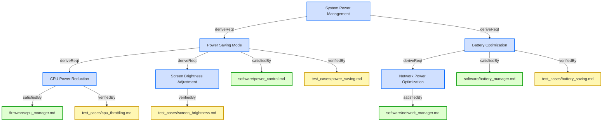
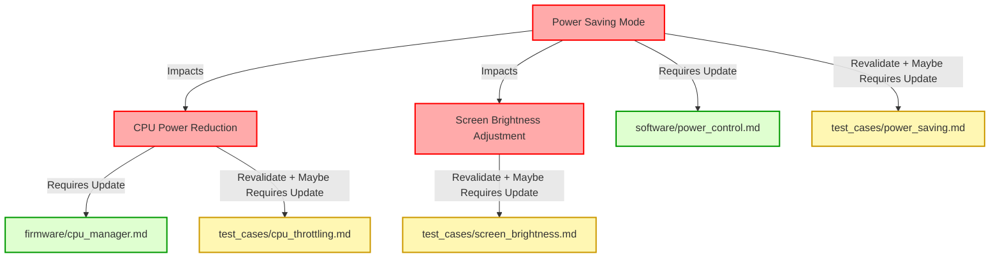

# Reporting

## Requirements

### Containment View Report Generation

The system shall generate containment view reports showing the physical hierarchical structure of the model (folders → files → elements) in multiple output formats including Mermaid diagrams, JSON, and HTML export integration.

#### Details
<details><summary>View Full Specification</summary>

## Hierarchy Extraction

The containment hierarchy extraction must:

**Hierarchy Structure:**
- Start from the specifications root folder
- Traverse folder structure recursively
- For each folder: collect subfolders and files
- For each file: collect all elements (H3 headers with Metadata)
- Skip sections (H2 headers) in the hierarchy representation

**Element Information:**
- Extract element identifier, name, and type
- Preserve file path and folder structure
- Maintain insertion order for elements within files

**Data Structure:**
- Represent as tree: `Folder → [Subfolders, Files]`
- Files contain: `File → [Elements]`
- Elements contain: identifier, name, type

**Ordering:**
- Folders sorted alphabetically
- Files sorted alphabetically within folders
- Elements preserve document order within files

---

## Mermaid Diagram Output

The Mermaid diagram generation must:

**Graph Structure:**
- Use `graph LR` (left-to-right layout)
- Folder nodes with connections to child folders and files
- File subgraphs containing element nodes
- Tree structure with explicit parent-child connections

**Node Format:**
- Root: `root["📁 Reqvire root"]`
- Folders: `folderId["📁 Folder Name"]`
- Files: subgraphs with format `fileId["📄 File Name"]`
- Elements: `hashId["Element Name"]` within file subgraphs

**Connections:**
- `parent --> child` for folder/file hierarchy
- No connections between elements within files

**Element Nodes:**
- Use 16-character hash IDs for node uniqueness
- Display element name as node label
- Apply CSS classes based on element type

**Styling:**
- `userRequirement` - pink fill (#f9d6d6), red stroke (#f55f5f)
- `systemRequirement` - light pink fill (#fce4e4), pink stroke (#e68a8a)
- `requirement` - light pink fill (#fce4e4), pink stroke (#e68a8a)
- `verification` - light green fill (#d6f9d6), green stroke (#5fd75f)
- `folder` - light blue fill (#e8f4f8), blue stroke (#4a90a4)
- `file` - light yellow fill (#fff8e1), orange stroke (#f9a825)
- `default` - gray fill (#f5f5f5), dark stroke (#333333)

**Clickable Links:**
- Add `click` directives for each element node
- Link to element location: `click hashId "path.md#fragment"`
- Use relative paths from diagram location
- Normalize fragments to lowercase with hyphens

**Requirements:**
- Valid Mermaid syntax
- Deterministic node ordering
- Consistent hash ID generation
- Unique file IDs based on full path (not just filename)

---

## JSON Output (Optional)

The JSON structure must include:

**Root Level:**
```json
{
  "root_folder": "specifications",
  "folders": [ ... ],
  "files": [ ... ],
  "element_count": 123
}
```

**Folder Objects:**
```json
{
  "path": "specifications/SystemRequirements",
  "name": "SystemRequirements",
  "subfolders": [ ... ],
  "files": [ ... ]
}
```

**File Objects:**
```json
{
  "path": "specifications/Requirements.md",
  "name": "Requirements.md",
  "elements": [ ... ]
}
```

**Element Objects:**
```json
{
  "identifier": "specifications/Requirements.md#auth-system",
  "name": "Authentication System",
  "type": "requirement"
}
```

**Requirements:**
- Valid JSON format with proper escaping
- Deterministic key ordering
- Include metadata counts (folders, files, elements)

---

## HTML Export Integration

HTML export integration must:

**Containment View Page:**
- Create dedicated page: `containment.html`
- Generate `containment.md` with Mermaid diagram
- Convert to HTML during export process
- Include in navigation menu as "Containment" (after "Home")

**Integration with Existing Export:**
- Follow existing HTML export styling and structure
- Use same CSS classes for element types
- Maintain consistent navigation patterns
- Apply post-processing for .md to .html conversions

**Requirements:**
- Generated during `reqvire export` command
- Updates automatically when model changes
- Deterministic output for version control
- Interactive Mermaid diagram with pan/zoom

</details>

#### Relations
  * derivedFrom: [Containment View Report](#containment-view-report)
---

### Forward-Only Relation Traversal

When filtering by root element, system shall traverse only forward relations down to leaf elements.

#### Details
- Shall follow only forward relations (derive, satisfiedBy, verifiedBy, trace)
- Shall start from specified root element (looked up by name)
- Shall recursively traverse outgoing relations to leaf elements
- Shall NOT traverse backward (no bidirectional traversal)
- Unfiltered diagrams (no --from) shall show complete model with all elements

#### Relations
  * derivedFrom: [CLI Model Diagram Command](../Interfaces/CLI.md#cli-model-diagram-command)
  * satisfiedBy: [diagrams.rs](../../core/src/diagrams.rs)
  * verifiedBy: [Model Command Verification](#model-command-verification)
---

### Search Report Generator

The system shall implement a search report generator that produces comprehensive element searches with filtering, supporting both full and abbreviated output modes.

#### Details
The search report must include:

**File-level Information:**
- File path and name
- Number of sections per file
- Number of elements per file
- Page content (frontmatter content before first section header) - omitted in short mode

**Section-level Information:**
- Section name and hierarchy
- Number of elements per section - omitted in short mode
- Section content (content between section header and first element, excluding generated diagrams) - omitted in short mode

**Element Information:**
- Element identifier, name, type, and section
- Element content - omitted in short mode
- Verified and satisfied relations counts - omitted in short mode
- Complete list of relations with targets and types

**Global Counts:**
- Total files, pages, sections, and elements - omitted in short mode
- Requirements by type (system, user) - omitted in short mode
- Verifications by type (test, analysis, inspection, demonstration) - omitted in short mode
- Missing relations (unverified and unsatisfied requirements) - omitted in short mode

**Output Formats:**
- Human-readable text format with hierarchical display
- Human-readable abbreviated text format (with --short flag): one-line per element showing `[type] identifier - name`
- JSON format for programmatic processing
- JSON abbreviated format (with --short flag): omits content, section_content, page_content, verified_relations_count, satisfied_relations_count, element_count, total_sections, total_elements, global_counters

The system must support comprehensive filtering by file path, element name, section, type, element content, section content, page content, and relation presence. All filters are applied conjunctively.

#### Relations
  * derivedFrom: [Model Structure and Summaries](#model-structure-and-summaries)
  * satisfiedBy: [search.rs](../../core/src/search.rs)
---

### Containment Hierarchy Extraction Test

This test verifies that the system correctly extracts the physical containment hierarchy from the model, representing folders, files, and elements in a tree structure while omitting sections.

#### Details

##### Test Criteria
1. **Hierarchy structure extraction:**
   - Create test model with nested folder structure
   - Include multiple levels: root → subfolder → file → elements
   - Verify folders are extracted in correct hierarchy
   - Verify files are placed under correct folders
   - Verify elements are extracted from files

2. **Section omission:**
   - Create test file with H2 sections and H3 elements
   - Verify sections (H2) are NOT included in hierarchy
   - Verify elements (H3) are directly under files
   - Confirm no section nodes in output structure

3. **Element information:**
   - Verify element identifier is extracted correctly
   - Verify element name matches H3 header text
   - Verify element type from Metadata is captured
   - Test with multiple element types (requirement, verification, user-requirement)

4. **Ordering verification:**
   - Verify folders are sorted alphabetically
   - Verify files are sorted alphabetically within folders
   - Verify elements maintain document order
   - Test deterministic output across multiple runs

5. **Data structure validation:**
   - Verify tree structure: Folder → [Subfolders, Files]
   - Verify File → [Elements] relationship
   - Verify all paths are relative to git root
   - Test with empty folders and files without elements

##### Acceptance Criteria
- All folders, files, and elements are extracted correctly
- Sections are omitted from the hierarchy
- Element metadata (identifier, name, type) is preserved
- Output follows deterministic ordering
- Tree structure is valid and navigable

#### Metadata
  * type: test-verification

#### Relations
  * verify: [Containment View Report Generation](#containment-view-report-generation)
  * satisfiedBy: [test.sh](../../tests/test-containment-view/test.sh)
---

### Verification Coverage Report Generator

The system shall provide a verification coverage report generator that analyzes leaf requirements verification status, test-verification satisfaction status, and orphaned verifications to produce coverage metrics and detailed reports.

#### Details
The coverage report generator must:
- Identify all leaf requirements (requirements without forward relations to other requirements) in the model
- Determine leaf requirement verification status based on presence of verifiedBy relations
- Identify all verification elements in the model with breakdown by verification type
- Determine test-verification satisfaction status based on presence of satisfiedBy relations
- Identify orphaned verifications (verification elements without any verify relations to requirements)
- Calculate coverage percentages: (verified_leaf_requirements/total_leaf_requirements * 100), (satisfied_test_verifications/total_test_verifications * 100), and (orphaned_verifications/total_verifications * 100)
- Group results by file and section for organization
- Support both human-readable text and machine-readable JSON output formats

The report structure shall include:
- Summary section with leaf requirements, test-verification, and orphaned verification counts and percentages
- Verified leaf requirements section grouped by file and section
- Unverified leaf requirements section with details (flagged for attention)
- Satisfied test-verification elements section grouped by file and section
- Unsatisfied test-verification elements section with details (flagged for attention)
- Orphaned verifications section with details (flagged for attention as they may be redundant or incorrectly configured)
- Analysis, inspection, and demonstration verification elements are considered satisfied by default

#### Relations
  * satisfiedBy: [report_coverage.rs](../../core/src/report_coverage.rs)
  * derivedFrom: [Verification Coverage Report](#verification-coverage-report)
  * derivedFrom: [Search Report Generator](#search-report-generator)
---

### Custom Element Type Tracking

The system SHALL track and display custom element types (any type not in the standard categories) in model summary reports, providing counts for each custom type in both text and JSON output formats.

#### Details
The custom element type tracking feature must:

**Custom Type Definition:**
- Identify any element type that is not one of the standard types: requirement, user-requirement, verification, test-verification, analysis-verification, inspection-verification, or demonstration-verification
- Track custom types separately from standard element type counters
- Store custom types in a HashMap with type name as key and count as value

**Text Output:**
- Display custom element types in the "Element Types" section of the summary
- Format: `Custom (type-name): count`
- Sort custom types alphabetically by type name
- Only display custom types section when at least one custom type exists

**JSON Output:**
- Include custom element types in global_counters as `custom_element_types` field
- Structure: `{"custom_element_types": {"type-name": count, ...}}`
- Skip serialization of the field when no custom types exist (using `skip_serializing_if`)
- Maintain alphabetical sorting of type names in JSON output

**Exclusions:**
- Standard requirement types (requirement, user-requirement) SHALL NOT be counted as custom
- Standard verification types (verification, test-verification, analysis-verification, inspection-verification, demonstration-verification) SHALL NOT be counted as custom
- File-type elements SHALL NOT be counted as custom types

#### Relations
  * derivedFrom: [Search Report Generator](#search-report-generator)
  * satisfiedBy: [search.rs](../../core/src/search.rs)
---

### Model Diagram Output Formats

System shall support markdown and JSON output formats.

#### Details
- Markdown format shall include embedded Mermaid diagram with model structure
- Markdown shall show hierarchical structure (folders > files > sections > elements)
- JSON format shall use structured data with folders, files, sections, elements, and relations
- Both formats shall represent the same filtered or complete model data

#### Relations
  * derivedFrom: [CLI Model Diagram Command](../Interfaces/CLI.md#cli-model-diagram-command)
  * satisfiedBy: [diagrams.rs](../../core/src/diagrams.rs)
  * verifiedBy: [Model Command Verification](#model-command-verification)
---

### Search Command Tests

This test verifies that the system provides a unified `search` command functionality for searching and filtering model elements with comprehensive filter options and output modes.

#### Details

##### Acceptance Criteria
- Running `reqvire search --json` produces a valid, pretty-printed JSON search result
- Running `reqvire search` (no `--json`) prints a human-readable text search result
- Running `reqvire search --short` produces abbreviated text output (one-line per element format: `[type] identifier - name`)
- Running `reqvire search --short --json` produces abbreviated JSON output (omits specified fields)
- Both JSON and text outputs include all elements matching filter criteria
- All filter flags work individually and in combination (conjunctive AND logic)
- Supplying an invalid regex to any regex-based filter fails with a non-zero exit code and displays a clear error message
- Search results must include all relations for each element
- **Enhanced Content Display**: Search must display page content (frontmatter before first section) and section content (content between section headers and first element) when not in short mode
- **Count Information**: Search must show counts for files, pages, sections, and elements in full mode (omitted in short mode)
- **Short Mode Behavior**: Short mode omits: `content`, `section_content`, `page_content`, `verified_relations_count`, `satisfied_relations_count`, `element_count`, `total_sections`, `total_elements`, `global_counters`

##### Test Criteria
1. **Base JSON search**
   Command: `reqvire search --json`
   - exits code **0**
   - output parses under `jq`
   - `.files` contains file path keys
   - All elements included when no filters specified

2. **Base text search**
   Command: `reqvire search`
   - exits code **0**
   - human-readable output with hierarchical structure
   - each element block includes identifier, name, section, file, type, content
   - relations displayed for each element

3. **Short mode text output**
   Command: `reqvire search --short`
   - exits code **0**
   - one line per element: `[type] identifier - name`
   - no content, section content, or page content displayed
   - no count information displayed

4. **Short mode JSON output**
   Command: `reqvire search --short --json`
   - exits code **0**
   - output parses as valid JSON
   - element objects do NOT contain: `content`, `verified_relations_count`, `satisfied_relations_count`
   - section objects do NOT contain: `section_content`, `element_count`
   - file objects do NOT contain: `page_content`, `total_sections`, `total_elements`
   - top level does NOT contain: `global_counters`

5. **Individual filters**
   For each flag in turn, run both JSON and text modes:
   - `--filter-file="**/*Reqs.md"` (glob)
   - `--filter-name=".*safety.*"` (regex)
   - `--filter-section="System*"` (glob)
   - `--filter-type="user-requirement"` (exact)
   - `--filter-content="MUST"` (regex)
   - `--filter-section-content="implement.*"` (regex)
   - `--filter-page-content="architecture"` (regex)
   - `--have-relations=verifiedBy` (comma-separated)
   - `--not-have-relations=verifiedBy` (comma-separated)
   Assert for each:
   - exit code **0**
   - only elements matching the filter appear in output

6. **Filter combinations**
   Combine multiple filters and verify outputs contain exactly those elements passing ALL filters:
   - `--filter-type=user-requirement --have-relations=verifiedBy,satisfiedBy`
   - `--filter-section="System*" --filter-name=".*GPS.*"`
   - `--filter-content="MUST" --not-have-relations=verifiedBy`

7. **Invalid regex**
   Command: `reqvire search --json --filter-name="***"`
   - exits non-zero
   - stderr contains error message with faulty pattern

8. **Invalid relation type**
   Command: `reqvire search --have-relations=invalidRelationType`
   - exits non-zero
   - stderr contains error with list of valid relation types

9. **Multiple relations in have-relations**
   Command: `reqvire search --have-relations=verifiedBy,satisfiedBy`
   - exits code **0**
   - only elements that have BOTH verifiedBy AND satisfiedBy relations appear
   - elements with only one of the relations are excluded

10. **Multiple relations in not-have-relations**
    Command: `reqvire search --not-have-relations=verifiedBy,satisfiedBy`
    - exits code **0**
    - only elements that do NOT have ALL specified relations appear
    - if element lacks verifiedBy OR satisfiedBy (or both), it is included

11. **Section content filter**
    Command: `reqvire search --filter-section-content="MUST.*implement"`
    - exits code **0**
    - only elements whose parent section content matches regex appear
    - elements in sections without matching content are excluded

12. **Page content filter**
    Command: `reqvire search --filter-page-content="architecture"`
    - exits code **0**
    - only elements whose parent file page content matches regex appear
    - elements in files without matching page content are excluded

13. **Relations coverage**
    Command: `reqvire search --json`
    - Both JSON and text outputs must show complete relationship information
    - All relation types and targets included

14. **Enhanced content and counts verification (full mode)**
    Command: `reqvire search --json`
    - JSON output must include `page_content` field for files that have frontmatter content
    - JSON output must include `section_content` field for sections that have content
    - JSON output must include count fields in global counters
    - JSON output must include per-file and per-section counts

15. **Short mode field omission verification**
    Command: `reqvire search --short --json`
    - Verify all specified fields are omitted from JSON structure
    - Verify no null/empty placeholders for omitted fields (fields completely absent)

#### Metadata
  * type: test-verification

#### Relations
  * verify: [CLI Search Command](../Interfaces/CLI.md#cli-search-command)
  * verify: [Search Fine Grained Filtering](#search-fine-grained-filtering)
  * satisfiedBy: [test.sh](../../tests/test-search-all-features/test.sh)
---

### Search Fine Grained Filtering

The system shall implement comprehensive fine-grained filtering for the search report generator following the specifications below.

#### Details
<details><summary>View Full Specification</summary>

## Summary

This specification defines the functional requirements for a filtering subsystem used within the `search` reporting feature. The system must allow clients to selectively include or exclude elements from the search output based on metadata, content, and traceability properties.

The filters shall be composable and applied conjunctively (i.e., all active filters must match for an element to be included). The filtering system must support both human-readable text output and structured machine-readable output (e.g., JSON), as well as abbreviated short mode output.

---

## Filtering Scope

Filtering shall operate on the level of individual `Element` objects in the model registry. Each `Element` has the following relevant properties:

- `file_path: String`
- `name: String`
- `section: String`
- `element_type: ElementType`
- `content: String`
- `relations: Vec<Relation>`
- `section_content: String` (from parent section)
- `page_content: String` (from parent file)

---

## Supported Filters

The filtering system **must support the following filters**, which may be active simultaneously.

### 1. File Path Filter (Glob)

**Purpose:** Restrict search to elements defined in files whose paths match a given glob pattern.

**Input:** A single string pattern using glob syntax (e.g., `"src/**/*Spec.md"`)

**Match Target:** `Element.file_path`

**Behavior:** Case-sensitive glob match. If the glob does not match any file, no elements are included.

---

### 2. Name Filter (Regex)

**Purpose:** Include only elements whose `name` matches a regular expression.

**Input:** A valid Rust-compatible regular expression (e.g., `"autonomous.*"`)

**Match Target:** `Element.name`

**Behavior:** Case-sensitive match by default. The filter is considered invalid if the regex fails to compile.

---

### 3. Section Filter (Glob)

**Purpose:** Include only elements belonging to sections with matching names.

**Input:** A glob pattern string (e.g., `"System Requirements*"`)

**Match Target:** `Element.section`

**Behavior:** Case-sensitive match. Globbing follows standard `globset` semantics.

---

### 4. Type Filter (Exact Match)

**Purpose:** Include only elements of a specific type.

**Input:** One of the following valid string identifiers:

- `"user-requirement"`
- `"system-requirement"`
- `"verification"`
- `"file"`
- Any user-defined type (e.g., `"interface"`, `"design"`)

**Match Target:** `Element.element_type`

**Behavior:** Matching must be exact. Internally, the filter string shall be mapped to an `ElementType` via a deterministic lookup function.

---

### 5. Content Filter (Regex)

**Purpose:** Include only elements whose body content matches a regular expression.

**Input:** A valid regex pattern applied to the element's `content`.

**Match Target:** `Element.content`

**Behavior:** Case-sensitive regex match. Invalid patterns must cause an immediate user-facing error.

---

### 6. Section Content Filter (Regex)

**Purpose:** Include only elements whose parent section content matches a regular expression.

**Input:** A valid regex pattern applied to the section's content.

**Match Target:** Section content of the element's parent section

**Behavior:** Case-sensitive regex match. Invalid patterns must cause an immediate user-facing error.

---

### 7. Page Content Filter (Regex)

**Purpose:** Include only elements whose parent file's page content (frontmatter) matches a regular expression.

**Input:** A valid regex pattern applied to the file's page content.

**Match Target:** Page content (frontmatter) of the element's parent file

**Behavior:** Case-sensitive regex match. Invalid patterns must cause an immediate user-facing error.

---

### 8. Have Relations Filter (Comma-separated list)

**Purpose:** Include only elements that have ALL specified relation types.

**Input:** Comma-separated list of relation type names (e.g., `"verifiedBy,satisfiedBy"`)

**Match Target:** `Element.relations`

**Behavior:** When specified, element must have at least one relation of each specified type to be included. Invalid relation type names shall cause an error with a list of valid relation types.

---

### 9. Not Have Relations Filter (Comma-separated list)

**Purpose:** Include only elements that do NOT have ALL specified relation types.

**Input:** Comma-separated list of relation type names (e.g., `"verifiedBy"`)

**Match Target:** `Element.relations`

**Behavior:** When specified, element must NOT have all the specified relation types to be included. If element has all specified relation types, it is excluded. Invalid relation type names shall cause an error with a list of valid relation types.

---

## Filter Composition

All filters are applied **conjunctively**. That is, an element is included in the search results **only if all active filters return `true`** for that element.

---

## Error Handling

- Invalid regular expressions must produce a fatal error with a descriptive message.
- Invalid glob patterns should fail at startup with appropriate feedback.
- Unknown or malformed `type` filters should be rejected with a list of accepted values.
- Invalid relation type names in `--have-relations` or `--not-have-relations` shall produce an error listing valid relation types.

---

## Output Behavior

Filtered results must be consistent across all output modes (text, JSON, short text, short JSON). The final search results must include only elements passing the full filter set, and global counters should reflect the filtered subset.

---

## Performance Considerations

The filtering system must evaluate filters with minimal passes over element data. Repeated relation scans should be avoided in favor of single-pass accumulation.

---

## Test Cases (Examples)

| Filter Combination | Expected Result |
|--------------------|------------------|
| `type = verification` | Only verification elements |
| `section = "System*"` + `name = ".*GPS.*"` | System section elements with GPS in name |
| `have-relations = verifiedBy,satisfiedBy` | Elements that have both verifiedBy AND satisfiedBy relations |
| `not-have-relations = verifiedBy` | Elements that do NOT have any verifiedBy relations |
| `filter-section-content = "MUST.*implement"` | Elements in sections whose content matches the pattern |
| `filter-page-content = "architecture"` | Elements in files whose frontmatter contains "architecture" |

---

</details>

#### Relations
  * satisfiedBy: [filters.rs](../../core/src/filters.rs)
  * satisfiedBy: [search.rs](../../core/src/search.rs)
  * satisfiedBy: [cli.rs](../../cli/src/cli.rs)
  * derivedFrom: [Search Report Generator](#search-report-generator)
  * verifiedBy: [Search Command Tests](#search-command-tests)
---

### Tracing Structural Changes

When tracing structural changes, the system shall analyze the MBSE model and diffs to identify affected components and generate a report of impacted elements and structures, so that the user can review the changes and decide on further actions.

#### Metadata
  * type: user-requirement

#### Relations
  * derivedFrom: [Trace Changes in System Model](../UserStories.md#trace-changes-in-system-model)
---

### Verification Coverage Report Test

This test verifies that the system correctly generates verification coverage reports focusing on leaf requirements, showing the percentage and details of satisfied and unsatisfied test-verification elements, and identifying orphaned verifications.

#### Details

##### Acceptance Criteria
- System shall provide a CLI command `coverage` that generates coverage reports focusing on leaf requirements
- Command shall support `--json` flag for JSON output format
- Coverage report shall include summary section with total counts and percentages for leaf requirements
- Coverage report shall show breakdown by verification type (test, analysis, inspection, demonstration)
- Coverage report shall list verified leaf requirements grouped by file and section
- Coverage report shall list unverified leaf requirements with details
- Coverage report shall list satisfied test-verification elements (those with satisfiedBy relations)
- Coverage report shall list unsatisfied test-verification elements (those without satisfiedBy relations)
- Coverage report shall list orphaned verifications (verifications without any verify relations to requirements)
- Coverage report shall show orphaned verifications count and percentage in summary section
- Non-test-verification elements (analysis, inspection, demonstration) are considered satisfied by default (no satisfiedBy required)
- JSON output shall be valid and machine-readable
- Text output shall be human-readable with clear formatting

##### Test Criteria
1. **Basic Coverage Report**
   Command: `reqvire coverage-report`
   - exits code **0**
   - output contains `=== Verification Coverage Report ===`
   - output contains `Summary:` section with leaf requirements counts and percentages
   - output contains `Verification Types:` breakdown
   - output contains coverage percentage calculation for leaf requirements
   - verified leaf requirements are marked with ✅
   - unverified leaf requirements are marked with ❌
   - satisfied test-verification elements are marked with ✅
   - unsatisfied test-verification elements are marked with ❌

2. **JSON Coverage Report**
   Command: `reqvire coverage-report --json`
   - exits code **0**
   - output parses as valid JSON
   - JSON contains `summary` object with leaf requirements counts and percentages
   - JSON contains `verified_leaf_requirements` and `unverified_leaf_requirements` sections
   - JSON contains `satisfied_test_verifications` and `unsatisfied_test_verifications` sections
   - verification details include identifier, name, section, type, and satisfied_by relations (for test-verification only)

3. **Coverage Calculation**
   - Leaf requirements coverage percentage calculated as (verified_leaf_requirements/total_leaf_requirements * 100)
   - Test-verification satisfaction percentage calculated as (satisfied_test_verifications/total_test_verifications * 100)
   - Verification types correctly categorized
   - Test-verification elements without satisfiedBy relations are flagged as unsatisfied
   - Test-verification elements with valid satisfiedBy relations are considered satisfied
   - Analysis, inspection, and demonstration verifications are considered satisfied by default (no satisfiedBy evaluation)

#### Metadata
  * type: test-verification

#### Relations
  * verify: [CLI Coverage Command](../Interfaces/CLI.md#cli-coverage-command)
  * satisfiedBy: [test.sh](../../tests/test-coverage-report/test.sh)
---

### Deterministic Output for All Generated Content

All generated content including reports, diagrams, exports, text, JSON, and HTML shall produce deterministic output with consistent ordering to enable reliable testing, version control, and reproducible builds.

#### Details
The system shall ensure deterministic output by:

1. **Element Ordering**: Elements shall be sorted by identifier before iteration to ensure consistent processing order across all operations
2. **Relation Ordering**: Relations within each element shall be sorted by relation type name and then by target identifier before rendering
3. **Section Ordering**: Sections within files shall be sorted alphabetically when order is not semantically significant
4. **File Ordering**: Files within folders shall be sorted alphabetically

This determinism ensures that:
- Running the same operation multiple times produces byte-identical output
- Automated tests can reliably compare expected and actual outputs using simple diff tools without special normalization
- Version control diffs are meaningful and reflect actual changes rather than random ordering variations
- Continuous integration pipelines produce consistent, reproducible results
- Generated diagrams maintain stable node and relation ordering for easier review

This requirement applies to all capabilities and operations that generate output, including but not limited to:
- Diagram generation - Mermaid diagrams embedded in markdown files
- Documentation export - Complete HTML documentation with all pages
- Model summary reporting - Summary reports in text and JSON formats
- Section summary reporting - Section-focused summaries
- Verification tracing - Upward traceability trees from verifications to requirements
- Coverage reporting - Verification coverage analysis
- Change impact analysis - Reports showing propagation of changes
- Validation reporting - Model validation error reports
- Linting - Model quality issue reports
- All JSON output formats
- All HTML output formats
- All text output formats

#### Relations
  * derivedFrom: [Model Reports](#model-reports)
---

### Validation Report Generator

The system shall implement a validation report generator that compiles and formats validation results from all validators, providing a unified view of model quality with categorized issues, remediation suggestions, and compliance metrics.

#### Relations
  * derivedFrom: [Provide Validation Reports](#provide-validation-reports)
  * satisfiedBy: [model.rs](../../core/src/model.rs)
---

### Model Reports

When requested the system shall provide human readable MBSE model reports.

#### Metadata
  * type: user-requirement

#### Relations
  * derivedFrom: [Provide Reports](../UserStories.md#provide-reports)
---

### Containment View Text Output Test

This test verifies that the system generates correctly formatted human-readable text output for the containment view with proper indentation and element metadata display.

#### Details

##### Test Criteria
1. **Hierarchical indentation:**
   - Verify indentation uses 2 spaces per level
   - Test nested structure: root (0), folder (2), subfolder (4), file (6), element (8)
   - Verify consistent indentation across all levels

2. **Visual markers:**
   - Verify folders display with `📁 Folder: <name>`
   - Verify files display with `📄 File: <path>`
   - Verify elements display with `[<type>] <name>`
   - Test all element types have correct bracket notation

3. **Element type display:**
   - Test `[requirement]` for system requirements
   - Test `[user-requirement]` for user requirements
   - Test `[verification]` and `[test-verification]` for verifications
   - Test custom element types

4. **Content accuracy:**
   - Verify all folders are displayed
   - Verify all files are displayed with correct paths
   - Verify all elements are displayed with correct names
   - Test empty folders and files are handled correctly

5. **Output format validation:**
   - Verify output is valid UTF-8 text
   - Verify line breaks are consistent
   - Test output matches expected format exactly
   - Compare against reference output

##### Acceptance Criteria
- Text output uses correct indentation (2 spaces per level)
- Visual markers (📁, 📄) are displayed correctly
- Element types are shown in brackets
- All hierarchy levels are represented
- Output is human-readable and well-formatted

#### Metadata
  * type: test-verification

#### Relations
  * verify: [Containment View Report Generation](#containment-view-report-generation)
  * satisfiedBy: [test.sh](../../tests/test-containment-view/test.sh)
---

### Containment View JSON Output Test

This test verifies that the system generates valid, well-structured JSON output for the containment view with correct schema and deterministic ordering.

#### Details

##### Test Criteria
1. **JSON schema validation:**
   - Verify root object has required keys: `root_folder`, `folders`, `files`, `element_count`
   - Verify folder objects have: `path`, `name`, `subfolders`, `files`
   - Verify file objects have: `path`, `name`, `elements`
   - Verify element objects have: `identifier`, `name`, `type`
   - Test schema with JSON validator

2. **Data accuracy:**
   - Verify `root_folder` matches specifications directory
   - Verify `element_count` matches actual element count
   - Verify all folder paths are correct and relative
   - Verify all file paths are correct and relative
   - Verify all element identifiers match format `path#fragment`

3. **Nested structure:**
   - Verify subfolders are nested under parent folders
   - Verify files are associated with correct folders
   - Verify elements are associated with correct files
   - Test deep nesting (3+ levels)

4. **JSON validity:**
   - Verify output is valid JSON (parse without errors)
   - Verify special characters are properly escaped
   - Verify Unicode characters in element names are handled
   - Test with `jq` tool for validation

5. **Deterministic output:**
   - Verify key ordering is consistent
   - Verify array ordering is deterministic
   - Run command multiple times and compare outputs
   - Verify byte-identical JSON across runs

##### Acceptance Criteria
- JSON output is valid and parseable
- Schema matches specification exactly
- All data is accurate and complete
- Special characters and Unicode are handled correctly
- Output is deterministic

#### Metadata
  * type: test-verification

#### Relations
  * verify: [Containment View Report Generation](#containment-view-report-generation)
  * satisfiedBy: [test.sh](../../tests/test-containment-view/test.sh)
---

### Verification Traces Filter Options Test

This test verifies that the verification-traces command filter options work correctly when generating upward trace trees from verification elements to root requirements.

#### Details

##### Acceptance Criteria
- System shall provide CLI command `traces` that generates upward trace trees from verifications
- Command shall output to stdout in Markdown format with embedded Mermaid diagrams by default
- Command shall support `--json` flag for structured JSON output without diagrams
- Mermaid diagrams shall show verification element as root with arrows following relation semantics
- Mermaid diagrams shall include clickable links on all nodes (verifications and requirements)
- Directly verified requirements shall be marked/highlighted in diagrams using CSS classes
- System shall traverse all upward parent relations to reach root requirements
- System shall merge multiple verification paths into single tree per verification
- System shall support `--filter-id=<id>` filter for specific verification element
- System shall support `--filter-name=<regex>` for filtering by verification name pattern
- System shall support `--filter-type=<type>` for filtering by verification type
- Multiple filters shall be combinable using AND logic
- JSON output shall include verification ID, directly verified requirements, and complete trace tree structure

##### Test Criteria
1. **Basic Markdown Output**
   Command: `reqvire verification-traces`
   - exits code **0**
   - output contains `# Verification Traceability Report`
   - output contains Mermaid diagram blocks with `graph BT`
   - diagrams include verification element nodes and requirement nodes
   - diagrams include click handlers for all nodes (format: `click NODE_ID "url"`)
   - directly verified requirements have `:::verified` CSS class in diagram

2. **JSON Output**
   Command: `reqvire verification-traces --json`
   - exits code **0**
   - output parses as valid JSON
   - JSON contains `verifications` array
   - each verification includes `verification_id`, `verification_name`, `verification_type`
   - each verification includes `directly_verified_requirements` array
   - each verification includes `trace_tree` with nested requirement structure

3. **Correct Arrow Directions**
   - Mermaid diagrams use `SYS001 -.->|verify| VER001` format (requirement verifies verification)
   - Mermaid diagrams use `USER001 -.->|deriveReqT| SYS001` format (parent derives child)
   - Arrow directions match Reqvire relation semantics (TargetToElement, ElementToTarget)

4. **Specific Verification Filter**
   Command: `reqvire verification-traces --filter-id="specifications/Verifications/ValidationTests.md#invalid-relations-test"`
   - exits code **0**
   - output contains only trace for specified verification
   - other verifications are excluded

5. **Name Pattern Filter**
   Command: `reqvire verification-traces --filter-name=".*Coverage.*"`
   - exits code **0**
   - output contains only verifications matching regex pattern
   - non-matching verifications are excluded

6. **Type Filter**
   Command: `reqvire verification-traces --filter-type="test-verification"`
   - exits code **0**
   - output contains only test-verification elements
   - analysis, inspection, demonstration verifications are excluded

7. **Combined Filters**
   Command: `reqvire verification-traces --filter-type="test-verification" --filter-name=".*Test"`
   - exits code **0**
   - output contains only verifications matching ALL filter criteria (AND logic)
   - verifications matching only one filter are excluded

#### Metadata
  * type: test-verification

#### Relations
  * verify: [CLI Traces Command](../Interfaces/CLI.md#cli-traces-command)
  * satisfiedBy: [test.sh](../../tests/test-verification-traces/test.sh)
---

### Model Structure and Summaries

When requested the system shall generate reports summarizing the structure and relationships in the MBSE model, including counts and types of connections also supporting json and cypher output.

#### Metadata
  * type: user-requirement

#### Relations
  * derivedFrom: [Deterministic Output for All Generated Content](#deterministic-output-for-all-generated-content)
---

### Requirements Change Propagation

When a requirement is changed, the system shall propagate the change through related requirements, verification artifacts, and design elements according to relation type definitions and propagation rules.

#### Details
<details>
<summary>View Full Specification</summary>


## Change Impact Propagation in Requirements

Requirements are interconnected through relations, and changes to a requirement may affect related requirements, verification methods, design specifications, or software components.

Changes propagate based on the relation type, which determines the impact direction and scope.

Changes to high-level requirements cascade down to implementation.
Verification artifacts must be marked for revalidation to reflect changes.
Automated tools should flag all impacted requirements for review.

### Relation Categories for Change Propagation

For change propagation purposes, relations can be categorized into several groups:

1. **Hierarchical Relations** - Changes propagate from parent to child elements (derivedFrom)
2. **Satisfaction Relations** - Changes to requirements affect implementations (satisfiedBy)
3. **Verification Relations** - Changes to requirements invalidate verifications (verifiedBy)
4. **Traceability Relations** - No change propagation, for documentation only (trace)

---


## Change Propagation Mechanism

When a requirement changes, impact analysis must be conducted based on its relations. The following mechanism ensures traceability and controlled updates.

- Identify Impacted Relations
  - When a requirement is modified, check its Relations subsection to identify linked elements.
- Determine Change Propagation Scope
  - Apply the rules in Relation Types and Change Propagation Rules to assess whether the change affects child requirements, design artifacts, verification, or other linked documents.
- Invalidate Affected Elements
  - If a related element is impacted, flag it for review.  
  - Example: If a requirement verified by a test changes, the test must be reviewed.
- Require Re-validation or Re-design
  - If changes affect satisfaction (e.g., code or architecture), update the relevant design.  
  - If changes affect verification, update test cases or validation documents.
- If a change results in a requirement being merged, split, or removed, update its Relations to maintain traceability.

## Examples of Change Propagation


### Parent-Child Requirement Change

```markdown

---

### Parent Requirement
This requirement defines a high-level system constraint.

#### Relations
  * derive: [Child Requirement](#child-requirement)


---

### Child Requirement
This requirement defines additional functionality.

```

If Parent Requirement changes, Child Requirement must be reviewed and updated.


---

### Requirement Satisfied by a Design Specification

```markdown

---

### Functional Requirement

The system shall process transactions within 500ms.

#### Relations
  * satisfiedBy: [architecture/system_design.md/Performance Constraints](architecture/system_design.md#performance-constraints)
```

If Functional Requirement changes, Performance Constraints in the architecture document must be updated.


---

### Requirement Verified by a Test

```

---

### Safety Requirement

The system shall shut down if temperature exceeds 100°C.

#### Relations
  * verifiedBy: [test_cases/safety_verification.md/Overheat Shutdown Test](test_cases/safety_verification.md#overheat-shutdown-test)

```

If Safety Requirement changes, the Overheat Shutdown Test must be reviewed for update and executed again for verification.


---

### Example of Multi-Level Change Propagation in Requirements

The following analysis explains how a **change in the requirement**  propagates through multiple levels of related requirements, impacting their definitions, design artifacts, and verification processes.

---

```
### Root Requirement: System Power Management

The system shall implement power-saving mechanisms to optimize battery usage.  

---

### Power Saving Mode

The system shall activate power-saving mode when the battery level drops below 20%.  

#### Relations
  * deriveFrom: [System Power Management](#system-power-management)
  * satisfiedBy: [software/power_control.md](software/power_control.md)
  * verifiedBy: [test_cases/power_saving.md](test_cases/power_saving.md)

---

### CPU Power Reduction

The system shall reduce CPU frequency by 30% in power-saving mode.  

#### Relations
  * deriveFrom: [Power Saving Mode](#power-saving-mode)
  * satisfiedBy: [firmware/cpu_manager.md](firmware/cpu_manager.md)
  * verifiedBy: [test_cases/cpu_throttling.md](test_cases/cpu_throttling.md)

---

### Screen Brightness Adjustment

The system shall reduce screen brightness by 40% in power-saving mode.  

#### Relations
  * deriveFrom: [Power Saving Mode](#power-saving-mode)
  * verifiedBy: [test_cases/screen_brightness.md](test_cases/screen_brightness.md)

---

### Battery Optimization

The system shall disable non-essential background services when battery levels drop below 15%.  

#### Relations
  * deriveFrom: [System Power Management](#system-power-management)
  * satisfiedBy: [software/battery_manager.md](software/battery_manager.md)
  * verifiedBy: [test_cases/battery_saving.md](test_cases/battery_saving.md)

---

### Network Power Optimization
The system shall reduce network polling frequency when battery levels drop below 15%.  

#### Relations
  * deriveFrom: [Battery Optimization](#battery-optimization)
  * satisfiedBy: [software/network_manager.md](software/network_manager.md)
```

**Power Saving Mode** requirment has been changed to:
>The system shall activate power-saving mode when the battery level drops below 30%.


Change Propagation Flow:
1. A **change** in **Power Saving Mode** flows **downward** to **CPU Power Reduction**.
2. A **change** in **Power Saving Mode** flows **downward** to **Screen Brightness Adjustment**.
3. Additionally, all **satisfiedBy** and **verifiedBy** relations from affected requirements must be reviewed:
   - **Power Saving Mode** → **software/power_control.md** (implementation) & **test_cases/power_saving.md** (verification).  
   - **CPU Power Reduction** → **firmware/cpu_manager.md** (implementation) & **test_cases/cpu_throttling.md** (verification).  
   - **Screen Brightness Adjustment** → **[test_cases/screen_brightness.md** (verification).  


Mermaid diagram showing relations:


Legend:
- **🟦 Requirements (Blue)** → Directly from your provided requirements.  
- **🟩 Implementations (Green)** → Only **satisfiedBy** links
- **🟨 Verifications (Yellow)** → Only **verifiedBy** links

Change propagation flow diagram:


</details>

#### Relations
  * derivedFrom: [Tracing Structural Changes](#tracing-structural-changes)
---

### Containment View Mermaid Diagram Test

This test verifies that the system generates valid Mermaid flowchart diagrams with correct syntax, nested subgraphs, element styling, and clickable links.

#### Details

##### Test Criteria
1. **Mermaid syntax validation:**
   - Verify output starts with `flowchart TD`
   - Verify all subgraphs use correct syntax: `subgraph ID ["Label"]`
   - Verify subgraphs are properly closed with `end`
   - Test diagram can be rendered by Mermaid parser
   - Validate with mermaid-cli or online editor

2. **Subgraph structure:**
   - Verify folders use subgraph with 📁 prefix
   - Verify files use subgraph with 📄 prefix
   - Verify subgraphs are properly nested
   - Test nested structure: folder → subfolder → file
   - Verify `direction TB` is set for nested subgraphs

3. **Element nodes:**
   - Verify nodes use 16-character hash IDs
   - Verify node labels show element names
   - Verify hash IDs are unique across diagram
   - Test hash ID generation is deterministic
   - Verify nodes are placed within file subgraphs

4. **Styling:**
   - Verify `class` directives for element types
   - Test `userRequirement` class has correct colors
   - Test `systemRequirement` class has correct colors
   - Test `verification` class has correct colors
   - Test `default` class for other types
   - Verify CSS class definitions are included

5. **Clickable links:**
   - Verify `click` directives for all element nodes
   - Verify links use correct format: `click hashId "path#fragment"`
   - Verify paths are relative to diagram location
   - Test links with special characters in fragments
   - Verify fragment normalization (lowercase, hyphens)

6. **Deterministic output:**
   - Verify node ordering is consistent
   - Verify hash IDs are stable across runs
   - Compare output across multiple executions
   - Test byte-identical output

##### Acceptance Criteria
- Mermaid diagram syntax is valid
- Subgraphs correctly represent folder/file hierarchy
- Element nodes use hash IDs and show names
- Styling classes are applied correctly
- Clickable links navigate to correct elements
- Output is deterministic

#### Metadata
  * type: test-verification

#### Relations
  * verify: [Containment View Report Generation](#containment-view-report-generation)
  * satisfiedBy: [test.sh](../../tests/test-containment-view/test.sh)
---

### Verification Traces From-Folder Test

This test verifies that the --from-folder option correctly generates relative links in verification traces output when the output file will be saved in a specific folder location.

#### Details

##### Acceptance Criteria
- System shall provide `--from-folder=<path>` option for `traces` command
- Option shall accept a relative path to the folder where output will be saved
- When `diagrams_with_blobs` is false (default), generated Mermaid diagram links shall be relative to the specified folder
- When `diagrams_with_blobs` is true with Git info, links shall remain as GitHub blob URLs (absolute)
- Links shall be correctly calculated so they work when output file is saved in the from-folder location
- Option shall work with both Markdown and JSON output formats
- Option shall work in combination with filter options

##### Test Criteria
1. **Basic From-Folder Option**
   Command: `reqvire traces --from-folder=docs/reports`
   - exits code **0**
   - output contains Mermaid diagrams with click handlers
   - click handler links are relative paths calculated from `docs/reports/` to git root
   - example: if element identifier is `specifications/file.md#element`, link should be `../../specifications/file.md#element`

2. **From-Folder with Current Directory**
   Command: `reqvire traces --from-folder=.`
   - exits code **0**
   - links are relative to current directory (git root)
   - same as omitting --from-folder option

3. **From-Folder with Nested Path**
   Command: `reqvire traces --from-folder=output/verification/traces`
   - exits code **0**
   - links correctly navigate up three levels then to specifications
   - example: `../../specifications/file.md#element` becomes `../../../specifications/file.md#element`

4. **From-Folder with JSON Output**
   Command: `reqvire traces --from-folder=docs/reports --json`
   - exits code **0**
   - JSON output parses correctly
   - JSON element identifiers remain absolute (from git root)
   - from-folder only affects Markdown diagram links, not JSON structure

5. **From-Folder Combined with Filters**
   Command: `reqvire traces --from-folder=docs/reports --filter-type=test-verification`
   - exits code **0**
   - filtering works correctly
   - generated links still relative to `docs/reports/`

6. **From-Folder with Git Blobs Enabled**
   Environment: `diagrams_with_blobs=true` in config
   Command: `reqvire traces --from-folder=docs/reports`
   - exits code **0**
   - links remain as GitHub blob URLs (absolute)
   - from-folder has no effect on external GitHub links

7. **From-Folder Path Calculation Correctness**
   - For from-folder `a/b/c` and identifier `specs/req.md#id`:
     - Link should be `../../../specs/req.md#id`
   - For from-folder `output` and identifier `specifications/UserRequirements.md#element`:
     - Link should be `../specifications/UserRequirements.md#element`
   - Path traversal (..) count matches folder depth

8. **From-Folder Special Case for Root**
   Command: `reqvire traces --from-folder=/`
   - exits code **0**
   - identifiers remain as git-root-relative paths (no relative path calculation)
   - links use identifiers as-is (e.g., `specifications/file.md#element`)
   - special case `/` indicates reqvire root (git root)

#### Metadata
  * type: test-verification

#### Relations
  * verify: [CLI Traces Command](../Interfaces/CLI.md#cli-traces-command)
  * satisfiedBy: [test.sh](../../tests/test-verification-traces/test.sh)
---

### HTML Export Containment View Integration Test

This test verifies that the containment view is correctly integrated into HTML export with proper navigation, interactive features, and styling.

#### Details

##### Test Criteria
1. **File generation:**
   - Run `reqvire export` command
   - Verify `containment.html` file is created in output directory
   - Verify file contains valid HTML5
   - Test file size is reasonable (< 1MB for typical models)

2. **Navigation integration:**
   - Verify containment view appears in navigation menu
   - Test link text is "Containment View" or "Model Structure"
   - Verify clicking nav link loads containment page
   - Test navigation persistence across page loads

3. **Mermaid diagram embedding:**
   - Verify page contains embedded Mermaid diagram
   - Verify Mermaid.js library is loaded
   - Test diagram renders correctly in browser
   - Verify clickable links work (navigate to element pages)

4. **Hierarchical tree navigation:**
   - Verify page includes tree view component
   - Test folders can be expanded/collapsed
   - Verify clicking elements navigates to their pages
   - Test tree state persistence

5. **Styling consistency:**
   - Verify page uses same CSS as other export pages
   - Test element type colors match specification
   - Verify layout matches existing pages
   - Test responsive design on different screen sizes

6. **Interactive features:**
   - Test element type filtering controls
   - Verify filter updates both diagram and tree
   - Test search/filter by folder or file name
   - Verify search highlights matches

7. **Integration with model:**
   - Test containment view updates when model changes
   - Verify new elements appear after re-export
   - Test moved elements show in correct location
   - Verify deterministic output for version control

##### Acceptance Criteria
- containment.html file is generated correctly
- Page appears in navigation menu
- Mermaid diagram renders and is interactive
- Tree navigation works correctly
- Styling is consistent with existing pages
- Interactive features (filter, search) function properly
- Integration updates correctly when model changes

#### Metadata
  * type: test-verification

#### Relations
  * verify: [Containment View Report Generation](#containment-view-report-generation)
  * satisfiedBy: [test.sh](../../tests/test-containment-view/test.sh)
---

### Containment View Report

The system shall provide a containment view report that displays the physical hierarchical structure of the model showing the containment relationships between folders, files, and elements.

#### Details
The containment view shows the **physical organization** of the model, complementing the existing relation-centric model view that shows derivedFrom/verifiedBy relationships.

The containment hierarchy represents:
- **Root folder** → **Subfolders** → **Files** → **Elements**
- Sections are skipped in this view (elements are shown directly under files)

This view helps users:
- Understand model organization and file structure
- Navigate the physical layout of specifications
- Identify where elements are located
- Visualize the containment structure in diagrams

The containment view must support multiple output formats (text, JSON, Mermaid diagram) and be included in HTML export.

#### Metadata
  * type: user-requirement

#### Relations
  * derivedFrom: [Model Structure and Summaries](#model-structure-and-summaries)
---

### Model Command Verification

Comprehensive test verifying model command generates model-centric nested output in different modes.

#### Details

##### Acceptance Criteria
1. `reqvire model` generates model-centric output showing root requirements with nested relations
2. `reqvire model --from=<name>` generates nested structure starting from specified element
3. `reqvire model --json` generates valid JSON with nested element structure
4. `reqvire model --from=<name> --json` generates filtered JSON from specified starting point
5. Default mode filters to root requirements (no hierarchical parent relations)
6. Relations contain full target element details recursively

##### Test Criteria
1. **Default Model Output (Root Requirements)**
   Command: `reqvire model --json`
   - exits code **0**
   - output parses as valid JSON
   - JSON contains `elements` array with root requirements only at top level
   - JSON contains `metadata` with total_elements, total_relations, filtered_from (null)
   - Only requirements without hierarchical parent relations at top level
   - Nested relations contain full element details recursively

2. **Filtered Model Output (From Specific Element)**
   Command: `reqvire model --from=<test-element-name> --json`
   - exits code **0**
   - output parses as valid JSON
   - JSON elements array contains specified element at top level
   - metadata.filtered_from contains element name
   - Only forward-related elements appear in nested structure

3. **Markdown Output with Mermaid Diagrams**
   Command: `reqvire model`
   - exits code **0**
   - output contains `# Model Structure`
   - output contains metadata (Total Elements, Total Relations)
   - output contains Mermaid diagram blocks showing all nested relations
   - diagrams use hash identifiers for node IDs

4. **Nested JSON Structure Validation**
   Command: `reqvire model --json`
   - JSON has keys: `elements`, `metadata`
   - Each element has: `identifier`, `name`, `element_type`, `file_path`, `section`, `section_index`, `relations`
   - Each relation has: `relation_type`, target (element/file/external)
   - Element targets are nested recursively with same structure
   - File targets have: `path`, `type: "file"`
   - External targets have: `url`, `type: "external"`
   - Metadata has: `total_elements`, `total_relations`, `filtered_from`

5. **Forward-Only Traversal Verification**
   - Create test with element A that derives B, and B derives C
   - Running `reqvire model --from=<A-name>` includes B and C nested in relations
   - Create element D that is derived from B (backward relation)
   - Running `reqvire model --from=<A-name>` includes B and C but NOT D
   - Confirms only forward relations (derive, satisfiedBy, verifiedBy, trace) are followed

6. **Cycle Detection Verification**
   - System prevents infinite recursion when cycles exist in forward relations
   - Nested structure handles circular dependencies gracefully
   - Each element appears at most once in traversal

#### Metadata
  * type: test-verification

#### Relations
  * verify: [Forward-Only Relation Traversal](#forward-only-relation-traversal)
  * verify: [Model Diagram Output Formats](#model-diagram-output-formats)
  * satisfiedBy: [test.sh](../../tests/test-model-command/test.sh)
---

### Custom Element Type Tracking Test

This test verifies that the system correctly tracks and displays custom element types in model summary reports, providing accurate counts in both text and JSON output formats.

#### Details

##### Acceptance Criteria
- System SHALL track elements with custom types (types not in the standard categories)
- Custom types SHALL be counted separately from standard element types
- Text output SHALL display custom types in alphabetical order
- JSON output SHALL include `custom_element_types` field in global_counters
- Custom types field SHALL be omitted from JSON when no custom types exist
- Standard types (requirement, user-requirement, verification types) SHALL NOT be counted as custom
- File-type elements SHALL NOT be counted as custom types

##### Test Criteria
1. **Custom Types in Text Output**
   Command: `reqvire summary` (on test data with custom types)
   - exits code **0**
   - output contains `📋 Element Types:` section
   - custom types appear after standard types
   - format: `Custom (type-name): count`
   - custom types are sorted alphabetically
   - standard types (System Requirements, User Requirements, Verifications) appear first

2. **Custom Types in JSON Output**
   Command: `reqvire summary --json` (on test data with custom types)
   - exits code **0**
   - output parses as valid JSON
   - JSON contains `.global_counters.custom_element_types` object
   - custom_element_types is a HashMap with type names as keys and counts as values
   - example: `{"custom_element_types": {"moe": 2, "interface": 1}}`
   - type names are stored and displayed exactly as defined in metadata

3. **No Custom Types Handling**
   Command: `reqvire summary --json` (on test data without custom types)
   - exits code **0**
   - output parses as valid JSON
   - JSON does NOT contain `custom_element_types` field in global_counters
   - field is omitted entirely (not present as empty object)

4. **Standard Types Not Counted as Custom**
   - Verify requirements with type `requirement` are NOT in custom_element_types
   - Verify requirements with type `user-requirement` are NOT in custom_element_types
   - Verify verifications with type `test-verification` are NOT in custom_element_types
   - Verify verifications with type `analysis-verification` are NOT in custom_element_types
   - Verify verifications with type `inspection-verification` are NOT in custom_element_types
   - Verify verifications with type `demonstration-verification` are NOT in custom_element_types
   - Only elements with non-standard types appear in custom_element_types

5. **Multiple Custom Types**
   Command: `reqvire summary` (on test data with multiple different custom types)
   - exits code **0**
   - each distinct custom type is counted separately
   - counts are accurate for each type
   - alphabetical sorting is maintained
   - example output:
     ```
     Custom (interface): 1
     Custom (moe): 2
     Custom (other): 1
     ```

6. **Alphabetical Sorting**
   - Custom types in text output are sorted alphabetically by type name
   - Example: "interface" appears before "moe", which appears before "other"
   - Sorting is case-sensitive (lowercase before uppercase if mixed)

7. **JSON Structure Validation**
   Command: `reqvire summary --json` (on test data with custom types)
   - `.global_counters.custom_element_types` is an object/map
   - Keys are strings (type names)
   - Values are numbers (counts > 0)
   - No custom_element_types entry with zero count

#### Metadata
  * type: test-verification

#### Relations
  * verify: [Custom Element Type Tracking](#custom-element-type-tracking)
  * satisfiedBy: [test.sh](../../tests/test-search-all-features/test.sh)
---

### Provide Validation Reports

The system shall generate detailed validation reports, highlighting any inconsistencies or errors in the MBSE model structure.

#### Details
Validation shall be performed automatically when any command requires the parsed model, eliminating the need for a separate validation command. Commands that operate on raw files shall skip validation to allow operation on potentially invalid documents.

#### Metadata
  * type: user-requirement

#### Relations
  * derivedFrom: [Align with Industry Standards](../UserStories.md#align-with-industry-standards)
  * derivedFrom: [Deterministic Output for All Generated Content](#deterministic-output-for-all-generated-content)
---

### Verification Coverage Report

The system shall generate verification coverage reports focusing on leaf requirements (requirements that do not have forward relations to any other requirement), showing the percentage and details of verified and unverified leaf requirements, including breakdowns by file, section, and verification type.

#### Details
The verification coverage report shall provide:
- Total count of leaf requirements with breakdown by requirement type
- Count and percentage of verified leaf requirements (those with verifiedBy relations pointing to existing verification artifacts)
- Count and percentage of unverified leaf requirements
- Total count of verification artifacts with breakdown by verification type (test, analysis, inspection, demonstration)
- Count and percentage of satisfied test-verification artifacts (those with satisfiedBy relations pointing to existing test implementations)
- Count and percentage of orphaned verification artifacts (those without any verify relations to requirements)
- Detailed list of verified leaf requirements grouped by file and section
- Detailed list of unverified leaf requirements with impact analysis
- Detailed list of orphaned verifications (flagged for attention as they may be redundant or incorrectly configured)
- Output in both human-readable text and machine-readable JSON formats

The report helps track verification completeness and identify gaps in requirement verification coverage, supporting quality assurance and compliance activities.

**Coverage Philosophy:**
- **Leaf requirements** (requirements that don't derive other requirements) MUST be verified
- **Parent/intermediate requirements** MAY be verified but it's not a hard requirement as they might be covered in verification of leaf requirements
- One verification may verify multiple leaf requirements (N:1 relationship)
- The change impact analysis system propagates changes from parent requirements down to leaf requirements and their verifications
- System engineers/architects are responsible for ensuring verification scopes are broad enough to cover parent requirements when there's no dedicated parent verification
- AI systems can help create comprehensive verification scopes and prevent verification overlap

#### Metadata
  * type: user-requirement

#### Relations
  * derivedFrom: [Deterministic Output for All Generated Content](#deterministic-output-for-all-generated-content)
---

### Verification Upward Traceability

The system shall provide upward traceability visualization from verifications to root requirements, showing the complete requirement hierarchy and indicating which requirements are directly verified.

#### Details
**Used for identifying redundant verifications**: When a verification directly verifies both a leaf requirement and its parent requirement, this creates a redundant relation that adds noise into the model and may be removed from the parent - verifying the leaf requirement is sufficient since it traces upward to the parent. This keeps verification placement at the most specific level.

#### Metadata
  * type: user-requirement

#### Relations
  * derivedFrom: [Verification Coverage Report](#verification-coverage-report)
---
