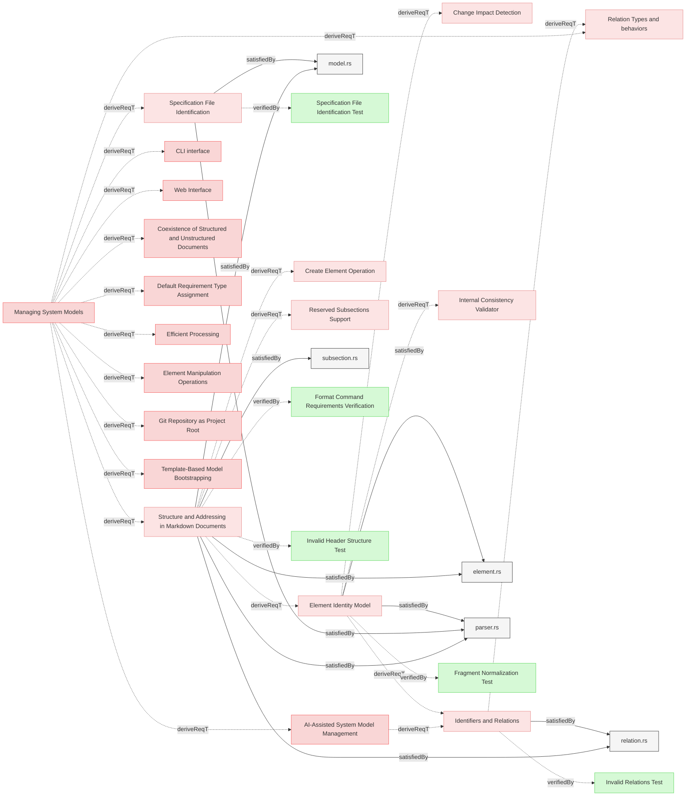

# Requirements


This document specifies requirements for markdown document structure, element identification, and relation parsing in Reqvire.

### Specification File Identification

The system shall only parse markdown files that are identified as specification files. A markdown file is considered a specification file if and only if its first level-1 heading (`#`) is exactly `# Requirements`. Files not meeting this criterion shall be ignored during model parsing, even if they have a `.md` extension.

#### Details
- The `# Requirements` heading must be the first H1 header in the file
- Leading whitespace, blank lines, or frontmatter before the heading are allowed
- Files without `# Requirements` as first H1 are silently skipped (no error)
- This rule applies in addition to `.gitignore` and `.reqvireignore` exclusions
- The page title is not stored or tracked by the system

#### Relations
  * derivedFrom: [Managing System Models](../UserStories.md#managing-system-models)
  * verifiedBy: [Specification File Identification Test](ParsingAndValidationVerifications.md#specification-file-identification-test)
  * satisfiedBy: [parser.rs](../../core/src/parser.rs)
  * satisfiedBy: [model.rs](../../core/src/model.rs)
---

### Structure and Addressing in Markdown Documents

The system shall implement semi-structured markdown format specifications that defines the structure, rules, and usage of **Elements**, **Subsections**, **Relations**, and **Identifiers** in Markdown (`.md`) documents following clearly defined specifications.

#### Details
<details>
<summary>View Full Specification</summary>

## Elements in Markdown Documents

An **Element** is a uniquely identifiable system element within a Markdown document. It starts with a `###` header and includes all content under that header until the next header of the same or higher hierarchy.

### Structure of an Element

1. **Element Header**
  - The `###` header defines the start of an element.
  - The text of the `###` header serves as the **element name**.
  - The element name must be globally unique to ensure unambiguous references.

2. **Element Content**
  - The element includes all content under the `###` header until:
    - The next `###` header, or
    - A higher-level header (`##`, `#`), or
    - The end of the document.
  - The content can include:
    - Text
    - Subheaders (e.g., `####`)
    - Bullet points, code blocks, tables, etc.


## Rules for Elements

1. **Header Format**:
   - An element must start with a `###` header.
   - The `###` header text must not be empty.

2. **Global Uniqueness**:
   - Element names must be globally unique across all files in the model.
   - Element names serve as stable IDs for element identity independent of file location.
   - File location is the only containment property tracked by the system.

3. **Nested Subheaders**:
   - Subheaders within an element defined with `####` header are part of the same element and do not create new elements.

4. **No Overlapping Content**:
   - Content in an element belongs exclusively to that element and cannot overlap with another.

## Section Headers (H2) - Not Tracked

Section headers (`## Header`) may exist in markdown documents for visual organization but are **not tracked** by the system:
- The parser ignores `##` headers during model construction
- Elements are indexed by their position within the file, not within sections
- When writing/formatting files, existing `##` headers are preserved but not managed
- The `--index` parameter in CLI commands refers to element position in the entire file

### Examples of Elements

Single Element:
```markdown
### My Element

This is the content of My Element.

#### Subsection
Additional details about My Element.
```

Multiple Elements:
```markdown
### Element One

This is the content of Element One.

### Element Two

This is the content of Element Two.
```

Nested Subheaders:
```markdown
### Main Element
This is the main element content.

#### Subsection
Details about the subsection.

#### Another Subsection
More details about another subsection.
```

### Invalid Cases

Element headers empty:
```
###
```

Headers not unique within the model:
```markdown
### Duplicate
Content of the first duplicate.

### Duplicate
Content of the second duplicate.
```

## Subsections in Markdown documents

An element may contain different **Subsections**, some of which are strictly defined, while others allow free-form content.
- **Reserved Subsections**: These subsections follow a predefined structure and behavior.
- **Other Subsections**: These allow additional descriptive or supporting information.

Subsections starts with the `#### Subsection Name` and ends either with new element or next subsection.
Subsection must be located **within an element chunk**.

The `#### ` header marks the beginning of the subsection.
It must appear directly within an element chunk, **following** the `###` header of the parent element and any preceding content, including previous subsections.
Each element chunk can have **at most one** `#### SubsectionName` subsection where 'SubsectionName' is a unique name of the subsection within an element.

Some subsections are **reserved** with predefined structure and behavior, while others allow free-form content. The specific reserved subsections are defined separately as capabilities of the system.

</details>

#### Relations
  * derivedFrom: [Managing System Models](../UserStories.md#managing-system-models)
  * satisfiedBy: [relation.rs](../../core/src/relation.rs)
  * satisfiedBy: [element.rs](../../core/src/element.rs)
  * satisfiedBy: [subsection.rs](../../core/src/subsection.rs)
  * satisfiedBy: [parser.rs](../../core/src/parser.rs)
  * satisfiedBy: [model.rs](../../core/src/model.rs)
---

### Identifiers and Relations

The system shall implement  **Identifiers** and **Relations** following clearly defined specifications to ensure consistency, validity, and efficient querying and manipulation of these entities.

#### Details
<details>
<summary>View Full Specification</summary>

## Identifiers in Markdown Documents

An **identifier** is a location-based reference for addressing elements in markdown documents.
It consists of a file path and optionally an element name (fragment).

**Distinction from Element ID**:
- **Identifier**: Location-based address for targeting elements in relations (`file.md#element-name`)
- **Element ID**: Stable identity independent of location (derived from element name)

Identifiers are used for writing relations in markdown and cross-referencing between elements. The system resolves identifiers to Element IDs during parsing for internal tracking and change detection. When an element is relocated to a different file or section, its identifier changes but its Element ID remains stable.

## Identifier in markdown document can be of several types

-**Identifier**
  - An internal system element reference with fragment, pointing to specific elements within markdown documents.
  - Used for element-to-element relations (e.g., `derivedFrom`, `verifiedBy`, `verify`)
  - **Example**: `"file.md#element-name"`
- **ExternalUrl**
  - An external URL represented as a string.
  - Used for references to external resources
  - **Example**: `"https://example.com"`
- **InternalPath**
  - An internal filesystem file path without fragment, pointing to implementation files.
  - Used for satisfaction and traceability relations (e.g., `satisfiedBy`, `satisfy`, `trace`)
  - **Example**: `"../../core/src/diagrams.rs"`
  
  
### Identifier Path Resolution Rules

- If an identifier **starts with `/`**, it is considered relative to the **git repository root folder**.
- If an identifier **does not start with `/`**, it is considered **relative** to the path of the document in which it appears.

Each **identifier** must uniquely reference either:
  - A **file**, or
  - An **element within a file**.

#### Identifier Path Resolution Examples

Assuming the **<git repository root> folder** is `project` and a file exists at `/path/to/project/documents/File1.md`:

| Identifier | Resolves to | Type  |
|------------|------------|-----------|
| `File2.md` | `project/documents/File2.md` | InternalPath |
| `subfolder/File3.md` | `project/documents/subfolder/File3.md` | InternalPath |
| `../File4.md` | `project/File4.md` | InternalPath |
| `/project/File4.md` | `project/File4.md` | InternalPath |
| `https://example.com` | `https://example.com` | ExternalUrl |
| `../Requirments#element-name` | `project/Requirments#element-name` | Identifier |

---

### Identifier Form Variations and Examples

System recognises 2 kinds of identifier that may appear in documents and relations:
 * Simple identifiers
 * GitHub-style Markdown Link Identifiers


Both Simple identifier and link part of GitHub-style markdown identifier can be etiher internal internal paths or external links (eg. starting with known scheme eg. https://)
 
 
When parsing identifiers, both styles are nomarlized into the same form used internally by the system.

As part of normailization process, element names are converted to **GitHub-style anchor link** fragments which are internal identifer representations:
  - Convert to **lowercase**.
  - Replace **spaces with hyphens (`-`)**.
  - Remove **disallowed characters**.
  - Remove **leading and trailing whitespace**.


#### 1. Simple Identifiers

Plain file or element references, following the path resolution rules.


Examples:

- File only identifier found in the document '<git repository root>/path/to/document.md'
```
file.md
```
  - Normalized to '<git repository root>/path/to/file.md'

- File with an element fragment in the document '<git repository root>/path/to/document.md':  
```
file.md#element name
```
  - Normalized to '<git repository root>/path/to/file.md#element-name'

- Relative path with an element fragment in the document '<git repository root>/path/to/document.md':  
```
../relative_path/file.md#element name
```
  - Normalized to '<git repository root>/path/file.md#element-name'

- Element name fragment only (within the same file) in the document '<git repository root>/path/to/document.md':  
```
#element name
```
  - Normalized to '<git repository root>/path/to/document.md#element-name'
  
  
- Relative path with the element fragment with special characters in the document '<git repository root>/path/to/document.md':
```
path/file.md#My Element (Draft)
```
  - Normalized to '<git repository root>/path/to/path/file.md##my-element-draft'
  

- Absolute path with the element fragment in any document:
```
/path/file.md#Elements
```
  - Normalized to '<git repository root>/path/file.md#elements'
  
       
#### 2. GitHub-style Markdown Link Identifiers

A valid GitHub-style Markdown link to a file or a fragment within a file.
Identifier is considered the **link** part of the markdown link: everything inside '(identifier)'.

Once link part is obtained from GitHub-style Markdown link, it is following same rules for normalization as **simple identifiers**. 
   
Examples:

- File link in '<git repository root>/path/to/document.md':  
```
[Specification](documents/specification.md)
```
  - Normalized to '<git repository root>/path/to/path/documents/specification.md'

- Fragment link in '<git repository root>/path/to/document.md':  :  
```
[My Element](documents/specification.md#my-element)
```
  - Normalized to '<git repository root>/path/to/path/documents/specification.md#my-element'

---


##  Relations in Markdown Documents

The `#### Relations` subsection specifies associations between elements, files, or other resources, forming the logical and dependency structure of the model.  

The `#### Relations` subsection:
- Is a dedicated part of an **element** section in Markdown document.
- Starts with the `#### Relations` header.
- Contains a list of relations in a specific format.


The `#### Relations` subsection must be located within an element chunk.
Each element chunk can have at most one `#### Relations` subsection.

The `#### Relations` header marks the beginning of the subsection.

The `#### Relations` subsection must appear directly within an element  chunk.
It must follow the `###` header of the parent element and any preceding content.


### Relation Structure

- Relation entries are listed as bullet points (`*`), with **two spaces** (`  *`) of indentation.

####  **Relation Format**
   - Relations follow this format:
     ```
     * relationType: **identifier**
     ```
   - Example:
     ```
     * dependsOn: [Element2](#element2)
     ```

####  **Relation Type**
   - Specifies the type of the relationship.
   - Allowed characters: `[a-zA-Z]`
   - Minimum length: **2 characters**  
   - Maximum length: **80 characters**  
   - Must be one of the predefined, case-sensitive types


####  **Target Identifier**
   - Specifies the target of the relation.
   - Must be a valid **Simple Identifier** or **Git Valid Markdown Link Identifier** as defined in this document.


---

### Examples of `#### Relations`

#### 1. **Simple Relations**
```markdown


### My Element
This is the content of My Element.

#### Relations
  * dependsOn: [Element2](#element2)
  * relatedTo: [path/to/anotherFile.md/Section3](path/to/anotherFile.html#section3)
  * uses: [file.md](file.html)
```

#### 2. **Relations with Special Characters**
```markdown


### API v2.0
Details about API version 2.0.

#### Relations
  * satisfies: [documents/specification.md#API: v2.0](documents/specification.html#api-v20)

```

#### 3. **Relation to an Element in the Same File**
If the referenced element exists within the same file, the identifier can be a fragment only.

```markdown

#### Relations
  * extends: [Another Section](#another-section)
```

#### 4. **Relative Path Relations**
If the referenced file is located in a subfolder relative to the current document, use a relative path.
```markdown

#### Relations
  * derive: [subfolder/details.md#refined-section](subfolder/details.html#refined-section)

```

#### 5. **Absolute Path Relations**

If the reference starts with /, it points to a file or element relative to the git repository root folder.

```markdown

#### Relations
  * verifiedBy: [/specifications.md#verification-steps](/specifications.html#verification-steps)

```

#### 6. **Invalid Relations Example**

```markdown

This element contains invalid relation entries.

#### Relations
  * derivedFrom: [Element2](#element2)
* InvalidEntry
* : MissingRelationType
  * trace: [path/to/file.md](path/to/file.html)
```

## Identifier Usage in Relations

Identifiers are used in relations to reference files or specific elements within files. Examples:

1. **Relation to a File**:
   ```markdown
   #### Relations
     * satisfiedBy: [documents/specification.md](documents/specification.html)
   ```
    
2. **Relation to an Element**:
   ```markdown
   #### Relations
     * derivedFrom: [documents/specification.md/section one](documents/specification.html#section-one)
   ```
   

## Validation rules

The system must validate relation usage according to these rules:
- Only the relation types defined in this registry are allowed
- Relations should connect elements of appropriate types
- Circular dependencies should be detected and reported
- Duplicate relation entries of same type and target are not allowed
- **Identifier** targets (with fragments) must reference existing elements in markdown documents
- **InternalPath** targets (without fragments) must reference existing files in the filesystem
- **ExternalUrl** targets are not validated for existence
      

</details>

#### Relations
  * derivedFrom: [Element Identity Model](#element-identity-model)
  * derivedFrom: [AI-Assisted System Model Management](../UserStories.md#ai-assisted-system-model-management)
  * satisfiedBy: [relation.rs](../../core/src/relation.rs)
---

### Element Identity Model

The system shall distinguish between element identity (ID) and element addressing (identifier) to support stable element tracking independent of file location.

#### Details
<details>
<summary>View Full Specification</summary>

## Element ID vs Identifier

The system maintains two distinct concepts for element identification:

### Element ID

An **Element ID** is a stable unique identifier for element identity:

- **Source**: Derived from the element name (H3 header text)
- **Uniqueness**: Globally unique across the entire model
- **Stability**: Remains unchanged when element is relocated between files or sections
- **Purpose**: Used internally for change detection and tracking element identity across versions
- **Format**: Normalized element name following GitHub fragment identifier rules
- **Visibility**: Internal to the system, not directly visible in markdown documents

**GitHub Fragment Normalization Rules:**
1. Convert all letters to lowercase
2. Replace spaces with hyphens (-)
3. Remove all punctuation characters (except hyphens and underscores)
4. Remove all other whitespace characters (tabs, newlines, etc.)
5. Trim leading and trailing whitespace before processing
6. Keep alphanumeric characters, hyphens, and underscores only

Example transformations:
- `"My Feature Name"` → `"my-feature-name"`
- `"Version 1.2.3"` → `"version-123"` (dots removed)
- `"Installation (Windows)"` → `"installation-windows"` (parentheses removed)
- `"C++ API Reference"` → `"c-api-reference"` (++ removed)
- `"my_variable_name"` → `"my_variable_name"` (underscores kept)

### Element Identifier

An **Element Identifier** is a location-based reference for addressing:

- **Source**: Combination of file path and element name fragment
- **Format**: `file_path#element-name-fragment` (e.g., `specifications/File.md#element-name`)
- **Purpose**: Used for relationship targeting in Relations subsections and cross-referencing
- **Usage**: What users write in markdown to reference elements
- **Variability**: Changes when element is relocated (file_path component changes)
- **Resolution**: System resolves identifiers to element IDs during parsing

## Relationship Between ID and Identifier

- Users write relations using **identifiers** (location-based references in markdown)
- System resolves identifiers to **element IDs** during parsing for internal tracking
- One element ID can have different identifiers over time due to relocation
- Identifier changes are detected as relocations, not identity changes

## Implicit Containment Model

Element location is tracked separately from element identity:

- **file_path field**: Records which file contains the element (implicit file containment)
- **No explicit relations**: Containment is not expressed as relations in the Relations subsection
- **Location changes**: Detected as relocations when file_path changes
- **Identity preservation**: Element ID remains stable across location changes

## Change Detection Using Element IDs

When comparing model versions:

1. Elements are matched by **Element ID** (not identifier)
2. Change types detected:
   - **Content change**: Same ID, different content hash
   - **Addition**: ID exists only in new version
   - **Removal**: ID exists only in old version
   - **Relocation**: Same ID, different file_path (without content change)
3. Pure relocations do not trigger impact propagation
4. Relocations with content changes propagate based on content change only

## Examples

### Example 1: Element with ID and Identifier

**Markdown in** `specifications/requirements.md`:
```markdown
### User Authentication

The system shall provide secure user authentication.

#### Relations
  * derivedFrom: [Security Requirements](security.md#Security-Requirements)
```

- **Element ID**: `user-authentication` (stable, internal)
- **Element Identifier**: `specifications/requirements.md#user-authentication` (current location)
- **file_path**: `specifications/requirements.md` (implicit containment)

### Example 2: Element Relocation

**Before** - in `specifications/requirements.md`:
```markdown
### User Authentication
Content here.
```
- **Element ID**: `user-authentication`
- **Identifier**: `specifications/requirements.md#user-authentication`

**After** - moved to `specifications/security/auth.md`:
```markdown
### User Authentication
Content here.
```
- **Element ID**: `user-authentication` (unchanged)
- **Identifier**: `specifications/security/auth.md#user-authentication` (changed)
- **Detection**: Change detection recognizes same ID → relocation, not removal + addition

### Example 3: Writing Relations

**User writes in markdown**:
```markdown
#### Relations
  * derivedFrom: [Parent Req](../parent.md#Parent-Req)
  * verifiedBy: [Test Case](#Test-Case)
```

**System processing**:
1. Parse identifier: `../parent.md#Parent-Req`
2. Resolve to absolute: `specifications/parent.md#parent-req`
3. Resolve to Element ID: `parent-req`
4. Store relation using Element ID internally
5. Change detection compares using Element ID

</details>

#### Relations
  * derivedFrom: [Structure and Addressing in Markdown Documents](#structure-and-addressing-in-markdown-documents)
  * satisfiedBy: [element.rs](../../core/src/element.rs)
  * satisfiedBy: [parser.rs](../../core/src/parser.rs)
---
