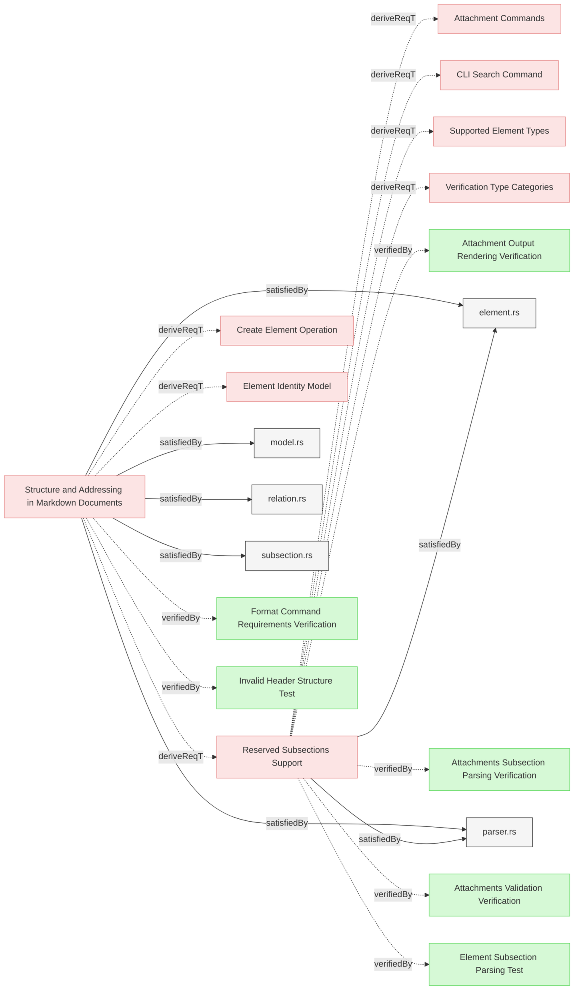

# Requirements


This document specifies requirements for reserved subsections in Reqvire markdown documents.

### Reserved Subsections Support

The system shall support the following reserved subsections with predefined structure and behavior: Relations, Details, Metadata, and Attachments.

#### Details
The system shall support following reserved subsections:
 * **Relations**: Define relationships between elements
 * **Details**: Extend requirement text with additional information
 * **Metadata**: Define element type and classification
 * **Attachments**: Link external documents

Each reserved subsection has specific parsing rules, validation requirements, and behaviors.

<details>
<summary>View Full Specification</summary>

## Relations Subsection

Must be defined with a level 4 header: `#### Relations`.

The Relations subsection defines relationships between elements using markdown bullet list syntax.

**Parsing Rules:**
- Relation entries are bullet points starting with `*`
- Format: `* relationType: [Element Name](path#element-id)`
- Duplicate relation entries within the same `#### Relations` subsection are not allowed

**Examples:**
```markdown
#### Relations
* derivedFrom: [Parent Requirement](../path/file.md#parent)
* satisfiedBy: [Implementation](../../src/module.rs)
* verifies: [Target Requirement](file.md#target)
```

## Details Subsection

Must be defined with a level 4 header: `#### Details`.

The Details subsection provides additional information directly related to the main requirement text.

**Parsing Rules:**
- When parsing `#### Details` subsections, any markdown headers or elements within `<details>...</details>` tags are skipped
- Content within the Details subsection is considered an **extension of the requirement text**
- It serves the same purpose as refinement relation in other MBSE tools and SysML
- Any statements in the Details subsection hold the same validity as the main requirement text

**Examples:**
```markdown
### My Requirement

The system shall perform action X.

#### Details
Additional context about action X:
- Constraint 1
- Constraint 2
- Performance requirement
```

## Metadata Subsection

Must be defined with a level 4 header: `#### Metadata`.

The Metadata subsection stores element properties including type and custom attributes.

**Parsing Rules:**
- Contains properties in list format: `* property_name: property_value`
- Property entries are listed as bullet points (`*`), with **two spaces** (`  *`) of indentation followed by property_name + ': ' + property_value
- May include any custom properties, not just `type`

**Reserved Properties:**

The following properties have special meaning:

- `type`: Defines the element type (supported types are defined in [Supported Element Types](ModelManagement.md#supported-element-types))
- Additional reserved properties may be defined in future releases

**Examples:**
```markdown
### My Element

This is a verification element.

#### Metadata
  * type: verification
  * priority: high
  * owner: team-a

#### Relations
* verifies: [Some Requirement](#some-requirement)
```

```markdown
### My Element

This is a verification element.

#### Details
Some details.

#### Metadata
  * type: verification
  * priority: high
  * owner: team-a

#### Relations
  * verifies: [Some Requirement](#some-requirement)
```

## Attachments Subsection

Must be defined with a level 4 header: `#### Attachments`.

The Attachments subsection links external documents to requirements.

**Parsing Rules:**
- Support markdown link syntax: `* [path](path)`
- Link text equals path (git-root-relative)
- Many-to-many relationship (multiple requirements can link same document)
- Never parse attachment files (treat as opaque)
- Auto-cleanup: remove subsection when empty

**Validation Rules (Pass 2):**
- Verify file existence on filesystem
- Validate markdown link format: `[path](path)`
- Detect duplicate attachments within element
- Report missing attachment targets as validation errors

**Examples:**
```markdown
### System Performance Requirements

The system shall meet defined performance criteria.

#### Attachments
* [docs/SLO.pdf](docs/SLO.pdf)
* [docs/benchmarks.xlsx](docs/benchmarks.xlsx)
```

</details>

#### Relations
  * derivedFrom: [Structure and Addressing in Markdown Documents](StructureAndParsing.md#structure-and-addressing-in-markdown-documents)
  * satisfiedBy: [element.rs](../../core/src/element.rs)
  * satisfiedBy: [parser.rs](../../core/src/parser.rs)
---
