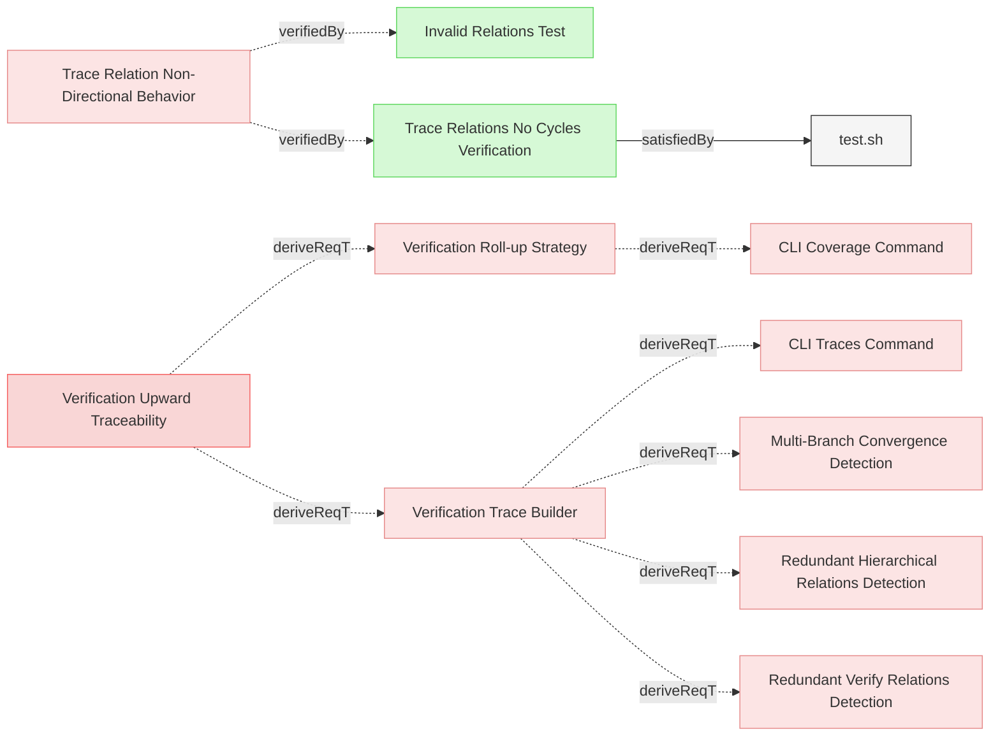

# VerificationTraces

## Verification Traceability

### Trace Relations No Cycles Verification

This test verifies that trace relations do not trigger circular dependency errors even when they form cycles, confirming that trace relations are correctly excluded from dependency cycle detection.

#### Details
The test creates a model with trace relations forming cycles (Alpha→Beta→Gamma→Alpha) and verifies that:
- Validation succeeds without circular dependency errors
- The model is processed correctly with all requirements recognized
- Trace relations maintain their traceability purpose without creating false dependencies

##### Acceptance Criteria
- System shall allow trace relations to form cycles without validation errors
- Circular dependency detection shall exclude trace relations from traversal
- Model validation shall succeed when only trace relations form cycles
- All requirements with trace cycles shall be properly processed

##### Test Criteria
- Command exits with success (zero) return code
- No circular dependency errors in output
- JSON output is valid and complete
- Expected number of requirements (8 total: 4 user, 4 system) are processed

#### Metadata
  * type: test-verification

#### Relations
  * verify: [Trace Relation Non-Directional Behavior](DiagramGeneration.md#trace-relation-non-directional-behavior)
  * satisfiedBy: [test.sh](../../tests/test-trace-no-cycles/test.sh)
---

### Verification Trace Builder

The system shall provide functionality to build upward trace trees from verification elements by traversing all upward parent relations to reach root requirements, merging all paths into a single tree structure with marked directly-verified requirements.

#### Relations
  * derivedFrom: [Verification Upward Traceability](Reporting.md#verification-upward-traceability)
---

### Verification Roll-up Strategy

The system shall implement a verification roll-up strategy where parent requirements are considered verified based on the verification status of their child requirements.

#### Details
The roll-up strategy shall work as follows:
- When a requirement has children (through derivedFrom relations), it is considered verified if ALL of its child requirements are verified, regardless of whether the parent has direct verifiedBy relations
- When a requirement has no children (leaf requirement), it is considered verified if it has direct verifiedBy relations
- A parent with any unverified child shall be marked as unverified (❌), even if the parent itself has direct verification
- Verification status rolls up from leaf requirements through the entire parent chain to root requirements
- This strategy applies to all verification matrices, coverage reports, and trace outputs

#### Relations
  * derivedFrom: [Verification Upward Traceability](Reporting.md#verification-upward-traceability)
---