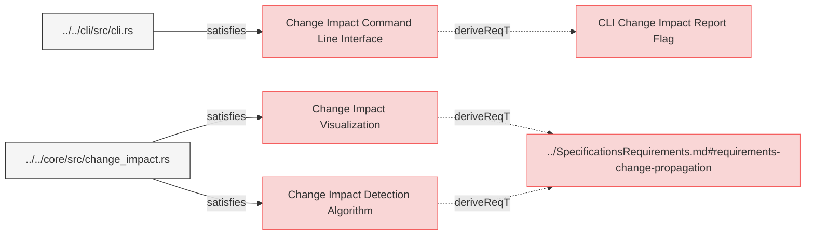

# Change Impact Detection System Requirements

This document defines the detailed requirements for the change impact detection algorithm and visualization in Reqvire. It provides the technical specifications for implementing the concepts described in the Design Specification Document for Requirements Change Impact Propagation.

## Change Impact Detection Components

---

### Change Impact Detection Algorithm

The system shall implement a requirement change detection algorithm that identifies changes between versions of the model and determines their impact through relationship traversal.

#### Details

The algorithm shall consist of the following steps:

1. **Diff Analysis**:
   - Compare the current state of a requirement with its previous state
   - Identify structural changes (additions, deletions, modifications)
   - Generate a ChangeSet representing all detected changes
   - Associate changes with specific elements in the model

2. **Impact Determination**:
   - For each changed element, identify all relations from the element
   - Apply relation-specific propagation rules as defined in RelationTypesRegistry.md
   - Consider the relation direction and change impact direction for each relation
   - Build an impact tree representing the propagation of changes

3. **Recursive Traversal**:
   - Perform a depth-first traversal of relationships
   - Create a directed acyclic graph (DAG) of change impact
   - Handle circular dependencies by preventing infinite recursion
   - Track visited nodes to prevent duplicate processing

4. **Impact Classification**:
   - Assign impact severity levels based on relation types
   - Classify changes as:
     - Direct: Changes to the element itself
     - Indirect: Changes propagated from related elements
     - Potential: Changes that might affect an element based on semantic analysis
   - Calculate aggregated impact scores for each affected element

5. **Performance Optimization**:
   - Implement caching of traversal results
   - Use parallel processing for independent branches of the impact tree
   - Apply pruning techniques to limit traversal depth when appropriate
   - Support incremental impact analysis for large models

#### Relations
  * derivedFrom: [../SpecificationsRequirements.md#requirements-change-propagation](../SpecificationsRequirements.md#requirements-change-propagation)  
  * satisfiedBy: [../../core/src/change_impact.rs](../../core/src/change_impact.rs)

---

### Change Impact Visualization

The system shall provide visual representations of change impact to help users understand the scope and implications of changes.

#### Details

The visualization shall include:

1. **Tree View**:
   - Display a hierarchical tree of affected elements
   - Group elements by impact type (direct, indirect, potential)
   - Show relation types between elements
   - Support collapsing/expanding nodes for better navigation

2. **Color Coding**:
   - Use consistent color scheme for impact types:
     - Direct impacts: Red
     - Indirect impacts: Yellow
     - Potential impacts: Blue
   - Indicate relation types with different line styles
   - Highlight newly introduced or removed relationships

3. **Interactive Elements**:
   - Allow clicking on elements to focus the view
   - Provide filtering options for relation types
   - Support search functionality within impact results
   - Enable toggling between different visualization modes

4. **Summary Statistics**:
   - Display counts of affected elements by type
   - Show metrics for impact breadth and depth
   - Calculate change propagation fan-out metrics
   - Generate overall change impact assessment

#### Relations
  * derivedFrom: [../SpecificationsRequirements.md#requirements-change-propagation](../SpecificationsRequirements.md#requirements-change-propagation)  
  * satisfiedBy: [../../core/src/change_impact.rs](../../core/src/change_impact.rs)

---

### Change Impact Command Line Interface

The system shall provide a command-line interface for initiating change impact analysis and controlling output formats.

#### Details

The CLI shall support the following functionality:

1. **Analysis Invocation**:
   - Support analyzing changes between git commits
   - Enable specifying elements to analyze by ID or pattern
   - Allow limiting analysis to specific relation types
   - Support depth limitations for large models

2. **Output Formats**:
   - Generate formatted text reports
   - Produce JSON-structured impact data
   - Create Mermaid diagrams of impact trees
   - Integrate with HTML report generation

3. **Filtering Options**:
   - Filter by element types (requirement, verification, etc.)
   - Filter by relation types
   - Filter by impact severity
   - Support inclusion/exclusion patterns

4. **Integration Points**:
   - Support integration with CI/CD pipelines
   - Enable calling from external systems via API
   - Support webhook triggers for automated analysis
   - Allow scripting of analysis operations

#### Relations
  * derivedFrom: [CLI Change Impact Report Flag](../SystemRequirements/Requirements.md#cli-change-impact-report-flag)
  * satisfiedBy: [../../cli/src/cli.rs](../../cli/src/cli.rs)

---