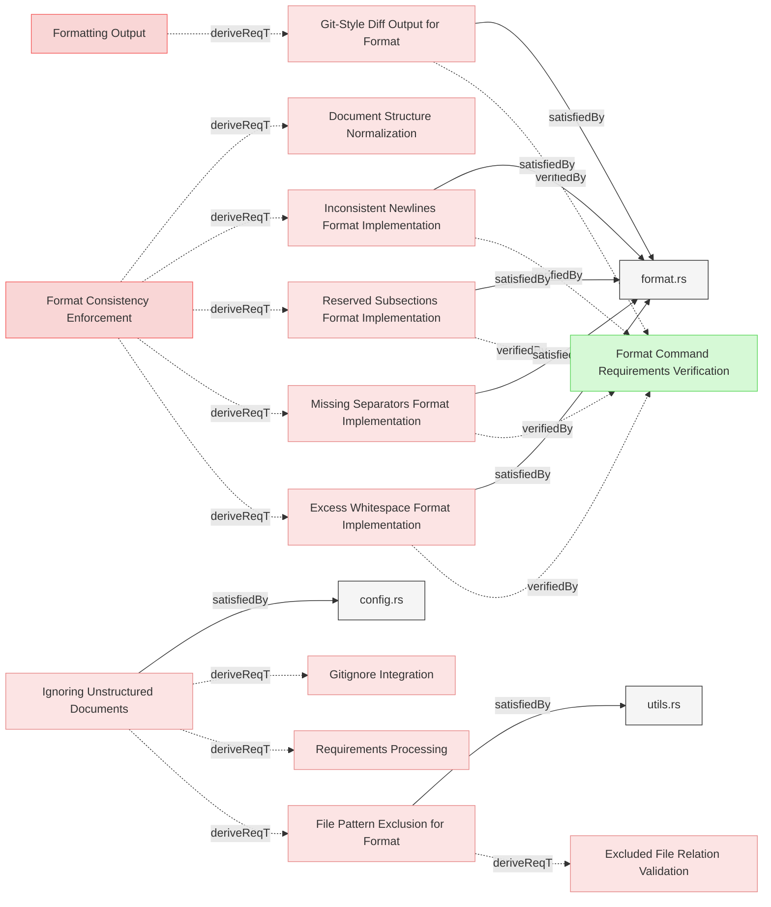
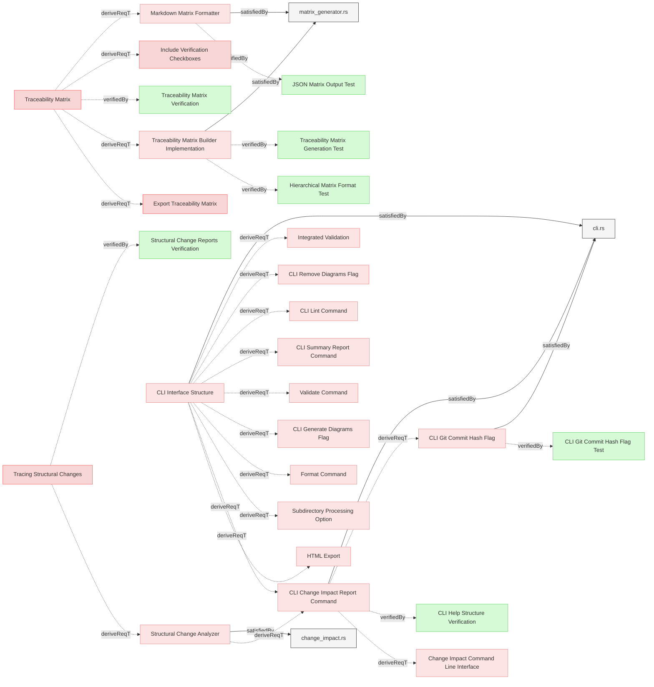
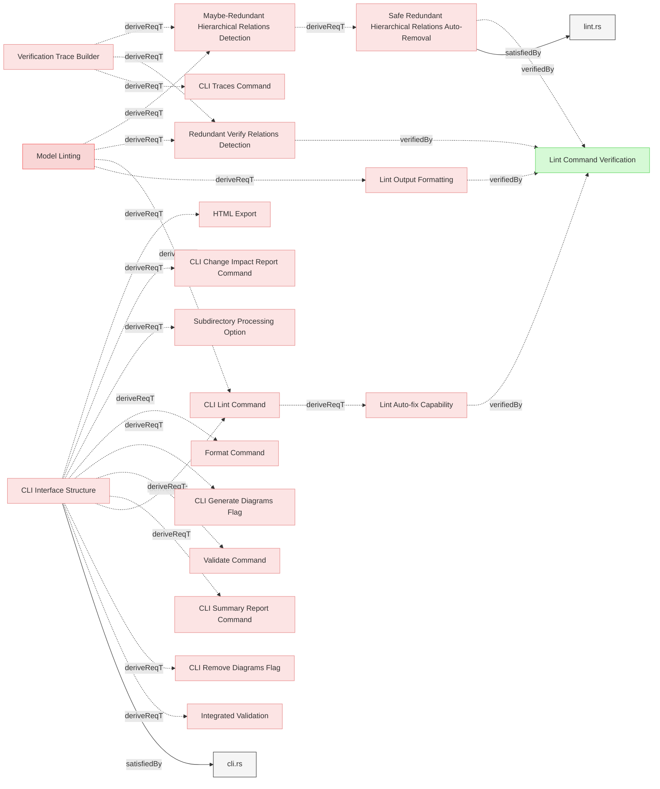

# System Requirements

## Format

### Excess Whitespace Format Implementation

The system shall detect and fix excess whitespace after element headers, subsection headers, and relation identifiers to maintain consistent formatting across all requirements documents.

#### Relations
  * derivedFrom: [Format Consistency Enforcement](../UserRequirements.md#format-consistency-enforcement)
  * satisfiedBy: [format.rs](../../core/src/format.rs)
  * verifiedBy: [Format Command Requirements Verification](../Verifications/Misc.md#format-command-requirements-verification)
---

### Inconsistent Newlines Format Implementation

The system shall detect and fix excess or missing newlines before element headers, subsection headers to maintain consistent formatting across all requirements documents.

#### Relations
  * derivedFrom: [Format Consistency Enforcement](../UserRequirements.md#format-consistency-enforcement)
  * satisfiedBy: [format.rs](../../core/src/format.rs)
  * verifiedBy: [Format Command Requirements Verification](../Verifications/Misc.md#format-command-requirements-verification)
---

### Missing Separators Format Implementation

The system shall detect consecutive element sections that lack a separator line (---) between them and insert the separator to maintain consistent visual separation in the documentation.

#### Relations
  * derivedFrom: [Format Consistency Enforcement](../UserRequirements.md#format-consistency-enforcement)
  * satisfiedBy: [format.rs](../../core/src/format.rs)
  * verifiedBy: [Format Command Requirements Verification](../Verifications/Misc.md#format-command-requirements-verification)
---

### Reserved Subsections Format Implementation

The system shall identify and fix inconsistent indentation and bullet types in relation lists and other reserved subsections, standardizing to a consistent format across all requirements documents.

#### Relations
  * derivedFrom: [Format Consistency Enforcement](../UserRequirements.md#format-consistency-enforcement)
  * satisfiedBy: [format.rs](../../core/src/format.rs)
  * verifiedBy: [Format Command Requirements Verification](../Verifications/Misc.md#format-command-requirements-verification)
---

### Git-Style Diff Output for Format

The system shall display formatting change suggestions in a git-style diff format, color-coded when possible, to clearly show what modifications will be or have been made to the documents.

#### Relations
  * derivedFrom: [Formatting Output](../UserRequirements.md#formatting-output)
  * satisfiedBy: [format.rs](../../core/src/format.rs)
  * verifiedBy: [Format Command Requirements Verification](../Verifications/Misc.md#format-command-requirements-verification)
---

### File Pattern Exclusion for Format

The system shall respect configured excluded filename patterns when performing formatting operations, ensuring that files intentionally excluded from processing do not receive inappropriate formatting suggestions.

#### Relations
  * derivedFrom: [Ignoring Unstructured Documents](#ignoring-unstructured-documents)
  * satisfiedBy: [utils.rs](../../core/src/utils.rs)
---

## Configuration

```mermaid
graph LR;
  %% REQVIRE-AUTOGENERATED-DIAGRAM
  %% Graph styling
  classDef userRequirement fill:#f9d6d6,stroke:#f55f5f,stroke-width:1px;
  classDef systemRequirement fill:#fce4e4,stroke:#e68a8a,stroke-width:1px;
  classDef verification fill:#d6f9d6,stroke:#5fd75f,stroke-width:1px;
  classDef default fill:#f5f5f5,stroke:#333333,stroke-width:1px;

  be83c2991e9535c7["Ignoring Unstructured Documents"];
  class be83c2991e9535c7 systemRequirement;
  click be83c2991e9535c7 "Requirements.md#ignoring-unstructured-documents";
  8419dcc77d92b609["config.rs"];
  class 8419dcc77d92b609 default;
  click 8419dcc77d92b609 "../../cli/src/config.rs";
  be83c2991e9535c7 -->|satisfiedBy| 8419dcc77d92b609;
  a0da26f71f33b98f["Gitignore Integration"];
  class a0da26f71f33b98f systemRequirement;
  click a0da26f71f33b98f "Requirements.md#gitignore-integration";
  be83c2991e9535c7 -.->|deriveReqT| a0da26f71f33b98f;
  bed8d0948b3e5ccd["Requirements Processing"];
  class bed8d0948b3e5ccd systemRequirement;
  click bed8d0948b3e5ccd "Requirements.md#requirements-processing";
  be83c2991e9535c7 -.->|deriveReqT| bed8d0948b3e5ccd;
  821926b1be52e46b["File Pattern Exclusion for Format"];
  class 821926b1be52e46b systemRequirement;
  click 821926b1be52e46b "Requirements.md#file-pattern-exclusion-for-format";
  be83c2991e9535c7 -.->|deriveReqT| 821926b1be52e46b;
  9078905027caefa6["Gitignore Integration Test"];
  class 9078905027caefa6 verification;
  click 9078905027caefa6 "../Verifications/ValidationTests.md#gitignore-integration-test";
  a0da26f71f33b98f -.->|verifiedBy| 9078905027caefa6;
  a9d6e2569d5acd60["User Requirement Root Folders Support"];
  class a9d6e2569d5acd60 systemRequirement;
  click a9d6e2569d5acd60 "Requirements.md#user-requirement-root-folders-support";
  8419dcc77d92b609["config.rs"];
  class 8419dcc77d92b609 default;
  click 8419dcc77d92b609 "../../cli/src/config.rs";
  a9d6e2569d5acd60 -->|satisfiedBy| 8419dcc77d92b609;
  a9d6e2569d5acd60 -.->|deriveReqT| bed8d0948b3e5ccd;
  f0d721424636370e["Coexistence of Structured and Unstructured Documents"];
  class f0d721424636370e userRequirement;
  click f0d721424636370e "../ManagingMbseModelsRequirements.md#coexistence-of-structured-and-unstructured-documents";
  f0d721424636370e -.->|deriveReqT| be83c2991e9535c7;
  16b4b380c917deb1["Project Configuration with YAML"];
  class 16b4b380c917deb1 userRequirement;
  click 16b4b380c917deb1 "../ManagingMbseModelsRequirements.md#project-configuration-with-yaml";
  16b4b380c917deb1 -.->|deriveReqT| be83c2991e9535c7;
  d9354ef2eca0f2d0["Configurable User Requirements Root Folder"];
  class d9354ef2eca0f2d0 userRequirement;
  click d9354ef2eca0f2d0 "../ManagingMbseModelsRequirements.md#configurable-user-requirements-root-folder";
  16b4b380c917deb1 -.->|deriveReqT| d9354ef2eca0f2d0;
  7bdf935ec6d8effe["Subdirectory Processing Option"];
  class 7bdf935ec6d8effe systemRequirement;
  click 7bdf935ec6d8effe "Requirements.md#subdirectory-processing-option";
  16b4b380c917deb1 -.->|deriveReqT| 7bdf935ec6d8effe;
  c9cc6878a73bb951["Default Requirement Type Assignment"];
  class c9cc6878a73bb951 userRequirement;
  click c9cc6878a73bb951 "../ManagingMbseModelsRequirements.md#default-requirement-type-assignment";
  d9354ef2eca0f2d0 -.->|deriveReqT| c9cc6878a73bb951;
  d9354ef2eca0f2d0 -.->|deriveReqT| a9d6e2569d5acd60;
```

### User Requirement Root Folders Support

The system shall implement configuration parameter that would specify a single folder path, relative to the Git repository root, that is designated as the primary location for user requirements.

#### Details
'paths.user_requirements_root_folder' parameter of type  String defines default folder for the user-requirements.

All elements in markdown files (except those matching exclusion patterns) in root of this folders are considered **user requirements** unless explicitly set as other element type in the metadata.

#### Relations
  * derivedFrom: [Configurable User Requirements Root Folder](../ManagingMbseModelsRequirements.md#configurable-user-requirements-root-folder)
  * satisfiedBy: [config.rs](../../cli/src/config.rs)
---

### Ignoring Unstructured Documents

The system shall support configurable glob patterns to exclude specific files from requirement processing.

#### Details
```reqvire.yaml
paths:

  # Glob patterns to exclude from structured documents processing
  excluded_filename_patterns:
    - "**/Logical*.md"
    - "**/Physical*.md"
```

#### Relations
  * derivedFrom: [Project Configuration with YAML](../ManagingMbseModelsRequirements.md#project-configuration-with-yaml)
  * derivedFrom: [Coexistence of Structured and Unstructured Documents](../ManagingMbseModelsRequirements.md#coexistence-of-structured-and-unstructured-documents)
  * satisfiedBy: [config.rs](../../cli/src/config.rs)
---

### Gitignore Integration

The system SHALL read exclusion patterns from the repository root .gitignore file to automatically exclude files from requirement processing.

#### Details

Reqvire integrates with Git workflows by respecting the repository's .gitignore file. This ensures that requirements management follows the same file exclusion patterns as version control.

**Rules:**
- ONLY the root .gitignore file SHALL be used (not nested .gitignore files in subdirectories)
- .gitignore patterns SHALL be combined with configured excluded_filename_patterns from reqvire.yaml
- Files matching ANY exclusion pattern (from .gitignore OR from config) SHALL be excluded from processing

**Rationale:**
Requirements as code are fully integrated into Git workflows, so anything gitignored should not be processed by Reqvire. This provides consistent behavior between version control and requirements management, avoiding confusion when files are committed to Git but excluded from requirement processing or vice versa.

#### Metadata
  * type: requirement

#### Relations
  * derivedFrom: [Ignoring Unstructured Documents](#ignoring-unstructured-documents)
  * satisfiedBy: [config.rs](../../cli/src/config.rs)
---

## CLI

```mermaid
graph LR;
  %% REQVIRE-AUTOGENERATED-DIAGRAM
  %% Graph styling
  classDef userRequirement fill:#f9d6d6,stroke:#f55f5f,stroke-width:1px;
  classDef systemRequirement fill:#fce4e4,stroke:#e68a8a,stroke-width:1px;
  classDef verification fill:#d6f9d6,stroke:#5fd75f,stroke-width:1px;
  classDef default fill:#f5f5f5,stroke:#333333,stroke-width:1px;

  1e20313bdf4c143c["Model Diagram SVG Generation"];
  class 1e20313bdf4c143c systemRequirement;
  click 1e20313bdf4c143c "Requirements.md#model-diagram-svg-generation";
  31c322770503f80["Model Diagram SVG Verification"];
  class 31c322770503f80 verification;
  click 31c322770503f80 "../Verifications/DiagramsTests.md#model-diagram-svg-verification";
  1e20313bdf4c143c -.->|verifiedBy| 31c322770503f80;
  8f22faacdb454b23["CLI Interface Structure"];
  class 8f22faacdb454b23 systemRequirement;
  click 8f22faacdb454b23 "Requirements.md#cli-interface-structure";
  80defdd4cbc7ee18["cli.rs"];
  class 80defdd4cbc7ee18 default;
  click 80defdd4cbc7ee18 "../../cli/src/cli.rs";
  8f22faacdb454b23 -->|satisfiedBy| 80defdd4cbc7ee18;
  5a67efb6be1c6c72["Integrated Validation"];
  class 5a67efb6be1c6c72 systemRequirement;
  click 5a67efb6be1c6c72 "TwoPassValidation.md#integrated-validation";
  8f22faacdb454b23 -.->|deriveReqT| 5a67efb6be1c6c72;
  749eaee85cfd0a43["CLI Remove Diagrams Flag"];
  class 749eaee85cfd0a43 systemRequirement;
  click 749eaee85cfd0a43 "Requirements.md#cli-remove-diagrams-flag";
  8f22faacdb454b23 -.->|deriveReqT| 749eaee85cfd0a43;
  e049c04afaa864c["CLI Lint Command"];
  class e049c04afaa864c systemRequirement;
  click e049c04afaa864c "Requirements.md#cli-lint-command";
  8f22faacdb454b23 -.->|deriveReqT| e049c04afaa864c;
  5a07afd22db51c40["CLI Summary Report Command"];
  class 5a07afd22db51c40 systemRequirement;
  click 5a07afd22db51c40 "Requirements.md#cli-summary-report-command";
  8f22faacdb454b23 -.->|deriveReqT| 5a07afd22db51c40;
  b4f1757fc8831083["Validate Command"];
  class b4f1757fc8831083 systemRequirement;
  click b4f1757fc8831083 "Requirements.md#validate-command";
  8f22faacdb454b23 -.->|deriveReqT| b4f1757fc8831083;
  7223dec8fe51900f["CLI Generate Diagrams Flag"];
  class 7223dec8fe51900f systemRequirement;
  click 7223dec8fe51900f "Requirements.md#cli-generate-diagrams-flag";
  8f22faacdb454b23 -.->|deriveReqT| 7223dec8fe51900f;
  875f89a9f301fb90["Format Command"];
  class 875f89a9f301fb90 systemRequirement;
  click 875f89a9f301fb90 "Requirements.md#format-command";
  8f22faacdb454b23 -.->|deriveReqT| 875f89a9f301fb90;
  7bdf935ec6d8effe["Subdirectory Processing Option"];
  class 7bdf935ec6d8effe systemRequirement;
  click 7bdf935ec6d8effe "Requirements.md#subdirectory-processing-option";
  8f22faacdb454b23 -.->|deriveReqT| 7bdf935ec6d8effe;
  4c9ae0a2fb751ce6["CLI Change Impact Report Command"];
  class 4c9ae0a2fb751ce6 systemRequirement;
  click 4c9ae0a2fb751ce6 "Requirements.md#cli-change-impact-report-command";
  8f22faacdb454b23 -.->|deriveReqT| 4c9ae0a2fb751ce6;
  5deb63503bdf77c["HTML Export"];
  class 5deb63503bdf77c systemRequirement;
  click 5deb63503bdf77c "Requirements.md#html-export";
  8f22faacdb454b23 -.->|deriveReqT| 5deb63503bdf77c;
  52fe8f19c3102ecf["Serve Command"];
  class 52fe8f19c3102ecf systemRequirement;
  click 52fe8f19c3102ecf "Requirements.md#serve-command";
  52fe8f19c3102ecf -.->|trace| b4f1757fc8831083;
  80defdd4cbc7ee18["cli.rs"];
  class 80defdd4cbc7ee18 default;
  click 80defdd4cbc7ee18 "../../cli/src/cli.rs";
  52fe8f19c3102ecf -->|satisfiedBy| 80defdd4cbc7ee18;
  e313808f7a755f6["serve.rs"];
  class e313808f7a755f6 default;
  click e313808f7a755f6 "../../cli/src/serve.rs";
  52fe8f19c3102ecf -->|satisfiedBy| e313808f7a755f6;
  a5590d2dcfffe431["Serve Command Verification"];
  class a5590d2dcfffe431 verification;
  click a5590d2dcfffe431 "../Verifications/Misc.md#serve-command-verification";
  52fe8f19c3102ecf -.->|verifiedBy| a5590d2dcfffe431;
  5ffd0c57f51e3b22["Export Related System Elements"];
  class 5ffd0c57f51e3b22 systemRequirement;
  click 5ffd0c57f51e3b22 "Requirements.md#export-related-system-elements";
  c3d63c5d4133e346["html_export.rs"];
  class c3d63c5d4133e346 default;
  click c3d63c5d4133e346 "../../core/src/html_export.rs";
  5ffd0c57f51e3b22 -->|satisfiedBy| c3d63c5d4133e346;
  d0e6cc47b904faa5["html.rs"];
  class d0e6cc47b904faa5 default;
  click d0e6cc47b904faa5 "../../core/src/html.rs";
  5ffd0c57f51e3b22 -->|satisfiedBy| d0e6cc47b904faa5;
  4ecd49d71920c1fc["Detailed Error Handling and Logging"];
  class 4ecd49d71920c1fc systemRequirement;
  click 4ecd49d71920c1fc "Requirements.md#detailed-error-handling-and-logging";
  a581221890d15c0c["error.rs"];
  class a581221890d15c0c default;
  click a581221890d15c0c "../../core/src/error.rs";
  4ecd49d71920c1fc -->|satisfiedBy| a581221890d15c0c;
  7de12ce482cb509["Validation Error Handling"];
  class 7de12ce482cb509 systemRequirement;
  click 7de12ce482cb509 "TwoPassValidation.md#validation-error-handling";
  4ecd49d71920c1fc -.->|deriveReqT| 7de12ce482cb509;
  837782fd5fe407a0["Document Structure Normalization"];
  class 837782fd5fe407a0 systemRequirement;
  click 837782fd5fe407a0 "Requirements.md#document-structure-normalization";
  b7c871ab64a7059a["graph_registry.rs"];
  class b7c871ab64a7059a default;
  click b7c871ab64a7059a "../../core/src/graph_registry.rs";
  837782fd5fe407a0 -->|satisfiedBy| b7c871ab64a7059a;
  f22d93285fcd7664["parser.rs"];
  class f22d93285fcd7664 default;
  click f22d93285fcd7664 "../../core/src/parser.rs";
  837782fd5fe407a0 -->|satisfiedBy| f22d93285fcd7664;
  735766802775ec41["Format Command Requirements Verification"];
  class 735766802775ec41 verification;
  click 735766802775ec41 "../Verifications/Misc.md#format-command-requirements-verification";
  837782fd5fe407a0 -.->|verifiedBy| 735766802775ec41;
  80defdd4cbc7ee18["cli.rs"];
  class 80defdd4cbc7ee18 default;
  click 80defdd4cbc7ee18 "../../cli/src/cli.rs";
  b4f1757fc8831083 -->|satisfiedBy| 80defdd4cbc7ee18;
  e37dc7f46d75d46["Invalid Relations Test"];
  class e37dc7f46d75d46 verification;
  click e37dc7f46d75d46 "../Verifications/ValidationTests.md#invalid-relations-test";
  b4f1757fc8831083 -.->|verifiedBy| e37dc7f46d75d46;
  34c75e4a88e1f381["CLI Help Structure Verification"];
  class 34c75e4a88e1f381 verification;
  click 34c75e4a88e1f381 "../Verifications/Misc.md#cli-help-structure-verification";
  b4f1757fc8831083 -.->|verifiedBy| 34c75e4a88e1f381;
  80defdd4cbc7ee18["cli.rs"];
  class 80defdd4cbc7ee18 default;
  click 80defdd4cbc7ee18 "../../cli/src/cli.rs";
  875f89a9f301fb90 -->|satisfiedBy| 80defdd4cbc7ee18;
  875f89a9f301fb90 -.->|verifiedBy| 735766802775ec41;
  875f89a9f301fb90 -.->|verifiedBy| 34c75e4a88e1f381;
  2c4fbf015f452a3e["Model HTML Pages Design"];
  class 2c4fbf015f452a3e systemRequirement;
  click 2c4fbf015f452a3e "Requirements.md#model-html-pages-design";
  d0e6cc47b904faa5["html.rs"];
  class d0e6cc47b904faa5 default;
  click d0e6cc47b904faa5 "../../core/src/html.rs";
  2c4fbf015f452a3e -->|satisfiedBy| d0e6cc47b904faa5;
  c3d63c5d4133e346["html_export.rs"];
  class c3d63c5d4133e346 default;
  click c3d63c5d4133e346 "../../core/src/html_export.rs";
  2c4fbf015f452a3e -->|satisfiedBy| c3d63c5d4133e346;
  a21995894299effb["Index Generation"];
  class a21995894299effb systemRequirement;
  click a21995894299effb "Requirements.md#index-generation";
  1a173441705701a0["index_generator.rs"];
  class 1a173441705701a0 default;
  click 1a173441705701a0 "../../core/src/index_generator.rs";
  a21995894299effb -->|satisfiedBy| 1a173441705701a0;
  c3d63c5d4133e346["html_export.rs"];
  class c3d63c5d4133e346 default;
  click c3d63c5d4133e346 "../../core/src/html_export.rs";
  a21995894299effb -->|satisfiedBy| c3d63c5d4133e346;
  14ef985b9a43174e["HTML Export Verification"];
  class 14ef985b9a43174e verification;
  click 14ef985b9a43174e "../Verifications/Misc.md#html-export-verification";
  a21995894299effb -.->|verifiedBy| 14ef985b9a43174e;
  c1851df0c89e80f8["HTML Navigation Enhancement"];
  class c1851df0c89e80f8 systemRequirement;
  click c1851df0c89e80f8 "Requirements.md#html-navigation-enhancement";
  d0e6cc47b904faa5["html.rs"];
  class d0e6cc47b904faa5 default;
  click d0e6cc47b904faa5 "../../core/src/html.rs";
  c1851df0c89e80f8 -->|satisfiedBy| d0e6cc47b904faa5;
  c3d63c5d4133e346["html_export.rs"];
  class c3d63c5d4133e346 default;
  click c3d63c5d4133e346 "../../core/src/html_export.rs";
  c1851df0c89e80f8 -->|satisfiedBy| c3d63c5d4133e346;
  c1851df0c89e80f8 -.->|verifiedBy| 14ef985b9a43174e;
  c3d63c5d4133e346["html_export.rs"];
  class c3d63c5d4133e346 default;
  click c3d63c5d4133e346 "../../core/src/html_export.rs";
  5deb63503bdf77c -->|satisfiedBy| c3d63c5d4133e346;
  d0e6cc47b904faa5["html.rs"];
  class d0e6cc47b904faa5 default;
  click d0e6cc47b904faa5 "../../core/src/html.rs";
  5deb63503bdf77c -->|satisfiedBy| d0e6cc47b904faa5;
  80defdd4cbc7ee18["cli.rs"];
  class 80defdd4cbc7ee18 default;
  click 80defdd4cbc7ee18 "../../cli/src/cli.rs";
  5deb63503bdf77c -->|satisfiedBy| 80defdd4cbc7ee18;
  5deb63503bdf77c -.->|deriveReqT| 1e20313bdf4c143c;
  5deb63503bdf77c -.->|deriveReqT| 52fe8f19c3102ecf;
  5deb63503bdf77c -.->|deriveReqT| 5ffd0c57f51e3b22;
  5deb63503bdf77c -.->|deriveReqT| 2c4fbf015f452a3e;
  5deb63503bdf77c -.->|deriveReqT| a21995894299effb;
  5deb63503bdf77c -.->|verifiedBy| 34c75e4a88e1f381;
  ed31b6bed1cde2f8["Provide Validation Reports"];
  class ed31b6bed1cde2f8 userRequirement;
  click ed31b6bed1cde2f8 "../UserRequirements.md#provide-validation-reports";
  ed31b6bed1cde2f8 -.->|deriveReqT| 5a67efb6be1c6c72;
  ed31b6bed1cde2f8 -.->|deriveReqT| b4f1757fc8831083;
  d667d94124e3bab7["Validation Report Generator"];
  class d667d94124e3bab7 systemRequirement;
  click d667d94124e3bab7 "Requirements.md#validation-report-generator";
  ed31b6bed1cde2f8 -.->|deriveReqT| d667d94124e3bab7;
  c0cc52075c4770f2["Two-Pass Validation Strategy"];
  class c0cc52075c4770f2 systemRequirement;
  click c0cc52075c4770f2 "TwoPassValidation.md#two-pass-validation-strategy";
  d50a859650933e55["model.rs"];
  class d50a859650933e55 default;
  click d50a859650933e55 "../../core/src/model.rs";
  c0cc52075c4770f2 -->|satisfiedBy| d50a859650933e55;
  c0cc52075c4770f2 -.->|deriveReqT| b4f1757fc8831083;
  f28849d46c19af44["CLI interface"];
  class f28849d46c19af44 userRequirement;
  click f28849d46c19af44 "../UserRequirements.md#cli-interface";
  f28849d46c19af44 -.->|deriveReqT| 8f22faacdb454b23;
  8903fde565a36e15["Model Formatting"];
  class 8903fde565a36e15 userRequirement;
  click 8903fde565a36e15 "../UserRequirements.md#model-formatting";
  974ccf933675ef44["Format Consistency Enforcement"];
  class 974ccf933675ef44 userRequirement;
  click 974ccf933675ef44 "../UserRequirements.md#format-consistency-enforcement";
  8903fde565a36e15 -.->|deriveReqT| 974ccf933675ef44;
  8903fde565a36e15 -.->|deriveReqT| 875f89a9f301fb90;
  8dfe33c28555e80a["Replace Absolute Links with Relative Links"];
  class 8dfe33c28555e80a userRequirement;
  click 8dfe33c28555e80a "../UserRequirements.md#replace-absolute-links-with-relative-links";
  8903fde565a36e15 -.->|deriveReqT| 8dfe33c28555e80a;
  c9988cdcfdea77a["Formatting Output"];
  class c9988cdcfdea77a userRequirement;
  click c9988cdcfdea77a "../UserRequirements.md#formatting-output";
  8903fde565a36e15 -.->|deriveReqT| c9988cdcfdea77a;
  a4c40962cac85d0c["Export HTML specifications"];
  class a4c40962cac85d0c userRequirement;
  click a4c40962cac85d0c "../UserRequirements.md#export-html-specifications";
  a4c40962cac85d0c -.->|deriveReqT| 5deb63503bdf77c;
  974ccf933675ef44 -.->|deriveReqT| 837782fd5fe407a0;
  c5dd3734ff11b459["Inconsistent Newlines Format Implementation"];
  class c5dd3734ff11b459 systemRequirement;
  click c5dd3734ff11b459 "Requirements.md#inconsistent-newlines-format-implementation";
  974ccf933675ef44 -.->|deriveReqT| c5dd3734ff11b459;
  9c7292a4b6970e22["Reserved Subsections Format Implementation"];
  class 9c7292a4b6970e22 systemRequirement;
  click 9c7292a4b6970e22 "Requirements.md#reserved-subsections-format-implementation";
  974ccf933675ef44 -.->|deriveReqT| 9c7292a4b6970e22;
  2ace056c2ac70d6c["Missing Separators Format Implementation"];
  class 2ace056c2ac70d6c systemRequirement;
  click 2ace056c2ac70d6c "Requirements.md#missing-separators-format-implementation";
  974ccf933675ef44 -.->|deriveReqT| 2ace056c2ac70d6c;
  aee526ff800e2525["Excess Whitespace Format Implementation"];
  class aee526ff800e2525 systemRequirement;
  click aee526ff800e2525 "Requirements.md#excess-whitespace-format-implementation";
  974ccf933675ef44 -.->|deriveReqT| aee526ff800e2525;
  2f4125edaacb1231["Documentation Index for HTML Export"];
  class 2f4125edaacb1231 userRequirement;
  click 2f4125edaacb1231 "../UserRequirements.md#documentation-index-for-html-export";
  2f4125edaacb1231 -.->|deriveReqT| a21995894299effb;
  2f4125edaacb1231 -.->|deriveReqT| c1851df0c89e80f8;
  3b10b8811daaed67["Enhanced Validation Error Reporting"];
  class 3b10b8811daaed67 userRequirement;
  click 3b10b8811daaed67 "../UserRequirements.md#enhanced-validation-error-reporting";
  db64a3e25646a37f["Relation Type Validation"];
  class db64a3e25646a37f systemRequirement;
  click db64a3e25646a37f "Requirements.md#relation-type-validation";
  3b10b8811daaed67 -.->|deriveReqT| db64a3e25646a37f;
  3b10b8811daaed67 -.->|deriveReqT| 4ecd49d71920c1fc;
  3b10b8811daaed67 -.->|deriveReqT| b4f1757fc8831083;
  a44b59684c593d1e["Browse Model via Web Interface"];
  class a44b59684c593d1e userRequirement;
  click a44b59684c593d1e "../UserRequirements.md#browse-model-via-web-interface";
  a44b59684c593d1e -.->|deriveReqT| 52fe8f19c3102ecf;
  cd5e76abfb99fec8["HTML Navigation Bar"];
  class cd5e76abfb99fec8 userRequirement;
  click cd5e76abfb99fec8 "../UserRequirements.md#html-navigation-bar";
  a44b59684c593d1e -.->|deriveReqT| cd5e76abfb99fec8;
  b080cbe28d92ddf3["Complete Model Structure Visualization"];
  class b080cbe28d92ddf3 userRequirement;
  click b080cbe28d92ddf3 "../UserRequirements.md#complete-model-structure-visualization";
  b080cbe28d92ddf3 -.->|deriveReqT| 1e20313bdf4c143c;
```

### CLI Interface Structure

The CLI interface shall implement the clear `[OPTIONS] <COMMAND> [COMMAND OPTIONS]` structure.

#### Details
The CLI must display all commands and options and command's options flattened in the main help output which must also be a default commnad:
```
Reqvire requirements & treacibility management tool

Usage: reqvire [OPTIONS] <COMMAND> [COMMAND OPTIONS]

Commands:
  format             Format and normalize requirements files. By default, shows preview without applying changes
  validate           Validate model
  help               Print this message or the help of the given subcommand(s)

Options:
  -c, --config <CONFIG>    Path to a custom configuration file (YAML format) If not provided, the system will look for reqvire.yml, reqvire.yaml, .reqvire.yml, or .reqvire.yaml in the current directory
  -h, --help               Print help
  -V, --version            Print version

FORMAT OPTIONS:
      --fix      Apply formatting changes to files
      --json     Output results in JSON format
```

#### Relations
  * derivedFrom: [CLI interface](../UserRequirements.md#cli-interface)
  * satisfiedBy: [cli.rs](../../cli/src/cli.rs)
---

### Format Command

The system shall provide a formatting function, activated by the (format command), which shall execute the formatting process upon user request.

#### Details
`format` command shall:
  - Default to dry-run mode (show suggested changes without applying them)
  - Require --fix flag to actually apply formatting changes to files
  - Display a diff-style summary of changes that would be or have been made
  - Support --json flag for structured output of formatting results
  - Show git diff style output with line numbers and colors for both preview and actual formatting

Additional behavior:
  - By default (no --fix flag), preview changes without applying them
  - --fix flag applies the formatting changes to files
  - --json flag outputs formatting results in JSON format including file changes and diff information
  - When formatting is applied, show a summary of changed files with diff details

#### Relations
  * derivedFrom: [Model Formatting](../UserRequirements.md#model-formatting)
  * derivedFrom: [CLI Interface Structure](#cli-interface-structure)
  * satisfiedBy: [cli.rs](../../cli/src/cli.rs)
---

### Document Structure Normalization

When parsing documents, the system shall normalize document by adding missing page headers and section headers to ensure all documents follow a consistent hierarchical structure.

#### Details
When parsing  documents, the system shall:
- Add a level 1 page header based on the filename when document lacks a page header (does not start with `# `)
- Add a default section header `## Requirements` when elements exist without an explicit section header
- Preserve existing page headers when present (starting with `# `)
- Preserve existing section headers when present (starting with `## `)
- Correctly distinguish between level 1 headers (`# `) and level 2 or deeper headers (`##`, `###`)

**Default Header Names:**
- Page header: Derived from filename (e.g., "User Requirements" from "UserRequirements.md")
- Section header: "Requirements" (the default section name used by parser)

**Normalization Rules:**
1. If document starts with `###` element (no `#` and no `##`): Add both page header and section header
2. If document starts with `#` then `###` (no `##`): Add section header only
3. If document starts with `##` (no `#`): Add page header only
4. If document has both `#` and `##`: No header additions needed

#### Relations
  * derivedFrom: [Format Consistency Enforcement](../UserRequirements.md#format-consistency-enforcement)
  * satisfiedBy: [graph_registry.rs](../../core/src/graph_registry.rs)
  * satisfiedBy: [parser.rs](../../core/src/parser.rs)
---

### Validate Command

The system shall provide a validation command that executes model validation and reports any issues found.

#### Details
`validate` command shall:
  - Execute two-pass validation strategy:
    * **Pass 1: Element Collection and Local Validation**
      - Parse all markdown files
      - Extract elements with metadata
      - Perform local validation (element uniqueness, identifier format, metadata syntax)
      - Report errors if found
    * **Pass 2: Graph Construction and Relation Validation**
      - Build GraphRegistry from collected elements
      - Validate all relations (target existence, type compatibility)
      - Perform cross-component validation
      - Report errors if found
  - Print all validation issues found in the model
  - Output a success message "No validation issues found" when the model is valid
  - Support --json flag to output validation results in JSON format

#### Relations
  * derivedFrom: [Provide Validation Reports](../UserRequirements.md#provide-validation-reports)
  * derivedFrom: [Enhanced Validation Error Reporting](../UserRequirements.md#enhanced-validation-error-reporting)
  * derivedFrom: [Two-Pass Validation Strategy](TwoPassValidation.md#two-pass-validation-strategy)
  * derivedFrom: [CLI Interface Structure](#cli-interface-structure)
  * satisfiedBy: [cli.rs](../../cli/src/cli.rs)
---

### Index Generation

The system shall implement an IndexGenerator component that is automatically invoked during HTML export to create a hierarchical index with links to documents and elements.

#### Details
The index generator shall:
1. Traverse all specifications and documents in the model
2. Group elements by file and section
3. Create a hierarchical index with links to documents and elements
4. Generate summary statistics including total files, sections, and elements
5. Generate the index as index.md during HTML export
6. Be integrated into the HTML export pipeline (see [HTML Export](#html-export))

The index generation is automatically performed as part of the HTML export process and saves the result as index.md in the temporary working directory, which is then converted to index.html when exported.

#### Relations
  * derivedFrom: [Documentation Index for HTML Export](../UserRequirements.md#documentation-index-for-html-export)
  * derivedFrom: [HTML Export](#html-export)
  * satisfiedBy: [index_generator.rs](../../core/src/index_generator.rs)
  * satisfiedBy: [html_export.rs](../../core/src/html_export.rs)
---

### HTML Navigation Enhancement

The system shall enhance the HTML generator to process SpecificationIndex.md as a special file, adding navigation elements and ensuring it serves as the primary entry point.

#### Details
SpecificationIndex.md file must be saved as index.html file when exported to the HTML output directory.

#### Relations
  * derivedFrom: [Documentation Index for HTML Export](../UserRequirements.md#documentation-index-for-html-export)
  * satisfiedBy: [html.rs](../../core/src/html.rs)
  * satisfiedBy: [html_export.rs](../../core/src/html_export.rs)
  * verifiedBy: [HTML Export Verification](../Verifications/Misc.md#html-export-verification)
---

### Model HTML Pages Design

The system SHALL design and implement HTML pages with consistent layout, styling, and navigation for browsing the MBSE model.

#### Relations
  * derivedFrom: [HTML Export](#html-export)
  * satisfiedBy: [html.rs](../../core/src/html.rs)
  * satisfiedBy: [html_export.rs](../../core/src/html_export.rs)
---

### HTML Export

The system SHALL generate comprehensive HTML documentation with all model artifacts by creating a temporary working copy, generating all reports in that copy, and exporting to the output directory.

#### Details
**Working Directory Setup:**
- Create temporary working directory (e.g., in /tmp)
- Use graph registry to identify all model files and artifacts
- Copy all identified files to temporary directory preserving structure
- Copy all related system elements (following satisfiedBy and other relations)

**Generation Pipeline (in temporary directory):**
Execute all generation commands treating temporary directory as repository root:
1. Generate all Mermaid diagrams in markdown files
2. Generate index.md (model structure overview)
3. Generate matrix.svg (traceability matrix visualization)
4. Generate traces.md (verification upward traceability)
5. Generate coverage.md (verification coverage report)

**HTML Conversion:**
- Convert all markdown files to HTML with embedded styles
- Process Mermaid diagrams for web rendering
- Convert internal .md links to .html links
- Preserve directory structure

**Output:**
- Accept `--output` option (default: 'html')
- Create output folder if not existing
- Copy generated HTML and all artifacts from temp directory to output directory
- Add .gitignore file to output directory ignoring all files except itself
- Clean up temporary working directory

**Source Protection:**
- Never modify original repository files
- All generation happens in isolated temporary directory

#### Relations
  * derivedFrom: [Export HTML specifications](../UserRequirements.md#export-html-specifications)
  * derivedFrom: [CLI Interface Structure](#cli-interface-structure)
  * satisfiedBy: [html_export.rs](../../core/src/html_export.rs)
  * satisfiedBy: [html.rs](../../core/src/html.rs)
  * satisfiedBy: [cli.rs](../../cli/src/cli.rs)
---

### Export Related System Elements

The system shall ensure that any related system elements are also copied into output folder to ensure consistency of exported model.

#### Relations
  * derivedFrom: [HTML Export](#html-export)
  * satisfiedBy: [html_export.rs](../../core/src/html_export.rs)
  * satisfiedBy: [html.rs](../../core/src/html.rs)
---

### Model Diagram SVG Generation

The export command shall generate model.svg that visualizes the entire model structure using nested containment boxes (folders > files > sections > elements) with relations connecting elements, rendered in a style consistent with existing mermaid diagrams.

#### Details
The model diagram shall:
- Use nested containment boxes to show the hierarchy: folders contain files, files contain sections, sections contain elements
- Display elements with their relations connecting them inside their containing sections
- Use consistent visual styling (colors, fonts, line styles) matching existing mermaid diagrams generated by the system
- Render as a standalone SVG file suitable for embedding in HTML documentation
- Be generated as part of the HTML export pipeline alongside other artifacts (index.md, traces.md, matrix.svg, coverage.md)
- Follow the same generation approach as matrix.svg using mermaid syntax or direct SVG generation

The diagram helps users quickly understand the overall model structure and navigate complex requirement hierarchies visually.

#### Relations
  * derivedFrom: [Complete Model Structure Visualization](../UserRequirements.md#complete-model-structure-visualization)
  * derivedFrom: [HTML Export](#html-export)
  * verifiedBy: [Model Diagram SVG Verification](../Verifications/DiagramsTests.md#model-diagram-svg-verification)
---

### Serve Command

The system SHALL provide a serve command that exports comprehensive HTML documentation and serves it via an HTTP server for browsing.

#### Details
`serve` command shall:
  - Accept `--host <HOST>` option to specify the bind address (default: localhost)
  - Accept `--port <PORT>` option to specify the server port (default: 8080)
  - Use a random temporary directory for HTML export
  - Run HTML Export to generate complete documentation in temporary directory
  - Start an HTTP server serving static files from the temporary directory
  - Display clickable server URL for user to open in browser
  - Display instructions to press Ctrl-C to stop server
  - Continue serving until terminated by the user (Ctrl-C)

#### Relations
  * derivedFrom: [Browse Model via Web Interface](../UserRequirements.md#browse-model-via-web-interface)
  * derivedFrom: [HTML Export](#html-export)
  * trace: [Validate Command](#validate-command)
  * satisfiedBy: [cli.rs](../../cli/src/cli.rs)
  * satisfiedBy: [serve.rs](../../cli/src/serve.rs)
  * verifiedBy: [Serve Command Verification](../Verifications/Misc.md#serve-command-verification)
---

### Detailed Error Handling and Logging

The system shall implement detailed error handling and logging throughout the application to facilitate troubleshooting and provide meaningful feedback.

#### Relations
  * derivedFrom: [Enhanced Validation Error Reporting](../UserRequirements.md#enhanced-validation-error-reporting)
  * satisfiedBy: [error.rs](../../core/src/error.rs)
---

## Logic

```mermaid
graph LR;
  %% REQVIRE-AUTOGENERATED-DIAGRAM
  %% Graph styling
  classDef userRequirement fill:#f9d6d6,stroke:#f55f5f,stroke-width:1px;
  classDef systemRequirement fill:#fce4e4,stroke:#e68a8a,stroke-width:1px;
  classDef verification fill:#d6f9d6,stroke:#5fd75f,stroke-width:1px;
  classDef default fill:#f5f5f5,stroke:#333333,stroke-width:1px;

  7f86e99e7804366a["Diagram Relation Filtering"];
  class 7f86e99e7804366a systemRequirement;
  click 7f86e99e7804366a "Requirements.md#diagram-relation-filtering";
  dad7eeb932afdb92["diagrams.rs"];
  class dad7eeb932afdb92 default;
  click dad7eeb932afdb92 "../../core/src/diagrams.rs";
  7f86e99e7804366a -->|satisfiedBy| dad7eeb932afdb92;
  ba2fd3fb7c42cdb3["Diagram Relation Filtering Verification"];
  class ba2fd3fb7c42cdb3 verification;
  click ba2fd3fb7c42cdb3 "../Verifications/DiagramsTests.md#diagram-relation-filtering-verification";
  7f86e99e7804366a -.->|verifiedBy| ba2fd3fb7c42cdb3;
  bed8d0948b3e5ccd["Requirements Processing"];
  class bed8d0948b3e5ccd systemRequirement;
  click bed8d0948b3e5ccd "Requirements.md#requirements-processing";
  d50a859650933e55["model.rs"];
  class d50a859650933e55 default;
  click d50a859650933e55 "../../core/src/model.rs";
  bed8d0948b3e5ccd -->|satisfiedBy| d50a859650933e55;
  f22d93285fcd7664["parser.rs"];
  class f22d93285fcd7664 default;
  click f22d93285fcd7664 "../../core/src/parser.rs";
  bed8d0948b3e5ccd -->|satisfiedBy| f22d93285fcd7664;
  c0cc52075c4770f2["Two-Pass Validation Strategy"];
  class c0cc52075c4770f2 systemRequirement;
  click c0cc52075c4770f2 "TwoPassValidation.md#two-pass-validation-strategy";
  bed8d0948b3e5ccd -.->|deriveReqT| c0cc52075c4770f2;
  6ca2ff1567644e78["Same-File Fragment Relations Test"];
  class 6ca2ff1567644e78 verification;
  click 6ca2ff1567644e78 "../Verifications/ValidationTests.md#same-file-fragment-relations-test";
  bed8d0948b3e5ccd -.->|verifiedBy| 6ca2ff1567644e78;
  a4090fe7e30eeae4["Element Content Extraction Test"];
  class a4090fe7e30eeae4 verification;
  click a4090fe7e30eeae4 "../Verifications/ChangeImpactTests.md#element-content-extraction-test";
  bed8d0948b3e5ccd -.->|verifiedBy| a4090fe7e30eeae4;
  66582f9b6bdde6c4["Structured Markdown Files Search and Detection"];
  class 66582f9b6bdde6c4 systemRequirement;
  click 66582f9b6bdde6c4 "Requirements.md#structured-markdown-files-search-and-detection";
  bed8d0948b3e5ccd -.->|deriveReqT| 66582f9b6bdde6c4;
  c3b9530980b77cba["GraphRegistry as Primary Registry"];
  class c3b9530980b77cba systemRequirement;
  click c3b9530980b77cba "TwoPassValidation.md#graphregistry-as-primary-registry";
  bed8d0948b3e5ccd -.->|deriveReqT| c3b9530980b77cba;
  d50a859650933e55["model.rs"];
  class d50a859650933e55 default;
  click d50a859650933e55 "../../core/src/model.rs";
  66582f9b6bdde6c4 -->|satisfiedBy| d50a859650933e55;
  184bc01c18f5506f["Requirements Files Search and Detection Test"];
  class 184bc01c18f5506f verification;
  click 184bc01c18f5506f "../Verifications/ValidationTests.md#requirements-files-search-and-detection-test";
  66582f9b6bdde6c4 -.->|verifiedBy| 184bc01c18f5506f;
  379a8586548b9ac7["SysML-Compatible Relationship Rendering"];
  class 379a8586548b9ac7 systemRequirement;
  click 379a8586548b9ac7 "Requirements.md#sysml-compatible-relationship-rendering";
  dad7eeb932afdb92["diagrams.rs"];
  class dad7eeb932afdb92 default;
  click dad7eeb932afdb92 "../../core/src/diagrams.rs";
  379a8586548b9ac7 -->|satisfiedBy| dad7eeb932afdb92;
  379a8586548b9ac7 -.->|deriveReqT| 7f86e99e7804366a;
  7bdf935ec6d8effe["Subdirectory Processing Option"];
  class 7bdf935ec6d8effe systemRequirement;
  click 7bdf935ec6d8effe "Requirements.md#subdirectory-processing-option";
  80defdd4cbc7ee18["cli.rs"];
  class 80defdd4cbc7ee18 default;
  click 80defdd4cbc7ee18 "../../cli/src/cli.rs";
  7bdf935ec6d8effe -->|satisfiedBy| 80defdd4cbc7ee18;
  3c0a05c29bf52a57["Subdirectory Processing Verification"];
  class 3c0a05c29bf52a57 verification;
  click 3c0a05c29bf52a57 "../Verifications/ValidationTests.md#subdirectory-processing-verification";
  7bdf935ec6d8effe -.->|verifiedBy| 3c0a05c29bf52a57;
  3e3df7ad427a88fa["Automated Diagram Generation on PR Merge"];
  class 3e3df7ad427a88fa systemRequirement;
  click 3e3df7ad427a88fa "Requirements.md#automated-diagram-generation-on-pr-merge";
  98af8a1cf9c86822["generate_diagrams.yml"];
  class 98af8a1cf9c86822 default;
  click 98af8a1cf9c86822 "../../.github/workflows/generate_diagrams.yml";
  3e3df7ad427a88fa -->|satisfiedBy| 98af8a1cf9c86822;
  f8849dfe948d04fa["Automated Diagram Generation on PR Merge Verification"];
  class f8849dfe948d04fa verification;
  click f8849dfe948d04fa "../Verifications/DiagramsTests.md#automated-diagram-generation-on-pr-merge-verification";
  3e3df7ad427a88fa -.->|verifiedBy| f8849dfe948d04fa;
  be83c2991e9535c7["Ignoring Unstructured Documents"];
  class be83c2991e9535c7 systemRequirement;
  click be83c2991e9535c7 "Requirements.md#ignoring-unstructured-documents";
  8419dcc77d92b609["config.rs"];
  class 8419dcc77d92b609 default;
  click 8419dcc77d92b609 "../../cli/src/config.rs";
  be83c2991e9535c7 -->|satisfiedBy| 8419dcc77d92b609;
  a0da26f71f33b98f["Gitignore Integration"];
  class a0da26f71f33b98f systemRequirement;
  click a0da26f71f33b98f "Requirements.md#gitignore-integration";
  be83c2991e9535c7 -.->|deriveReqT| a0da26f71f33b98f;
  be83c2991e9535c7 -.->|deriveReqT| bed8d0948b3e5ccd;
  821926b1be52e46b["File Pattern Exclusion for Format"];
  class 821926b1be52e46b systemRequirement;
  click 821926b1be52e46b "Requirements.md#file-pattern-exclusion-for-format";
  be83c2991e9535c7 -.->|deriveReqT| 821926b1be52e46b;
  551906d5c51d91d9["Relation Types and behaviors"];
  class 551906d5c51d91d9 userRequirement;
  click 551906d5c51d91d9 "../SpecificationsRequirements.md#relation-types-and-behaviors";
  9450d4313f47ef36["relation.rs"];
  class 9450d4313f47ef36 default;
  click 9450d4313f47ef36 "../../core/src/relation.rs";
  551906d5c51d91d9 -->|satisfiedBy| 9450d4313f47ef36;
  551906d5c51d91d9 -.->|deriveReqT| 7f86e99e7804366a;
  dc7a9bb1bbebc57f["Relation Element Type Validator"];
  class dc7a9bb1bbebc57f systemRequirement;
  click dc7a9bb1bbebc57f "Requirements.md#relation-element-type-validator";
  551906d5c51d91d9 -.->|deriveReqT| dc7a9bb1bbebc57f;
  5a41848d39d13522["Trace Relation Non-Directional Behavior"];
  class 5a41848d39d13522 systemRequirement;
  click 5a41848d39d13522 "Requirements.md#trace-relation-non-directional-behavior";
  551906d5c51d91d9 -.->|deriveReqT| 5a41848d39d13522;
  8f22faacdb454b23["CLI Interface Structure"];
  class 8f22faacdb454b23 systemRequirement;
  click 8f22faacdb454b23 "Requirements.md#cli-interface-structure";
  80defdd4cbc7ee18["cli.rs"];
  class 80defdd4cbc7ee18 default;
  click 80defdd4cbc7ee18 "../../cli/src/cli.rs";
  8f22faacdb454b23 -->|satisfiedBy| 80defdd4cbc7ee18;
  5a67efb6be1c6c72["Integrated Validation"];
  class 5a67efb6be1c6c72 systemRequirement;
  click 5a67efb6be1c6c72 "TwoPassValidation.md#integrated-validation";
  8f22faacdb454b23 -.->|deriveReqT| 5a67efb6be1c6c72;
  749eaee85cfd0a43["CLI Remove Diagrams Flag"];
  class 749eaee85cfd0a43 systemRequirement;
  click 749eaee85cfd0a43 "Requirements.md#cli-remove-diagrams-flag";
  8f22faacdb454b23 -.->|deriveReqT| 749eaee85cfd0a43;
  e049c04afaa864c["CLI Lint Command"];
  class e049c04afaa864c systemRequirement;
  click e049c04afaa864c "Requirements.md#cli-lint-command";
  8f22faacdb454b23 -.->|deriveReqT| e049c04afaa864c;
  5a07afd22db51c40["CLI Summary Report Command"];
  class 5a07afd22db51c40 systemRequirement;
  click 5a07afd22db51c40 "Requirements.md#cli-summary-report-command";
  8f22faacdb454b23 -.->|deriveReqT| 5a07afd22db51c40;
  b4f1757fc8831083["Validate Command"];
  class b4f1757fc8831083 systemRequirement;
  click b4f1757fc8831083 "Requirements.md#validate-command";
  8f22faacdb454b23 -.->|deriveReqT| b4f1757fc8831083;
  7223dec8fe51900f["CLI Generate Diagrams Flag"];
  class 7223dec8fe51900f systemRequirement;
  click 7223dec8fe51900f "Requirements.md#cli-generate-diagrams-flag";
  8f22faacdb454b23 -.->|deriveReqT| 7223dec8fe51900f;
  875f89a9f301fb90["Format Command"];
  class 875f89a9f301fb90 systemRequirement;
  click 875f89a9f301fb90 "Requirements.md#format-command";
  8f22faacdb454b23 -.->|deriveReqT| 875f89a9f301fb90;
  8f22faacdb454b23 -.->|deriveReqT| 7bdf935ec6d8effe;
  4c9ae0a2fb751ce6["CLI Change Impact Report Command"];
  class 4c9ae0a2fb751ce6 systemRequirement;
  click 4c9ae0a2fb751ce6 "Requirements.md#cli-change-impact-report-command";
  8f22faacdb454b23 -.->|deriveReqT| 4c9ae0a2fb751ce6;
  5deb63503bdf77c["HTML Export"];
  class 5deb63503bdf77c systemRequirement;
  click 5deb63503bdf77c "Requirements.md#html-export";
  8f22faacdb454b23 -.->|deriveReqT| 5deb63503bdf77c;
  98a581084d5542fa["Automate Diagram Generation"];
  class 98a581084d5542fa userRequirement;
  click 98a581084d5542fa "../UserRequirements.md#automate-diagram-generation";
  de8ab093f22a5cd7["Visualize Model Relationships Verification"];
  class de8ab093f22a5cd7 verification;
  click de8ab093f22a5cd7 "../Verifications/DiagramsTests.md#visualize-model-relationships-verification";
  98a581084d5542fa -.->|verifiedBy| de8ab093f22a5cd7;
  2d2cf67bb8070da8["Diagram Generation Test"];
  class 2d2cf67bb8070da8 verification;
  click 2d2cf67bb8070da8 "../Verifications/DiagramsTests.md#diagram-generation-test";
  98a581084d5542fa -.->|verifiedBy| 2d2cf67bb8070da8;
  98a581084d5542fa -.->|deriveReqT| 3e3df7ad427a88fa;
  15f2f511b2399406["Automate Pull Request Validations"];
  class 15f2f511b2399406 userRequirement;
  click 15f2f511b2399406 "../UserRequirements.md#automate-pull-request-validations";
  15f2f511b2399406 -.->|deriveReqT| 3e3df7ad427a88fa;
  e9aee7d9477f4abe["Diagram Generation"];
  class e9aee7d9477f4abe systemRequirement;
  click e9aee7d9477f4abe "Requirements.md#diagram-generation";
  dad7eeb932afdb92["diagrams.rs"];
  class dad7eeb932afdb92 default;
  click dad7eeb932afdb92 "../../core/src/diagrams.rs";
  e9aee7d9477f4abe -->|satisfiedBy| dad7eeb932afdb92;
  8fc99a6457ac5a6b["Interactive Mermaid Diagram Node Behavior"];
  class 8fc99a6457ac5a6b systemRequirement;
  click 8fc99a6457ac5a6b "Requirements.md#interactive-mermaid-diagram-node-behavior";
  e9aee7d9477f4abe -.->|deriveReqT| 8fc99a6457ac5a6b;
  e9aee7d9477f4abe -.->|deriveReqT| 7223dec8fe51900f;
  e9aee7d9477f4abe -.->|deriveReqT| 379a8586548b9ac7;
  9b586a1e348ad25f["Auto-Generated Diagram Identification"];
  class 9b586a1e348ad25f systemRequirement;
  click 9b586a1e348ad25f "Requirements.md#auto-generated-diagram-identification";
  e9aee7d9477f4abe -.->|deriveReqT| 9b586a1e348ad25f;
  16b4b380c917deb1["Project Configuration with YAML"];
  class 16b4b380c917deb1 userRequirement;
  click 16b4b380c917deb1 "../ManagingMbseModelsRequirements.md#project-configuration-with-yaml";
  16b4b380c917deb1 -.->|deriveReqT| be83c2991e9535c7;
  d9354ef2eca0f2d0["Configurable User Requirements Root Folder"];
  class d9354ef2eca0f2d0 userRequirement;
  click d9354ef2eca0f2d0 "../ManagingMbseModelsRequirements.md#configurable-user-requirements-root-folder";
  16b4b380c917deb1 -.->|deriveReqT| d9354ef2eca0f2d0;
  16b4b380c917deb1 -.->|deriveReqT| 7bdf935ec6d8effe;
  a9d6e2569d5acd60["User Requirement Root Folders Support"];
  class a9d6e2569d5acd60 systemRequirement;
  click a9d6e2569d5acd60 "Requirements.md#user-requirement-root-folders-support";
  8419dcc77d92b609["config.rs"];
  class 8419dcc77d92b609 default;
  click 8419dcc77d92b609 "../../cli/src/config.rs";
  a9d6e2569d5acd60 -->|satisfiedBy| 8419dcc77d92b609;
  a9d6e2569d5acd60 -.->|deriveReqT| bed8d0948b3e5ccd;
```

### Requirements Processing

The system shall parse the files in all folders and subfolders from the root of git repository which are not explicitly excluded using the configuration from reqvire.yaml.

#### Relations
  * derivedFrom: [User Requirement Root Folders Support](#user-requirement-root-folders-support)
  * derivedFrom: [Ignoring Unstructured Documents](#ignoring-unstructured-documents)
  * satisfiedBy: [model.rs](../../core/src/model.rs)
  * satisfiedBy: [parser.rs](../../core/src/parser.rs)
---

### Subdirectory Processing Option

The system shall automatically detect when it is run from a subdirectory of a git repository and process only files within that subdirectory.

#### Details
The subdirectory auto-detection is designed to limit the scope of processing to the current working directory when it is a subdirectory of the git root.

When run from the git root, the system processes all files. When run from a subdirectory, it automatically limits scope to that subdirectory:
```
cd specifications/Verifications
reqvire model-summary  # Only processes files in Verifications directory (with automatic validation)
```

The system shall validate references when processing from a subdirectory and generate validation errors for any references to elements or files outside the current subdirectory scope. This includes:

1. **Parent Directory Reference Validation**: Any relation that references an element or file outside the current subdirectory scope shall be reported as a missing relation target error
2. **Scope Boundary Enforcement**: References using relative paths (e.g., `../ParentFile.md#element`) that escape the subdirectory shall result in missing relation target errors when the referenced elements cannot be found
3. **Absolute Path Validation**: Absolute paths that point outside the subdirectory scope shall generate missing relation target errors
4. **Error Reporting**: Missing relation target errors shall clearly identify the unreachable reference due to subdirectory scope limitations

This validation ensures that subdirectory processing maintains logical boundaries and prevents architectural inconsistencies by reporting parent directory references as missing targets.

#### Relations
  * derivedFrom: [Project Configuration with YAML](../ManagingMbseModelsRequirements.md#project-configuration-with-yaml)
  * derivedFrom: [CLI Interface Structure](#cli-interface-structure)
  * satisfiedBy: [cli.rs](../../cli/src/cli.rs)
---

### Structured Markdown Files Search and Detection

The system shall identify all structured markdown documents available for processing in all directories and sub-directories of the git repository root based on predefined rules.

#### Details
Identification Process:
1. **File Selection**: The process scans all files in the the git repository root and all sub folders.
2. **Excluded Patterns Check**: If a file matches any excluded patterns, it is marked as **not a structured document file**.
3. **File Extension Check**: If the file does not have a `.md` extension, it is marked as **not a structured document file**.

#### Relations
  * derivedFrom: [Requirements Processing](#requirements-processing)
  * satisfiedBy: [model.rs](../../core/src/model.rs)
---

### Automated Diagram Generation on PR Merge

The system shall implement a GitHub workflow that automatically generates and commits updated diagrams when pull requests are merged to the main branch.

#### Details
The GitHub workflow shall:
- Be triggered only when a pull request is merged to the main branch (not on PR creation or updates)
- Check out the latest code from the main branch post-merge
- Build the Reqvire tool from source
- Run the diagram generation process using the `--generate-diagrams` flag
- Generate a traceability matrix SVG using the `--traces --svg` flags
- Check if any diagrams or matrix files have been added or modified
- Commit any updated files with a standardized commit message
- Push the updates back to the main branch

This ensures that the Mermaid diagrams in the repository are always up-to-date after changes are merged to the main branch, providing accurate visual representations of the latest model state without requiring manual intervention.

#### Relations
  * derivedFrom: [Automate Diagram Generation](../UserRequirements.md#automate-diagram-generation)
  * derivedFrom: [Automate Pull Request Validations](../UserRequirements.md#automate-pull-request-validations)
  * satisfiedBy: [generate_diagrams.yml](../../.github/workflows/generate_diagrams.yml)
---

### SysML-Compatible Relationship Rendering

The system shall implement a relationship rendering engine that adheres to SysML notation standards, defining specific arrow styles, line types, and visual properties for each relationship type to ensure diagram consistency and standards compliance.

#### Details
The visual representation and direction of relationships in diagrams aligns with the SysML specification. 
Each relationship is represented using SysML standard notation with a specified arrow direction.
derive (Forward):
- Definition: Links a parent element to child elements derived from it.
- Notation: Dashed arrow with an open arrowhead.
- Arrow Direction: Parent → Child (derived)
- Used when: Parent element wants to show its derived children

derivedFrom (Backward):
- Definition: Links a child element to the parent element it is derived from.
- Notation: Dashed arrow with an open arrowhead.
- Arrow Direction: Child → Parent (source)
- Used when: Child element references its source parent

verify (Backward):
- Definition: Links a verification artifact to the requirement it verifies.
- Notation: Dashed arrow with an open arrowhead.
- Arrow Direction: Verification → Requirement
- Used when: Test/verification references the requirement it validates

verifiedBy (Forward):
- Definition: Links a requirement to verification artifacts.
- Notation: Dashed arrow with an open arrowhead.
- Arrow Direction: Requirement → Verification
- Used when: Requirement shows how it's verified

satisfy (Backward):
- Definition: Links an implementation to the requirement it satisfies.
- Notation: Solid arrow with an open arrowhead.
- Arrow Direction: Implementation → Requirement
- Used when: Implementation references the requirement it satisfies

satisfiedBy (Forward):
- Definition: Links a requirement to elements that satisfy it.
- Notation: Solid arrow with an open arrowhead.
- Arrow Direction: Requirement → Implementation
- Used when: Requirement shows how it's implemented

trace (Neutral):
- Definition: Shows a general traceability relationship without implying hierarchy.
- Notation: Dashed arrow with an open arrowhead.
- Arrow Direction: Tracing → Traced (neutral)
- Used when: Simple traceability connection is needed  
  
**Summary Table**
| Relation        | Stereotype     | Line style            | Arrowhead               | Arrow Direction                   | Hierarchy Direction |
|-----------------|----------------|-----------------------|-------------------------|-----------------------------------|-------------------- |
| **derive**      | «deriveReqt»   | dashed dependency     | open (hollow) arrowhead | Parent → Child (derived)          | Forward             |
| **derivedFrom** | «deriveReqt»   | dashed dependency     | open (hollow) arrowhead | Child → Parent (source)           | Backward            |
| **satisfy**     | «satisfy»      | solid dependency      | open (hollow) arrowhead | Implementation → Requirement      | Backward            |
| **satisfiedBy** | «satisfy»      | solid dependency      | open (hollow) arrowhead | Requirement → Implementation      | Forward             |
| **verify**      | «verify»       | dashed dependency     | open (hollow) arrowhead | Verification → Requirement        | Backward            |
| **verifiedBy**  | «verify»       | dashed dependency     | open (hollow) arrowhead | Requirement → Verification        | Forward             |
| **trace**       | «trace»        | dashed dependency     | open (hollow) arrowhead | Tracing → Traced (neutral)        | Forward             |

#### Relations
  * derivedFrom: [Diagram Generation](#diagram-generation)
  * satisfiedBy: [diagrams.rs](../../core/src/diagrams.rs)
---

### Diagram Relation Filtering

The system shall implement relation filtering in diagram generation to render only forward relations while ensuring complete element hierarchy representation starting from top-level parent elements.

#### Details
When generating diagrams, the system shall apply the following relation filtering rules:

1. **Diagram Relation Filtering**: Only relations specified in the DIAGRAM_RELATIONS list shall be rendered to prevent duplicate arrows representing the same logical relationship
2. **Complete Hierarchy Inclusion**: When any element in a hierarchical chain is included in a section, all parent elements up to the root of the hierarchy shall be automatically included in the diagram
3. **List-Based Rendering**: Relations shall be rendered according to the DIAGRAM_RELATIONS list which defines which relation from each opposite pair should be shown

The filtering ensures that:
- Bidirectional relationships (e.g., `derivedFrom`/`derive`) appear as single arrows using the relation specified in DIAGRAM_RELATIONS
- Hierarchical context is preserved by including parent elements even if they belong to different sections
- Diagram readability is maintained while accurately representing the complete model structure

#### Relations
  * derivedFrom: [SysML-Compatible Relationship Rendering](#sysml-compatible-relationship-rendering)
  * derivedFrom: [Relation Types and behaviors](../SpecificationsRequirements.md#relation-types-and-behaviors)
  * satisfiedBy: [diagrams.rs](../../core/src/diagrams.rs)
---

## Change Impact Analisys

### Structural Change Analyzer

The system shall implement a model change analyzer that identifies structural modifications between model versions, determines affected elements through relationship traversal, and categorizes impacts according to change propagation rules.

#### Relations
  * derivedFrom: [Tracing Structural Changes](../UserRequirements.md#tracing-structural-changes)
  * satisfiedBy: [change_impact.rs](../../core/src/change_impact.rs)
---

### CLI Change Impact Report Command

The system shall provide a change and impact report function, activated by the (change-impact command), which shall generate change impact report

#### Details
Must support `--json` option flag to output json formated string.

#### Relations
  * derivedFrom: [Structural Change Analyzer](#structural-change-analyzer)
  * derivedFrom: [CLI Interface Structure](#cli-interface-structure)
  * satisfiedBy: [cli.rs](../../cli/src/cli.rs)
---

### CLI Git Commit Hash Flag

The system shall provide a git commit hash flag  (--git_commit command option flag), to be used with ** CLI Change Impact Report Flag**.

#### Relations
  * derivedFrom: [CLI Change Impact Report Command](#cli-change-impact-report-command)
  * satisfiedBy: [cli.rs](../../cli/src/cli.rs)
---

### Traceability Matrix Builder Implementation

The system shall implement a traceability matrix builder component that extracts relationship data from the model, processes it according to configured parameters, and generates structured matrix representations showing connections between requirements and other elements.

#### Details
The traceability matrix shall be organized into multiple tables, with one table per root requirement (requirements without parents). This organization improves readability by grouping related requirements together.

Each table shall have the following structure:
- The first column shows the requirement name as a markdown link to its location in the git repository using the current commit hash
- Requirements shall be displayed in a hierarchical structure with parent-child relationships clearly indicated
- Child requirements shall be indented to show their relationship to parent requirements using arrow and underscore characters:
  - Level 1 (direct children): "↳ " (right arrow followed by a space)
  - Level 2 (grandchildren): "__↳ " (two underscores, then arrow and space)
  - Level 3 (great-grandchildren): "____↳ " (four underscores, then arrow and space)
  - Deeper levels: "______↳ " (six underscores, then arrow and space)
- The second column shows the verification status with a green checkmark "✅" if verified by at least one verification element, or "❌" if not verified
- The subsequent columns represent individual verification elements that verify requirements in this group, with each element name displayed as a markdown link to its location in the git repository
- Each row represents a requirement within the group
- Cell intersections show the relationship between requirements and verifications with a green checkmark "✅" where a relationship exists or empty where no relationship exists
- The matrix shall be rendered as a markdown table for human readability
- The JSON format shall be available for machine processing with all identifiers relative to the repository root

The links in the matrix shall use the git repository URL with the current commit hash to ensure that links remain stable even as the repository evolves. The format shall be similar to that used in the change impact report.

#### Relations
  * derivedFrom: [Traceability Matrix](../UserRequirements.md#traceability-matrix)
  * satisfiedBy: [matrix_generator.rs](../../core/src/matrix_generator.rs)
---

### Markdown Matrix Formatter

The system shall implement a markdown formatter for traceability matrices that produces well-structured, readable markdown tables conforming to the Reqvire markdown-first methodology.

#### Relations
  * derivedFrom: [Traceability Matrix](../UserRequirements.md#traceability-matrix)
  * satisfiedBy: [matrix_generator.rs](../../core/src/matrix_generator.rs)
---

## Validation Capabilities

```mermaid
graph LR;
  %% REQVIRE-AUTOGENERATED-DIAGRAM
  %% Graph styling
  classDef userRequirement fill:#f9d6d6,stroke:#f55f5f,stroke-width:1px;
  classDef systemRequirement fill:#fce4e4,stroke:#e68a8a,stroke-width:1px;
  classDef verification fill:#d6f9d6,stroke:#5fd75f,stroke-width:1px;
  classDef default fill:#f5f5f5,stroke:#333333,stroke-width:1px;

  db64a3e25646a37f["Relation Type Validation"];
  class db64a3e25646a37f systemRequirement;
  click db64a3e25646a37f "Requirements.md#relation-type-validation";
  9450d4313f47ef36["relation.rs"];
  class 9450d4313f47ef36 default;
  click 9450d4313f47ef36 "../../core/src/relation.rs";
  db64a3e25646a37f -->|satisfiedBy| 9450d4313f47ef36;
  6ca2ff1567644e78["Same-File Fragment Relations Test"];
  class 6ca2ff1567644e78 verification;
  click 6ca2ff1567644e78 "../Verifications/ValidationTests.md#same-file-fragment-relations-test";
  db64a3e25646a37f -.->|verifiedBy| 6ca2ff1567644e78;
  e37dc7f46d75d46["Invalid Relations Test"];
  class e37dc7f46d75d46 verification;
  click e37dc7f46d75d46 "../Verifications/ValidationTests.md#invalid-relations-test";
  db64a3e25646a37f -.->|verifiedBy| e37dc7f46d75d46;
  9d7ad0f9a306af77["Markdown Structure Validator"];
  class 9d7ad0f9a306af77 systemRequirement;
  click 9d7ad0f9a306af77 "Requirements.md#markdown-structure-validator";
  d50a859650933e55["model.rs"];
  class d50a859650933e55 default;
  click d50a859650933e55 "../../core/src/model.rs";
  9d7ad0f9a306af77 -->|satisfiedBy| d50a859650933e55;
  f22d93285fcd7664["parser.rs"];
  class f22d93285fcd7664 default;
  click f22d93285fcd7664 "../../core/src/parser.rs";
  9d7ad0f9a306af77 -->|satisfiedBy| f22d93285fcd7664;
  9d7ad0f9a306af77 -.->|verifiedBy| e37dc7f46d75d46;
  b0d0999636b025fa["Invalid Header Structure Test"];
  class b0d0999636b025fa verification;
  click b0d0999636b025fa "../Verifications/ValidationTests.md#invalid-header-structure-test";
  9d7ad0f9a306af77 -.->|verifiedBy| b0d0999636b025fa;
  80aa3982504aea7b["Cross-Component Dependency Validator"];
  class 80aa3982504aea7b systemRequirement;
  click 80aa3982504aea7b "Requirements.md#cross-component-dependency-validator";
  d50a859650933e55["model.rs"];
  class d50a859650933e55 default;
  click d50a859650933e55 "../../core/src/model.rs";
  80aa3982504aea7b -->|satisfiedBy| d50a859650933e55;
  f22d93285fcd7664["parser.rs"];
  class f22d93285fcd7664 default;
  click f22d93285fcd7664 "../../core/src/parser.rs";
  80aa3982504aea7b -->|satisfiedBy| f22d93285fcd7664;
  80aa3982504aea7b -.->|verifiedBy| e37dc7f46d75d46;
  dc7a9bb1bbebc57f["Relation Element Type Validator"];
  class dc7a9bb1bbebc57f systemRequirement;
  click dc7a9bb1bbebc57f "Requirements.md#relation-element-type-validator";
  d50a859650933e55["model.rs"];
  class d50a859650933e55 default;
  click d50a859650933e55 "../../core/src/model.rs";
  dc7a9bb1bbebc57f -->|satisfiedBy| d50a859650933e55;
  f22d93285fcd7664["parser.rs"];
  class f22d93285fcd7664 default;
  click f22d93285fcd7664 "../../core/src/parser.rs";
  dc7a9bb1bbebc57f -->|satisfiedBy| f22d93285fcd7664;
  dc7a9bb1bbebc57f -.->|verifiedBy| e37dc7f46d75d46;
  bcf308e253d2c6e7["Internal Consistency Validator"];
  class bcf308e253d2c6e7 systemRequirement;
  click bcf308e253d2c6e7 "Requirements.md#internal-consistency-validator";
  d50a859650933e55["model.rs"];
  class d50a859650933e55 default;
  click d50a859650933e55 "../../core/src/model.rs";
  bcf308e253d2c6e7 -->|satisfiedBy| d50a859650933e55;
  f22d93285fcd7664["parser.rs"];
  class f22d93285fcd7664 default;
  click f22d93285fcd7664 "../../core/src/parser.rs";
  bcf308e253d2c6e7 -->|satisfiedBy| f22d93285fcd7664;
  bcf308e253d2c6e7 -.->|verifiedBy| e37dc7f46d75d46;
  929c6c204cb3fedb["Excluded File Relation Validation"];
  class 929c6c204cb3fedb systemRequirement;
  click 929c6c204cb3fedb "Requirements.md#excluded-file-relation-validation";
  f22d93285fcd7664["parser.rs"];
  class f22d93285fcd7664 default;
  click f22d93285fcd7664 "../../core/src/parser.rs";
  929c6c204cb3fedb -->|satisfiedBy| f22d93285fcd7664;
  526fb26c223ad188["Unstructured Documents Test"];
  class 526fb26c223ad188 verification;
  click 526fb26c223ad188 "../Verifications/ValidationTests.md#unstructured-documents-test";
  929c6c204cb3fedb -.->|verifiedBy| 526fb26c223ad188;
  551906d5c51d91d9["Relation Types and behaviors"];
  class 551906d5c51d91d9 userRequirement;
  click 551906d5c51d91d9 "../SpecificationsRequirements.md#relation-types-and-behaviors";
  9450d4313f47ef36["relation.rs"];
  class 9450d4313f47ef36 default;
  click 9450d4313f47ef36 "../../core/src/relation.rs";
  551906d5c51d91d9 -->|satisfiedBy| 9450d4313f47ef36;
  7f86e99e7804366a["Diagram Relation Filtering"];
  class 7f86e99e7804366a systemRequirement;
  click 7f86e99e7804366a "Requirements.md#diagram-relation-filtering";
  551906d5c51d91d9 -.->|deriveReqT| 7f86e99e7804366a;
  551906d5c51d91d9 -.->|deriveReqT| dc7a9bb1bbebc57f;
  5a41848d39d13522["Trace Relation Non-Directional Behavior"];
  class 5a41848d39d13522 systemRequirement;
  click 5a41848d39d13522 "Requirements.md#trace-relation-non-directional-behavior";
  551906d5c51d91d9 -.->|deriveReqT| 5a41848d39d13522;
  f25cbfbca6d6d92e["Validate Relation Types"];
  class f25cbfbca6d6d92e userRequirement;
  click f25cbfbca6d6d92e "../UserRequirements.md#validate-relation-types";
  f25cbfbca6d6d92e -.->|deriveReqT| dc7a9bb1bbebc57f;
  586b073cd97908da["Validate Markdown Structure"];
  class 586b073cd97908da userRequirement;
  click 586b073cd97908da "../UserRequirements.md#validate-markdown-structure";
  586b073cd97908da -.->|deriveReqT| 9d7ad0f9a306af77;
  3bd9d29239564eeb["Validate Cross-Component Dependencies"];
  class 3bd9d29239564eeb userRequirement;
  click 3bd9d29239564eeb "../UserRequirements.md#validate-cross-component-dependencies";
  3bd9d29239564eeb -.->|deriveReqT| 80aa3982504aea7b;
  3b10b8811daaed67["Enhanced Validation Error Reporting"];
  class 3b10b8811daaed67 userRequirement;
  click 3b10b8811daaed67 "../UserRequirements.md#enhanced-validation-error-reporting";
  3b10b8811daaed67 -.->|deriveReqT| db64a3e25646a37f;
  4ecd49d71920c1fc["Detailed Error Handling and Logging"];
  class 4ecd49d71920c1fc systemRequirement;
  click 4ecd49d71920c1fc "Requirements.md#detailed-error-handling-and-logging";
  3b10b8811daaed67 -.->|deriveReqT| 4ecd49d71920c1fc;
  b4f1757fc8831083["Validate Command"];
  class b4f1757fc8831083 systemRequirement;
  click b4f1757fc8831083 "Requirements.md#validate-command";
  3b10b8811daaed67 -.->|deriveReqT| b4f1757fc8831083;
  821926b1be52e46b["File Pattern Exclusion for Format"];
  class 821926b1be52e46b systemRequirement;
  click 821926b1be52e46b "Requirements.md#file-pattern-exclusion-for-format";
  ce2625feec883e55["utils.rs"];
  class ce2625feec883e55 default;
  click ce2625feec883e55 "../../core/src/utils.rs";
  821926b1be52e46b -->|satisfiedBy| ce2625feec883e55;
  821926b1be52e46b -.->|deriveReqT| 929c6c204cb3fedb;
  c50887ce89be280a["Validate Internal Consistency"];
  class c50887ce89be280a userRequirement;
  click c50887ce89be280a "../UserRequirements.md#validate-internal-consistency";
  c0cc52075c4770f2["Two-Pass Validation Strategy"];
  class c0cc52075c4770f2 systemRequirement;
  click c0cc52075c4770f2 "TwoPassValidation.md#two-pass-validation-strategy";
  c50887ce89be280a -.->|deriveReqT| c0cc52075c4770f2;
  c50887ce89be280a -.->|deriveReqT| bcf308e253d2c6e7;
```

### Markdown Structure Validator

The system shall implement a markdown structure validator that enforces Reqvire's requirements for header levels, element structure, relation formatting, and other markdown-specific syntax rules, reporting violations with line numbers and suggested fixes.

#### Relations
  * derivedFrom: [Validate Markdown Structure](../UserRequirements.md#validate-markdown-structure)
  * satisfiedBy: [model.rs](../../core/src/model.rs)
  * satisfiedBy: [parser.rs](../../core/src/parser.rs)
  * verifiedBy: [Invalid Relations Test](../Verifications/ValidationTests.md#invalid-relations-test)
---

### Internal Consistency Validator

The system shall implement a consistency validator that verifies logical coherence within the model, including checking for circular dependencies, orphaned elements, and inconsistent relationship patterns, with detailed error reporting.

#### Relations
  * derivedFrom: [Validate Internal Consistency](../UserRequirements.md#validate-internal-consistency)
  * satisfiedBy: [model.rs](../../core/src/model.rs)
  * satisfiedBy: [parser.rs](../../core/src/parser.rs)
  * verifiedBy: [Invalid Relations Test](../Verifications/ValidationTests.md#invalid-relations-test)
---

### Cross-Component Dependency Validator

The system shall implement a specialized validator that analyzes dependencies across different model components, ensuring proper alignment between architectural layers, requirement levels, and verification elements.

#### Relations
  * derivedFrom: [Validate Cross-Component Dependencies](../UserRequirements.md#validate-cross-component-dependencies)
  * satisfiedBy: [model.rs](../../core/src/model.rs)
  * satisfiedBy: [parser.rs](../../core/src/parser.rs)
  * verifiedBy: [Invalid Relations Test](../Verifications/ValidationTests.md#invalid-relations-test)
---

### Relation Element Type Validator

The system shall implement validation that verifies relation endpoints have appropriate element types based on the relation type.

#### Details
- For `verifiedBy`/`verify` relations, validate that one endpoint is a requirement element and the other is a verification element
- For `satisfiedBy`/`satisfy` relations, validate that one endpoint is a requirement or test-verification element and the other is an implementation element
- For verification elements with `satisfiedBy` relations, validate that only test-verification elements may use satisfiedBy (other verification types should not have satisfiedBy relations)
- `trace` relations are always allowed for any verification type
- Relations should only connect elements of appropriate types based on the RelationTypesRegistry definition
- Warnings should be issued when relation endpoints have incompatible element types

#### Relations
  * derivedFrom: [Validate Relation Types](../UserRequirements.md#validate-relation-types)
  * derivedFrom: [Relation Types and behaviors](../SpecificationsRequirements.md#relation-types-and-behaviors)
  * satisfiedBy: [model.rs](../../core/src/model.rs)
  * satisfiedBy: [parser.rs](../../core/src/parser.rs)
  * verifiedBy: [Invalid Relations Test](../Verifications/ValidationTests.md#invalid-relations-test)
---

### Relation Type Validation

The system shall validate relation types against a defined vocabulary and provide clear error messages for unsupported relation types, including suggestions for the correct relation types.

#### Relations
  * derivedFrom: [Enhanced Validation Error Reporting](../UserRequirements.md#enhanced-validation-error-reporting)
  * satisfiedBy: [relation.rs](../../core/src/relation.rs)
---

### Excluded File Relation Validation

The system shall properly validate relations targeting files matching excluded filename patterns, enabling references to excluded files while still respecting their exclusion from processing and formatting operations.

#### Details
The validation process for excluded files:
1. Files matching excluded patterns are registered in the element registry for relation validation only
2. Internal elements within excluded files are not processed or validated

#### Relations
  * derivedFrom: [File Pattern Exclusion for Format](#file-pattern-exclusion-for-format)
  * satisfiedBy: [parser.rs](../../core/src/parser.rs)
---

## Reporting Features

```mermaid
graph LR;
  %% REQVIRE-AUTOGENERATED-DIAGRAM
  %% Graph styling
  classDef userRequirement fill:#f9d6d6,stroke:#f55f5f,stroke-width:1px;
  classDef systemRequirement fill:#fce4e4,stroke:#e68a8a,stroke-width:1px;
  classDef verification fill:#d6f9d6,stroke:#5fd75f,stroke-width:1px;
  classDef default fill:#f5f5f5,stroke:#333333,stroke-width:1px;

  196b05a6d8df8aaa["Verification Roll-up Strategy"];
  class 196b05a6d8df8aaa systemRequirement;
  click 196b05a6d8df8aaa "Requirements.md#verification-roll-up-strategy";
  16bf75b57622c10["matrix_generator.rs"];
  class 16bf75b57622c10 default;
  click 16bf75b57622c10 "../../core/src/matrix_generator.rs";
  196b05a6d8df8aaa -->|satisfiedBy| 16bf75b57622c10;
  8b8c7d0ce4d237d3["CLI Matrix Command"];
  class 8b8c7d0ce4d237d3 systemRequirement;
  click 8b8c7d0ce4d237d3 "Requirements.md#cli-matrix-command";
  196b05a6d8df8aaa -.->|deriveReqT| 8b8c7d0ce4d237d3;
  8d93a79de428970["CLI Coverage Command"];
  class 8d93a79de428970 systemRequirement;
  click 8d93a79de428970 "Requirements.md#cli-coverage-command";
  196b05a6d8df8aaa -.->|deriveReqT| 8d93a79de428970;
  ce77e5e4d9a4a0ca["CLI Matrix JSON Flag"];
  class ce77e5e4d9a4a0ca systemRequirement;
  click ce77e5e4d9a4a0ca "Requirements.md#cli-matrix-json-flag";
  16bf75b57622c10["matrix_generator.rs"];
  class 16bf75b57622c10 default;
  click 16bf75b57622c10 "../../core/src/matrix_generator.rs";
  ce77e5e4d9a4a0ca -->|satisfiedBy| 16bf75b57622c10;
  50c290277850dd17["JSON Matrix Output Test"];
  class 50c290277850dd17 verification;
  click 50c290277850dd17 "../Verifications/TreacibilityMatrix.md#json-matrix-output-test";
  ce77e5e4d9a4a0ca -.->|verifiedBy| 50c290277850dd17;
  80defdd4cbc7ee18["cli.rs"];
  class 80defdd4cbc7ee18 default;
  click 80defdd4cbc7ee18 "../../cli/src/cli.rs";
  8b8c7d0ce4d237d3 -->|satisfiedBy| 80defdd4cbc7ee18;
  16bf75b57622c10["matrix_generator.rs"];
  class 16bf75b57622c10 default;
  click 16bf75b57622c10 "../../core/src/matrix_generator.rs";
  8b8c7d0ce4d237d3 -->|satisfiedBy| 16bf75b57622c10;
  aa85c85e7c41d899["Traceability Matrix Generation Test"];
  class aa85c85e7c41d899 verification;
  click aa85c85e7c41d899 "../Verifications/TreacibilityMatrix.md#traceability-matrix-generation-test";
  8b8c7d0ce4d237d3 -.->|verifiedBy| aa85c85e7c41d899;
  8b8c7d0ce4d237d3 -.->|deriveReqT| ce77e5e4d9a4a0ca;
  62eb37827b2a642["CLI Matrix SVG Flag"];
  class 62eb37827b2a642 systemRequirement;
  click 62eb37827b2a642 "Requirements.md#cli-matrix-svg-flag";
  8b8c7d0ce4d237d3 -.->|deriveReqT| 62eb37827b2a642;
  34c75e4a88e1f381["CLI Help Structure Verification"];
  class 34c75e4a88e1f381 verification;
  click 34c75e4a88e1f381 "../Verifications/Misc.md#cli-help-structure-verification";
  8b8c7d0ce4d237d3 -.->|verifiedBy| 34c75e4a88e1f381;
  5bfc0d5fd7bba25["CLI Traces Command"];
  class 5bfc0d5fd7bba25 systemRequirement;
  click 5bfc0d5fd7bba25 "Requirements.md#cli-traces-command";
  80defdd4cbc7ee18["cli.rs"];
  class 80defdd4cbc7ee18 default;
  click 80defdd4cbc7ee18 "../../cli/src/cli.rs";
  5bfc0d5fd7bba25 -->|satisfiedBy| 80defdd4cbc7ee18;
  ddec547537f501ee["CLI Traces From-Folder Option"];
  class ddec547537f501ee systemRequirement;
  click ddec547537f501ee "Requirements.md#cli-traces-from-folder-option";
  5bfc0d5fd7bba25 -.->|deriveReqT| ddec547537f501ee;
  5bfc0d5fd7bba25 -.->|verifiedBy| 34c75e4a88e1f381;
  920a8118d579854b["CLI Traces Filter Options"];
  class 920a8118d579854b systemRequirement;
  click 920a8118d579854b "Requirements.md#cli-traces-filter-options";
  5bfc0d5fd7bba25 -.->|deriveReqT| 920a8118d579854b;
  73db87f73ef4c5a2["Model Summary Fine Grained Filtering"];
  class 73db87f73ef4c5a2 systemRequirement;
  click 73db87f73ef4c5a2 "Requirements.md#model-summary-fine-grained-filtering";
  c4ea332ba94e8299["reports.rs"];
  class c4ea332ba94e8299 default;
  click c4ea332ba94e8299 "../../core/src/reports.rs";
  73db87f73ef4c5a2 -->|satisfiedBy| c4ea332ba94e8299;
  80defdd4cbc7ee18["cli.rs"];
  class 80defdd4cbc7ee18 default;
  click 80defdd4cbc7ee18 "../../cli/src/cli.rs";
  73db87f73ef4c5a2 -->|satisfiedBy| 80defdd4cbc7ee18;
  76ae69270700044b["Model Summary Tests"];
  class 76ae69270700044b verification;
  click 76ae69270700044b "../Verifications/ReportsTests.md#model-summary-tests";
  73db87f73ef4c5a2 -.->|verifiedBy| 76ae69270700044b;
  721f66c3bade6da1["Forward-Only Relation Traversal"];
  class 721f66c3bade6da1 systemRequirement;
  click 721f66c3bade6da1 "Requirements.md#forward-only-relation-traversal";
  dad7eeb932afdb92["diagrams.rs"];
  class dad7eeb932afdb92 default;
  click dad7eeb932afdb92 "../../core/src/diagrams.rs";
  721f66c3bade6da1 -->|satisfiedBy| dad7eeb932afdb92;
  6c3185c2d992e9fb["Model Command Verification"];
  class 6c3185c2d992e9fb verification;
  click 6c3185c2d992e9fb "../Verifications/ReportsTests.md#model-command-verification";
  721f66c3bade6da1 -.->|verifiedBy| 6c3185c2d992e9fb;
  5a07afd22db51c40["CLI Summary Report Command"];
  class 5a07afd22db51c40 systemRequirement;
  click 5a07afd22db51c40 "Requirements.md#cli-summary-report-command";
  80defdd4cbc7ee18["cli.rs"];
  class 80defdd4cbc7ee18 default;
  click 80defdd4cbc7ee18 "../../cli/src/cli.rs";
  5a07afd22db51c40 -->|satisfiedBy| 80defdd4cbc7ee18;
  a3ed678951ce89ea["Sections Summary Report Generator"];
  class a3ed678951ce89ea systemRequirement;
  click a3ed678951ce89ea "Requirements.md#sections-summary-report-generator";
  5a07afd22db51c40 -.->|deriveReqT| a3ed678951ce89ea;
  40ff89d68c242f45["Handle Invalid Regex Filter Patterns"];
  class 40ff89d68c242f45 systemRequirement;
  click 40ff89d68c242f45 "Requirements.md#handle-invalid-regex-filter-patterns";
  5a07afd22db51c40 -.->|deriveReqT| 40ff89d68c242f45;
  8cafc3875f5e4938["Display Name-Regex Option in Help"];
  class 8cafc3875f5e4938 systemRequirement;
  click 8cafc3875f5e4938 "Requirements.md#display-name-regex-option-in-help";
  5a07afd22db51c40 -.->|deriveReqT| 8cafc3875f5e4938;
  b882613af131f35f["Model Summary Report Generator"];
  class b882613af131f35f systemRequirement;
  click b882613af131f35f "Requirements.md#model-summary-report-generator";
  c4ea332ba94e8299["reports.rs"];
  class c4ea332ba94e8299 default;
  click c4ea332ba94e8299 "../../core/src/reports.rs";
  b882613af131f35f -->|satisfiedBy| c4ea332ba94e8299;
  b882613af131f35f -.->|deriveReqT| 73db87f73ef4c5a2;
  b882613af131f35f -.->|deriveReqT| 5a07afd22db51c40;
  2f5273c3b5655b33["Verification Coverage Report Generator"];
  class 2f5273c3b5655b33 systemRequirement;
  click 2f5273c3b5655b33 "Requirements.md#verification-coverage-report-generator";
  b882613af131f35f -.->|deriveReqT| 2f5273c3b5655b33;
  994f165ff784760d["sections_summary.rs"];
  class 994f165ff784760d default;
  click 994f165ff784760d "../../core/src/sections_summary.rs";
  a3ed678951ce89ea -->|satisfiedBy| 994f165ff784760d;
  b50359102e04bf09["CLI Sections Summary Command"];
  class b50359102e04bf09 systemRequirement;
  click b50359102e04bf09 "Requirements.md#cli-sections-summary-command";
  a3ed678951ce89ea -.->|deriveReqT| b50359102e04bf09;
  3b9f849eea96ef6a["CLI Model Diagram Command"];
  class 3b9f849eea96ef6a systemRequirement;
  click 3b9f849eea96ef6a "Requirements.md#cli-model-diagram-command";
  dad7eeb932afdb92["diagrams.rs"];
  class dad7eeb932afdb92 default;
  click dad7eeb932afdb92 "../../core/src/diagrams.rs";
  3b9f849eea96ef6a -->|satisfiedBy| dad7eeb932afdb92;
  80defdd4cbc7ee18["cli.rs"];
  class 80defdd4cbc7ee18 default;
  click 80defdd4cbc7ee18 "../../cli/src/cli.rs";
  3b9f849eea96ef6a -->|satisfiedBy| 80defdd4cbc7ee18;
  3b9f849eea96ef6a -.->|deriveReqT| 721f66c3bade6da1;
  5ae7a9223cb08424["Model Diagram Output Formats"];
  class 5ae7a9223cb08424 systemRequirement;
  click 5ae7a9223cb08424 "Requirements.md#model-diagram-output-formats";
  3b9f849eea96ef6a -.->|deriveReqT| 5ae7a9223cb08424;
  80defdd4cbc7ee18["cli.rs"];
  class 80defdd4cbc7ee18 default;
  click 80defdd4cbc7ee18 "../../cli/src/cli.rs";
  40ff89d68c242f45 -->|satisfiedBy| 80defdd4cbc7ee18;
  40ff89d68c242f45 -.->|verifiedBy| 76ae69270700044b;
  80defdd4cbc7ee18["cli.rs"];
  class 80defdd4cbc7ee18 default;
  click 80defdd4cbc7ee18 "../../cli/src/cli.rs";
  b50359102e04bf09 -->|satisfiedBy| 80defdd4cbc7ee18;
  994f165ff784760d["sections_summary.rs"];
  class 994f165ff784760d default;
  click 994f165ff784760d "../../core/src/sections_summary.rs";
  b50359102e04bf09 -->|satisfiedBy| 994f165ff784760d;
  9bf743e946ad83ea["Sections Summary Tests"];
  class 9bf743e946ad83ea verification;
  click 9bf743e946ad83ea "../Verifications/ReportsTests.md#sections-summary-tests";
  b50359102e04bf09 -.->|verifiedBy| 9bf743e946ad83ea;
  b50359102e04bf09 -.->|verifiedBy| 34c75e4a88e1f381;
  80defdd4cbc7ee18["cli.rs"];
  class 80defdd4cbc7ee18 default;
  click 80defdd4cbc7ee18 "../../cli/src/cli.rs";
  8cafc3875f5e4938 -->|satisfiedBy| 80defdd4cbc7ee18;
  8cafc3875f5e4938 -.->|verifiedBy| 76ae69270700044b;
  fa3c1ae9e9b91644["Verification Traces From-Folder Test"];
  class fa3c1ae9e9b91644 verification;
  click fa3c1ae9e9b91644 "../Verifications/ReportsTests.md#verification-traces-from-folder-test";
  ddec547537f501ee -.->|verifiedBy| fa3c1ae9e9b91644;
  dc847db96c21aa38["Verification Trace Builder"];
  class dc847db96c21aa38 systemRequirement;
  click dc847db96c21aa38 "Requirements.md#verification-trace-builder";
  dc847db96c21aa38 -.->|deriveReqT| 5bfc0d5fd7bba25;
  11859a2b890dd8c3["Redundant Verify Relations Detection"];
  class 11859a2b890dd8c3 systemRequirement;
  click 11859a2b890dd8c3 "Requirements.md#redundant-verify-relations-detection";
  dc847db96c21aa38 -.->|deriveReqT| 11859a2b890dd8c3;
  978e8a15313b7749["Maybe-Redundant Hierarchical Relations Detection"];
  class 978e8a15313b7749 systemRequirement;
  click 978e8a15313b7749 "Requirements.md#maybe-redundant-hierarchical-relations-detection";
  dc847db96c21aa38 -.->|deriveReqT| 978e8a15313b7749;
  80defdd4cbc7ee18["cli.rs"];
  class 80defdd4cbc7ee18 default;
  click 80defdd4cbc7ee18 "../../cli/src/cli.rs";
  8d93a79de428970 -->|satisfiedBy| 80defdd4cbc7ee18;
  349f5e874cf22d98["Verification Coverage Report Test"];
  class 349f5e874cf22d98 verification;
  click 349f5e874cf22d98 "../Verifications/ReportsTests.md#verification-coverage-report-test";
  8d93a79de428970 -.->|verifiedBy| 349f5e874cf22d98;
  8d93a79de428970 -.->|verifiedBy| 34c75e4a88e1f381;
  16bf75b57622c10["matrix_generator.rs"];
  class 16bf75b57622c10 default;
  click 16bf75b57622c10 "../../core/src/matrix_generator.rs";
  62eb37827b2a642 -->|satisfiedBy| 16bf75b57622c10;
  62b41611d85d4161["SVG Matrix Output Test"];
  class 62b41611d85d4161 verification;
  click 62b41611d85d4161 "../Verifications/TreacibilityMatrix.md#svg-matrix-output-test";
  62eb37827b2a642 -.->|verifiedBy| 62b41611d85d4161;
  dad7eeb932afdb92["diagrams.rs"];
  class dad7eeb932afdb92 default;
  click dad7eeb932afdb92 "../../core/src/diagrams.rs";
  5ae7a9223cb08424 -->|satisfiedBy| dad7eeb932afdb92;
  5ae7a9223cb08424 -.->|verifiedBy| 6c3185c2d992e9fb;
  d667d94124e3bab7["Validation Report Generator"];
  class d667d94124e3bab7 systemRequirement;
  click d667d94124e3bab7 "Requirements.md#validation-report-generator";
  d50a859650933e55["model.rs"];
  class d50a859650933e55 default;
  click d50a859650933e55 "../../core/src/model.rs";
  d667d94124e3bab7 -->|satisfiedBy| d50a859650933e55;
  7de12ce482cb509["Validation Error Handling"];
  class 7de12ce482cb509 systemRequirement;
  click 7de12ce482cb509 "TwoPassValidation.md#validation-error-handling";
  d667d94124e3bab7 -.->|deriveReqT| 7de12ce482cb509;
  2f5273c3b5655b33 -.->|deriveReqT| 8d93a79de428970;
  958d9af6695bd8a["Verification Traces Filter Options Test"];
  class 958d9af6695bd8a verification;
  click 958d9af6695bd8a "../Verifications/ReportsTests.md#verification-traces-filter-options-test";
  920a8118d579854b -.->|verifiedBy| 958d9af6695bd8a;
  ed31b6bed1cde2f8["Provide Validation Reports"];
  class ed31b6bed1cde2f8 userRequirement;
  click ed31b6bed1cde2f8 "../UserRequirements.md#provide-validation-reports";
  5a67efb6be1c6c72["Integrated Validation"];
  class 5a67efb6be1c6c72 systemRequirement;
  click 5a67efb6be1c6c72 "TwoPassValidation.md#integrated-validation";
  ed31b6bed1cde2f8 -.->|deriveReqT| 5a67efb6be1c6c72;
  b4f1757fc8831083["Validate Command"];
  class b4f1757fc8831083 systemRequirement;
  click b4f1757fc8831083 "Requirements.md#validate-command";
  ed31b6bed1cde2f8 -.->|deriveReqT| b4f1757fc8831083;
  ed31b6bed1cde2f8 -.->|deriveReqT| d667d94124e3bab7;
  7ceb6b9bed1a94e1["Verification Upward Traceability"];
  class 7ceb6b9bed1a94e1 userRequirement;
  click 7ceb6b9bed1a94e1 "../UserRequirements.md#verification-upward-traceability";
  7ceb6b9bed1a94e1 -.->|deriveReqT| 196b05a6d8df8aaa;
  7ceb6b9bed1a94e1 -.->|deriveReqT| dc847db96c21aa38;
  8f22faacdb454b23["CLI Interface Structure"];
  class 8f22faacdb454b23 systemRequirement;
  click 8f22faacdb454b23 "Requirements.md#cli-interface-structure";
  80defdd4cbc7ee18["cli.rs"];
  class 80defdd4cbc7ee18 default;
  click 80defdd4cbc7ee18 "../../cli/src/cli.rs";
  8f22faacdb454b23 -->|satisfiedBy| 80defdd4cbc7ee18;
  8f22faacdb454b23 -.->|deriveReqT| 5a67efb6be1c6c72;
  749eaee85cfd0a43["CLI Remove Diagrams Flag"];
  class 749eaee85cfd0a43 systemRequirement;
  click 749eaee85cfd0a43 "Requirements.md#cli-remove-diagrams-flag";
  8f22faacdb454b23 -.->|deriveReqT| 749eaee85cfd0a43;
  e049c04afaa864c["CLI Lint Command"];
  class e049c04afaa864c systemRequirement;
  click e049c04afaa864c "Requirements.md#cli-lint-command";
  8f22faacdb454b23 -.->|deriveReqT| e049c04afaa864c;
  8f22faacdb454b23 -.->|deriveReqT| 5a07afd22db51c40;
  8f22faacdb454b23 -.->|deriveReqT| b4f1757fc8831083;
  7223dec8fe51900f["CLI Generate Diagrams Flag"];
  class 7223dec8fe51900f systemRequirement;
  click 7223dec8fe51900f "Requirements.md#cli-generate-diagrams-flag";
  8f22faacdb454b23 -.->|deriveReqT| 7223dec8fe51900f;
  875f89a9f301fb90["Format Command"];
  class 875f89a9f301fb90 systemRequirement;
  click 875f89a9f301fb90 "Requirements.md#format-command";
  8f22faacdb454b23 -.->|deriveReqT| 875f89a9f301fb90;
  7bdf935ec6d8effe["Subdirectory Processing Option"];
  class 7bdf935ec6d8effe systemRequirement;
  click 7bdf935ec6d8effe "Requirements.md#subdirectory-processing-option";
  8f22faacdb454b23 -.->|deriveReqT| 7bdf935ec6d8effe;
  4c9ae0a2fb751ce6["CLI Change Impact Report Command"];
  class 4c9ae0a2fb751ce6 systemRequirement;
  click 4c9ae0a2fb751ce6 "Requirements.md#cli-change-impact-report-command";
  8f22faacdb454b23 -.->|deriveReqT| 4c9ae0a2fb751ce6;
  5deb63503bdf77c["HTML Export"];
  class 5deb63503bdf77c systemRequirement;
  click 5deb63503bdf77c "Requirements.md#html-export";
  8f22faacdb454b23 -.->|deriveReqT| 5deb63503bdf77c;
  5e10b566c9d01f8f["Model Visualization and Exploration"];
  class 5e10b566c9d01f8f userRequirement;
  click 5e10b566c9d01f8f "../UserRequirements.md#model-visualization-and-exploration";
  5e10b566c9d01f8f -.->|deriveReqT| 3b9f849eea96ef6a;
  f7a606aa79ba438["Verification Coverage Report"];
  class f7a606aa79ba438 userRequirement;
  click f7a606aa79ba438 "../UserRequirements.md#verification-coverage-report";
  f7a606aa79ba438 -.->|deriveReqT| 2f5273c3b5655b33;
  ad6f7a2d41d80a38["Model Structure and Summaries"];
  class ad6f7a2d41d80a38 userRequirement;
  click ad6f7a2d41d80a38 "../UserRequirements.md#model-structure-and-summaries";
  ad6f7a2d41d80a38 -.->|deriveReqT| b882613af131f35f;
```

### Model Summary Report Generator

The system shall implement a summary report generator that  produces comprehensive summaries of model relationships, including key metrics, element counts by type and counts.

#### Details
The summary report must include:

**File-level Information:**
- File path and name
- Number of sections per file
- Number of elements per file
- Page content (frontmatter content before first section header)

**Section-level Information:**
- Section name and hierarchy
- Number of elements per section
- Section content (content between section header and first element, excluding generated diagrams)

**Element Information:**
- Element identifier, name, type, and section
- Element content
- Verified and satisfied relations counts
- Complete list of relations with targets and types

**Global Counts:**
- Total files, pages, sections, and elements
- Requirements by type (system, user)
- Verifications by type (test, analysis, inspection, demonstration)
- Missing relations (unverified and unsatisfied requirements)

**Output Formats:**
- Human-readable text format with hierarchical display
- JSON format for programmatic processing
- Cypher format for graph database import

The system must support filtering by file path, element name, section, type, content, verification status, and satisfaction status. All filters are applied conjunctively.

#### Relations
  * derivedFrom: [Model Structure and Summaries](../UserRequirements.md#model-structure-and-summaries)
  * satisfiedBy: [reports.rs](../../core/src/reports.rs)
---

### Sections Summary Report Generator

The system shall implement a sections summary report generator that produces focused summaries showing only file paths, section names, section order indices, and section content without individual elements.

#### Details
The sections summary report must include:

**File-level Information:**
- File path and name
- Number of sections per file
- Page content (frontmatter content before first section header)

**Section-level Information:**
- Section name and hierarchy
- Section order index (original document order)
- Section content (content between section header and first element, excluding generated diagrams)

**Output Formats:**
- Human-readable text format with hierarchical display preserving section order
- JSON format for programmatic processing with section order information

The system must support filtering by file path (glob pattern), section name (glob pattern), and section content (regex pattern). All filters are applied conjunctively. The JSON output shall include section order information to enable reconstructing the original document structure.

#### Relations
  * derivedFrom: [CLI Summary Report Command](#cli-summary-report-command)
  * satisfiedBy: [sections_summary.rs](../../core/src/sections_summary.rs)
---

### Model Summary Fine Grained Filtering

The system shall implement a fine grained filtering for the  summary report generator following the specifications.

#### Details
<details><summary>View Full Specification</summary>

## Summary

This specification defines the functional requirements for a filtering subsystem used within the `model-summary` reporting feature. The system must allow clients to selectively include or exclude elements from the summary output based on metadata, content, and traceability properties.

The filters shall be composable and applied conjunctively (i.e., all active filters must match for an element to be included). The filtering system must support both human-readable text output and structured machine-readable output (e.g., JSON).

---

## Filtering Scope

Filtering shall operate on the level of individual `Element` objects in the model registry. Each `Element` has the following relevant properties:

- `file_path: String`
- `name: String`
- `section: String`
- `element_type: ElementType`
- `content: String`
- `relations: Vec<Relation>`

---

## Supported Filters

The filtering system **must support the following filters**, which may be active simultaneously.

### 1. File Path Filter (Glob)

**Purpose:** Restrict summary to elements defined in files whose paths match a given glob pattern.

**Input:** A single string pattern using glob syntax (e.g., `"src/**/*Spec.md"`)

**Match Target:** `Element.file_path`

**Behavior:** Case-sensitive glob match. If the glob does not match any file, no elements are included.

---

### 2. Name Filter (Regex)

**Purpose:** Include only elements whose `name` matches a regular expression.

**Input:** A valid Rust-compatible regular expression (e.g., `"autonomous.*"`)

**Match Target:** `Element.name`

**Behavior:** Case-sensitive match by default. The filter is considered invalid if the regex fails to compile.

---

### 3. Section Filter (Glob)

**Purpose:** Include only elements belonging to sections with matching names.

**Input:** A glob pattern string (e.g., `"System Requirements*"`)

**Match Target:** `Element.section`

**Behavior:** Case-sensitive match. Globbing follows standard `globset` semantics.

---

### 4. Type Filter (Exact Match)

**Purpose:** Include only elements of a specific type.

**Input:** One of the following valid string identifiers:

- `"user-requirement"`
- `"system-requirement"`
- `"verification"`
- `"file"`
- Any user-defined type (e.g., `"interface"`, `"design"`)

**Match Target:** `Element.element_type`

**Behavior:** Matching must be exact. Internally, the filter string shall be mapped to an `ElementType` via a deterministic lookup function.

---

### 5. Content Filter (Regex)

**Purpose:** Include only elements whose body content matches a regular expression.

**Input:** A valid regex pattern applied to the element’s `content`.

**Match Target:** `Element.content`

**Behavior:** Case-sensitive regex match. Invalid patterns must cause an immediate user-facing error.

---

### 6. Not Verified Filter (Boolean)

**Purpose:** Include only requirement elements that are not connected via a `verifiedBy` or `verify` relation.

**Input:** Boolean flag

**Match Target:** `Element.relations`

**Behavior:** When enabled, any element with one or more verification-related relations must be excluded.

---

### 7. Not Satisfied Filter (Boolean)

**Purpose:** Include only requirement elements that are not connected via a `satisfiedBy` or `satisfy` relation.

**Input:** Boolean flag

**Match Target:** `Element.relations`

**Behavior:** when enabled, any element with one or more satisfaction-related relations must be excluded.

---

## Filter Composition

All filters are applied **conjunctively**. That is, an element is included in the summary **only if all active filters return `true`** for that element.

---

## Error Handling

- Invalid regular expressions must produce a fatal error with a descriptive message.
- Invalid glob patterns should fail at startup with appropriate feedback.
- Unknown or malformed `type` filters should be rejected with a list of accepted values.

---

## Extension Considerations

The filtering system must be designed to allow future additions, including:

- Filtering by relation type presence (e.g., "has any relation")
- Filtering by linked element types (e.g., "verifiedBy test-verification")
- Inversion (e.g., "not in section X")

---

## Output Behavior

Filtered results must be consistent across all output modes (text, JSON, HTML). The final summary must include only elements passing the full filter set, and global counters should reflect the filtered subset.

---

## Performance Considerations

The filtering system must evaluate filters with minimal passes over element data. Repeated relation scans (e.g., for verification/satisfaction) should be avoided in favor of single-pass accumulation.

---

## Test Cases (Examples)

| Filter Combination | Expected Result |
|--------------------|------------------|
| `type = verification` | Only verification elements |
| `section = "System*"` + `name = ".*GPS.*"` | System section elements with GPS in name |
| `type = system-requirement` + `not_verified = true` | Unverified system requirements only |

---


</details>

#### Relations
  * satisfiedBy: [reports.rs](../../core/src/reports.rs)
  * satisfiedBy: [cli.rs](../../cli/src/cli.rs)
  * derivedFrom: [Model Summary Report Generator](#model-summary-report-generator)
  * verifiedBy: [Model Summary Tests](../Verifications/ReportsTests.md#model-summary-tests)
---

### CLI Summary Report Command

The system shall provide a model summary report function, activated by the `summary` root command, which shall generate model summary report with ability to be passed several filters.

#### Details
Model summary CLI command:
- `summary`:  Output model registry and summary to stdout, also supports json and cypher output.

All filters can be combined with the command:
- `summary`:  Output model registry and summary, also supports json and cypher output.
  - By file path: `summary --filter-file="src/**/*Reqs.md"`
  - By name: `summary --filter-name=".*safety.*"`
  - By section: `summary --filter-section="System*"`
  - By type: `summary --filter-type="system-requirement"` (exact match)
  - By content: `summary --filter-content="MUST"`
  - Not verified: `summary --filter-is-not-verified`
  - Not satisfied: `summary --filter-is-not-satisfied`

Must support `--json` and `--cypher` flags to output either json formatted string or valid Cypher queries that when executed in graph database produce valid graph of a system model.

#### Relations
  * derivedFrom: [Model Summary Report Generator](#model-summary-report-generator)
  * derivedFrom: [CLI Interface Structure](#cli-interface-structure)
  * satisfiedBy: [cli.rs](../../cli/src/cli.rs)
---

### Handle Invalid Regex Filter Patterns

When the user invokes Reqvire with the `summary` command and invalid regular expression to regex based filters are provided the system shall return an error showing the faulty pattern and exit without producing a summary.

#### Relations
  * satisfiedBy: [cli.rs](../../cli/src/cli.rs)
  * derivedFrom: [CLI Summary Report Command](#cli-summary-report-command)
  * verifiedBy: [Model Summary Tests](../Verifications/ReportsTests.md#model-summary-tests)
---

### Display Name-Regex Option in Help

When the user requests help (`--help` or `-h`), the system shall list summary filter flags under the SUMMARY OPTIONS heading, including descriptions for all filter options.

#### Relations
  * satisfiedBy: [cli.rs](../../cli/src/cli.rs)
  * derivedFrom: [CLI Summary Report Command](#cli-summary-report-command)
  * verifiedBy: [Model Summary Tests](../Verifications/ReportsTests.md#model-summary-tests)
---

### Validation Report Generator

The system shall implement a validation report generator that compiles and formats validation results from all validators, providing a unified view of model quality with categorized issues, remediation suggestions, and compliance metrics.

#### Relations
  * derivedFrom: [Provide Validation Reports](../UserRequirements.md#provide-validation-reports)
  * satisfiedBy: [model.rs](../../core/src/model.rs)
---

### Verification Coverage Report Generator

The system shall provide a verification coverage report generator that analyzes leaf requirements verification status, test-verification satisfaction status, and orphaned verifications to produce coverage metrics and detailed reports.

#### Details
The coverage report generator must:
- Identify all leaf requirements (requirements without forward relations to other requirements) in the model
- Determine leaf requirement verification status based on presence of verifiedBy relations
- Identify all verification elements in the model with breakdown by verification type
- Determine test-verification satisfaction status based on presence of satisfiedBy relations
- Identify orphaned verifications (verification elements without any verify relations to requirements)
- Calculate coverage percentages: (verified_leaf_requirements/total_leaf_requirements * 100), (satisfied_test_verifications/total_test_verifications * 100), and (orphaned_verifications/total_verifications * 100)
- Group results by file and section for organization
- Support both human-readable text and machine-readable JSON output formats

The report structure shall include:
- Summary section with leaf requirements, test-verification, and orphaned verification counts and percentages
- Verified leaf requirements section grouped by file and section
- Unverified leaf requirements section with details (flagged for attention)
- Satisfied test-verification elements section grouped by file and section
- Unsatisfied test-verification elements section with details (flagged for attention)
- Orphaned verifications section with details (flagged for attention as they may be redundant or incorrectly configured)
- Analysis, inspection, and demonstration verification elements are considered satisfied by default

#### Relations
  * derivedFrom: [Verification Coverage Report](../UserRequirements.md#verification-coverage-report)
  * derivedFrom: [Model Summary Report Generator](#model-summary-report-generator)
---

### Verification Trace Builder

The system shall provide functionality to build upward trace trees from verification elements by traversing all upward parent relations to reach root requirements, merging all paths into a single tree structure with marked directly-verified requirements.

#### Relations
  * derivedFrom: [Verification Upward Traceability](../UserRequirements.md#verification-upward-traceability)
---

### CLI Sections Summary Command

The system shall provide a command-line interface root command `section-summary` that generates sections summary reports with filtering capabilities.

#### Details
Sections summary CLI command:
- `section-summary`: Output file paths, section names, section order indices, and section content without individual elements
- Support `--json` flag for JSON output format
- Support filtering flags that can be combined:
  - By file path (glob): `--filter-file="src/**/*Reqs.md"`
  - By section name (glob): `--filter-section="System*"`
  - By section content (regex): `--filter-content="MUST"`
- Default to human-readable text output when JSON flag is not present
- Exit with status code 0 on success
- Exit with non-zero status code on errors

Command output shall be written to stdout for easy redirection to files.

#### Relations
  * derivedFrom: [Sections Summary Report Generator](#sections-summary-report-generator)
  * satisfiedBy: [cli.rs](../../cli/src/cli.rs)
  * satisfiedBy: [sections_summary.rs](../../core/src/sections_summary.rs)
  * verifiedBy: [Sections Summary Tests](../Verifications/ReportsTests.md#sections-summary-tests)
---

### CLI Model Diagram Command

System shall provide CLI command to generate model diagrams with optional filtering and output format selection.

#### Details
- Command shall be named `model`
- Shall support `--root-id=<identifier>` flag for filtering from specific element
- Shall support `--json` flag for JSON output format
- Default output shall be markdown with embedded Mermaid diagram
- Shall integrate with existing model diagram generation functionality

#### Relations
  * derivedFrom: [Model Visualization and Exploration](../UserRequirements.md#model-visualization-and-exploration)
  * satisfiedBy: [diagrams.rs](../../core/src/diagrams.rs)
  * satisfiedBy: [cli.rs](../../cli/src/cli.rs)
---

### Forward-Only Relation Traversal

When filtering by root element, system shall traverse only forward relations down to leaf elements.

#### Details
- Shall follow only forward relations (derive, satisfiedBy, verifiedBy, trace)
- Shall start from specified root element
- Shall recursively traverse outgoing relations to leaf elements
- Shall NOT traverse backward (no bidirectional traversal)
- Unfiltered diagrams (no --root-id) shall show complete model with all elements

#### Relations
  * derivedFrom: [CLI Model Diagram Command](#cli-model-diagram-command)
  * satisfiedBy: [diagrams.rs](../../core/src/diagrams.rs)
  * verifiedBy: [Model Command Verification](../Verifications/ReportsTests.md#model-command-verification)
---

### Model Diagram Output Formats

System shall support markdown and JSON output formats.

#### Details
- Markdown format shall include embedded Mermaid diagram with model structure
- Markdown shall show hierarchical structure (folders > files > sections > elements)
- JSON format shall use structured data with folders, files, sections, elements, and relations
- Both formats shall represent the same filtered or complete model data

#### Relations
  * derivedFrom: [CLI Model Diagram Command](#cli-model-diagram-command)
  * satisfiedBy: [diagrams.rs](../../core/src/diagrams.rs)
  * verifiedBy: [Model Command Verification](../Verifications/ReportsTests.md#model-command-verification)
---

### Verification Roll-up Strategy

The system shall implement a verification roll-up strategy where parent requirements are considered verified based on the verification status of their child requirements.

#### Details
The roll-up strategy shall work as follows:
- When a requirement has children (through derivedFrom relations), it is considered verified if ALL of its child requirements are verified, regardless of whether the parent has direct verifiedBy relations
- When a requirement has no children (leaf requirement), it is considered verified if it has direct verifiedBy relations
- A parent with any unverified child shall be marked as unverified (❌), even if the parent itself has direct verification
- Verification status rolls up from leaf requirements through the entire parent chain to root requirements
- This strategy applies to all verification matrices, coverage reports, and trace outputs

#### Relations
  * derivedFrom: [Verification Upward Traceability](../UserRequirements.md#verification-upward-traceability)
  * satisfiedBy: [matrix_generator.rs](../../core/src/matrix_generator.rs)
---

### CLI Matrix Command

The system shall implement a `matrix` subcommand under the main `verifications` command that generates traceability matrices showing requirements and their verification status.

#### Details
The command shall:
- Be invoked as `reqvire matrix`
- Generate output in Markdown format by default with hierarchical requirements
- Support `--json` flag for structured JSON output (see [CLI Matrix JSON Flag](#cli-matrix-json-flag))
- Support `--svg` flag for SVG matrix output (see [CLI Matrix SVG Flag](#cli-matrix-svg-flag))
- The `--json` and `--svg` flags shall be mutually exclusive
- Show requirements as rows and verification elements as columns
- Display verification status for each requirement using [Verification Roll-up Strategy](#verification-roll-up-strategy)
- Include hierarchical indentation for derived requirements
- Show verification relationships with checkmarks where applicable
- Exit with status code 0 on success
- Exit with non-zero status code on errors

Command output shall be written to stdout for easy redirection to files.

#### Relations
  * derivedFrom: [Verification Roll-up Strategy](#verification-roll-up-strategy)
  * satisfiedBy: [cli.rs](../../cli/src/cli.rs)
  * satisfiedBy: [matrix_generator.rs](../../core/src/matrix_generator.rs)
  * verifiedBy: [Traceability Matrix Generation Test](../Verifications/TreacibilityMatrix.md#traceability-matrix-generation-test)
---

### CLI Traces Command

The system shall implement a `traces` subcommand under the main `verifications` command that generates and outputs upward trace trees for verification elements, showing the complete requirement hierarchy from verifications to root requirements.

#### Details
The command shall:
- Be invoked as `reqvire traces`
- Generate output in Markdown format with embedded Mermaid diagrams by default
- Support `--json` flag for structured JSON output without diagrams
- Show verification elements as roots with arrows following relation semantics
- Include clickable links on all nodes (verifications and requirements) in Mermaid diagrams
- Highlight directly verified requirements using CSS classes in diagrams
- Traverse all upward parent relations to reach root requirements
- Merge multiple verification paths into a single tree per verification
- Display a list of redundant relations under each verification's diagram in markdown output, showing requirements that are ancestors of the most derived (leaf) requirement(s) in the trace tree, with markdown links to the redundant requirements
- Include a `redundant_relations` key in JSON output for each verification, containing an array of redundant requirement identifiers (empty array if none)
- Exit with status code 0 on success
- Exit with non-zero status code on errors

The Mermaid diagrams generated for verification traces shall include clickable links on diagram nodes that navigate to the referenced element, following the same interactive behavior as other diagrams in the system (respecting the `style.diagrams_with_blobs` configuration).

Command output shall be written to stdout for easy redirection to files.

#### Relations
  * derivedFrom: [Verification Trace Builder](#verification-trace-builder)
  * satisfiedBy: [cli.rs](../../cli/src/cli.rs)
---

### CLI Traces Filter Options

The system shall support filtering verification traces by verification ID, name pattern, and verification type to allow users to generate traces for specific subsets of verifications.

#### Details
The following filter options shall be supported:
- `--filter-id=<id>`: Generate trace for a specific verification element by its full identifier
- `--filter-name=<regex>`: Filter verifications by name using regular expression matching
- `--filter-type=<type>`: Filter by verification type (test-verification, analysis-verification, inspection-verification, demonstration-verification)

Filters shall be combinable, and when multiple filters are specified, only verifications matching ALL filter criteria shall be included in the output.

#### Relations
  * derivedFrom: [CLI Traces Command](#cli-traces-command)
---

### CLI Traces From-Folder Option

The system shall support a `--from-folder` option for the `traces` command that specifies the relative path from where Reqvire runs to the folder where generated output files will be saved, enabling generation of relative links in Mermaid diagrams and other outputs that are portable when the output is saved in different locations.

#### Details
The `--from-folder` option shall:
- Accept a relative path string as parameter (e.g., `--from-folder=docs/verification-reports`)
- Default to empty/current directory when not specified (maintaining existing behavior)
- Support special case `/` to indicate the reqvire root (git root), keeping identifiers as git-root-relative paths
- Adjust all clickable links in Mermaid diagrams to be relative to the specified folder path
- Adjust all file path references in output to be relative to the specified folder path
- Work with both Markdown output (with Mermaid diagrams) and JSON output
- Ensure generated links work correctly when the output file is saved in the specified folder
- Use the standard path resolution logic to calculate relative paths from the from-folder to git root

**Example usage:**
```bash
# Generate traces with links relative to docs/reports/ folder
reqvire traces --from-folder=docs/reports > docs/reports/traces.md

# The generated links will be relative to docs/reports/, so they work when traces.md is opened
```

**Link generation behavior:**
- When `diagrams_with_blobs` is true and Git info is available:
  - Links point to GitHub blob URLs (external, absolute)
  - `--from-folder` has no effect (external links are already absolute)
- When `diagrams_with_blobs` is false or Git info not available:
  - Links are element identifiers (relative paths from git root)
  - `--from-folder` adjusts these to be relative to the specified folder
  - Example: Identifier `specifications/file.md#element` becomes `../../specifications/file.md#element` when from-folder is `docs/reports`

#### Relations
  * derivedFrom: [CLI Traces Command](#cli-traces-command)
---

### CLI Matrix SVG Flag

The system shall provide an SVG output option for verification traceability matrices, activated by the `--svg` command option flag when used with `matrix` command, which shall generate a simplified SVG representation of the matrix that can be viewed directly or embedded in documents.

#### Details
The SVG output of the verification traceability matrix shall have the following characteristics:
- It shall only be available when the `matrix` command is used
- It cannot be used together with the --json command option flag (they are mutually exclusive)
- It shall display full element names instead of truncated names with ellipses
- It shall dynamically adjust column widths based on the maximum element name length to ensure all text is readable
- It shall not include hyperlinks to elements in the git repository
- It shall maintain the same hierarchical structure as the markdown version
- It shall use visual indicators for verification status following [Verification Roll-up Strategy](#verification-roll-up-strategy)
- Verification columns shall be sorted alphabetically by verification identifier for deterministic output
- The output shall be in a self-contained SVG format suitable for embedding in other documents

#### Relations
  * derivedFrom: [CLI Matrix Command](#cli-matrix-command)
  * satisfiedBy: [matrix_generator.rs](../../core/src/matrix_generator.rs)
  * verifiedBy: [SVG Matrix Output Test](../Verifications/TreacibilityMatrix.md#svg-matrix-output-test)
---

### CLI Matrix JSON Flag

The system shall provide a JSON output option for verification traceability matrices, activated by the `--json` command option flag when used with `matrix` command.

#### Details
The JSON output shall:
- Only be available when the `matrix` command is used
- Cannot be used together with the --svg command option flag (they are mutually exclusive)
- Include metadata about sources and targets
- Include matrix data mapping source requirements to target verifications
- Include verification status for each requirement using [Verification Roll-up Strategy](#verification-roll-up-strategy)
- Provide structured data suitable for programmatic processing

#### Relations
  * derivedFrom: [CLI Matrix Command](#cli-matrix-command)
  * satisfiedBy: [matrix_generator.rs](../../core/src/matrix_generator.rs)
  * verifiedBy: [JSON Matrix Output Test](../Verifications/TreacibilityMatrix.md#json-matrix-output-test)
---

### CLI Coverage Command

The system shall implement a `coverage` subcommand under the main `verifications` command that generates verification coverage reports focusing on leaf requirements, test-verification satisfaction status, and orphaned verifications.

#### Details
The command shall:
- Be invoked as `reqvire coverage`
- Support `--json` flag for JSON output format
- Default to human-readable text output when JSON flag is not present
- Generate reports focusing on leaf requirements (requirements without forward relations to other requirements)
- Show the percentage and details of verified and unverified leaf requirements
- Include breakdowns by file, section, and verification type
- Show satisfaction status of test-verification elements (those with satisfiedBy relations)
- Show orphaned verifications (verification elements without any verify relations to requirements)
- Follow [Verification Roll-up Strategy](#verification-roll-up-strategy)
- Test-verification elements require satisfiedBy relations to be considered satisfied
- Analysis, inspection, and demonstration verification elements are considered satisfied by default
- Exit with status code 0 on success
- Exit with non-zero status code on errors

Command output shall be written to stdout for easy redirection to files.

#### Relations
  * derivedFrom: [Verification Coverage Report Generator](#verification-coverage-report-generator)
  * derivedFrom: [Verification Roll-up Strategy](#verification-roll-up-strategy)
  * satisfiedBy: [cli.rs](../../cli/src/cli.rs)
  * verifiedBy: [Verification Coverage Report Test](../Verifications/ReportsTests.md#verification-coverage-report-test)
---

## Lint

### CLI Lint Command

The system shall implement a `lint` command that analyzes model quality and detects issues in requirements relations, providing categorized output that distinguishes between auto-fixable issues and those requiring manual review.

#### Details
The command shall:
- Be invoked as `reqvire lint`
- Default to dry-run mode (report issues without applying fixes)
- Support `--fixable` flag to show only auto-fixable issues
- Support `--auditable` flag to show only issues requiring manual review
- Support `--fix` flag to automatically apply fixes for auto-fixable issues
- Support `--json` flag for structured JSON output
- Default to showing ALL issues when no filter flags are provided
- Categorize output into two sections:
  * **Auto-fixable Issues**: Issues that can be automatically corrected by the system
  * **Needs Manual Review**: Issues that require human judgment to resolve
- Exit with status code 0 when no issues are found or when fixes are successfully applied
- Exit with non-zero status code on errors

Command output shall be written to stdout for easy redirection to files.

#### Relations
  * derivedFrom: [Model Linting](../UserRequirements.md#model-linting)
  * derivedFrom: [CLI Interface Structure](#cli-interface-structure)
---

### Redundant Verify Relations Detection

The system shall detect redundant verify relations where a verification directly verifies both a child requirement and its ancestor, leveraging the existing verification trace tree logic from the Verification Trace Builder.

#### Details
A verify relation is redundant when:
- A verification directly verifies both a leaf requirement AND its parent/ancestor in the hierarchy
- The verification trace tree shows that an ancestor requirement is also directly verified
- Since verification traces roll up automatically through derivedFrom relations, verifying the leaf is sufficient

Detection shall:
- Reuse the trace tree building logic from [Verification Trace Builder](#verification-trace-builder)
- Identify ancestor requirements in each verification's trace tree that are also directly verified
- Report these as redundant relations that add noise to the model
- Categorize as **auto-fixable** since removing them is safe and mechanical

#### Relations
  * derivedFrom: [Model Linting](../UserRequirements.md#model-linting)
  * derivedFrom: [Verification Trace Builder](#verification-trace-builder)
---

### Maybe-Redundant Hierarchical Relations Detection

The system shall detect potentially redundant derivedFrom relations where an element has direct derivedFrom relations to both a requirement and its ancestor in the requirement hierarchy, by leveraging the existing verification trace tree logic with a virtual verification element.

#### Details
A derivedFrom relation may be redundant when:
- An element has a derivedFrom relation to a parent requirement
- The same element also has a derivedFrom relation to an ancestor of that parent requirement
- The hierarchy chain is already established through the parent

Detection shall:
- Create a virtual/dummy verification element
- Connect the virtual verification to ALL leaf requirements (requirements with no derived children) via virtual verify relations
- Apply the same trace tree building logic used for verification upward traceability
- The trace tree will naturally identify when leaf requirements have derivedFrom relations to both a parent and its ancestor
- Report these as potentially redundant hierarchical relations
- Categorize as **needs manual review** since removal requires understanding the intended semantic meaning
- Not suggest what to remove, only report the potential redundancy for human review

This approach reuses the proven trace tree logic for redundancy detection, ensuring consistency with verify relation redundancy detection.

#### Relations
  * derivedFrom: [Model Linting](../UserRequirements.md#model-linting)
  * derivedFrom: [Verification Trace Builder](#verification-trace-builder)
---

### Safe Redundant Hierarchical Relations Auto-Removal

The system shall provide safe auto-removal of redundant hierarchical derivation relations only when there is a single unambiguous chain connecting elements, ensuring model integrity is preserved.

#### Details
A redundant hierarchical derivation relation shall be considered safe to auto-remove when ALL of the following conditions are met:

**Safe Auto-Removal Criteria:**
1. **Transitive redundancy pattern exists**: Element A has derivedFrom relation to element C, and there exists a chain A → B → C (where B is the only intermediate element)
2. **Single chain constraint**: There is ONLY ONE path from A to C through intermediate elements (not multiple converging paths)
3. **Direct redundancy**: The direct A → C relation is truly redundant because the same target is reachable through exactly one intermediate path

**NOT Safe to Auto-Remove (Requires Manual Review):**
- **Multiple paths converging**: When A reaches C through multiple different intermediate elements (e.g., A → B → C and A → D → C), both paths may have semantic meaning and should not be auto-removed
- **Complex hierarchies**: When the relation network has multiple branches or reconvergence points

**Examples:**

*Safe to auto-remove:*
```
User Requirement A
  → System Requirement B
    → Implementation C

Redundant: A → C (can be safely auto-removed)
```

*NOT safe to auto-remove (needs manual review):*
```
Requirement A
  → Design Requirement B → Implementation D
  → Security Requirement C → Implementation D

Both paths A→B→D and A→C→D are meaningful
Direct A→D should NOT be auto-removed without review
```

**Auto-Removal Behavior:**
- Only remove relations that meet ALL safe auto-removal criteria
- Preserve traceability through intermediate elements
- Maintain model coherence by ensuring all elements remain reachable
- Report removed relations to the user for transparency

#### Relations
  * derivedFrom: [Maybe-Redundant Hierarchical Relations Detection](#maybe-redundant-hierarchical-relations-detection)
  * satisfiedBy: [lint.rs](../../core/src/lint.rs)
  * verifiedBy: [Lint Command Verification](../Verifications/Misc.md#lint-command-verification)
---

### Lint Output Formatting

The system shall format lint command output with clear categorization of issues, showing affected elements, relation details, and rationale for each finding.

#### Details
Output format shall include:
- Section headers: "Auto-fixable Issues" and "Needs Manual Review"
- For each issue category:
  * Issue type heading (e.g., "Redundant Verify Relations", "Maybe-Redundant Hierarchical Relations")
  * List of affected elements with file paths and identifiers
  * Specific relations flagged as potentially redundant
  * Brief explanation of why the relation may be redundant
- JSON output shall include:
  * Issue categorization (fixable vs. auditable)
  * Issue type classification
  * Affected element identifiers
  * Specific relation details (type, target)
  * Rationale text

The output shall NOT suggest which relations to remove, only report the findings for user review and decision.

#### Relations
  * derivedFrom: [Model Linting](../UserRequirements.md#model-linting)
---

### Lint Auto-fix Capability

The system shall provide automatic fixing capability for auto-fixable lint issues, applying changes directly to model files when the `--fix` flag is used.

#### Details
Auto-fix shall:
- Only apply fixes for issues categorized as auto-fixable
- Modify the affected markdown files directly
- Remove redundant verify relations from verification elements
- Preserve all other content and formatting in the files
- Report all changes made (files modified, relations removed)
- Skip issues categorized as needing manual review

#### Relations
  * derivedFrom: [CLI Lint Command](#cli-lint-command)
---

## Diagrams

```mermaid
graph LR;
  %% REQVIRE-AUTOGENERATED-DIAGRAM
  %% Graph styling
  classDef userRequirement fill:#f9d6d6,stroke:#f55f5f,stroke-width:1px;
  classDef systemRequirement fill:#fce4e4,stroke:#e68a8a,stroke-width:1px;
  classDef verification fill:#d6f9d6,stroke:#5fd75f,stroke-width:1px;
  classDef default fill:#f5f5f5,stroke:#333333,stroke-width:1px;

  8fc99a6457ac5a6b["Interactive Mermaid Diagram Node Behavior"];
  class 8fc99a6457ac5a6b systemRequirement;
  click 8fc99a6457ac5a6b "Requirements.md#interactive-mermaid-diagram-node-behavior";
  dad7eeb932afdb92["diagrams.rs"];
  class dad7eeb932afdb92 default;
  click dad7eeb932afdb92 "../../core/src/diagrams.rs";
  8fc99a6457ac5a6b -->|satisfiedBy| dad7eeb932afdb92;
  8419dcc77d92b609["config.rs"];
  class 8419dcc77d92b609 default;
  click 8419dcc77d92b609 "../../cli/src/config.rs";
  8fc99a6457ac5a6b -->|satisfiedBy| 8419dcc77d92b609;
  749eaee85cfd0a43["CLI Remove Diagrams Flag"];
  class 749eaee85cfd0a43 systemRequirement;
  click 749eaee85cfd0a43 "Requirements.md#cli-remove-diagrams-flag";
  80defdd4cbc7ee18["cli.rs"];
  class 80defdd4cbc7ee18 default;
  click 80defdd4cbc7ee18 "../../cli/src/cli.rs";
  749eaee85cfd0a43 -->|satisfiedBy| 80defdd4cbc7ee18;
  6a6973ecb2f20ee3["Remove Generated Diagrams Verification"];
  class 6a6973ecb2f20ee3 verification;
  click 6a6973ecb2f20ee3 "../Verifications/DiagramsTests.md#remove-generated-diagrams-verification";
  749eaee85cfd0a43 -.->|verifiedBy| 6a6973ecb2f20ee3;
  34c75e4a88e1f381["CLI Help Structure Verification"];
  class 34c75e4a88e1f381 verification;
  click 34c75e4a88e1f381 "../Verifications/Misc.md#cli-help-structure-verification";
  749eaee85cfd0a43 -.->|verifiedBy| 34c75e4a88e1f381;
  e9aee7d9477f4abe["Diagram Generation"];
  class e9aee7d9477f4abe systemRequirement;
  click e9aee7d9477f4abe "Requirements.md#diagram-generation";
  dad7eeb932afdb92["diagrams.rs"];
  class dad7eeb932afdb92 default;
  click dad7eeb932afdb92 "../../core/src/diagrams.rs";
  e9aee7d9477f4abe -->|satisfiedBy| dad7eeb932afdb92;
  e9aee7d9477f4abe -.->|deriveReqT| 8fc99a6457ac5a6b;
  7223dec8fe51900f["CLI Generate Diagrams Flag"];
  class 7223dec8fe51900f systemRequirement;
  click 7223dec8fe51900f "Requirements.md#cli-generate-diagrams-flag";
  e9aee7d9477f4abe -.->|deriveReqT| 7223dec8fe51900f;
  379a8586548b9ac7["SysML-Compatible Relationship Rendering"];
  class 379a8586548b9ac7 systemRequirement;
  click 379a8586548b9ac7 "Requirements.md#sysml-compatible-relationship-rendering";
  e9aee7d9477f4abe -.->|deriveReqT| 379a8586548b9ac7;
  9b586a1e348ad25f["Auto-Generated Diagram Identification"];
  class 9b586a1e348ad25f systemRequirement;
  click 9b586a1e348ad25f "Requirements.md#auto-generated-diagram-identification";
  e9aee7d9477f4abe -.->|deriveReqT| 9b586a1e348ad25f;
  80defdd4cbc7ee18["cli.rs"];
  class 80defdd4cbc7ee18 default;
  click 80defdd4cbc7ee18 "../../cli/src/cli.rs";
  7223dec8fe51900f -->|satisfiedBy| 80defdd4cbc7ee18;
  2d2cf67bb8070da8["Diagram Generation Test"];
  class 2d2cf67bb8070da8 verification;
  click 2d2cf67bb8070da8 "../Verifications/DiagramsTests.md#diagram-generation-test";
  7223dec8fe51900f -.->|verifiedBy| 2d2cf67bb8070da8;
  7223dec8fe51900f -.->|verifiedBy| 34c75e4a88e1f381;
  4ec753faad5a75f7["Diagram Removal"];
  class 4ec753faad5a75f7 systemRequirement;
  click 4ec753faad5a75f7 "Requirements.md#diagram-removal";
  dad7eeb932afdb92["diagrams.rs"];
  class dad7eeb932afdb92 default;
  click dad7eeb932afdb92 "../../core/src/diagrams.rs";
  4ec753faad5a75f7 -->|satisfiedBy| dad7eeb932afdb92;
  4ec753faad5a75f7 -.->|deriveReqT| 749eaee85cfd0a43;
  5a41848d39d13522["Trace Relation Non-Directional Behavior"];
  class 5a41848d39d13522 systemRequirement;
  click 5a41848d39d13522 "Requirements.md#trace-relation-non-directional-behavior";
  e37dc7f46d75d46["Invalid Relations Test"];
  class e37dc7f46d75d46 verification;
  click e37dc7f46d75d46 "../Verifications/ValidationTests.md#invalid-relations-test";
  5a41848d39d13522 -.->|verifiedBy| e37dc7f46d75d46;
  96a12d4873ff83a0["Trace Relations No Cycles Verification"];
  class 96a12d4873ff83a0 verification;
  click 96a12d4873ff83a0 "../Verifications/TraceRelationTests.md#trace-relations-no-cycles-verification";
  5a41848d39d13522 -.->|verifiedBy| 96a12d4873ff83a0;
  dad7eeb932afdb92["diagrams.rs"];
  class dad7eeb932afdb92 default;
  click dad7eeb932afdb92 "../../core/src/diagrams.rs";
  9b586a1e348ad25f -->|satisfiedBy| dad7eeb932afdb92;
  ce2625feec883e55["utils.rs"];
  class ce2625feec883e55 default;
  click ce2625feec883e55 "../../core/src/utils.rs";
  9b586a1e348ad25f -->|satisfiedBy| ce2625feec883e55;
  f22d93285fcd7664["parser.rs"];
  class f22d93285fcd7664 default;
  click f22d93285fcd7664 "../../core/src/parser.rs";
  9b586a1e348ad25f -->|satisfiedBy| f22d93285fcd7664;
  9b586a1e348ad25f -.->|verifiedBy| 2d2cf67bb8070da8;
  9b586a1e348ad25f -.->|verifiedBy| 6a6973ecb2f20ee3;
  551906d5c51d91d9["Relation Types and behaviors"];
  class 551906d5c51d91d9 userRequirement;
  click 551906d5c51d91d9 "../SpecificationsRequirements.md#relation-types-and-behaviors";
  9450d4313f47ef36["relation.rs"];
  class 9450d4313f47ef36 default;
  click 9450d4313f47ef36 "../../core/src/relation.rs";
  551906d5c51d91d9 -->|satisfiedBy| 9450d4313f47ef36;
  7f86e99e7804366a["Diagram Relation Filtering"];
  class 7f86e99e7804366a systemRequirement;
  click 7f86e99e7804366a "Requirements.md#diagram-relation-filtering";
  551906d5c51d91d9 -.->|deriveReqT| 7f86e99e7804366a;
  dc7a9bb1bbebc57f["Relation Element Type Validator"];
  class dc7a9bb1bbebc57f systemRequirement;
  click dc7a9bb1bbebc57f "Requirements.md#relation-element-type-validator";
  551906d5c51d91d9 -.->|deriveReqT| dc7a9bb1bbebc57f;
  551906d5c51d91d9 -.->|deriveReqT| 5a41848d39d13522;
  8f22faacdb454b23["CLI Interface Structure"];
  class 8f22faacdb454b23 systemRequirement;
  click 8f22faacdb454b23 "Requirements.md#cli-interface-structure";
  80defdd4cbc7ee18["cli.rs"];
  class 80defdd4cbc7ee18 default;
  click 80defdd4cbc7ee18 "../../cli/src/cli.rs";
  8f22faacdb454b23 -->|satisfiedBy| 80defdd4cbc7ee18;
  5a67efb6be1c6c72["Integrated Validation"];
  class 5a67efb6be1c6c72 systemRequirement;
  click 5a67efb6be1c6c72 "TwoPassValidation.md#integrated-validation";
  8f22faacdb454b23 -.->|deriveReqT| 5a67efb6be1c6c72;
  8f22faacdb454b23 -.->|deriveReqT| 749eaee85cfd0a43;
  e049c04afaa864c["CLI Lint Command"];
  class e049c04afaa864c systemRequirement;
  click e049c04afaa864c "Requirements.md#cli-lint-command";
  8f22faacdb454b23 -.->|deriveReqT| e049c04afaa864c;
  5a07afd22db51c40["CLI Summary Report Command"];
  class 5a07afd22db51c40 systemRequirement;
  click 5a07afd22db51c40 "Requirements.md#cli-summary-report-command";
  8f22faacdb454b23 -.->|deriveReqT| 5a07afd22db51c40;
  b4f1757fc8831083["Validate Command"];
  class b4f1757fc8831083 systemRequirement;
  click b4f1757fc8831083 "Requirements.md#validate-command";
  8f22faacdb454b23 -.->|deriveReqT| b4f1757fc8831083;
  8f22faacdb454b23 -.->|deriveReqT| 7223dec8fe51900f;
  875f89a9f301fb90["Format Command"];
  class 875f89a9f301fb90 systemRequirement;
  click 875f89a9f301fb90 "Requirements.md#format-command";
  8f22faacdb454b23 -.->|deriveReqT| 875f89a9f301fb90;
  7bdf935ec6d8effe["Subdirectory Processing Option"];
  class 7bdf935ec6d8effe systemRequirement;
  click 7bdf935ec6d8effe "Requirements.md#subdirectory-processing-option";
  8f22faacdb454b23 -.->|deriveReqT| 7bdf935ec6d8effe;
  4c9ae0a2fb751ce6["CLI Change Impact Report Command"];
  class 4c9ae0a2fb751ce6 systemRequirement;
  click 4c9ae0a2fb751ce6 "Requirements.md#cli-change-impact-report-command";
  8f22faacdb454b23 -.->|deriveReqT| 4c9ae0a2fb751ce6;
  5deb63503bdf77c["HTML Export"];
  class 5deb63503bdf77c systemRequirement;
  click 5deb63503bdf77c "Requirements.md#html-export";
  8f22faacdb454b23 -.->|deriveReqT| 5deb63503bdf77c;
  eedf6d6d3d2354d9["Interactive Mermaid Diagrams"];
  class eedf6d6d3d2354d9 userRequirement;
  click eedf6d6d3d2354d9 "../UserRequirements.md#interactive-mermaid-diagrams";
  eedf6d6d3d2354d9 -.->|deriveReqT| e9aee7d9477f4abe;
  8b2dd3bb2c44db94["Remove Generated Diagrams"];
  class 8b2dd3bb2c44db94 userRequirement;
  click 8b2dd3bb2c44db94 "../UserRequirements.md#remove-generated-diagrams";
  8b2dd3bb2c44db94 -.->|deriveReqT| 4ec753faad5a75f7;
```

### Diagram Generation

When requested, the system shall automatically generate diagrams and save them to the required locations of the model.

#### Relations
  * derivedFrom: [Interactive Mermaid Diagrams](../UserRequirements.md#interactive-mermaid-diagrams)
  * satisfiedBy: [diagrams.rs](../../core/src/diagrams.rs)
---

### Auto-Generated Diagram Identification

The system shall embed a unique identification marker "REQVIRE-AUTOGENERATED-DIAGRAM" as a comment within all auto-generated mermaid diagrams to distinguish them from user-created diagrams for reliable filtering and removal operations.

#### Details
The marker must be:
- Embedded as a mermaid comment line using the `%% REQVIRE-AUTOGENERATED-DIAGRAM` format
- Present in every auto-generated diagram
- Used by diagram removal functionality to identify which diagrams to remove
- Not present in user-created custom diagrams

This enables the system to:
- Reliably identify auto-generated diagrams regardless of their location in documents
- Preserve user-created diagrams during removal operations
- Support mixed documents containing both auto-generated and custom diagrams

#### Relations
  * derivedFrom: [Diagram Generation](#diagram-generation)
  * satisfiedBy: [diagrams.rs](../../core/src/diagrams.rs)
  * satisfiedBy: [utils.rs](../../core/src/utils.rs)
  * satisfiedBy: [parser.rs](../../core/src/parser.rs)
  * verifiedBy: [Diagram Generation Test](../Verifications/DiagramsTests.md#diagram-generation-test)
  * verifiedBy: [Remove Generated Diagrams Verification](../Verifications/DiagramsTests.md#remove-generated-diagrams-verification)
---

### CLI Generate Diagrams Flag

The system shall provide a diagrams generation function, activated by the (generate-diagrams command), which shall generate interactive mermaid diagrams.

#### Relations
  * derivedFrom: [Diagram Generation](#diagram-generation)
  * derivedFrom: [CLI Interface Structure](#cli-interface-structure)
  * satisfiedBy: [cli.rs](../../cli/src/cli.rs)
  * verifiedBy: [Diagram Generation Test](../Verifications/DiagramsTests.md#diagram-generation-test)
---

### CLI Remove Diagrams Flag

The system shall provide a diagram removal function, activated by the remove-diagrams command, which shall remove all generated mermaid diagrams from the model.

#### Relations
  * derivedFrom: [Diagram Removal](#diagram-removal)
  * derivedFrom: [CLI Interface Structure](#cli-interface-structure)
  * satisfiedBy: [cli.rs](../../cli/src/cli.rs)
  * verifiedBy: [Remove Generated Diagrams Verification](../Verifications/DiagramsTests.md#remove-generated-diagrams-verification)
---

### Diagram Removal

When requested, the system shall remove all generated diagrams from the model by locating and deleting all mermaid code blocks that were automatically generated.

#### Relations
  * derivedFrom: [Remove Generated Diagrams](../UserRequirements.md#remove-generated-diagrams)
  * satisfiedBy: [diagrams.rs](../../core/src/diagrams.rs)
---

### Interactive Mermaid Diagram Node Behavior

The system shall implement interactive click behavior for Mermaid diagram nodes that redirects to the referenced element.

#### Details
Clickable mermaid diagrams links by default must use use relative links to the git repository.

Configuration options must be provided that can change default behavior to use stable github repository links:
  * diagrams click links are not working on Github if not useng stable github repository links
  * from another side that polutes PR diffs thus choise must be given to the user
  * reqvire.yaml config must expose `style.diagrams_with_blobs: bool` for that purpose.
  
When generating diagram node links and when `style.diagrams_with_blobs` is set to `true`, the system shall:
- Use stable git repository links (`{repository-url}/blob/{commit-hash}/{file-path}`) when git repository information is available
- Fallback to relative markdown links when git repository information is not available
- Use the current commit hash to ensure links remain stable even as the repository evolves
- Match the same link format used in traceability matrices and change impact reports
- Preserve interactive behavior across all generated diagrams

#### Relations
  * derivedFrom: [Diagram Generation](#diagram-generation)
  * satisfiedBy: [diagrams.rs](../../core/src/diagrams.rs)
  * satisfiedBy: [config.rs](../../cli/src/config.rs)
---

### Trace Relation Non-Directional Behavior

The system shall treat trace relations as non-directional for circular dependency detection while maintaining their traceability purpose, ensuring that trace relations do not participate in cycle detection algorithms.

#### Details
The trace relation behavior shall include:

1. **Circular Dependency Exclusion**:
   - Trace relations shall not be traversed during circular dependency detection
   - The cycle detection algorithm shall skip trace relations to prevent false positive cycles
   - Trace relations exist solely for traceability and documentation purposes

2. **Non-Propagation Behavior**:
   - Changes shall not propagate through trace relations
   - Trace relations shall not be included in change impact analysis
   - Impact trees shall not traverse trace relation connections

3. **Bidirectional Traceability**:
   - Trace relations shall provide bidirectional navigational capability
   - Users can navigate from source to target and target to source
   - Both directions are semantically equivalent for traceability purposes

4. **Validation Behavior**:
   - Trace relations shall be validated for target existence
   - Trace relations shall not require type compatibility validation
   - Trace relations can connect any element type to any other element type

This ensures that trace relations serve their intended purpose of establishing lightweight traceability connections without creating artificial dependency constraints or participating in architectural validation logic.

#### Relations
  * derivedFrom: [Relation Types and behaviors](../SpecificationsRequirements.md#relation-types-and-behaviors)
  * verifiedBy: [Invalid Relations Test](../Verifications/ValidationTests.md#invalid-relations-test)
  * verifiedBy: [Trace Relations No Cycles Verification](../Verifications/TraceRelationTests.md#trace-relations-no-cycles-verification)
---