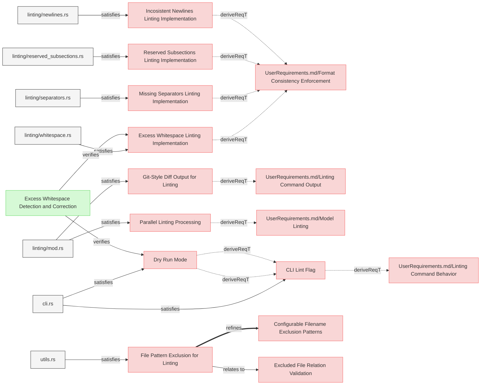
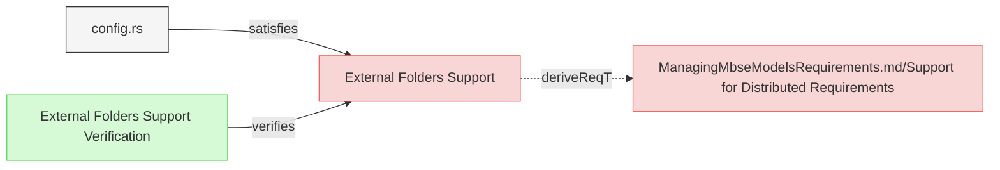
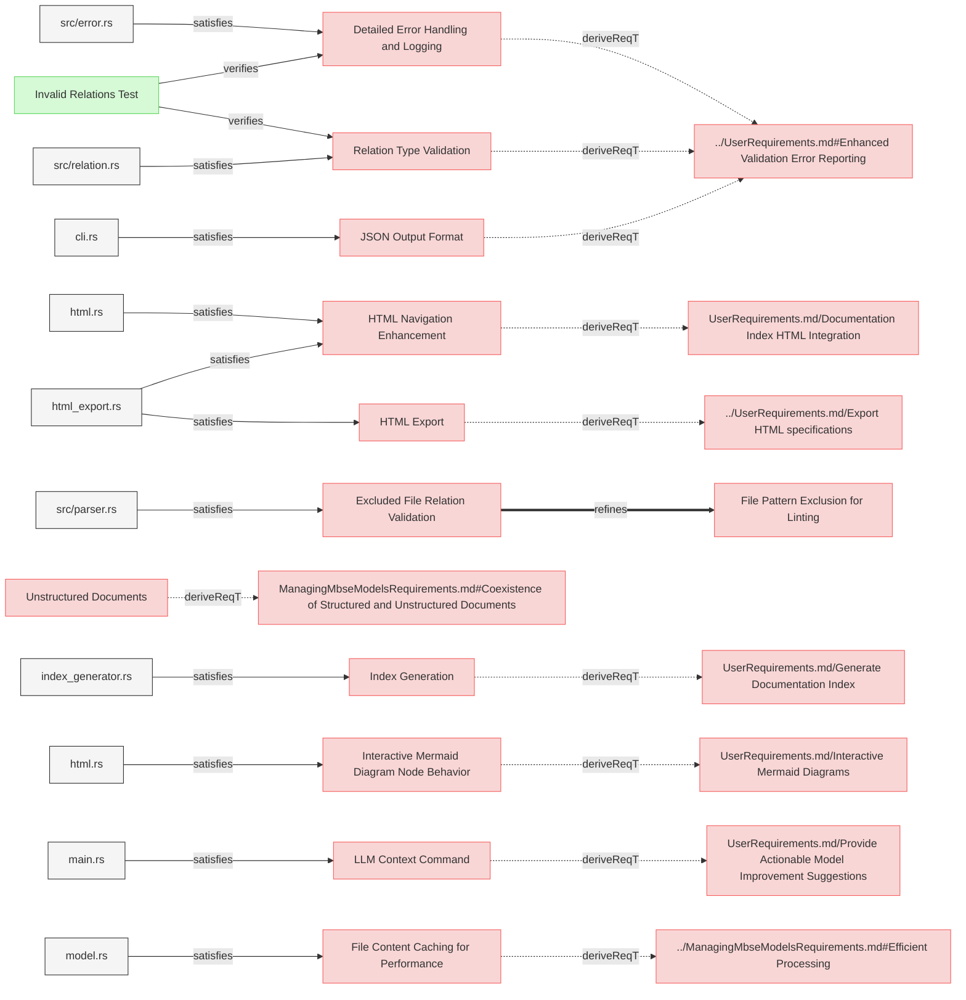
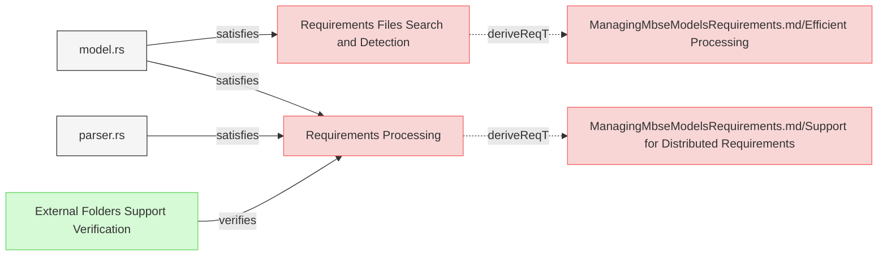
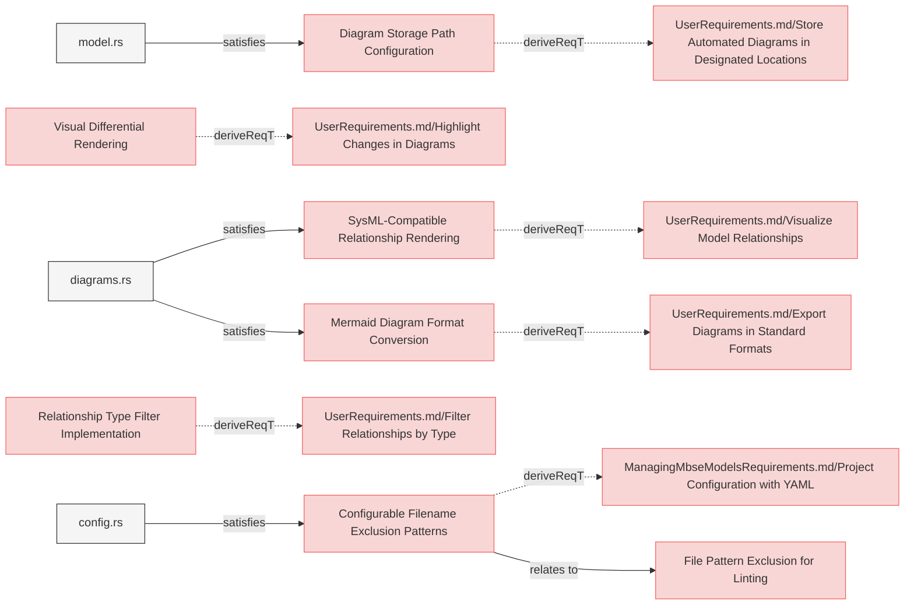
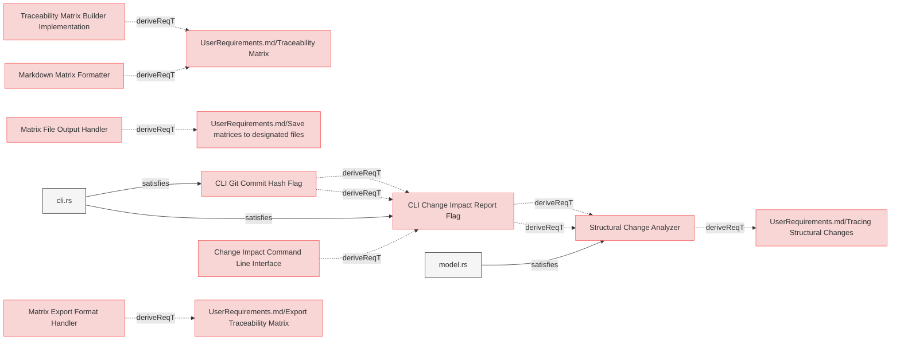
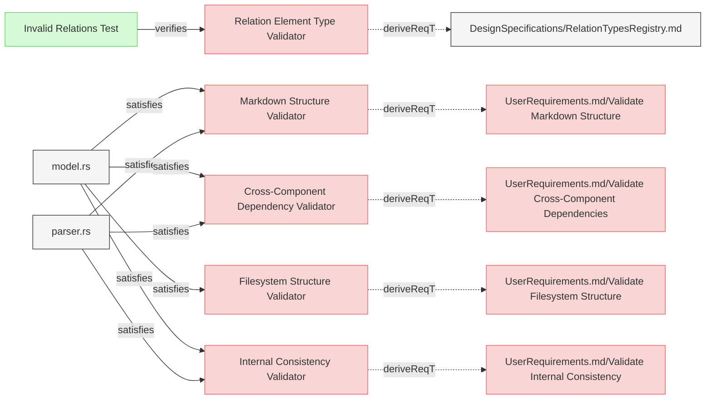
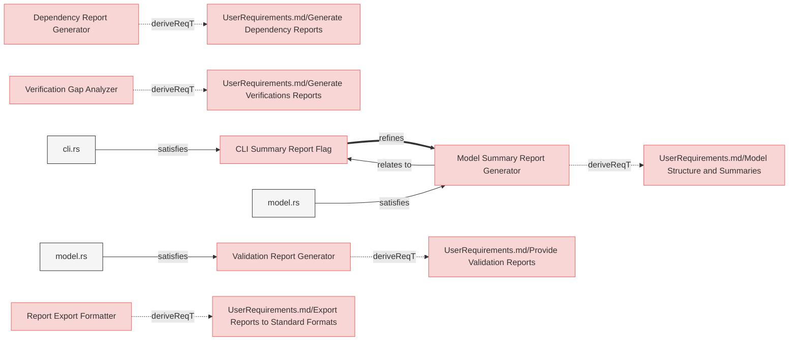

# System Requirements

## Linting    


---

### CLI Lint Flag
The system shall provide a linting function, activated by the (--lint flag), which shall execute the linting process upon user request.

#### Relations
  * derivedFrom: [UserRequirements.md/Linting Command Behavior](../UserRequirements.md#linting-command)
  * satisfiedBy: [cli.rs](../../cli/src/cli.rs)    

---

### Dry Run Mode
The system shall provide a dry run mode (--dry-run flag) for linting that shows the suggested changes without applying them, allowing users to review modifications before committing to them.

#### Details
--dry-run flag works in tandem with the main lint command flag and cannot be used standalone.

#### Relations
  * derivedFrom: [CLI Lint Flag](#cli-lint-flag)
  * satisfiedBy: [cli.rs](../../cli/src/cli.rs)    

---

### Excess Whitespace Linting Implementation
The system shall detect and fix excess whitespace after element headers, subsection headers, and relation identifiers to maintain consistent formatting across all requirements documents.

#### Relations
  * derivedFrom: [UserRequirements.md/Format Consistency Enforcement](../UserRequirements.md#format-consistency-enforcement)
  * satisfiedBy: [linting/whitespace.rs](../../core/src/linting/whitespace.rs)

---

### Incosistent Newlines Linting Implementation

The system shall detect and fix excess or missing newlines before element headers, subsection headers to maintain consistent formatting across all requirements documents.

#### Relations
  * derivedFrom: [UserRequirements.md/Format Consistency Enforcement](../UserRequirements.md#format-consistency-enforcement)
  * satisfiedBy: [linting/newlines.rs](../../core/src/linting/newlines.rs)

---

### Missing Separators Linting Implementation

The system shall detect consecutive element sections that lack a separator line (---) between them and insert the separator to maintain consistent visual separation in the documentation.

#### Relations
  * derivedFrom: [UserRequirements.md/Format Consistency Enforcement](../UserRequirements.md#format-consistency-enforcement)
  * satisfiedBy: [linting/separators.rs](../../core/src/linting/separators.rs)

---

### Reserved Subsections Linting Implementation

The system shall identify and fix inconsistent indentation and bullet types in relation lists and other reserved subsections, standardizing to a consistent format across all requirements documents.

#### Relations
  * derivedFrom: [UserRequirements.md/Format Consistency Enforcement](../UserRequirements.md#format-consistency-enforcement)
  * satisfiedBy: [linting/reserved_subsections.rs](../../core/src/linting/indentation.rs)

---

### Git-Style Diff Output for Linting
The system shall display linting change suggestions in a git-style diff format, color-coded when possible, to clearly show what modifications will be or have been made to the documents.

#### Relations
  * derivedFrom: [UserRequirements.md/Linting Command Output](../UserRequirements.md#linting-command-output)
  * satisfiedBy: [linting/mod.rs](../../core/src/linting/mod.rs)

---

### Parallel Linting Processing
The system shall implement parallel processing for linting operations when possible, leveraging multi-core capabilities to improve performance on large documentation sets.

#### Relations
  * derivedFrom: [UserRequirements.md/Model Linting](../UserRequirements.md#model-linting)
  * satisfiedBy: [linting/mod.rs](../../core/src/linting/mod.rs)

---

### File Pattern Exclusion for Linting
The system shall respect configured excluded filename patterns when performing linting operations, ensuring that files intentionally excluded from processing do not receive inappropriate linting suggestions.

#### Relations
  * refine: [Configurable Filename Exclusion Patterns](#configurable-filename-exclusion-patterns)
  * satisfiedBy: [utils.rs](../../core/src/utils.rs)

---

## Configuration


---

### External Folders Support
The system shall implement configuration parameter to support processing requirements stored in external folders outside the main specifications directory structure, treating them as system requirements in diagram generation and validation.

#### Details

'paths.external_folders' parameter of type  Vec<String> defines additional external folders that contain system requirements and other files.
These can be absolute paths or paths relative to the 'specifications' folder but must not be subfolders of 'specifications' folder.
Empty list is allowed.
All markdown files in these folders are considered **system requirements** (except those matching exclusion patterns).
```reqflow.yaml
paths:
  external_folders:
    - /path/to/folder1
    - ../../folder2 
```

#### Relations
  * derivedFrom: [ManagingMbseModelsRequirements.md/Support for Distributed Requirements](../ManagingMbseModelsRequirements.md#support-for-distributed-requirements)
  * satisfiedBy: [config.rs](../../cli/src/config.rs)

---

## CLI


---

### JSON Output Format

The system shall provide different output results in machine-readable JSON format to facilitate integration with CI/CD pipelines and automated reporting tools.

#### Relations
  * derivedFrom: [UserRequirements.md/Enhanced Validation Error Reporting](../UserRequirements.md#enhanced-validation-error-reporting)
  * satisfiedBy: [cli.rs](../../cli/src/cli.rs)

---

### Index Generation

The system shall implement an IndexGenerator component that traverses the specifications directory structure and creates a hierarchical README.md file with links to documents and elements.

#### Relations
  * derivedFrom: [UserRequirements.md/Generate Documentation Index](../UserRequirements.md#generate-documentation-index)
  * satisfiedBy: [index_generator.rs](../../core/src/index_generator.rs)

---

### HTML Navigation Enhancement 

The system shall enhance the HTML generator to process README.md as a special file, adding navigation elements and ensuring it serves as the primary entry point.

#### Details

README.md file must be saved as index.html file when exported.

#### Relations
  * derivedFrom: [UserRequirements.md/Documentation Index HTML Integration](../UserRequirements.md#documentation-index-html-integration)
  * satisfiedBy: [html.rs](../../core/src/html.rs)
  * satisfiedBy: [html_export.rs](../../core/src/html_export.rs)

---

### LLM Context Command

The system shall provide a command-line option `--llm-context` that outputs comprehensive contextual information about ReqFlow methodology, document structure, relation types, and CLI usage to help Large Language Models understand and work with ReqFlow-based projects.

#### Relations
  * derivedFrom: [UserRequirements.md/Provide Actionable Model Improvement Suggestions](../UserRequirements.md#provide-actionable-model-improvement-suggestions)
  * satisfiedBy: [main.rs](../../cli/src/main.rs)

---

### Interactive Mermaid Diagram Node Behavior

The system shall implement interactive click behavior for Mermaid diagram nodes that redirects to the referenced element when clicked.

#### Relations
  * derivedFrom: [UserRequirements.md/Interactive Mermaid Diagrams](../UserRequirements.md#interactive-mermaid-diagrams)
  * satisfiedBy: [html.rs](../../core/src/diagrams.rs)

---

### Unstructured Documents

The system shall allow unstructured documents to be ignored during processing.
TODO: add requirment that defines a config filter out patterns.

#### Relations
  * derivedFrom: [ManagingMbseModelsRequirements.md#Coexistence of Structured and Unstructured Documents](../ManagingMbseModelsRequirements.md#coexistence-of-structured-and-unstructured-documents)

---

### Relation Type Validation

The system shall validate relation types against a defined vocabulary and provide clear error messages for unsupported relation types, including suggestions for the correct relation types.

#### Relations
  * derivedFrom: [UserRequirements.md/Enhanced Validation Error Reporting](../UserRequirements.md#enhanced-validation-error-reporting)
  * satisfiedBy: [src/relation.rs](../../core/src/relation.rs)

---

### Excluded File Relation Validation

The system shall properly validate relations targeting files matching excluded filename patterns, enabling references to excluded files while still respecting their exclusion from processing and linting operations.

#### Details
The validation process for excluded files:
1. Files matching excluded patterns are registered in the element registry for relation validation only
2. Internal elements within excluded files are not processed or validated

#### Todo
  * derivedFrom: [Configurable Filename Exclusion Patterns](#configurable-filename-exclusion-patterns) 
  * refine: [File Pattern Exclusion for Linting](#file-pattern-exclusion-for-linting)

#### Relations
  * refine: [File Pattern Exclusion for Linting](#file-pattern-exclusion-for-linting)
  * satisfiedBy: [src/parser.rs](../../core/src/parser.rs)

---

### HTML Export

The system shall generate HTML output for all markdown files, not just requirements documents, to provide consistent representation of the entire model.

#### Relations
  * derivedFrom: [../UserRequirements.md/Export HTML specifications](../UserRequirements.md#export-html-specifications)
  * satisfiedBy: [html_export.rs](../../core/src/html_export.rs)

---

### Detailed Error Handling and Logging

The system shall implement detailed error handling and logging throughout the application to facilitate troubleshooting and provide meaningful feedback.

#### Relations
  * derivedFrom: [../UserRequirements.md#Enhanced Validation Error Reporting](../UserRequirements.md#enhanced-validation-error-reporting)
  * satisfiedBy: [src/error.rs](../../core/src/error.rs)

---

### File Content Caching for Performance

The system shall cache file contents during processing to optimize performance for operations that require multiple passes through the same files.

#### Relations
  * derivedFrom: [../ManagingMbseModelsRequirements.md#Efficient Processing](../ManagingMbseModelsRequirements.md#efficient-processing)
  * satisfiedBy: [model.rs](../../core/src/model.rs)

---

## Logic


---

### Requirements Processing

The system shall parse the 'specifications' and 'external folders' directory structure using the configured paths from reqflow.yaml to identify system elements files and their hierarchical relationships.

#### Relations
  * derivedFrom: [ManagingMbseModelsRequirements.md/Support for Distributed Requirements](../ManagingMbseModelsRequirements.md#support-for-distributed-requirements)
  * satisfiedBy: [model.rs](../../core/src/model.rs)
  * satisfiedBy: [parser.rs](../../core/src/parser.rs)  

---

### Requirements Files Search and Detection
The system shall identify and categorize files in the `specifications` and `external_folders` directories as **Stakeholder Needs Requirements**, **System Requirements**, or **Not a Requirements File** based on predefined rules.

#### Details
Identification Process:
The process follows these steps to determine whether a file contains requirements and, if so, whether it falls under **Stakeholder Needs Requirements** or **System Requirements**:
1. **File Selection**: The process scans all files in the `specifications` folder (including subfolders) and `external_folders`.
2. **Excluded Patterns Check**: If a file matches any excluded patterns, it is marked as **not a requirements file**.
3. **File Extension Check**: If the file does not have a `.md` extension, it is marked as **not a requirements file**.
4. **Design Folder Check**: If the file is located in a folder defined by the `design_specifications_folder` configuration, it is marked as **not a requirements file**.
5. **External Folder Check**: If the file is found in an external folder (or any of its subfolders), it is categorized as a **System Requirements file**.
6. **Root Folder Check**: If the file is located at the root of the `specifications` folder, it is categorized as a **Stakeholder Needs Requirements file**. Otherwise, it is categorized as a **System Requirements file**.

#### Relations
  * derivedFrom: [ManagingMbseModelsRequirements.md/Efficient Processing](../ManagingMbseModelsRequirements.md#efficient-processing)
  * satisfiedBy: [model.rs](../../core/src/model.rs)

---

## Categorization Outcomes

- **Stakeholder Needs Requirements File**: Files located in the root of the `specifications` folder and meeting all conditions.
- **System Requirements File**: Files found in external folders or subfolders within `specifications`.
- **Not a Requirements File**: Files that match exclusion patterns, do not have a `.md` extension, or are in the design folder.

---

### Configurable Filename Exclusion Patterns
The system shall support configurable glob patterns to exclude specific files from requirement processing, regardless if they are located in specifications or external folders.

#### Details
```reqflow.yaml
paths:

  # Glob patterns to exclude from requirements processing

  # These are patterns that shouldn't be considered requirements even if they're in specifications or external folders
  excluded_filename_patterns:
    - "**/Logical*.md"
    - "**/Physical*.md"    
```

#### Relations
  * derivedFrom: [ManagingMbseModelsRequirements.md/Project Configuration with YAML](../ManagingMbseModelsRequirements.md#project-configuration-with-yaml)
  * satisfiedBy: [config.rs](../../cli/src/config.rs)

---

### Mermaid Diagram Format Conversion
The system shall implement an export functionality that converts Mermaid diagram syntax to standard image formats (PNG, SVG) using external rendering tools or APIs, with configurable resolution and quality settings.

#### Relations
  * derivedFrom: [UserRequirements.md/Export Diagrams in Standard Formats](../UserRequirements.md#export-diagrams-in-standard-formats)
  * satisfiedBy: [diagrams.rs](../../core/src/diagrams.rs)

---

### Visual Differential Rendering
The system shall implement a visual differential rendering algorithm that compares the current and previous versions of a diagram, visually highlighting elements that have been added, modified, or removed using distinct color coding and graphical indicators.

#### Relations
  * derivedFrom: [UserRequirements.md/Highlight Changes in Diagrams](../UserRequirements.md#highlight-changes-in-diagrams)

---

### SysML-Compatible Relationship Rendering

The system shall implement a relationship rendering engine that adheres to SysML notation standards, defining specific arrow styles, line types, and visual properties for each relationship type to ensure diagram consistency and standards compliance.

#### Details

The visual representation and direction of relationships in diagrams aligns with the SysML specification. 
Each relationship is represented using SysML standard notation with a specified arrow direction.
derive (deriveReqT):
- Definition: Indicates that a requirement is derived from a higher-level requirement.  
- Notation: Dashed arrow with an open arrowhead.  
- Direction:  
  - Derived Requirement → Source Requirement  
contains:
- Definition: Represents an element containing another element.  
- Notation: Solid arrow with no arrowhead.  
- Direction:  
  - Container Element → Contained Element  
refine:
- Definition: Indicates that an element provides further detail or enhancement of another element.  
- Notation: Dashed arrow with an open arrowhead.  
- Direction:  
  - Refining Element → Refined Element  
verify:
- Definition: Represents verification of a requirement by a test case or other verification element.  
- Notation: Dashed arrow with an open arrowhead.  
- Direction:  
  - Verification Element (Test Case, Analysis, Inspection, Demonstration) → Requirement  
trace:
- Definition: Shows a general traceability relationship between elements without implying derivation or refinement.  
- Notation: Dashed arrow with an open arrowhead.  
- Direction:  
  - Dependent Element → Source Element  
satisfy:
- Definition: Indicates that a design or model element satisfies a requirement.  
- Notation: Solid arrow with an open arrowhead.  
- Direction:  
  - Design / Model Element → Requirement  
  
**Summary Table**
| Relationship | Notation | Arrow Direction |
|-------------|---------|----------------|
| deriveReqT | Dashed, open arrowhead | Derived Requirement → Source Requirement |
| contain | Solid, no arrowhead | Container Element → Contained Element |
| refine | Dashed, open arrowhead | Refining Element → Refined Element |
| verify | Dashed, open arrowhead | Verification Element → Requirement |
| trace | Dashed, open arrowhead | Dependent Element → Source Element |
| satisfy | Solid, open arrowhead | Design/Model Element → Requirement |

#### Relations
  * derivedFrom: [UserRequirements.md/Visualize Model Relationships](../UserRequirements.md#visualize-model-relationships)
  * satisfiedBy: [diagrams.rs](../../core/src/diagrams.rs)

---

### Relationship Type Filter Implementation
The system shall implement filtering capabilities in the diagram generation logic that allow selective inclusion or exclusion of relationship types through command-line arguments and configuration settings, supporting regex patterns for complex filtering rules.

#### Relations
  * derivedFrom: [UserRequirements.md/Filter Relationships by Type](../UserRequirements.md#filter-relationships-by-type)

---

### Diagram Storage Path Configuration
The system shall implement a configurable storage mechanism for generated diagrams that uses a combination of YAML configuration settings and command-line overrides to determine storage paths, file naming patterns, and versioning strategies.

#### Relations
  * derivedFrom: [UserRequirements.md/Store Automated Diagrams in Designated Locations](../UserRequirements.md#store-automated-diagrams-in-designated-locations)
  * satisfiedBy: [model.rs](../../core/src/model.rs)

---

## Change Tracing


---

### Structural Change Analyzer

The system shall implement a model change analyzer that identifies structural modifications between model versions, determines affected elements through relationship traversal, and categorizes impacts according to change propagation rules.

#### Relations
  * derivedFrom: [UserRequirements.md/Tracing Structural Changes](../UserRequirements.md#tracing-structural-changes)
  * satisfiedBy: [model.rs](../../core/src/change_impact.rs)  

---

### CLI Change Impact Report Flag

The system shall provide a change and impact report function, activated by the (--change_impact flag), which shall generate change impact report

#### Relations
  * derivedFrom: [Structural Change Analyzer](#structural-change-analyzer)
  * satisfiedBy: [cli.rs](../../cli/src/cli.rs)    

---

### CLI Git Commit Hash Flag

The system shall provide a git commit hash flag  (--git_commit flag), to be used with ** CLI Change Impact Report Flag**.

#### Relations
  * derivedFrom: [CLI Change Impact Report Flag](#cli-change-impact-report-flag)
  * satisfiedBy: [cli.rs](../../cli/src/cli.rs)    

---

### Traceability Matrix Builder Implementation

The system shall implement a traceability matrix builder component that extracts relationship data from the model, processes it according to configured parameters, and generates structured matrix representations showing connections between requirements and other elements.

#### Relations
  * derivedFrom: [UserRequirements.md/Traceability Matrix](../UserRequirements.md#traceability-matrix)

---

### Markdown Matrix Formatter

The system shall implement a markdown formatter for traceability matrices that produces well-structured, readable markdown tables and diagrams conforming to the ReqFlow markdown-first methodology.

#### Relations
  * derivedFrom: [UserRequirements.md/Traceability Matrix](../UserRequirements.md#traceability-matrix)

---

### Matrix File Output Handler

The system shall implement a file output handler for traceability matrices that saves generated content to designated locations with appropriate naming conventions, handles file conflicts, and maintains content consistency.

#### Relations
  * derivedFrom: [UserRequirements.md/Save matrices to designated files](../UserRequirements.md#save-matrices-to-designated-files)

---

### Matrix Export Format Handler

The system shall implement export handlers for traceability matrices that convert the internal matrix representation to various external formats including Excel-compatible CSV/XLSX and PDF, preserving structural relationships and formatting.

#### Relations
  * derivedFrom: [UserRequirements.md/Export Traceability Matrix](../UserRequirements.md#export-traceability-matrix)

---

## Validation Capabilities


---

### Markdown Structure Validator

The system shall implement a markdown structure validator that enforces ReqFlow's requirements for header levels, element structure, relation formatting, and other markdown-specific syntax rules, reporting violations with line numbers and suggested fixes.

#### Relations
  * derivedFrom: [UserRequirements.md/Validate Markdown Structure](../UserRequirements.md#validate-markdown-structure)
  * satisfiedBy: [model.rs](../../core/src/model.rs)    
  * satisfiedBy: [parser.rs](../../core/src/parser.rs)

---

### Filesystem Structure Validator
The system shall implement a validator that checks the organization of files and directories against the expected ReqFlow project structure, verifying required folders exist and files are appropriately placed according to configuration settings.

#### Relations
  * derivedFrom: [UserRequirements.md/Validate Filesystem Structure](../UserRequirements.md#validate-filesystem-structure)
  * satisfiedBy: [model.rs](../../core/src/model.rs)

---

### Internal Consistency Validator
The system shall implement a consistency validator that verifies logical coherence within the model, including checking for circular dependencies, orphaned elements, and inconsistent relationship patterns, with detailed error reporting.

#### Relations
  * derivedFrom: [UserRequirements.md/Validate Internal Consistency](../UserRequirements.md#validate-internal-consistency)
  * satisfiedBy: [model.rs](../../core/src/model.rs)    
  * satisfiedBy: [parser.rs](../../core/src/parser.rs)

---

### Cross-Component Dependency Validator
The system shall implement a specialized validator that analyzes dependencies across different model components, ensuring proper alignment between architectural layers, requirement levels, and verification elements.

#### Relations
  * derivedFrom: [UserRequirements.md/Validate Cross-Component Dependencies](../UserRequirements.md#validate-cross-component-dependencies)
  * satisfiedBy: [model.rs](../../core/src/model.rs)    
  * satisfiedBy: [parser.rs](../../core/src/parser.rs)

---

### Relation Element Type Validator
The system shall implement validation that verifies relation endpoints have appropriate element types based on the relation type.

#### Details
- For `verifiedBy`/`verify` relations, validate that one endpoint is a requirement element and the other is a verification element
- For `satisfiedBy`/`satisfy` relations, validate that one endpoint is a requirement element and the other is an implementation element
- Relations should only connect elements of appropriate types based on the RelationTypesRegistry definition
- Warnings should be issued when relation endpoints have incompatible element types

#### Relations
  * derivedFrom: [DesignSpecifications/RelationTypesRegistry.md](../../specifications/DesignSpecifications/RelationTypesRegistry.md)

---

## Reporting Features


---

### Model Summary Report Generator

The system shall implement a summary report generator that  produces comprehensive summaries of model relationships, including key metrics, element counts by type and counts.

#### Relations
  * derivedFrom: [UserRequirements.md/Model Structure and Summaries](../UserRequirements.md#model-structure-and-summaries)
  * satisfiedBy: [model.rs](../../core/src/reports.rs)

---

### CLI Summary Report Flag

The system shall provide a model summary report function, activated by the (--model-summary flag), which shall generate model summary report

#### Relations
  * refine: [Model Summary Report Generator](#model-summary-report-generator)
  * satisfiedBy: [cli.rs](../../cli/src/cli.rs)    

---

### Validation Report Generator

The system shall implement a validation report generator that compiles and formats validation results from all validators, providing a unified view of model quality with categorized issues, remediation suggestions, and compliance metrics.

#### Relations
  * derivedFrom: [UserRequirements.md/Provide Validation Reports](../UserRequirements.md#provide-validation-reports)
  * satisfiedBy: [model.rs](../../core/src/model.rs)

---

### Verification Gap Analyzer
The system shall implement a verification gap analyzer that identifies requirements lacking verification relationships, assesses verification coverage across the model, and produces reports highlighting verification deficiencies.

#### Relations
  * derivedFrom: [UserRequirements.md/Generate Verifications Reports](../UserRequirements.md#generate-verifications-reports)

---

### Dependency Report Generator
The system shall implement a dependency report generator that analyzes and visualizes complex dependency chains within the model, highlighting critical paths, dependency clusters, and potential bottlenecks with impact assessments.

#### Relations
  * derivedFrom: [UserRequirements.md/Generate Dependency Reports](../UserRequirements.md#generate-dependency-reports)

---

### Report Export Formatter
The system shall implement format conversion engines for reports that transform internal report representations to standardized external formats including PDF, Excel, and HTML, preserving structural information and visual elements.

#### Relations
  * derivedFrom: [UserRequirements.md/Export Reports to Standard Formats](../UserRequirements.md#export-reports-to-standard-formats)

---