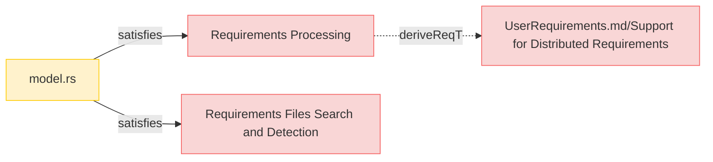
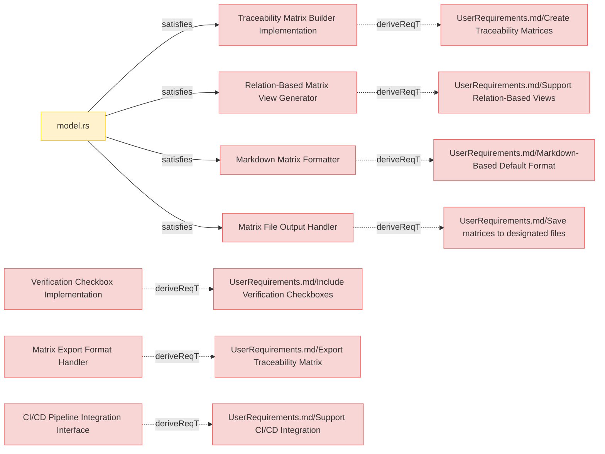
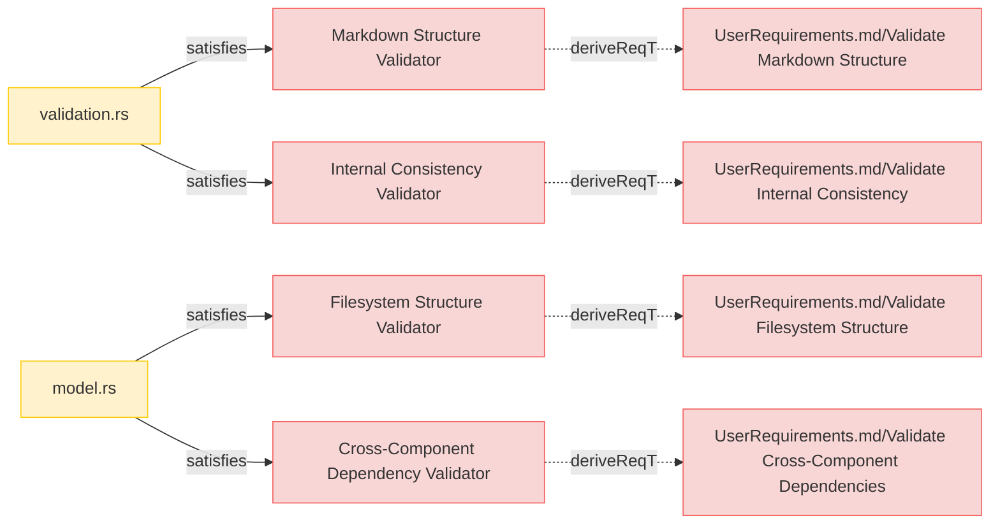
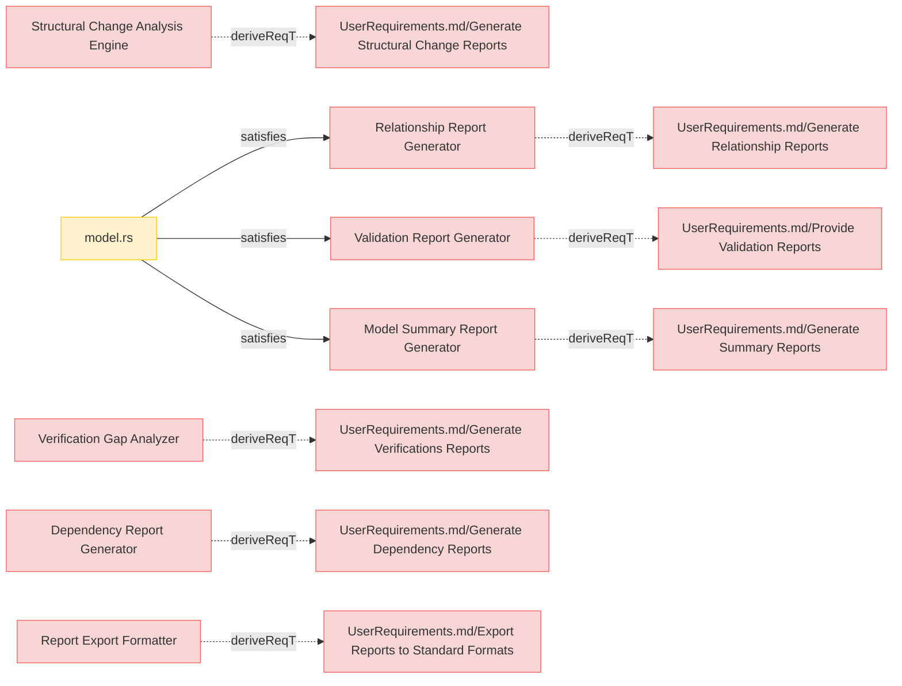
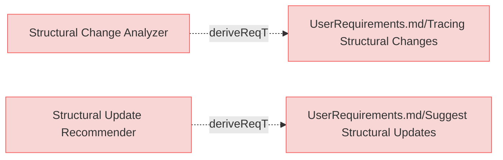

# System Requirements

## Linting    

```mermaid
graph LR;
  %% Graph styling
  classDef requirement fill:#f9d6d6,stroke:#f55f5f,stroke-width:1px;
  classDef satisfies fill:#fff2cc,stroke:#ffcc00,stroke-width:1px;
  classDef verification fill:#d6f9d6,stroke:#5fd75f,stroke-width:1px;
  classDef externalLink fill:#d0e0ff,stroke:#3080ff,stroke-width:1px;
  classDef paragraph fill:#efefef,stroke:#999999,stroke-width:1px;
  classDef default fill:#f5f5f5,stroke:#333333,stroke-width:1px;

    Excess_Whitespace_Linting_Implementation["Excess Whitespace Linting Implementation"];
    click Excess_Whitespace_Linting_Implementation "SystemRequirements/Requirements.md#excess-whitespace-linting-implementation";
    class Excess_Whitespace_Linting_Implementation requirement;
    Excess_Whitespace_Linting_Implementation -.->|deriveReqT| _UserRequirements_md_Format_Consistency_Enforcement_____UserRequirements_md_format_consistency_enforcement_;
    _UserRequirements_md_Format_Consistency_Enforcement_____UserRequirements_md_format_consistency_enforcement_["UserRequirements.md/Format Consistency Enforcement"];
    click _UserRequirements_md_Format_Consistency_Enforcement_____UserRequirements_md_format_consistency_enforcement_ "../UserRequirements.md#format-consistency-enforcement";
    class _UserRequirements_md_Format_Consistency_Enforcement_____UserRequirements_md_format_consistency_enforcement_ requirement;
    _linting_whitespace_rs__https___github_com_reqflow_reqflow_src_linting_whitespace_rs_ -->|satisfies| Excess_Whitespace_Linting_Implementation;
    _linting_whitespace_rs__https___github_com_reqflow_reqflow_src_linting_whitespace_rs_["linting/whitespace.rs"];
    click _linting_whitespace_rs__https___github_com_reqflow_reqflow_src_linting_whitespace_rs_ "https://github.com/reqflow/reqflow/src/linting#whitespace.rs";
    class _linting_whitespace_rs__https___github_com_reqflow_reqflow_src_linting_whitespace_rs_ satisfies;
    Inconsistent_Newlines_Linting_Implementation["Inconsistent Newlines Linting Implementation"];
    click Inconsistent_Newlines_Linting_Implementation "SystemRequirements/Requirements.md#inconsistent-newlines-linting-implementation";
    class Inconsistent_Newlines_Linting_Implementation requirement;
    Inconsistent_Newlines_Linting_Implementation -.->|deriveReqT| _UserRequirements_md_Format_Consistency_Enforcement_____UserRequirements_md_format_consistency_enforcement_;
    _linting_newlines_rs__https___github_com_reqflow_reqflow_src_linting_newlines_rs_ -->|satisfies| Inconsistent_Newlines_Linting_Implementation;
    _linting_newlines_rs__https___github_com_reqflow_reqflow_src_linting_newlines_rs_["linting/newlines.rs"];
    click _linting_newlines_rs__https___github_com_reqflow_reqflow_src_linting_newlines_rs_ "https://github.com/reqflow/reqflow/src/linting#newlines.rs";
    class _linting_newlines_rs__https___github_com_reqflow_reqflow_src_linting_newlines_rs_ satisfies;
    Missing_Separators_Linting_Implementation["Missing Separators Linting Implementation"];
    click Missing_Separators_Linting_Implementation "SystemRequirements/Requirements.md#missing-separators-linting-implementation";
    class Missing_Separators_Linting_Implementation requirement;
    Missing_Separators_Linting_Implementation -.->|deriveReqT| _UserRequirements_md_Format_Consistency_Enforcement_____UserRequirements_md_format_consistency_enforcement_;
    _linting_separators_rs__https___github_com_reqflow_reqflow_src_linting_separators_rs_ -->|satisfies| Missing_Separators_Linting_Implementation;
    _linting_separators_rs__https___github_com_reqflow_reqflow_src_linting_separators_rs_["linting/separators.rs"];
    click _linting_separators_rs__https___github_com_reqflow_reqflow_src_linting_separators_rs_ "https://github.com/reqflow/reqflow/src/linting#separators.rs";
    class _linting_separators_rs__https___github_com_reqflow_reqflow_src_linting_separators_rs_ satisfies;
    Indentation_Consistency_Linting_Implementation["Indentation Consistency Linting Implementation"];
    click Indentation_Consistency_Linting_Implementation "SystemRequirements/Requirements.md#indentation-consistency-linting-implementation";
    class Indentation_Consistency_Linting_Implementation requirement;
    Indentation_Consistency_Linting_Implementation -.->|deriveReqT| _UserRequirements_md_Format_Consistency_Enforcement_____UserRequirements_md_format_consistency_enforcement_;
    _linting_indentation_rs__https___github_com_reqflow_reqflow_src_linting_indentation_rs_ -->|satisfies| Indentation_Consistency_Linting_Implementation;
    _linting_indentation_rs__https___github_com_reqflow_reqflow_src_linting_indentation_rs_["linting/indentation.rs"];
    click _linting_indentation_rs__https___github_com_reqflow_reqflow_src_linting_indentation_rs_ "https://github.com/reqflow/reqflow/src/linting#indentation.rs";
    class _linting_indentation_rs__https___github_com_reqflow_reqflow_src_linting_indentation_rs_ satisfies;
    Dry_Run_Mode_Implementation["Dry Run Mode Implementation"];
    click Dry_Run_Mode_Implementation "SystemRequirements/Requirements.md#dry-run-mode-implementation";
    class Dry_Run_Mode_Implementation requirement;
    Dry_Run_Mode_Implementation -.->|deriveReqT| _UserRequirements_md_Linting_Command_Behavior_____UserRequirements_md_linting_command_behavior_;
    _UserRequirements_md_Linting_Command_Behavior_____UserRequirements_md_linting_command_behavior_["UserRequirements.md/Linting Command Behavior"];
    click _UserRequirements_md_Linting_Command_Behavior_____UserRequirements_md_linting_command_behavior_ "../UserRequirements.md#linting-command-behavior";
    class _UserRequirements_md_Linting_Command_Behavior_____UserRequirements_md_linting_command_behavior_ requirement;
    _linting_mod_rs__https___github_com_reqflow_reqflow_src_linting_mod_rs_ -->|satisfies| Dry_Run_Mode_Implementation;
    _linting_mod_rs__https___github_com_reqflow_reqflow_src_linting_mod_rs_["linting/mod.rs"];
    click _linting_mod_rs__https___github_com_reqflow_reqflow_src_linting_mod_rs_ "https://github.com/reqflow/reqflow/src/linting#mod.rs";
    class _linting_mod_rs__https___github_com_reqflow_reqflow_src_linting_mod_rs_ satisfies;
    Git_Style_Diff_Output_for_Linting["Git-Style Diff Output for Linting"];
    click Git_Style_Diff_Output_for_Linting "SystemRequirements/Requirements.md#git-style-diff-output-for-linting";
    class Git_Style_Diff_Output_for_Linting requirement;
    Git_Style_Diff_Output_for_Linting -.->|deriveReqT| _UserRequirements_md_Linting_Command_Output_____UserRequirements_md_linting_command_output_;
    _UserRequirements_md_Linting_Command_Output_____UserRequirements_md_linting_command_output_["UserRequirements.md/Linting Command Output"];
    click _UserRequirements_md_Linting_Command_Output_____UserRequirements_md_linting_command_output_ "../UserRequirements.md#linting-command-output";
    class _UserRequirements_md_Linting_Command_Output_____UserRequirements_md_linting_command_output_ requirement;
    _linting_mod_rs__https___github_com_reqflow_reqflow_src_linting_mod_rs_ -->|satisfies| Git_Style_Diff_Output_for_Linting;
    Automated_Multiple_Linting_Passes["Automated Multiple Linting Passes"];
    click Automated_Multiple_Linting_Passes "SystemRequirements/Requirements.md#automated-multiple-linting-passes";
    class Automated_Multiple_Linting_Passes requirement;
    Automated_Multiple_Linting_Passes ==>|refines| _Multi_Pass_Linting_Capability___multi_pass_linting_capability_;
    _Multi_Pass_Linting_Capability___multi_pass_linting_capability_["Multi-Pass Linting Capability"];
    click _Multi_Pass_Linting_Capability___multi_pass_linting_capability_ "#multi-pass-linting-capability";
    class _Multi_Pass_Linting_Capability___multi_pass_linting_capability_ requirement;
    _linting_mod_rs__https___github_com_reqflow_reqflow_src_linting_mod_rs_ -->|satisfies| Automated_Multiple_Linting_Passes;
    Parallel_Linting_Processing["Parallel Linting Processing"];
    click Parallel_Linting_Processing "SystemRequirements/Requirements.md#parallel-linting-processing";
    class Parallel_Linting_Processing requirement;
    Parallel_Linting_Processing -.->|deriveReqT| _UserRequirements_md_Model_Linting_____UserRequirements_md_model_linting_;
    _UserRequirements_md_Model_Linting_____UserRequirements_md_model_linting_["UserRequirements.md/Model Linting"];
    click _UserRequirements_md_Model_Linting_____UserRequirements_md_model_linting_ "../UserRequirements.md#model-linting";
    class _UserRequirements_md_Model_Linting_____UserRequirements_md_model_linting_ requirement;
    _linting_mod_rs__https___github_com_reqflow_reqflow_src_linting_mod_rs_ -->|satisfies| Parallel_Linting_Processing;
    File_Pattern_Exclusion_for_Linting["File Pattern Exclusion for Linting"];
    click File_Pattern_Exclusion_for_Linting "SystemRequirements/Requirements.md#file-pattern-exclusion-for-linting";
    class File_Pattern_Exclusion_for_Linting requirement;
    File_Pattern_Exclusion_for_Linting ==>|refines| _Configurable_Filename_Exclusion_Patterns___configurable_filename_exclusion_patterns_;
    _Configurable_Filename_Exclusion_Patterns___configurable_filename_exclusion_patterns_["Configurable Filename Exclusion Patterns"];
    click _Configurable_Filename_Exclusion_Patterns___configurable_filename_exclusion_patterns_ "#configurable-filename-exclusion-patterns";
    class _Configurable_Filename_Exclusion_Patterns___configurable_filename_exclusion_patterns_ requirement;
    _utils_rs__https___github_com_reqflow_reqflow_src_utils_rs_ -->|satisfies| File_Pattern_Exclusion_for_Linting;
    _utils_rs__https___github_com_reqflow_reqflow_src_utils_rs_["utils.rs"];
    click _utils_rs__https___github_com_reqflow_reqflow_src_utils_rs_ "https://github.com/reqflow/reqflow/src#utils.rs";
    class _utils_rs__https___github_com_reqflow_reqflow_src_utils_rs_ satisfies;
    Index_Generation_During_Linting["Index Generation During Linting"];
    click Index_Generation_During_Linting "SystemRequirements/Requirements.md#index-generation-during-linting";
    class Index_Generation_During_Linting requirement;
    Index_Generation_During_Linting -.->|deriveReqT| _UserRequirements_md_Generate_Documentation_Index_____UserRequirements_md_generate_documentation_index_;
    _UserRequirements_md_Generate_Documentation_Index_____UserRequirements_md_generate_documentation_index_["UserRequirements.md/Generate Documentation Index"];
    click _UserRequirements_md_Generate_Documentation_Index_____UserRequirements_md_generate_documentation_index_ "../UserRequirements.md#generate-documentation-index";
    class _UserRequirements_md_Generate_Documentation_Index_____UserRequirements_md_generate_documentation_index_ requirement;
    _linting_index_generator_rs__https___github_com_reqflow_reqflow_src_linting_index_generator_rs_ -->|satisfies| Index_Generation_During_Linting;
    _linting_index_generator_rs__https___github_com_reqflow_reqflow_src_linting_index_generator_rs_["linting/index_generator.rs"];
    click _linting_index_generator_rs__https___github_com_reqflow_reqflow_src_linting_index_generator_rs_ "https://github.com/reqflow/reqflow/src/linting#index_generator.rs";
    class _linting_index_generator_rs__https___github_com_reqflow_reqflow_src_linting_index_generator_rs_ satisfies;
    Directory_Structure_Processing["Directory Structure Processing"];
    click Directory_Structure_Processing "SystemRequirements/Requirements.md#directory-structure-processing";
    class Directory_Structure_Processing requirement;
    Directory_Structure_Processing ==>|refines| _Index_Generator_Implementation___index_generator_implementation_;
    _Index_Generator_Implementation___index_generator_implementation_["Index Generator Implementation"];
    click _Index_Generator_Implementation___index_generator_implementation_ "#index-generator-implementation";
    class _Index_Generator_Implementation___index_generator_implementation_ requirement;
    _linting_index_generator_rs__https___github_com_reqflow_reqflow_src_linting_index_generator_rs_ -->|satisfies| Directory_Structure_Processing;
```




### CLI Lint Flag

The system shall provide a linting function, activated by the (--lint flag), which shall execute the linting process upon user request.

#### Relations
  * derivedFrom: [UserRequirements.md/Linting Command Behavior](../UserRequirements.md#linting-command)
  * satisfiedBy: [linting/mod.rs](https://github.com/reqflow/reqflow/src/linting/mod.rs)
  * satisfiedBy: [cli.rs](https://github.com/reqflow/reqflow/src/cli.rs)  

---
  
### Dry Run Mode

The system shall provide a dry run mode (--dry-run flag) for linting that shows the suggested changes without applying them, allowing users to review modifications before committing to them.

#### Details

--dry-run flag works in tandem with the main lint command flag and cannot be used standalone.

#### Relations
  * derivedFrom: [CLI Lint Flag](cli-lint-flag)
  * satisfiedBy: [linting/mod.rs](https://github.com/reqflow/reqflow/src/linting/mod.rs)
  * satisfiedBy: [cli.rs](https://github.com/reqflow/reqflow/src/cli.rs)    

---
  
### Excess Whitespace Linting Implementation

The system shall detect and fix excess whitespace after element headers, subsection headers, and relation identifiers to maintain consistent formatting across all requirements documents.

#### Relations
  * derivedFrom: [UserRequirements.md/Format Consistency Enforcement](../UserRequirements.md#format-consistency-enforcement)
  * satisfiedBy: [linting/whitespace.rs](https://github.com/reqflow/reqflow/src/linting/whitespace.rs)

---

### Inconsistent Newlines Linting Implementation

The system shall identify instances where subsection headers lack proper spacing (a blank line before them) and add the necessary spacing to ensure consistent document structure.

#### Relations
  * derivedFrom: [UserRequirements.md/Format Consistency Enforcement](../UserRequirements.md#format-consistency-enforcement)
  * satisfiedBy: [linting/newlines.rs](https://github.com/reqflow/reqflow/src/linting/newlines.rs)

---

### Missing Separators Linting Implementation

The system shall detect consecutive element sections that lack a separator line (---) between them and insert the separator to maintain consistent visual separation in the documentation.

#### Relations
  * derivedFrom: [UserRequirements.md/Format Consistency Enforcement](../UserRequirements.md#format-consistency-enforcement)
  * satisfiedBy: [linting/separators.rs](https://github.com/reqflow/reqflow/src/linting/separators.rs)

---

### Indentation Consistency Linting Implementation

The system shall identify and fix inconsistent indentation and bullet types in relation lists, standardizing to a consistent format across all requirements documents.

#### Relations
  * derivedFrom: [UserRequirements.md/Format Consistency Enforcement](../UserRequirements.md#format-consistency-enforcement)
  * satisfiedBy: [linting/indentation.rs](https://github.com/reqflow/reqflow/src/linting/indentation.rs)

---

### Git-Style Diff Output for Linting

The system shall display linting change suggestions in a git-style diff format, color-coded when possible, to clearly show what modifications will be or have been made to the documents.

#### Relations
  * derivedFrom: [UserRequirements.md/Linting Command Output](../UserRequirements.md#linting-command-output)
  * satisfiedBy: [linting/mod.rs](https://github.com/reqflow/reqflow/src/linting/mod.rs)

---

### Automated Multiple Linting Passes 

The system shall support automatic multiple linting passes with a configurable iteration limit to ensure all interdependent formatting issues are resolved without requiring multiple manual invocations.

#### Relations
  * refine: [Multi-Pass Linting Capability](#multi-pass-linting-capability)
  * satisfiedBy: [linting/mod.rs](https://github.com/reqflow/reqflow/src/linting/mod.rs)

---

### Parallel Linting Processing

The system shall implement parallel processing for linting operations when possible, leveraging multi-core capabilities to improve performance on large documentation sets.

#### Relations
  * derivedFrom: [UserRequirements.md/Model Linting](../UserRequirements.md#model-linting)
  * satisfiedBy: [linting/mod.rs](https://github.com/reqflow/reqflow/src/linting/mod.rs)

---

### File Pattern Exclusion for Linting

The system shall respect configured excluded filename patterns when performing linting operations, ensuring that files intentionally excluded from processing do not receive inappropriate linting suggestions.

#### Relations
  * refine: [Configurable Filename Exclusion Patterns](#configurable-filename-exclusion-patterns)
  * satisfiedBy: [utils.rs](https://github.com/reqflow/reqflow/src/utils.rs)

---

### Index Generation During Linting

The system shall generate or update an index.md file in the specifications root directory when linting is performed, creating a structured table of contents that links to all documentation files.

#### Relations
  * derivedFrom: [UserRequirements.md/Generate Documentation Index](../UserRequirements.md#generate-documentation-index)
  * satisfiedBy: [linting/index_generator.rs](https://github.com/reqflow/reqflow/src/linting/index_generator.rs)

---

### Directory Structure Processing

The system shall parse the 'specifications' and 'external folders' directory structure using the configured paths from reqflow.yaml to identify documentation files and their hierarchical relationships.

#### Details

TODO: this needs to be more clear on what folders to walk

#### Relations
  * refine: [Index Generator Implementation](#index-generator-implementation)
  * satisfiedBy: [linting/index_generator.rs](https://github.com/reqflow/reqflow/src/linting/index_generator.rs)

---

## Configuration

```mermaid
graph LR;
  %% Graph styling
  classDef requirement fill:#f9d6d6,stroke:#f55f5f,stroke-width:1px;
  classDef satisfies fill:#fff2cc,stroke:#ffcc00,stroke-width:1px;
  classDef verification fill:#d6f9d6,stroke:#5fd75f,stroke-width:1px;
  classDef externalLink fill:#d0e0ff,stroke:#3080ff,stroke-width:1px;
  classDef paragraph fill:#efefef,stroke:#999999,stroke-width:1px;
  classDef default fill:#f5f5f5,stroke:#333333,stroke-width:1px;

    External_Folders_Support["External Folders Support"];
    click External_Folders_Support "SystemRequirements/Requirements.md#external-folders-support";
    class External_Folders_Support requirement;
    External_Folders_Support -.->|deriveReqT| _UserRequirements_md_Support_for_Distributed_Requirements_____UserRequirements_md_support_for_distributed_requirements_;
    _UserRequirements_md_Support_for_Distributed_Requirements_____UserRequirements_md_support_for_distributed_requirements_["UserRequirements.md/Support for Distributed Requirements"];
    click _UserRequirements_md_Support_for_Distributed_Requirements_____UserRequirements_md_support_for_distributed_requirements_ "../UserRequirements.md#support-for-distributed-requirements";
    class _UserRequirements_md_Support_for_Distributed_Requirements_____UserRequirements_md_support_for_distributed_requirements_ requirement;
    _config_rs__https___github_com_reqflow_reqflow_src_config_rs_ -->|satisfies| External_Folders_Support;
    _config_rs__https___github_com_reqflow_reqflow_src_config_rs_["config.rs"];
    click _config_rs__https___github_com_reqflow_reqflow_src_config_rs_ "https://github.com/reqflow/reqflow/src#config.rs";
    class _config_rs__https___github_com_reqflow_reqflow_src_config_rs_ satisfies;
```




---

### External Folders Support

The system shall implement configuration parameter to support processing requirements stored in external folders outside the main specifications directory structure, treating them as system requirements in diagram generation and validation.

#### Details

'paths.external_folders' parameter of type  Vec<String> defines additional external folders that contain system requirements and other files.
These can be absolute paths or paths relative to the 'specifications' folder but must not be subfolders of 'specifications' folder.

Empty list is allowed.

All markdown files in these folders are considered **system requirements** (except those matching exclusion patterns).

```reqflow.yaml
paths:
  external_folders:
    - /path/to/folder1
    - ../../folder2 
```

#### Relations
  * derivedFrom: [UserRequirements.md/Support for Distributed Requirements](../UserRequirements.md#support-for-distributed-requirements)
  * satisfiedBy: [config.rs](https://github.com/reqflow/reqflow/src/config.rs)

---

## CLI

```mermaid
graph LR;
  %% Graph styling
  classDef requirement fill:#f9d6d6,stroke:#f55f5f,stroke-width:1px;
  classDef satisfies fill:#fff2cc,stroke:#ffcc00,stroke-width:1px;
  classDef verification fill:#d6f9d6,stroke:#5fd75f,stroke-width:1px;
  classDef externalLink fill:#d0e0ff,stroke:#3080ff,stroke-width:1px;
  classDef paragraph fill:#efefef,stroke:#999999,stroke-width:1px;
  classDef default fill:#f5f5f5,stroke:#333333,stroke-width:1px;

    Initialization_Command["Initialization Command"];
    click Initialization_Command "SystemRequirements/Requirements.md#initialization-command";
    class Initialization_Command requirement;
    Initialization_Command -.->|deriveReqT| _UserRequirements_md_Bootstrap_model_struture__UserRequirements_md_bootstrap_model_struture_;
    _UserRequirements_md_Bootstrap_model_struture__UserRequirements_md_bootstrap_model_struture_["UserRequirements.md/Bootstrap model struture"];
    click _UserRequirements_md_Bootstrap_model_struture__UserRequirements_md_bootstrap_model_struture_ "UserRequirements.md#bootstrap-model-struture";
    class _UserRequirements_md_Bootstrap_model_struture__UserRequirements_md_bootstrap_model_struture_ requirement;
    _init_rs__https___github_com_reqflow_reqflow_src_init_rs_ -->|satisfies| Initialization_Command;
    _init_rs__https___github_com_reqflow_reqflow_src_init_rs_["init.rs"];
    click _init_rs__https___github_com_reqflow_reqflow_src_init_rs_ "https://github.com/reqflow/reqflow/src#init.rs";
    class _init_rs__https___github_com_reqflow_reqflow_src_init_rs_ satisfies;
    Initialization_Command_Configuration_Check["Initialization Command Configuration Check"];
    click Initialization_Command_Configuration_Check "SystemRequirements/Requirements.md#initialization-command-configuration-check";
    class Initialization_Command_Configuration_Check requirement;
    Initialization_Command_Configuration_Check ==>|refines| _Initialization_Command___initialization_command_;
    _Initialization_Command___initialization_command_["Initialization Command"];
    click _Initialization_Command___initialization_command_ "#initialization-command";
    class _Initialization_Command___initialization_command_ requirement;
    _init_rs__https___github_com_reqflow_reqflow_src_init_rs_ -->|satisfies| Initialization_Command_Configuration_Check;
    Index_Generator_Implementation["Index Generator Implementation"];
    click Index_Generator_Implementation "SystemRequirements/Requirements.md#index-generator-implementation";
    class Index_Generator_Implementation requirement;
    Index_Generator_Implementation -.->|deriveReqT| _UserRequirements_md_Generate_Documentation_Index__UserRequirements_md_generate_documentation_index_;
    _UserRequirements_md_Generate_Documentation_Index__UserRequirements_md_generate_documentation_index_["UserRequirements.md/Generate Documentation Index"];
    click _UserRequirements_md_Generate_Documentation_Index__UserRequirements_md_generate_documentation_index_ "UserRequirements.md#generate-documentation-index";
    class _UserRequirements_md_Generate_Documentation_Index__UserRequirements_md_generate_documentation_index_ requirement;
    _linting_index_generator_rs__https___github_com_reqflow_reqflow_src_linting_index_generator_rs_ -->|satisfies| Index_Generator_Implementation;
    _linting_index_generator_rs__https___github_com_reqflow_reqflow_src_linting_index_generator_rs_["linting/index_generator.rs"];
    click _linting_index_generator_rs__https___github_com_reqflow_reqflow_src_linting_index_generator_rs_ "https://github.com/reqflow/reqflow/src/linting#index_generator.rs";
    class _linting_index_generator_rs__https___github_com_reqflow_reqflow_src_linting_index_generator_rs_ satisfies;
    Markdown_Content_Summary_Extraction["Markdown Content Summary Extraction"];
    click Markdown_Content_Summary_Extraction "SystemRequirements/Requirements.md#markdown-content-summary-extraction";
    class Markdown_Content_Summary_Extraction requirement;
    _Index_Generator_Implementation___index_generator_implementation_ --o|contains| Markdown_Content_Summary_Extraction;
    _Index_Generator_Implementation___index_generator_implementation_["Index Generator Implementation"];
    click _Index_Generator_Implementation___index_generator_implementation_ "#index-generator-implementation";
    class _Index_Generator_Implementation___index_generator_implementation_ requirement;
    _linting_index_generator_rs__https___github_com_reqflow_reqflow_src_linting_index_generator_rs_ -->|satisfies| Markdown_Content_Summary_Extraction;
    Proper_Link_URL_Generation["Proper Link URL Generation"];
    click Proper_Link_URL_Generation "SystemRequirements/Requirements.md#proper-link-url-generation";
    class Proper_Link_URL_Generation requirement;
    _Index_Generator_Implementation___index_generator_implementation_ --o|contains| Proper_Link_URL_Generation;
    _linting_index_generator_rs__https___github_com_reqflow_reqflow_src_linting_index_generator_rs_ -->|satisfies| Proper_Link_URL_Generation;
    HTML_Navigation_Enhancement["HTML Navigation Enhancement"];
    click HTML_Navigation_Enhancement "SystemRequirements/Requirements.md#html-navigation-enhancement";
    class HTML_Navigation_Enhancement requirement;
    HTML_Navigation_Enhancement -.->|deriveReqT| _UserRequirements_md_Documentation_Index_HTML_Integration__UserRequirements_md_documentation_index_html_integration_;
    _UserRequirements_md_Documentation_Index_HTML_Integration__UserRequirements_md_documentation_index_html_integration_["UserRequirements.md/Documentation Index HTML Integration"];
    click _UserRequirements_md_Documentation_Index_HTML_Integration__UserRequirements_md_documentation_index_html_integration_ "UserRequirements.md#documentation-index-html-integration";
    class _UserRequirements_md_Documentation_Index_HTML_Integration__UserRequirements_md_documentation_index_html_integration_ requirement;
    _html_rs__https___github_com_reqflow_reqflow_src_html_rs_ -->|satisfies| HTML_Navigation_Enhancement;
    _html_rs__https___github_com_reqflow_reqflow_src_html_rs_["html.rs"];
    click _html_rs__https___github_com_reqflow_reqflow_src_html_rs_ "https://github.com/reqflow/reqflow/src#html.rs";
    class _html_rs__https___github_com_reqflow_reqflow_src_html_rs_ satisfies;
    _html_export_rs__https___github_com_reqflow_reqflow_src_html_export_rs_ -->|satisfies| HTML_Navigation_Enhancement;
    _html_export_rs__https___github_com_reqflow_reqflow_src_html_export_rs_["html_export.rs"];
    click _html_export_rs__https___github_com_reqflow_reqflow_src_html_export_rs_ "https://github.com/reqflow/reqflow/src#html_export.rs";
    class _html_export_rs__https___github_com_reqflow_reqflow_src_html_export_rs_ satisfies;
    LLM_Context_Command["LLM Context Command"];
    click LLM_Context_Command "SystemRequirements/Requirements.md#llm-context-command";
    class LLM_Context_Command requirement;
    LLM_Context_Command -.->|deriveReqT| _UserRequirements_md_Provide_Actionable_Model_Improvement_Suggestions__UserRequirements_md_provide_actionable_model_improvement_suggestions_;
    _UserRequirements_md_Provide_Actionable_Model_Improvement_Suggestions__UserRequirements_md_provide_actionable_model_improvement_suggestions_["UserRequirements.md/Provide Actionable Model Improvement Suggestions"];
    click _UserRequirements_md_Provide_Actionable_Model_Improvement_Suggestions__UserRequirements_md_provide_actionable_model_improvement_suggestions_ "UserRequirements.md#provide-actionable-model-improvement-suggestions";
    class _UserRequirements_md_Provide_Actionable_Model_Improvement_Suggestions__UserRequirements_md_provide_actionable_model_improvement_suggestions_ requirement;
    _main_rs__https___github_com_reqflow_reqflow_src_main_rs_ -->|satisfies| LLM_Context_Command;
    _main_rs__https___github_com_reqflow_reqflow_src_main_rs_["main.rs"];
    click _main_rs__https___github_com_reqflow_reqflow_src_main_rs_ "https://github.com/reqflow/reqflow/src#main.rs";
    class _main_rs__https___github_com_reqflow_reqflow_src_main_rs_ satisfies;
    JSON_Validation_Output_Format["JSON Validation Output Format"];
    click JSON_Validation_Output_Format "SystemRequirements/Requirements.md#json-validation-output-format";
    class JSON_Validation_Output_Format requirement;
    JSON_Validation_Output_Format -.->|deriveReqT| _UserRequirements_md_Enhanced_Validation_Error_Reporting__UserRequirements_md_enhanced_validation_error_reporting_;
    _UserRequirements_md_Enhanced_Validation_Error_Reporting__UserRequirements_md_enhanced_validation_error_reporting_["UserRequirements.md/Enhanced Validation Error Reporting"];
    click _UserRequirements_md_Enhanced_Validation_Error_Reporting__UserRequirements_md_enhanced_validation_error_reporting_ "UserRequirements.md#enhanced-validation-error-reporting";
    class _UserRequirements_md_Enhanced_Validation_Error_Reporting__UserRequirements_md_enhanced_validation_error_reporting_ requirement;
    _validation_rs__https___github_com_reqflow_reqflow_src_validation_rs_ -->|satisfies| JSON_Validation_Output_Format;
    _validation_rs__https___github_com_reqflow_reqflow_src_validation_rs_["validation.rs"];
    click _validation_rs__https___github_com_reqflow_reqflow_src_validation_rs_ "https://github.com/reqflow/reqflow/src#validation.rs";
    class _validation_rs__https___github_com_reqflow_reqflow_src_validation_rs_ satisfies;
    Multiple_Validation_Modes_Support["Multiple Validation Modes Support"];
    click Multiple_Validation_Modes_Support "SystemRequirements/Requirements.md#multiple-validation-modes-support";
    class Multiple_Validation_Modes_Support requirement;
    Multiple_Validation_Modes_Support -.->|deriveReqT| _UserRequirements_md_Enhanced_Validation_Error_Reporting__UserRequirements_md_enhanced_validation_error_reporting_;
    _validation_rs__https___github_com_reqflow_reqflow_src_validation_rs_ -->|satisfies| Multiple_Validation_Modes_Support;
    Interactive_Mermaid_Diagram_Node_Behavior["Interactive Mermaid Diagram Node Behavior"];
    click Interactive_Mermaid_Diagram_Node_Behavior "SystemRequirements/Requirements.md#interactive-mermaid-diagram-node-behavior";
    class Interactive_Mermaid_Diagram_Node_Behavior requirement;
    Interactive_Mermaid_Diagram_Node_Behavior -.->|deriveReqT| _UserRequirements_md_Interactive_Mermaid_Diagrams__UserRequirements_md_interactive_mermaid_diagrams_;
    _UserRequirements_md_Interactive_Mermaid_Diagrams__UserRequirements_md_interactive_mermaid_diagrams_["UserRequirements.md/Interactive Mermaid Diagrams"];
    click _UserRequirements_md_Interactive_Mermaid_Diagrams__UserRequirements_md_interactive_mermaid_diagrams_ "UserRequirements.md#interactive-mermaid-diagrams";
    class _UserRequirements_md_Interactive_Mermaid_Diagrams__UserRequirements_md_interactive_mermaid_diagrams_ requirement;
    _html_rs__https___github_com_reqflow_reqflow_src_html_rs_ -->|satisfies| Interactive_Mermaid_Diagram_Node_Behavior;
    _html_export_rs__https___github_com_reqflow_reqflow_src_html_export_rs_ -->|satisfies| Interactive_Mermaid_Diagram_Node_Behavior;
    Command_Line_Configuration_Overrides["Command Line Configuration Overrides"];
    click Command_Line_Configuration_Overrides "SystemRequirements/Requirements.md#command-line-configuration-overrides";
    class Command_Line_Configuration_Overrides requirement;
    Command_Line_Configuration_Overrides -.->|deriveReqT| _UserRequirements_md_Project_Configuration_with_YAML__UserRequirements_md_project_configuration_with_yaml_;
    _UserRequirements_md_Project_Configuration_with_YAML__UserRequirements_md_project_configuration_with_yaml_["UserRequirements.md/Project Configuration with YAML"];
    click _UserRequirements_md_Project_Configuration_with_YAML__UserRequirements_md_project_configuration_with_yaml_ "UserRequirements.md#project-configuration-with-yaml";
    class _UserRequirements_md_Project_Configuration_with_YAML__UserRequirements_md_project_configuration_with_yaml_ requirement;
    _main_rs__https___github_com_reqflow_reqflow_src_main_rs_ -->|satisfies| Command_Line_Configuration_Overrides;
    Unstructured_Documents["Unstructured Documents"];
    click Unstructured_Documents "SystemRequirements/Requirements.md#unstructured-documents";
    class Unstructured_Documents requirement;
    Unstructured_Documents -.->|deriveReqT| _UserRequirements_md_Unstructured_Documents__UserRequirements_md_unstructured_documents_;
    _UserRequirements_md_Unstructured_Documents__UserRequirements_md_unstructured_documents_["UserRequirements.md/Unstructured Documents"];
    click _UserRequirements_md_Unstructured_Documents__UserRequirements_md_unstructured_documents_ "UserRequirements.md#unstructured-documents";
    class _UserRequirements_md_Unstructured_Documents__UserRequirements_md_unstructured_documents_ requirement;
    Relation_Type_Validation["Relation Type Validation"];
    click Relation_Type_Validation "SystemRequirements/Requirements.md#relation-type-validation";
    class Relation_Type_Validation requirement;
    Relation_Type_Validation -.->|deriveReqT| _UserRequirements_md_Enhanced_Validation_Error_Reporting_____UserRequirements_md_enhanced_validation_error_reporting_;
    _UserRequirements_md_Enhanced_Validation_Error_Reporting_____UserRequirements_md_enhanced_validation_error_reporting_["UserRequirements.md/Enhanced Validation Error Reporting"];
    click _UserRequirements_md_Enhanced_Validation_Error_Reporting_____UserRequirements_md_enhanced_validation_error_reporting_ "../UserRequirements.md#enhanced-validation-error-reporting";
    class _UserRequirements_md_Enhanced_Validation_Error_Reporting_____UserRequirements_md_enhanced_validation_error_reporting_ requirement;
    _src_relation_rs__https___github_com_reqflow_reqflow_src_relation_rs_ -->|satisfies| Relation_Type_Validation;
    _src_relation_rs__https___github_com_reqflow_reqflow_src_relation_rs_["src/relation.rs"];
    click _src_relation_rs__https___github_com_reqflow_reqflow_src_relation_rs_ "https://github.com/reqflow/reqflow/src#relation.rs";
    class _src_relation_rs__https___github_com_reqflow_reqflow_src_relation_rs_ satisfies;
    Multi_Pass_Linting_Capability["Multi-Pass Linting Capability"];
    click Multi_Pass_Linting_Capability "SystemRequirements/Requirements.md#multi-pass-linting-capability";
    class Multi_Pass_Linting_Capability requirement;
    Multi_Pass_Linting_Capability -.->|deriveReqT| _UserRequirements_md_Format_Consistency_Enforcement__UserRequirements_md_format_consistency_enforcement_;
    _UserRequirements_md_Format_Consistency_Enforcement__UserRequirements_md_format_consistency_enforcement_["UserRequirements.md/Format Consistency Enforcement"];
    click _UserRequirements_md_Format_Consistency_Enforcement__UserRequirements_md_format_consistency_enforcement_ "UserRequirements.md#format-consistency-enforcement";
    class _UserRequirements_md_Format_Consistency_Enforcement__UserRequirements_md_format_consistency_enforcement_ requirement;
    _linting_mod_rs__https___github_com_reqflow_reqflow_src_linting_mod_rs_ -->|satisfies| Multi_Pass_Linting_Capability;
    _linting_mod_rs__https___github_com_reqflow_reqflow_src_linting_mod_rs_["linting/mod.rs"];
    click _linting_mod_rs__https___github_com_reqflow_reqflow_src_linting_mod_rs_ "https://github.com/reqflow/reqflow/src/linting#mod.rs";
    class _linting_mod_rs__https___github_com_reqflow_reqflow_src_linting_mod_rs_ satisfies;
    HTML_Export["HTML Export"];
    click HTML_Export "SystemRequirements/Requirements.md#html-export";
    class HTML_Export requirement;
    HTML_Export -.->|deriveReqT| _UserRequirements_md_Export_HTML_specifications__UserRequirements_md__export_html_specifications_;
    _UserRequirements_md_Export_HTML_specifications__UserRequirements_md__export_html_specifications_["UserRequirements.md/Export HTML specifications"];
    click _UserRequirements_md_Export_HTML_specifications__UserRequirements_md__export_html_specifications_ "UserRequirements.md##export-html-specifications";
    class _UserRequirements_md_Export_HTML_specifications__UserRequirements_md__export_html_specifications_ requirement;
    _html_export_rs__https___github_com_reqflow_reqflow_src_html_export_rs_ -->|satisfies| HTML_Export;
    Detailed_Error_Handling_and_Logging["Detailed Error Handling and Logging"];
    click Detailed_Error_Handling_and_Logging "SystemRequirements/Requirements.md#detailed-error-handling-and-logging";
    class Detailed_Error_Handling_and_Logging requirement;
    Detailed_Error_Handling_and_Logging -.->|deriveReqT| _UserRequirements_md_Enhanced_Validation_Error_Reporting__UserRequirements_md_enhanced_validation_error_reporting_;
    _src_error_rs__https___github_com_reqflow_reqflow_src_error_rs_ -->|satisfies| Detailed_Error_Handling_and_Logging;
    _src_error_rs__https___github_com_reqflow_reqflow_src_error_rs_["src/error.rs"];
    click _src_error_rs__https___github_com_reqflow_reqflow_src_error_rs_ "https://github.com/reqflow/reqflow/src#error.rs";
    class _src_error_rs__https___github_com_reqflow_reqflow_src_error_rs_ satisfies;
    File_Content_Caching_for_Performance["File Content Caching for Performance"];
    click File_Content_Caching_for_Performance "SystemRequirements/Requirements.md#file-content-caching-for-performance";
    class File_Content_Caching_for_Performance requirement;
    File_Content_Caching_for_Performance -.->|deriveReqT| _UserRequirements_md_Efficient_Processings__UserRequirements_md_efficient_processings_;
    _UserRequirements_md_Efficient_Processings__UserRequirements_md_efficient_processings_["UserRequirements.md/Efficient Processings"];
    click _UserRequirements_md_Efficient_Processings__UserRequirements_md_efficient_processings_ "UserRequirements.md#efficient_processings";
    class _UserRequirements_md_Efficient_Processings__UserRequirements_md_efficient_processings_ requirement;
    _model_rs__https___github_com_reqflow_reqflow_src_model_rs_ -->|satisfies| File_Content_Caching_for_Performance;
    _model_rs__https___github_com_reqflow_reqflow_src_model_rs_["model.rs"];
    click _model_rs__https___github_com_reqflow_reqflow_src_model_rs_ "https://github.com/reqflow/reqflow/src#model.rs";
    class _model_rs__https___github_com_reqflow_reqflow_src_model_rs_ satisfies;
```


---

### Initialization Command

The system shall implement an `init` command that bootstraps a basic ReqFlow project structure with example requirements, folder hierarchy, and a configuration file.

#### Relations
  * derivedFrom: [UserRequirements.md/Bootstrap model struture](UserRequirements.md#bootstrap-model-struture)
  * satisfiedBy: [init.rs](https://github.com/reqflow/reqflow/src/init.rs)

---

---

### Initialization Command Configuration Check

The system shall prevent the initialization command from modifying an existing project by detecting if a configuration file already exists (in any of its accepted formats: .yaml, .yml) and report an error instead of proceeding.

#### Relations
  * refine: [Initialization Command](#initialization-command)
  * satisfiedBy: [init.rs](https://github.com/reqflow/reqflow/src/init.rs)

---

### Index Generator Implementation

The system shall implement an IndexGenerator component that traverses the specifications directory structure and creates a hierarchical index.md file with links and summaries.

#### Relations
  * derivedFrom: [UserRequirements.md/Generate Documentation Index](UserRequirements.md#generate-documentation-index)
  * satisfiedBy: [linting/index_generator.rs](https://github.com/reqflow/reqflow/src/linting/index_generator.rs)

---

### Markdown Content Summary Extraction

The system shall extract summaries from the first heading and paragraph of each document to include meaningful descriptions in the generated index.

#### Relations
  * containedBy: [Index Generator Implementation](#index-generator-implementation)
  * satisfiedBy: [linting/index_generator.rs](https://github.com/reqflow/reqflow/src/linting/index_generator.rs)

---

### Proper Link URL Generation

The system shall generate URLs in the index file with both Markdown (.md) and HTML (.md) extensions, ensuring documentation navigation works in both formats.

#### Relations
  * containedBy: [Index Generator Implementation](#index-generator-implementation)
  * satisfiedBy: [linting/index_generator.rs](https://github.com/reqflow/reqflow/src/linting/index_generator.rs)

---

### HTML Navigation Enhancement 

The system shall enhance the HTML generator to process index.md as a special file, adding navigation elements and ensuring it serves as the primary entry point.

#### Relations
  * derivedFrom: [UserRequirements.md/Documentation Index HTML Integration](UserRequirements.md#documentation-index-html-integration)
  * satisfiedBy: [html.rs](https://github.com/reqflow/reqflow/src/html.rs)
  * satisfiedBy: [html_export.rs](https://github.com/reqflow/reqflow/src/html_export.rs)

---

### LLM Context Command

The system shall provide a command-line option `--llm-context` that outputs comprehensive contextual information about ReqFlow methodology, document structure, relation types, and CLI usage to help Large Language Models understand and work with ReqFlow-based projects.

#### Relations
  * derivedFrom: [UserRequirements.md/Provide Actionable Model Improvement Suggestions](UserRequirements.md#provide-actionable-model-improvement-suggestions)
  * satisfiedBy: [main.rs](https://github.com/reqflow/reqflow/src/main.rs)

---

### JSON Validation Output Format

The system shall provide validation results in machine-readable JSON format to facilitate integration with CI/CD pipelines and automated reporting tools.

#### Relations
  * derivedFrom: [UserRequirements.md/Enhanced Validation Error Reporting](UserRequirements.md#enhanced-validation-error-reporting)
  * satisfiedBy: [validation.rs](https://github.com/reqflow/reqflow/src/validation.rs)

---

### Multiple Validation Modes Support

The system shall support different validation modes (validate_markdown, validate_relations, validate_all) with configurable behaviors to accommodate different use cases.

#### Relations
  * derivedFrom: [UserRequirements.md/Enhanced Validation Error Reporting](UserRequirements.md#enhanced-validation-error-reporting)
  * satisfiedBy: [validation.rs](https://github.com/reqflow/reqflow/src/validation.rs)

---

### Interactive Mermaid Diagram Node Behavior

The system shall implement interactive click behavior for Mermaid diagram nodes that redirects to the referenced element when clicked.

#### Relations
  * derivedFrom: [UserRequirements.md/Interactive Mermaid Diagrams](UserRequirements.md#interactive-mermaid-diagrams)
  * satisfiedBy: [html.rs](https://github.com/reqflow/reqflow/src/html.rs)
  * satisfiedBy: [html_export.rs](https://github.com/reqflow/reqflow/src/html_export.rs)

---

### Command Line Configuration Overrides

The system shall allow command line arguments to override YAML configuration settings to provide flexibility without modifying configuration files.

#### Relations
  * derivedFrom: [UserRequirements.md/Project Configuration with YAML](UserRequirements.md#project-configuration-with-yaml)
  * satisfiedBy: [main.rs](https://github.com/reqflow/reqflow/src/main.rs)

---

### Unstructured Documents

The system shall allow unstructured documents to be ignored during processing.
TODO: add requirment that defines a config filter out patterns.

#### Relations
  * derivedFrom: [UserRequirements.md/Unstructured Documents](UserRequirements.md/unstructured-documents)

---

### Relation Type Validation

The system shall validate relation types against a defined vocabulary and provide clear error messages for unsupported relation types, including suggestions for the correct relation types.

#### Relations
  * derivedFrom: [UserRequirements.md/Enhanced Validation Error Reporting](../UserRequirements.md#enhanced-validation-error-reporting)
  * satisfiedBy: [src/relation.rs](https://github.com/reqflow/reqflow/src/relation.rs)

---

### Excluded File Relation Validation

The system shall properly validate relations targeting files matching excluded filename patterns, enabling references to excluded files while still respecting their exclusion from processing and linting operations.

#### Details

The validation process for excluded files:
1. Files matching excluded patterns are registered in the element registry for relation validation only
2. Internal elements within excluded files are not processed or validated

#### Todo
Decide to which parent relation it relates to:
  * derivedFrom: [Configurable Filename Exclusion Patterns](#configurable-filename-exclusion-patterns) 
  * refine: [File Pattern Exclusion for Linting](#file-pattern-exclusion-for-linting)
  
#### Relations
  * satisfiedBy: [src/validation.rs](https://github.com/reqflow/reqflow/src/validation.rs)
  * satisfiedBy: [src/model.rs](https://github.com/reqflow/reqflow/src/model.rs)
  * satisfiedBy: [src/element.rs](https://github.com/reqflow/reqflow/src/element.rs)

---

### Multi-Pass Linting Capability

---
### Multi-Pass Linting Capability

The system shall support multi-pass linting with a configurable iteration limit to ensure all interdependent formatting issues are resolved.

#### Relations
  * derivedFrom: [UserRequirements.md/Format Consistency Enforcement](UserRequirements.md#format-consistency-enforcement)
  * satisfiedBy: [linting/mod.rs](https://github.com/reqflow/reqflow/src/linting/mod.rs)

---

### HTML Export

The system shall generate HTML output for all markdown files, not just requirements documents, to provide consistent representation of the entire model.

#### Relations
  * derivedFrom: [UserRequirements.md/Export HTML specifications](UserRequirements.md/#export-html-specifications)
  * satisfiedBy: [html_export.rs](https://github.com/reqflow/reqflow/src/html_export.rs)

---

### Detailed Error Handling and Logging

The system shall implement detailed error handling and logging throughout the application to facilitate troubleshooting and provide meaningful feedback.

#### Relations
  * derivedFrom: [UserRequirements.md/Enhanced Validation Error Reporting](UserRequirements.md#enhanced-validation-error-reporting)
  * satisfiedBy: [src/error.rs](https://github.com/reqflow/reqflow/src/error.rs)

---

### File Content Caching for Performance

The system shall cache file contents during processing to optimize performance for operations that require multiple passes through the same files.

#### Relations
  * derivedFrom: [UserRequirements.md/Efficient Processings](UserRequirements.md/efficient_processings)
  * satisfiedBy: [model.rs](https://github.com/reqflow/reqflow/src/model.rs)
  
  
---

## Logic




---

### Requirements Processing

The system shall find and process all requirements in  'external_folders' and it's subfolders' consistently and 'system requirements'.

#### Relations
  * derivedFrom: [UserRequirements.md/Support for Distributed Requirements](../UserRequirements.md#support-for-distributed-requirements)
  * satisfiedBy: [model.rs](https://github.com/reqflow/reqflow/src/model.rs)

---

### Requirements Files Search and Detection

The system shall identify and categorize files in the `specifications` and `external_folders` directories as **Stakeholder Needs Requirements**, **System Requirements**, or **Not a Requirements File** based on predefined rules.

#### Details

Identification Process:

The process follows these steps to determine whether a file contains requirements and, if so, whether it falls under **Stakeholder Needs Requirements** or **System Requirements**:

1. **File Selection**: The process scans all files in the `specifications` folder (including subfolders) and `external_folders`.
2. **Excluded Patterns Check**: If a file matches any excluded patterns, it is marked as **not a requirements file**.
3. **File Extension Check**: If the file does not have a `.md` extension, it is marked as **not a requirements file**.
4. **Design Folder Check**: If the file is located in a folder defined by the `design_specifications_folder` configuration, it is marked as **not a requirements file**.
5. **External Folder Check**: If the file is found in an external folder (or any of its subfolders), it is categorized as a **System Requirements file**.
6. **Root Folder Check**: If the file is located at the root of the `specifications` folder, it is categorized as a **Stakeholder Needs Requirements file**. Otherwise, it is categorized as a **System Requirements file**.

#### Relations
  * satisfiedBy: [model.rs](https://github.com/reqflow/reqflow/src/model.rs)

## Categorization Outcomes

```mermaid
graph LR;
  %% Graph styling
  classDef requirement fill:#f9d6d6,stroke:#f55f5f,stroke-width:1px;
  classDef satisfies fill:#fff2cc,stroke:#ffcc00,stroke-width:1px;
  classDef verification fill:#d6f9d6,stroke:#5fd75f,stroke-width:1px;
  classDef externalLink fill:#d0e0ff,stroke:#3080ff,stroke-width:1px;
  classDef paragraph fill:#efefef,stroke:#999999,stroke-width:1px;
  classDef default fill:#f5f5f5,stroke:#333333,stroke-width:1px;

    Configurable_Filename_Exclusion_Patterns["Configurable Filename Exclusion Patterns"];
    click Configurable_Filename_Exclusion_Patterns "SystemRequirements/Requirements.md#configurable-filename-exclusion-patterns";
    class Configurable_Filename_Exclusion_Patterns requirement;
    Configurable_Filename_Exclusion_Patterns -.->|deriveReqT| _UserRequirements_md_Project_Configuration_with_YAML_____UserRequirements_md_project_configuration_with_yaml_;
    _UserRequirements_md_Project_Configuration_with_YAML_____UserRequirements_md_project_configuration_with_yaml_["UserRequirements.md/Project Configuration with YAML"];
    click _UserRequirements_md_Project_Configuration_with_YAML_____UserRequirements_md_project_configuration_with_yaml_ "../UserRequirements.md#project-configuration-with-yaml";
    class _UserRequirements_md_Project_Configuration_with_YAML_____UserRequirements_md_project_configuration_with_yaml_ requirement;
    _config_rs__https___github_com_reqflow_reqflow_src_config_rs_ -->|satisfies| Configurable_Filename_Exclusion_Patterns;
    _config_rs__https___github_com_reqflow_reqflow_src_config_rs_["config.rs"];
    click _config_rs__https___github_com_reqflow_reqflow_src_config_rs_ "https://github.com/reqflow/reqflow/src#config.rs";
    class _config_rs__https___github_com_reqflow_reqflow_src_config_rs_ satisfies;
    Mermaid_Diagram_Format_Conversion["Mermaid Diagram Format Conversion"];
    click Mermaid_Diagram_Format_Conversion "SystemRequirements/Requirements.md#mermaid-diagram-format-conversion";
    class Mermaid_Diagram_Format_Conversion requirement;
    Mermaid_Diagram_Format_Conversion -.->|deriveReqT| _UserRequirements_md_Export_Diagrams_in_Standard_Formats_____UserRequirements_md_export_diagrams_in_standard_formats_;
    _UserRequirements_md_Export_Diagrams_in_Standard_Formats_____UserRequirements_md_export_diagrams_in_standard_formats_["UserRequirements.md/Export Diagrams in Standard Formats"];
    click _UserRequirements_md_Export_Diagrams_in_Standard_Formats_____UserRequirements_md_export_diagrams_in_standard_formats_ "../UserRequirements.md#export-diagrams-in-standard-formats";
    class _UserRequirements_md_Export_Diagrams_in_Standard_Formats_____UserRequirements_md_export_diagrams_in_standard_formats_ requirement;
    _markdown_rs__https___github_com_reqflow_reqflow_src_markdown_rs_ -->|satisfies| Mermaid_Diagram_Format_Conversion;
    _markdown_rs__https___github_com_reqflow_reqflow_src_markdown_rs_["markdown.rs"];
    click _markdown_rs__https___github_com_reqflow_reqflow_src_markdown_rs_ "https://github.com/reqflow/reqflow/src#markdown.rs";
    class _markdown_rs__https___github_com_reqflow_reqflow_src_markdown_rs_ satisfies;
    Visual_Differential_Rendering["Visual Differential Rendering"];
    click Visual_Differential_Rendering "SystemRequirements/Requirements.md#visual-differential-rendering";
    class Visual_Differential_Rendering requirement;
    Visual_Differential_Rendering -.->|deriveReqT| _UserRequirements_md_Highlight_Changes_in_Diagrams_____UserRequirements_md_highlight_changes_in_diagrams_;
    _UserRequirements_md_Highlight_Changes_in_Diagrams_____UserRequirements_md_highlight_changes_in_diagrams_["UserRequirements.md/Highlight Changes in Diagrams"];
    click _UserRequirements_md_Highlight_Changes_in_Diagrams_____UserRequirements_md_highlight_changes_in_diagrams_ "../UserRequirements.md#highlight-changes-in-diagrams";
    class _UserRequirements_md_Highlight_Changes_in_Diagrams_____UserRequirements_md_highlight_changes_in_diagrams_ requirement;
    SysML_Compatible_Relationship_Rendering["SysML-Compatible Relationship Rendering"];
    click SysML_Compatible_Relationship_Rendering "SystemRequirements/Requirements.md#sysml-compatible-relationship-rendering";
    class SysML_Compatible_Relationship_Rendering requirement;
    SysML_Compatible_Relationship_Rendering -.->|deriveReqT| _UserRequirements_md_Visualize_Model_Relationships_____UserRequirements_md_visualize_model_relationships_;
    _UserRequirements_md_Visualize_Model_Relationships_____UserRequirements_md_visualize_model_relationships_["UserRequirements.md/Visualize Model Relationships"];
    click _UserRequirements_md_Visualize_Model_Relationships_____UserRequirements_md_visualize_model_relationships_ "../UserRequirements.md#visualize-model-relationships";
    class _UserRequirements_md_Visualize_Model_Relationships_____UserRequirements_md_visualize_model_relationships_ requirement;
    _markdown_rs__https___github_com_reqflow_reqflow_src_markdown_rs_ -->|satisfies| SysML_Compatible_Relationship_Rendering;
    Relationship_Type_Filter_Implementation["Relationship Type Filter Implementation"];
    click Relationship_Type_Filter_Implementation "SystemRequirements/Requirements.md#relationship-type-filter-implementation";
    class Relationship_Type_Filter_Implementation requirement;
    Relationship_Type_Filter_Implementation -.->|deriveReqT| _UserRequirements_md_Filter_Relationships_by_Type_____UserRequirements_md_filter_relationships_by_type_;
    _UserRequirements_md_Filter_Relationships_by_Type_____UserRequirements_md_filter_relationships_by_type_["UserRequirements.md/Filter Relationships by Type"];
    click _UserRequirements_md_Filter_Relationships_by_Type_____UserRequirements_md_filter_relationships_by_type_ "../UserRequirements.md#filter-relationships-by-type";
    class _UserRequirements_md_Filter_Relationships_by_Type_____UserRequirements_md_filter_relationships_by_type_ requirement;
    Diagram_Storage_Path_Configuration["Diagram Storage Path Configuration"];
    click Diagram_Storage_Path_Configuration "SystemRequirements/Requirements.md#diagram-storage-path-configuration";
    class Diagram_Storage_Path_Configuration requirement;
    Diagram_Storage_Path_Configuration -.->|deriveReqT| _UserRequirements_md_Store_Automated_Diagrams_in_Designated_Locations_____UserRequirements_md_store_automated_diagrams_in_designated_locations_;
    _UserRequirements_md_Store_Automated_Diagrams_in_Designated_Locations_____UserRequirements_md_store_automated_diagrams_in_designated_locations_["UserRequirements.md/Store Automated Diagrams in Designated Locations"];
    click _UserRequirements_md_Store_Automated_Diagrams_in_Designated_Locations_____UserRequirements_md_store_automated_diagrams_in_designated_locations_ "../UserRequirements.md#store-automated-diagrams-in-designated-locations";
    class _UserRequirements_md_Store_Automated_Diagrams_in_Designated_Locations_____UserRequirements_md_store_automated_diagrams_in_designated_locations_ requirement;
    _model_rs__https___github_com_reqflow_reqflow_src_model_rs_ -->|satisfies| Diagram_Storage_Path_Configuration;
    _model_rs__https___github_com_reqflow_reqflow_src_model_rs_["model.rs"];
    click _model_rs__https___github_com_reqflow_reqflow_src_model_rs_ "https://github.com/reqflow/reqflow/src#model.rs";
    class _model_rs__https___github_com_reqflow_reqflow_src_model_rs_ satisfies;
```




- **Stakeholder Needs Requirements File**: Files located in the root of the `specifications` folder and meeting all conditions.
- **System Requirements File**: Files found in external folders or subfolders within `specifications`.
- **Not a Requirements File**: Files that match exclusion patterns, do not have a `.md` extension, or are in the design folder.

---

### Configurable Filename Exclusion Patterns

The system shall support configurable glob patterns to exclude specific files from requirement processing, regardless if they are located in specifications or external folders.

#### Details

```reqflow.yaml

paths:

  # Glob patterns to exclude from requirements processing
  # These are patterns that shouldn't be considered requirements even if they're in specifications or external folders
  excluded_filename_patterns:
    - "**/Logical*.md"
    - "**/Physical*.md"    
```

#### Relations
  * derivedFrom: [UserRequirements.md/Project Configuration with YAML](../UserRequirements.md#project-configuration-with-yaml)
  * satisfiedBy: [config.rs](https://github.com/reqflow/reqflow/src/config.rs)

---

### Mermaid Diagram Format Conversion

The system shall implement an export functionality that converts Mermaid diagram syntax to standard image formats (PNG, SVG) using external rendering tools or APIs, with configurable resolution and quality settings.

#### Relations
  * derivedFrom: [UserRequirements.md/Export Diagrams in Standard Formats](../UserRequirements.md#export-diagrams-in-standard-formats)
  * satisfiedBy: [markdown.rs](https://github.com/reqflow/reqflow/src/markdown.rs)

---

### Visual Differential Rendering

The system shall implement a visual differential rendering algorithm that compares the current and previous versions of a diagram, visually highlighting elements that have been added, modified, or removed using distinct color coding and graphical indicators.

#### Relations
  * derivedFrom: [UserRequirements.md/Highlight Changes in Diagrams](../UserRequirements.md#highlight-changes-in-diagrams)

---

### SysML-Compatible Relationship Rendering

The system shall implement a relationship rendering engine that adheres to SysML notation standards, defining specific arrow styles, line types, and visual properties for each relationship type to ensure diagram consistency and standards compliance.

#### Details

The visual representation and direction of relationships in diagrams aligns with the SysML specification. 

Each relationship is represented using SysML standard notation with a specified arrow direction.

derive (deriveReqT):
- Definition: Indicates that a requirement is derived from a higher-level requirement.  
- Notation: Dashed arrow with an open arrowhead.  
- Direction:  
  - Derived Requirement → Source Requirement  

contains:
- Definition: Represents an element containing another element.  
- Notation: Solid arrow with no arrowhead.  
- Direction:  
  - Container Element → Contained Element  

refine:
- Definition: Indicates that an element provides further detail or enhancement of another element.  
- Notation: Dashed arrow with an open arrowhead.  
- Direction:  
  - Refining Element → Refined Element  

verify:
- Definition: Represents verification of a requirement by a test case or other verification element.  
- Notation: Dashed arrow with an open arrowhead.  
- Direction:  
  - Verification Element (Test Case, Analysis, Inspection, Demonstration) → Requirement  

trace:
- Definition: Shows a general traceability relationship between elements without implying derivation or refinement.  
- Notation: Dashed arrow with an open arrowhead.  
- Direction:  
  - Dependent Element → Source Element  

satisfy:
- Definition: Indicates that a design or model element satisfies a requirement.  
- Notation: Solid arrow with an open arrowhead.  
- Direction:  
  - Design / Model Element → Requirement  

**Summary Table**

| Relationship | Notation | Arrow Direction |
|-------------|---------|----------------|
| deriveReqT | Dashed, open arrowhead | Derived Requirement → Source Requirement |
| contain | Solid, no arrowhead | Container Element → Contained Element |
| refine | Dashed, open arrowhead | Refining Element → Refined Element |
| verify | Dashed, open arrowhead | Verification Element → Requirement |
| trace | Dashed, open arrowhead | Dependent Element → Source Element |
| satisfy | Solid, open arrowhead | Design/Model Element → Requirement |

#### Relations
  * derivedFrom: [UserRequirements.md/Visualize Model Relationships](../UserRequirements.md#visualize-model-relationships)
  * satisfiedBy: [markdown.rs](https://github.com/reqflow/reqflow/src/markdown.rs)

---

### Relationship Type Filter Implementation

The system shall implement filtering capabilities in the diagram generation logic that allow selective inclusion or exclusion of relationship types through command-line arguments and configuration settings, supporting regex patterns for complex filtering rules.

#### Relations
  * derivedFrom: [UserRequirements.md/Filter Relationships by Type](../UserRequirements.md#filter-relationships-by-type)

---

### Diagram Storage Path Configuration

The system shall implement a configurable storage mechanism for generated diagrams that uses a combination of YAML configuration settings and command-line overrides to determine storage paths, file naming patterns, and versioning strategies.

#### Relations
  * derivedFrom: [UserRequirements.md/Store Automated Diagrams in Designated Locations](../UserRequirements.md#store-automated-diagrams-in-designated-locations)
  * satisfiedBy: [model.rs](https://github.com/reqflow/reqflow/src/model.rs)

---

## Traceability Matrix Generation




---

### Traceability Matrix Builder Implementation

The system shall implement a traceability matrix builder component that extracts relationship data from the model, processes it according to configured parameters, and generates structured matrix representations showing connections between requirements and other elements.

#### Relations
  * derivedFrom: [UserRequirements.md/Create Traceability Matrices](../UserRequirements.md#create-traceability-matrices)
  * satisfiedBy: [model.rs](https://github.com/reqflow/reqflow/src/model.rs)

---

### Relation-Based Matrix View Generator

The system shall implement specialized view generators for different relationship types (VerifiedBy, SatisfiedBy, TracedFrom), each producing a focused matrix view that filters and organizes data according to the specific relationship semantics.

#### Relations
  * derivedFrom: [UserRequirements.md/Support Relation-Based Views](../UserRequirements.md#support-relation-based-views)
  * satisfiedBy: [model.rs](https://github.com/reqflow/reqflow/src/model.rs)

---

### Markdown Matrix Formatter

The system shall implement a markdown formatter for traceability matrices that produces well-structured, readable markdown tables and diagrams conforming to the ReqFlow markdown-first methodology.

#### Relations
  * derivedFrom: [UserRequirements.md/Markdown-Based Default Format](../UserRequirements.md#markdown-based-default-format)
  * satisfiedBy: [model.rs](https://github.com/reqflow/reqflow/src/model.rs)

---

### Matrix File Output Handler

The system shall implement a file output handler for traceability matrices that saves generated content to designated locations with appropriate naming conventions, handles file conflicts, and maintains content consistency.

#### Relations
  * derivedFrom: [UserRequirements.md/Save matrices to designated files](../UserRequirements.md#save-matrices-to-designated-files)
  * satisfiedBy: [model.rs](https://github.com/reqflow/reqflow/src/model.rs)

---

### Verification Checkbox Implementation

The system shall implement an interactive checkbox mechanism in HTML output that allows users to mark verification statuses, storing this data in a format that persists across report regenerations.

#### Relations
  * derivedFrom: [UserRequirements.md/Include Verification Checkboxes](../UserRequirements.md#include-verification-checkboxes)

---

### Matrix Export Format Handler

The system shall implement export handlers for traceability matrices that convert the internal matrix representation to various external formats including Excel-compatible CSV/XLSX and PDF, preserving structural relationships and formatting.

#### Relations
  * derivedFrom: [UserRequirements.md/Export Traceability Matrix](../UserRequirements.md#export-traceability-matrix)

---

### CI/CD Pipeline Integration Interface

The system shall implement an interface compatible with common CI/CD platforms that allows automated generation and verification of traceability matrices as part of build and deployment processes.

#### Relations
  * derivedFrom: [UserRequirements.md/Support CI/CD Integration](../UserRequirements.md#support-ci/cd-integration)

---

## Validation Capabilities




---

### Markdown Structure Validator

The system shall implement a markdown structure validator that enforces ReqFlow's requirements for header levels, element structure, relation formatting, and other markdown-specific syntax rules, reporting violations with line numbers and suggested fixes.

#### Relations
  * derivedFrom: [UserRequirements.md/Validate Markdown Structure](../UserRequirements.md#validate-markdown-structure)
  * satisfiedBy: [validation.rs](https://github.com/reqflow/reqflow/src/validation.rs)

---

### Filesystem Structure Validator

The system shall implement a validator that checks the organization of files and directories against the expected ReqFlow project structure, verifying required folders exist and files are appropriately placed according to configuration settings.

#### Relations
  * derivedFrom: [UserRequirements.md/Validate Filesystem Structure](../UserRequirements.md#validate-filesystem-structure)
  * satisfiedBy: [model.rs](https://github.com/reqflow/reqflow/src/model.rs)

---

### Internal Consistency Validator

The system shall implement a consistency validator that verifies logical coherence within the model, including checking for circular dependencies, orphaned elements, and inconsistent relationship patterns, with detailed error reporting.

#### Relations
  * derivedFrom: [UserRequirements.md/Validate Internal Consistency](../UserRequirements.md#validate-internal-consistency)
  * satisfiedBy: [validation.rs](https://github.com/reqflow/reqflow/src/validation.rs)

---

### Cross-Component Dependency Validator

The system shall implement a specialized validator that analyzes dependencies across different model components, ensuring proper alignment between architectural layers, requirement levels, and verification elements.

#### Relations
  * derivedFrom: [UserRequirements.md/Validate Cross-Component Dependencies](../UserRequirements.md#validate-cross-component-dependencies)
  * satisfiedBy: [model.rs](https://github.com/reqflow/reqflow/src/model.rs)

---

## Reporting Features




---

### Relationship Report Generator

The system shall implement a relationship report generator that produces comprehensive summaries of model relationships, including statistics on relationship types, connection patterns, and outlier detection with visualizations.

#### Relations
  * derivedFrom: [UserRequirements.md/Generate Relationship Reports](../UserRequirements.md#generate-relationship-reports)
  * satisfiedBy: [model.rs](https://github.com/reqflow/reqflow/src/model.rs)

---

### Structural Change Analysis Engine

The system shall implement a change analysis engine that compares model versions to identify structural modifications, analyzes impact chains, and generates reports highlighting affected elements with severity classifications.

#### Relations
  * derivedFrom: [UserRequirements.md/Generate Structural Change Reports](../UserRequirements.md#generate-structural-change-reports)

---

### Validation Report Generator

The system shall implement a validation report generator that compiles and formats validation results from all validators, providing a unified view of model quality with categorized issues, remediation suggestions, and compliance metrics.

#### Relations
  * derivedFrom: [UserRequirements.md/Provide Validation Reports](../UserRequirements.md#provide-validation-reports)
  * satisfiedBy: [model.rs](https://github.com/reqflow/reqflow/src/model.rs)

---

### Verification Gap Analyzer

The system shall implement a verification gap analyzer that identifies requirements lacking verification relationships, assesses verification coverage across the model, and produces reports highlighting verification deficiencies.

#### Relations
  * derivedFrom: [UserRequirements.md/Generate Verifications Reports](../UserRequirements.md#generate-verifications-reports)

---

### Model Summary Report Generator

The system shall implement a summary report generator that produces high-level overviews of the model state, including key metrics, element counts by type, relationship densities, and change statistics with trend analysis.

#### Relations
  * derivedFrom: [UserRequirements.md/Generate Summary Reports](../UserRequirements.md#generate-summary-reports)
  * satisfiedBy: [model.rs](https://github.com/reqflow/reqflow/src/model.rs)

---

### Dependency Report Generator

The system shall implement a dependency report generator that analyzes and visualizes complex dependency chains within the model, highlighting critical paths, dependency clusters, and potential bottlenecks with impact assessments.

#### Relations
  * derivedFrom: [UserRequirements.md/Generate Dependency Reports](../UserRequirements.md#generate-dependency-reports)

---

### Report Export Formatter

The system shall implement format conversion engines for reports that transform internal report representations to standardized external formats including PDF, Excel, and HTML, preserving structural information and visual elements.

#### Relations
  * derivedFrom: [UserRequirements.md/Export Reports to Standard Formats](../UserRequirements.md#export-reports-to-standard-formats)

---

## Change Tracing




---

### Structural Change Analyzer

The system shall implement a model change analyzer that identifies structural modifications between model versions, determines affected elements through relationship traversal, and categorizes impacts according to change propagation rules.

#### Relations
  * derivedFrom: [UserRequirements.md/Tracing Structural Changes](../UserRequirements.md#tracing-structural-changes)

---

### Structural Update Recommender

The system shall implement a recommendation engine that analyzes model changes, identifies inconsistencies or incomplete modifications, and generates specific suggestions for structural updates to maintain model integrity.

#### Relations
  * derivedFrom: [UserRequirements.md/Suggest Structural Updates](../UserRequirements.md#suggest-structural-updates)

---
