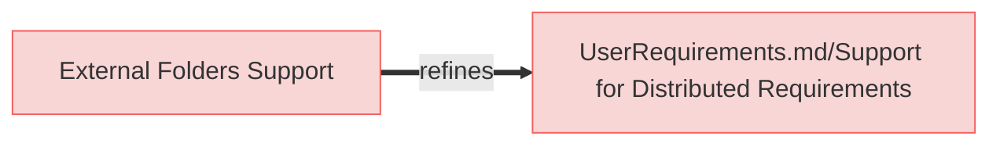
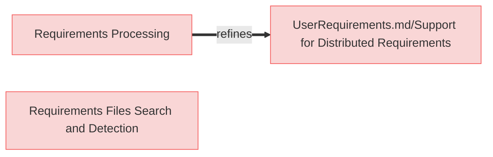

# System Requirements

## Linting

```mermaid
graph LR;
  %% Graph styling
  classDef requirement fill:#f9d6d6,stroke:#f55f5f,stroke-width:1px;
  classDef satisfies fill:#fff2cc,stroke:#ffcc00,stroke-width:1px;
  classDef verification fill:#d6f9d6,stroke:#5fd75f,stroke-width:1px;
  classDef externalLink fill:#d0e0ff,stroke:#3080ff,stroke-width:1px;
  classDef paragraph fill:#efefef,stroke:#999999,stroke-width:1px;
  classDef default fill:#f5f5f5,stroke:#333333,stroke-width:1px;

    Excess_Whitespace_Linting_Implementation["Excess Whitespace Linting Implementation"];
    click Excess_Whitespace_Linting_Implementation "SystemRequirements/Requirements.md#excess-whitespace-linting-implementation";
    class Excess_Whitespace_Linting_Implementation requirement;
    Excess_Whitespace_Linting_Implementation ==>|refines| _UserRequirements_md_Format_Consistency_Enforcement_____UserRequirements_md_format_consistency_enforcement_;
    _UserRequirements_md_Format_Consistency_Enforcement_____UserRequirements_md_format_consistency_enforcement_["UserRequirements.md/Format Consistency Enforcement"];
    click _UserRequirements_md_Format_Consistency_Enforcement_____UserRequirements_md_format_consistency_enforcement_ "../UserRequirements.md#format-consistency-enforcement";
    class _UserRequirements_md_Format_Consistency_Enforcement_____UserRequirements_md_format_consistency_enforcement_ requirement;
    _linting_whitespace_rs__https___github_com_reqflow_reqflow_src_linting_whitespace_rs_ -->|satisfies| Excess_Whitespace_Linting_Implementation;
    _linting_whitespace_rs__https___github_com_reqflow_reqflow_src_linting_whitespace_rs_["linting/whitespace.rs"];
    click _linting_whitespace_rs__https___github_com_reqflow_reqflow_src_linting_whitespace_rs_ "https://github.com/reqflow/reqflow/src/linting#whitespace.rs";
    class _linting_whitespace_rs__https___github_com_reqflow_reqflow_src_linting_whitespace_rs_ satisfies;
    Inconsistent_Newlines_Linting_Implementation["Inconsistent Newlines Linting Implementation"];
    click Inconsistent_Newlines_Linting_Implementation "SystemRequirements/Requirements.md#inconsistent-newlines-linting-implementation";
    class Inconsistent_Newlines_Linting_Implementation requirement;
    Inconsistent_Newlines_Linting_Implementation ==>|refines| _UserRequirements_md_Format_Consistency_Enforcement_____UserRequirements_md_format_consistency_enforcement_;
    _linting_newlines_rs__https___github_com_reqflow_reqflow_src_linting_newlines_rs_ -->|satisfies| Inconsistent_Newlines_Linting_Implementation;
    _linting_newlines_rs__https___github_com_reqflow_reqflow_src_linting_newlines_rs_["linting/newlines.rs"];
    click _linting_newlines_rs__https___github_com_reqflow_reqflow_src_linting_newlines_rs_ "https://github.com/reqflow/reqflow/src/linting#newlines.rs";
    class _linting_newlines_rs__https___github_com_reqflow_reqflow_src_linting_newlines_rs_ satisfies;
    Missing_Separators_Linting_Implementation["Missing Separators Linting Implementation"];
    click Missing_Separators_Linting_Implementation "SystemRequirements/Requirements.md#missing-separators-linting-implementation";
    class Missing_Separators_Linting_Implementation requirement;
    Missing_Separators_Linting_Implementation ==>|refines| _UserRequirements_md_Format_Consistency_Enforcement_____UserRequirements_md_format_consistency_enforcement_;
    _linting_separators_rs__https___github_com_reqflow_reqflow_src_linting_separators_rs_ -->|satisfies| Missing_Separators_Linting_Implementation;
    _linting_separators_rs__https___github_com_reqflow_reqflow_src_linting_separators_rs_["linting/separators.rs"];
    click _linting_separators_rs__https___github_com_reqflow_reqflow_src_linting_separators_rs_ "https://github.com/reqflow/reqflow/src/linting#separators.rs";
    class _linting_separators_rs__https___github_com_reqflow_reqflow_src_linting_separators_rs_ satisfies;
    Indentation_Consistency_Linting_Implementation["Indentation Consistency Linting Implementation"];
    click Indentation_Consistency_Linting_Implementation "SystemRequirements/Requirements.md#indentation-consistency-linting-implementation";
    class Indentation_Consistency_Linting_Implementation requirement;
    Indentation_Consistency_Linting_Implementation ==>|refines| _UserRequirements_md_Format_Consistency_Enforcement_____UserRequirements_md_format_consistency_enforcement_;
    _linting_indentation_rs__https___github_com_reqflow_reqflow_src_linting_indentation_rs_ -->|satisfies| Indentation_Consistency_Linting_Implementation;
    _linting_indentation_rs__https___github_com_reqflow_reqflow_src_linting_indentation_rs_["linting/indentation.rs"];
    click _linting_indentation_rs__https___github_com_reqflow_reqflow_src_linting_indentation_rs_ "https://github.com/reqflow/reqflow/src/linting#indentation.rs";
    class _linting_indentation_rs__https___github_com_reqflow_reqflow_src_linting_indentation_rs_ satisfies;
    Dry_Run_Mode_Implementation["Dry Run Mode Implementation"];
    click Dry_Run_Mode_Implementation "SystemRequirements/Requirements.md#dry-run-mode-implementation";
    class Dry_Run_Mode_Implementation requirement;
    Dry_Run_Mode_Implementation ==>|refines| _UserRequirements_md_Linting_Command_Behavior_____UserRequirements_md_linting_command_behavior_;
    _UserRequirements_md_Linting_Command_Behavior_____UserRequirements_md_linting_command_behavior_["UserRequirements.md/Linting Command Behavior"];
    click _UserRequirements_md_Linting_Command_Behavior_____UserRequirements_md_linting_command_behavior_ "../UserRequirements.md#linting-command-behavior";
    class _UserRequirements_md_Linting_Command_Behavior_____UserRequirements_md_linting_command_behavior_ requirement;
    _linting_mod_rs__https___github_com_reqflow_reqflow_src_linting_mod_rs_ -->|satisfies| Dry_Run_Mode_Implementation;
    _linting_mod_rs__https___github_com_reqflow_reqflow_src_linting_mod_rs_["linting/mod.rs"];
    click _linting_mod_rs__https___github_com_reqflow_reqflow_src_linting_mod_rs_ "https://github.com/reqflow/reqflow/src/linting#mod.rs";
    class _linting_mod_rs__https___github_com_reqflow_reqflow_src_linting_mod_rs_ satisfies;
    Git_Style_Diff_Output_for_Linting["Git-Style Diff Output for Linting"];
    click Git_Style_Diff_Output_for_Linting "SystemRequirements/Requirements.md#git-style-diff-output-for-linting";
    class Git_Style_Diff_Output_for_Linting requirement;
    Git_Style_Diff_Output_for_Linting ==>|refines| _UserRequirements_md_Linting_Command_Output_____UserRequirements_md_linting_command_output_;
    _UserRequirements_md_Linting_Command_Output_____UserRequirements_md_linting_command_output_["UserRequirements.md/Linting Command Output"];
    click _UserRequirements_md_Linting_Command_Output_____UserRequirements_md_linting_command_output_ "../UserRequirements.md#linting-command-output";
    class _UserRequirements_md_Linting_Command_Output_____UserRequirements_md_linting_command_output_ requirement;
    _linting_mod_rs__https___github_com_reqflow_reqflow_src_linting_mod_rs_ -->|satisfies| Git_Style_Diff_Output_for_Linting;
    Automated_Multiple_Linting_Passes["Automated Multiple Linting Passes"];
    click Automated_Multiple_Linting_Passes "SystemRequirements/Requirements.md#automated-multiple-linting-passes";
    class Automated_Multiple_Linting_Passes requirement;
    Automated_Multiple_Linting_Passes ==>|refines| _Multi_Pass_Linting_Capability___multi_pass_linting_capability_;
    _Multi_Pass_Linting_Capability___multi_pass_linting_capability_["Multi-Pass Linting Capability"];
    click _Multi_Pass_Linting_Capability___multi_pass_linting_capability_ "#multi-pass-linting-capability";
    class _Multi_Pass_Linting_Capability___multi_pass_linting_capability_ requirement;
    _linting_mod_rs__https___github_com_reqflow_reqflow_src_linting_mod_rs_ -->|satisfies| Automated_Multiple_Linting_Passes;
    Parallel_Linting_Processing["Parallel Linting Processing"];
    click Parallel_Linting_Processing "SystemRequirements/Requirements.md#parallel-linting-processing";
    class Parallel_Linting_Processing requirement;
    Parallel_Linting_Processing ==>|refines| _UserRequirements_md_Model_Linting_____UserRequirements_md_model_linting_;
    _UserRequirements_md_Model_Linting_____UserRequirements_md_model_linting_["UserRequirements.md/Model Linting"];
    click _UserRequirements_md_Model_Linting_____UserRequirements_md_model_linting_ "../UserRequirements.md#model-linting";
    class _UserRequirements_md_Model_Linting_____UserRequirements_md_model_linting_ requirement;
    _linting_mod_rs__https___github_com_reqflow_reqflow_src_linting_mod_rs_ -->|satisfies| Parallel_Linting_Processing;
    File_Pattern_Exclusion_for_Linting["File Pattern Exclusion for Linting"];
    click File_Pattern_Exclusion_for_Linting "SystemRequirements/Requirements.md#file-pattern-exclusion-for-linting";
    class File_Pattern_Exclusion_for_Linting requirement;
    File_Pattern_Exclusion_for_Linting ==>|refines| _Configurable_Filename_Exclusion_Patterns___configurable_filename_exclusion_patterns_;
    _Configurable_Filename_Exclusion_Patterns___configurable_filename_exclusion_patterns_["Configurable Filename Exclusion Patterns"];
    click _Configurable_Filename_Exclusion_Patterns___configurable_filename_exclusion_patterns_ "#configurable-filename-exclusion-patterns";
    class _Configurable_Filename_Exclusion_Patterns___configurable_filename_exclusion_patterns_ requirement;
    _utils_rs__https___github_com_reqflow_reqflow_src_utils_rs_ -->|satisfies| File_Pattern_Exclusion_for_Linting;
    _utils_rs__https___github_com_reqflow_reqflow_src_utils_rs_["utils.rs"];
    click _utils_rs__https___github_com_reqflow_reqflow_src_utils_rs_ "https://github.com/reqflow/reqflow/src#utils.rs";
    class _utils_rs__https___github_com_reqflow_reqflow_src_utils_rs_ satisfies;
    Index_Generation_During_Linting["Index Generation During Linting"];
    click Index_Generation_During_Linting "SystemRequirements/Requirements.md#index-generation-during-linting";
    class Index_Generation_During_Linting requirement;
    Index_Generation_During_Linting ==>|refines| _UserRequirements_md_Generate_Documentation_Index_____UserRequirements_md_generate_documentation_index_;
    _UserRequirements_md_Generate_Documentation_Index_____UserRequirements_md_generate_documentation_index_["UserRequirements.md/Generate Documentation Index"];
    click _UserRequirements_md_Generate_Documentation_Index_____UserRequirements_md_generate_documentation_index_ "../UserRequirements.md#generate-documentation-index";
    class _UserRequirements_md_Generate_Documentation_Index_____UserRequirements_md_generate_documentation_index_ requirement;
    _linting_index_generator_rs__https___github_com_reqflow_reqflow_src_linting_index_generator_rs_ -->|satisfies| Index_Generation_During_Linting;
    _linting_index_generator_rs__https___github_com_reqflow_reqflow_src_linting_index_generator_rs_["linting/index_generator.rs"];
    click _linting_index_generator_rs__https___github_com_reqflow_reqflow_src_linting_index_generator_rs_ "https://github.com/reqflow/reqflow/src/linting#index_generator.rs";
    class _linting_index_generator_rs__https___github_com_reqflow_reqflow_src_linting_index_generator_rs_ satisfies;
    Directory_Structure_Processing["Directory Structure Processing"];
    click Directory_Structure_Processing "SystemRequirements/Requirements.md#directory-structure-processing";
    class Directory_Structure_Processing requirement;
    Directory_Structure_Processing ==>|refines| _Index_Generator_Implementation___index_generator_implementation_;
    _Index_Generator_Implementation___index_generator_implementation_["Index Generator Implementation"];
    click _Index_Generator_Implementation___index_generator_implementation_ "#index-generator-implementation";
    class _Index_Generator_Implementation___index_generator_implementation_ requirement;
```




### Excess Whitespace Linting Implementation

The system shall detect and fix excess whitespace after element headers, subsection headers, and relation identifiers to maintain consistent formatting across all requirements documents.

#### Relations
  * refine: [UserRequirements.md/Format Consistency Enforcement](../UserRequirements.md#format-consistency-enforcement)
  * satisfiedBy: [linting/whitespace.rs](https://github.com/reqflow/reqflow/src/linting/whitespace.rs)

---

### Inconsistent Newlines Linting Implementation

The system shall identify instances where subsection headers lack proper spacing (a blank line before them) and add the necessary spacing to ensure consistent document structure.

#### Relations
  * refine: [UserRequirements.md/Format Consistency Enforcement](../UserRequirements.md#format-consistency-enforcement)
  * satisfiedBy: [linting/newlines.rs](https://github.com/reqflow/reqflow/src/linting/newlines.rs)

---

### Missing Separators Linting Implementation

The system shall detect consecutive element sections that lack a separator line (---) between them and insert the separator to maintain consistent visual separation in the documentation.

#### Relations
  * refine: [UserRequirements.md/Format Consistency Enforcement](../UserRequirements.md#format-consistency-enforcement)
  * satisfiedBy: [linting/separators.rs](https://github.com/reqflow/reqflow/src/linting/separators.rs)

---

### Indentation Consistency Linting Implementation

The system shall identify and fix inconsistent indentation and bullet types in relation lists, standardizing to a consistent format across all requirements documents.

#### Relations
  * refine: [UserRequirements.md/Format Consistency Enforcement](../UserRequirements.md#format-consistency-enforcement)
  * satisfiedBy: [linting/indentation.rs](https://github.com/reqflow/reqflow/src/linting/indentation.rs)

---

### Dry Run Mode Implementation

The system shall provide a dry run mode (--dry-run flag) for linting that shows the suggested changes without applying them, allowing users to review modifications before committing to them.

#### Relations
  * refine: [UserRequirements.md/Linting Command Behavior](../UserRequirements.md#linting-command-behavior)
  * satisfiedBy: [linting/mod.rs](https://github.com/reqflow/reqflow/src/linting/mod.rs)

---

### Git-Style Diff Output for Linting

The system shall display linting change suggestions in a git-style diff format, color-coded when possible, to clearly show what modifications will be or have been made to the documents.

#### Relations
  * refine: [UserRequirements.md/Linting Command Output](../UserRequirements.md#linting-command-output)
  * satisfiedBy: [linting/mod.rs](https://github.com/reqflow/reqflow/src/linting/mod.rs)

---

### Automated Multiple Linting Passes 

The system shall support automatic multiple linting passes with a configurable iteration limit to ensure all interdependent formatting issues are resolved without requiring multiple manual invocations.

#### Relations
  * refine: [Multi-Pass Linting Capability](#multi-pass-linting-capability)
  * satisfiedBy: [linting/mod.rs](https://github.com/reqflow/reqflow/src/linting/mod.rs)

---

### Parallel Linting Processing

The system shall implement parallel processing for linting operations when possible, leveraging multi-core capabilities to improve performance on large documentation sets.

#### Relations
  * refine: [UserRequirements.md/Model Linting](../UserRequirements.md#model-linting)
  * satisfiedBy: [linting/mod.rs](https://github.com/reqflow/reqflow/src/linting/mod.rs)

---

### File Pattern Exclusion for Linting

The system shall respect configured excluded filename patterns when performing linting operations, ensuring that files intentionally excluded from processing do not receive inappropriate linting suggestions.

#### Relations
  * refine: [Configurable Filename Exclusion Patterns](#configurable-filename-exclusion-patterns)
  * satisfiedBy: [utils.rs](https://github.com/reqflow/reqflow/src/utils.rs)

---

### Index Generation During Linting

The system shall generate or update an index.md file in the specifications root directory when linting is performed, creating a structured table of contents that links to all documentation files.

#### Relations
  * refine: [UserRequirements.md/Generate Documentation Index](../UserRequirements.md#generate-documentation-index)
  * satisfiedBy: [linting/index_generator.rs](https://github.com/reqflow/reqflow/src/linting/index_generator.rs)

---

### Directory Structure Processing

The system shall parse the 'specifications' and 'external folders' directory structure using the configured paths from reqflow.yaml to identify documentation files and their hierarchical relationships.

#### Details

TODO: this needs to be more clear on what folders to walk

#### Relations
  * refine: [Index Generator Implementation](#index-generator-implementation)

---

## Configuration




---

### External Folders Support

The system shall implement configuration parameter to support processing requirements stored in external folders outside the main specifications directory structure, treating them as system requirements in diagram generation and validation.

#### Details

'paths.external_folders' parameter of type  Vec<String> defines additional external folders that contain system requirements and other files.
These can be absolute paths or paths relative to the 'specifications' folder but must not be subfolders of 'specifications' folder.

Empty list is allowed.

All markdown files in these folders are considered **system requirements** (except those matching exclusion patterns).

```reqflow.yaml
paths:
  external_folders:
    - /path/to/folder1
    - ../../folder2 
```

#### Relations
  * refine: [UserRequirements.md/Support for Distributed Requirements](../UserRequirements.md#support-for-distributed-requirements)

---

## CLI

```mermaid
graph LR;
  %% Graph styling
  classDef requirement fill:#f9d6d6,stroke:#f55f5f,stroke-width:1px;
  classDef satisfies fill:#fff2cc,stroke:#ffcc00,stroke-width:1px;
  classDef verification fill:#d6f9d6,stroke:#5fd75f,stroke-width:1px;
  classDef externalLink fill:#d0e0ff,stroke:#3080ff,stroke-width:1px;
  classDef paragraph fill:#efefef,stroke:#999999,stroke-width:1px;
  classDef default fill:#f5f5f5,stroke:#333333,stroke-width:1px;

    Initialization_Command["Initialization Command"];
    click Initialization_Command "SystemRequirements/Requirements.md#initialization-command";
    class Initialization_Command requirement;
    Initialization_Command ==>|refines| _UserRequirements_md_Bootstrap_model_struture__UserRequirements_md_bootstrap_model_struture_;
    _UserRequirements_md_Bootstrap_model_struture__UserRequirements_md_bootstrap_model_struture_["UserRequirements.md/Bootstrap model struture"];
    click _UserRequirements_md_Bootstrap_model_struture__UserRequirements_md_bootstrap_model_struture_ "UserRequirements.md#bootstrap-model-struture";
    class _UserRequirements_md_Bootstrap_model_struture__UserRequirements_md_bootstrap_model_struture_ requirement;
    Initialization_Command_Configuration_Check["Initialization Command Configuration Check"];
    click Initialization_Command_Configuration_Check "SystemRequirements/Requirements.md#initialization-command-configuration-check";
    class Initialization_Command_Configuration_Check requirement;
    Initialization_Command_Configuration_Check ==>|refines| _Initialization_Command___initialization_command_;
    _Initialization_Command___initialization_command_["Initialization Command"];
    click _Initialization_Command___initialization_command_ "#initialization-command";
    class _Initialization_Command___initialization_command_ requirement;
    Index_Generator_Implementation["Index Generator Implementation"];
    click Index_Generator_Implementation "SystemRequirements/Requirements.md#index-generator-implementation";
    class Index_Generator_Implementation requirement;
    Index_Generator_Implementation ==>|refines| _UserRequirements_md_Generate_Documentation_Index__UserRequirements_md_generate_documentation_index_;
    _UserRequirements_md_Generate_Documentation_Index__UserRequirements_md_generate_documentation_index_["UserRequirements.md/Generate Documentation Index"];
    click _UserRequirements_md_Generate_Documentation_Index__UserRequirements_md_generate_documentation_index_ "UserRequirements.md#generate-documentation-index";
    class _UserRequirements_md_Generate_Documentation_Index__UserRequirements_md_generate_documentation_index_ requirement;
    Markdown_Content_Summary_Extraction["Markdown Content Summary Extraction"];
    click Markdown_Content_Summary_Extraction "SystemRequirements/Requirements.md#markdown-content-summary-extraction";
    class Markdown_Content_Summary_Extraction requirement;
    _Index_Generator_Implementation___index_generator_implementation_ --o|contains| Markdown_Content_Summary_Extraction;
    _Index_Generator_Implementation___index_generator_implementation_["Index Generator Implementation"];
    click _Index_Generator_Implementation___index_generator_implementation_ "#index-generator-implementation";
    class _Index_Generator_Implementation___index_generator_implementation_ requirement;
    Proper_Link_URL_Generation["Proper Link URL Generation"];
    click Proper_Link_URL_Generation "SystemRequirements/Requirements.md#proper-link-url-generation";
    class Proper_Link_URL_Generation requirement;
    _Index_Generator_Implementation___index_generator_implementation_ --o|contains| Proper_Link_URL_Generation;
    HTML_Navigation_Enhancement["HTML Navigation Enhancement"];
    click HTML_Navigation_Enhancement "SystemRequirements/Requirements.md#html-navigation-enhancement";
    class HTML_Navigation_Enhancement requirement;
    HTML_Navigation_Enhancement ==>|refines| _UserRequirements_md_Documentation_Index_HTML_Integration__UserRequirements_md_documentation_index_html_integration_;
    _UserRequirements_md_Documentation_Index_HTML_Integration__UserRequirements_md_documentation_index_html_integration_["UserRequirements.md/Documentation Index HTML Integration"];
    click _UserRequirements_md_Documentation_Index_HTML_Integration__UserRequirements_md_documentation_index_html_integration_ "UserRequirements.md#documentation-index-html-integration";
    class _UserRequirements_md_Documentation_Index_HTML_Integration__UserRequirements_md_documentation_index_html_integration_ requirement;
    LLM_Context_Command["LLM Context Command"];
    click LLM_Context_Command "SystemRequirements/Requirements.md#llm-context-command";
    class LLM_Context_Command requirement;
    LLM_Context_Command -.->|deriveReqT| _UserRequirements_md_Provide_Actionable_Model_Improvement_Suggestions__UserRequirements_md_provide_actionable_model_improvement_suggestions_;
    _UserRequirements_md_Provide_Actionable_Model_Improvement_Suggestions__UserRequirements_md_provide_actionable_model_improvement_suggestions_["UserRequirements.md/Provide Actionable Model Improvement Suggestions"];
    click _UserRequirements_md_Provide_Actionable_Model_Improvement_Suggestions__UserRequirements_md_provide_actionable_model_improvement_suggestions_ "UserRequirements.md#provide-actionable-model-improvement-suggestions";
    class _UserRequirements_md_Provide_Actionable_Model_Improvement_Suggestions__UserRequirements_md_provide_actionable_model_improvement_suggestions_ requirement;
    JSON_Validation_Output_Format["JSON Validation Output Format"];
    click JSON_Validation_Output_Format "SystemRequirements/Requirements.md#json-validation-output-format";
    class JSON_Validation_Output_Format requirement;
    JSON_Validation_Output_Format ==>|refines| _UserStories_md_Validating_Structures__UserStories_md_validating_structures_;
    _UserStories_md_Validating_Structures__UserStories_md_validating_structures_["UserStories.md/Validating Structures"];
    click _UserStories_md_Validating_Structures__UserStories_md_validating_structures_ "UserStories.md#validating-structures";
    class _UserStories_md_Validating_Structures__UserStories_md_validating_structures_ requirement;
    Multiple_Validation_Modes_Support["Multiple Validation Modes Support"];
    click Multiple_Validation_Modes_Support "SystemRequirements/Requirements.md#multiple-validation-modes-support";
    class Multiple_Validation_Modes_Support requirement;
    Multiple_Validation_Modes_Support ==>|refines| _UserStories_md_Validating_Structures__UserStories_md_validating_structures_;
    Interactive_Mermaid_Diagram_Node_Behavior["Interactive Mermaid Diagram Node Behavior"];
    click Interactive_Mermaid_Diagram_Node_Behavior "SystemRequirements/Requirements.md#interactive-mermaid-diagram-node-behavior";
    class Interactive_Mermaid_Diagram_Node_Behavior requirement;
    Interactive_Mermaid_Diagram_Node_Behavior ==>|refines| _UserRequirements_md_Interactive_Mermaid_Diagrams__UserRequirements_md_interactive_mermaid_diagrams_;
    _UserRequirements_md_Interactive_Mermaid_Diagrams__UserRequirements_md_interactive_mermaid_diagrams_["UserRequirements.md/Interactive Mermaid Diagrams"];
    click _UserRequirements_md_Interactive_Mermaid_Diagrams__UserRequirements_md_interactive_mermaid_diagrams_ "UserRequirements.md#interactive-mermaid-diagrams";
    class _UserRequirements_md_Interactive_Mermaid_Diagrams__UserRequirements_md_interactive_mermaid_diagrams_ requirement;
    Command_Line_Configuration_Overrides["Command Line Configuration Overrides"];
    click Command_Line_Configuration_Overrides "SystemRequirements/Requirements.md#command-line-configuration-overrides";
    class Command_Line_Configuration_Overrides requirement;
    Command_Line_Configuration_Overrides ==>|refines| _UserRequirements_md_Project_Configuration_with_YAML__UserRequirements_md_project_configuration_with_yaml_;
    _UserRequirements_md_Project_Configuration_with_YAML__UserRequirements_md_project_configuration_with_yaml_["UserRequirements.md/Project Configuration with YAML"];
    click _UserRequirements_md_Project_Configuration_with_YAML__UserRequirements_md_project_configuration_with_yaml_ "UserRequirements.md#project-configuration-with-yaml";
    class _UserRequirements_md_Project_Configuration_with_YAML__UserRequirements_md_project_configuration_with_yaml_ requirement;
    Design_Specification_Document_Special_Handling["Design Specification Document Special Handling"];
    click Design_Specification_Document_Special_Handling "SystemRequirements/Requirements.md#design-specification-document-special-handling";
    class Design_Specification_Document_Special_Handling requirement;
    Design_Specification_Document_Special_Handling ==>|refines| _UserStories_md_Managing_MBSE_Models__UserStories_md_managing_mbse_models_;
    _UserStories_md_Managing_MBSE_Models__UserStories_md_managing_mbse_models_["UserStories.md/Managing MBSE Models"];
    click _UserStories_md_Managing_MBSE_Models__UserStories_md_managing_mbse_models_ "UserStories.md#managing-mbse-models";
    class _UserStories_md_Managing_MBSE_Models__UserStories_md_managing_mbse_models_ requirement;
    Relation_Type_Validation["Relation Type Validation"];
    click Relation_Type_Validation "SystemRequirements/Requirements.md#relation-type-validation";
    class Relation_Type_Validation requirement;
    Relation_Type_Validation ==>|refines| _UserRequirements_md_Enhanced_Validation_Error_Reporting_____UserRequirements_md_enhanced_validation_error_reporting_;
    _UserRequirements_md_Enhanced_Validation_Error_Reporting_____UserRequirements_md_enhanced_validation_error_reporting_["UserRequirements.md/Enhanced Validation Error Reporting"];
    click _UserRequirements_md_Enhanced_Validation_Error_Reporting_____UserRequirements_md_enhanced_validation_error_reporting_ "../UserRequirements.md#enhanced-validation-error-reporting";
    class _UserRequirements_md_Enhanced_Validation_Error_Reporting_____UserRequirements_md_enhanced_validation_error_reporting_ requirement;
    _src_relation_rs__https___github_com_reqflow_reqflow_src_relation_rs_ -->|satisfies| Relation_Type_Validation;
    _src_relation_rs__https___github_com_reqflow_reqflow_src_relation_rs_["src/relation.rs"];
    click _src_relation_rs__https___github_com_reqflow_reqflow_src_relation_rs_ "https://github.com/reqflow/reqflow/src#relation.rs";
    class _src_relation_rs__https___github_com_reqflow_reqflow_src_relation_rs_ satisfies;
    Multi_Pass_Linting_Capability["Multi-Pass Linting Capability"];
    click Multi_Pass_Linting_Capability "SystemRequirements/Requirements.md#multi-pass-linting-capability";
    class Multi_Pass_Linting_Capability requirement;
    Multi_Pass_Linting_Capability ==>|refines| _UserRequirements_md_Format_Consistency_Enforcement__UserRequirements_md_format_consistency_enforcement_;
    _UserRequirements_md_Format_Consistency_Enforcement__UserRequirements_md_format_consistency_enforcement_["UserRequirements.md/Format Consistency Enforcement"];
    click _UserRequirements_md_Format_Consistency_Enforcement__UserRequirements_md_format_consistency_enforcement_ "UserRequirements.md#format-consistency-enforcement";
    class _UserRequirements_md_Format_Consistency_Enforcement__UserRequirements_md_format_consistency_enforcement_ requirement;
    Comprehensive_HTML_Generation["Comprehensive HTML Generation"];
    click Comprehensive_HTML_Generation "SystemRequirements/Requirements.md#comprehensive-html-generation";
    class Comprehensive_HTML_Generation requirement;
    Comprehensive_HTML_Generation ==>|refines| _UserStories_md_Managing_MBSE_Models__UserStories_md_managing_mbse_models_;
    Detailed_Error_Handling_and_Logging["Detailed Error Handling and Logging"];
    click Detailed_Error_Handling_and_Logging "SystemRequirements/Requirements.md#detailed-error-handling-and-logging";
    class Detailed_Error_Handling_and_Logging requirement;
    Detailed_Error_Handling_and_Logging ==>|refines| _UserRequirements_md_Enhanced_Validation_Error_Reporting__UserRequirements_md_enhanced_validation_error_reporting_;
    _UserRequirements_md_Enhanced_Validation_Error_Reporting__UserRequirements_md_enhanced_validation_error_reporting_["UserRequirements.md/Enhanced Validation Error Reporting"];
    click _UserRequirements_md_Enhanced_Validation_Error_Reporting__UserRequirements_md_enhanced_validation_error_reporting_ "UserRequirements.md#enhanced-validation-error-reporting";
    class _UserRequirements_md_Enhanced_Validation_Error_Reporting__UserRequirements_md_enhanced_validation_error_reporting_ requirement;
    _src_error_rs__https___github_com_reqflow_reqflow_src_error_rs_ -->|satisfies| Detailed_Error_Handling_and_Logging;
    _src_error_rs__https___github_com_reqflow_reqflow_src_error_rs_["src/error.rs"];
    click _src_error_rs__https___github_com_reqflow_reqflow_src_error_rs_ "https://github.com/reqflow/reqflow/src#error.rs";
    class _src_error_rs__https___github_com_reqflow_reqflow_src_error_rs_ satisfies;
    File_Content_Caching_for_Performance["File Content Caching for Performance"];
    click File_Content_Caching_for_Performance "SystemRequirements/Requirements.md#file-content-caching-for-performance";
    class File_Content_Caching_for_Performance requirement;
    File_Content_Caching_for_Performance ==>|refines| _UserStories_md_Managing_MBSE_Models__UserStories_md_managing_mbse_models_;
```




---

### Initialization Command

The system shall implement an `init` command that bootstraps a basic ReqFlow project structure with example requirements, folder hierarchy, and a configuration file.

#### Relations
  * refine: [UserRequirements.md/Bootstrap model struture](UserRequirements.md#bootstrap-model-struture)

---

---

### Initialization Command Configuration Check

The system shall prevent the initialization command from modifying an existing project by detecting if a configuration file already exists (in any of its accepted formats: .yaml, .yml) and report an error instead of proceeding.

#### Relations
  * refine: [Initialization Command](#initialization-command)

---

### Index Generator Implementation

The system shall implement an IndexGenerator component that traverses the specifications directory structure and creates a hierarchical index.md file with links and summaries.

#### Relations
  * refine: [UserRequirements.md/Generate Documentation Index](UserRequirements.md#generate-documentation-index)

---

### Markdown Content Summary Extraction

The system shall extract summaries from the first heading and paragraph of each document to include meaningful descriptions in the generated index.

#### Relations
  * containedBy: [Index Generator Implementation](#index-generator-implementation)

---

### Proper Link URL Generation

The system shall generate URLs in the index file with both Markdown (.md) and HTML (.md) extensions, ensuring documentation navigation works in both formats.

#### Relations
  * containedBy: [Index Generator Implementation](#index-generator-implementation)

---

### HTML Navigation Enhancement 

The system shall enhance the HTML generator to process index.md as a special file, adding navigation elements and ensuring it serves as the primary entry point.

#### Relations
  * refine: [UserRequirements.md/Documentation Index HTML Integration](UserRequirements.md#documentation-index-html-integration)

---

### LLM Context Command

The system shall provide a command-line option `--llm-context` that outputs comprehensive contextual information about ReqFlow methodology, document structure, relation types, and CLI usage to help Large Language Models understand and work with ReqFlow-based projects.

#### Relations
  * derivedFrom: [UserRequirements.md/Provide Actionable Model Improvement Suggestions](UserRequirements.md#provide-actionable-model-improvement-suggestions)

---

### JSON Validation Output Format

The system shall provide validation results in machine-readable JSON format to facilitate integration with CI/CD pipelines and automated reporting tools.

#### Relations
  * refine: [UserStories.md/Validating Structures](UserStories.md#validating-structures)

---

### Multiple Validation Modes Support

The system shall support different validation modes (validate_markdown, validate_relations, validate_all) with configurable behaviors to accommodate different use cases.

#### Relations
  * refine: [UserStories.md/Validating Structures](UserStories.md#validating-structures)

---

### Interactive Mermaid Diagram Node Behavior

The system shall implement interactive click behavior for Mermaid diagram nodes that redirects to the referenced element when clicked.

#### Relations
  * refine: [UserRequirements.md/Interactive Mermaid Diagrams](UserRequirements.md#interactive-mermaid-diagrams)

---

### Command Line Configuration Overrides

The system shall allow command line arguments to override YAML configuration settings to provide flexibility without modifying configuration files.

#### Relations
  * refine: [UserRequirements.md/Project Configuration with YAML](UserRequirements.md#project-configuration-with-yaml)

---

### Design Specification Document Special Handling

The system shall provide special handling for Design Specification Documents when collecting elements to accommodate their unique structure and purpose.

#### Relations
  * refine: [UserStories.md/Managing MBSE Models](UserStories.md#managing-mbse-models)

---

### Relation Type Validation

The system shall validate relation types against a defined vocabulary and provide clear error messages for unsupported relation types, including suggestions for the correct relation types.

#### Relations
  * refine: [UserRequirements.md/Enhanced Validation Error Reporting](../UserRequirements.md#enhanced-validation-error-reporting)
  * satisfiedBy: [src/relation.rs](https://github.com/reqflow/reqflow/src/relation.rs)

---

### Multi-Pass Linting Capability

The system shall support multi-pass linting with a configurable iteration limit to ensure all interdependent formatting issues are resolved.

#### Relations
  * refine: [UserRequirements.md/Format Consistency Enforcement](UserRequirements.md#format-consistency-enforcement)

---

### Comprehensive HTML Generation

The system shall generate HTML output for all markdown files, not just requirements documents, to provide consistent representation of the entire model.

#### Relations
  * refine: [UserStories.md/Managing MBSE Models](UserStories.md#managing-mbse-models)

---

### Detailed Error Handling and Logging

The system shall implement detailed error handling and logging throughout the application to facilitate troubleshooting and provide meaningful feedback.

#### Relations
  * refine: [UserRequirements.md/Enhanced Validation Error Reporting](UserRequirements.md#enhanced-validation-error-reporting)
  * satisfiedBy: [src/error.rs](https://github.com/reqflow/reqflow/src/error.rs)

---

### File Content Caching for Performance

The system shall cache file contents during processing to optimize performance for operations that require multiple passes through the same files.

#### Relations
  * refine: [UserStories.md/Managing MBSE Models](UserStories.md#managing-mbse-models)
  
  
---

## Logic




---

### Requirements Processing

The system shall find and process all requirements in  'external_folders' and it's subfolders' consistently and 'system requirements'.

#### Relations
  * refine: [UserRequirements.md/Support for Distributed Requirements](../UserRequirements.md#support-for-distributed-requirements)

---

### Requirements Files Search and Detection

The system shall identify and categorize files in the `specifications` and `external_folders` directories as **Stakeholder Needs Requirements**, **System Requirements**, or **Not a Requirements File** based on predefined rules.

#### Details

Identification Process:

The process follows these steps to determine whether a file contains requirements and, if so, whether it falls under **Stakeholder Needs Requirements** or **System Requirements**:

1. **File Selection**: The process scans all files in the `specifications` folder (including subfolders) and `external_folders`.
2. **Excluded Patterns Check**: If a file matches any excluded patterns, it is marked as **not a requirements file**.
3. **File Extension Check**: If the file does not have a `.md` extension, it is marked as **not a requirements file**.
4. **Design Folder Check**: If the file is located in a folder defined by the `design_specifications_folder` configuration, it is marked as **not a requirements file**.
5. **External Folder Check**: If the file is found in an external folder (or any of its subfolders), it is categorized as a **System Requirements file**.
6. **Root Folder Check**: If the file is located at the root of the `specifications` folder, it is categorized as a **Stakeholder Needs Requirements file**. Otherwise, it is categorized as a **System Requirements file**.

## Categorization Outcomes


- **Stakeholder Needs Requirements File**: Files located in the root of the `specifications` folder and meeting all conditions.
- **System Requirements File**: Files found in external folders or subfolders within `specifications`.
- **Not a Requirements File**: Files that match exclusion patterns, do not have a `.md` extension, or are in the design folder.

---

### Configurable Filename Exclusion Patterns

The system shall support configurable glob patterns to exclude specific files from requirement processing, regardless if they are located in specifications or external folders.

#### Details

```reqflow.yaml

paths:

  # Glob patterns to exclude from requirements processing
  # These are patterns that shouldn't be considered requirements even if they're in specifications or external folders
  excluded_filename_patterns:
    - "**/Logical*.md"
    - "**/Physical*.md"    
```

#### Relations
  * refine: [UserRequirements.md/Project Configuration with YAML](../UserRequirements.md#project-configuration-with-yaml)

---
