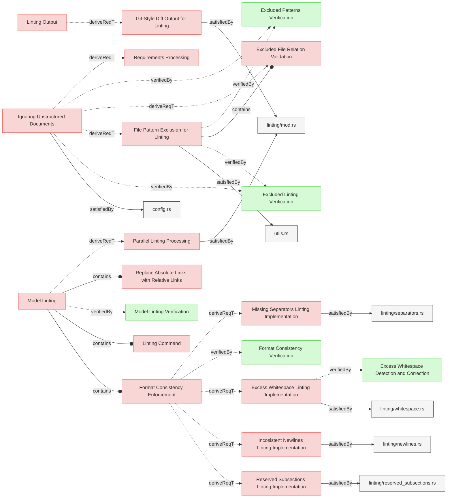
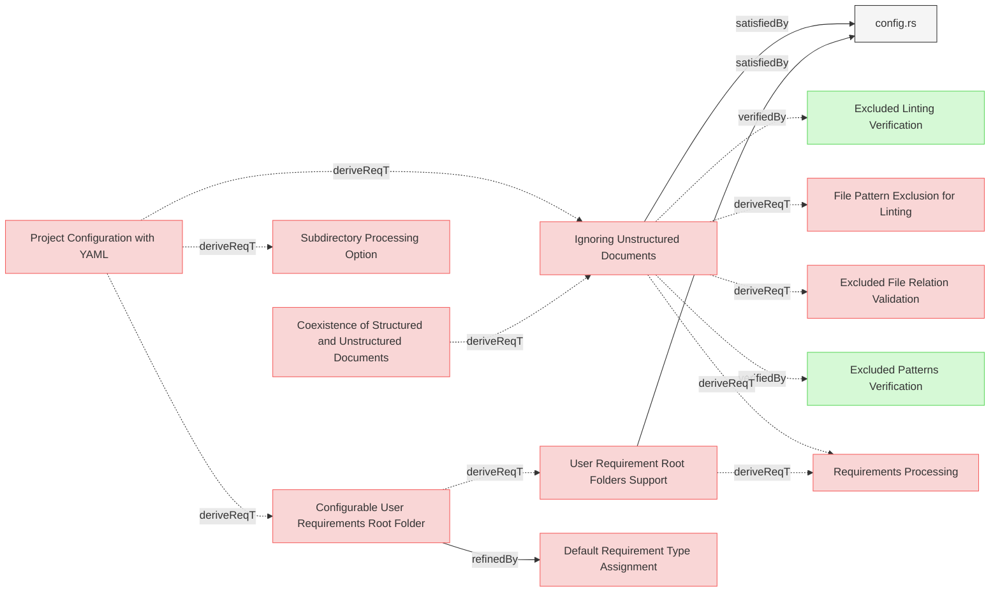
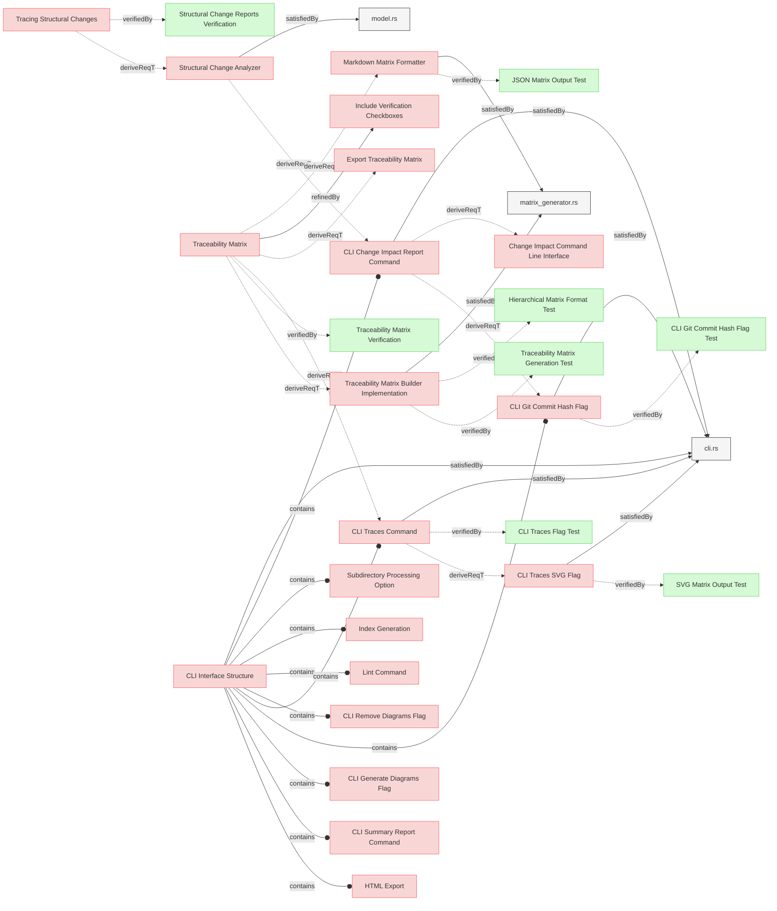
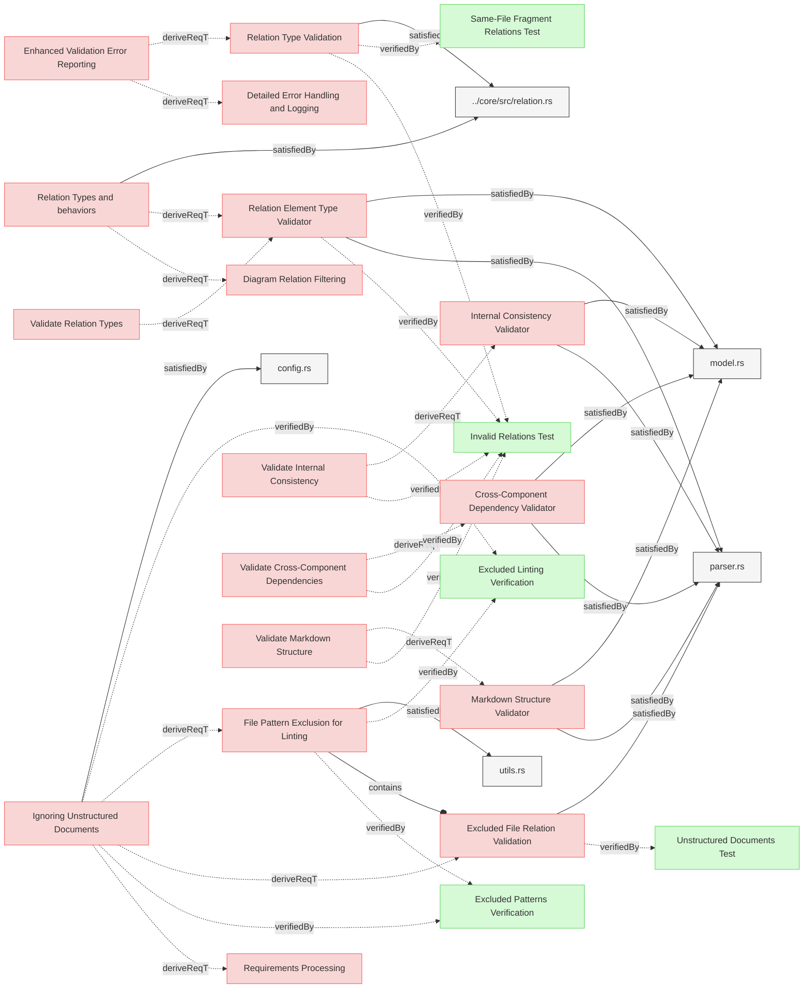
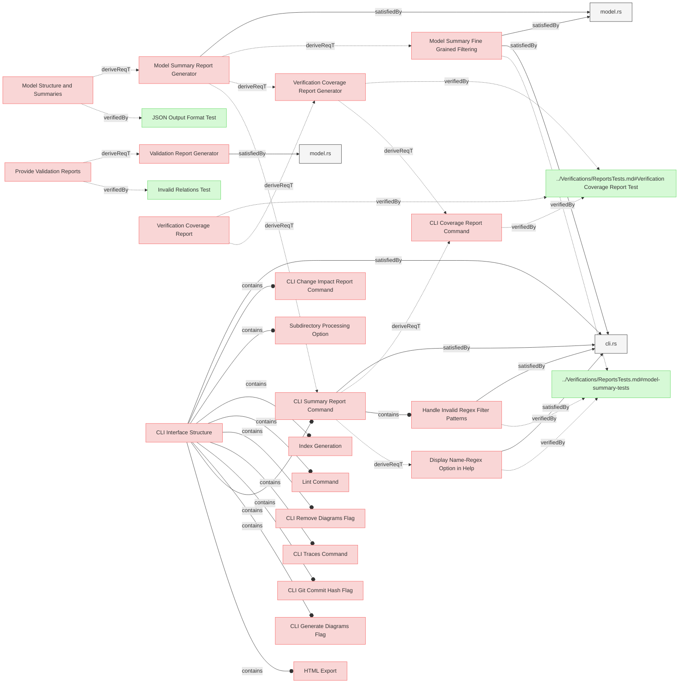
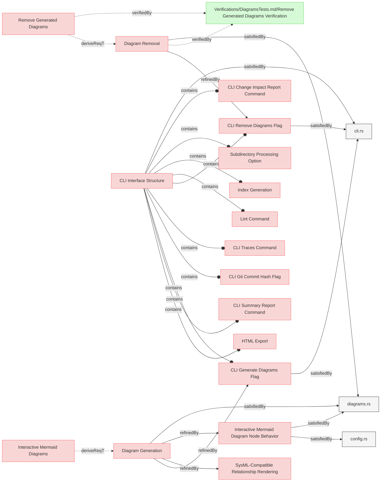

# System Requirements

## Linting    

---

### Excess Whitespace Linting Implementation
The system shall detect and fix excess whitespace after element headers, subsection headers, and relation identifiers to maintain consistent formatting across all requirements documents.

#### Relations
  * derivedFrom: [UserRequirements.md/Format Consistency Enforcement](../UserRequirements.md#format-consistency-enforcement)
  * satisfiedBy: [linting/whitespace.rs](../../core/src/linting/whitespace.rs)

---

### Incosistent Newlines Linting Implementation

The system shall detect and fix excess or missing newlines before element headers, subsection headers to maintain consistent formatting across all requirements documents.

#### Relations
  * derivedFrom: [UserRequirements.md/Format Consistency Enforcement](../UserRequirements.md#format-consistency-enforcement)
  * satisfiedBy: [linting/newlines.rs](../../core/src/linting/newlines.rs)

---

### Missing Separators Linting Implementation

The system shall detect consecutive element sections that lack a separator line (---) between them and insert the separator to maintain consistent visual separation in the documentation.

#### Relations
  * derivedFrom: [UserRequirements.md/Format Consistency Enforcement](../UserRequirements.md#format-consistency-enforcement)
  * satisfiedBy: [linting/separators.rs](../../core/src/linting/separators.rs)

---

### Reserved Subsections Linting Implementation

The system shall identify and fix inconsistent indentation and bullet types in relation lists and other reserved subsections, standardizing to a consistent format across all requirements documents.

#### Relations
  * derivedFrom: [UserRequirements.md/Format Consistency Enforcement](../UserRequirements.md#format-consistency-enforcement)
  * satisfiedBy: [linting/reserved_subsections.rs](../../core/src/linting/indentation.rs)

---

### Git-Style Diff Output for Linting
The system shall display linting change suggestions in a git-style diff format, color-coded when possible, to clearly show what modifications will be or have been made to the documents.

#### Relations
  * derivedFrom: [UserRequirements.md/Linting Output](../UserRequirements.md#linting-output)
  * satisfiedBy: [linting/mod.rs](../../core/src/linting/mod.rs)

---

### Parallel Linting Processing
The system shall implement parallel processing for linting operations when possible, leveraging multi-core capabilities to improve performance on large documentation sets.

#### Relations
  * derivedFrom: [UserRequirements.md/Model Linting](../UserRequirements.md#model-linting)
  * satisfiedBy: [linting/mod.rs](../../core/src/linting/mod.rs)

---

### File Pattern Exclusion for Linting
The system shall respect configured excluded filename patterns when performing linting operations, ensuring that files intentionally excluded from processing do not receive inappropriate linting suggestions.

#### Relations
  * derivedFrom: [Ignoring Unstructured Documents](#ignoring-unstructured-documents) 
  * satisfiedBy: [utils.rs](../../core/src/utils.rs)

---

## Configuration

---

### User Requirement Root Folders Support

The system shall implement configuration parameter that would specify a single folder path, relative to the Git repository root, that is designated as the primary location for user requirements.

#### Details

'paths.user_requirements_root_folder' parameter of type  String defines default folder for the user-requirements.

All elements in markdown files (except those matching exclusion patterns) in root of this folders are considered **user requirements** unless explicitly set as other element type in the metadata.

#### Relations
  * derivedFrom: [ManagingMbseModelsRequirements.md#Configurable User Requirements Root Folder](../ManagingMbseModelsRequirements.md#configurable-user-requirements-root-folder)
  * satisfiedBy: [config.rs](../../cli/src/config.rs)

---

### Ignoring Unstructured Documents

The system shall support configurable glob patterns to exclude specific files from requirement processing.

#### Details
```reqvire.yaml
paths:

  # Glob patterns to exclude from structured documents processing
  excluded_filename_patterns:
    - "**/Logical*.md"
    - "**/Physical*.md"    
```

#### Relations
  * derivedFrom: [ManagingMbseModelsRequirements.md/Project Configuration with YAML](../ManagingMbseModelsRequirements.md#project-configuration-with-yaml)
  * derivedFrom: [ManagingMbseModelsRequirements.md#Coexistence of Structured and Unstructured Documents](../ManagingMbseModelsRequirements.md#coexistence-of-structured-and-unstructured-documents)
  * satisfiedBy: [config.rs](../../cli/src/config.rs)

---

## CLI

```mermaid
graph LR;
  %% Graph styling
  classDef requirement fill:#f9d6d6,stroke:#f55f5f,stroke-width:1px;
  classDef verification fill:#d6f9d6,stroke:#5fd75f,stroke-width:1px;
  classDef externalLink fill:#d0e0ff,stroke:#3080ff,stroke-width:1px;
  classDef default fill:#f5f5f5,stroke:#333333,stroke-width:1px;

  c1851df0c89e80f8["HTML Navigation Enhancement"];
  class c1851df0c89e80f8 requirement;
  click c1851df0c89e80f8 "Requirements.md#html-navigation-enhancement";
  d0e6cc47b904faa5["html.rs"];
  class d0e6cc47b904faa5 default;
  click d0e6cc47b904faa5 "../../core/src/html.rs";
  c1851df0c89e80f8 -->|satisfiedBy| d0e6cc47b904faa5;
  c3d63c5d4133e346["html_export.rs"];
  class c3d63c5d4133e346 default;
  click c3d63c5d4133e346 "../../core/src/html_export.rs";
  c1851df0c89e80f8 -->|satisfiedBy| c3d63c5d4133e346;
  5ffd0c57f51e3b22["Export Related System Elements"];
  class 5ffd0c57f51e3b22 requirement;
  click 5ffd0c57f51e3b22 "Requirements.md#export-related-system-elements";
  c3d63c5d4133e346["html_export.rs"];
  class c3d63c5d4133e346 default;
  click c3d63c5d4133e346 "../../core/src/html_export.rs";
  5ffd0c57f51e3b22 -->|satisfiedBy| c3d63c5d4133e346;
  d0e6cc47b904faa5["html.rs"];
  class d0e6cc47b904faa5 default;
  click d0e6cc47b904faa5 "../../core/src/html.rs";
  5ffd0c57f51e3b22 -->|satisfiedBy| d0e6cc47b904faa5;
  4ecd49d71920c1fc["Detailed Error Handling and Logging"];
  class 4ecd49d71920c1fc requirement;
  click 4ecd49d71920c1fc "Requirements.md#detailed-error-handling-and-logging";
  a581221890d15c0c["src/error.rs"];
  class a581221890d15c0c default;
  click a581221890d15c0c "../../core/src/error.rs";
  4ecd49d71920c1fc -->|satisfiedBy| a581221890d15c0c;
  e37dc7f46d75d46["Invalid Relations Test"];
  class e37dc7f46d75d46 verification;
  click e37dc7f46d75d46 "../Verifications/ValidationTests.md#invalid-relations-test";
  4ecd49d71920c1fc -.->|verifiedBy| e37dc7f46d75d46;
  a21995894299effb["Index Generation"];
  class a21995894299effb requirement;
  click a21995894299effb "Requirements.md#index-generation";
  1a173441705701a0["index_generator.rs"];
  class 1a173441705701a0 default;
  click 1a173441705701a0 "../../core/src/index_generator.rs";
  a21995894299effb -->|satisfiedBy| 1a173441705701a0;
  80defdd4cbc7ee18["cli.rs"];
  class 80defdd4cbc7ee18 default;
  click 80defdd4cbc7ee18 "../../cli/src/cli.rs";
  a21995894299effb -->|satisfiedBy| 80defdd4cbc7ee18;
  3108f29b131412a3["Index Generation Test"];
  class 3108f29b131412a3 verification;
  click 3108f29b131412a3 "../Verifications/ReportsTests.md#index-generation-test";
  a21995894299effb -.->|verifiedBy| 3108f29b131412a3;
  deaec107945edbed["Lint Command"];
  class deaec107945edbed requirement;
  click deaec107945edbed "Requirements.md#lint-command";
  80defdd4cbc7ee18["cli.rs"];
  class 80defdd4cbc7ee18 default;
  click 80defdd4cbc7ee18 "../../cli/src/cli.rs";
  deaec107945edbed -->|satisfiedBy| 80defdd4cbc7ee18;
  37dbb69e504fec9d["Excess Whitespace Detection and Correction"];
  class 37dbb69e504fec9d verification;
  click 37dbb69e504fec9d "../Verifications/LintingTests.md#excess-whitespace-detection-and-correction";
  deaec107945edbed -.->|verifiedBy| 37dbb69e504fec9d;
  706dca24b7cc1eb8["CLI Lint Flag Test"];
  class 706dca24b7cc1eb8 verification;
  click 706dca24b7cc1eb8 "../Verifications/LintingTests.md#cli-lint-flag-test";
  deaec107945edbed -.->|verifiedBy| 706dca24b7cc1eb8;
  5deb63503bdf77c["HTML Export"];
  class 5deb63503bdf77c requirement;
  click 5deb63503bdf77c "Requirements.md#html-export";
  c3d63c5d4133e346["html_export.rs"];
  class c3d63c5d4133e346 default;
  click c3d63c5d4133e346 "../../core/src/html_export.rs";
  5deb63503bdf77c -->|satisfiedBy| c3d63c5d4133e346;
  d0e6cc47b904faa5["html.rs"];
  class d0e6cc47b904faa5 default;
  click d0e6cc47b904faa5 "../../core/src/html.rs";
  5deb63503bdf77c -->|satisfiedBy| d0e6cc47b904faa5;
  80defdd4cbc7ee18["cli.rs"];
  class 80defdd4cbc7ee18 default;
  click 80defdd4cbc7ee18 "../../cli/src/cli.rs";
  5deb63503bdf77c -->|satisfiedBy| 80defdd4cbc7ee18;
  5deb63503bdf77c -->|refinedBy| 5ffd0c57f51e3b22;
  8f22faacdb454b23["CLI Interface Structure"];
  class 8f22faacdb454b23 requirement;
  click 8f22faacdb454b23 "Requirements.md#cli-interface-structure";
  80defdd4cbc7ee18["cli.rs"];
  class 80defdd4cbc7ee18 default;
  click 80defdd4cbc7ee18 "../../cli/src/cli.rs";
  8f22faacdb454b23 -->|satisfiedBy| 80defdd4cbc7ee18;
  4c9ae0a2fb751ce6["CLI Change Impact Report Command"];
  class 4c9ae0a2fb751ce6 requirement;
  click 4c9ae0a2fb751ce6 "Requirements.md#cli-change-impact-report-command";
  8f22faacdb454b23 --o|contains| 4c9ae0a2fb751ce6;
  7bdf935ec6d8effe["Subdirectory Processing Option"];
  class 7bdf935ec6d8effe requirement;
  click 7bdf935ec6d8effe "Requirements.md#subdirectory-processing-option";
  8f22faacdb454b23 --o|contains| 7bdf935ec6d8effe;
  8f22faacdb454b23 --o|contains| a21995894299effb;
  8f22faacdb454b23 --o|contains| deaec107945edbed;
  749eaee85cfd0a43["CLI Remove Diagrams Flag"];
  class 749eaee85cfd0a43 requirement;
  click 749eaee85cfd0a43 "Requirements.md#cli-remove-diagrams-flag";
  8f22faacdb454b23 --o|contains| 749eaee85cfd0a43;
  5bfc0d5fd7bba25["CLI Traces Command"];
  class 5bfc0d5fd7bba25 requirement;
  click 5bfc0d5fd7bba25 "Requirements.md#cli-traces-command";
  8f22faacdb454b23 --o|contains| 5bfc0d5fd7bba25;
  6c40e66699ba40dd["CLI Git Commit Hash Flag"];
  class 6c40e66699ba40dd requirement;
  click 6c40e66699ba40dd "Requirements.md#cli-git-commit-hash-flag";
  8f22faacdb454b23 --o|contains| 6c40e66699ba40dd;
  7223dec8fe51900f["CLI Generate Diagrams Flag"];
  class 7223dec8fe51900f requirement;
  click 7223dec8fe51900f "Requirements.md#cli-generate-diagrams-flag";
  8f22faacdb454b23 --o|contains| 7223dec8fe51900f;
  5a07afd22db51c40["CLI Summary Report Command"];
  class 5a07afd22db51c40 requirement;
  click 5a07afd22db51c40 "Requirements.md#cli-summary-report-command";
  8f22faacdb454b23 --o|contains| 5a07afd22db51c40;
  8f22faacdb454b23 --o|contains| 5deb63503bdf77c;
  a51179cda67cf9f2["Linting Command"];
  class a51179cda67cf9f2 requirement;
  click a51179cda67cf9f2 "../UserRequirements.md#linting-command";
  26fdf88d16b09109["Linting Output"];
  class 26fdf88d16b09109 requirement;
  click 26fdf88d16b09109 "../UserRequirements.md#linting-output";
  a51179cda67cf9f2 -->|refinedBy| 26fdf88d16b09109;
  a51179cda67cf9f2 -.->|deriveReqT| deaec107945edbed;
  a8037b2df81f02be["Linting Command Verification"];
  class a8037b2df81f02be verification;
  click a8037b2df81f02be "../Verifications/LintingTests.md#linting-command-verification";
  a51179cda67cf9f2 -.->|verifiedBy| a8037b2df81f02be;
  3b10b8811daaed67["Enhanced Validation Error Reporting"];
  class 3b10b8811daaed67 requirement;
  click 3b10b8811daaed67 "../UserRequirements.md#enhanced-validation-error-reporting";
  db64a3e25646a37f["Relation Type Validation"];
  class db64a3e25646a37f requirement;
  click db64a3e25646a37f "Requirements.md#relation-type-validation";
  3b10b8811daaed67 -.->|deriveReqT| db64a3e25646a37f;
  3b10b8811daaed67 -.->|deriveReqT| 4ecd49d71920c1fc;
  84b3d0502132adb5["Documentation Index HTML Integration"];
  class 84b3d0502132adb5 requirement;
  click 84b3d0502132adb5 "../UserRequirements.md#documentation-index-html-integration";
  84b3d0502132adb5 -.->|deriveReqT| c1851df0c89e80f8;
  f28849d46c19af44["CLI interface"];
  class f28849d46c19af44 requirement;
  click f28849d46c19af44 "../UserRequirements.md#cli-interface";
  f28849d46c19af44 -.->|deriveReqT| 8f22faacdb454b23;
  c2b6c74b77726ad9["Generate Documentation Index"];
  class c2b6c74b77726ad9 requirement;
  click c2b6c74b77726ad9 "../UserRequirements.md#generate-documentation-index";
  c2b6c74b77726ad9 -->|refinedBy| 84b3d0502132adb5;
  c2b6c74b77726ad9 -.->|deriveReqT| a21995894299effb;
  a4c40962cac85d0c["Export HTML specifications"];
  class a4c40962cac85d0c requirement;
  click a4c40962cac85d0c "../UserRequirements.md#export-html-specifications";
  14ef985b9a43174e["HTML Export Verification"];
  class 14ef985b9a43174e verification;
  click 14ef985b9a43174e "../Verifications/Misc.md#html-export-verification";
  a4c40962cac85d0c -.->|verifiedBy| 14ef985b9a43174e;
  a4c40962cac85d0c -.->|deriveReqT| 5deb63503bdf77c;
```

---

### CLI Interface Structure

The CLI interface shall implement the clear `[OPTIONS] <COMMAND> [COMMAND OPTIONS]` structure.

#### Details

The CLI must display all commands and options and command's options flattened in the main help output which must also be a default commnad:
```
Reqvire requirements & treacibility management tool

Usage: reqvire [OPTIONS] <COMMAND> [COMMAND OPTIONS]

Commands:
  lint               Enable linting to find potential improvements (non-blocking) By default, fixes will be applied automatically
  validate           Validate model
  help               Print this message or the help of the given subcommand(s)

Options:
  -c, --config <CONFIG>    Path to a custom configuration file (YAML format) If not provided, the system will look for reqvire.yml, reqvire.yaml, .reqvire.yml, or .reqvire.yaml in the current directory
  -h, --help               Print help
  -V, --version            Print version

LINT OPTIONS:
      --dry-run  When linting, only show suggestions without applying fixes
      --json  Output results in JSON format
```

#### Relations
  * derivedFrom: [../UserRequirements.md/CLI interface](../UserRequirements.md#cli-interface)
  * satisfiedBy: [cli.rs](../../cli/src/cli.rs)

---

### Lint Command

The system shall provide a linting function, activated by the (lint command), which shall execute the linting process upon user request.

#### Details
 
`lint` command must provide a dry run mode (--dry-run option flag) for linting that shows the suggested changes without applying them, allowing users to review modifications before committing to them:
  - --dry-run flag works in tandem with the main lint command flag and cannot be used standalone.

#### Relations
  * derivedFrom: [UserRequirements.md/Linting Command Behavior](../UserRequirements.md#linting-command)
  * containedBy: [CLI Interface Structure](#cli-interface-structure)    
  * satisfiedBy: [cli.rs](../../cli/src/cli.rs)    

---

### Index Generation

The system shall implement an IndexGenerator component activated by the (generate-index command),  that traverses the specifications directory structure and creates a hierarchical SpecificationIndex.md file with links to documents and elements in the repository root.

#### Details

The index generator shall:
1. Traverse all specifications and documents in the model
2. Group elements by file and section
3. Create a hierarchical index with links to documents and elements
4. Generate summary statistics including total files, sections, and elements
5. Write the index as SpecificationIndex.md to the repository root, not the output folder

#### Relations
  * derivedFrom: [UserRequirements.md/Generate Documentation Index](../UserRequirements.md#generate-documentation-index)
  * containedBy: [CLI Interface Structure](#cli-interface-structure)    
  * satisfiedBy: [index_generator.rs](../../core/src/index_generator.rs)
  * satisfiedBy: [cli.rs](../../cli/src/cli.rs)      

---

### HTML Navigation Enhancement 

The system shall enhance the HTML generator to process SpecificationIndex.md as a special file, adding navigation elements and ensuring it serves as the primary entry point.

#### Details

SpecificationIndex.md file must be saved as index.html file when exported to the HTML output directory.

#### Relations
  * derivedFrom: [UserRequirements.md/Documentation Index HTML Integration](../UserRequirements.md#documentation-index-html-integration)
  * satisfiedBy: [html.rs](../../core/src/html.rs)
  * satisfiedBy: [html_export.rs](../../core/src/html_export.rs)

---

### HTML Export

The system shall generate HTML output ( activated by `html` command) for all markdown files, not just requirements documents, to provide consistent representation of the entire model.

#### Details

The system must accept `--output` command option flag for knowing where to export files. The default value must be 'html' folder:
 - folder will be created if not existing
 - .gitignore file must be added into the folder that ignores all files except .gitignore (itself)

#### Relations
  * derivedFrom: [../UserRequirements.md/Export HTML specifications](../UserRequirements.md#export-html-specifications)
  * containedBy: [CLI Interface Structure](#cli-interface-structure)    
  * satisfiedBy: [html_export.rs](../../core/src/html_export.rs)
  * satisfiedBy: [html.rs](../../core/src/html.rs)  
  * satisfiedBy: [cli.rs](../../cli/src/cli.rs)      

---

### Export Related System Elements

The system shall ensure that any related system elements are also copied into output folder to ensure consistency of exported model.

#### Relations
  * refine: [#HTML Export](#html-export)
  * satisfiedBy: [html_export.rs](../../core/src/html_export.rs)
  * satisfiedBy: [html.rs](../../core/src/html.rs)  

---

### Detailed Error Handling and Logging

The system shall implement detailed error handling and logging throughout the application to facilitate troubleshooting and provide meaningful feedback.

#### Relations
  * derivedFrom: [../UserRequirements.md#Enhanced Validation Error Reporting](../UserRequirements.md#enhanced-validation-error-reporting)
  * satisfiedBy: [src/error.rs](../../core/src/error.rs)

---

## Logic

```mermaid
graph LR;
  %% Graph styling
  classDef requirement fill:#f9d6d6,stroke:#f55f5f,stroke-width:1px;
  classDef verification fill:#d6f9d6,stroke:#5fd75f,stroke-width:1px;
  classDef externalLink fill:#d0e0ff,stroke:#3080ff,stroke-width:1px;
  classDef default fill:#f5f5f5,stroke:#333333,stroke-width:1px;

  7bdf935ec6d8effe["Subdirectory Processing Option"];
  class 7bdf935ec6d8effe requirement;
  click 7bdf935ec6d8effe "Requirements.md#subdirectory-processing-option";
  80defdd4cbc7ee18["cli.rs"];
  class 80defdd4cbc7ee18 default;
  click 80defdd4cbc7ee18 "../../cli/src/cli.rs";
  7bdf935ec6d8effe -->|satisfiedBy| 80defdd4cbc7ee18;
  3c0a05c29bf52a57["Subdirectory Processing Verification"];
  class 3c0a05c29bf52a57 verification;
  click 3c0a05c29bf52a57 "../Verifications/ValidationTests.md#subdirectory-processing-verification";
  7bdf935ec6d8effe -.->|verifiedBy| 3c0a05c29bf52a57;
  66582f9b6bdde6c4["Structured Markdown Files Search and Detection"];
  class 66582f9b6bdde6c4 requirement;
  click 66582f9b6bdde6c4 "Requirements.md#structured-markdown-files-search-and-detection";
  d50a859650933e55["model.rs"];
  class d50a859650933e55 default;
  click d50a859650933e55 "../../core/src/model.rs";
  66582f9b6bdde6c4 -->|satisfiedBy| d50a859650933e55;
  184bc01c18f5506f["Requirements Files Search and Detection Test"];
  class 184bc01c18f5506f verification;
  click 184bc01c18f5506f "../Verifications/ValidationTests.md#requirements-files-search-and-detection-test";
  66582f9b6bdde6c4 -.->|verifiedBy| 184bc01c18f5506f;
  3e3df7ad427a88fa["Automated Diagram Generation on PR Merge"];
  class 3e3df7ad427a88fa requirement;
  click 3e3df7ad427a88fa "Requirements.md#automated-diagram-generation-on-pr-merge";
  98af8a1cf9c86822["generate_diagrams.yml"];
  class 98af8a1cf9c86822 default;
  click 98af8a1cf9c86822 "../../.github/workflows/generate_diagrams.yml";
  3e3df7ad427a88fa -->|satisfiedBy| 98af8a1cf9c86822;
  f8849dfe948d04fa["Automated Diagram Generation on PR Merge Verification"];
  class f8849dfe948d04fa verification;
  click f8849dfe948d04fa "../Verifications/DiagramsTests.md#automated-diagram-generation-on-pr-merge-verification";
  3e3df7ad427a88fa -.->|verifiedBy| f8849dfe948d04fa;
  7f86e99e7804366a["Diagram Relation Filtering"];
  class 7f86e99e7804366a requirement;
  click 7f86e99e7804366a "Requirements.md#diagram-relation-filtering";
  dad7eeb932afdb92["diagrams.rs"];
  class dad7eeb932afdb92 default;
  click dad7eeb932afdb92 "../../core/src/diagrams.rs";
  7f86e99e7804366a -->|satisfiedBy| dad7eeb932afdb92;
  ba2fd3fb7c42cdb3["Diagram Relation Filtering Verification"];
  class ba2fd3fb7c42cdb3 verification;
  click ba2fd3fb7c42cdb3 "../Verifications/DiagramsTests.md#diagram-relation-filtering-verification";
  7f86e99e7804366a -.->|verifiedBy| ba2fd3fb7c42cdb3;
  379a8586548b9ac7["SysML-Compatible Relationship Rendering"];
  class 379a8586548b9ac7 requirement;
  click 379a8586548b9ac7 "Requirements.md#sysml-compatible-relationship-rendering";
  dad7eeb932afdb92["diagrams.rs"];
  class dad7eeb932afdb92 default;
  click dad7eeb932afdb92 "../../core/src/diagrams.rs";
  379a8586548b9ac7 -->|satisfiedBy| dad7eeb932afdb92;
  379a8586548b9ac7 -->|refinedBy| 7f86e99e7804366a;
  bed8d0948b3e5ccd["Requirements Processing"];
  class bed8d0948b3e5ccd requirement;
  click bed8d0948b3e5ccd "Requirements.md#requirements-processing";
  d50a859650933e55["model.rs"];
  class d50a859650933e55 default;
  click d50a859650933e55 "../../core/src/model.rs";
  bed8d0948b3e5ccd -->|satisfiedBy| d50a859650933e55;
  f22d93285fcd7664["parser.rs"];
  class f22d93285fcd7664 default;
  click f22d93285fcd7664 "../../core/src/parser.rs";
  bed8d0948b3e5ccd -->|satisfiedBy| f22d93285fcd7664;
  bed8d0948b3e5ccd -.->|deriveReqT| 66582f9b6bdde6c4;
  6ca2ff1567644e78["Same-File Fragment Relations Test"];
  class 6ca2ff1567644e78 verification;
  click 6ca2ff1567644e78 "../Verifications/ValidationTests.md#same-file-fragment-relations-test";
  bed8d0948b3e5ccd -.->|verifiedBy| 6ca2ff1567644e78;
  a4090fe7e30eeae4["Element Content Extraction Test"];
  class a4090fe7e30eeae4 verification;
  click a4090fe7e30eeae4 "../Verifications/ChangeImpactTests.md#element-content-extraction-test";
  bed8d0948b3e5ccd -.->|verifiedBy| a4090fe7e30eeae4;
  be83c2991e9535c7["Ignoring Unstructured Documents"];
  class be83c2991e9535c7 requirement;
  click be83c2991e9535c7 "Requirements.md#ignoring-unstructured-documents";
  8419dcc77d92b609["config.rs"];
  class 8419dcc77d92b609 default;
  click 8419dcc77d92b609 "../../cli/src/config.rs";
  be83c2991e9535c7 -->|satisfiedBy| 8419dcc77d92b609;
  71b5a1d5e278aa8e["Excluded Linting Verification"];
  class 71b5a1d5e278aa8e verification;
  click 71b5a1d5e278aa8e "../Verifications/LintingTests.md#excluded-linting-verification";
  be83c2991e9535c7 -.->|verifiedBy| 71b5a1d5e278aa8e;
  bef37c31db69b66a["File Pattern Exclusion for Linting"];
  class bef37c31db69b66a requirement;
  click bef37c31db69b66a "Requirements.md#file-pattern-exclusion-for-linting";
  be83c2991e9535c7 -.->|deriveReqT| bef37c31db69b66a;
  929c6c204cb3fedb["Excluded File Relation Validation"];
  class 929c6c204cb3fedb requirement;
  click 929c6c204cb3fedb "Requirements.md#excluded-file-relation-validation";
  be83c2991e9535c7 -.->|deriveReqT| 929c6c204cb3fedb;
  590a4cc1c558992f["Excluded Patterns Verification"];
  class 590a4cc1c558992f verification;
  click 590a4cc1c558992f "../Verifications/LintingTests.md#excluded-patterns-verification";
  be83c2991e9535c7 -.->|verifiedBy| 590a4cc1c558992f;
  be83c2991e9535c7 -.->|deriveReqT| bed8d0948b3e5ccd;
  16b4b380c917deb1["Project Configuration with YAML"];
  class 16b4b380c917deb1 requirement;
  click 16b4b380c917deb1 "../ManagingMbseModelsRequirements.md#project-configuration-with-yaml";
  16b4b380c917deb1 -.->|deriveReqT| be83c2991e9535c7;
  d9354ef2eca0f2d0["Configurable User Requirements Root Folder"];
  class d9354ef2eca0f2d0 requirement;
  click d9354ef2eca0f2d0 "../ManagingMbseModelsRequirements.md#configurable-user-requirements-root-folder";
  16b4b380c917deb1 -.->|deriveReqT| d9354ef2eca0f2d0;
  16b4b380c917deb1 -.->|deriveReqT| 7bdf935ec6d8effe;
  15f2f511b2399406["Automate Pull Request Validations"];
  class 15f2f511b2399406 requirement;
  click 15f2f511b2399406 "../UserRequirements.md#automate-pull-request-validations";
  15f2f511b2399406 -.->|deriveReqT| 3e3df7ad427a88fa;
  98a581084d5542fa["Automate Diagram Generation"];
  class 98a581084d5542fa requirement;
  click 98a581084d5542fa "../UserRequirements.md#automate-diagram-generation";
  2d2cf67bb8070da8["Diagram Generation Test"];
  class 2d2cf67bb8070da8 verification;
  click 2d2cf67bb8070da8 "../Verifications/DiagramsTests.md#diagram-generation-test";
  98a581084d5542fa -.->|verifiedBy| 2d2cf67bb8070da8;
  98a581084d5542fa -.->|deriveReqT| 3e3df7ad427a88fa;
  de8ab093f22a5cd7["Visualize Model Relationships Verification"];
  class de8ab093f22a5cd7 verification;
  click de8ab093f22a5cd7 "../Verifications/DiagramsTests.md#visualize-model-relationships-verification";
  98a581084d5542fa -.->|verifiedBy| de8ab093f22a5cd7;
  e9aee7d9477f4abe["Diagram Generation"];
  class e9aee7d9477f4abe requirement;
  click e9aee7d9477f4abe "Requirements.md#diagram-generation";
  dad7eeb932afdb92["diagrams.rs"];
  class dad7eeb932afdb92 default;
  click dad7eeb932afdb92 "../../core/src/diagrams.rs";
  e9aee7d9477f4abe -->|satisfiedBy| dad7eeb932afdb92;
  8fc99a6457ac5a6b["Interactive Mermaid Diagram Node Behavior"];
  class 8fc99a6457ac5a6b requirement;
  click 8fc99a6457ac5a6b "Requirements.md#interactive-mermaid-diagram-node-behavior";
  e9aee7d9477f4abe -->|refinedBy| 8fc99a6457ac5a6b;
  e9aee7d9477f4abe -->|refinedBy| 379a8586548b9ac7;
  7223dec8fe51900f["CLI Generate Diagrams Flag"];
  class 7223dec8fe51900f requirement;
  click 7223dec8fe51900f "Requirements.md#cli-generate-diagrams-flag";
  e9aee7d9477f4abe -->|refinedBy| 7223dec8fe51900f;
  551906d5c51d91d9["Relation Types and behaviors"];
  class 551906d5c51d91d9 requirement;
  click 551906d5c51d91d9 "../SpecificationsRequirements.md#relation-types-and-behaviors";
  9450d4313f47ef36["../core/src/relation.rs"];
  class 9450d4313f47ef36 default;
  click 9450d4313f47ef36 "../../core/src/relation.rs";
  551906d5c51d91d9 -->|satisfiedBy| 9450d4313f47ef36;
  dc7a9bb1bbebc57f["Relation Element Type Validator"];
  class dc7a9bb1bbebc57f requirement;
  click dc7a9bb1bbebc57f "Requirements.md#relation-element-type-validator";
  551906d5c51d91d9 -.->|deriveReqT| dc7a9bb1bbebc57f;
  551906d5c51d91d9 -.->|deriveReqT| 7f86e99e7804366a;
  a9d6e2569d5acd60["User Requirement Root Folders Support"];
  class a9d6e2569d5acd60 requirement;
  click a9d6e2569d5acd60 "Requirements.md#user-requirement-root-folders-support";
  8419dcc77d92b609["config.rs"];
  class 8419dcc77d92b609 default;
  click 8419dcc77d92b609 "../../cli/src/config.rs";
  a9d6e2569d5acd60 -->|satisfiedBy| 8419dcc77d92b609;
  a9d6e2569d5acd60 -.->|deriveReqT| bed8d0948b3e5ccd;
  8f22faacdb454b23["CLI Interface Structure"];
  class 8f22faacdb454b23 requirement;
  click 8f22faacdb454b23 "Requirements.md#cli-interface-structure";
  80defdd4cbc7ee18["cli.rs"];
  class 80defdd4cbc7ee18 default;
  click 80defdd4cbc7ee18 "../../cli/src/cli.rs";
  8f22faacdb454b23 -->|satisfiedBy| 80defdd4cbc7ee18;
  4c9ae0a2fb751ce6["CLI Change Impact Report Command"];
  class 4c9ae0a2fb751ce6 requirement;
  click 4c9ae0a2fb751ce6 "Requirements.md#cli-change-impact-report-command";
  8f22faacdb454b23 --o|contains| 4c9ae0a2fb751ce6;
  8f22faacdb454b23 --o|contains| 7bdf935ec6d8effe;
  a21995894299effb["Index Generation"];
  class a21995894299effb requirement;
  click a21995894299effb "Requirements.md#index-generation";
  8f22faacdb454b23 --o|contains| a21995894299effb;
  deaec107945edbed["Lint Command"];
  class deaec107945edbed requirement;
  click deaec107945edbed "Requirements.md#lint-command";
  8f22faacdb454b23 --o|contains| deaec107945edbed;
  749eaee85cfd0a43["CLI Remove Diagrams Flag"];
  class 749eaee85cfd0a43 requirement;
  click 749eaee85cfd0a43 "Requirements.md#cli-remove-diagrams-flag";
  8f22faacdb454b23 --o|contains| 749eaee85cfd0a43;
  5bfc0d5fd7bba25["CLI Traces Command"];
  class 5bfc0d5fd7bba25 requirement;
  click 5bfc0d5fd7bba25 "Requirements.md#cli-traces-command";
  8f22faacdb454b23 --o|contains| 5bfc0d5fd7bba25;
  6c40e66699ba40dd["CLI Git Commit Hash Flag"];
  class 6c40e66699ba40dd requirement;
  click 6c40e66699ba40dd "Requirements.md#cli-git-commit-hash-flag";
  8f22faacdb454b23 --o|contains| 6c40e66699ba40dd;
  8f22faacdb454b23 --o|contains| 7223dec8fe51900f;
  5a07afd22db51c40["CLI Summary Report Command"];
  class 5a07afd22db51c40 requirement;
  click 5a07afd22db51c40 "Requirements.md#cli-summary-report-command";
  8f22faacdb454b23 --o|contains| 5a07afd22db51c40;
  5deb63503bdf77c["HTML Export"];
  class 5deb63503bdf77c requirement;
  click 5deb63503bdf77c "Requirements.md#html-export";
  8f22faacdb454b23 --o|contains| 5deb63503bdf77c;
```

---

### Requirements Processing

The system shall parse the files in all folders and subfolders from the root of git repository which are not explicitly excluded using the configuration from reqvire.yaml.

#### Relations
  * derivedFrom: [User Requirement Root Folders Support](#user-requirement-root-folders-support)
  * derivedFrom: [Ignoring Unstructured Documents](#ignoring-unstructured-documents)  
  * satisfiedBy: [model.rs](../../core/src/model.rs)
  * satisfiedBy: [parser.rs](../../core/src/parser.rs)  

---

### Subdirectory Processing Option

The system shall automatically detect when it is run from a subdirectory of a git repository and process only files within that subdirectory, enabling focused analysis and improved performance when working with large repositories.

#### Details

The subdirectory auto-detection is designed to limit the scope of processing to the current working directory when it is a subdirectory of the git root, which is especially useful in large repositories with many requirements files. This behavior allows users to:

1. Process only files within the current directory and its nested folders when run from a subdirectory
2. Generate reports, diagrams, and validations based on the limited scope
3. Improve performance by reducing the number of files that need to be processed
4. Work intuitively without needing to specify additional flags

When run from the git root, the system processes all files. When run from a subdirectory, it automatically limits scope to that subdirectory:
```
cd specifications/Verifications
reqvire validate  # Only processes files in Verifications directory
```

#### Relations
  * derivedFrom: [ManagingMbseModelsRequirements.md/Project Configuration with YAML](../ManagingMbseModelsRequirements.md#project-configuration-with-yaml)
  * satisfiedBy: [cli.rs](../../cli/src/cli.rs)
  * containedBy: [CLI Interface Structure](#cli-interface-structure)  

---

### Structured Markdown Files Search and Detection

The system shall identify all structured markdown documents available for processing in all directories and sub-directories of the git repository root based on predefined rules.

#### Details

Identification Process:
1. **File Selection**: The process scans all files in the the git repository root and all sub folders.
2. **Excluded Patterns Check**: If a file matches any excluded patterns, it is marked as **not a structured document file**.
3. **File Extension Check**: If the file does not have a `.md` extension, it is marked as **not a structured document file**.

#### Relations
  * derivedFrom: [Requirements Processing](#requirements-processing)
  * satisfiedBy: [model.rs](../../core/src/model.rs)

---

### Automated Diagram Generation on PR Merge

The system shall implement a GitHub workflow that automatically generates and commits updated diagrams when pull requests are merged to the main branch.

#### Details

The GitHub workflow shall:
- Be triggered only when a pull request is merged to the main branch (not on PR creation or updates)
- Check out the latest code from the main branch post-merge
- Build the Reqvire tool from source
- Run the diagram generation process using the `--generate-diagrams` flag
- Generate a traceability matrix SVG using the `--traces --svg` flags
- Check if any diagrams or matrix files have been added or modified
- Commit any updated files with a standardized commit message
- Push the updates back to the main branch

This ensures that the Mermaid diagrams in the repository are always up-to-date after changes are merged to the main branch, providing accurate visual representations of the latest model state without requiring manual intervention.

#### Relations
  * derivedFrom: [UserRequirements.md/Automate Diagram Generation](../UserRequirements.md#automate-diagram-generation)
  * derivedFrom: [UserRequirements.md/Automate Pull Request Validations](../UserRequirements.md#automate-pull-request-validations)
  * satisfiedBy: [generate_diagrams.yml](../../.github/workflows/generate_diagrams.yml)

---

### SysML-Compatible Relationship Rendering

The system shall implement a relationship rendering engine that adheres to SysML notation standards, defining specific arrow styles, line types, and visual properties for each relationship type to ensure diagram consistency and standards compliance.

#### Details

The visual representation and direction of relationships in diagrams aligns with the SysML specification. 
Each relationship is represented using SysML standard notation with a specified arrow direction.
derive (Forward):
- Definition: Links a parent element to child elements derived from it.
- Notation: Dashed arrow with an open arrowhead.
- Arrow Direction: Parent → Child (derived)
- Used when: Parent element wants to show its derived children

derivedFrom (Backward):
- Definition: Links a child element to the parent element it is derived from.
- Notation: Dashed arrow with an open arrowhead.
- Arrow Direction: Child → Parent (source)
- Used when: Child element references its source parent

contain (Forward):
- Definition: Links a parent element to the child elements it contains.
- Notation: Composite association with filled diamond.
- Arrow Direction: Container → Contained
- Used when: Parent element shows what it contains

containedBy (Backward):
- Definition: Links a child element to its containing parent element.
- Notation: Composite association with filled diamond.
- Arrow Direction: Contained → Container
- Used when: Child element references its container

refine (Backward):
- Definition: Links a child element to parent elements that it refines.
- Notation: Solid arrow with an open arrowhead.
- Arrow Direction: Refining → Refined (parent)
- Used when: Child element refines a parent element

refinedBy (Forward):
- Definition: Links a parent element to a child element that refines it.
- Notation: Solid arrow with an open arrowhead.
- Arrow Direction: Refined → Refining (child)
- Used when: Parent element shows which child refines it

verify (Backward):
- Definition: Links a verification artifact to the requirement it verifies.
- Notation: Dashed arrow with an open arrowhead.
- Arrow Direction: Verification → Requirement
- Used when: Test/verification references the requirement it validates

verifiedBy (Forward):
- Definition: Links a requirement to verification artifacts.
- Notation: Dashed arrow with an open arrowhead.
- Arrow Direction: Requirement → Verification
- Used when: Requirement shows how it's verified

satisfy (Backward):
- Definition: Links an implementation to the requirement it satisfies.
- Notation: Solid arrow with an open arrowhead.
- Arrow Direction: Implementation → Requirement
- Used when: Implementation references the requirement it satisfies

satisfiedBy (Forward):
- Definition: Links a requirement to elements that satisfy it.
- Notation: Solid arrow with an open arrowhead.
- Arrow Direction: Requirement → Implementation
- Used when: Requirement shows how it's implemented

trace (Neutral):
- Definition: Shows a general traceability relationship without implying hierarchy.
- Notation: Dashed arrow with an open arrowhead.
- Arrow Direction: Tracing → Traced (neutral)
- Used when: Simple traceability connection is needed  
  
**Summary Table**
| Relation        | Stereotype     | Line style            | Arrowhead               | Arrow Direction                   | Hierarchy Direction |
|-----------------|----------------|-----------------------|-------------------------|-----------------------------------|-------------------- |
| **derive**      | «deriveReqt»   | dashed dependency     | open (hollow) arrowhead | Parent → Child (derived)          | Forward             |
| **derivedFrom** | «deriveReqt»   | dashed dependency     | open (hollow) arrowhead | Child → Parent (source)           | Backward            |
| **satisfy**     | «satisfy»      | solid dependency      | open (hollow) arrowhead | Implementation → Requirement      | Backward            |
| **satisfiedBy** | «satisfy»      | solid dependency      | open (hollow) arrowhead | Requirement → Implementation      | Forward             |
| **verify**      | «verify»       | dashed dependency     | open (hollow) arrowhead | Verification → Requirement        | Backward            |
| **verifiedBy**  | «verify»       | dashed dependency     | open (hollow) arrowhead | Requirement → Verification        | Forward             |
| **refine**      | «refine»       | solid dependency      | open (hollow) arrowhead | Refining → Refined (parent)       | Backward            |
| **refinedBy**   | «refine»       | solid dependency      | open (hollow) arrowhead | Refined → Refining (child)        | Forward             |
| **contain**     | «contain»      | composite association | filled (black) diamond  | Container → Contained             | Forward             |
| **containedBy** | «contain»      | composite association | filled (black) diamond  | Contained → Container             | Backward            |
| **trace**       | «trace»        | dashed dependency     | open (hollow) arrowhead | Tracing → Traced (neutral)        | Forward             |

#### Relations
  * refine: [Diagram Generation](#diagram-generation)
  * satisfiedBy: [diagrams.rs](../../core/src/diagrams.rs)

---

### Diagram Relation Filtering

The system shall implement relation filtering in diagram generation to render only forward relations while ensuring complete element hierarchy representation starting from top-level parent elements.

#### Details

When generating diagrams, the system shall apply the following relation filtering rules:

1. **Diagram Relation Filtering**: Only relations specified in the DIAGRAM_RELATIONS list shall be rendered to prevent duplicate arrows representing the same logical relationship
2. **Complete Hierarchy Inclusion**: When any element in a hierarchical chain is included in a section, all parent elements up to the root of the hierarchy shall be automatically included in the diagram
3. **List-Based Rendering**: Relations shall be rendered according to the DIAGRAM_RELATIONS list which defines which relation from each opposite pair should be shown

The filtering ensures that:
- Bidirectional relationships (e.g., `contain`/`containedBy`, `derivedFrom`/`derive`) appear as single arrows using the relation specified in DIAGRAM_RELATIONS
- Hierarchical context is preserved by including parent elements even if they belong to different sections
- Diagram readability is maintained while accurately representing the complete model structure

#### Relations
  * refine: [SysML-Compatible Relationship Rendering](#sysml-compatible-relationship-rendering)
  * derivedFrom: [../SpecificationsRequirements.md#Relation Types and behaviors](../SpecificationsRequirements.md#relation-types-and-behaviors)
  * satisfiedBy: [diagrams.rs](../../core/src/diagrams.rs)

---

## Change Impact Analisys

---

### Structural Change Analyzer

The system shall implement a model change analyzer that identifies structural modifications between model versions, determines affected elements through relationship traversal, and categorizes impacts according to change propagation rules.

#### Relations
  * derivedFrom: [UserRequirements.md/Tracing Structural Changes](../UserRequirements.md#tracing-structural-changes)
  * satisfiedBy: [model.rs](../../core/src/change_impact.rs)  

---

### CLI Change Impact Report Command

The system shall provide a change and impact report function, activated by the (change-impact command), which shall generate change impact report

#### Details

Must support `--json` option flag to output json formated string.

#### Relations
  * derivedFrom: [Structural Change Analyzer](#structural-change-analyzer)
  * containedBy: [CLI Interface Structure](#cli-interface-structure)    
  * satisfiedBy: [cli.rs](../../cli/src/cli.rs)    

---

### CLI Git Commit Hash Flag

The system shall provide a git commit hash flag  (--git_commit command option flag), to be used with ** CLI Change Impact Report Flag**.

#### Relations
  * derivedFrom: [CLI Change Impact Report Command](#cli-change-impact-report-command)
  * containedBy: [CLI Interface Structure](#cli-interface-structure)      
  * satisfiedBy: [cli.rs](../../cli/src/cli.rs)    

---

### CLI Traces Command

The system shall provide a traceability matrix generation function, activated by the (traces command), which shall generate a traceability matrix showing the relationships between requirements and verification elements.

#### Details

Must support `--json` and `--svg` command options flags to output either json formated string or svg vector image.

#### Relations
  * derivedFrom: [UserRequirements.md/Traceability Matrix](../UserRequirements.md#traceability-matrix)
  * containedBy: [CLI Interface Structure](#cli-interface-structure)      
  * satisfiedBy: [cli.rs](../../cli/src/cli.rs)

---

### Traceability Matrix Builder Implementation

The system shall implement a traceability matrix builder component that extracts relationship data from the model, processes it according to configured parameters, and generates structured matrix representations showing connections between requirements and other elements.

#### Details

The traceability matrix shall be organized into multiple tables, with one table per root requirement (requirements without parents). This organization improves readability by grouping related requirements together.

Each table shall have the following structure:
- The first column shows the requirement name as a markdown link to its location in the git repository using the current commit hash
- Requirements shall be displayed in a hierarchical structure with parent-child relationships clearly indicated
- Child requirements shall be indented to show their relationship to parent requirements using arrow and underscore characters:
  - Level 1 (direct children): "↳ " (right arrow followed by a space)
  - Level 2 (grandchildren): "__↳ " (two underscores, then arrow and space)
  - Level 3 (great-grandchildren): "____↳ " (four underscores, then arrow and space)
  - Deeper levels: "______↳ " (six underscores, then arrow and space)
- The second column shows the verification status with a green checkmark "✅" if verified by at least one verification element, or "❌" if not verified
- The subsequent columns represent individual verification elements that verify requirements in this group, with each element name displayed as a markdown link to its location in the git repository
- Each row represents a requirement within the group
- Cell intersections show the relationship between requirements and verifications with a green checkmark "✅" where a relationship exists or empty where no relationship exists
- The matrix shall be rendered as a markdown table for human readability
- The JSON format shall be available for machine processing with all identifiers relative to the repository root

The links in the matrix shall use the git repository URL with the current commit hash to ensure that links remain stable even as the repository evolves. The format shall be similar to that used in the change impact report.

#### Relations
  * derivedFrom: [UserRequirements.md/Traceability Matrix](../UserRequirements.md#traceability-matrix)
  * satisfiedBy: [matrix_generator.rs](../../core/src/matrix_generator.rs)

---

### Markdown Matrix Formatter

The system shall implement a markdown formatter for traceability matrices that produces well-structured, readable markdown tables conforming to the Reqvire markdown-first methodology.

#### Relations
  * derivedFrom: [UserRequirements.md/Traceability Matrix](../UserRequirements.md#traceability-matrix)
  * satisfiedBy: [matrix_generator.rs](../../core/src/matrix_generator.rs)

---

### CLI Traces SVG Flag

The system shall provide an SVG output option for traceability matrices, activated by the (--svg command option flag), which shall generate a simplified SVG representation of the matrix that can be viewed directly or embedded in documents.

#### Details

The SVG output of the matrix shall have the following characteristics:
- It shall only be available when the `traces` command is used
- It cannot be used together with the --json command option flag (they are mutually exclusive)
- It shall display full element names instead of truncated names with ellipses
- It shall dynamically adjust column widths based on the maximum element name length to ensure all text is readable
- It shall not include hyperlinks to elements in the git repository
- It shall maintain the same hierarchical structure as the markdown version
- It shall use the same visual indicators for verification status and relationships
- The output shall be in a self-contained SVG format suitable for embedding in other documents

#### Relations
  * derivedFrom: [CLI Traces Command](#cli-traces-command)
  * satisfiedBy: [cli.rs](../../cli/src/cli.rs)

---

## Validation Capabilities

---

### Markdown Structure Validator

The system shall implement a markdown structure validator that enforces Reqvire's requirements for header levels, element structure, relation formatting, and other markdown-specific syntax rules, reporting violations with line numbers and suggested fixes.

#### Relations
  * derivedFrom: [UserRequirements.md/Validate Markdown Structure](../UserRequirements.md#validate-markdown-structure)
  * satisfiedBy: [model.rs](../../core/src/model.rs)    
  * satisfiedBy: [parser.rs](../../core/src/parser.rs)

---

### Internal Consistency Validator
The system shall implement a consistency validator that verifies logical coherence within the model, including checking for circular dependencies, orphaned elements, and inconsistent relationship patterns, with detailed error reporting.

#### Relations
  * derivedFrom: [UserRequirements.md/Validate Internal Consistency](../UserRequirements.md#validate-internal-consistency)
  * satisfiedBy: [model.rs](../../core/src/model.rs)    
  * satisfiedBy: [parser.rs](../../core/src/parser.rs)

---

### Cross-Component Dependency Validator
The system shall implement a specialized validator that analyzes dependencies across different model components, ensuring proper alignment between architectural layers, requirement levels, and verification elements.

#### Relations
  * derivedFrom: [UserRequirements.md/Validate Cross-Component Dependencies](../UserRequirements.md#validate-cross-component-dependencies)
  * satisfiedBy: [model.rs](../../core/src/model.rs)    
  * satisfiedBy: [parser.rs](../../core/src/parser.rs)

---

### Relation Element Type Validator

The system shall implement validation that verifies relation endpoints have appropriate element types based on the relation type.

#### Details
- For `verifiedBy`/`verify` relations, validate that one endpoint is a requirement element and the other is a verification element
- For `satisfiedBy`/`satisfy` relations, validate that one endpoint is a requirement or verification element and the other is an implementation element
- Relations should only connect elements of appropriate types based on the RelationTypesRegistry definition
- Warnings should be issued when relation endpoints have incompatible element types

#### Relations
  * derivedFrom: [../UserRequirements.md#Validate Relation Types](../UserRequirements.md#validate-relation-types)
  * derivedFrom: [../SpecificationsRequirements.md#Relation Types And Behaviors](../SpecificationsRequirements.md#relation-types-and-behaviors)
  * satisfiedBy: [model.rs](../../core/src/model.rs)
  * satisfiedBy: [parser.rs](../../core/src/parser.rs)
  * verifiedBy: [../../specifications/Verifications/ValidationTests.md#Invalid Relations Test](../../specifications/Verifications/ValidationTests.md#invalid-relations-test)

---

### Relation Type Validation

The system shall validate relation types against a defined vocabulary and provide clear error messages for unsupported relation types, including suggestions for the correct relation types.

#### Relations
  * derivedFrom: [UserRequirements.md/Enhanced Validation Error Reporting](../UserRequirements.md#enhanced-validation-error-reporting)
  * satisfiedBy: [src/relation.rs](../../core/src/relation.rs)

---

### Excluded File Relation Validation

The system shall properly validate relations targeting files matching excluded filename patterns, enabling references to excluded files while still respecting their exclusion from processing and linting operations.

#### Details
The validation process for excluded files:
1. Files matching excluded patterns are registered in the element registry for relation validation only
2. Internal elements within excluded files are not processed or validated

#### Relations
  * derivedFrom: [Ignoring Unstructured Documents](#ignoring-unstructured-documents) 
  * containedBy: [File Pattern Exclusion for Linting](#file-pattern-exclusion-for-linting)
  * satisfiedBy: [src/parser.rs](../../core/src/parser.rs)

---

## Reporting Features

---

### Model Summary Report Generator

The system shall implement a summary report generator that  produces comprehensive summaries of model relationships, including key metrics, element counts by type and counts.

#### Details

The summary report must include: TODO write the rest.

#### Relations
  * derivedFrom: [UserRequirements.md/Model Structure and Summaries](../UserRequirements.md#model-structure-and-summaries)
  * satisfiedBy: [model.rs](../../core/src/reports.rs)

---

### Model Summary Fine Grained Filtering

The system shall implement a fine grained filtering for the  summary report generator following the specifications.

#### Details

<details><summary>View Full Specification</summary>

## Summary

This specification defines the functional requirements for a filtering subsystem used within the `model-summary` reporting feature. The system must allow clients to selectively include or exclude elements from the summary output based on metadata, content, and traceability properties.

The filters shall be composable and applied conjunctively (i.e., all active filters must match for an element to be included). The filtering system must support both human-readable text output and structured machine-readable output (e.g., JSON).

---

## Filtering Scope

Filtering shall operate on the level of individual `Element` objects in the model registry. Each `Element` has the following relevant properties:

- `file_path: String`
- `name: String`
- `section: String`
- `element_type: ElementType`
- `content: String`
- `relations: Vec<Relation>`

---

## Supported Filters

The filtering system **must support the following filters**, which may be active simultaneously.

### 1. File Path Filter (Glob)

**Purpose:** Restrict summary to elements defined in files whose paths match a given glob pattern.

**Input:** A single string pattern using glob syntax (e.g., `"src/**/*Spec.md"`)

**Match Target:** `Element.file_path`

**Behavior:** Case-sensitive glob match. If the glob does not match any file, no elements are included.

---

### 2. Name Filter (Regex)

**Purpose:** Include only elements whose `name` matches a regular expression.

**Input:** A valid Rust-compatible regular expression (e.g., `"autonomous.*"`)

**Match Target:** `Element.name`

**Behavior:** Case-sensitive match by default. The filter is considered invalid if the regex fails to compile.

---

### 3. Section Filter (Glob)

**Purpose:** Include only elements belonging to sections with matching names.

**Input:** A glob pattern string (e.g., `"System Requirements*"`)

**Match Target:** `Element.section`

**Behavior:** Case-sensitive match. Globbing follows standard `globset` semantics.

---

### 4. Type Filter (Exact Match)

**Purpose:** Include only elements of a specific type.

**Input:** One of the following valid string identifiers:

- `"user-requirement"`
- `"system-requirement"`
- `"verification"`
- `"file"`
- Any user-defined type (e.g., `"interface"`, `"design"`)

**Match Target:** `Element.element_type`

**Behavior:** Matching must be exact. Internally, the filter string shall be mapped to an `ElementType` via a deterministic lookup function.

---

### 5. Content Filter (Regex)

**Purpose:** Include only elements whose body content matches a regular expression.

**Input:** A valid regex pattern applied to the element’s `content`.

**Match Target:** `Element.content`

**Behavior:** Case-sensitive regex match. Invalid patterns must cause an immediate user-facing error.

---

### 6. Not Verified Filter (Boolean)

**Purpose:** Include only requirement elements that are not connected via a `verifiedBy` or `verify` relation.

**Input:** Boolean flag

**Match Target:** `Element.relations`

**Behavior:** When enabled, any element with one or more verification-related relations must be excluded.

---

### 7. Not Satisfied Filter (Boolean)

**Purpose:** Include only requirement elements that are not connected via a `satisfiedBy` or `satisfy` relation.

**Input:** Boolean flag

**Match Target:** `Element.relations`

**Behavior:** when enabled, any element with one or more satisfaction-related relations must be excluded.

---

## Filter Composition

All filters are applied **conjunctively**. That is, an element is included in the summary **only if all active filters return `true`** for that element.

---

## Error Handling

- Invalid regular expressions must produce a fatal error with a descriptive message.
- Invalid glob patterns should fail at startup with appropriate feedback.
- Unknown or malformed `type` filters should be rejected with a list of accepted values.

---

## Extension Considerations

The filtering system must be designed to allow future additions, including:

- Filtering by relation type presence (e.g., "has any relation")
- Filtering by linked element types (e.g., "verifiedBy test-verification")
- Inversion (e.g., "not in section X")

---

## Output Behavior

Filtered results must be consistent across all output modes (text, JSON, HTML). The final summary must include only elements passing the full filter set, and global counters should reflect the filtered subset.

---

## Performance Considerations

The filtering system must evaluate filters with minimal passes over element data. Repeated relation scans (e.g., for verification/satisfaction) should be avoided in favor of single-pass accumulation.

---

## Test Cases (Examples)

| Filter Combination | Expected Result |
|--------------------|------------------|
| `type = verification` | Only verification elements |
| `section = "System*"` + `name = ".*GPS.*"` | System section elements with GPS in name |
| `type = system-requirement` + `not_verified = true` | Unverified system requirements only |

---


</details>

#### Relations
  * satisfiedBy: [../../core/src/reports.rs](../../core/src/reports.rs)
  * satisfiedBy: [../../cli/src/cli.rs](../../cli/src/cli.rs)    
  * derivedFrom: [Model Summary Report Generator](#model-summary-report-generator)  
  * verifiedBy: [../Verifications/ReportsTests.md#model-summary-tests](../Verifications/ReportsTests.md#model-summary-tests)  

---

### CLI Summary Report Command

The system shall provide a model summary report function, activated by the (model-summary command), which shall generate model summary report with ability to be passed several filters.

#### Details

Model summary CLI command:
- `model-summary`:  Output model registry and summary, also supports json and cypher output.

All filters require `model-summary` to be present. They can be combined:
- `model-summary`:  Output model registry and summary, also supports json and cypher output.
  - By file path: ` --model-summary  --filter-file="src/**/*Reqs.md"`
  - By name: ` --model-summary  --filter-name=".*safety.*"`
  - By section: ` --model-summary  --filter-section="System*"`
  - By type: ` --model-summary  --filter-type="system-requirement"` (exact match)
  - By content: ` --model-summary  --filter-content="MUST"`
  - Not verified: ` --model-summary  --filter-is-not-verified`
  - Not satisfied: ` --model-summary  --filter-is-not-satisfied`

Must support `--json` and `--cypher` flags to output either json formated string or valid Cyper queries that when executed in graph database produce valid grapjh of a system model.

#### Relations
  * derivedFrom: [Model Summary Report Generator](#model-summary-report-generator)
  * containedBy: [CLI Interface Structure](#cli-interface-structure)        
  * satisfiedBy: [cli.rs](../../cli/src/cli.rs)    

---

### Handle Invalid Regex Filter Patterns

When the user invokes Reqvire with the `model-summary` and where invalid regular expression to regex based filters are provided the system shall return an error showing the faulty pattern and exit without producing a summary.

#### Relations
  * satisfiedBy: [../../cli/src/cli.rs](../../cli/src/cli.rs)    
  * containedBy: [CLI Summary Report Command](#cli-summary-report-command)  
  * verifiedBy: [../Verifications/ReportsTests.md#model-summary-tests](../Verifications/ReportsTests.md#model-summary-tests)  

---

### Display Name-Regex Option in Help

When the user requests help (`--help` or `-h`), the system shall list module summary filter flags under the MODEL SUMMARY FILTERS heading, including its description and its dependency on `--model-summary`.

#### Relations
  * satisfiedBy: [../../cli/src/cli.rs](../../cli/src/cli.rs) 
  * derivedFrom: [CLI Summary Report Command](#cli-summary-report-command) 
  * verifiedBy: [../Verifications/ReportsTests.md#model-summary-tests](../Verifications/ReportsTests.md#model-summary-tests)  

---

### Validation Report Generator

The system shall implement a validation report generator that compiles and formats validation results from all validators, providing a unified view of model quality with categorized issues, remediation suggestions, and compliance metrics.

#### Relations
  * derivedFrom: [UserRequirements.md/Provide Validation Reports](../UserRequirements.md#provide-validation-reports)
  * satisfiedBy: [model.rs](../../core/src/model.rs)

---

### Verification Coverage Report Generator

The system shall provide a verification coverage report generator that analyzes verification elements and their satisfaction status to produce coverage metrics and detailed reports.

#### Details

The coverage report generator must:
- Identify all verification elements (type: "verification") in the model
- Determine satisfaction status based on presence of satisfiedBy relations
- Calculate coverage percentage (satisfied/total * 100)
- Group verifications by file and section for organization
- Support both human-readable text and machine-readable JSON output formats

The report structure shall include:
- Summary section with total counts and percentages
- Satisfied verifications section grouped by file
- Unsatisfied verifications section with details

#### Relations
  * derivedFrom: [UserRequirements.md/Verification Coverage Report](../UserRequirements.md#verification-coverage-report)
  * derivedFrom: [Model Summary Report Generator](#model-summary-report-generator)
  * verifiedBy: [../Verifications/ReportsTests.md#Verification Coverage Report Test](../Verifications/ReportsTests.md#verification-coverage-report-test)

---

### CLI Coverage Report Command

The system shall provide a command-line interface command `coverage-report` that generates verification coverage reports.

#### Details

The command shall:
- Be invoked as `reqvire coverage-report`
- Support `--json` flag for JSON output format
- Default to human-readable text output when JSON flag is not present
- Exit with status code 0 on success
- Exit with non-zero status code on errors

Command output shall be written to stdout for easy redirection to files.

#### Relations
  * derivedFrom: [Verification Coverage Report Generator](#verification-coverage-report-generator)
  * derivedFrom: [CLI Summary Report Command](#cli-summary-report-command)
  * verifiedBy: [../Verifications/ReportsTests.md#Verification Coverage Report Test](../Verifications/ReportsTests.md#verification-coverage-report-test)

---

## Diagrams

---

### Diagram Generation

When requested, the system shall automatically generate diagrams and save them to the required locations of the model.

#### Relations
  * derivedFrom: [UserRequirements.md#Interactive Mermaid Diagrams](../UserRequirements.md#interactive-mermaid-diagrams)
  * satisfiedBy: [diagrams.rs](../../core/src/diagrams.rs)

---

### CLI Generate Diagrams Flag

The system shall provide a diagrams generation function, activated by the (generate-diagrams command), which shall generate interactive mermaid diagrams.

#### Relations
  * refine: [Diagram Generation](#diagram-generation)
  * containedBy: [CLI Interface Structure](#cli-interface-structure)          
  * satisfiedBy: [cli.rs](../../cli/src/cli.rs)

---

### CLI Remove Diagrams Flag

The system shall provide a diagram removal function, activated by the remove-diagrams command, which shall remove all generated mermaid diagrams from the model.

#### Relations
  * refine: [Diagram Removal](#diagram-removal)
  * containedBy: [CLI Interface Structure](#cli-interface-structure)
  * satisfiedBy: [cli.rs](../../cli/src/cli.rs)

---

### Diagram Removal

When requested, the system shall remove all generated diagrams from the model by locating and deleting all mermaid code blocks that were automatically generated.

#### Relations
  * derivedFrom: [UserRequirements.md/Remove Generated Diagrams](../UserRequirements.md#remove-generated-diagrams)
  * satisfiedBy: [diagrams.rs](../../core/src/diagrams.rs)
  * verifiedBy: [Verifications/DiagramsTests.md/Remove Generated Diagrams Verification](../Verifications/DiagramsTests.md#remove-generated-diagrams-verification)

---

### Interactive Mermaid Diagram Node Behavior

The system shall implement interactive click behavior for Mermaid diagram nodes that redirects to the referenced element.

#### Details

Clickable mermaid diagrams links by default must use use relative links to the git repository.

Configuration options must be provided that can change default behavior to use stable github repository links:
  * diagrams click links are not working on Github if not useng stable github repository links
  * from another side that polutes PR diffs thus choise must be given to the user
  * reqvire.yaml config must expose `style.diagrams_with_blobs: bool` for that purpose.
  
When generating diagram node links and when `style.diagrams_with_blobs` is set to `true`, the system shall:
- Use stable git repository links (`{repository-url}/blob/{commit-hash}/{file-path}`) when git repository information is available
- Fallback to relative markdown links when git repository information is not available
- Use the current commit hash to ensure links remain stable even as the repository evolves
- Match the same link format used in traceability matrices and change impact reports
- Preserve interactive behavior across all generated diagrams

#### Relations
  * refine: [Diagram Generation](#diagram-generation)
  * satisfiedBy: [diagrams.rs](../../core/src/diagrams.rs)
  * satisfiedBy: [config.rs](../../cli/src/config.rs)  

---