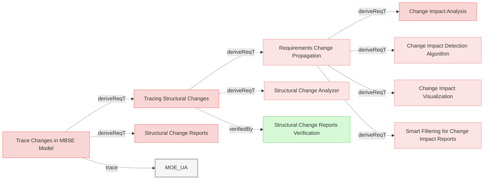
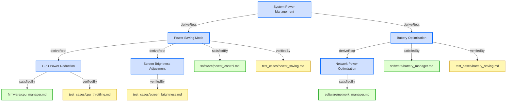
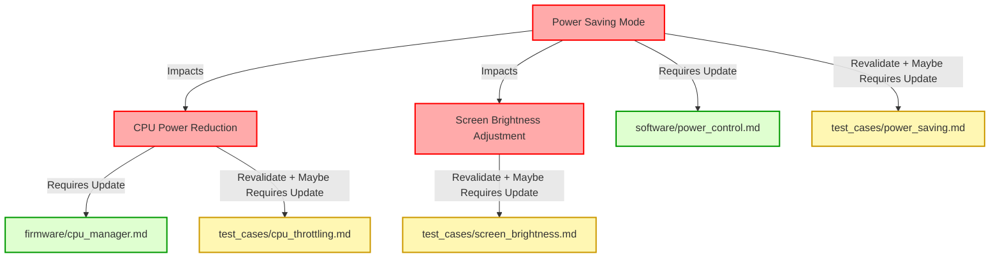

# Trace Changes

## Requirements

### Tracing Structural Changes

When tracing structural changes, the system shall analyze the MBSE model and diffs to identify affected components and generate a report of impacted elements and structures, so that the user can review the changes and decide on further actions.

#### Metadata
  * type: user-requirement

#### Relations
  * derivedFrom: [Trace Changes in MBSE Model](UserStories.md#trace-changes-in-mbse-model)
---

### Requirements Change Propagation

When a requirement is changed, the system shall propagate the change through related requirements, verification artifacts, and design elements according to relation type definitions and propagation rules.

#### Details
<details>
<summary>View Full Specification</summary>


## Change Impact Propagation in Requirements

Requirements are interconnected through relations, and changes to a requirement may affect related requirements, verification methods, design specifications, or software components.

Changes propagate based on the relation type, which determines the impact direction and scope.

Changes to high-level requirements cascade down to implementation.
Verification artifacts must be marked for revalidation to reflect changes.
Automated tools should flag all impacted requirements for review.

### Relation Categories for Change Propagation

For change propagation purposes, relations can be categorized into several groups:

1. **Hierarchical Relations** - Changes propagate from parent to child elements (derivedFrom)
2. **Satisfaction Relations** - Changes to requirements affect implementations (satisfiedBy)
3. **Verification Relations** - Changes to requirements invalidate verifications (verifiedBy)
4. **Traceability Relations** - No change propagation, for documentation only (trace)

---


## Change Propagation Mechanism

When a requirement changes, impact analysis must be conducted based on its relations. The following mechanism ensures traceability and controlled updates.

- Identify Impacted Relations
  - When a requirement is modified, check its Relations subsection to identify linked elements.
- Determine Change Propagation Scope
  - Apply the rules in Relation Types and Change Propagation Rules to assess whether the change affects child requirements, design artifacts, verification, or other linked documents.
- Invalidate Affected Elements
  - If a related element is impacted, flag it for review.  
  - Example: If a requirement verified by a test changes, the test must be reviewed.
- Require Re-validation or Re-design
  - If changes affect satisfaction (e.g., code or architecture), update the relevant design.  
  - If changes affect verification, update test cases or validation documents.
- If a change results in a requirement being merged, split, or removed, update its Relations to maintain traceability.

## Examples of Change Propagation


### Parent-Child Requirement Change

```markdown

---

### Parent Requirement
This requirement defines a high-level system constraint.

#### Relations
  * derive: [Child Requirement](#child-requirement)


---

### Child Requirement
This requirement defines additional functionality.

```

If Parent Requirement changes, Child Requirement must be reviewed and updated.


---

### Requirement Satisfied by a Design Specification

```markdown

---

### Functional Requirement

The system shall process transactions within 500ms.

#### Relations
  * satisfiedBy: [architecture/system_design.md/Performance Constraints](architecture/system_design.md#performance-constraints)
```

If Functional Requirement changes, Performance Constraints in the architecture document must be updated.


---

### Requirement Verified by a Test

```

---

### Safety Requirement

The system shall shut down if temperature exceeds 100°C.

#### Relations
  * verifiedBy: [test_cases/safety_verification.md/Overheat Shutdown Test](test_cases/safety_verification.md#overheat-shutdown-test)

```

If Safety Requirement changes, the Overheat Shutdown Test must be reviewed for update and executed again for verification.


---

### Example of Multi-Level Change Propagation in Requirements

The following analysis explains how a **change in the requirement**  propagates through multiple levels of related requirements, impacting their definitions, design artifacts, and verification processes.

---

```
### Root Requirement: System Power Management

The system shall implement power-saving mechanisms to optimize battery usage.  

---

### Power Saving Mode

The system shall activate power-saving mode when the battery level drops below 20%.  

#### Relations
  * deriveFrom: [System Power Management](#system-power-management)
  * satisfiedBy: [software/power_control.md](software/power_control.md)
  * verifiedBy: [test_cases/power_saving.md](test_cases/power_saving.md)

---

### CPU Power Reduction

The system shall reduce CPU frequency by 30% in power-saving mode.  

#### Relations
  * deriveFrom: [Power Saving Mode](#power-saving-mode)
  * satisfiedBy: [firmware/cpu_manager.md](firmware/cpu_manager.md)
  * verifiedBy: [test_cases/cpu_throttling.md](test_cases/cpu_throttling.md)

---

### Screen Brightness Adjustment

The system shall reduce screen brightness by 40% in power-saving mode.  

#### Relations
  * deriveFrom: [Power Saving Mode](#power-saving-mode)
  * verifiedBy: [test_cases/screen_brightness.md](test_cases/screen_brightness.md)

---

### Battery Optimization

The system shall disable non-essential background services when battery levels drop below 15%.  

#### Relations
  * deriveFrom: [System Power Management](#system-power-management)
  * satisfiedBy: [software/battery_manager.md](software/battery_manager.md)
  * verifiedBy: [test_cases/battery_saving.md](test_cases/battery_saving.md)

---

### Network Power Optimization
The system shall reduce network polling frequency when battery levels drop below 15%.  

#### Relations
  * deriveFrom: [Battery Optimization](#battery-optimization)
  * satisfiedBy: [software/network_manager.md](software/network_manager.md)
```

**Power Saving Mode** requirment has been changed to:
>The system shall activate power-saving mode when the battery level drops below 30%.


Change Propagation Flow:
1. A **change** in **Power Saving Mode** flows **downward** to **CPU Power Reduction**.
2. A **change** in **Power Saving Mode** flows **downward** to **Screen Brightness Adjustment**.
3. Additionally, all **satisfiedBy** and **verifiedBy** relations from affected requirements must be reviewed:
   - **Power Saving Mode** → **software/power_control.md** (implementation) & **test_cases/power_saving.md** (verification).  
   - **CPU Power Reduction** → **firmware/cpu_manager.md** (implementation) & **test_cases/cpu_throttling.md** (verification).  
   - **Screen Brightness Adjustment** → **[test_cases/screen_brightness.md** (verification).  


Mermaid diagram showing relations:


Legend:
- **🟦 Requirements (Blue)** → Directly from your provided requirements.  
- **🟩 Implementations (Green)** → Only **satisfiedBy** links
- **🟨 Verifications (Yellow)** → Only **verifiedBy** links

Change propagation flow diagram:


</details>

#### Relations
  * derivedFrom: [Tracing Structural Changes](#tracing-structural-changes)
---