# Traceability Matrix

This matrix shows the relationships between elements in the model.

## Summary

- Total elements: 83
- Relations by type:
  - verifiedBy: 1
  - satisfiedBy: 1
  - containedBy: 7
  - derivedFrom: 6
  - tracedFrom: 13
  - refine: 40

## verifiedBy Relations

|Source Element|Target Element|
|-------------|-------------|
|[Handle Affected Verifications on Model Changes](UserRequirements.html#handle-affected-verifications-on-model-changes)|[README.md/Not Implemented Yet](README.html#not-implemented-yet)|

## verify Relations

|Source Element|Target Element|
|-------------|-------------|
|No relations found||

## satisfiedBy Relations

|Source Element|Target Element|
|-------------|-------------|
|[Specification Design Document for Requirements Change Propagation](UserRequirements.html#specification-design-document-for-requirements-change-propagation)|[DesignSpecifications/RequirementsChangePropagation.md](DesignSpecifications/RequirementsChangePropagation.html)|

## satisfy Relations

|Source Element|Target Element|
|-------------|-------------|
|No relations found||

## derivedFrom Relations

|Source Element|Target Element|
|-------------|-------------|
|[Support for Distributed Requirements](UserRequirements.html#support-for-distributed-requirements)|Project Configuration with YAML|
|[Configurable SystemRequirements Folder Name](UserRequirements.html#configurable-systemrequirements-folder-name)|Project Configuration with YAML|
|[AI Feedback on Structural Changes](UserRequirements.html#ai-feedback-on-structural-changes)|Suggest Structural Updates|
|[Configurable DesignSpecifications Folder Name](UserRequirements.html#configurable-designspecifications-folder-name)|Project Configuration with YAML|
|[Promote Automation and Efficiency](MissionRequirements.html#promote-automation-and-efficiency)|[MOEs.md/MOE_UA](MOEs.html#moe_ua)|
|[Align with Industry Standards](MissionRequirements.html#align-with-industry-standards)|[MOEs.md/MOE_CE](MOEs.html#moe_ce)|

## derive Relations

|Source Element|Target Element|
|-------------|-------------|
|No relations found||

## refine Relations

|Source Element|Target Element|
|-------------|-------------|
|[Enhanced Validation Error Reporting](UserRequirements.html#enhanced-validation-error-reporting)|[UserStories.md/Validating Structures](UserStories.html#validating-structures)|
|[Visualize Model Relationships](UserRequirements.html#visualize-model-relationships)|[UserStories.md/Generate Diagrams](UserStories.html#generate-diagrams)|
|[Recommend Missing Components](UserRequirements.html#recommend-missing-components)|[UserStories.md/AI-Driven Model Suggestions](UserStories.html#ai-driven-model-suggestions)|
|[Validate Filesystem Structure](UserRequirements.html#validate-filesystem-structure)|[UserStories.md/Validating Structures](UserStories.html#validating-structures)|
|[Suggest Structural Updates](UserRequirements.html#suggest-structural-updates)|[UserStories.md/Trace Changes in MBSE Model](UserStories.html#trace-changes-in-mbse-model)|
|[Highlight Changes in Diagrams](UserRequirements.html#highlight-changes-in-diagrams)|[UserStories.md/Generate Diagrams](UserStories.html#generate-diagrams)|
|[Trace Code to MBSE Model](UserRequirements.html#trace-code-to-mbse-model)|[UserStories.md/Aligning Design with Code](UserStories.html#aligning-design-with-code)|
|[Linting Command Output](UserRequirements.html#linting-command-output)|Linting Command Behavior|
|[Generate Relationship Reports](UserRequirements.html#generate-relationship-reports)|[UserStories.md/Provide Reports](UserStories.html#provide-reports)|
|[Validate Cross-Component Dependencies](UserRequirements.html#validate-cross-component-dependencies)|[UserStories.md/Validating Structures](UserStories.html#validating-structures)|
|[Suggest Refactoring for MBSE Consistency  ---> Needs more work](UserRequirements.html#suggest-refactoring-for-mbse-consistency----->-needs-more-work)|[UserStories.md/AI-Driven Code Suggestions](UserStories.html#ai-driven-code-suggestions)|
|[Support CI/CD Integration](UserRequirements.html#support-ci/cd-integration)|[UserStories.md/Automate Traceability Matrix](UserStories.html#automate-traceability-matrix)|
|[Suggest Refinements to Model Relationships](UserRequirements.html#suggest-refinements-to-model-relationships)|[UserStories.md/AI-Driven Model Suggestions](UserStories.html#ai-driven-model-suggestions)|
|[Include Verification Checkboxes](UserRequirements.html#include-verification-checkboxes)|[UserStories.md/Generate Traceability Matrix](UserStories.html#generate-traceability-matrix)|
|[Propose Validation Fixes](UserRequirements.html#propose-validation-fixes)|[UserStories.md/AI-Driven Model Suggestions](UserStories.html#ai-driven-model-suggestions)|
|[Generate Dependency Reports](UserRequirements.html#generate-dependency-reports)|[UserStories.md/Provide Reports](UserStories.html#provide-reports)|
|[Generate Structural Change Reports](UserRequirements.html#generate-structural-change-reports)|[UserStories.md/Provide Reports](UserStories.html#provide-reports)|
|[Handle Affected Verifications on Model Changes](UserRequirements.html#handle-affected-verifications-on-model-changes)|[UserStories.md/Generate Traceability Matrix](UserStories.html#generate-traceability-matrix)|
|[Export Traceability Matrix](UserRequirements.html#export-traceability-matrix)|[UserStories.md/Generate Traceability Matrix](UserStories.html#generate-traceability-matrix)|
|[Filter Relationships by Type](UserRequirements.html#filter-relationships-by-type)|[UserStories.md/Generate Diagrams](UserStories.html#generate-diagrams)|
|[Suggest Code Refactoring](UserRequirements.html#suggest-code-refactoring)|[UserStories.md/Aligning Design with Code](UserStories.html#aligning-design-with-code)|
|[Store Automated Diagrams in Designated Locations](UserRequirements.html#store-automated-diagrams-in-designated-locations)|[UserStories.md/Automate Diagram Generation](UserStories.html#automate-diagram-generation)|
|[Automate Pull Request Validations](UserRequirements.html#automate-pull-request-validations)|[UserStories.md/Integrate with GitHub Workflows](UserStories.html#integrate-with-github-workflows)|
|[Highlight Potential Code-Model Conflicts --> also too advanced for now](UserRequirements.html#highlight-potential-code-model-conflicts--->-also-too-advanced-for-now)|[UserStories.md/AI-Driven Code Suggestions](UserStories.html#ai-driven-code-suggestions)|
|[Provide Validation Reports](UserRequirements.html#provide-validation-reports)|[UserStories.md/Provide Reports](UserStories.html#provide-reports)|
|[Generate Verifications Reports](UserRequirements.html#generate-verifications-reports)|[UserStories.md/Provide Reports](UserStories.html#provide-reports)|
|[Export Reports to Standard Formats](UserRequirements.html#export-reports-to-standard-formats)|[UserStories.md/Provide Reports](UserStories.html#provide-reports)|
|[Generate Summary Reports](UserRequirements.html#generate-summary-reports)|[UserStories.md/Provide Reports](UserStories.html#provide-reports)|
|[Bootstrap model struture](UserRequirements.html#bootstrap-model-struture)|[UserStories.md/Managing MBSE Models](UserStories.html#managing-mbse-models)|
|[Select Custom Diagram Viewpoints](UserRequirements.html#select-custom-diagram-viewpoints)|[UserStories.md/Generate Diagrams](UserStories.html#generate-diagrams)|
|[Specification Design Document for Requirements Change Propagation](UserRequirements.html#specification-design-document-for-requirements-change-propagation)|[UserStories.md/Handle Affected Verifications on Model Changes](UserStories.html#handle-affected-verifications-on-model-changes)|
|[Tracing Structural Changes](UserRequirements.html#tracing-structural-changes)|[UserStories.md/Trace Changes in MBSE Model](UserStories.html#trace-changes-in-mbse-model)|
|[Generate Change Logs for Pull Requests](UserRequirements.html#generate-change-logs-for-pull-requests)|[UserStories.md/Integrate with GitHub Workflows](UserStories.html#integrate-with-github-workflows)|
|[Validate Internal Consistency](UserRequirements.html#validate-internal-consistency)|[UserStories.md/Validating Structures](UserStories.html#validating-structures)|
|[Project Configuration with YAML](UserRequirements.html#project-configuration-with-yaml)|[UserStories.md/Managing MBSE Models](UserStories.html#managing-mbse-models)|
|[Export Diagrams in Standard Formats](UserRequirements.html#export-diagrams-in-standard-formats)|[UserStories.md/Generate Diagrams](UserStories.html#generate-diagrams)|
|[Create Traceability Matrices](UserRequirements.html#create-traceability-matrices)|[UserStories.md/Generate Traceability Matrix](UserStories.html#generate-traceability-matrix)|
|[Model Linting](UserRequirements.html#model-linting)|[UserStories.md/Validating Structures](UserStories.html#validating-structures)|
|[Analyze Code for Alignment ---> Needs more work](UserRequirements.html#analyze-code-for-alignment---->-needs-more-work)|[UserStories.md/AI-Driven Code Suggestions](UserStories.html#ai-driven-code-suggestions)|
|[Validate Markdown Structure](UserRequirements.html#validate-markdown-structure)|[UserStories.md/Validating Structures](UserStories.html#validating-structures)|

## tracedFrom Relations

|Source Element|Target Element|
|-------------|-------------|
|[Aligning Design with Code](UserStories.html#aligning-design-with-code)|[MOEs.md/MOE_UA](MOEs.html#moe_ua)|
|[Generate Diagrams](UserStories.html#generate-diagrams)|[MOEs.md/MOE_UA](MOEs.html#moe_ua)|
|[Automate Diagram Generation](UserStories.html#automate-diagram-generation)|[MOEs.md/MOE_UA](MOEs.html#moe_ua)|
|[Generating Visual Representations](UserStories.html#generating-visual-representations)|[MOEs.md/MOE_UA](MOEs.html#moe_ua)|
|[AI-Driven Code Suggestions](UserStories.html#ai-driven-code-suggestions)|[MOEs.md/MOE_UA](MOEs.html#moe_ua)|
|[Integrate with GitHub Workflows](UserStories.html#integrate-with-github-workflows)|[MOEs.md/MOE_CE](MOEs.html#moe_ce)|
|[Generate Traceability Matrix](UserStories.html#generate-traceability-matrix)|[MOEs.md/MOE_UA](MOEs.html#moe_ua)|
|[Trace Changes in MBSE Model](UserStories.html#trace-changes-in-mbse-model)|[MOEs.md/MOE_UA](MOEs.html#moe_ua)|
|[AI-Driven Model Suggestions](UserStories.html#ai-driven-model-suggestions)|[MOEs.md/MOE_UA](MOEs.html#moe_ua)|
|[Fostering Community Contributions](UserStories.html#fostering-community-contributions)|[MOEs.md/MOE_CE](MOEs.html#moe_ce)|
|[Managing MBSE Models](UserStories.html#managing-mbse-models)|[MOEs.md/MOE_UA](MOEs.html#moe_ua)|
|[Validating Structures](UserStories.html#validating-structures)|[MOEs.md/MOE_UA](MOEs.html#moe_ua)|
|[Provide Reports](UserStories.html#provide-reports)|[MOEs.md/MOE_CE](MOEs.html#moe_ce)|

## trace Relations

|Source Element|Target Element|
|-------------|-------------|
|No relations found||

## containedBy Relations

|Source Element|Target Element|
|-------------|-------------|
|[Linting Command Behavior](UserRequirements.html#linting-command-behavior)|Model Linting|
|[Interactive Mermaid Diagrams](UserRequirements.html#interactive-mermaid-diagrams)|Create Traceability Matrices|
|[Support Relation-Based Views](UserRequirements.html#support-relation-based-views)|Create Traceability Matrices|
|[Save matrices to designated files](UserRequirements.html#save-matrices-to-designated-files)|Create Traceability Matrices|
|[Format Consistency Enforcement](UserRequirements.html#format-consistency-enforcement)|Model Linting|
|[Replace Absolute Links with Relative Links](UserRequirements.html#replace-absolute-links-with-relative-links)|Model Linting|
|[Markdown-Based Default Format](UserRequirements.html#markdown-based-default-format)|Create Traceability Matrices|

## contain Relations

|Source Element|Target Element|
|-------------|-------------|
|No relations found||

## Requirements Relationship Diagrams

These diagrams show the relationships between requirements organized by file and section.

* Red nodes: Requirements
* Yellow nodes: Elements that satisfy requirements
* Green nodes: Verification elements
* Light blue nodes: Links to other sections/files

### Diagram for MissionRequirements.md - Requirements

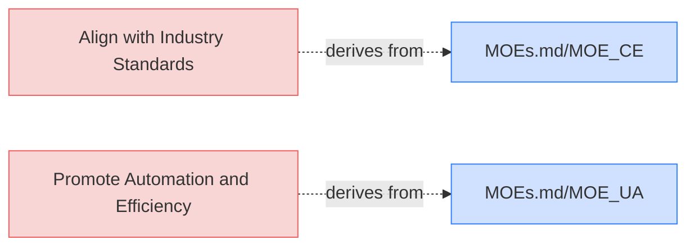

### Diagram for UserRequirements.md - Managing MBSE Models

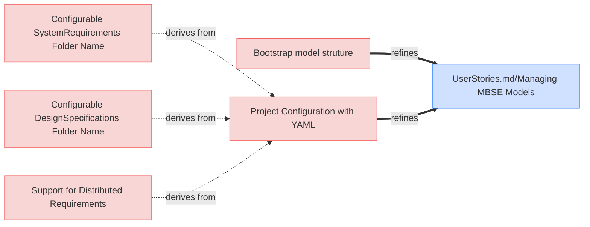

### Diagram for UserRequirements.md - Generate Diagrams

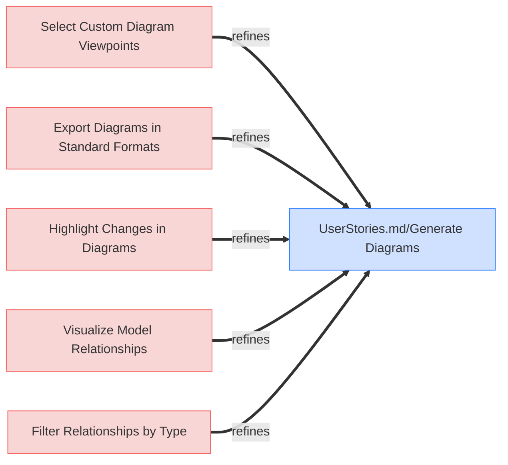

### Diagram for UserRequirements.md - Generate Traceability Matrix			

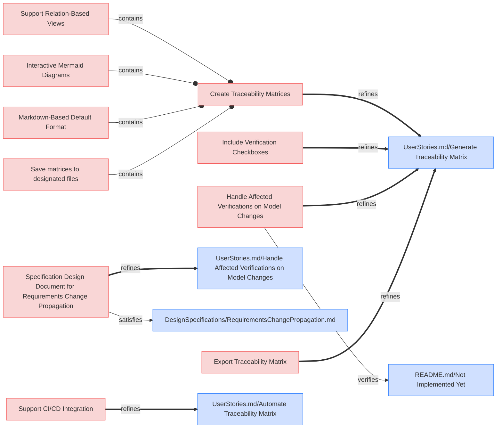

### Diagram for UserRequirements.md - Provide Reports

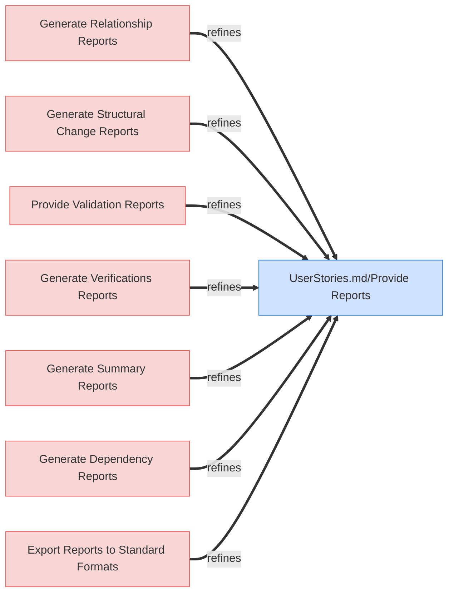

### Diagram for UserRequirements.md - Trace Changes in MBSE Model

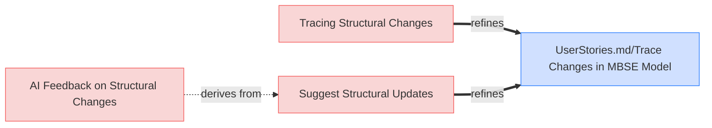

### Diagram for UserRequirements.md - Grouping Title: AI-Driven Code Suggestions

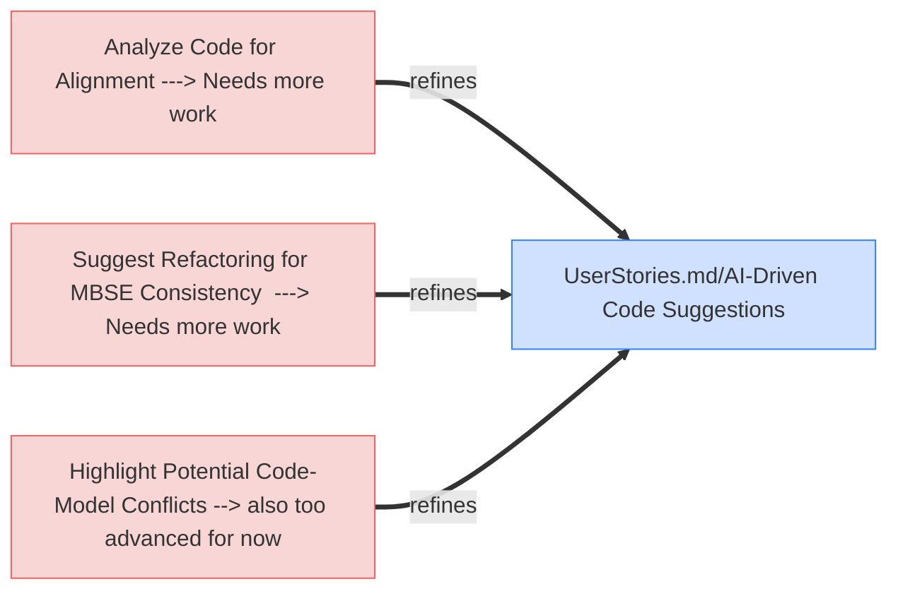

### Diagram for UserStories.md - User Stories

```mermaid
graph LR;
  %% Graph styling
  classDef requirement fill:#f9d6d6,stroke:#f55f5f,stroke-width:1px;
  classDef satisfies fill:#fff2cc,stroke:#ffcc00,stroke-width:1px;
  classDef verification fill:#d6f9d6,stroke:#5fd75f,stroke-width:1px;
  classDef externalLink fill:#d0e0ff,stroke:#3080ff,stroke-width:1px;
  classDef default fill:#f5f5f5,stroke:#333333,stroke-width:1px;

  Managing_MBSE_Models["Managing MBSE Models"];
  click Managing_MBSE_Models "UserStories.html#managing-mbse-models";
  class Managing_MBSE_Models requirement;
  Managing_MBSE_Models ~~~>|traces from| MOEs_md_MOE_UA;
  MOEs_md_MOE_UA["MOEs.md/MOE_UA"];
  click MOEs_md_MOE_UA "MOEs.html#moe_ua";
  class MOEs_md_MOE_UA externalLink;
  Generate_Diagrams["Generate Diagrams"];
  click Generate_Diagrams "UserStories.html#generate-diagrams";
  class Generate_Diagrams requirement;
  Generate_Diagrams ~~~>|traces from| MOEs_md_MOE_UA;
  Automate_Diagram_Generation["Automate Diagram Generation"];
  click Automate_Diagram_Generation "UserStories.html#automate-diagram-generation";
  class Automate_Diagram_Generation requirement;
  Automate_Diagram_Generation ~~~>|traces from| MOEs_md_MOE_UA;
  Generating_Visual_Representations["Generating Visual Representations"];
  click Generating_Visual_Representations "UserStories.html#generating-visual-representations";
  class Generating_Visual_Representations requirement;
  Generating_Visual_Representations ~~~>|traces from| MOEs_md_MOE_UA;
  Aligning_Design_with_Code["Aligning Design with Code"];
  click Aligning_Design_with_Code "UserStories.html#aligning-design-with-code";
  class Aligning_Design_with_Code requirement;
  Aligning_Design_with_Code ~~~>|traces from| MOEs_md_MOE_UA;
  Validating_Structures["Validating Structures"];
  click Validating_Structures "UserStories.html#validating-structures";
  class Validating_Structures requirement;
  Validating_Structures ~~~>|traces from| MOEs_md_MOE_UA;
  Integrate_with_GitHub_Workflows["Integrate with GitHub Workflows"];
  click Integrate_with_GitHub_Workflows "UserStories.html#integrate-with-github-workflows";
  class Integrate_with_GitHub_Workflows requirement;
  Integrate_with_GitHub_Workflows ~~~>|traces from| MOEs_md_MOE_CE;
  MOEs_md_MOE_CE["MOEs.md/MOE_CE"];
  click MOEs_md_MOE_CE "MOEs.html#moe_ce";
  class MOEs_md_MOE_CE externalLink;
  AI_Driven_Code_Suggestions["AI-Driven Code Suggestions"];
  click AI_Driven_Code_Suggestions "UserStories.html#ai-driven-code-suggestions";
  class AI_Driven_Code_Suggestions requirement;
  AI_Driven_Code_Suggestions ~~~>|traces from| MOEs_md_MOE_UA;
  AI_Driven_Model_Suggestions["AI-Driven Model Suggestions"];
  click AI_Driven_Model_Suggestions "UserStories.html#ai-driven-model-suggestions";
  class AI_Driven_Model_Suggestions requirement;
  AI_Driven_Model_Suggestions ~~~>|traces from| MOEs_md_MOE_UA;
  Provide_Reports["Provide Reports"];
  click Provide_Reports "UserStories.html#provide-reports";
  class Provide_Reports requirement;
  Provide_Reports ~~~>|traces from| MOEs_md_MOE_CE;
  Trace_Changes_in_MBSE_Model["Trace Changes in MBSE Model"];
  click Trace_Changes_in_MBSE_Model "UserStories.html#trace-changes-in-mbse-model";
  class Trace_Changes_in_MBSE_Model requirement;
  Trace_Changes_in_MBSE_Model ~~~>|traces from| MOEs_md_MOE_UA;
  Generate_Traceability_Matrix["Generate Traceability Matrix"];
  click Generate_Traceability_Matrix "UserStories.html#generate-traceability-matrix";
  class Generate_Traceability_Matrix requirement;
  Generate_Traceability_Matrix ~~~>|traces from| MOEs_md_MOE_UA;
  Fostering_Community_Contributions["Fostering Community Contributions"];
  click Fostering_Community_Contributions "UserStories.html#fostering-community-contributions";
  class Fostering_Community_Contributions requirement;
  Fostering_Community_Contributions ~~~>|traces from| MOEs_md_MOE_CE;
```

### Diagram for UserRequirements.md - AI-Driven Model Suggestions

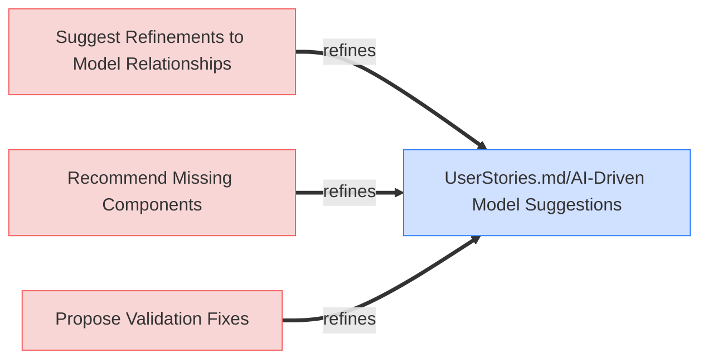

### Diagram for UserRequirements.md - Aligning Design with Code

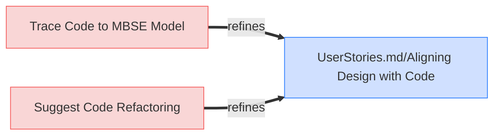

### Diagram for UserRequirements.md - Integrate with GitHub Workflows

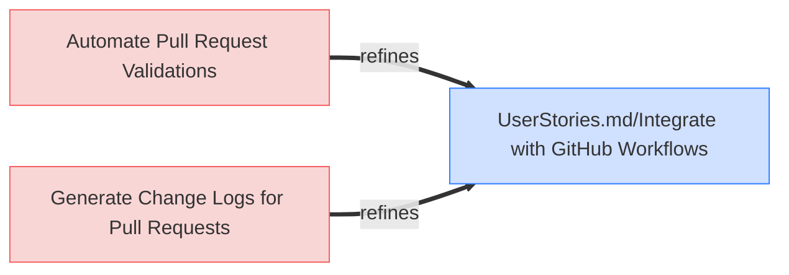

### Diagram for UserRequirements.md - Validating Structures

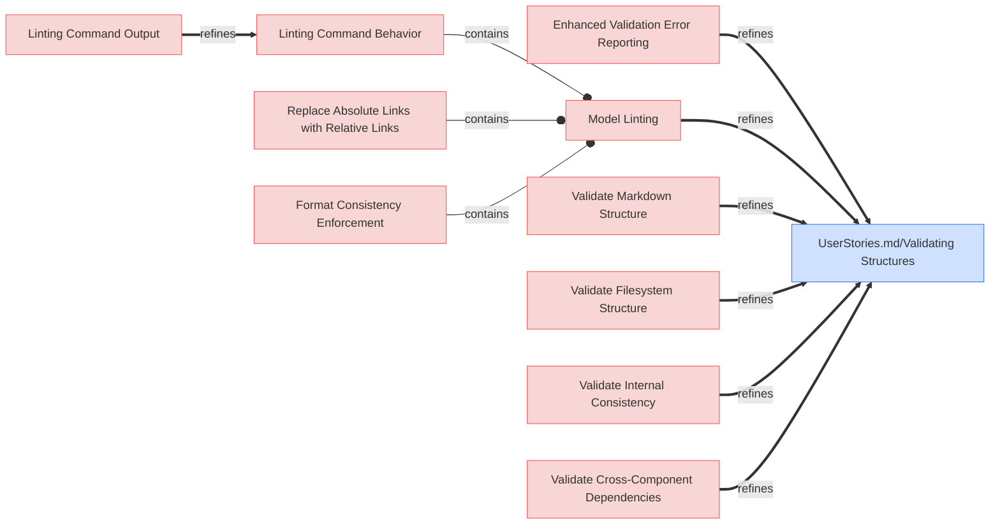

### Diagram for UserRequirements.md - Automate Diagram Generation

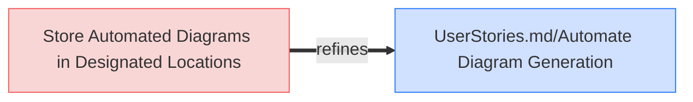

