# ReqFlow use case

## Use Case Diagram

The use case diagram below highlights the primary interactions between the ReqFlow Tool and its users, including developers, CI/CD systems, and other actors. It captures the high-level functional behaviors that the tool is designed to support, from managing requirements to automating tasks in Git workflows.

```mermaid
flowchart LR
    subgraph "ReqFlowTool"
        subgraph "Cli"
            manageModel((Manage MBSE Model))
            generateDiagrams((Generate Diagrams))
            analiseRelations((Analyze Relations))
            reports[Provide Reports]
            validateStructure((Validate Structure))			
            filesStructure[Filesystem Structure]
            markdownSucture[Markdown Structure]
            traceability((Generate Traceability Matrix))
            handleDiffs((Trace Changes))        
        end  

        subgraph "ChatOps"
            aiAgents((Provide AI Agents🤖))
            aiSuggestions((Suggestions)) 
            reviewSuggestions((Review Suggestions))                
            applySuggestions((Apply Approved Suggestions))                
        end
                 
    end

    human[Human👤]
    human -. build .-> model
    human -. develop .-> developedSystem

    subgraph "External Systems"
        ciSystem[CI/CD System]
        subgraph "GitHubOrSimilar"
            hostedGitRepository[hosted Git Repository]
        end
    end

    subgraph "System of Interest: SOI"
        model[MBSE Model]
        developedSystem["Developed System"]
        subgraph "Git Repository<br>monorepo or multirepo"
            gitRepository[Git Repository]
        end

    end

    %% Human Interactions
    human -. use CLI to .-> manageModel

    human -. colaborate via .-> GitHubOrSimilar

    ReqFlowTool -. read/write/get diffs .-> gitRepository
    aiAgents -. PRs/issues/comment > colaborate via .-> GitHubOrSimilar
 
    manageModel -. provide .-> validateStructure
    validateStructure -. include .-> markdownSucture
    validateStructure -. include .-> filesStructure  
    validateStructure -. include .-> reports    

    manageModel -. provide .-> traceability
    manageModel -. provide .-> analiseRelations
    analiseRelations -. include .-> reports      
    manageModel -. provide .-> generateDiagrams
    manageModel -. provide .-> handleDiffs

    human -. interact via ChatOps .-> aiAgents    
    aiAgents -. interact with via functions .-> manageModel    

    aiAgents -. assist in development .-> developedSystem
    aiAgents -. commit code changes .-> gitRepository

    aiAgents -. assist .-> human
    aiAgents -. provide .-> aiSuggestions
    aiSuggestions -. with human in loop .-> reviewSuggestions
    reviewSuggestions -. approval required .-> applySuggestions
    applySuggestions -. commit into.-> gitRepository    


    %% CI/CD and Git Systems
    ciSystem -. trigger .-> validateStructure
    ciSystem -. trigger .-> generateDiagrams
    ciSystem -. trigger .-> traceability
    ciSystem -. fail merges if invalid .-> GitHubOrSimilar
    GitHubOrSimilar <-. sync .-> gitRepository

    %% Relationships with SOI
    model -- stored & versioned in --> gitRepository
    developedSystem -- stored & versioned in --> gitRepository
    developedSystem <-- implemented from --> model
    model -- guides development of --> developedSystem

    %% ReqFlow Interactions with SOI
    handleDiffs -. include .-> reports    

    %% SOI Feedback Loop
    developedSystem -. feedback .-> model



```

### ReqFlow Tool

The central component of the system, which facilitates various MBSE-related activities. It consists of two primary submodules:

#### Cli (Command Line Interface)
- Manage MBSE Model: Core functionality to handle the MBSE model lifecycle.
- Generate Diagrams: Allows users to generate visual representations of the system model.
 - Diagrams can be generated for different viewpoints.
- Analyze Relations: Provides tools to analyze relationships and dependencies within the model.
- Provide Reports: Generates structured reports based on the model and analysis.
- Validate Structure: Ensures the model adheres to defined structure and guidelines:
  - Markdown Structure: Verifies the correctness of the Markdown-based requirements and documentation.
  - Filesystem Structure: Validates the file organization in the project.
- Generate Traceability Matrix: Produces matrices to link requirements to related elements.
- Trace Changes
  - Tracks changes and display/visualize affected elements based on relations.
  - Tracks elements such as verifications, that may require invalidation based on detected changes. 
  - This ensures that all affected components are flagged for review or updates.

#### ChatOps
- **AI Agents 🤖**: Provides intelligent assistance for model management and collaboration.
 - It is deeply embed into ReqFlow methodology model and have a knowledge required for deep assistance.
- Suggestions: Offers AI-generated recommendations or improvements.
- Review Suggestions: Enables human review and approval of AI-generated suggestions.
 - With human in the loop workflow.
- Apply Approved Suggestions: Commits approved changes to the model.

### AI Agents in Development

ReqFlow's **AI Agents 🤖** are uniquely equipped with deep knowledge of the ReqFlow methodology and structure. 
This enables them to follow and adhere to ReqFlow's AI-ready MBSE processes while developing code and performing other development tasks. 
Their development activities are fully aligned with the methodology, ensuring that all changes are consistent with the structured requirements and system models.

They can also work on the **Developed System**, performing tasks similar to human developers.
Key capabilities include:
- Process-Driven Development: AI Agents are guided by ReqFlow's MBSE methodology, ensuring that all code development follows established processes and adheres to the structured requirements and traceability model.
- Code Changes: AI Agents can suggest and implement changes directly in the codebase, ensuring alignment with the MBSE model and specifications.
- Automated Commitments: AI Agents can commit approved code changes directly to the Git repository, following project workflows and standards.
- Development Assistance: AI Agents provide context-aware assistance to human developers, including debugging, refactoring, and optimization.

### System of Interest (SOI)

The **System of Interest (SOI)** refers to the system which is under development.
 
It represents the primary focus of development and includes the following key elements:
- MBSE Model: The structured system specification and design documentation created and managed using ReqFlow. 
  - This model defines the requirements, architecture, and traceability necessary for developing the SOI.
- Developed System: The actual physical or implemented system that is built based on the MBSE model. 
  - It embodies the realization of the design and requirements outlined in the model.
- Git Repository: A storage and version control system where the MBSE model and the developed system artifacts are stored.
  - This repository can be organized as a monorepo or a multirepo, depending on the project’s needs.

The SOI serves as the centerpiece of the ReqFlow framework, linking specifications, development, and validation processes.

### External Systems

ReqFlow interacts with external systems to enhance functionality and support development workflows.

### CI/CD System

ReqFlow provides tools and features that CI/CD systems, such as GitHub Actions, can utilize to perform tasks like validation, diagram generation, and traceability matrix creation. 

These tools enable CI/CD systems to enforce PR merge rules, validate changes, and automate feedback processes, such as adding comments, creating issues, or reporting statuses. 

### GitHub or Similar

ReqFlow integrates into existing agile and collaborative workflows by providing the necessary tools and scripts to support version control, change management, and traceability. 
These features allow teams to seamlessly integrate MBSE practices into their development processes, enabling effective collaboration through GitHub or similar platforms.

### Human Interaction

Humans interact with ReqFlow tools to manage, refine, and validate MBSE models, as well as to collaborate effectively within development workflows:
- Via CLI: Users leverage ReqFlow’s CLI to perform tasks such as managing models, generating diagrams, analyzing relationships, and validating structures.
- Via ChatOps: Users interact with AI agents through chat-based tools to receive intelligent suggestions, review potential improvements, and approve changes, ensuring a human-in-the-loop approach.
- Collaboration: Users integrate ReqFlow into agile workflows by collaborating through GitHub or similar platforms to manage repositories, track changes, and maintain traceability.

## Workflows and Interactions

### ReqFlow Interactions with Git

- ReqFlow uses Git repositories to store and version the MBSE model and developed system.
- Changes, including approved AI suggestions, are prepared and committed through standard Git workflows.

### CI/CD Integration
- CI/CD pipelines trigger validation, diagram generation, and traceability processes.
- Invalid merges are prevented based on the validation results.

### SOI Feedback Loop
- The Developed System provides feedback to the MBSE Model, enabling iterative refinement.
- The model guides the development of the system, ensuring alignment with requirements and objectives.

## Key Relationships

- The MBSE Model is implemented into the Developed System, which is stored and versioned in the Git repository.
- The ReqFlow CLI provides tools to validate, analyze, and generate artifacts from the model.
- AI Agents assist humans by generating suggestions and automating repetitive tasks.
- The **CI/CD System** ensures quality control and prevents invalid changes from being merged.
