# Usecase diagrams

## ReqFlow usecase

## ReqFlow Tool Use Case Diagram

The use case diagram below highlights the primary interactions between the ReqFlow Tool and its users, including developers, CI/CD systems, and other actors. It captures the high-level functional behaviors that the tool is designed to support, from managing requirements to automating tasks in Git workflows.

```mermaid
flowchart LR
    subgraph "ReqFlowTool"
        subgraph "Cli"
            manageModel((Manage MBSE Model))
            generateDiagrams((Generate Diagrams))
            analiseRelations((Analyze Relations))
            reports[Provide Reports]
            validateStructure((Validate Structure))			
            filesStructure[Filesystem Structure]
            markdownSucture[Markdown Structure]
            traceability((Generate Traceability Matrix))
            handleDiffs((Trace Changes))        
        end  

        subgraph "ChatOps"
            aiAgents((Provide AI Agents🤖))
            aiSuggestions((Suggestions)) 
            reviewSuggestions((Review Suggestions))                
            applySuggestions((Apply Approved Suggestions))                
        end
                 
    end

    human[Human👤]
    human -. build .-> model
    human -. develop .-> developedSystem

    subgraph "External Systems"
        ciSystem[CI/CD System]
        gitTools[GitHub/GitLab/etc.]
    end

    subgraph "System of Interest: SOI"
        model[MBSE Model]
        developedSystem["Developed System"]
        gitRepository[Git Repository]
    end

    %% Human Interactions
    human -. via CLI .-> manageModel

    ReqFlowTool -. read/write/get diffs .-> gitRepository
 
    manageModel -. provide .-> validateStructure
    validateStructure -. include .-> markdownSucture
    validateStructure -. include .-> filesStructure  
    validateStructure -. include .-> reports    

    manageModel -. provide .-> traceability
    manageModel -. provide .-> analiseRelations
    analiseRelations -. include .-> reports      
    manageModel -. provide .-> generateDiagrams
    manageModel -. provide .-> handleDiffs

    human -. via ChatOps .-> aiAgents    
    aiAgents -. interact with via functions .-> manageModel    

    aiAgents -. assist .-> human
    aiAgents -. provide .-> aiSuggestions
    aiSuggestions -. pending review .-> reviewSuggestions
    reviewSuggestions -. approval required .-> applySuggestions
    applySuggestions -. interact with via functions .-> manageModel    

    %% CI/CD and Git Systems
    ciSystem -. trigger .-> validateStructure
    ciSystem -. trigger .-> generateDiagrams
    ciSystem -. trigger .-> traceability
    ciSystem -. fail merges if invalid .-> gitTools
    gitTools -. manage .-> gitRepository

    %% Relationships with SOI
    model -- stored & versioned in --> gitRepository
    developedSystem -- stored & versioned in --> gitRepository
    developedSystem <-- implemented from --> model
    model -- guides development of --> developedSystem

    %% ReqFlow Interactions with SOI
    handleDiffs -. include .-> reports    

    %% SOI Feedback Loop
    developedSystem -. feedback .-> model


```

### Explanation of Use Cases

1. Generate Diagrams:
   - Automatically create diagrams, such as use case diagrams or traceability matrices, using Mermaid syntax from structured Markdown files.

2. Validate Markdown Structure:
   - Ensure that the Markdown files adhere to the defined conventions for requirements, relations, and documentation.

3. Generate Traceability Matrix:
   - Produce a matrix linking requirements to related artifacts like test cases, design specifications, and constraints.

4. Integrate with CI/CD Pipelines:
   - Use GitActions or other CI/CD tools to automate tasks such as validation, diagram generation, and traceability matrix updates.

5. Automate Requirement Checks:
   - Automatically verify the consistency of requirements, their relations, and compliance during CI/CD pipeline execution.

6. Trace Changes in Requirements:
   - Changes are traced through Git diffs, leveraging defined relationships to generate summary reports and highlight the impact of changes on downstream artifacts. 

