# User Requirements

## Managing MBSE Models

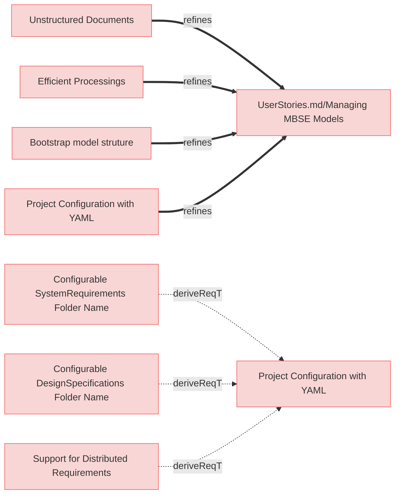

### Unstructured Documents

The system shall allow structured markdown and unstructured (eg., markdown, PDFs, DOCX, raw text) documents to coexist within the same MBSE model.

#### Relations
  * refine: [UserStories.md/Managing MBSE Models](UserStories.md#managing-mbse-models)

---

### Efficient Processings

The system shall process structured documents and relations to extract model-relevant information efficiently.

#### Relations
  * refine: [UserStories.md/Managing MBSE Models](UserStories.md#managing-mbse-models)

---

### Bootstrap model struture

The system shall provide a command to automatically bootstrap a predefined directory and file structure for an MBSE model, ensuring compliance with ReqFlow methodology.

#### Relations
  * refine: [UserStories.md/Managing MBSE Models](UserStories.md#managing-mbse-models)

---

### Project Configuration with YAML

The system shall support a YAML-based configuration file that defines folder names and structures to be used by the ReqFlow tool when processing model artifacts.

#### Relations
  * refine: [UserStories.md/Managing MBSE Models](UserStories.md#managing-mbse-models)

---

### Configurable SystemRequirements Folder Name

The system shall allow users to configure the name of the SystemRequirements folder through the configuration file, supporting flexible project organization.

#### Relations
  * derivedFrom: [Project Configuration with YAML](#project-configuration-with-yaml)

---

### Configurable DesignSpecifications Folder Name

The system shall allow users to configure the DesignSpecifications folder name through the configuration file, with this name consistently applied across all model levels.

#### Relations
  * derivedFrom: [Project Configuration with YAML](#project-configuration-with-yaml)

---

### Support for Distributed Requirements

The system shall support referencing folders that may exist in different repositories through configuration, allowing for distributed requirements management across multiple repositories.

#### Relations
  * derivedFrom: [Project Configuration with YAML](#project-configuration-with-yaml)

## Generate Diagrams

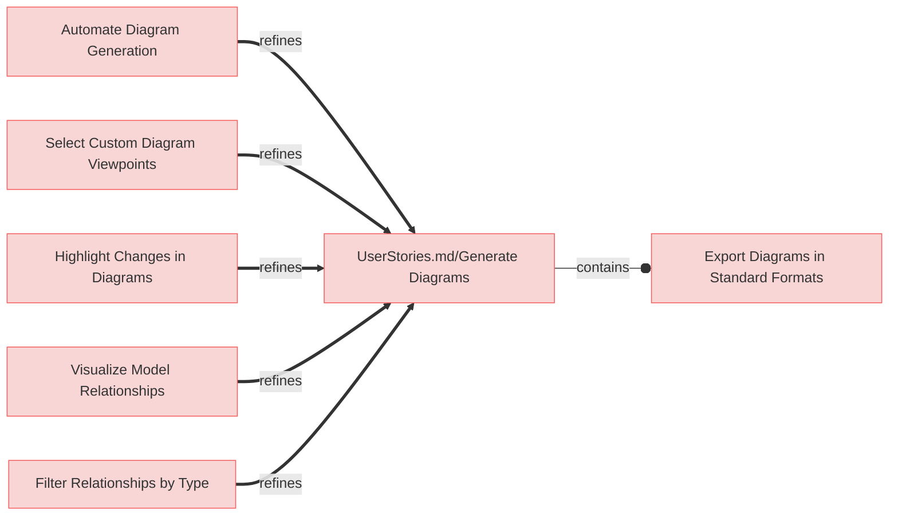

---

### Automate Diagram Generation

When requested the system shall automatically generate diagrams and save them to the required locations of the model, so that the diagrams are always accessible and up-to-date.

#### Relations
  * refine: [UserStories.md#Generate Diagrams](UserStories.md#generate-diagrams)

---

### Select Custom Diagram Viewpoints

The system shall allow users to select custom viewpoints for diagrams, tailored to specific stakeholder needs.

#### Relations
  * refine: [UserStories.md/Generate Diagrams](UserStories.md#generate-diagrams)

---

### Export Diagrams in Standard Formats

The system shall allow users to export generated diagrams in standard formats (e.g., PNG, SVG, PDF) for easy sharing and presentation.

#### Relations
  * containedBy: [UserStories.md/Generate Diagrams](UserStories.md#generate-diagrams)

---

### Highlight Changes in Diagrams

The system shall provide an option to highlight changes made to the model in the generated diagrams for better traceability.

#### Relations
  * refine: [UserStories.md/Generate Diagrams](UserStories.md#generate-diagrams)

---

### Visualize Model Relationships

The system shall provide visual representations of relationships within the MBSE model in the diagrams, enabling users to understand dependencies and their impact.

#### Relations
  * refine: [UserStories.md/Generate Diagrams](UserStories.md#generate-diagrams)

---

### Filter Relationships by Type

The system shall allow users to filter relationships in the MBSE model by type, such as dependency, refinement, or verification when generating diagrams.

#### Relations
  * refine: [UserStories.md/Generate Diagrams](UserStories.md#generate-diagrams)

## Automate Diagram Generation

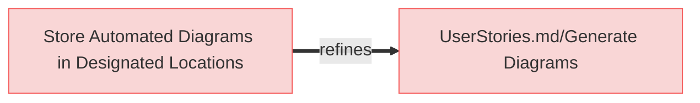

---

### Store Automated Diagrams in Designated Locations

The system shall store automatically generated diagrams in pre-configured locations in the model repository.

#### Relations
  * refine: [UserStories.md/Generate Diagrams](UserStories.md#generate-diagrams)

## Aligning Design with Code

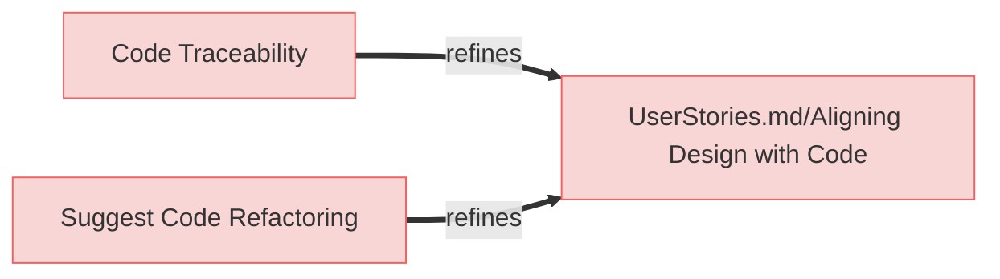

---

### Code Traceability

The system shall support code traceability by using structured comments to link code implementations to corresponding requirements in the MBSE model.

#### Relations
  * refine: [UserStories.md/Aligning Design with Code](UserStories.md#aligning-design-with-code)

---

### Suggest Code Refactoring

The system shall suggest code refactoring opportunities to better align with the structure and relationships in the MBSE model.

#### Relations
  * refine: [UserStories.md/Aligning Design with Code](UserStories.md#aligning-design-with-code)

## Validating Structures

```mermaid
graph LR;
  %% Graph styling
  classDef requirement fill:#f9d6d6,stroke:#f55f5f,stroke-width:1px;
  classDef satisfies fill:#fff2cc,stroke:#ffcc00,stroke-width:1px;
  classDef verification fill:#d6f9d6,stroke:#5fd75f,stroke-width:1px;
  classDef externalLink fill:#d0e0ff,stroke:#3080ff,stroke-width:1px;
  classDef paragraph fill:#efefef,stroke:#999999,stroke-width:1px;
  classDef default fill:#f5f5f5,stroke:#333333,stroke-width:1px;

    Enhanced_Validation_Error_Reporting["Enhanced Validation Error Reporting"];
    click Enhanced_Validation_Error_Reporting "UserRequirements.md#enhanced-validation-error-reporting";
    class Enhanced_Validation_Error_Reporting requirement;
    Enhanced_Validation_Error_Reporting ==>|refines| _UserStories_md_Validating_Structures__UserStories_md_validating_structures_;
    _UserStories_md_Validating_Structures__UserStories_md_validating_structures_["UserStories.md/Validating Structures"];
    click _UserStories_md_Validating_Structures__UserStories_md_validating_structures_ "UserStories.md#validating-structures";
    class _UserStories_md_Validating_Structures__UserStories_md_validating_structures_ requirement;
    Model_Linting["Model Linting"];
    click Model_Linting "UserRequirements.md#model-linting";
    class Model_Linting requirement;
    Model_Linting ==>|refines| _UserStories_md_Validating_Structures__UserStories_md_validating_structures_;
    Linting_Command_Behavior["Linting Command Behavior"];
    click Linting_Command_Behavior "UserRequirements.md#linting-command-behavior";
    class Linting_Command_Behavior requirement;
    _Model_Linting___model_linting_ --o|contains| Linting_Command_Behavior;
    _Model_Linting___model_linting_["Model Linting"];
    click _Model_Linting___model_linting_ "#model-linting";
    class _Model_Linting___model_linting_ requirement;
    Linting_Command_Output["Linting Command Output"];
    click Linting_Command_Output "UserRequirements.md#linting-command-output";
    class Linting_Command_Output requirement;
    Linting_Command_Output ==>|refines| _Linting_Command_Behavior___linting_command_behavior_;
    _Linting_Command_Behavior___linting_command_behavior_["Linting Command Behavior"];
    click _Linting_Command_Behavior___linting_command_behavior_ "#linting-command-behavior";
    class _Linting_Command_Behavior___linting_command_behavior_ requirement;
    Replace_Absolute_Links_with_Relative_Links["Replace Absolute Links with Relative Links"];
    click Replace_Absolute_Links_with_Relative_Links "UserRequirements.md#replace-absolute-links-with-relative-links";
    class Replace_Absolute_Links_with_Relative_Links requirement;
    _Model_Linting___model_linting_ --o|contains| Replace_Absolute_Links_with_Relative_Links;
    Format_Consistency_Enforcement["Format Consistency Enforcement"];
    click Format_Consistency_Enforcement "UserRequirements.md#format-consistency-enforcement";
    class Format_Consistency_Enforcement requirement;
    _Model_Linting___model_linting_ --o|contains| Format_Consistency_Enforcement;
    Generate_Documentation_Index["Generate Documentation Index"];
    click Generate_Documentation_Index "UserRequirements.md#generate-documentation-index";
    class Generate_Documentation_Index requirement;
    Generate_Documentation_Index ==>|refines| _UserStories_md_Managing_MBSE_Models__UserStories_md_managing_mbse_models_;
    _UserStories_md_Managing_MBSE_Models__UserStories_md_managing_mbse_models_["UserStories.md/Managing MBSE Models"];
    click _UserStories_md_Managing_MBSE_Models__UserStories_md_managing_mbse_models_ "UserStories.md#managing-mbse-models";
    class _UserStories_md_Managing_MBSE_Models__UserStories_md_managing_mbse_models_ requirement;
    Documentation_Index_HTML_Integration["Documentation Index HTML Integration"];
    click Documentation_Index_HTML_Integration "UserRequirements.md#documentation-index-html-integration";
    class Documentation_Index_HTML_Integration requirement;
    Documentation_Index_HTML_Integration ==>|refines| _Generate_Documentation_Index___generate_documentation_index_;
    _Generate_Documentation_Index___generate_documentation_index_["Generate Documentation Index"];
    click _Generate_Documentation_Index___generate_documentation_index_ "#generate-documentation-index";
    class _Generate_Documentation_Index___generate_documentation_index_ requirement;
    Validate_Markdown_Structure["Validate Markdown Structure"];
    click Validate_Markdown_Structure "UserRequirements.md#validate-markdown-structure";
    class Validate_Markdown_Structure requirement;
    Validate_Markdown_Structure ==>|refines| _UserStories_md_Validating_Structures__UserStories_md_validating_structures_;
    Validate_Filesystem_Structure["Validate Filesystem Structure"];
    click Validate_Filesystem_Structure "UserRequirements.md#validate-filesystem-structure";
    class Validate_Filesystem_Structure requirement;
    Validate_Filesystem_Structure ==>|refines| _UserStories_md_Validating_Structures__UserStories_md_validating_structures_;
    Validate_Internal_Consistency["Validate Internal Consistency"];
    click Validate_Internal_Consistency "UserRequirements.md#validate-internal-consistency";
    class Validate_Internal_Consistency requirement;
    Validate_Internal_Consistency ==>|refines| _UserStories_md_Validating_Structures__UserStories_md_validating_structures_;
    Validate_Cross_Component_Dependencies["Validate Cross-Component Dependencies"];
    click Validate_Cross_Component_Dependencies "UserRequirements.md#validate-cross-component-dependencies";
    class Validate_Cross_Component_Dependencies requirement;
    Validate_Cross_Component_Dependencies ==>|refines| _UserStories_md_Validating_Structures__UserStories_md_validating_structures_;
```

---

### Enhanced Validation Error Reporting

The system shall provide comprehensive validation messages that include file paths and line numbers when available, to help users quickly locate and fix model integrity and structure issues in their MBSE specifications.

#### Relations
  * refine: [UserStories.md/Validating Structures](UserStories.md#validating-structures)

---

### Model Linting

The system shall provide linting capabilities to identify and fix stylistic, formatting, and non-critical issues in MBSE models that don't affect functional integrity.

#### Relations
  * refine: [UserStories.md/Validating Structures](UserStories.md#validating-structures)

---

### Linting Command

The system shall provide a linting command that by default automatically applies fixes to stylistic and non-critical formatting issues, while offering option to preview changes without applying them.

#### Relations
  * containedBy: [Model Linting](#model-linting)

---

### Linting Command Output

The system shall display linting changes suggestion in similar manner as git diffs.

#### Relations
  * refine: [Linting Command](#linting-command)

---

### Replace Absolute Links with Relative Links

The system shall replace absolute links with relative links, where applicable and contextually appropriate, to conform to repository standards and enhance portability.

#### Relations
  * containedBy: [Model Linting](#model-linting)

---

### Format Consistency Enforcement

The system shall provide linting capability to ensure consistent formatting in requirements documents.

#### Details
  * Trimming excess whitespace after element names and relation identifiers
  * Normalizing to exactly two newlines before subsections (e.g., "#### Details")
  * Automatically inserting separator lines ("---") between elements if not already present
  * Ensuring consistent indentation in relation lists
 

#### Relations
  * containedBy: [Model Linting](#model-linting)

---

### Generate Documentation Index

The system shall generate an index.md file in the specifications root folder during linting that contains a structured summary of all specification documents and folders.

#### Relations
  * refine: [UserStories.md/Managing MBSE Models](UserStories.md#managing-mbse-models)

---

### Documentation Index HTML Integration

The index.md file shall be converted to index.md when HTML output is generated, serving as the primary entry point for HTML documentation.

#### Relations
  * refine: [Generate Documentation Index](#generate-documentation-index)

---

### Validate Markdown Structure

The system shall validate the Markdown structure of MBSE documentation to ensure compliance with formatting standards.

#### Relations
  * refine: [UserStories.md/Validating Structures](UserStories.md#validating-structures)

---

### Validate Filesystem Structure

The system shall validate the organization of files and folders in the repository to ensure consistency with the MBSE methodology.

#### Relations
  * refine: [UserStories.md/Validating Structures](UserStories.md#validating-structures)

---

### Validate Internal Consistency

The system shall check the internal consistency of the MBSE model, ensuring that relationships and elements align correctly.

#### Relations
  * refine: [UserStories.md/Validating Structures](UserStories.md#validating-structures)

---

### Validate Cross-Component Dependencies

The system shall validate dependencies across different components of the MBSE model to identify mismatches or gaps.

#### Relations
  * refine: [UserStories.md/Validating Structures](UserStories.md#validating-structures)

## Integrate with GitHub Workflows

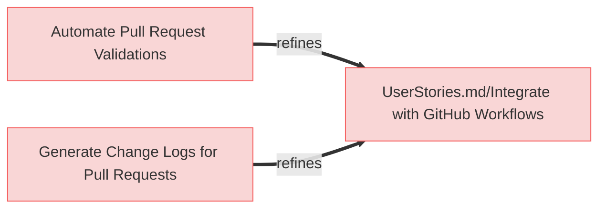

---

### Automate Pull Request Validations

The system shall automate validations of pull requests in the GitHub workflow to ensure model consistency before merging.

#### Relations
  * refine: [UserStories.md/Integrate with GitHub Workflows](UserStories.md#integrate-with-github-workflows)

---

### Generate Change Logs for Pull Requests

The system shall generate detailed change logs for pull requests, summarizing modifications to the MBSE model and related components.

#### Relations
  * refine: [UserStories.md/Integrate with GitHub Workflows](UserStories.md#integrate-with-github-workflows)

## AI-Driven Code Suggestions

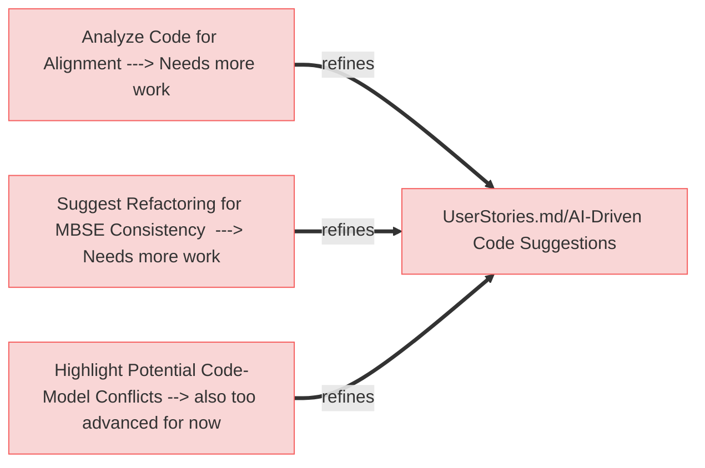

---

### Analyze Code for Alignment ---> Needs more work

The system shall allow AI agents to analyze code and identify deviations from the MBSE model.

#### Relations
  * refine: [UserStories.md/AI-Driven Code Suggestions](UserStories.md#ai-driven-code-suggestions)

---

### Suggest Refactoring for MBSE Consistency  ---> Needs more work

The system shall enable AI agents to suggest refactoring opportunities to ensure code consistency with the MBSE model.

#### Relations
  * refine: [UserStories.md/AI-Driven Code Suggestions](UserStories.md#ai-driven-code-suggestions)

---

### Highlight Potential Code-Model Conflicts --> also too advanced for now

The system shall allow AI agents to highlight potential conflicts between code and the MBSE model, providing recommendations for resolution.

#### Relations
  * refine: [UserStories.md/AI-Driven Code Suggestions](UserStories.md#ai-driven-code-suggestions)

## AI-Driven Model Suggestions

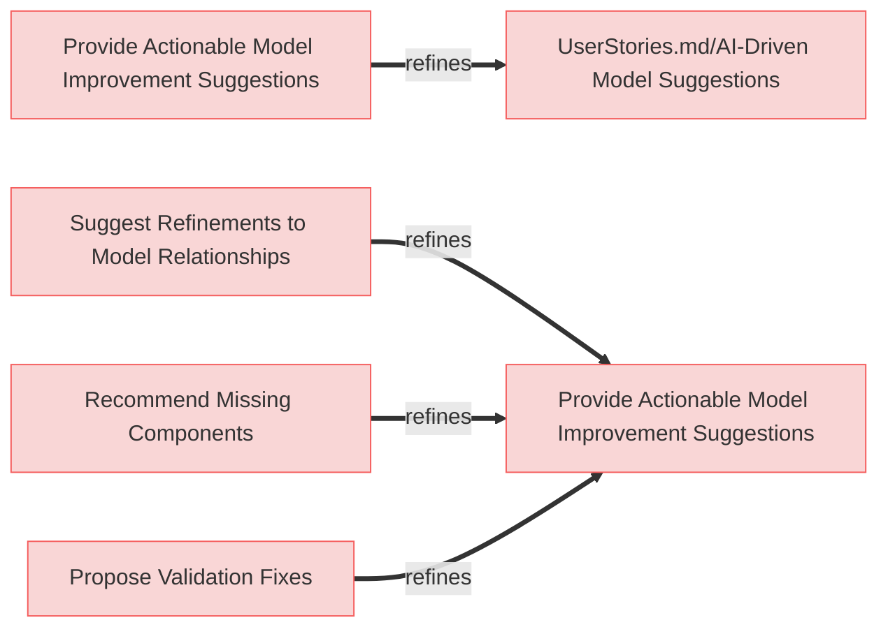

---

### Provide Actionable Model Improvement Suggestions

The system shall enable AI agents to provide actionable suggestions for improving the MBSE model based on system performance data, design inconsistencies, and project requirements.

#### Relations
  * refine: [UserStories.md/AI-Driven Model Suggestions](UserStories.md#ai-driven-model-suggestions)

---

### Suggest Refinements to Model Relationships

The system shall enable AI agents to suggest refinements to relationships within the MBSE model to improve consistency and traceability.

#### Relations
  * refine: [Provide Actionable Model Improvement Suggestions](#provide-actionable-model-improvement-suggestions)

---

### Recommend Missing Components

The system shall allow AI agents to recommend missing components or elements based on gaps in the MBSE model.

#### Relations
  * refine: [Provide Actionable Model Improvement Suggestions](#provide-actionable-model-improvement-suggestions)

---

### Propose Validation Fixes

The system shall enable AI agents to propose fixes for validation errors in the MBSE model.

#### Relations
  * refine: [Provide Actionable Model Improvement Suggestions](#provide-actionable-model-improvement-suggestions)

## Provide Reports

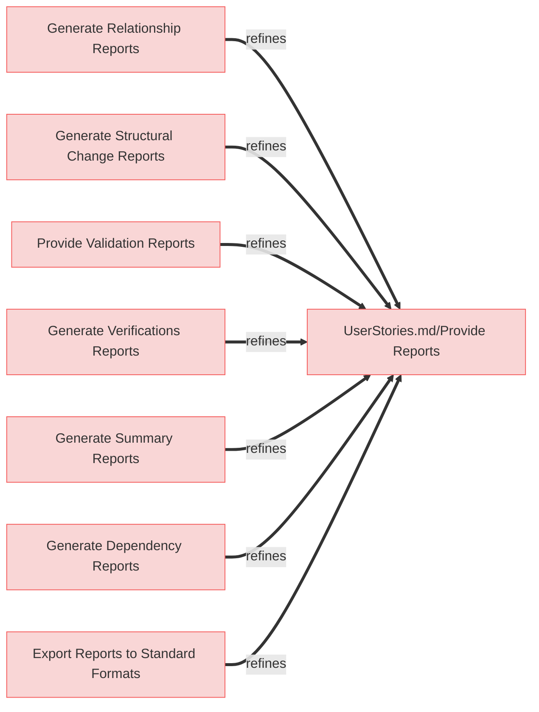

---

### Generate Relationship Reports

The system shall generate reports summarizing the relationships in the MBSE model, including counts and types of connections.

#### Relations
  * refine: [UserStories.md/Provide Reports](UserStories.md#provide-reports)

---

### Generate Structural Change Reports

The system shall generate detailed reports summarizing the impact of structural changes, including affected relationships and components.

#### Relations
  * refine: [UserStories.md/Provide Reports](UserStories.md#provide-reports)

---

### Provide Validation Reports

The system shall generate detailed validation reports, highlighting any inconsistencies or errors in the MBSE model structure.

#### Relations
  * refine: [UserStories.md/Provide Reports](UserStories.md#provide-reports)

---

### Generate Verifications Reports

The system shall produce reports identifying User and Mission requirements that lack a verifiedBy relationship.

#### Relations
  * refine: [UserStories.md/Provide Reports](UserStories.md#provide-reports)

---

### Generate Summary Reports

The system shall allow users to generate summary reports highlighting key metrics and statuses within the MBSE model.

#### Relations
  * refine: [UserStories.md/Provide Reports](UserStories.md#provide-reports)

---

### Generate Dependency Reports

The system shall generate reports summarizing dependencies between requirements, components, and test cases in the MBSE model.

#### Relations
  * refine: [UserStories.md/Provide Reports](UserStories.md#provide-reports)

---

### Export Reports to Standard Formats

The system shall allow users to export generated reports in standard formats (e.g., PDF, Excel) for external sharing.

#### Relations
  * refine: [UserStories.md/Provide Reports](UserStories.md#provide-reports)

## Trace Changes in MBSE Model

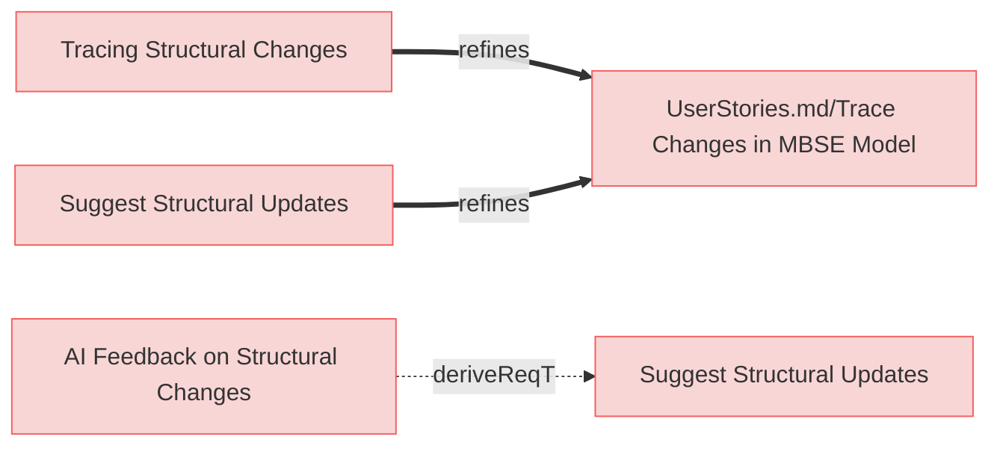

---

### Tracing Structural Changes

When tracing structural changes, the system shall analyze the MBSE model and diffs to identify affected components and generate a report of impacted elements and structures, so that the user can review the changes and decide on further actions.

#### Relations
  * refine: [UserStories.md/Trace Changes in MBSE Model](UserStories.md#trace-changes-in-mbse-model)

---

### Suggest Structural Updates

The system shall suggest updates to maintain structural consistency when changes are introduced to the MBSE model.

#### Relations
  * refine: [UserStories.md/Trace Changes in MBSE Model](UserStories.md#trace-changes-in-mbse-model)

---

### AI Feedback on Structural Changes

When a report of impacted elements is fed into the AI agents' context, the system shall provide suggestions for propagating changes across the MBSE model and allow the user to approve or reject each suggestion, so that updates can be applied consistently and committed to the model after user validation.

#### Relations
  * derivedFrom: [Suggest Structural Updates](#suggest-structural-updates)

## Generate Traceability Matrix			

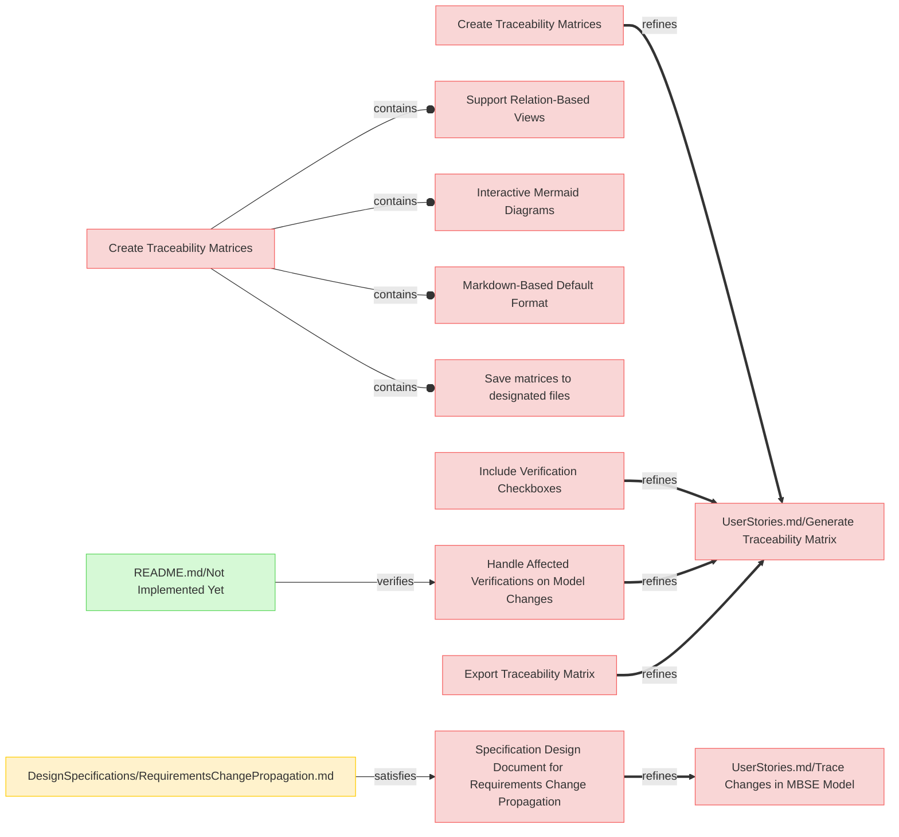

---

### Create Traceability Matrices

The system shall create a traceability matrices when requested by a user or as part of CI/CD actions.

#### Relations
  * refine: [UserStories.md/Generate Traceability Matrix](UserStories.md#generate-traceability-matrix)

---

### Support Relation-Based Views

The system shall generate traceability matrix views based on relations to requirements, such as:

1. **VerifiedBy**: Mapping requirements to their verification methods.
2. **SatisfiedBy**: Mapping system components to the requirements they satisfy.
3. **TracedFrom**: Mapping requirements to their parent or related elements.

#### Relations
  * containedBy: [Create Traceability Matrices](#create-traceability-matrices)
 

---

### Interactive Mermaid Diagrams

The system shall include Mermaid diagrams in the traceability matrix that provide interactive links to related elements in other documents, enabling navigation and exploration of dependencies.

#### Details

Diagrams must be broken into several diagrams using following logic:
 * requirements_file_name/'## paragraph name'
   * all requirements inside are 1 diagram
   * if requirements documents doesn't have '##' paragraphs then requirements file name is used only
   * external related resources box must be a link to actual resource

Color code for rendering diagrams:
 * red for requirement
 * yellow for resources which satisfies requirement
 * green for verifiction which verifies requirement
 * light blue for box representing another diagram/category with requirments where linked requirement or resource exist.

#### Relations
  * containedBy: [Create Traceability Matrices](#create-traceability-matrices)

---

### Markdown-Based Default Format

The system shall generate the traceability matrix in Markdown format by default, adhering to ReqFlow's markdown-first methodology.

#### Relations
  * containedBy: [Create Traceability Matrices](#create-traceability-matrices)

---

### Save matrices to designated files

The system shall save the generated traceability matrices as a Markdown documents with Mermaid diagrams.

#### Relations
  * containedBy: [Create Traceability Matrices](#create-traceability-matrices)

---

### Include Verification Checkboxes

The system shall include checkboxes in the traceability matrix for each verification entry, allowing users to manually mark verification as completed and commit the updated status.

#### Relations
  * refine: [UserStories.md/Generate Traceability Matrix](UserStories.md#generate-traceability-matrix)

---

### Handle Affected Verifications on Model Changes

The system shall uncheck verification checkboxes in the traceability matrix and save updates if a diff affects the related requirements or components, ensuring re-validation is required.

#### Relations
  * refine: [UserStories.md/Generate Traceability Matrix](UserStories.md#generate-traceability-matrix)
  * verifiedBy: [README.md/Not Implemented Yet](README.md#not-implemented-yet)

---

### Specification Design Document for Requirements Change Propagation

The system **shall provide a Specification Design Document (DSD)** that defines how changes in requirements affect child requirements and verifications, ensuring traceability and controlled impact analysis.

#### Relations
  * refine: [UserStories.md/Trace Changes in MBSE Model](UserStories.md#trace-changes-in-mbse-model)
  * satisfiedBy: [DesignSpecifications/RequirementsChangePropagation.md](DesignSpecifications/RequirementsChangePropagation.md)

---

### Export Traceability Matrix

The system shall provide an option to export the traceability matrix in formats such as Excel or PDF for external sharing and analysis.

#### Relations
  * refine: [UserStories.md/Generate Traceability Matrix](UserStories.md#generate-traceability-matrix)

---

## Exporting Specifications

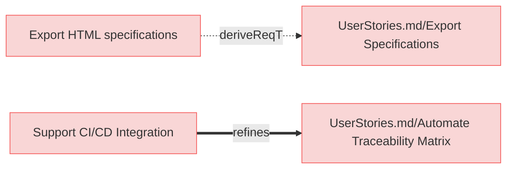

---

### Export HTML specifications

The system shall export specifications into HTML format and save in designated output location.

#### Relations
  * derivedFrom: [UserStories.md/Export Specifications](UserStories.md#export-specifications)

---

### Support CI/CD Integration

The system shall integrate with CI/CD pipelines to generate or update traceability matrices as part of automated workflows.

#### Relations
  * refine: [UserStories.md/Automate Traceability Matrix](UserStories.md#generate-traceability-matrix)
