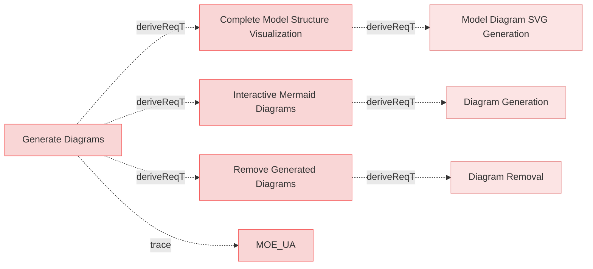
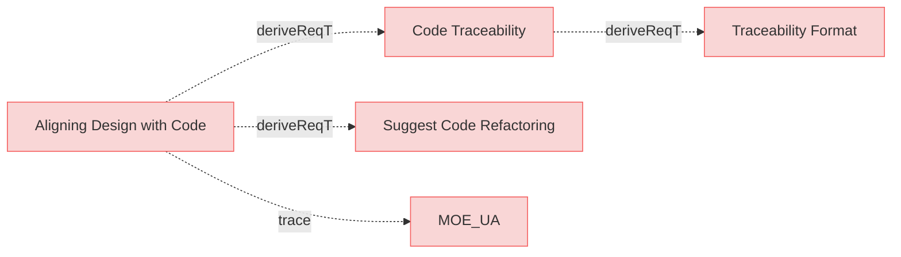
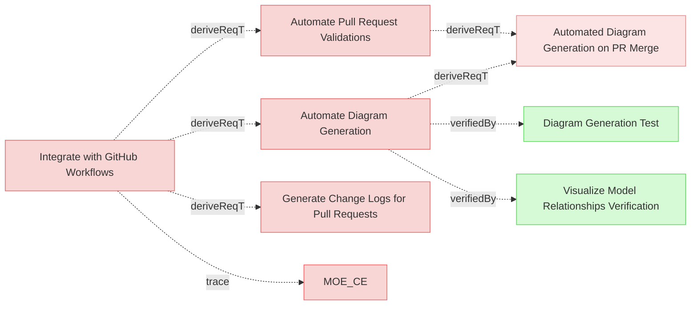
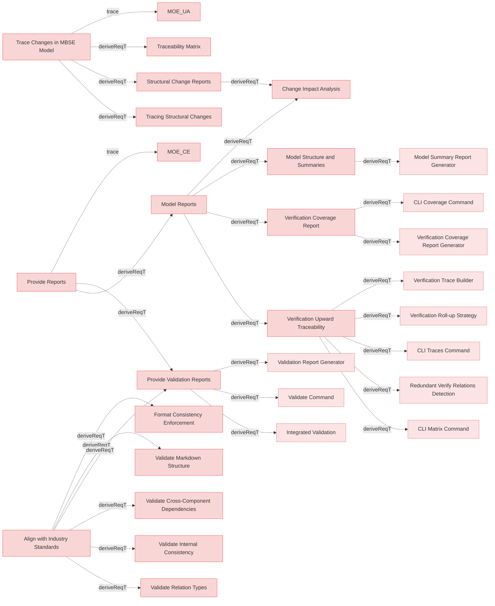
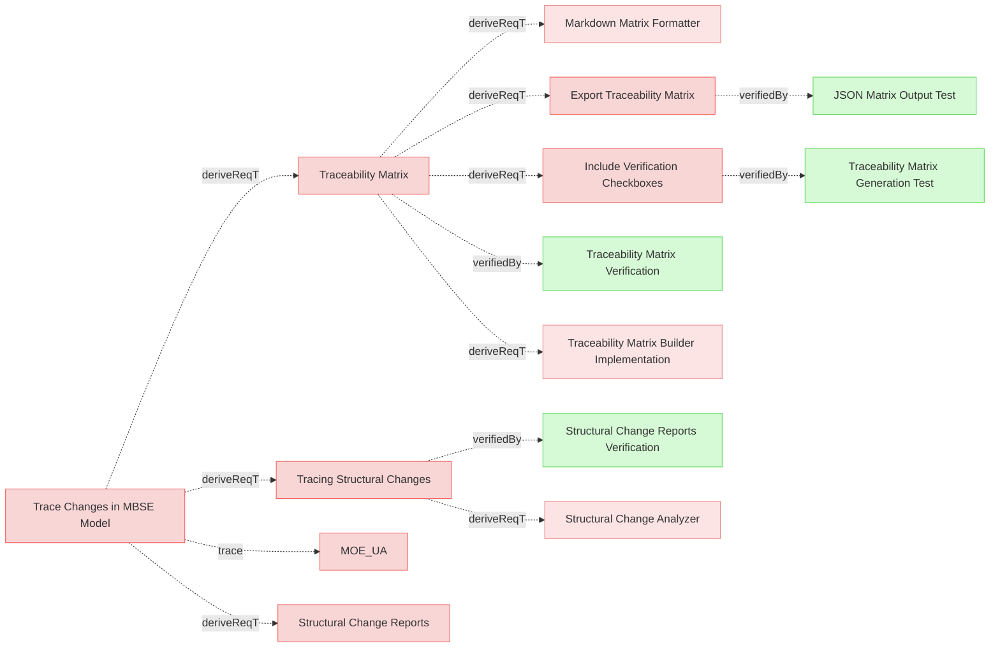
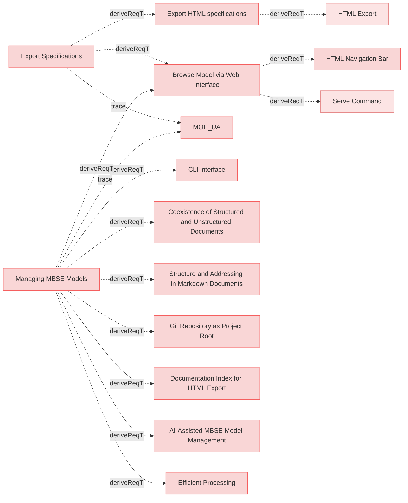
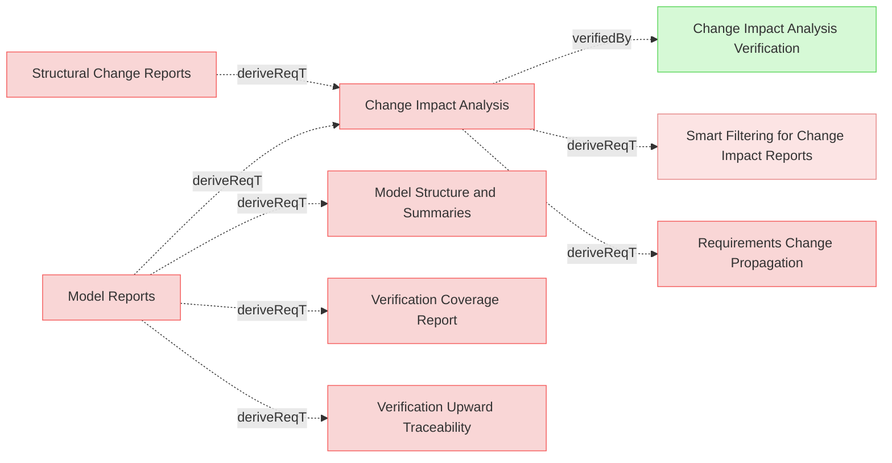
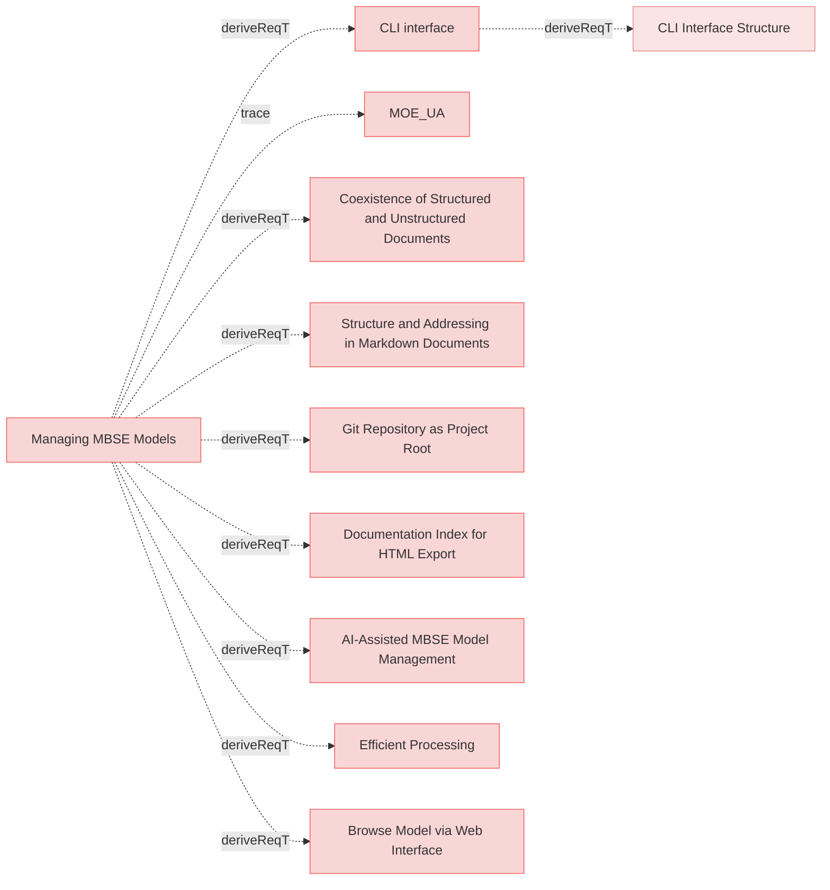

# User Requirements

## Generate Diagrams

### Interactive Mermaid Diagrams

The system shall produce visual representations of relationships within the MBSE model in the form of Mermaid diagrams, enabling users to explore relations and understand dependencies and their impact.

#### Details
Diagrams must be broken into several diagrams using following logic:
 * requirements_file_name/'## section name'
   * all requirements inside are 1 diagram
   * if requirements documents doesn't have '##' paragraphs then requirements file name is used only
   * external related resources box must be a link to actual resource

Color code for rendering diagrams:
 * red for requirement
 * yellow for resources which satisfies requirement
 * green for verifiction which verifies requirement
 * light blue for box representing another diagram/category with requirments where linked requirement or resource exist.

#### Metadata
  * type: user-requirement

#### Relations
  * derivedFrom: [Generate Diagrams](UserStories.md#generate-diagrams)
---

### Remove Generated Diagrams

The system shall provide functionality to remove all generated Mermaid diagrams from the model, allowing users to clean up generated artifacts when needed.

#### Metadata
  * type: user-requirement

#### Relations
  * derivedFrom: [Generate Diagrams](UserStories.md#generate-diagrams)
---

### Complete Model Structure Visualization

The system shall provide visualization of the complete model structure showing the containment hierarchy of folders, files, sections, and elements with their relationships.

#### Details
The visualization shall:
- Show the complete model structure using nested containment boxes (folders > files > sections > elements)
- Display elements with their relations connecting them inside their containing sections
- Use consistent visual styling similar to existing mermaid diagrams
- Support interactive pan and zoom for large models
- Be generated alongside other model artifacts during export

The visualization helps users understand the overall model organization, navigate complex structures, and identify structural patterns across the entire model.

#### Metadata
  * type: user-requirement

#### Relations
  * derivedFrom: [Generate Diagrams](UserStories.md#generate-diagrams)
---

## Aligning Design with Code

### Code Traceability

The system shall support code traceability by using structured comments to link code implementations to corresponding requirements in the MBSE model.

#### Metadata
  * type: user-requirement

#### Relations
  * derivedFrom: [Aligning Design with Code](UserStories.md#aligning-design-with-code)
---

### Suggest Code Refactoring

The system shall suggest code refactoring opportunities to better align with the structure and relationships in the MBSE model.

#### Metadata
  * type: user-requirement

#### Relations
  * derivedFrom: [Aligning Design with Code](UserStories.md#aligning-design-with-code)
---

## Validating Structures

```mermaid
graph LR;
  %% REQVIRE-AUTOGENERATED-DIAGRAM
  %% Graph styling
  classDef userRequirement fill:#f9d6d6,stroke:#f55f5f,stroke-width:1px;
  classDef systemRequirement fill:#fce4e4,stroke:#e68a8a,stroke-width:1px;
  classDef verification fill:#d6f9d6,stroke:#5fd75f,stroke-width:1px;
  classDef default fill:#f5f5f5,stroke:#333333,stroke-width:1px;

  974ccf933675ef44["Format Consistency Enforcement"];
  class 974ccf933675ef44 userRequirement;
  click 974ccf933675ef44 "UserRequirements.md#format-consistency-enforcement";
  aee526ff800e2525["Excess Whitespace Format Implementation"];
  class aee526ff800e2525 systemRequirement;
  click aee526ff800e2525 "SystemRequirements/Requirements.md#excess-whitespace-format-implementation";
  974ccf933675ef44 -.->|deriveReqT| aee526ff800e2525;
  837782fd5fe407a0["Document Structure Normalization"];
  class 837782fd5fe407a0 systemRequirement;
  click 837782fd5fe407a0 "SystemRequirements/Requirements.md#document-structure-normalization";
  974ccf933675ef44 -.->|deriveReqT| 837782fd5fe407a0;
  c5dd3734ff11b459["Inconsistent Newlines Format Implementation"];
  class c5dd3734ff11b459 systemRequirement;
  click c5dd3734ff11b459 "SystemRequirements/Requirements.md#inconsistent-newlines-format-implementation";
  974ccf933675ef44 -.->|deriveReqT| c5dd3734ff11b459;
  9c7292a4b6970e22["Reserved Subsections Format Implementation"];
  class 9c7292a4b6970e22 systemRequirement;
  click 9c7292a4b6970e22 "SystemRequirements/Requirements.md#reserved-subsections-format-implementation";
  974ccf933675ef44 -.->|deriveReqT| 9c7292a4b6970e22;
  2ace056c2ac70d6c["Missing Separators Format Implementation"];
  class 2ace056c2ac70d6c systemRequirement;
  click 2ace056c2ac70d6c "SystemRequirements/Requirements.md#missing-separators-format-implementation";
  974ccf933675ef44 -.->|deriveReqT| 2ace056c2ac70d6c;
  5c482dc763b4133a["Validate Filesystem Structure"];
  class 5c482dc763b4133a userRequirement;
  click 5c482dc763b4133a "UserRequirements.md#validate-filesystem-structure";
  586b073cd97908da["Validate Markdown Structure"];
  class 586b073cd97908da userRequirement;
  click 586b073cd97908da "UserRequirements.md#validate-markdown-structure";
  9d7ad0f9a306af77["Markdown Structure Validator"];
  class 9d7ad0f9a306af77 systemRequirement;
  click 9d7ad0f9a306af77 "SystemRequirements/Requirements.md#markdown-structure-validator";
  586b073cd97908da -.->|deriveReqT| 9d7ad0f9a306af77;
  3bd9d29239564eeb["Validate Cross-Component Dependencies"];
  class 3bd9d29239564eeb userRequirement;
  click 3bd9d29239564eeb "UserRequirements.md#validate-cross-component-dependencies";
  80aa3982504aea7b["Cross-Component Dependency Validator"];
  class 80aa3982504aea7b systemRequirement;
  click 80aa3982504aea7b "SystemRequirements/Requirements.md#cross-component-dependency-validator";
  3bd9d29239564eeb -.->|deriveReqT| 80aa3982504aea7b;
  7305c1d6f7f1e2b2["Model Linting"];
  class 7305c1d6f7f1e2b2 userRequirement;
  click 7305c1d6f7f1e2b2 "UserRequirements.md#model-linting";
  ca4c172fa1865ab5["Lint Auto-fix Capability"];
  class ca4c172fa1865ab5 systemRequirement;
  click ca4c172fa1865ab5 "SystemRequirements/Requirements.md#lint-auto-fix-capability";
  7305c1d6f7f1e2b2 -.->|deriveReqT| ca4c172fa1865ab5;
  978e8a15313b7749["Maybe-Redundant Hierarchical Relations Detection"];
  class 978e8a15313b7749 systemRequirement;
  click 978e8a15313b7749 "SystemRequirements/Requirements.md#maybe-redundant-hierarchical-relations-detection";
  7305c1d6f7f1e2b2 -.->|deriveReqT| 978e8a15313b7749;
  c81cb4aa001db458["Lint Output Formatting"];
  class c81cb4aa001db458 systemRequirement;
  click c81cb4aa001db458 "SystemRequirements/Requirements.md#lint-output-formatting";
  7305c1d6f7f1e2b2 -.->|deriveReqT| c81cb4aa001db458;
  11859a2b890dd8c3["Redundant Verify Relations Detection"];
  class 11859a2b890dd8c3 systemRequirement;
  click 11859a2b890dd8c3 "SystemRequirements/Requirements.md#redundant-verify-relations-detection";
  7305c1d6f7f1e2b2 -.->|deriveReqT| 11859a2b890dd8c3;
  e049c04afaa864c["CLI Lint Command"];
  class e049c04afaa864c systemRequirement;
  click e049c04afaa864c "SystemRequirements/Requirements.md#cli-lint-command";
  7305c1d6f7f1e2b2 -.->|deriveReqT| e049c04afaa864c;
  8903fde565a36e15["Model Formatting"];
  class 8903fde565a36e15 userRequirement;
  click 8903fde565a36e15 "UserRequirements.md#model-formatting";
  8903fde565a36e15 -.->|deriveReqT| 974ccf933675ef44;
  875f89a9f301fb90["Format Command"];
  class 875f89a9f301fb90 systemRequirement;
  click 875f89a9f301fb90 "SystemRequirements/Requirements.md#format-command";
  8903fde565a36e15 -.->|deriveReqT| 875f89a9f301fb90;
  8dfe33c28555e80a["Replace Absolute Links with Relative Links"];
  class 8dfe33c28555e80a userRequirement;
  click 8dfe33c28555e80a "UserRequirements.md#replace-absolute-links-with-relative-links";
  8903fde565a36e15 -.->|deriveReqT| 8dfe33c28555e80a;
  c9988cdcfdea77a["Formatting Output"];
  class c9988cdcfdea77a userRequirement;
  click c9988cdcfdea77a "UserRequirements.md#formatting-output";
  8903fde565a36e15 -.->|deriveReqT| c9988cdcfdea77a;
  735766802775ec41["Format Command Requirements Verification"];
  class 735766802775ec41 verification;
  click 735766802775ec41 "Verifications/Misc.md#format-command-requirements-verification";
  8dfe33c28555e80a -.->|verifiedBy| 735766802775ec41;
  c50887ce89be280a["Validate Internal Consistency"];
  class c50887ce89be280a userRequirement;
  click c50887ce89be280a "UserRequirements.md#validate-internal-consistency";
  bcf308e253d2c6e7["Internal Consistency Validator"];
  class bcf308e253d2c6e7 systemRequirement;
  click bcf308e253d2c6e7 "SystemRequirements/Requirements.md#internal-consistency-validator";
  c50887ce89be280a -.->|deriveReqT| bcf308e253d2c6e7;
  c0cc52075c4770f2["Two-Pass Validation Strategy"];
  class c0cc52075c4770f2 systemRequirement;
  click c0cc52075c4770f2 "SystemRequirements/TwoPassValidation.md#two-pass-validation-strategy";
  c50887ce89be280a -.->|deriveReqT| c0cc52075c4770f2;
  f25cbfbca6d6d92e["Validate Relation Types"];
  class f25cbfbca6d6d92e userRequirement;
  click f25cbfbca6d6d92e "UserRequirements.md#validate-relation-types";
  dc7a9bb1bbebc57f["Relation Element Type Validator"];
  class dc7a9bb1bbebc57f systemRequirement;
  click dc7a9bb1bbebc57f "SystemRequirements/Requirements.md#relation-element-type-validator";
  f25cbfbca6d6d92e -.->|deriveReqT| dc7a9bb1bbebc57f;
  dd743af9792366e["Git-Style Diff Output for Format"];
  class dd743af9792366e systemRequirement;
  click dd743af9792366e "SystemRequirements/Requirements.md#git-style-diff-output-for-format";
  c9988cdcfdea77a -.->|deriveReqT| dd743af9792366e;
  3b10b8811daaed67["Enhanced Validation Error Reporting"];
  class 3b10b8811daaed67 userRequirement;
  click 3b10b8811daaed67 "UserRequirements.md#enhanced-validation-error-reporting";
  4ecd49d71920c1fc["Detailed Error Handling and Logging"];
  class 4ecd49d71920c1fc systemRequirement;
  click 4ecd49d71920c1fc "SystemRequirements/Requirements.md#detailed-error-handling-and-logging";
  3b10b8811daaed67 -.->|deriveReqT| 4ecd49d71920c1fc;
  b4f1757fc8831083["Validate Command"];
  class b4f1757fc8831083 systemRequirement;
  click b4f1757fc8831083 "SystemRequirements/Requirements.md#validate-command";
  3b10b8811daaed67 -.->|deriveReqT| b4f1757fc8831083;
  db64a3e25646a37f["Relation Type Validation"];
  class db64a3e25646a37f systemRequirement;
  click db64a3e25646a37f "SystemRequirements/Requirements.md#relation-type-validation";
  3b10b8811daaed67 -.->|deriveReqT| db64a3e25646a37f;
  2f4125edaacb1231["Documentation Index for HTML Export"];
  class 2f4125edaacb1231 userRequirement;
  click 2f4125edaacb1231 "UserRequirements.md#documentation-index-for-html-export";
  a21995894299effb["Index Generation"];
  class a21995894299effb systemRequirement;
  click a21995894299effb "SystemRequirements/Requirements.md#index-generation";
  2f4125edaacb1231 -.->|deriveReqT| a21995894299effb;
  c1851df0c89e80f8["HTML Navigation Enhancement"];
  class c1851df0c89e80f8 systemRequirement;
  click c1851df0c89e80f8 "SystemRequirements/Requirements.md#html-navigation-enhancement";
  2f4125edaacb1231 -.->|deriveReqT| c1851df0c89e80f8;
  113748a94885138d["Validating Structures"];
  class 113748a94885138d userRequirement;
  click 113748a94885138d "UserStories.md#validating-structures";
  2c5f30f14e792200["MOE_UA"];
  class 2c5f30f14e792200 userRequirement;
  click 2c5f30f14e792200 "MOEs.md#moe_ua";
  113748a94885138d -.->|trace| 2c5f30f14e792200;
  113748a94885138d -.->|deriveReqT| 5c482dc763b4133a;
  113748a94885138d -.->|deriveReqT| 586b073cd97908da;
  113748a94885138d -.->|deriveReqT| 3bd9d29239564eeb;
  113748a94885138d -.->|deriveReqT| 7305c1d6f7f1e2b2;
  113748a94885138d -.->|deriveReqT| 8903fde565a36e15;
  113748a94885138d -.->|deriveReqT| c50887ce89be280a;
  113748a94885138d -.->|deriveReqT| f25cbfbca6d6d92e;
  113748a94885138d -.->|deriveReqT| 3b10b8811daaed67;
  e61b7c1baa89bfc6["Managing MBSE Models"];
  class e61b7c1baa89bfc6 userRequirement;
  click e61b7c1baa89bfc6 "UserStories.md#managing-mbse-models";
  e61b7c1baa89bfc6 -.->|trace| 2c5f30f14e792200;
  f28849d46c19af44["CLI interface"];
  class f28849d46c19af44 userRequirement;
  click f28849d46c19af44 "UserRequirements.md#cli-interface";
  e61b7c1baa89bfc6 -.->|deriveReqT| f28849d46c19af44;
  f0d721424636370e["Coexistence of Structured and Unstructured Documents"];
  class f0d721424636370e userRequirement;
  click f0d721424636370e "ManagingMbseModelsRequirements.md#coexistence-of-structured-and-unstructured-documents";
  e61b7c1baa89bfc6 -.->|deriveReqT| f0d721424636370e;
  ade67c27bc5d3bbd["Structure and Addressing in Markdown Documents"];
  class ade67c27bc5d3bbd userRequirement;
  click ade67c27bc5d3bbd "SpecificationsRequirements.md#structure-and-addressing-in-markdown-documents";
  e61b7c1baa89bfc6 -.->|deriveReqT| ade67c27bc5d3bbd;
  649d72765b13e14f["Git Repository as Project Root"];
  class 649d72765b13e14f userRequirement;
  click 649d72765b13e14f "ManagingMbseModelsRequirements.md#git-repository-as-project-root";
  e61b7c1baa89bfc6 -.->|deriveReqT| 649d72765b13e14f;
  e61b7c1baa89bfc6 -.->|deriveReqT| 2f4125edaacb1231;
  cd2d5dab49985ca2["AI-Assisted MBSE Model Management"];
  class cd2d5dab49985ca2 userRequirement;
  click cd2d5dab49985ca2 "UserStories.md#ai-assisted-mbse-model-management";
  e61b7c1baa89bfc6 -.->|deriveReqT| cd2d5dab49985ca2;
  d193d11c43776bec["Efficient Processing"];
  class d193d11c43776bec userRequirement;
  click d193d11c43776bec "ManagingMbseModelsRequirements.md#efficient-processing";
  e61b7c1baa89bfc6 -.->|deriveReqT| d193d11c43776bec;
  a44b59684c593d1e["Browse Model via Web Interface"];
  class a44b59684c593d1e userRequirement;
  click a44b59684c593d1e "UserRequirements.md#browse-model-via-web-interface";
  e61b7c1baa89bfc6 -.->|deriveReqT| a44b59684c593d1e;
  b74eec7ed767e7c["Align with Industry Standards"];
  class b74eec7ed767e7c userRequirement;
  click b74eec7ed767e7c "MissionRequirements.md#align-with-industry-standards";
  b74eec7ed767e7c -.->|deriveReqT| 974ccf933675ef44;
  b74eec7ed767e7c -.->|deriveReqT| 586b073cd97908da;
  ed31b6bed1cde2f8["Provide Validation Reports"];
  class ed31b6bed1cde2f8 userRequirement;
  click ed31b6bed1cde2f8 "UserRequirements.md#provide-validation-reports";
  b74eec7ed767e7c -.->|deriveReqT| ed31b6bed1cde2f8;
  b74eec7ed767e7c -.->|deriveReqT| 3bd9d29239564eeb;
  b74eec7ed767e7c -.->|deriveReqT| c50887ce89be280a;
  b74eec7ed767e7c -.->|deriveReqT| f25cbfbca6d6d92e;
```

### Enhanced Validation Error Reporting

The system shall provide comprehensive validation messages that include file paths and line numbers when available, to help users quickly locate and fix model integrity and structure issues in their MBSE specifications.

#### Metadata
  * type: user-requirement

#### Relations
  * derivedFrom: [Validating Structures](UserStories.md#validating-structures)
---

### Model Formatting

The system shall provide formatting capabilities to normalize and standardize MBSE models for consistency and readability.

#### Metadata
  * type: user-requirement

#### Relations
  * derivedFrom: [Validating Structures](UserStories.md#validating-structures)
---

### Model Linting

The system shall provide model linting capabilities to analyze model quality and detect issues in requirements relations.

#### Details
The linting capability should:
- Identify issues with model relations that may need attention
- Distinguish between issues that can be automatically fixed and those requiring human judgment
- Provide clear categorization of findings to help users understand what actions are needed
- Support both reporting mode and automatic fixing mode
- Allow filtering to focus on specific categories of issues

#### Metadata
  * type: user-requirement

#### Relations
  * derivedFrom: [Validating Structures](UserStories.md#validating-structures)
---

### Formatting Output

The system shall display formatting changes suggestion in similar manner as git diffs.

#### Metadata
  * type: user-requirement

#### Relations
  * derivedFrom: [Model Formatting](#model-formatting)
---

### Replace Absolute Links with Relative Links

The system shall replace absolute links with relative links, where applicable and contextually appropriate, to conform to repository standards and enhance portability.

#### Metadata
  * type: user-requirement

#### Relations
  * derivedFrom: [Model Formatting](#model-formatting)
  * verifiedBy: [Format Command Requirements Verification](Verifications/Misc.md#format-command-requirements-verification)
---

### Format Consistency Enforcement

The system shall provide formatting capability to ensure consistent formatting in requirements documents.

#### Details
  * Trimming excess whitespace after element names and relation identifiers
  * Normalizing to exactly two newlines before subsections (e.g., "#### Details")
  * Automatically inserting separator lines ("---") between elements if not already present
  * Normalizing consecutive separators to single separators
  * Ensuring consistent indentation in relation lists (2-space format)
  * Normalizing relation entries to proper 2-space indentation format
  * Displaying changes with sequential line numbering that reflects final file positions
  * Providing context lines with proper line number continuity

#### Metadata
  * type: user-requirement

#### Relations
  * derivedFrom: [Model Formatting](#model-formatting)
  * derivedFrom: [Align with Industry Standards](MissionRequirements.md#align-with-industry-standards)
---

### Documentation Index for HTML Export

The system shall automatically generate an index document during HTML export that contains a structured summary of all specification documents and folders, serving as the primary entry point (index.html) for HTML documentation.

#### Metadata
  * type: user-requirement

#### Relations
  * derivedFrom: [Managing MBSE Models](UserStories.md#managing-mbse-models)
---

### Validate Markdown Structure

The system shall validate the Markdown structure of MBSE documentation to ensure compliance with formatting standards.

#### Metadata
  * type: user-requirement

#### Relations
  * derivedFrom: [Validating Structures](UserStories.md#validating-structures)
  * derivedFrom: [Align with Industry Standards](MissionRequirements.md#align-with-industry-standards)
---

### Validate Filesystem Structure

The system shall validate the organization of files and folders in the repository to ensure consistency with the MBSE methodology.

#### Metadata
  * type: user-requirement

#### Relations
  * derivedFrom: [Validating Structures](UserStories.md#validating-structures)
---

### Validate Internal Consistency

The system shall check the internal consistency of the MBSE model, ensuring that relationships and elements align correctly.

#### Metadata
  * type: user-requirement

#### Relations
  * derivedFrom: [Validating Structures](UserStories.md#validating-structures)
  * derivedFrom: [Align with Industry Standards](MissionRequirements.md#align-with-industry-standards)
---

### Validate Cross-Component Dependencies

The system shall validate dependencies across different components of the MBSE model to identify mismatches or gaps.

#### Metadata
  * type: user-requirement

#### Relations
  * derivedFrom: [Validating Structures](UserStories.md#validating-structures)
  * derivedFrom: [Align with Industry Standards](MissionRequirements.md#align-with-industry-standards)
---

### Validate Relation Types

The system shall validate relation types and allow only supported types.

#### Metadata
  * type: user-requirement

#### Relations
  * derivedFrom: [Validating Structures](UserStories.md#validating-structures)
  * derivedFrom: [Align with Industry Standards](MissionRequirements.md#align-with-industry-standards)
---

## Integrate with GitHub Workflows

### Automate Pull Request Validations

The system shall automate validations of pull requests in the GitHub workflow to ensure model consistency before merging.

#### Metadata
  * type: user-requirement

#### Relations
  * derivedFrom: [Integrate with GitHub Workflows](UserStories.md#integrate-with-github-workflows)
---

### Generate Change Logs for Pull Requests

The system shall generate detailed change logs for pull requests, summarizing modifications to the MBSE model and related components.

#### Metadata
  * type: user-requirement

#### Relations
  * derivedFrom: [Integrate with GitHub Workflows](UserStories.md#integrate-with-github-workflows)
---

### Automate Diagram Generation

The system shall automate generation of diagrams in the GitHub workflow on PR merge event, so that the diagrams are always accessible and up-to-date.

#### Metadata
  * type: user-requirement

#### Relations
  * derivedFrom: [Integrate with GitHub Workflows](UserStories.md#integrate-with-github-workflows)
---

## Provide Reports

### Model Reports

When requested the system shall provide human readable MBSE model reports.

#### Metadata
  * type: user-requirement

#### Relations
  * derivedFrom: [Provide Reports](UserStories.md#provide-reports)
---

### Model Structure and Summaries

When requested the system shall generate reports summarizing the structure and relationships in the MBSE model, including counts and types of connections also supporting json and cypher output.

#### Metadata
  * type: user-requirement

#### Relations
  * derivedFrom: [Model Reports](#model-reports)
---

### Structural Change Reports

The system shall generate detailed reports summarizing the impact of structural changes, including affected relationships and components.

#### Metadata
  * type: user-requirement

#### Relations
  * derivedFrom: [Trace Changes in MBSE Model](UserStories.md#trace-changes-in-mbse-model)
---

### Provide Validation Reports

The system shall generate detailed validation reports, highlighting any inconsistencies or errors in the MBSE model structure.

#### Details
Validation shall be performed automatically when any command requires the parsed model, eliminating the need for a separate validation command. Commands that operate on raw files shall skip validation to allow operation on potentially invalid documents.

#### Metadata
  * type: user-requirement

#### Relations
  * derivedFrom: [Provide Reports](UserStories.md#provide-reports)
  * derivedFrom: [Align with Industry Standards](MissionRequirements.md#align-with-industry-standards)
---

### Verification Coverage Report

The system shall generate verification coverage reports focusing on leaf requirements (requirements that do not have forward relations to any other requirement), showing the percentage and details of verified and unverified leaf requirements, including breakdowns by file, section, and verification type.

#### Details
The verification coverage report shall provide:
- Total count of leaf requirements with breakdown by requirement type
- Count and percentage of verified leaf requirements (those with verifiedBy relations pointing to existing verification artifacts)
- Count and percentage of unverified leaf requirements
- Total count of verification artifacts with breakdown by verification type (test, analysis, inspection, demonstration)
- Count and percentage of satisfied test-verification artifacts (those with satisfiedBy relations pointing to existing test implementations)
- Count and percentage of orphaned verification artifacts (those without any verify relations to requirements)
- Detailed list of verified leaf requirements grouped by file and section
- Detailed list of unverified leaf requirements with impact analysis
- Detailed list of orphaned verifications (flagged for attention as they may be redundant or incorrectly configured)
- Output in both human-readable text and machine-readable JSON formats

The report helps track verification completeness and identify gaps in requirement verification coverage, supporting quality assurance and compliance activities.

**Coverage Philosophy:**
- **Leaf requirements** (requirements that don't derive other requirements) MUST be verified
- **Parent/intermediate requirements** MAY be verified but it's not a hard requirement as they might be covered in verification of leaf requirements
- One verification may verify multiple leaf requirements (N:1 relationship)
- The change impact analysis system propagates changes from parent requirements down to leaf requirements and their verifications
- System engineers/architects are responsible for ensuring verification scopes are broad enough to cover parent requirements when there's no dedicated parent verification
- AI systems can help create comprehensive verification scopes and prevent verification overlap

#### Metadata
  * type: user-requirement

#### Relations
  * derivedFrom: [Model Reports](#model-reports)
---

### Verification Upward Traceability

The system shall provide upward traceability visualization from verifications to root requirements, showing the complete requirement hierarchy and indicating which requirements are directly verified.

#### Details
**Used for identifying redundant verifications**: When a verification directly verifies both a leaf requirement and its parent requirement, this creates a redundant relation that adds noise into the model and may be removed from the parent - verifying the leaf requirement is sufficient since it traces upward to the parent. This keeps verification placement at the most specific level.

#### Metadata
  * type: user-requirement

#### Relations
  * derivedFrom: [Model Reports](#model-reports)
---

## Trace Changes in MBSE Model

### Tracing Structural Changes

When tracing structural changes, the system shall analyze the MBSE model and diffs to identify affected components and generate a report of impacted elements and structures, so that the user can review the changes and decide on further actions.

#### Metadata
  * type: user-requirement

#### Relations
  * derivedFrom: [Trace Changes in MBSE Model](UserStories.md#trace-changes-in-mbse-model)
---

### Traceability Matrix

When requested the system shall generate traceability matrices, in Markdown format by default, and supporting different views.

#### Details
A matrix is a textual representation which is the most efficient way to convey numerous relationships within a compact space.

Requirements-to-Verification View:
  * Maps each requirement to one or more verification activities, tests, or validation procedures. This helps track which requirements are verified and how.

#### Metadata
  * type: user-requirement

#### Relations
  * derivedFrom: [Trace Changes in MBSE Model](UserStories.md#trace-changes-in-mbse-model)
---

### Include Verification Checkboxes

The system shall include checkboxes in the traceability matrix for each verification entry, allowing users to manually mark verification as completed.

#### Metadata
  * type: user-requirement

#### Relations
  * derivedFrom: [Traceability Matrix](#traceability-matrix)
---

### Export Traceability Matrix

The system shall provide an option to export the traceability matrix in formats such as Excel or PDF for external sharing and analysis.

#### Metadata
  * type: user-requirement

#### Relations
  * derivedFrom: [Traceability Matrix](#traceability-matrix)
---

## Exporting Specifications

### Export HTML specifications

The system shall export specifications into HTML format and save in designated output location.

#### Metadata
  * type: user-requirement

#### Relations
  * derivedFrom: [Export Specifications](UserStories.md#export-specifications)
---

### Browse Model via Web Interface

The system SHALL provide a web-based interface to browse the MBSE model documentation, including all generated artifacts such as diagrams, reports, verification traces, and traceability matrix.

#### Details
The browse interface allows users to:
- View HTML-rendered specifications and requirements
- Navigate through diagrams and visualizations
- Access verification traces and coverage reports
- Review traceability matrices
- Explore the complete model structure through an integrated web interface

This capability enables both human users (via browser) and AI agents (via MCP server) to efficiently explore and understand the MBSE model without manually navigating file structures.

#### Metadata
  * type: user-requirement

#### Relations
  * derivedFrom: [Managing MBSE Models](UserStories.md#managing-mbse-models)
  * derivedFrom: [Export Specifications](UserStories.md#export-specifications)
---

### HTML Navigation Bar

The system SHALL provide a fixed navigation bar in all HTML pages with links to key model artifacts for easy access.

#### Details
The navigation bar must include:
- Home: Link to index.html (model structure overview)
- Traces: Link to traces.html (verification upward traceability report)
- Coverage: Link to coverage.html (verification coverage report)
- Matrix: Link to matrix.svg (traceability matrix visualization)

The navigation bar must be:
- Always visible (fixed position) while scrolling
- Consistent across all HTML pages
- Clearly visible and accessible

#### Metadata
  * type: user-requirement

#### Relations
  * derivedFrom: [Browse Model via Web Interface](#browse-model-via-web-interface)
---

## Trace Changes

### Change Impact Analysis

When requested the system shall generate change impact report, in Markdown format by default and also supporting json output.

#### Metadata
  * type: user-requirement

#### Relations
  * derivedFrom: [Model Reports](#model-reports)
  * derivedFrom: [Structural Change Reports](#structural-change-reports)
---

## Interfaces

### CLI interface

The system shall provide command line interface (CLI) to faciliate model management.

#### Metadata
  * type: user-requirement

#### Relations
  * derivedFrom: [Managing MBSE Models](UserStories.md#managing-mbse-models)
---