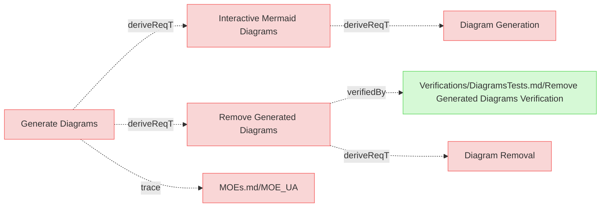
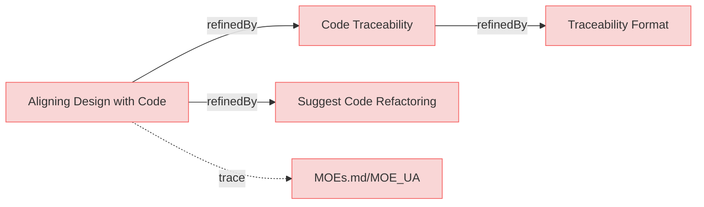
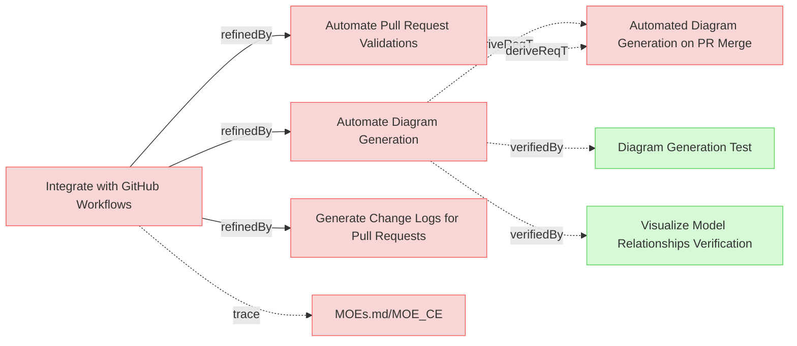
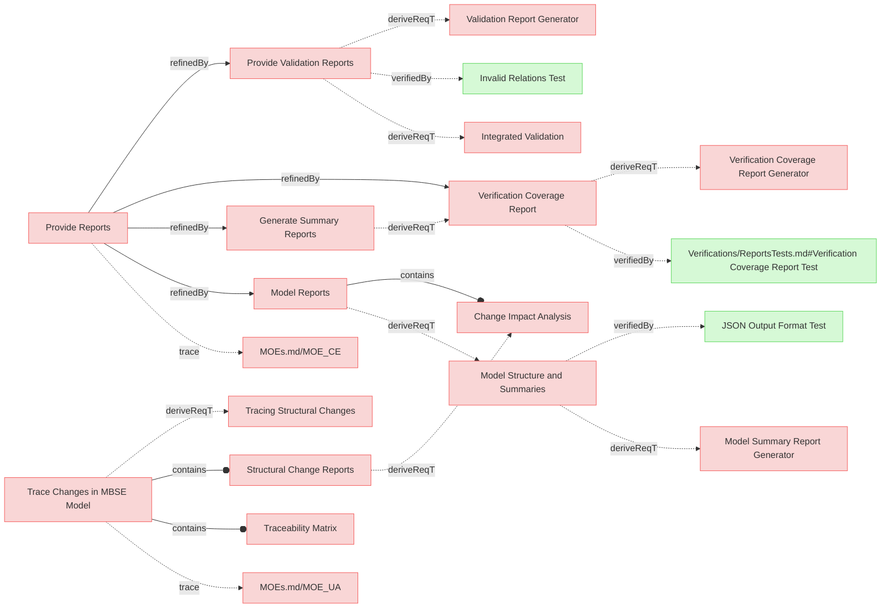
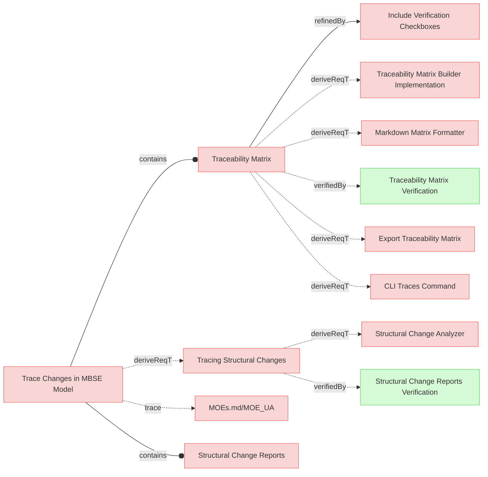
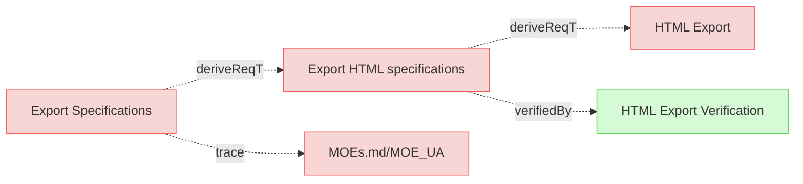
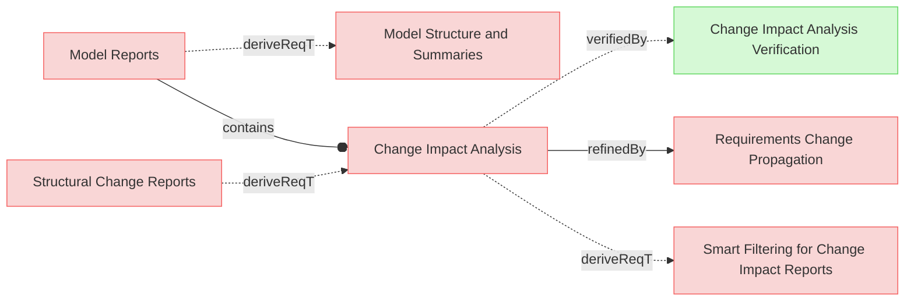
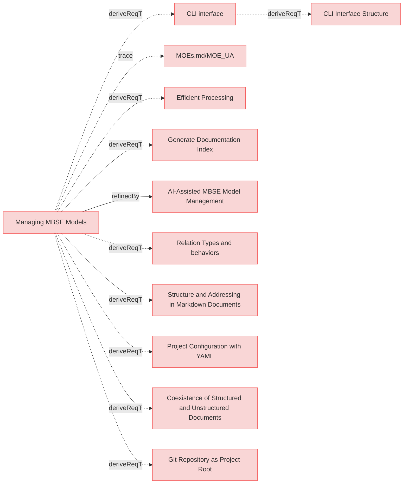

# User Requirements

## Generate Diagrams

---

### Interactive Mermaid Diagrams

The system shall produce visual representations of relationships within the MBSE model in the form of Mermaid diagrams, enabling users to explore relations and understand dependencies and their impact.

#### Details

Diagrams must be broken into several diagrams using following logic:
 * requirements_file_name/'## section name'
   * all requirements inside are 1 diagram
   * if requirements documents doesn't have '##' paragraphs then requirements file name is used only
   * external related resources box must be a link to actual resource

Color code for rendering diagrams:
 * red for requirement
 * yellow for resources which satisfies requirement
 * green for verifiction which verifies requirement
 * light blue for box representing another diagram/category with requirments where linked requirement or resource exist.

#### Relations
  * derivedFrom: [UserStories.md/Generate Diagrams](UserStories.md#generate-diagrams)

---

### Remove Generated Diagrams

The system shall provide functionality to remove all generated Mermaid diagrams from the model, allowing users to clean up generated artifacts when needed.

#### Relations
  * derivedFrom: [UserStories.md/Generate Diagrams](UserStories.md#generate-diagrams)
  * verifiedBy: [Verifications/DiagramsTests.md/Remove Generated Diagrams Verification](Verifications/DiagramsTests.md#remove-generated-diagrams-verification)

---

## Aligning Design with Code

---

### Code Traceability
The system shall support code traceability by using structured comments to link code implementations to corresponding requirements in the MBSE model.

#### Relations
  * refine: [UserStories.md/Aligning Design with Code](UserStories.md#aligning-design-with-code)

---

### Suggest Code Refactoring
The system shall suggest code refactoring opportunities to better align with the structure and relationships in the MBSE model.

#### Relations
  * refine: [UserStories.md/Aligning Design with Code](UserStories.md#aligning-design-with-code)

---

## Validating Structures

```mermaid
graph LR;
  %% REQVIRE-AUTOGENERATED-DIAGRAM
  %% Graph styling
  classDef requirement fill:#f9d6d6,stroke:#f55f5f,stroke-width:1px;
  classDef verification fill:#d6f9d6,stroke:#5fd75f,stroke-width:1px;
  classDef externalLink fill:#d0e0ff,stroke:#3080ff,stroke-width:1px;
  classDef default fill:#f5f5f5,stroke:#333333,stroke-width:1px;

  26fdf88d16b09109["Linting Output"];
  class 26fdf88d16b09109 requirement;
  click 26fdf88d16b09109 "UserRequirements.md#linting-output";
  b7dd9db7a1290b97["Git-Style Diff Output for Linting"];
  class b7dd9db7a1290b97 requirement;
  click b7dd9db7a1290b97 "SystemRequirements/Requirements.md#git-style-diff-output-for-linting";
  26fdf88d16b09109 -.->|deriveReqT| b7dd9db7a1290b97;
  974ccf933675ef44["Format Consistency Enforcement"];
  class 974ccf933675ef44 requirement;
  click 974ccf933675ef44 "UserRequirements.md#format-consistency-enforcement";
  9f473f6e0b993cac["Excess Whitespace Linting Implementation"];
  class 9f473f6e0b993cac requirement;
  click 9f473f6e0b993cac "SystemRequirements/Requirements.md#excess-whitespace-linting-implementation";
  974ccf933675ef44 -.->|deriveReqT| 9f473f6e0b993cac;
  7d44a9de72f2ed11["Incosistent Newlines Linting Implementation"];
  class 7d44a9de72f2ed11 requirement;
  click 7d44a9de72f2ed11 "SystemRequirements/Requirements.md#incosistent-newlines-linting-implementation";
  974ccf933675ef44 -.->|deriveReqT| 7d44a9de72f2ed11;
  a7bd845c64d1685e["Reserved Subsections Linting Implementation"];
  class a7bd845c64d1685e requirement;
  click a7bd845c64d1685e "SystemRequirements/Requirements.md#reserved-subsections-linting-implementation";
  974ccf933675ef44 -.->|deriveReqT| a7bd845c64d1685e;
  719bf8b75772947d["Missing Separators Linting Implementation"];
  class 719bf8b75772947d requirement;
  click 719bf8b75772947d "SystemRequirements/Requirements.md#missing-separators-linting-implementation";
  974ccf933675ef44 -.->|deriveReqT| 719bf8b75772947d;
  b8bfbd5ccf026b31["Format Consistency Verification"];
  class b8bfbd5ccf026b31 verification;
  click b8bfbd5ccf026b31 "Verifications/LintingTests.md#format-consistency-verification";
  974ccf933675ef44 -.->|verifiedBy| b8bfbd5ccf026b31;
  3b10b8811daaed67["Enhanced Validation Error Reporting"];
  class 3b10b8811daaed67 requirement;
  click 3b10b8811daaed67 "UserRequirements.md#enhanced-validation-error-reporting";
  4ecd49d71920c1fc["Detailed Error Handling and Logging"];
  class 4ecd49d71920c1fc requirement;
  click 4ecd49d71920c1fc "SystemRequirements/Requirements.md#detailed-error-handling-and-logging";
  3b10b8811daaed67 -.->|deriveReqT| 4ecd49d71920c1fc;
  db64a3e25646a37f["Relation Type Validation"];
  class db64a3e25646a37f requirement;
  click db64a3e25646a37f "SystemRequirements/Requirements.md#relation-type-validation";
  3b10b8811daaed67 -.->|deriveReqT| db64a3e25646a37f;
  8dfe33c28555e80a["Replace Absolute Links with Relative Links"];
  class 8dfe33c28555e80a requirement;
  click 8dfe33c28555e80a "UserRequirements.md#replace-absolute-links-with-relative-links";
  f25cbfbca6d6d92e["Validate Relation Types"];
  class f25cbfbca6d6d92e requirement;
  click f25cbfbca6d6d92e "UserRequirements.md#validate-relation-types";
  dc7a9bb1bbebc57f["Relation Element Type Validator"];
  class dc7a9bb1bbebc57f requirement;
  click dc7a9bb1bbebc57f "SystemRequirements/Requirements.md#relation-element-type-validator";
  f25cbfbca6d6d92e -.->|deriveReqT| dc7a9bb1bbebc57f;
  84b3d0502132adb5["Documentation Index HTML Integration"];
  class 84b3d0502132adb5 requirement;
  click 84b3d0502132adb5 "UserRequirements.md#documentation-index-html-integration";
  c1851df0c89e80f8["HTML Navigation Enhancement"];
  class c1851df0c89e80f8 requirement;
  click c1851df0c89e80f8 "SystemRequirements/Requirements.md#html-navigation-enhancement";
  84b3d0502132adb5 -.->|deriveReqT| c1851df0c89e80f8;
  a51179cda67cf9f2["Linting Command"];
  class a51179cda67cf9f2 requirement;
  click a51179cda67cf9f2 "UserRequirements.md#linting-command";
  a51179cda67cf9f2 -->|refinedBy| 26fdf88d16b09109;
  a8037b2df81f02be["Linting Command Verification"];
  class a8037b2df81f02be verification;
  click a8037b2df81f02be "Verifications/LintingTests.md#linting-command-verification";
  a51179cda67cf9f2 -.->|verifiedBy| a8037b2df81f02be;
  deaec107945edbed["Lint Command"];
  class deaec107945edbed requirement;
  click deaec107945edbed "SystemRequirements/Requirements.md#lint-command";
  a51179cda67cf9f2 -.->|deriveReqT| deaec107945edbed;
  c2b6c74b77726ad9["Generate Documentation Index"];
  class c2b6c74b77726ad9 requirement;
  click c2b6c74b77726ad9 "UserRequirements.md#generate-documentation-index";
  a21995894299effb["Index Generation"];
  class a21995894299effb requirement;
  click a21995894299effb "SystemRequirements/Requirements.md#index-generation";
  c2b6c74b77726ad9 -.->|deriveReqT| a21995894299effb;
  c2b6c74b77726ad9 -->|refinedBy| 84b3d0502132adb5;
  c50887ce89be280a["Validate Internal Consistency"];
  class c50887ce89be280a requirement;
  click c50887ce89be280a "UserRequirements.md#validate-internal-consistency";
  e37dc7f46d75d46["Invalid Relations Test"];
  class e37dc7f46d75d46 verification;
  click e37dc7f46d75d46 "Verifications/ValidationTests.md#invalid-relations-test";
  c50887ce89be280a -.->|verifiedBy| e37dc7f46d75d46;
  c0cc52075c4770f2["Two-Pass Validation Strategy"];
  class c0cc52075c4770f2 requirement;
  click c0cc52075c4770f2 "SystemRequirements/TwoPassValidation.md#two-pass-validation-strategy";
  c50887ce89be280a -.->|deriveReqT| c0cc52075c4770f2;
  bcf308e253d2c6e7["Internal Consistency Validator"];
  class bcf308e253d2c6e7 requirement;
  click bcf308e253d2c6e7 "SystemRequirements/Requirements.md#internal-consistency-validator";
  c50887ce89be280a -.->|deriveReqT| bcf308e253d2c6e7;
  3bd9d29239564eeb["Validate Cross-Component Dependencies"];
  class 3bd9d29239564eeb requirement;
  click 3bd9d29239564eeb "UserRequirements.md#validate-cross-component-dependencies";
  3bd9d29239564eeb -.->|verifiedBy| e37dc7f46d75d46;
  80aa3982504aea7b["Cross-Component Dependency Validator"];
  class 80aa3982504aea7b requirement;
  click 80aa3982504aea7b "SystemRequirements/Requirements.md#cross-component-dependency-validator";
  3bd9d29239564eeb -.->|deriveReqT| 80aa3982504aea7b;
  586b073cd97908da["Validate Markdown Structure"];
  class 586b073cd97908da requirement;
  click 586b073cd97908da "UserRequirements.md#validate-markdown-structure";
  586b073cd97908da -.->|verifiedBy| e37dc7f46d75d46;
  9d7ad0f9a306af77["Markdown Structure Validator"];
  class 9d7ad0f9a306af77 requirement;
  click 9d7ad0f9a306af77 "SystemRequirements/Requirements.md#markdown-structure-validator";
  586b073cd97908da -.->|deriveReqT| 9d7ad0f9a306af77;
  5c482dc763b4133a["Validate Filesystem Structure"];
  class 5c482dc763b4133a requirement;
  click 5c482dc763b4133a "UserRequirements.md#validate-filesystem-structure";
  7305c1d6f7f1e2b2["Model Linting"];
  class 7305c1d6f7f1e2b2 requirement;
  click 7305c1d6f7f1e2b2 "UserRequirements.md#model-linting";
  7305c1d6f7f1e2b2 --o|contains| 974ccf933675ef44;
  7305c1d6f7f1e2b2 --o|contains| 8dfe33c28555e80a;
  47401bd64e231632["Parallel Linting Processing"];
  class 47401bd64e231632 requirement;
  click 47401bd64e231632 "SystemRequirements/Requirements.md#parallel-linting-processing";
  7305c1d6f7f1e2b2 -.->|deriveReqT| 47401bd64e231632;
  7305c1d6f7f1e2b2 --o|contains| a51179cda67cf9f2;
  6481e4ca8c4d6920["Model Linting Verification"];
  class 6481e4ca8c4d6920 verification;
  click 6481e4ca8c4d6920 "Verifications/LintingTests.md#model-linting-verification";
  7305c1d6f7f1e2b2 -.->|verifiedBy| 6481e4ca8c4d6920;
  113748a94885138d["Validating Structures"];
  class 113748a94885138d requirement;
  click 113748a94885138d "UserStories.md#validating-structures";
  2c5f30f14e792200["MOEs.md/MOE_UA"];
  class 2c5f30f14e792200 requirement;
  click 2c5f30f14e792200 "MOEs.md#moe_ua";
  113748a94885138d -.->|trace| 2c5f30f14e792200;
  113748a94885138d -->|refinedBy| 3b10b8811daaed67;
  113748a94885138d -->|refinedBy| f25cbfbca6d6d92e;
  113748a94885138d -->|refinedBy| c50887ce89be280a;
  113748a94885138d -->|refinedBy| 3bd9d29239564eeb;
  113748a94885138d -->|refinedBy| 586b073cd97908da;
  113748a94885138d -->|refinedBy| 5c482dc763b4133a;
  113748a94885138d -->|refinedBy| 7305c1d6f7f1e2b2;
  e61b7c1baa89bfc6["Managing MBSE Models"];
  class e61b7c1baa89bfc6 requirement;
  click e61b7c1baa89bfc6 "UserStories.md#managing-mbse-models";
  e61b7c1baa89bfc6 -.->|trace| 2c5f30f14e792200;
  f28849d46c19af44["CLI interface"];
  class f28849d46c19af44 requirement;
  click f28849d46c19af44 "UserRequirements.md#cli-interface";
  e61b7c1baa89bfc6 -.->|deriveReqT| f28849d46c19af44;
  d193d11c43776bec["Efficient Processing"];
  class d193d11c43776bec requirement;
  click d193d11c43776bec "ManagingMbseModelsRequirements.md#efficient-processing";
  e61b7c1baa89bfc6 -.->|deriveReqT| d193d11c43776bec;
  e61b7c1baa89bfc6 -.->|deriveReqT| c2b6c74b77726ad9;
  cd2d5dab49985ca2["AI-Assisted MBSE Model Management"];
  class cd2d5dab49985ca2 requirement;
  click cd2d5dab49985ca2 "UserStories.md#ai-assisted-mbse-model-management";
  e61b7c1baa89bfc6 -->|refinedBy| cd2d5dab49985ca2;
  551906d5c51d91d9["Relation Types and behaviors"];
  class 551906d5c51d91d9 requirement;
  click 551906d5c51d91d9 "SpecificationsRequirements.md#relation-types-and-behaviors";
  e61b7c1baa89bfc6 -.->|deriveReqT| 551906d5c51d91d9;
  ade67c27bc5d3bbd["Structure and Addressing in Markdown Documents"];
  class ade67c27bc5d3bbd requirement;
  click ade67c27bc5d3bbd "SpecificationsRequirements.md#structure-and-addressing-in-markdown-documents";
  e61b7c1baa89bfc6 -.->|deriveReqT| ade67c27bc5d3bbd;
  16b4b380c917deb1["Project Configuration with YAML"];
  class 16b4b380c917deb1 requirement;
  click 16b4b380c917deb1 "ManagingMbseModelsRequirements.md#project-configuration-with-yaml";
  e61b7c1baa89bfc6 -.->|deriveReqT| 16b4b380c917deb1;
  f0d721424636370e["Coexistence of Structured and Unstructured Documents"];
  class f0d721424636370e requirement;
  click f0d721424636370e "ManagingMbseModelsRequirements.md#coexistence-of-structured-and-unstructured-documents";
  e61b7c1baa89bfc6 -.->|deriveReqT| f0d721424636370e;
  649d72765b13e14f["Git Repository as Project Root"];
  class 649d72765b13e14f requirement;
  click 649d72765b13e14f "ManagingMbseModelsRequirements.md#git-repository-as-project-root";
  e61b7c1baa89bfc6 -.->|deriveReqT| 649d72765b13e14f;
```

---

### Enhanced Validation Error Reporting
The system shall provide comprehensive validation messages that include file paths and line numbers when available, to help users quickly locate and fix model integrity and structure issues in their MBSE specifications.

#### Relations
  * refine: [UserStories.md/Validating Structures](UserStories.md#validating-structures)

---

### Model Linting
The ssystem shall provide linting capabilities to identify and fix stylistic, formatting, and non-critical issues in MBSE models that don't affect functional integrity.

#### Relations
  * refine: [UserStories.md/Validating Structures](UserStories.md#validating-structures)

---

### Linting Command
The system shall provide a linting command that by default automatically applies fixes to stylistic and non-critical formatting issues, while offering option to preview changes without applying them.

#### Relations
  * containedBy: [Model Linting](#model-linting)

---

### Linting Output
The system shall display linting changes suggestion in similar manner as git diffs.

#### Relations
  * refine: [Linting Command](#linting-command)

---

### Replace Absolute Links with Relative Links
The system shall replace absolute links with relative links, where applicable and contextually appropriate, to conform to repository standards and enhance portability.

#### Relations
  * containedBy: [Model Linting](#model-linting)

---

### Format Consistency Enforcement
The system shall provide linting capability to ensure consistent formatting in requirements documents.

#### Details
  * Trimming excess whitespace after element names and relation identifiers
  * Normalizing to exactly two newlines before subsections (e.g., "#### Details")
  * Automatically inserting separator lines ("---") between elements if not already present
  * Ensuring consistent indentation in relation lists

#### Relations
  * containedBy: [Model Linting](#model-linting)

---

### Generate Documentation Index
The system shall generate a SpecificationIndex.md file in the repository root that contains a structured summary of all specification documents and folders.

#### Relations
  * derivedFrom: [UserStories.md/Managing MBSE Models](UserStories.md#managing-mbse-models)

---

### Documentation Index HTML Integration
The SpecificationIndex.md file shall be converted to index.html when HTML output is generated, serving as the primary entry point for HTML documentation.

#### Relations
  * refine: [Generate Documentation Index](#generate-documentation-index)

---

### Validate Markdown Structure
The system shall validate the Markdown structure of MBSE documentation to ensure compliance with formatting standards.

#### Relations
  * refine: [UserStories.md/Validating Structures](UserStories.md#validating-structures)

---

### Validate Filesystem Structure
The system shall validate the organization of files and folders in the repository to ensure consistency with the MBSE methodology.

#### Relations
  * refine: [UserStories.md/Validating Structures](UserStories.md#validating-structures)

---

### Validate Internal Consistency
The system shall check the internal consistency of the MBSE model, ensuring that relationships and elements align correctly.

#### Relations
  * refine: [UserStories.md/Validating Structures](UserStories.md#validating-structures)

---

### Validate Cross-Component Dependencies
The system shall validate dependencies across different components of the MBSE model to identify mismatches or gaps.

#### Relations
  * refine: [UserStories.md/Validating Structures](UserStories.md#validating-structures)

---

### Validate Relation Types

The system shall validate relation types and allow only supported types.

#### Relations
  * refine: [UserStories.md/Validating Structures](UserStories.md#validating-structures)

---

## Integrate with GitHub Workflows

---

### Automate Pull Request Validations
The system shall automate validations of pull requests in the GitHub workflow to ensure model consistency before merging.

#### Relations
  * refine: [UserStories.md/Integrate with GitHub Workflows](UserStories.md#integrate-with-github-workflows)

---

### Generate Change Logs for Pull Requests
The system shall generate detailed change logs for pull requests, summarizing modifications to the MBSE model and related components.

#### Relations
  * refine: [UserStories.md/Integrate with GitHub Workflows](UserStories.md#integrate-with-github-workflows)

---

### Automate Diagram Generation

The system shall automate generation of diagrams in the GitHub workflow on PR merge event, so that the diagrams are always accessible and up-to-date.

#### Relations
  * refine: [UserStories.md/Integrate with GitHub Workflows](UserStories.md#integrate-with-github-workflows)

---

## Provide Reports

---

### Model Reports
When requested the system shall provide human readable MBSE model reports.

#### Relations
  * refine: [UserStories.md/Provide Reports](UserStories.md#provide-reports)

---

### Model Structure and Summaries

When requested the system shall generate reports summarizing the structure and relationships in the MBSE model, including counts and types of connections also supporting json and cypher output.

#### Relations
  * derivedFrom: [Model Reports](#model-reports)

---

### Structural Change Reports

The system shall generate detailed reports summarizing the impact of structural changes, including affected relationships and components.

#### Relations
  * containedBy: [UserStories.md/Trace Changes in MBSE Model](UserStories.md#trace-changes-in-mbse-model)

---

### Provide Validation Reports
The system shall generate detailed validation reports, highlighting any inconsistencies or errors in the MBSE model structure.

#### Details

Validation shall be performed automatically when any command requires the parsed model, eliminating the need for a separate validation command. Commands that operate on raw files (html, lint) shall skip validation to allow operation on potentially invalid documents.

#### Relations
  * refine: [UserStories.md/Provide Reports](UserStories.md#provide-reports)

---

### Generate Summary Reports

The system shall allow users to generate summary reports highlighting key metrics and statuses within the MBSE model.

#### Relations
  * refine: [UserStories.md/Provide Reports](UserStories.md#provide-reports)

---

### Verification Coverage Report

The system shall generate verification coverage reports showing the percentage and details of satisfied and unsatisfied verifications, including breakdowns by file, section, and verification type.

#### Details

The verification coverage report shall provide:
- Total count of verifications with breakdown by verification type (test, analysis, inspection, demonstration)
- Count and percentage of satisfied verifications (those with satisfiedBy relations pointing to existing artifacts)
- Count and percentage of unsatisfied verifications
- Detailed list of satisfied verifications grouped by file and section
- Detailed list of unsatisfied verifications
- Output in both human-readable text and machine-readable JSON formats

The report helps track verification completeness and identify gaps in test coverage, supporting quality assurance and compliance activities.

#### Relations
  * refine: [UserStories.md/Provide Reports](UserStories.md#provide-reports)
  * derivedFrom: [Generate Summary Reports](#generate-summary-reports)
  * verifiedBy: [Verifications/ReportsTests.md#Verification Coverage Report Test](Verifications/ReportsTests.md#verification-coverage-report-test)

---

## Trace Changes in MBSE Model

---

### Tracing Structural Changes

When tracing structural changes, the system shall analyze the MBSE model and diffs to identify affected components and generate a report of impacted elements and structures, so that the user can review the changes and decide on further actions.

#### Relations
  * derivedFrom: [UserStories.md/Trace Changes in MBSE Model](UserStories.md#trace-changes-in-mbse-model)

---

### Traceability Matrix

When requested the system shall generate traceability matrices, in Markdown format by default, and supporting different views.

#### Details

Requirements-to-Verification View:
  * Maps each requirement to one or more verification activities, tests, or validation procedures. This helps track which requirements are verified and how.

#### Info

A matrix is a textual representation which is the most efficient way to convey numerous relationships within a compact space.

#### Relations
  * containedBy: [UserStories.md/Trace Changes in MBSE Model](UserStories.md#trace-changes-in-mbse-model)

---

### Include Verification Checkboxes

The system shall include checkboxes in the traceability matrix for each verification entry, allowing users to manually mark verification as completed.

#### Relations
  * refine: [Traceability Matrix](#traceability-matrix)

---

### Export Traceability Matrix

The system shall provide an option to export the traceability matrix in formats such as Excel or PDF for external sharing and analysis.

#### Relations
  * derivedFrom: [Traceability Matrix](#traceability-matrix)

---

## Exporting Specifications

---

### Export HTML specifications

The system shall export specifications into HTML format and save in designated output location.

#### Relations
  * derivedFrom: [UserStories.md/Export Specifications](UserStories.md#export-specifications)

---

## Trace Changes

---

### Change Impact Analysis

When requested the system shall generate change impact report, in Markdown format by default and also supporting json output.

#### Relations
  * containedBy: [Model Reports](#model-reports)
  * derivedFrom: [Structural Change Reports](#structural-change-reports)

---

## Interfaces

---

### CLI interface

The system shall provide command line interface (CLI) to faciliate model management.

#### Relations
  * derivedFrom: [UserStories.md/Managing MBSE Models](UserStories.md#managing-mbse-models)

---