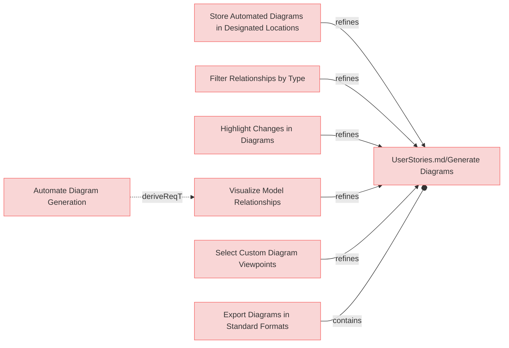
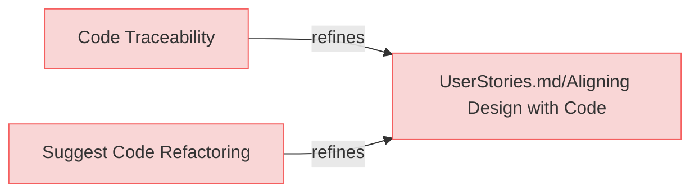
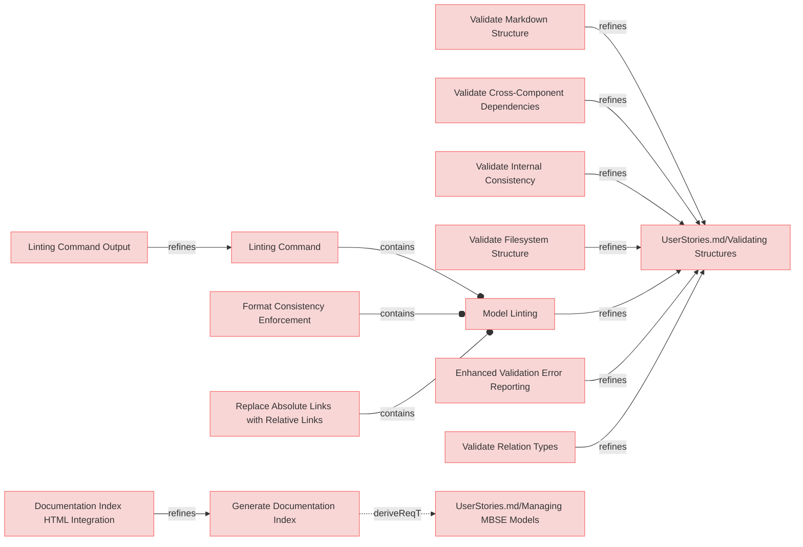
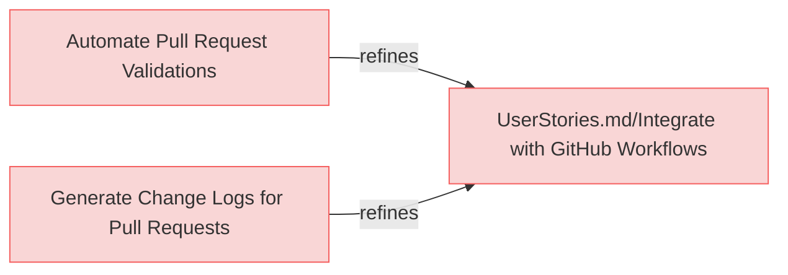
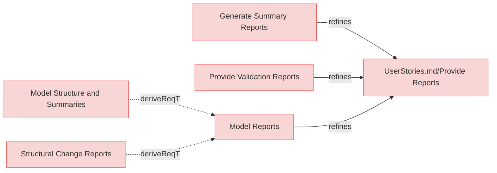
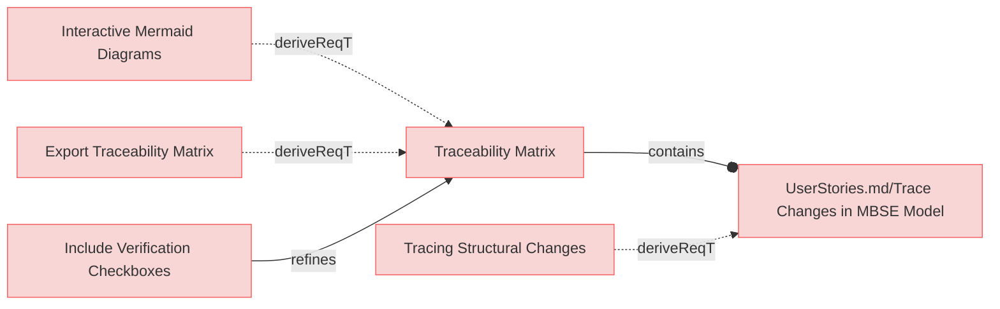
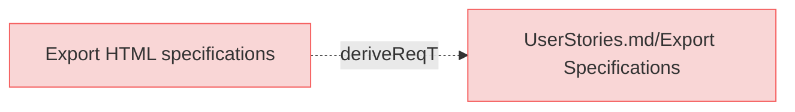
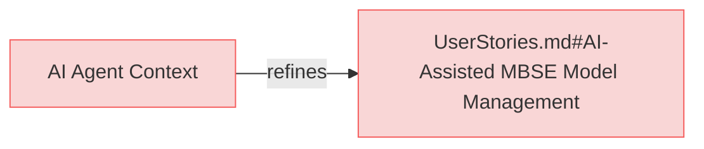
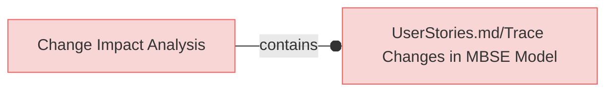

# User Requirements

## Generate Diagrams

---

### Select Custom Diagram Viewpoints

The system shall allow users to select custom viewpoints for diagrams, tailored to specific stakeholder needs.

#### Relations
  * refine: [UserStories.md/Generate Diagrams](UserStories.md#generate-diagrams)

---

### Export Diagrams in Standard Formats
The system shall allow users to export generated diagrams in standard formats (e.g., PNG, SVG, PDF) for easy sharing and presentation.

#### Relations
  * containedBy: [UserStories.md/Generate Diagrams](UserStories.md#generate-diagrams)

---

### Highlight Changes in Diagrams

The system shall provide an option to highlight changes made to the model in the generated diagrams for better traceability.

#### Relations
  * refine: [UserStories.md/Generate Diagrams](UserStories.md#generate-diagrams)

---

### Visualize Model Relationships
The system shall provide visual representations of relationships within the MBSE model in the diagrams, enabling users to understand dependencies and their impact.

#### Relations
  * refine: [UserStories.md/Generate Diagrams](UserStories.md#generate-diagrams)

---

### Automate Diagram Generation

When requested, the system shall automatically generate diagrams and save them to the required locations of the model, so that the diagrams are always accessible and up-to-date.

#### Relations
  * derivedFrom: [Visualize Model Relationships](#visualize-model-relationships)

---

### Filter Relationships by Type
The system shall allow users to filter relationships in the MBSE model by type, such as dependency, refinement, or verification when generating diagrams.

#### Relations
  * refine: [UserStories.md/Generate Diagrams](UserStories.md#generate-diagrams)

---

### Store Automated Diagrams in Designated Locations
The system shall store automatically generated diagrams in pre-configured locations in the model repository.

#### Relations
  * refine: [UserStories.md/Generate Diagrams](UserStories.md#generate-diagrams)

---

## Aligning Design with Code

---

### Code Traceability
The system shall support code traceability by using structured comments to link code implementations to corresponding requirements in the MBSE model.

#### Relations
  * refine: [UserStories.md/Aligning Design with Code](UserStories.md#aligning-design-with-code)

---

### Suggest Code Refactoring
The system shall suggest code refactoring opportunities to better align with the structure and relationships in the MBSE model.

#### Relations
  * refine: [UserStories.md/Aligning Design with Code](UserStories.md#aligning-design-with-code)

---

## Validating Structures

---

### Enhanced Validation Error Reporting
The system shall provide comprehensive validation messages that include file paths and line numbers when available, to help users quickly locate and fix model integrity and structure issues in their MBSE specifications.

#### Relations
  * refine: [UserStories.md/Validating Structures](UserStories.md#validating-structures)

---

### Model Linting
The ssystem shall provide linting capabilities to identify and fix stylistic, formatting, and non-critical issues in MBSE models that don't affect functional integrity.

#### Relations
  * refine: [UserStories.md/Validating Structures](UserStories.md#validating-structures)

---

### Linting Command
The system shall provide a linting command that by default automatically applies fixes to stylistic and non-critical formatting issues, while offering option to preview changes without applying them.

#### Relations
  * containedBy: [Model Linting](#model-linting)

---

### Linting Command Output
The system shall display linting changes suggestion in similar manner as git diffs.

#### Relations
  * refine: [Linting Command](#linting-command)

---

### Replace Absolute Links with Relative Links
The system shall replace absolute links with relative links, where applicable and contextually appropriate, to conform to repository standards and enhance portability.

#### Relations
  * containedBy: [Model Linting](#model-linting)

---

### Format Consistency Enforcement
The system shall provide linting capability to ensure consistent formatting in requirements documents.

#### Details
  * Trimming excess whitespace after element names and relation identifiers
  * Normalizing to exactly two newlines before subsections (e.g., "#### Details")
  * Automatically inserting separator lines ("---") between elements if not already present
  * Ensuring consistent indentation in relation lists

#### Relations
  * containedBy: [Model Linting](#model-linting)

---

### Generate Documentation Index
The system shall generate an index.md file in the specifications root folder during linting that contains a structured summary of all specification documents and folders.

#### Relations
  * derivedFrom: [UserStories.md/Managing MBSE Models](UserStories.md#managing-mbse-models)

---

### Documentation Index HTML Integration
The index.md file shall be converted to index.md when HTML output is generated, serving as the primary entry point for HTML documentation.

#### Relations
  * refine: [Generate Documentation Index](#generate-documentation-index)

---

### Validate Markdown Structure
The system shall validate the Markdown structure of MBSE documentation to ensure compliance with formatting standards.

#### Relations
  * refine: [UserStories.md/Validating Structures](UserStories.md#validating-structures)

---

### Validate Filesystem Structure
The system shall validate the organization of files and folders in the repository to ensure consistency with the MBSE methodology.

#### Relations
  * refine: [UserStories.md/Validating Structures](UserStories.md#validating-structures)

---

### Validate Internal Consistency
The system shall check the internal consistency of the MBSE model, ensuring that relationships and elements align correctly.

#### Relations
  * refine: [UserStories.md/Validating Structures](UserStories.md#validating-structures)

---

### Validate Cross-Component Dependencies
The system shall validate dependencies across different components of the MBSE model to identify mismatches or gaps.

#### Relations
  * refine: [UserStories.md/Validating Structures](UserStories.md#validating-structures)

---

### Validate Relation Types

The system shall validate relation types and allow only supported types.

#### Relations
  * refine: [UserStories.md/Validating Structures](UserStories.md#validating-structures)

---

## Integrate with GitHub Workflows

---

### Automate Pull Request Validations
The system shall automate validations of pull requests in the GitHub workflow to ensure model consistency before merging.

#### Relations
  * refine: [UserStories.md/Integrate with GitHub Workflows](UserStories.md#integrate-with-github-workflows)

---

### Generate Change Logs for Pull Requests
The system shall generate detailed change logs for pull requests, summarizing modifications to the MBSE model and related components.

#### Relations
  * refine: [UserStories.md/Integrate with GitHub Workflows](UserStories.md#integrate-with-github-workflows)

---

## Provide Reports

---

### Model Reports
When requested the system shall provide human readable MBSE model reports.

#### Relations
  * refine: [UserStories.md/Provide Reports](UserStories.md#provide-reports)

---

### Model Structure and Summaries
When requested the system shall generate reports summarizing the structure and relationships in the MBSE model, including counts and types of connections.

#### Relations
  * derivedFrom: [Model Reports](#model-reports)

---

### Structural Change Reports

The system shall generate detailed reports summarizing the impact of structural changes, including affected relationships and components.

#### Relations
  * derivedFrom: [Model Reports](#model-reports)

---

### Provide Validation Reports
The system shall generate detailed validation reports, highlighting any inconsistencies or errors in the MBSE model structure.

#### Relations
  * refine: [UserStories.md/Provide Reports](UserStories.md#provide-reports)

---

### Generate Summary Reports

The system shall allow users to generate summary reports highlighting key metrics and statuses within the MBSE model.

#### Relations
  * refine: [UserStories.md/Provide Reports](UserStories.md#provide-reports)

---

## Trace Changes in MBSE Model

---

### Tracing Structural Changes

When tracing structural changes, the system shall analyze the MBSE model and diffs to identify affected components and generate a report of impacted elements and structures, so that the user can review the changes and decide on further actions.

#### Relations
  * derivedFrom: [UserStories.md/Trace Changes in MBSE Model](UserStories.md#trace-changes-in-mbse-model)

---

### Traceability Matrix

When requested the system shall generate traceability matrices, in Markdown format by default, and supporting different views.

#### Details

Requirements-to-Verification View:
  * Maps each requirement to one or more verification activities, tests, or validation procedures. This helps track which requirements are verified and how.

#### Info

A matrix is a textual representation which is the most efficient way to convey numerous relationships within a compact space.

#### Relations
  * containedBy: [UserStories.md/Trace Changes in MBSE Model](UserStories.md#trace-changes-in-mbse-model)

---

### Include Verification Checkboxes

The system shall include checkboxes in the traceability matrix for each verification entry, allowing users to manually mark verification as completed.

#### Relations
  * refine: [Traceability Matrix](#traceability-matrix)

---

### Export Traceability Matrix

The system shall provide an option to export the traceability matrix in formats such as Excel or PDF for external sharing and analysis.

#### Relations
  * derivedFrom: [Traceability Matrix](#traceability-matrix)

---

### Interactive Mermaid Diagrams

The system shall include Mermaid diagrams in the traceability matrix that provide interactive links to related elements in other documents, enabling navigation and exploration of dependencies.

#### Details

Diagrams must be broken into several diagrams using following logic:
 * requirements_file_name/'## paragraph name'
   * all requirements inside are 1 diagram
   * if requirements documents doesn't have '##' paragraphs then requirements file name is used only
   * external related resources box must be a link to actual resource

Color code for rendering diagrams:
 * red for requirement
 * yellow for resources which satisfies requirement
 * green for verifiction which verifies requirement
 * light blue for box representing another diagram/category with requirments where linked requirement or resource exist.

#### Relations
  * derivedFrom: [Traceability Matrix](#traceability-matrix)

---

## Exporting Specifications

---

### Export HTML specifications

The system shall export specifications into HTML format and save in designated output location.

#### Relations
  * derivedFrom: [UserStories.md/Export Specifications](UserStories.md#export-specifications)

---

## AI-Driven Model Suggestions

---

### AI Agent Context

The system shall provide needed context for AI agents to understand how to use reqvire and methodology.

#### Relations
  * refine: [UserStories.md#AI-Assisted MBSE Model Management](UserStories.md#ai-assisted-mbse-model-management)

---

## Trace Changes

---

### Change Impact Analysis

When requested the system shall generate change impact report, in Markdown format by default and also supporting json output.

#### Details

Change Report:
 * Overview of all the changes in the model and impact to related requirements and other system elements.

Change Impact Analysis Report:
  * When a requirement changes, the traceability helps identify:
    * Which related requirements are affected by a change.
    * Which verification procedures or test cases are impacted and potentially invalidated.
    * Which other model elements might be affected.

#### Relations
  * containedBy: [UserStories.md/Trace Changes in MBSE Model](UserStories.md#trace-changes-in-mbse-model)

---