# User Stories and User Requirements

User requirements describe the specific functionalities and capabilities that users expect from the system. They focus on *what* the system must provide to fulfill user needs, improve user experience, and achieve business objectives as well as capture specific needs of end-users.


User requirements are directly related to user story and expected format is following:
```
## User story title

As a user, I want to:
   * some user story
   * another related user story
   
   
### Requirement title

Requirement text.

### Requirement title

Requirement text.


```

Example:
```


## User Sign-Up and Sign-In

As a user, I want to:
  * Sign up for the platform using either email or a federated login provider.
  * Validate my email when signing up via email.
  * Sign in using either email or a federated login provider.
  * Reset my password if I forget it.

### Email Signup
The system shall allow users to sign up using an email address.

### Federated Login Signup
The system shall allow users to sign up using a federated login provider.

### Email Validation
When a user signs up using an email address, the system shall send a validation email.

### Email Sign-In
The system shall allow users to sign in using an email address.

### Federated Login Sign-In
The system shall allow users to sign in using a federated login provider.

### Password Reset
When a user forgets their password, the system shall allow them to reset their password.

---

```


The user stories and requirements are derived from the use case diagram provided below:

```mermaid   
flowchart LR    

    user[User👤]

    subgraph "GDB Product usecase diagram"
        signup((Sign Up))
        signin((Sign In))

        emailSignup[Sign Up via Email]
        validateEmail[Validate Email]
        federatedLogin[Sign Up via Federated Login]
        federatedLoginSignIn[Sign In via Federated Login]
        emailLogin[Sign In via Email]
        PasswordReset[Reset Password]  
    
    end


    %% Relationships for Sign Up and Sign In
    user --> signup
    user --> signin
    signup -. include .-> emailSignup
    emailSignup -. with .-> validateEmail
    signup -. include .-> federatedLogin
    signin -. include .-> federatedLoginSignIn
    signin -. include .-> emailLogin
    emailLogin -. with .-> PasswordReset    

```



