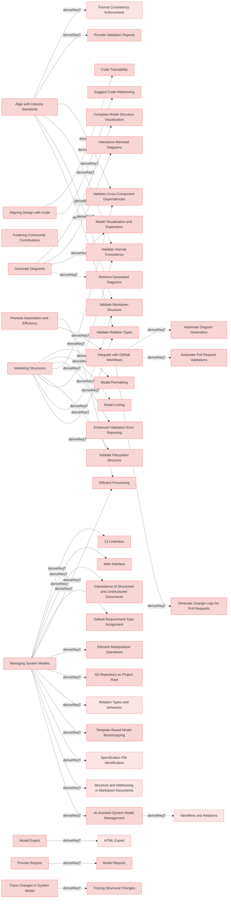

# Requirements

```mermaid
graph LR;
  %% REQVIRE-AUTOGENERATED-DIAGRAM
  %% Graph styling
  classDef userRequirement fill:#f9d6d6,stroke:#f55f5f,stroke-width:1px;
  classDef systemRequirement fill:#fce4e4,stroke:#e68a8a,stroke-width:1px;
  classDef verification fill:#d6f9d6,stroke:#5fd75f,stroke-width:1px;
  classDef default fill:#f5f5f5,stroke:#333333,stroke-width:1px;

  8c8c33ba0c6249d1["AI-Assisted System Model Management"];
  class 8c8c33ba0c6249d1 userRequirement;
  click 8c8c33ba0c6249d1 "UserStories.md#ai-assisted-system-model-management";
  6e6ce5b5e93ac423["Identifiers and Relations"];
  class 6e6ce5b5e93ac423 systemRequirement;
  click 6e6ce5b5e93ac423 "System/StructureAndParsing.md#identifiers-and-relations";
  8c8c33ba0c6249d1 -.->|deriveReqT| 6e6ce5b5e93ac423;
  b3410eccc9703232["Align with Industry Standards"];
  class b3410eccc9703232 userRequirement;
  click b3410eccc9703232 "UserStories.md#align-with-industry-standards";
  416d98eefd31dee3["Format Consistency Enforcement"];
  class 416d98eefd31dee3 systemRequirement;
  click 416d98eefd31dee3 "System/Formatting.md#format-consistency-enforcement";
  b3410eccc9703232 -.->|deriveReqT| 416d98eefd31dee3;
  9c9b9aa3155688f3["Provide Validation Reports"];
  class 9c9b9aa3155688f3 userRequirement;
  click 9c9b9aa3155688f3 "System/Reporting.md#provide-validation-reports";
  b3410eccc9703232 -.->|deriveReqT| 9c9b9aa3155688f3;
  637c1508441834d0["Validate Cross-Component Dependencies"];
  class 637c1508441834d0 userRequirement;
  click 637c1508441834d0 "System/Validation.md#validate-cross-component-dependencies";
  b3410eccc9703232 -.->|deriveReqT| 637c1508441834d0;
  93dfcb0f0d842641["Validate Internal Consistency"];
  class 93dfcb0f0d842641 userRequirement;
  click 93dfcb0f0d842641 "System/Validation.md#validate-internal-consistency";
  b3410eccc9703232 -.->|deriveReqT| 93dfcb0f0d842641;
  7acb63b03cf52c6f["Validate Markdown Structure"];
  class 7acb63b03cf52c6f userRequirement;
  click 7acb63b03cf52c6f "System/Validation.md#validate-markdown-structure";
  b3410eccc9703232 -.->|deriveReqT| 7acb63b03cf52c6f;
  75edbbb74412662d["Validate Relation Types"];
  class 75edbbb74412662d userRequirement;
  click 75edbbb74412662d "System/Validation.md#validate-relation-types";
  b3410eccc9703232 -.->|deriveReqT| 75edbbb74412662d;
  855a1b3061c7bcdd["Aligning Design with Code"];
  class 855a1b3061c7bcdd userRequirement;
  click 855a1b3061c7bcdd "UserStories.md#aligning-design-with-code";
  2ac6b5a3a1e6b515["Code Traceability"];
  class 2ac6b5a3a1e6b515 userRequirement;
  click 2ac6b5a3a1e6b515 "System/CodeAlignment.md#code-traceability";
  855a1b3061c7bcdd -.->|deriveReqT| 2ac6b5a3a1e6b515;
  d581fd94ce306316["Suggest Code Refactoring"];
  class d581fd94ce306316 userRequirement;
  click d581fd94ce306316 "System/CodeAlignment.md#suggest-code-refactoring";
  855a1b3061c7bcdd -.->|deriveReqT| d581fd94ce306316;
  1c32d488dd358c54["Fostering Community Contributions"];
  class 1c32d488dd358c54 userRequirement;
  click 1c32d488dd358c54 "UserStories.md#fostering-community-contributions";
  37a5b8e199a838f["Generate Diagrams"];
  class 37a5b8e199a838f userRequirement;
  click 37a5b8e199a838f "UserStories.md#generate-diagrams";
  71adfd59da9ff84f["Complete Model Structure Visualization"];
  class 71adfd59da9ff84f userRequirement;
  click 71adfd59da9ff84f "System/DiagramGeneration.md#complete-model-structure-visualization";
  37a5b8e199a838f -.->|deriveReqT| 71adfd59da9ff84f;
  5be870a7fe3078ce["Interactive Mermaid Diagrams"];
  class 5be870a7fe3078ce userRequirement;
  click 5be870a7fe3078ce "System/DiagramGeneration.md#interactive-mermaid-diagrams";
  37a5b8e199a838f -.->|deriveReqT| 5be870a7fe3078ce;
  c57d76a5aa346a53["Model Visualization and Exploration"];
  class c57d76a5aa346a53 userRequirement;
  click c57d76a5aa346a53 "System/DiagramGeneration.md#model-visualization-and-exploration";
  37a5b8e199a838f -.->|deriveReqT| c57d76a5aa346a53;
  8fccd7073a4d582["Remove Generated Diagrams"];
  class 8fccd7073a4d582 userRequirement;
  click 8fccd7073a4d582 "System/DiagramGeneration.md#remove-generated-diagrams";
  37a5b8e199a838f -.->|deriveReqT| 8fccd7073a4d582;
  98eaeddc27f99e11["Integrate with GitHub Workflows"];
  class 98eaeddc27f99e11 userRequirement;
  click 98eaeddc27f99e11 "UserStories.md#integrate-with-github-workflows";
  f1b3aa9ecd256e77["Automate Diagram Generation"];
  class f1b3aa9ecd256e77 userRequirement;
  click f1b3aa9ecd256e77 "System/GitHubIntegration.md#automate-diagram-generation";
  98eaeddc27f99e11 -.->|deriveReqT| f1b3aa9ecd256e77;
  1080a1eb81fc4bbf["Automate Pull Request Validations"];
  class 1080a1eb81fc4bbf userRequirement;
  click 1080a1eb81fc4bbf "System/GitHubIntegration.md#automate-pull-request-validations";
  98eaeddc27f99e11 -.->|deriveReqT| 1080a1eb81fc4bbf;
  aac8b8bec20319fa["Generate Change Logs for Pull Requests"];
  class aac8b8bec20319fa userRequirement;
  click aac8b8bec20319fa "System/GitHubIntegration.md#generate-change-logs-for-pull-requests";
  98eaeddc27f99e11 -.->|deriveReqT| aac8b8bec20319fa;
  3f1b65e8cdc9ec2["Managing System Models"];
  class 3f1b65e8cdc9ec2 userRequirement;
  click 3f1b65e8cdc9ec2 "UserStories.md#managing-system-models";
  1ac3e4fc194fd9d["CLI interface"];
  class 1ac3e4fc194fd9d userRequirement;
  click 1ac3e4fc194fd9d "Interfaces/Interfaces.md#cli-interface";
  3f1b65e8cdc9ec2 -.->|deriveReqT| 1ac3e4fc194fd9d;
  adfe41db00d52285["Web Interface"];
  class adfe41db00d52285 userRequirement;
  click adfe41db00d52285 "Interfaces/Interfaces.md#web-interface";
  3f1b65e8cdc9ec2 -.->|deriveReqT| adfe41db00d52285;
  fc73aaf423ccdbca["Coexistence of Structured and Unstructured Documents"];
  class fc73aaf423ccdbca userRequirement;
  click fc73aaf423ccdbca "System/ModelManagement.md#coexistence-of-structured-and-unstructured-documents";
  3f1b65e8cdc9ec2 -.->|deriveReqT| fc73aaf423ccdbca;
  6809edf871add06a["Default Requirement Type Assignment"];
  class 6809edf871add06a userRequirement;
  click 6809edf871add06a "System/ModelManagement.md#default-requirement-type-assignment";
  3f1b65e8cdc9ec2 -.->|deriveReqT| 6809edf871add06a;
  dd224415c58ae90f["Efficient Processing"];
  class dd224415c58ae90f userRequirement;
  click dd224415c58ae90f "System/ModelManagement.md#efficient-processing";
  3f1b65e8cdc9ec2 -.->|deriveReqT| dd224415c58ae90f;
  8653ca8c1766105d["Element Manipulation Operations"];
  class 8653ca8c1766105d userRequirement;
  click 8653ca8c1766105d "System/ModelManagement.md#element-manipulation-operations";
  3f1b65e8cdc9ec2 -.->|deriveReqT| 8653ca8c1766105d;
  674b333d552bcab0["Git Repository as Project Root"];
  class 674b333d552bcab0 userRequirement;
  click 674b333d552bcab0 "System/ModelManagement.md#git-repository-as-project-root";
  3f1b65e8cdc9ec2 -.->|deriveReqT| 674b333d552bcab0;
  c661b225443ae709["Relation Types and behaviors"];
  class c661b225443ae709 systemRequirement;
  click c661b225443ae709 "System/ModelManagement.md#relation-types-and-behaviors";
  3f1b65e8cdc9ec2 -.->|deriveReqT| c661b225443ae709;
  1d5ad841d768c48["Template-Based Model Bootstrapping"];
  class 1d5ad841d768c48 userRequirement;
  click 1d5ad841d768c48 "System/ModelManagement.md#template-based-model-bootstrapping";
  3f1b65e8cdc9ec2 -.->|deriveReqT| 1d5ad841d768c48;
  8621d0377762987f["Specification File Identification"];
  class 8621d0377762987f systemRequirement;
  click 8621d0377762987f "System/StructureAndParsing.md#specification-file-identification";
  3f1b65e8cdc9ec2 -.->|deriveReqT| 8621d0377762987f;
  9da2c9df563c07bb["Structure and Addressing in Markdown Documents"];
  class 9da2c9df563c07bb systemRequirement;
  click 9da2c9df563c07bb "System/StructureAndParsing.md#structure-and-addressing-in-markdown-documents";
  3f1b65e8cdc9ec2 -.->|deriveReqT| 9da2c9df563c07bb;
  3f1b65e8cdc9ec2 -.->|deriveReqT| 8c8c33ba0c6249d1;
  59725c25046f87ea["Model Export"];
  class 59725c25046f87ea userRequirement;
  click 59725c25046f87ea "UserStories.md#model-export";
  59093bf57f656ef3["HTML Export"];
  class 59093bf57f656ef3 systemRequirement;
  click 59093bf57f656ef3 "Interfaces/WebInterface.md#html-export";
  59725c25046f87ea -.->|deriveReqT| 59093bf57f656ef3;
  fb0bd4dff95f6353["Promote Automation and Efficiency"];
  class fb0bd4dff95f6353 userRequirement;
  click fb0bd4dff95f6353 "UserStories.md#promote-automation-and-efficiency";
  fb0bd4dff95f6353 -.->|deriveReqT| dd224415c58ae90f;
  fb0bd4dff95f6353 -.->|deriveReqT| 98eaeddc27f99e11;
  91a0adb0b4d959c4["Provide Reports"];
  class 91a0adb0b4d959c4 userRequirement;
  click 91a0adb0b4d959c4 "UserStories.md#provide-reports";
  1c6b7180f4e0214a["Model Reports"];
  class 1c6b7180f4e0214a userRequirement;
  click 1c6b7180f4e0214a "System/Reporting.md#model-reports";
  91a0adb0b4d959c4 -.->|deriveReqT| 1c6b7180f4e0214a;
  c1d30a22e99f4417["Trace Changes in System Model"];
  class c1d30a22e99f4417 userRequirement;
  click c1d30a22e99f4417 "UserStories.md#trace-changes-in-system-model";
  a4e0aaa5c14c250b["Tracing Structural Changes"];
  class a4e0aaa5c14c250b userRequirement;
  click a4e0aaa5c14c250b "System/Reporting.md#tracing-structural-changes";
  c1d30a22e99f4417 -.->|deriveReqT| a4e0aaa5c14c250b;
  113748a94885138d["Validating Structures"];
  class 113748a94885138d userRequirement;
  click 113748a94885138d "UserStories.md#validating-structures";
  8a37a2f2cdcda820["Model Formatting"];
  class 8a37a2f2cdcda820 userRequirement;
  click 8a37a2f2cdcda820 "System/Formatting.md#model-formatting";
  113748a94885138d -.->|deriveReqT| 8a37a2f2cdcda820;
  2158f3cb9fd89442["Model Linting"];
  class 2158f3cb9fd89442 userRequirement;
  click 2158f3cb9fd89442 "System/Linting.md#model-linting";
  113748a94885138d -.->|deriveReqT| 2158f3cb9fd89442;
  f7984d9de36af48f["Enhanced Validation Error Reporting"];
  class f7984d9de36af48f userRequirement;
  click f7984d9de36af48f "System/Validation.md#enhanced-validation-error-reporting";
  113748a94885138d -.->|deriveReqT| f7984d9de36af48f;
  113748a94885138d -.->|deriveReqT| 637c1508441834d0;
  500b81dacddd4c4f["Validate Filesystem Structure"];
  class 500b81dacddd4c4f userRequirement;
  click 500b81dacddd4c4f "System/Validation.md#validate-filesystem-structure";
  113748a94885138d -.->|deriveReqT| 500b81dacddd4c4f;
  113748a94885138d -.->|deriveReqT| 93dfcb0f0d842641;
  113748a94885138d -.->|deriveReqT| 7acb63b03cf52c6f;
  113748a94885138d -.->|deriveReqT| 75edbbb74412662d;
```
### Align with Industry Standards

As as **System Engineer**, I want to work with the system that adheres to widely recognized industry standards, such as ISO/IEC/IEEE 15288, to ensure compatibility and relevance in systems engineering practices.

#### Metadata
  * type: user-requirement
---

### Promote Automation and Efficiency

As as **System Engineer**, I would like to reduce manual effort in managing requirements, models, and traceability by automating routine tasks.

#### Metadata
  * type: user-requirement
---

### Managing System Models

As an **System Engineer**, I want to manage System models effectively, so that I can ensure they align with project requirements and deliverable goals.

#### Metadata
  * type: user-requirement
---

### AI-Assisted System Model Management

As a **Systems Engineer**, I want to efficiently manage System models using AI-powered tools and LLM-based assistants.

#### Metadata
  * type: user-requirement

#### Relations
  * derivedFrom: [Managing System Models](#managing-system-models)
---

### Generate Diagrams

As a **System Engineer**, I want to generate diagrams for different system viewpoints, so that I can communicate system architecture effectively and understand dependencies and impacts across the system.

#### Metadata
  * type: user-requirement
---

### Model Export

As a **Manager**, I want to export specifications into diferent formats including HTML, so that I can communicate system architecture effectively.

#### Details
All exports shall produce deterministic output with consistent ordering to enable reliable version control and reproducible builds.

The system shall ensure deterministic export output by:
- Sorting elements by identifier before processing
- Sorting relations by type and target identifier
- Maintaining consistent file ordering alphabetically

This determinism ensures that:
- Running exports multiple times produces byte-identical output
- Version control diffs reflect actual content changes
- Continuous integration pipelines produce reproducible results

#### Metadata
  * type: user-requirement
---

### Aligning Design with Code

As a **Developer**, I want to align code with System models, so that implementation remains consistent with design specifications.

#### Metadata
  * type: user-requirement
---

### Validating Structures

As an **System Engineer**, I want to validate the structure of System models, so that I can ensure compliance with organizational and project standards.

#### Metadata
  * type: user-requirement
---

### Integrate with GitHub Workflows

As a **Contributor**, I want Reqvire to integrate seamlessly with GitHub workflows, so that I can collaborate on updates and manage contributions effectively.

#### Metadata
  * type: user-requirement

#### Relations
  * derivedFrom: [Promote Automation and Efficiency](#promote-automation-and-efficiency)
---

### Provide Reports

As a **Manager**, I want to generate structured reports based on the System model, so that I can track progress and ensure alignment with organizational objectives.

#### Metadata
  * type: user-requirement
---

### Trace Changes in System Model

As a **System Engineer**, I want to trace changes in the System model to identify affected components and ensure all updates are consistent across the system.

#### Metadata
  * type: user-requirement
---

### Fostering Community Contributions

As a **Contributor**, I want Reqvire tools to be intuitive and well-documented, so that I can contribute effectively to the open-source project.

#### Metadata
  * type: user-requirement
---
