# User stories

## Personas
1. System Engineer: Focused on managing system models, ensuring alignment with project requirements, and validating structures.  
2. SOI Developer: Implements features and makes system changes based on MBSE models, ensuring consistency between design and code.  
3. Contributor: An external community member contributing to ReqFlow by improving models, creating features, or providing feedback.  
4. Manager: Oversees the MBSE processes, tracks progress, ensures alignment with objectives, and generates reports for decision-making.  

---

## User Stories

```mermaid
graph LR;
  %% Graph styling
  classDef requirement fill:#f9d6d6,stroke:#f55f5f,stroke-width:1px;
  classDef verification fill:#d6f9d6,stroke:#5fd75f,stroke-width:1px;
  classDef externalLink fill:#d0e0ff,stroke:#3080ff,stroke-width:1px;
  classDef default fill:#f5f5f5,stroke:#333333,stroke-width:1px;

  100197ce81["Export Specifications"];
  click 100197ce81 "UserStories.md#export-specifications";
  class 100197ce81 requirement;
  f6237e49f7["MOEs.md/MOE_UA"];
  class f6237e49f7 requirement;
  click f6237e49f7 "MOEs.md#moe_ua";
  100197ce81 -->|traces| f6237e49f7;
  72c7eda618["Export HTML specifications"];
  class 72c7eda618 requirement;
  click 72c7eda618 "UserRequirements.md#export-html-specifications";
  72c7eda618 -.->|deriveReqT| 100197ce81;
  cf0026c2fe["Generate Diagrams"];
  click cf0026c2fe "UserStories.md#generate-diagrams";
  class cf0026c2fe requirement;
  cf0026c2fe -->|traces| f6237e49f7;
  fd7388e379["Highlight Changes in Diagrams"];
  class fd7388e379 requirement;
  click fd7388e379 "UserRequirements.md#highlight-changes-in-diagrams";
  cf0026c2fe -->|relates to| fd7388e379;
  10c00a1bd1["Export Diagrams in Standard Formats"];
  class 10c00a1bd1 requirement;
  click 10c00a1bd1 "UserRequirements.md#export-diagrams-in-standard-formats";
  cf0026c2fe --o|contains| 10c00a1bd1;
  30d97803eb["Filter Relationships by Type"];
  class 30d97803eb requirement;
  click 30d97803eb "UserRequirements.md#filter-relationships-by-type";
  cf0026c2fe -->|relates to| 30d97803eb;
  a6a8362836["Visualize Model Relationships"];
  class a6a8362836 requirement;
  click a6a8362836 "UserRequirements.md#visualize-model-relationships";
  cf0026c2fe -->|relates to| a6a8362836;
  aee397f35b["Store Automated Diagrams in Designated Locations"];
  class aee397f35b requirement;
  click aee397f35b "UserRequirements.md#store-automated-diagrams-in-designated-locations";
  cf0026c2fe -->|relates to| aee397f35b;
  30053341d8["Select Custom Diagram Viewpoints"];
  class 30053341d8 requirement;
  click 30053341d8 "UserRequirements.md#select-custom-diagram-viewpoints";
  cf0026c2fe -->|relates to| 30053341d8;
  a4657fca5a["AI-Driven Code Suggestions"];
  click a4657fca5a "UserStories.md#ai-driven-code-suggestions";
  class a4657fca5a requirement;
  a4657fca5a -->|traces| f6237e49f7;
  e19f1380d9["Analyze Code for Alignment ---> Needs more work"];
  class e19f1380d9 requirement;
  click e19f1380d9 "UserRequirements.md#analyze-code-for-alignment---->-needs-more-work";
  a4657fca5a -->|relates to| e19f1380d9;
  c6d300e51a["Highlight Potential Code-Model Conflicts --> also too advanced for now"];
  class c6d300e51a requirement;
  click c6d300e51a "UserRequirements.md#highlight-potential-code-model-conflicts--->-also-too-advanced-for-now";
  a4657fca5a -->|relates to| c6d300e51a;
  71ba0e325e["Suggest Refactoring for MBSE Consistency  ---> Needs more work"];
  class 71ba0e325e requirement;
  click 71ba0e325e "UserRequirements.md#suggest-refactoring-for-mbse-consistency----->-needs-more-work";
  a4657fca5a -->|relates to| 71ba0e325e;
  cdc9a9c908["Fostering Community Contributions"];
  click cdc9a9c908 "UserStories.md#fostering-community-contributions";
  class cdc9a9c908 requirement;
  b3f57e49f7["MOEs.md/MOE_CE"];
  class b3f57e49f7 requirement;
  click b3f57e49f7 "MOEs.md#moe_ce";
  cdc9a9c908 -->|traces| b3f57e49f7;
  6912d98267["AI-Driven Model Suggestions"];
  click 6912d98267 "UserStories.md#ai-driven-model-suggestions";
  class 6912d98267 requirement;
  6912d98267 -->|traces| f6237e49f7;
  ec56dd665a["Provide Actionable Model Improvement Suggestions"];
  class ec56dd665a requirement;
  click ec56dd665a "UserRequirements.md#provide-actionable-model-improvement-suggestions";
  6912d98267 -->|relates to| ec56dd665a;
  a60d88b6e2["Validating Structures"];
  click a60d88b6e2 "UserStories.md#validating-structures";
  class a60d88b6e2 requirement;
  a60d88b6e2 -->|traces| f6237e49f7;
  d834cc4bc9["Validate Filesystem Structure"];
  class d834cc4bc9 requirement;
  click d834cc4bc9 "UserRequirements.md#validate-filesystem-structure";
  a60d88b6e2 -->|relates to| d834cc4bc9;
  103ddb8dc3["Model Linting"];
  class 103ddb8dc3 requirement;
  click 103ddb8dc3 "UserRequirements.md#model-linting";
  a60d88b6e2 -->|relates to| 103ddb8dc3;
  7b1772417b["Validate Markdown Structure"];
  class 7b1772417b requirement;
  click 7b1772417b "UserRequirements.md#validate-markdown-structure";
  a60d88b6e2 -->|relates to| 7b1772417b;
  7cf5cf9900["Enhanced Validation Error Reporting"];
  class 7cf5cf9900 requirement;
  click 7cf5cf9900 "UserRequirements.md#enhanced-validation-error-reporting";
  a60d88b6e2 -->|relates to| 7cf5cf9900;
  9e524ac696["Validate Internal Consistency"];
  class 9e524ac696 requirement;
  click 9e524ac696 "UserRequirements.md#validate-internal-consistency";
  a60d88b6e2 -->|relates to| 9e524ac696;
  6e40bf9f83["Validate Cross-Component Dependencies"];
  class 6e40bf9f83 requirement;
  click 6e40bf9f83 "UserRequirements.md#validate-cross-component-dependencies";
  a60d88b6e2 -->|relates to| 6e40bf9f83;
  852dea6cfe["Managing MBSE Models"];
  click 852dea6cfe "UserStories.md#managing-mbse-models";
  class 852dea6cfe requirement;
  852dea6cfe -->|traces| f6237e49f7;
  96bbd81f5c["Bootstrap Model Structure"];
  class 96bbd81f5c requirement;
  click 96bbd81f5c "ManagingMbseModelsRequirements.md#bootstrap-model-structure";
  852dea6cfe -->|relates to| 96bbd81f5c;
  daadd8e583["Coexistence of Structured and Unstructured Documents"];
  class daadd8e583 requirement;
  click daadd8e583 "ManagingMbseModelsRequirements.md#coexistence-of-structured-and-unstructured-documents";
  852dea6cfe -->|relates to| daadd8e583;
  f5b5eaeb28["Generate Documentation Index"];
  class f5b5eaeb28 requirement;
  click f5b5eaeb28 "UserRequirements.md#generate-documentation-index";
  f5b5eaeb28 -.->|deriveReqT| 852dea6cfe;
  ce24dbacb9["Project Configuration with YAML"];
  class ce24dbacb9 requirement;
  click ce24dbacb9 "ManagingMbseModelsRequirements.md#project-configuration-with-yaml";
  852dea6cfe -->|relates to| ce24dbacb9;
  21e4eb87cb["Efficient Processing"];
  class 21e4eb87cb requirement;
  click 21e4eb87cb "ManagingMbseModelsRequirements.md#efficient-processing";
  852dea6cfe -->|relates to| 21e4eb87cb;
  de2d3516cd["Aligning Design with Code"];
  click de2d3516cd "UserStories.md#aligning-design-with-code";
  class de2d3516cd requirement;
  de2d3516cd -->|traces| f6237e49f7;
  1fc4e44d5f["Code Traceability"];
  class 1fc4e44d5f requirement;
  click 1fc4e44d5f "UserRequirements.md#code-traceability";
  de2d3516cd -->|relates to| 1fc4e44d5f;
  5922f3ef03["Suggest Code Refactoring"];
  class 5922f3ef03 requirement;
  click 5922f3ef03 "UserRequirements.md#suggest-code-refactoring";
  de2d3516cd -->|relates to| 5922f3ef03;
  36d8b2eb16["Trace Changes in MBSE Model"];
  click 36d8b2eb16 "UserStories.md#trace-changes-in-mbse-model";
  class 36d8b2eb16 requirement;
  36d8b2eb16 -->|traces| f6237e49f7;
  bae5edae94["Change Impact Analysis"];
  class bae5edae94 requirement;
  click bae5edae94 "UserRequirements.md#change-impact-analysis";
  36d8b2eb16 --o|contains| bae5edae94;
  ba40352f8e["Traceability Matrix"];
  class ba40352f8e requirement;
  click ba40352f8e "UserRequirements.md#traceability-matrix";
  36d8b2eb16 --o|contains| ba40352f8e;
  91ebf7e73d["Tracing Structural Changes"];
  class 91ebf7e73d requirement;
  click 91ebf7e73d "UserRequirements.md#tracing-structural-changes";
  91ebf7e73d -.->|deriveReqT| 36d8b2eb16;
  fe32882ee2["Provide Reports"];
  click fe32882ee2 "UserStories.md#provide-reports";
  class fe32882ee2 requirement;
  fe32882ee2 -->|traces| b3f57e49f7;
  596c459d31["Generate Summary Reports"];
  class 596c459d31 requirement;
  click 596c459d31 "UserRequirements.md#generate-summary-reports";
  fe32882ee2 -->|relates to| 596c459d31;
  d0e9e8d143["Generate Verifications Reports"];
  class d0e9e8d143 requirement;
  click d0e9e8d143 "UserRequirements.md#generate-verifications-reports";
  fe32882ee2 -->|relates to| d0e9e8d143;
  2afa7f3a20["Export Reports to Standard Formats"];
  class 2afa7f3a20 requirement;
  click 2afa7f3a20 "UserRequirements.md#export-reports-to-standard-formats";
  fe32882ee2 -->|relates to| 2afa7f3a20;
  f8e7625d29["Model Reports"];
  class f8e7625d29 requirement;
  click f8e7625d29 "UserRequirements.md#model-reports";
  fe32882ee2 -->|relates to| f8e7625d29;
  482c757913["Provide Validation Reports"];
  class 482c757913 requirement;
  click 482c757913 "UserRequirements.md#provide-validation-reports";
  fe32882ee2 -->|relates to| 482c757913;
  812d42f453["Generate Dependency Reports"];
  class 812d42f453 requirement;
  click 812d42f453 "UserRequirements.md#generate-dependency-reports";
  fe32882ee2 -->|relates to| 812d42f453;
  ba120b7caf["Integrate with GitHub Workflows"];
  click ba120b7caf "UserStories.md#integrate-with-github-workflows";
  class ba120b7caf requirement;
  ba120b7caf -->|traces| b3f57e49f7;
  b2a387077d["Generate Change Logs for Pull Requests"];
  class b2a387077d requirement;
  click b2a387077d "UserRequirements.md#generate-change-logs-for-pull-requests";
  ba120b7caf -->|relates to| b2a387077d;
  68454e6166["Automate Pull Request Validations"];
  class 68454e6166 requirement;
  click 68454e6166 "UserRequirements.md#automate-pull-request-validations";
  ba120b7caf -->|relates to| 68454e6166;
```

---

### Managing MBSE Models
As an **System Engineer**, I want to manage MBSE models effectively, so that I can ensure they align with project requirements and deliverable goals.

#### Relations
  * trace: [MOEs.md/MOE_UA](MOEs.md#moe_ua)

---

### Generate Diagrams
As a **System Engineer**, I want to generate diagrams for different system viewpoints, so that I can communicate system architecture effectively and understand dependencies and impacts across the system.

#### Relations
  * trace: [MOEs.md/MOE_UA](MOEs.md#moe_ua)

---

### Export Specifications
As a **Manager**, I want to export specifications into diferent formats including HTML, so that I can communicate system architecture effectively.

#### Relations
  * trace: [MOEs.md/MOE_UA](MOEs.md#moe_ua)

---

### Aligning Design with Code
As a **Developer**, I want to align code with MBSE models, so that implementation remains consistent with design specifications.

#### Relations
  * trace: [MOEs.md/MOE_UA](MOEs.md#moe_ua)

---

### Validating Structures
As an **System Engineer**, I want to validate the structure of MBSE models, so that I can ensure compliance with organizational and project standards.

#### Relations
  * trace: [MOEs.md/MOE_UA](MOEs.md#moe_ua)

---

### Integrate with GitHub Workflows
As a **Contributor**, I want ReqFlow to integrate seamlessly with GitHub workflows, so that I can collaborate on updates and manage contributions effectively.

#### Relations
  * trace: [MOEs.md/MOE_CE](MOEs.md#moe_ce)

---

### AI-Driven Code Suggestions
As a **Developer**, I want AI agents to provide actionable suggestions for code improvements, so that I can accelerate development tasks.

#### Relations
  * trace: [MOEs.md/MOE_UA](MOEs.md#moe_ua)

---

### AI-Driven Model Suggestions
		
As a **System Engineer**, I want AI agents to provide actionable suggestions for model improvements, so that I can refine the system design and maintain alignment with project requirements.

#### Relations
  * trace: [MOEs.md/MOE_UA](MOEs.md#moe_ua)

---

### Provide Reports
As a **Manager**, I want to generate structured reports based on the MBSE model, so that I can track progress and ensure alignment with organizational objectives.

#### Relations
  * trace: [MOEs.md/MOE_CE](MOEs.md#moe_ce)

---

### Trace Changes in MBSE Model
As a **System Engineer**, I want to trace changes in the MBSE model to identify affected components and ensure all updates are consistent across the system.

#### Relations
  * trace: [MOEs.md/MOE_UA](MOEs.md#moe_ua)

---

### Fostering Community Contributions
As a **Contributor**, I want ReqFlow tools to be intuitive and well-documented, so that I can contribute effectively to the open-source project.

#### Relations
  * trace: [MOEs.md/MOE_CE](MOEs.md#moe_ce)