# Validating Structures

## Requirements

```mermaid
graph LR;
  %% REQVIRE-AUTOGENERATED-DIAGRAM
  %% Graph styling
  classDef userRequirement fill:#f9d6d6,stroke:#f55f5f,stroke-width:1px;
  classDef systemRequirement fill:#fce4e4,stroke:#e68a8a,stroke-width:1px;
  classDef verification fill:#d6f9d6,stroke:#5fd75f,stroke-width:1px;
  classDef default fill:#f5f5f5,stroke:#333333,stroke-width:1px;

  3c180ecbd258a8b3["Documentation Index for HTML Export"];
  class 3c180ecbd258a8b3 userRequirement;
  click 3c180ecbd258a8b3 "Validation.md#documentation-index-for-html-export";
  ed03f89aa02f9313["HTML Navigation Enhancement"];
  class ed03f89aa02f9313 systemRequirement;
  click ed03f89aa02f9313 "ReqvireTool/UserInterface/WebInterface.md#html-navigation-enhancement";
  3c180ecbd258a8b3 -.->|deriveReqT| ed03f89aa02f9313;
  21223366cdd4ce90["Index Generation"];
  class 21223366cdd4ce90 systemRequirement;
  click 21223366cdd4ce90 "ReqvireTool/UserInterface/WebInterface.md#index-generation";
  3c180ecbd258a8b3 -.->|deriveReqT| 21223366cdd4ce90;
  71f959f03ed35c96["Enhanced Validation Error Reporting"];
  class 71f959f03ed35c96 userRequirement;
  click 71f959f03ed35c96 "Validation.md#enhanced-validation-error-reporting";
  626279768f0dd586["Detailed Error Handling and Logging"];
  class 626279768f0dd586 systemRequirement;
  click 626279768f0dd586 "ReqvireTool/UserInterface/CLI.md#detailed-error-handling-and-logging";
  71f959f03ed35c96 -.->|deriveReqT| 626279768f0dd586;
  27e30811e4587820["Validate Command"];
  class 27e30811e4587820 systemRequirement;
  click 27e30811e4587820 "ReqvireTool/UserInterface/CLI.md#validate-command";
  71f959f03ed35c96 -.->|deriveReqT| 27e30811e4587820;
  d1c4f6a4da249044["Relation Type Validation"];
  class d1c4f6a4da249044 systemRequirement;
  click d1c4f6a4da249044 "ReqvireTool/ValidationAndReporting/Validation.md#relation-type-validation";
  71f959f03ed35c96 -.->|deriveReqT| d1c4f6a4da249044;
  6e24e906a1c9d5ec["Format Consistency Enforcement"];
  class 6e24e906a1c9d5ec userRequirement;
  click 6e24e906a1c9d5ec "Validation.md#format-consistency-enforcement";
  565cc5dfa0512876["Document Structure Normalization"];
  class 565cc5dfa0512876 systemRequirement;
  click 565cc5dfa0512876 "ReqvireTool/ValidationAndReporting/Formatting.md#document-structure-normalization";
  6e24e906a1c9d5ec -.->|deriveReqT| 565cc5dfa0512876;
  48079820e0958064["Excess Whitespace Format Implementation"];
  class 48079820e0958064 systemRequirement;
  click 48079820e0958064 "ReqvireTool/ValidationAndReporting/Formatting.md#excess-whitespace-format-implementation";
  6e24e906a1c9d5ec -.->|deriveReqT| 48079820e0958064;
  b3dfaa5f76484ceb["Inconsistent Newlines Format Implementation"];
  class b3dfaa5f76484ceb systemRequirement;
  click b3dfaa5f76484ceb "ReqvireTool/ValidationAndReporting/Formatting.md#inconsistent-newlines-format-implementation";
  6e24e906a1c9d5ec -.->|deriveReqT| b3dfaa5f76484ceb;
  61f2a6a1c9804b94["Missing Separators Format Implementation"];
  class 61f2a6a1c9804b94 systemRequirement;
  click 61f2a6a1c9804b94 "ReqvireTool/ValidationAndReporting/Formatting.md#missing-separators-format-implementation";
  6e24e906a1c9d5ec -.->|deriveReqT| 61f2a6a1c9804b94;
  b92b29e4582bfb78["Reserved Subsections Format Implementation"];
  class b92b29e4582bfb78 systemRequirement;
  click b92b29e4582bfb78 "ReqvireTool/ValidationAndReporting/Formatting.md#reserved-subsections-format-implementation";
  6e24e906a1c9d5ec -.->|deriveReqT| b92b29e4582bfb78;
  cb2aebc3f45a9485["Formatting Output"];
  class cb2aebc3f45a9485 userRequirement;
  click cb2aebc3f45a9485 "Validation.md#formatting-output";
  39d8198b424886f5["Git-Style Diff Output for Format"];
  class 39d8198b424886f5 systemRequirement;
  click 39d8198b424886f5 "ReqvireTool/ValidationAndReporting/Formatting.md#git-style-diff-output-for-format";
  cb2aebc3f45a9485 -.->|deriveReqT| 39d8198b424886f5;
  cbf799ca7544494f["Model Formatting"];
  class cbf799ca7544494f userRequirement;
  click cbf799ca7544494f "Validation.md#model-formatting";
  8c22c72bf047a650["Format Command"];
  class 8c22c72bf047a650 systemRequirement;
  click 8c22c72bf047a650 "ReqvireTool/UserInterface/CLI.md#format-command";
  cbf799ca7544494f -.->|deriveReqT| 8c22c72bf047a650;
  cbf799ca7544494f -.->|deriveReqT| 6e24e906a1c9d5ec;
  cbf799ca7544494f -.->|deriveReqT| cb2aebc3f45a9485;
  c904c9c769f7b038["Replace Absolute Links with Relative Links"];
  class c904c9c769f7b038 userRequirement;
  click c904c9c769f7b038 "Validation.md#replace-absolute-links-with-relative-links";
  cbf799ca7544494f -.->|deriveReqT| c904c9c769f7b038;
  c3ea27eb9d610e25["Model Linting"];
  class c3ea27eb9d610e25 userRequirement;
  click c3ea27eb9d610e25 "Validation.md#model-linting";
  5cf5c9e2e5f6f00d["CLI Lint Command"];
  class 5cf5c9e2e5f6f00d systemRequirement;
  click 5cf5c9e2e5f6f00d "ReqvireTool/UserInterface/CLI.md#cli-lint-command";
  c3ea27eb9d610e25 -.->|deriveReqT| 5cf5c9e2e5f6f00d;
  c17206ef87710036["Lint Output Formatting"];
  class c17206ef87710036 systemRequirement;
  click c17206ef87710036 "ReqvireTool/ValidationAndReporting/Lint.md#lint-output-formatting";
  c3ea27eb9d610e25 -.->|deriveReqT| c17206ef87710036;
  825309264fad98c5["Multi-Branch Convergence Detection"];
  class 825309264fad98c5 systemRequirement;
  click 825309264fad98c5 "ReqvireTool/ValidationAndReporting/Lint.md#multi-branch-convergence-detection";
  c3ea27eb9d610e25 -.->|deriveReqT| 825309264fad98c5;
  cce1ce5ef1ee8588["Redundant Hierarchical Relations Detection"];
  class cce1ce5ef1ee8588 systemRequirement;
  click cce1ce5ef1ee8588 "ReqvireTool/ValidationAndReporting/Lint.md#redundant-hierarchical-relations-detection";
  c3ea27eb9d610e25 -.->|deriveReqT| cce1ce5ef1ee8588;
  4517ba9864214f8f["Redundant Verify Relations Detection"];
  class 4517ba9864214f8f systemRequirement;
  click 4517ba9864214f8f "ReqvireTool/ValidationAndReporting/Lint.md#redundant-verify-relations-detection";
  c3ea27eb9d610e25 -.->|deriveReqT| 4517ba9864214f8f;
  735766802775ec41["Format Command Requirements Verification"];
  class 735766802775ec41 verification;
  click 735766802775ec41 "Verifications/Misc.md#format-command-requirements-verification";
  c904c9c769f7b038 -.->|verifiedBy| 735766802775ec41;
  5e9e8e0fea56c140["Validate Cross-Component Dependencies"];
  class 5e9e8e0fea56c140 userRequirement;
  click 5e9e8e0fea56c140 "Validation.md#validate-cross-component-dependencies";
  19ef88dd52a92a0a["Cross-Component Dependency Validator"];
  class 19ef88dd52a92a0a systemRequirement;
  click 19ef88dd52a92a0a "ReqvireTool/ValidationAndReporting/Validation.md#cross-component-dependency-validator";
  5e9e8e0fea56c140 -.->|deriveReqT| 19ef88dd52a92a0a;
  a68fec329e0c9e29["Validate Filesystem Structure"];
  class a68fec329e0c9e29 userRequirement;
  click a68fec329e0c9e29 "Validation.md#validate-filesystem-structure";
  51f3a96863c8744b["Validate Internal Consistency"];
  class 51f3a96863c8744b userRequirement;
  click 51f3a96863c8744b "Validation.md#validate-internal-consistency";
  19106261e8369e50["Internal Consistency Validator"];
  class 19106261e8369e50 systemRequirement;
  click 19106261e8369e50 "ReqvireTool/ValidationAndReporting/Validation.md#internal-consistency-validator";
  51f3a96863c8744b -.->|deriveReqT| 19106261e8369e50;
  6f1d7610c2419511["Two-Pass Validation Strategy"];
  class 6f1d7610c2419511 systemRequirement;
  click 6f1d7610c2419511 "ReqvireTool/ValidationAndReporting/Validation.md#two-pass-validation-strategy";
  51f3a96863c8744b -.->|deriveReqT| 6f1d7610c2419511;
  11b5fe3115be7b77["Validate Markdown Structure"];
  class 11b5fe3115be7b77 userRequirement;
  click 11b5fe3115be7b77 "Validation.md#validate-markdown-structure";
  bc1555a765d8bca3["Markdown Structure Validator"];
  class bc1555a765d8bca3 systemRequirement;
  click bc1555a765d8bca3 "ReqvireTool/ValidationAndReporting/Validation.md#markdown-structure-validator";
  11b5fe3115be7b77 -.->|deriveReqT| bc1555a765d8bca3;
  377c97439aac9d3b["Validate Relation Types"];
  class 377c97439aac9d3b userRequirement;
  click 377c97439aac9d3b "Validation.md#validate-relation-types";
  7444737db501bf59["Relation Element Type Validator"];
  class 7444737db501bf59 systemRequirement;
  click 7444737db501bf59 "ReqvireTool/ValidationAndReporting/Validation.md#relation-element-type-validator";
  377c97439aac9d3b -.->|deriveReqT| 7444737db501bf59;
  9048171ff5d2f3ed["HTML Navigation Bar"];
  class 9048171ff5d2f3ed userRequirement;
  click 9048171ff5d2f3ed "Export.md#html-navigation-bar";
  d9257e6077381f1c["Model-Centric View Generation"];
  class d9257e6077381f1c systemRequirement;
  click d9257e6077381f1c "ReqvireTool/UserInterface/WebInterface.md#model-centric-view-generation";
  9048171ff5d2f3ed -.->|deriveReqT| d9257e6077381f1c;
  921cf01dfc917e8f["Whole Model Diagram Generation"];
  class 921cf01dfc917e8f systemRequirement;
  click 921cf01dfc917e8f "ReqvireTool/UserInterface/WebInterface.md#whole-model-diagram-generation";
  9048171ff5d2f3ed -.->|deriveReqT| 921cf01dfc917e8f;
  9048171ff5d2f3ed -.->|deriveReqT| 3c180ecbd258a8b3;
  3a807a8535fb41fa["base.html"];
  class 3a807a8535fb41fa default;
  click 3a807a8535fb41fa "../core/templates/base.html";
  9048171ff5d2f3ed -->|satisfiedBy| 3a807a8535fb41fa;
  c196fa9b3e2c2258["model.html"];
  class c196fa9b3e2c2258 default;
  click c196fa9b3e2c2258 "../core/templates/model.html";
  9048171ff5d2f3ed -->|satisfiedBy| c196fa9b3e2c2258;
  6318258d140045e2["Align with Industry Standards"];
  class 6318258d140045e2 userRequirement;
  click 6318258d140045e2 "Mission.md#align-with-industry-standards";
  13b1d75fa43ceda2["Provide Validation Reports"];
  class 13b1d75fa43ceda2 userRequirement;
  click 13b1d75fa43ceda2 "Reports.md#provide-validation-reports";
  6318258d140045e2 -.->|deriveReqT| 13b1d75fa43ceda2;
  6318258d140045e2 -.->|deriveReqT| 6e24e906a1c9d5ec;
  6318258d140045e2 -.->|deriveReqT| 5e9e8e0fea56c140;
  6318258d140045e2 -.->|deriveReqT| 51f3a96863c8744b;
  6318258d140045e2 -.->|deriveReqT| 11b5fe3115be7b77;
  6318258d140045e2 -.->|deriveReqT| 377c97439aac9d3b;
  e9ad540a6411a0fc["MOE_CE"];
  class e9ad540a6411a0fc default;
  click e9ad540a6411a0fc "MOEs.md#moe_ce";
  6318258d140045e2 -.->|trace| e9ad540a6411a0fc;
  c1bbfdadfce7e10a["Deterministic Output for All Generated Content"];
  class c1bbfdadfce7e10a systemRequirement;
  click c1bbfdadfce7e10a "ReqvireTool/ValidationAndReporting/Reports.md#deterministic-output-for-all-generated-content";
  5575b01daa5155ad["Complete Model Structure Visualization"];
  class 5575b01daa5155ad userRequirement;
  click 5575b01daa5155ad "DiagramGeneration.md#complete-model-structure-visualization";
  c1bbfdadfce7e10a -.->|deriveReqT| 5575b01daa5155ad;
  d64c45036b5300a["Interactive Mermaid Diagrams"];
  class d64c45036b5300a userRequirement;
  click d64c45036b5300a "DiagramGeneration.md#interactive-mermaid-diagrams";
  c1bbfdadfce7e10a -.->|deriveReqT| d64c45036b5300a;
  58b20ede35a77731["Model Visualization and Exploration"];
  class 58b20ede35a77731 userRequirement;
  click 58b20ede35a77731 "DiagramGeneration.md#model-visualization-and-exploration";
  c1bbfdadfce7e10a -.->|deriveReqT| 58b20ede35a77731;
  fc4865d1e9b57596["Change Impact Analysis"];
  class fc4865d1e9b57596 userRequirement;
  click fc4865d1e9b57596 "Reports.md#change-impact-analysis";
  c1bbfdadfce7e10a -.->|deriveReqT| fc4865d1e9b57596;
  8ebc9188f44f7785["Model Structure and Summaries"];
  class 8ebc9188f44f7785 userRequirement;
  click 8ebc9188f44f7785 "Reports.md#model-structure-and-summaries";
  c1bbfdadfce7e10a -.->|deriveReqT| 8ebc9188f44f7785;
  c1bbfdadfce7e10a -.->|deriveReqT| 13b1d75fa43ceda2;
  30c2f7b2360f1dc9["Verification Coverage Report"];
  class 30c2f7b2360f1dc9 userRequirement;
  click 30c2f7b2360f1dc9 "Reports.md#verification-coverage-report";
  c1bbfdadfce7e10a -.->|deriveReqT| 30c2f7b2360f1dc9;
  a43a5abca24c066c["HTML Export"];
  class a43a5abca24c066c systemRequirement;
  click a43a5abca24c066c "ReqvireTool/UserInterface/WebInterface.md#html-export";
  c1bbfdadfce7e10a -.->|deriveReqT| a43a5abca24c066c;
  c1bbfdadfce7e10a -.->|deriveReqT| c3ea27eb9d610e25;
  e994deee8fced81b["Relation Types and behaviors"];
  class e994deee8fced81b systemRequirement;
  click e994deee8fced81b "Structure/SpecificationsRequirements.md#relation-types-and-behaviors";
  c860d0d799c1948f["Trace Relation Non-Directional Behavior"];
  class c860d0d799c1948f systemRequirement;
  click c860d0d799c1948f "ReqvireTool/ModelManagement/DiagramGeneration.md#trace-relation-non-directional-behavior";
  e994deee8fced81b -.->|deriveReqT| c860d0d799c1948f;
  e994deee8fced81b -.->|deriveReqT| 377c97439aac9d3b;
  9450d4313f47ef36["relation.rs"];
  class 9450d4313f47ef36 default;
  click 9450d4313f47ef36 "../core/src/relation.rs";
  e994deee8fced81b -->|satisfiedBy| 9450d4313f47ef36;
  113748a94885138d["Validating Structures"];
  class 113748a94885138d userRequirement;
  click 113748a94885138d "UserStories.md#validating-structures";
  113748a94885138d -.->|deriveReqT| 71f959f03ed35c96;
  113748a94885138d -.->|deriveReqT| cbf799ca7544494f;
  113748a94885138d -.->|deriveReqT| c3ea27eb9d610e25;
  113748a94885138d -.->|deriveReqT| 5e9e8e0fea56c140;
  113748a94885138d -.->|deriveReqT| a68fec329e0c9e29;
  113748a94885138d -.->|deriveReqT| 51f3a96863c8744b;
  113748a94885138d -.->|deriveReqT| 11b5fe3115be7b77;
  113748a94885138d -.->|deriveReqT| 377c97439aac9d3b;
  2c5f30f14e792200["MOE_UA"];
  class 2c5f30f14e792200 default;
  click 2c5f30f14e792200 "MOEs.md#moe_ua";
  113748a94885138d -.->|trace| 2c5f30f14e792200;
```

### Enhanced Validation Error Reporting

The system shall provide comprehensive validation messages that include file paths and line numbers when available, to help users quickly locate and fix model integrity and structure issues in their MBSE specifications.

#### Metadata
  * type: user-requirement

#### Relations
  * derivedFrom: [Validating Structures](UserStories.md#validating-structures)
---

### Model Formatting

The system shall provide formatting capabilities to normalize and standardize MBSE models for consistency and readability.

#### Metadata
  * type: user-requirement

#### Relations
  * derivedFrom: [Validating Structures](UserStories.md#validating-structures)
---

### Model Linting

The system shall provide model linting capabilities to analyze model quality and detect issues in requirements relations.

#### Details
The linting capability should:
- Identify issues with model relations that may need attention
- Distinguish between issues that can be automatically fixed and those requiring human judgment
- Provide clear categorization of findings to help users understand what actions are needed
- Support both reporting mode and automatic fixing mode
- Allow filtering to focus on specific categories of issues

#### Metadata
  * type: user-requirement

#### Relations
  * derivedFrom: [Validating Structures](UserStories.md#validating-structures)
  * derivedFrom: [Deterministic Output for All Generated Content](ReqvireTool/ValidationAndReporting/Reports.md#deterministic-output-for-all-generated-content)
---

### Formatting Output

The system shall display formatting changes suggestion in similar manner as git diffs.

#### Metadata
  * type: user-requirement

#### Relations
  * derivedFrom: [Model Formatting](#model-formatting)
---

### Replace Absolute Links with Relative Links

The system shall replace absolute links with relative links, where applicable and contextually appropriate, to conform to repository standards and enhance portability.

#### Metadata
  * type: user-requirement

#### Relations
  * derivedFrom: [Model Formatting](#model-formatting)
  * verifiedBy: [Format Command Requirements Verification](Verifications/Misc.md#format-command-requirements-verification)
---

### Format Consistency Enforcement

The system shall provide formatting capability to ensure consistent formatting in requirements documents.

#### Details
  * Trimming excess whitespace after element names and relation identifiers
  * Normalizing to exactly two newlines before subsections (e.g., "#### Details")
  * Automatically inserting separator lines ("---") between elements if not already present
  * Normalizing consecutive separators to single separators
  * Ensuring consistent indentation in relation lists (2-space format)
  * Normalizing relation entries to proper 2-space indentation format
  * Displaying changes with sequential line numbering that reflects final file positions
  * Providing context lines with proper line number continuity

#### Metadata
  * type: user-requirement

#### Relations
  * derivedFrom: [Model Formatting](#model-formatting)
  * derivedFrom: [Align with Industry Standards](Mission.md#align-with-industry-standards)
---

### Documentation Index for HTML Export

The system shall automatically generate an index document during HTML export that contains a structured summary of all specification documents and folders, serving as the primary entry point (index.html) for HTML documentation.

#### Metadata
  * type: user-requirement

#### Relations
  * derivedFrom: [HTML Navigation Bar](Export.md#html-navigation-bar)
---

### Validate Markdown Structure

The system shall validate the Markdown structure of MBSE documentation to ensure compliance with formatting standards.

#### Metadata
  * type: user-requirement

#### Relations
  * derivedFrom: [Validating Structures](UserStories.md#validating-structures)
  * derivedFrom: [Align with Industry Standards](Mission.md#align-with-industry-standards)
---

### Validate Filesystem Structure

The system shall validate the organization of files and folders in the repository to ensure consistency with the MBSE methodology.

#### Metadata
  * type: user-requirement

#### Relations
  * derivedFrom: [Validating Structures](UserStories.md#validating-structures)
---

### Validate Internal Consistency

The system shall check the internal consistency of the MBSE model, ensuring that relationships and elements align correctly.

#### Metadata
  * type: user-requirement

#### Relations
  * derivedFrom: [Validating Structures](UserStories.md#validating-structures)
  * derivedFrom: [Align with Industry Standards](Mission.md#align-with-industry-standards)
---

### Validate Cross-Component Dependencies

The system shall validate dependencies across different components of the MBSE model to identify mismatches or gaps.

#### Metadata
  * type: user-requirement

#### Relations
  * derivedFrom: [Validating Structures](UserStories.md#validating-structures)
  * derivedFrom: [Align with Industry Standards](Mission.md#align-with-industry-standards)
---

### Validate Relation Types

The system shall validate relation types and allow only supported types.

#### Metadata
  * type: user-requirement

#### Relations
  * derivedFrom: [Validating Structures](UserStories.md#validating-structures)
  * derivedFrom: [Align with Industry Standards](Mission.md#align-with-industry-standards)
  * derivedFrom: [Relation Types and behaviors](Structure/SpecificationsRequirements.md#relation-types-and-behaviors)
---