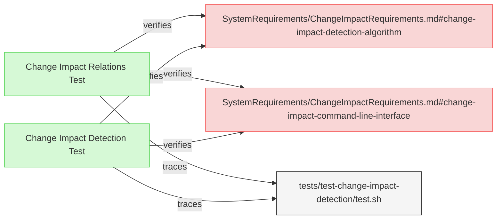

# Change Impact Tests

This document verifies the requirements for ReqFlow's change impact tracing functionality.

## Change Impact Tracing Verification

---

### Change Impact Detection Test

This test verifies that the system correctly implements change impact detection, including proper default handling of the git commit parameter.

#### Metadata
  * type: verification

#### Acceptance Criteria
- System correctly detects changes between different versions of requirements
- System properly constructs a change impact report based on relationships between elements
- Default git commit is HEAD when --git-commit parameter is not provided

#### Test Criteria
- Command exits with success (0) return code
- Change impact report shows expected elements
- Change impact report shows correct relationships between elements
- Output format matches requested format (text or JSON)
- Both explicit and implicit git commit parameters work properly

#### Relations
  * verify: [SystemRequirements/ChangeImpactRequirements.md#change-impact-detection-algorithm](../SystemRequirements/ChangeImpactRequirements.md#change-impact-detection-algorithm)
  * verify: [SystemRequirements/ChangeImpactRequirements.md#change-impact-command-line-interface](../SystemRequirements/ChangeImpactRequirements.md#change-impact-command-line-interface)
  * trace: [tests/test-change-impact-detection/test.sh](../../tests/test-change-impact-detection/test.sh)

---

### Change Impact Relations Test

This test verifies that the system correctly handles different relation types when calculating change impact.

#### Metadata
  * type: verification

#### Acceptance Criteria
- System correctly propagates changes through different relation types
- System respects the directionality of relations when determining impact
- System handles complex chains of relations properly

#### Test Criteria
- Command exits with success (0) return code
- Change impact report shows expected propagation through derivedFrom/derive relations
- Change impact report shows expected propagation through satisfiedBy/satisfy relations
- Change impact report shows expected propagation through verifiedBy/verify relations
- System correctly handles circular dependencies in relation chains

#### Relations
  * verify: [SystemRequirements/ChangeImpactRequirements.md#change-impact-detection-algorithm](../SystemRequirements/ChangeImpactRequirements.md#change-impact-detection-algorithm)
  * verify: [SystemRequirements/ChangeImpactRequirements.md#change-impact-command-line-interface](../SystemRequirements/ChangeImpactRequirements.md#change-impact-command-line-interface) 
  * trace: [tests/test-change-impact-detection/test.sh](../../tests/test-change-impact-detection/test.sh)
