# Change Impact Tests

This document verifies the requirements for Reqvire's change impact tracing functionality.

## Change Impact Tracing Verification

```mermaid
graph LR;
  %% Graph styling
  classDef requirement fill:#f9d6d6,stroke:#f55f5f,stroke-width:1px;
  classDef verification fill:#d6f9d6,stroke:#5fd75f,stroke-width:1px;
  classDef externalLink fill:#d0e0ff,stroke:#3080ff,stroke-width:1px;
  classDef default fill:#f5f5f5,stroke:#333333,stroke-width:1px;

  893e340d64ec8044["CLI Git Commit Hash Flag Test"];
  class 893e340d64ec8044 verification;
  click 893e340d64ec8044 "ChangeImpactTests.md#cli-git-commit-hash-flag-test";
  e95e3160edec8f1b["tests/test-change-impact-detection/test.sh"];
  class e95e3160edec8f1b default;
  click e95e3160edec8f1b "../../tests/test-change-impact-detection/test.sh";
  893e340d64ec8044 -.->|trace| e95e3160edec8f1b;
  98d7b16583855bb7["Change Impact Detection Test"];
  class 98d7b16583855bb7 verification;
  click 98d7b16583855bb7 "ChangeImpactTests.md#change-impact-detection-test";
  e95e3160edec8f1b["tests/test-change-impact-detection/test.sh"];
  class e95e3160edec8f1b default;
  click e95e3160edec8f1b "../../tests/test-change-impact-detection/test.sh";
  98d7b16583855bb7 -.->|trace| e95e3160edec8f1b;
  b72d56e7e360fe6c["Change Impact Analysis Verification"];
  class b72d56e7e360fe6c verification;
  click b72d56e7e360fe6c "ChangeImpactTests.md#change-impact-analysis-verification";
  e95e3160edec8f1b["tests/test-change-impact-detection/test.sh"];
  class e95e3160edec8f1b default;
  click e95e3160edec8f1b "../../tests/test-change-impact-detection/test.sh";
  b72d56e7e360fe6c -.->|trace| e95e3160edec8f1b;
  b0e8adb6596a35e7["Structural Change Reports Verification"];
  class b0e8adb6596a35e7 verification;
  click b0e8adb6596a35e7 "ChangeImpactTests.md#structural-change-reports-verification";
  e95e3160edec8f1b["tests/test-change-impact-detection/test.sh"];
  class e95e3160edec8f1b default;
  click e95e3160edec8f1b "../../tests/test-change-impact-detection/test.sh";
  b0e8adb6596a35e7 -.->|trace| e95e3160edec8f1b;
  a4090fe7e30eeae4["Element Content Extraction Test"];
  class a4090fe7e30eeae4 verification;
  click a4090fe7e30eeae4 "ChangeImpactTests.md#element-content-extraction-test";
  c287b52ceb52aa04["tests/test-element-content-extraction/test.sh"];
  class c287b52ceb52aa04 default;
  click c287b52ceb52aa04 "../../tests/test-element-content-extraction/test.sh";
  a4090fe7e30eeae4 -.->|trace| c287b52ceb52aa04;
  cec02a5e3f71bed1["Change Impact Relations Test"];
  class cec02a5e3f71bed1 verification;
  click cec02a5e3f71bed1 "ChangeImpactTests.md#change-impact-relations-test";
  e95e3160edec8f1b["tests/test-change-impact-detection/test.sh"];
  class e95e3160edec8f1b default;
  click e95e3160edec8f1b "../../tests/test-change-impact-detection/test.sh";
  cec02a5e3f71bed1 -.->|trace| e95e3160edec8f1b;
  11c3285e74c8d60b["Traceability Matrix Verification"];
  class 11c3285e74c8d60b verification;
  click 11c3285e74c8d60b "ChangeImpactTests.md#traceability-matrix-verification";
  e95e3160edec8f1b["tests/test-change-impact-detection/test.sh"];
  class e95e3160edec8f1b default;
  click e95e3160edec8f1b "../../tests/test-change-impact-detection/test.sh";
  11c3285e74c8d60b -.->|trace| e95e3160edec8f1b;
  4f17266696162a10["Change Impact Smart Filtering Test"];
  class 4f17266696162a10 verification;
  click 4f17266696162a10 "ChangeImpactTests.md#change-impact-smart-filtering-test";
  6cc7cc8a3f2af10b["tests/test-change-impact-smart-filtering/test.sh"];
  class 6cc7cc8a3f2af10b default;
  click 6cc7cc8a3f2af10b "../../tests/test-change-impact-smart-filtering/test.sh";
  4f17266696162a10 -.->|trace| 6cc7cc8a3f2af10b;
  4e30ea0930dc9c26["Traceability Matrix"];
  class 4e30ea0930dc9c26 requirement;
  click 4e30ea0930dc9c26 "../UserRequirements.md#traceability-matrix";
  b55d8517cd3e58["Traceability Matrix Builder Implementation"];
  class b55d8517cd3e58 requirement;
  click b55d8517cd3e58 "../SystemRequirements/Requirements.md#traceability-matrix-builder-implementation";
  4e30ea0930dc9c26 -.->|deriveReqT| b55d8517cd3e58;
  5bfc0d5fd7bba25["CLI Traces Command"];
  class 5bfc0d5fd7bba25 requirement;
  click 5bfc0d5fd7bba25 "../SystemRequirements/Requirements.md#cli-traces-command";
  4e30ea0930dc9c26 -.->|deriveReqT| 5bfc0d5fd7bba25;
  7de9a55d6102af23["Export Traceability Matrix"];
  class 7de9a55d6102af23 requirement;
  click 7de9a55d6102af23 "../UserRequirements.md#export-traceability-matrix";
  4e30ea0930dc9c26 -.->|deriveReqT| 7de9a55d6102af23;
  6d32b919c82784b7["Include Verification Checkboxes"];
  class 6d32b919c82784b7 requirement;
  click 6d32b919c82784b7 "../UserRequirements.md#include-verification-checkboxes";
  4e30ea0930dc9c26 -->|refinedBy| 6d32b919c82784b7;
  4e30ea0930dc9c26 -.->|verifiedBy| 11c3285e74c8d60b;
  1b7491b67a792bc9["Markdown Matrix Formatter"];
  class 1b7491b67a792bc9 requirement;
  click 1b7491b67a792bc9 "../SystemRequirements/Requirements.md#markdown-matrix-formatter";
  4e30ea0930dc9c26 -.->|deriveReqT| 1b7491b67a792bc9;
  bed8d0948b3e5ccd["Requirements Processing"];
  class bed8d0948b3e5ccd requirement;
  click bed8d0948b3e5ccd "../SystemRequirements/Requirements.md#requirements-processing";
  d50a859650933e55["model.rs"];
  class d50a859650933e55 default;
  click d50a859650933e55 "../../core/src/model.rs";
  bed8d0948b3e5ccd -->|satisfiedBy| d50a859650933e55;
  f22d93285fcd7664["parser.rs"];
  class f22d93285fcd7664 default;
  click f22d93285fcd7664 "../../core/src/parser.rs";
  bed8d0948b3e5ccd -->|satisfiedBy| f22d93285fcd7664;
  66582f9b6bdde6c4["Structured Markdown Files Search and Detection"];
  class 66582f9b6bdde6c4 requirement;
  click 66582f9b6bdde6c4 "../SystemRequirements/Requirements.md#structured-markdown-files-search-and-detection";
  bed8d0948b3e5ccd -.->|deriveReqT| 66582f9b6bdde6c4;
  6ca2ff1567644e78["Same-File Fragment Relations Test"];
  class 6ca2ff1567644e78 verification;
  click 6ca2ff1567644e78 "ValidationTests.md#same-file-fragment-relations-test";
  bed8d0948b3e5ccd -.->|verifiedBy| 6ca2ff1567644e78;
  bed8d0948b3e5ccd -.->|verifiedBy| a4090fe7e30eeae4;
  c8d1020a3844532d["Change Impact Detection Algorithm"];
  class c8d1020a3844532d requirement;
  click c8d1020a3844532d "../SystemRequirements/ChangeImpactPropagation.md#change-impact-detection-algorithm";
  4b89dbed94c08c3e["../../core/src/change_impact.rs"];
  class 4b89dbed94c08c3e default;
  click 4b89dbed94c08c3e "../../core/src/change_impact.rs";
  c8d1020a3844532d -->|satisfiedBy| 4b89dbed94c08c3e;
  c8d1020a3844532d -.->|verifiedBy| 98d7b16583855bb7;
  c8d1020a3844532d -.->|verifiedBy| a4090fe7e30eeae4;
  c8d1020a3844532d -.->|verifiedBy| cec02a5e3f71bed1;
  37a75398bd174177["Change Impact Command Line Interface"];
  class 37a75398bd174177 requirement;
  click 37a75398bd174177 "../SystemRequirements/ChangeImpactPropagation.md#change-impact-command-line-interface";
  80defdd4cbc7ee18["../../cli/src/cli.rs"];
  class 80defdd4cbc7ee18 default;
  click 80defdd4cbc7ee18 "../../cli/src/cli.rs";
  37a75398bd174177 -->|satisfiedBy| 80defdd4cbc7ee18;
  37a75398bd174177 -.->|verifiedBy| 98d7b16583855bb7;
  37a75398bd174177 -.->|verifiedBy| cec02a5e3f71bed1;
  9933cac5853a8584["Change Impact Analysis"];
  class 9933cac5853a8584 requirement;
  click 9933cac5853a8584 "../UserRequirements.md#change-impact-analysis";
  9933cac5853a8584 -.->|verifiedBy| b72d56e7e360fe6c;
  2054606d7574a553["Requirements Change Propagation"];
  class 2054606d7574a553 requirement;
  click 2054606d7574a553 "../SpecificationsRequirements.md#requirements-change-propagation";
  9933cac5853a8584 -->|refinedBy| 2054606d7574a553;
  ced028f36159c967["Smart Filtering for Change Impact Reports"];
  class ced028f36159c967 requirement;
  click ced028f36159c967 "../SystemRequirements/ChangeImpactPropagation.md#smart-filtering-for-change-impact-reports";
  9933cac5853a8584 -.->|deriveReqT| ced028f36159c967;
  d7b7b13a5b8d96e1["Tracing Structural Changes"];
  class d7b7b13a5b8d96e1 requirement;
  click d7b7b13a5b8d96e1 "../UserRequirements.md#tracing-structural-changes";
  d7b7b13a5b8d96e1 -.->|verifiedBy| b0e8adb6596a35e7;
  d34d7e14d2a235a2["Structural Change Analyzer"];
  class d34d7e14d2a235a2 requirement;
  click d34d7e14d2a235a2 "../SystemRequirements/Requirements.md#structural-change-analyzer";
  d7b7b13a5b8d96e1 -.->|deriveReqT| d34d7e14d2a235a2;
  6c40e66699ba40dd["CLI Git Commit Hash Flag"];
  class 6c40e66699ba40dd requirement;
  click 6c40e66699ba40dd "../SystemRequirements/Requirements.md#cli-git-commit-hash-flag";
  80defdd4cbc7ee18["cli.rs"];
  class 80defdd4cbc7ee18 default;
  click 80defdd4cbc7ee18 "../../cli/src/cli.rs";
  6c40e66699ba40dd -->|satisfiedBy| 80defdd4cbc7ee18;
  6c40e66699ba40dd -.->|verifiedBy| 893e340d64ec8044;
  4b89dbed94c08c3e["../../core/src/change_impact.rs"];
  class 4b89dbed94c08c3e default;
  click 4b89dbed94c08c3e "../../core/src/change_impact.rs";
  ced028f36159c967 -->|satisfiedBy| 4b89dbed94c08c3e;
  ced028f36159c967 -.->|verifiedBy| 98d7b16583855bb7;
  ced028f36159c967 -.->|verifiedBy| 4f17266696162a10;
```

---

### Change Impact Detection Test

This test verifies that the system correctly implements change impact detection, including proper default handling of the git commit parameter and smart filtering.

#### Metadata
  * type: verification

#### Details

##### Acceptance Criteria
- System correctly detects changes between different versions of requirements
- System properly constructs a change impact report based on relationships between elements
- Default git commit is HEAD when --git-commit parameter is not provided
- System provides output in both human-readable text and JSON formats
- Smart filtering removes redundant elements that appear in other elements' relations

##### Test Criteria
- Command exits with success (0) return code
- Change impact report shows expected elements
- Change impact report shows correct relationships between elements
- Changed elements referenced in other changed elements' relations are filtered out (e.g., "Power Saving" filtered when referenced by "Power Saving Mode")
- Output format matches requested format (text or JSON)
- Both explicit and implicit git commit parameters work properly
- JSON output is valid and contains all necessary information
- GitHub-style blob URLs are included in the output

#### Relations
  * verify: [SystemRequirements/ChangeImpactPropagation.md#change-impact-detection-algorithm](../SystemRequirements/ChangeImpactPropagation.md#change-impact-detection-algorithm)
  * verify: [SystemRequirements/ChangeImpactPropagation.md#change-impact-command-line-interface](../SystemRequirements/ChangeImpactPropagation.md#change-impact-command-line-interface)
  * verify: [SystemRequirements/ChangeImpactPropagation.md#smart-filtering-for-change-impact-reports](../SystemRequirements/ChangeImpactPropagation.md#smart-filtering-for-change-impact-reports)
  * trace: [tests/test-change-impact-detection/test.sh](../../tests/test-change-impact-detection/test.sh)

---

### Change Impact Relations Test

This test verifies that the system correctly handles different relation types when calculating change impact.

#### Metadata
  * type: verification

#### Details

##### Acceptance Criteria
- System correctly propagates changes through different relation types
- System respects the directionality of relations when determining impact
- System handles complex chains of relations properly

##### Test Criteria
- Command exits with success (0) return code
- Change impact report shows expected propagation through derivedFrom/derive relations
- Change impact report shows expected propagation through satisfiedBy/satisfy relations
- Change impact report shows expected propagation through verifiedBy/verify relations
- System correctly handles circular dependencies in relation chains

#### Relations
  * verify: [SystemRequirements/ChangeImpactPropagation.md#change-impact-detection-algorithm](../SystemRequirements/ChangeImpactPropagation.md#change-impact-detection-algorithm)
  * verify: [SystemRequirements/ChangeImpactPropagation.md#change-impact-command-line-interface](../SystemRequirements/ChangeImpactPropagation.md#change-impact-command-line-interface) 
  * trace: [tests/test-change-impact-detection/test.sh](../../tests/test-change-impact-detection/test.sh)

---

### CLI Git Commit Hash Flag Test

This test verifies that the system properly handles the git commit hash flag for change impact analysis.

#### Metadata
  * type: verification

#### Details

##### Acceptance Criteria
- System shall support --git-commit flag for change impact analysis
- System shall use specified commit hash as base for comparison
- System shall default to HEAD when flag is not specified
- System shall handle relative commit references (HEAD~1, etc.)

##### Test Criteria
- Command with explicit --git-commit flag runs successfully
- Command without flag defaults to HEAD commit
- Relative commit references are correctly resolved
- Invalid commit references are reported appropriately
- Change impact analysis correctly uses specified commit as baseline

##### Test Procedure
1. Create test fixtures with git repository containing multiple commits
2. Run Reqvire with --change-impact --git-commit=HEAD~1
3. Verify that the specified commit is used as baseline
4. Run Reqvire with --change-impact (no git-commit flag)
5. Verify that HEAD is used as default baseline
6. Run with invalid commit reference and verify appropriate error

#### Relations
  * verify: [SystemRequirements/Requirements.md#cli-git-commit-hash-flag](../SystemRequirements/Requirements.md#cli-git-commit-hash-flag)
  * trace: [tests/test-change-impact-detection/test.sh](../../tests/test-change-impact-detection/test.sh)

---

### Element Content Extraction Test

This test verifies that the system correctly extracts element content for change impact detection.

#### Metadata
  * type: verification

#### Details

##### Acceptance Criteria
- System should properly extract requirement body for change impact detection
- Requirement body should include normalized main text and content from the Details subsection
- System should handle requirements with various combinations of subsections

##### Test Criteria
- Command exits with success (0) return code
- Output shows expected content for each element
- Content extraction correctly handles different subsection ordering
- Content extraction properly handles HTML details tags

##### Test Procedure
1. Create test fixtures with requirements containing various combinations of subsections
2. Run Reqvire model summary on the test fixtures
3. Verify that extracted content matches expected content for each element
4. Verify that content from Details subsection is properly included

#### Relations
  * verify: [SystemRequirements/ChangeImpactPropagation.md#change-impact-detection-algorithm](../SystemRequirements/ChangeImpactPropagation.md#change-impact-detection-algorithm)
  * verify: [SystemRequirements/Requirements.md#Requirements Processing](../SystemRequirements/Requirements.md#requirements-processing)
  * trace: [tests/test-element-content-extraction/test.sh](../../tests/test-element-content-extraction/test.sh)

---

### Change Impact Analysis Verification

This test verifies that the system generates change impact reports when requested.

#### Metadata
  * type: verification

#### Details

##### Acceptance Criteria
- System should generate change impact reports in Markdown format
- System should support JSON output for change impact reports
- Reports should include an overview of model changes and their impact

##### Test Criteria
- Command exits with success (0) return code
- Reports contain expected impact information
- Both Markdown and JSON formats are properly supported

##### Test Procedure
TODO: write test procedure

#### Relations
  * verify: [UserRequirements.md/Change Impact Analysis](../UserRequirements.md#change-impact-analysis)
  * trace: [tests/test-change-impact-detection/test.sh](../../tests/test-change-impact-detection/test.sh)

---

### Traceability Matrix Verification

This test verifies that the system generates traceability matrices in Markdown format.

#### Metadata
  * type: verification

#### Details

##### Acceptance Criteria
- System should generate traceability matrices in Markdown format
- Matrices should support different views (Requirements-to-Verification, etc.)
- Matrices should efficiently represent relationships between elements

##### Test Criteria
- Command exits with success (0) return code
- Generated matrices contain expected relationship information
- Different matrix views are properly supported

##### Test Procedure
TODO: write test procedure

#### Relations
  * verify: [UserRequirements.md/Traceability Matrix](../UserRequirements.md#traceability-matrix)
  * trace: [tests/test-change-impact-detection/test.sh](../../tests/test-change-impact-detection/test.sh)

---

### Structural Change Reports Verification

This test verifies that the system analyzes and reports on structural changes in the MBSE model.

#### Metadata
  * type: verification

#### Details

##### Acceptance Criteria
- System should analyze structural changes in the MBSE model
- System should identify affected components through relationship traversal
- System should generate reports of impacted elements and structures

##### Test Criteria
- Command exits with success (0) return code
- Change reports correctly identify affected elements
- Relationship traversal properly determines impact propagation

##### Test Procedure
TODO: write test procedure

#### Relations
  * verify: [UserRequirements.md/Tracing Structural Changes](../UserRequirements.md#tracing-structural-changes)
  * trace: [tests/test-change-impact-detection/test.sh](../../tests/test-change-impact-detection/test.sh)

---

### Change Impact Smart Filtering Test

This test verifies that the smart filtering correctly handles new elements in change impact reports, filtering child elements while showing parent elements.

#### Metadata
  * type: test-verification

#### Details

##### Acceptance Criteria
- New parent elements appear in the "New Elements" section
- New child elements (with parent relationships to other new elements) are filtered out
- Filtered child elements are shown in parent's relations with "(new)" marker
- Verification elements that are not children remain in the report

##### Test Criteria
- When adding a parent and child requirement together, only parent appears in "New Elements"
- When adding a requirement and its verification, both appear (verification is not a child)
- Child elements are visible in the parent's change impact tree with appropriate markers

##### Test Procedure
1. Create test repository with existing requirements
2. Add new parent requirement with derive relation to new child requirement
3. Add new child requirement with derivedFrom relation to parent
4. Run change impact detection
5. Verify only parent appears in "New Elements" section
6. Verify child appears in parent's relations with "(new)" marker

#### Relations
  * verify: [SystemRequirements/ChangeImpactPropagation.md#smart-filtering-for-change-impact-reports](../SystemRequirements/ChangeImpactPropagation.md#smart-filtering-for-change-impact-reports)
  * trace: [tests/test-change-impact-smart-filtering/test.sh](../../tests/test-change-impact-smart-filtering/test.sh)

---