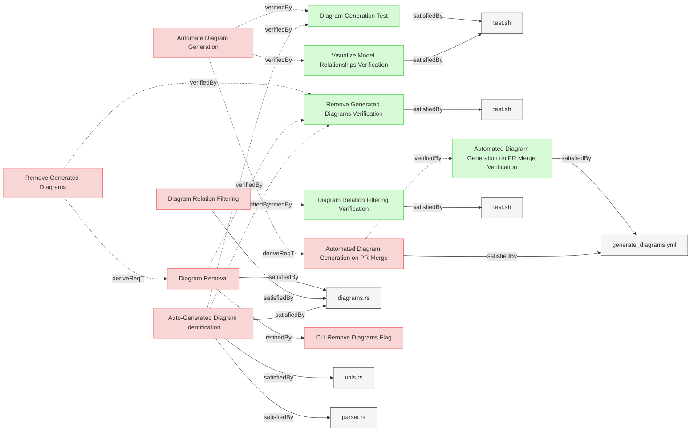

# Diagram Tests

This document verifies the requirements for Reqvire's diagram generation functionality.

## Diagram Generation Tests

### Diagram Generation Test

This test verifies that the system can automatically generate and embed mermaid diagrams in requirements documents.

#### Details

##### Acceptance Criteria
- System should process requirements files and add/update embedded mermaid diagrams
- System should create diagrams that represent relationships between elements
- System should preserve any existing custom mermaid diagrams in the documents
- System should update automatically generated diagrams when requirements change
- System should properly visualize all relationship types (verifies, trace, refines, contains, derives, satisfies, etc.)
- System should render relationships with appropriate arrows and formatting
- All auto-generated diagrams must include the REQVIRE-AUTOGENERATED-DIAGRAM marker for identification
- Marker should be embedded within the mermaid diagram as a comment for reliable identification

##### Test Criteria
- Command exits with success (0) return code
- Modified files contain the expected mermaid diagrams
- Custom mermaid diagrams are preserved
- Diagram content accurately reflects the relationships defined in the requirements
- All relationship types are correctly visualized with proper arrows and labels (verifies, trace, refines, contains, derives, satisfies)
- Special relationship types like "deriveReqT" are properly rendered
- All auto-generated diagrams contain the REQVIRE-AUTOGENERATED-DIAGRAM marker
- Marker appears as a mermaid comment within the diagram block

#### Metadata
  * type: verification

#### Relations
  * verify: [Automate Diagram Generation](../UserRequirements.md#automate-diagram-generation)
  * verify: [Auto-Generated Diagram Identification](../SystemRequirements/Requirements.md#auto-generated-diagram-identification)
  * satisfiedBy: [test.sh](../../tests/test-diagram-generation/test.sh)

---

### Visualize Model Relationships Verification

This test verifies that the system provides visual representations of relationships within the MBSE model in the generated diagrams.

#### Details

##### Acceptance Criteria
- System should generate diagrams showing relationships between model elements
- Diagrams should clearly represent different relationship types
- Visual representation should aid in understanding dependencies between elements

##### Test Criteria
- Command exits with success (0) return code
- Generated diagrams contain all expected relationship types
- Relationships are visually differentiated based on their type
- Element dependencies are clearly displayed in the diagrams

#### Metadata
  * type: verification

#### Relations
  * verify: [Automate Diagram Generation](../UserRequirements.md#automate-diagram-generation)
  * satisfiedBy: [test.sh](../../tests/test-diagram-generation/test.sh)

---

### Automated Diagram Generation on PR Merge Verification

This test verifies that the system automatically generates and updates diagrams when pull requests are merged to the main branch.

#### Details

##### Acceptance Criteria
- System should have a GitHub workflow that automatically generates diagrams on PR merge
- The workflow should only be triggered when PRs are merged to the main branch
- Generated diagrams and traceability matrix SVG should be committed back to the main branch
- The commit message should clearly indicate the automated nature of the change

##### Test Criteria
- Workflow defined in the GitHub workflow configuration correctly
- Workflow triggers only on PR merge to main branch
- Workflow correctly checks out code, builds the tool, and generates diagrams
- Workflow generates a traceability matrix SVG file
- Workflow commits and pushes changes back to the main branch
- Commit message is informative and standardized

#### Metadata
  * type: demonstration-verification

#### Relations
  * verify: [Automated Diagram Generation on PR Merge](../SystemRequirements/Requirements.md#automated-diagram-generation-on-pr-merge)
  * satisfiedBy: [generate_diagrams.yml](../../.github/workflows/generate_diagrams.yml)

---

### Diagram Relation Filtering Verification

This test verifies that the system correctly filters relations in diagram generation to render only forward relations while ensuring complete element hierarchy representation.

#### Details

##### Acceptance Criteria
- System should render only relations from DIAGRAM_RELATIONS list to prevent duplicate arrows for bidirectional relationships
- System should include parent elements in diagrams even when they belong to different sections
- System should apply list-based rendering according to DIAGRAM_RELATIONS specification
- Generated diagrams should not contain both relations from opposite pairs for the same logical relationship

##### Test Criteria
- Command exits with success (0) return code
- Diagrams contain only relations specified in DIAGRAM_RELATIONS (e.g., `contain` but not `containedBy`)
- Bidirectional relationships appear as single arrows using the relation specified in DIAGRAM_RELATIONS
- Parent elements are included when child elements are in the section
- No duplicate arrows exist for the same logical relationship
- Arrow rendering follows the DIAGRAM_RELATIONS list specification

#### Metadata
  * type: verification

#### Relations
  * verify: [Diagram Relation Filtering](../SystemRequirements/Requirements.md#diagram-relation-filtering)
  * satisfiedBy: [test.sh](../../tests/test-diagram-filtering/test.sh)

---

### Remove Generated Diagrams Verification

This test verifies that the system can remove all generated mermaid diagrams while preserving custom user-created diagrams and respecting file exclusion patterns.

#### Details

##### Acceptance Criteria
- System should remove all auto-generated mermaid diagrams identified by the REQVIRE-AUTOGENERATED-DIAGRAM marker
- System should preserve custom mermaid diagrams that do not contain the auto-generation marker
- System should respect exclusion patterns defined in reqvire.yaml configuration
- System should handle files with multiple diagrams correctly, removing only marked ones
- System should work on files without any diagrams
- System should maintain file structure and content except for diagram removal
- Auto-generated diagrams must contain the REQVIRE-AUTOGENERATED-DIAGRAM marker for identification
- Marker-based identification should work regardless of diagram location in the document

##### Test Criteria
- Command exits with success (0) return code
- Auto-generated diagrams containing REQVIRE-AUTOGENERATED-DIAGRAM marker are removed from files
- Custom diagrams without the marker are preserved regardless of their location
- Files matching exclusion patterns are not processed for diagram removal
- File structure remains intact except for diagram removal
- Element text and relationships are preserved
- Section headers and element headers are preserved
- Mixed files with both auto-generated (marked) and custom (unmarked) diagrams handle removal correctly

#### Metadata
  * type: verification

#### Relations
  * verify: [Remove Generated Diagrams](../UserRequirements.md#remove-generated-diagrams)
  * verify: [Diagram Removal](../SystemRequirements/Requirements.md#diagram-removal)
  * verify: [Auto-Generated Diagram Identification](../SystemRequirements/Requirements.md#auto-generated-diagram-identification)
  * satisfiedBy: [test.sh](../../tests/test-remove-diagrams/test.sh)

---