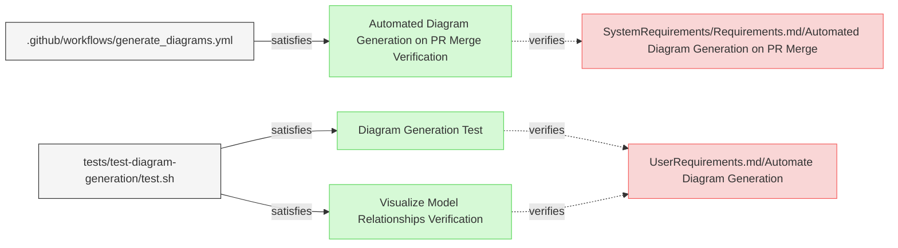

# Diagram Tests

This document verifies the requirements for Reqvire's diagram generation functionality.

## Diagram Generation Tests

---

### Diagram Generation Test

This test verifies that the system can automatically generate and embed mermaid diagrams in requirements documents.

#### Metadata
  * type: verification

#### Details 

##### Acceptance Criteria
- System should process requirements files and add/update embedded mermaid diagrams
- System should create diagrams that represent relationships between elements
- System should preserve any existing custom mermaid diagrams in the documents
- System should update automatically generated diagrams when requirements change
- System should properly visualize all relationship types (verifies, trace, refines, contains, derives, satisfies, etc.)
- System should render relationships with appropriate arrows and formatting

##### Test Criteria
- Command exits with success (0) return code
- Modified files contain the expected mermaid diagrams
- Custom mermaid diagrams are preserved 
- Diagram content accurately reflects the relationships defined in the requirements
- All relationship types are correctly visualized with proper arrows and labels (verifies, trace, refines, contains, derives, satisfies)
- Special relationship types like "deriveReqT" are properly rendered

#### Relations
  * verify: [UserRequirements.md/Automate Diagram Generation](../UserRequirements.md#automate-diagram-generation)
  * satisfiedBy: [tests/test-diagram-generation/test.sh](../../tests/test-diagram-generation/test.sh)

---

### Visualize Model Relationships Verification

This test verifies that the system provides visual representations of relationships within the MBSE model in the generated diagrams.

#### Metadata
  * type: verification

#### Details

##### Acceptance Criteria
- System should generate diagrams showing relationships between model elements
- Diagrams should clearly represent different relationship types
- Visual representation should aid in understanding dependencies between elements

##### Test Criteria
- Command exits with success (0) return code
- Generated diagrams contain all expected relationship types
- Relationships are visually differentiated based on their type
- Element dependencies are clearly displayed in the diagrams

#### Relations
  * verify: [UserRequirements.md/Automate Diagram Generation](../UserRequirements.md#automate-diagram-generation)
  * satisfiedBy: [tests/test-diagram-generation/test.sh](../../tests/test-diagram-generation/test.sh)

---

### Automated Diagram Generation on PR Merge Verification

This test verifies that the system automatically generates and updates diagrams when pull requests are merged to the main branch.

#### Metadata
  * type: demonstration-verification

#### Details

##### Acceptance Criteria
- System should have a GitHub workflow that automatically generates diagrams on PR merge
- The workflow should only be triggered when PRs are merged to the main branch
- Generated diagrams and traceability matrix SVG should be committed back to the main branch
- The commit message should clearly indicate the automated nature of the change

##### Test Criteria
- Workflow defined in the GitHub workflow configuration correctly
- Workflow triggers only on PR merge to main branch
- Workflow correctly checks out code, builds the tool, and generates diagrams
- Workflow generates a traceability matrix SVG file
- Workflow commits and pushes changes back to the main branch
- Commit message is informative and standardized

#### Relations
  * verify: [SystemRequirements/Requirements.md/Automated Diagram Generation on PR Merge](../SystemRequirements/Requirements.md#automated-diagram-generation-on-pr-merge)
  * satisfiedBy: [.github/workflows/generate_diagrams.yml](../../.github/workflows/generate_diagrams.yml)

---