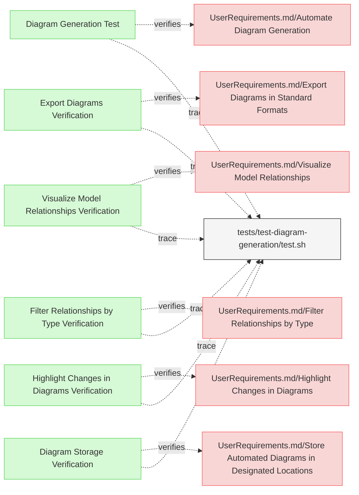

# Diagram Tests

This document verifies the requirements for ReqFlow's diagram generation functionality.

## Diagram Generation Tests

---

### Diagram Generation Test

This test verifies that the system can automatically generate and embed mermaid diagrams in requirements documents.

#### Details 

##### Acceptance Criteria
- System should process requirements files and add/update embedded mermaid diagrams
- System should create diagrams that represent relationships between elements
- System should preserve any existing custom mermaid diagrams in the documents
- System should update automatically generated diagrams when requirements change
- System should properly visualize all relationship types (verifies, trace, refines, contains, derives, satisfies, etc.)
- System should render relationships with appropriate arrows and formatting

##### Test Criteria
- Command exits with success (0) return code
- Modified files contain the expected mermaid diagrams
- Custom mermaid diagrams are preserved 
- Diagram content accurately reflects the relationships defined in the requirements
- All relationship types are correctly visualized with proper arrows and labels (verifies, trace, refines, contains, derives, satisfies)
- Special relationship types like "deriveReqT" are properly rendered

##### Test Procedure
1. Create test fixtures in `/tests/test-diagram-generation/` with requirements containing various elements and relationships
2. Create test fixtures that include custom mermaid diagrams to test preservation
3. Run ReqFlow with the `--generate-diagrams` flag on the test fixtures
4. Verify that mermaid diagrams are generated at the beginning of each file
5. Verify that existing custom mermaid diagrams are preserved
6. Verify diagram content accurately shows elements and relationships

#### Metadata
  * type: verification

#### Relations
  * verify: [UserRequirements.md/Automate Diagram Generation](../UserRequirements.md#automate-diagram-generation)
  * trace: [tests/test-diagram-generation/test.sh](../../tests/test-diagram-generation/test.sh)

---

### Visualize Model Relationships Verification

This test verifies that the system provides visual representations of relationships within the MBSE model in the generated diagrams.

#### Metadata
  * type: verification

#### Details

##### Acceptance Criteria
- System should generate diagrams showing relationships between model elements
- Diagrams should clearly represent different relationship types
- Visual representation should aid in understanding dependencies between elements

##### Test Criteria
- Command exits with success (0) return code
- Generated diagrams contain all expected relationship types
- Relationships are visually differentiated based on their type
- Element dependencies are clearly displayed in the diagrams

##### Test Procedure
TODO: write test procedure

#### Relations
  * verify: [UserRequirements.md/Visualize Model Relationships](../UserRequirements.md#visualize-model-relationships)
  * trace: [tests/test-diagram-generation/test.sh](../../tests/test-diagram-generation/test.sh)

---

### Filter Relationships by Type Verification

This test verifies that the system allows users to filter relationships in diagrams by type.

#### Metadata
  * type: verification

#### Details

##### Acceptance Criteria
- System should allow filtering of relationships by type when generating diagrams
- Filtering should support different relationship types (dependency, refinement, verification, etc.)
- Filtered diagrams should only show the selected relationship types

##### Test Criteria
- Command exits with success (0) return code
- Filtering options are correctly applied to diagram generation
- Filtered diagrams contain only the specified relationship types

##### Test Procedure
TODO: write test procedure

#### Relations
  * verify: [UserRequirements.md/Filter Relationships by Type](../UserRequirements.md#filter-relationships-by-type)
  * trace: [tests/test-diagram-generation/test.sh](../../tests/test-diagram-generation/test.sh)

---

### Diagram Storage Verification

This test verifies that the system properly stores automatically generated diagrams in pre-configured locations.

#### Metadata
  * type: verification

#### Details

##### Acceptance Criteria
- System should store generated diagrams in pre-configured locations
- Storage paths should be configurable
- Diagrams should be accessible after generation

##### Test Criteria
- Command exits with success (0) return code
- Diagrams are saved to the expected pre-configured locations
- Diagram files are properly formatted and accessible

##### Test Procedure
TODO: write test procedure

#### Relations
  * verify: [UserRequirements.md/Store Automated Diagrams in Designated Locations](../UserRequirements.md#store-automated-diagrams-in-designated-locations)
  * trace: [tests/test-diagram-generation/test.sh](../../tests/test-diagram-generation/test.sh)

---

### Export Diagrams Verification

This test verifies that the system allows users to export generated diagrams in standard formats.

#### Metadata
  * type: verification

#### Details

##### Acceptance Criteria
- System should export diagrams in standard formats (PNG, SVG, PDF)
- Export functionality should be user-accessible
- Exported diagrams should maintain visual quality and content

##### Test Criteria
- Command exits with success (0) return code
- Diagrams are exported in the requested format
- Exported files contain the expected diagram content

##### Test Procedure
TODO: write test procedure

#### Relations
  * verify: [UserRequirements.md/Export Diagrams in Standard Formats](../UserRequirements.md#export-diagrams-in-standard-formats)
  * trace: [tests/test-diagram-generation/test.sh](../../tests/test-diagram-generation/test.sh)

---

### Highlight Changes in Diagrams Verification

This test verifies that the system provides an option to highlight changes made to the model in generated diagrams.

#### Metadata
  * type: verification

#### Details

##### Acceptance Criteria
- System should highlight changes in the model when generating diagrams
- Highlighting should visually differentiate added, modified, and removed elements
- Change highlighting should be optional and user-configurable

##### Test Criteria
- Command exits with success (0) return code
- Changes in the model are visually highlighted in the diagrams
- Different types of changes have distinct visual indicators

##### Test Procedure
TODO: write test procedure

#### Relations
  * verify: [UserRequirements.md/Highlight Changes in Diagrams](../UserRequirements.md#highlight-changes-in-diagrams)
  * trace: [tests/test-diagram-generation/test.sh](../../tests/test-diagram-generation/test.sh)

---