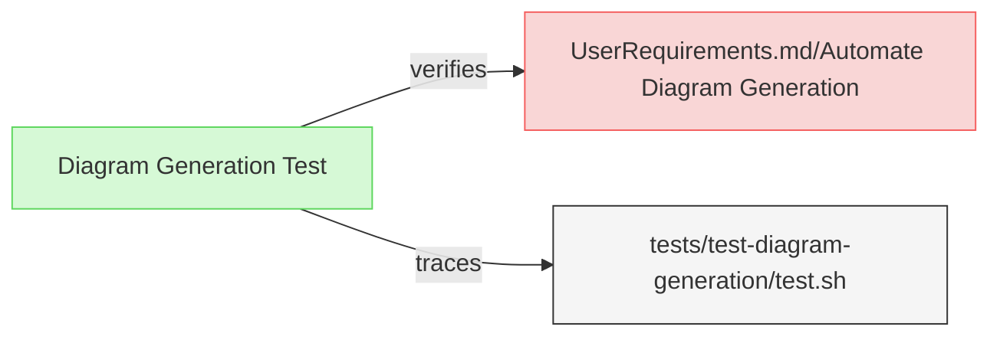

# Diagram Tests

This document verifies the requirements for ReqFlow's diagram generation functionality.

## Diagram Generation Tests

---

### Diagram Generation Test

This test verifies that the system can automatically generate and embed mermaid diagrams in requirements documents.

#### Details 

##### Acceptance Criteria
- System should process requirements files and add/update embedded mermaid diagrams
- System should create diagrams that represent relationships between elements
- System should preserve any existing custom mermaid diagrams in the documents
- System should update automatically generated diagrams when requirements change

##### Test Criteria
- Command exits with success (0) return code
- Modified files contain the expected mermaid diagrams
- Custom mermaid diagrams are preserved 
- Diagram content accurately reflects the relationships defined in the requirements

##### Test Procedure
1. Create test fixtures in `/tests/test-diagram-generation/` with requirements containing various elements and relationships
2. Create test fixtures that include custom mermaid diagrams to test preservation
3. Run ReqFlow with the `--generate-diagrams` flag on the test fixtures
4. Verify that mermaid diagrams are generated at the beginning of each file
5. Verify that existing custom mermaid diagrams are preserved
6. Verify diagram content accurately shows elements and relationships

#### Metadata
  * type: verification

#### Relations
  * verify: [UserRequirements.md/Automate Diagram Generation](../UserRequirements.md#automate-diagram-generation)
  * trace: [tests/test-diagram-generation/test.sh](../../tests/test-diagram-generation/test.sh)

---