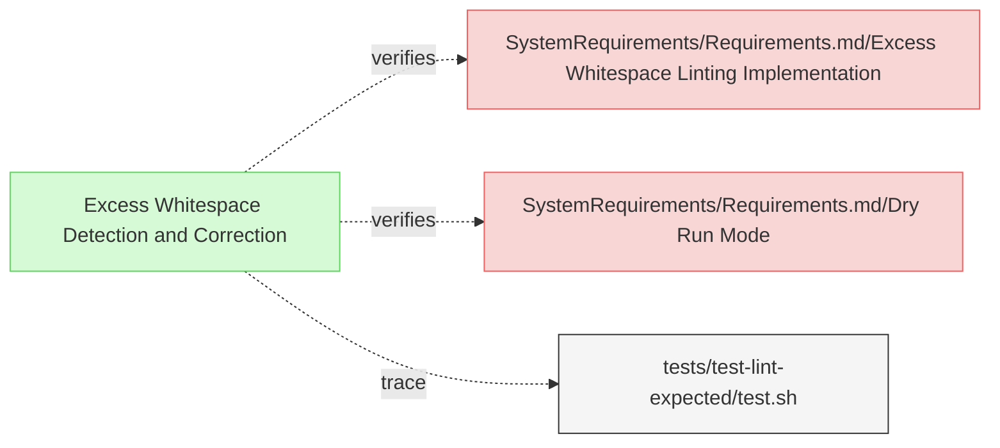
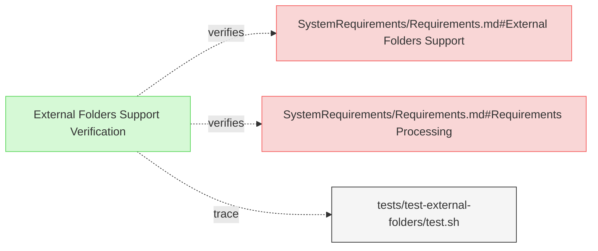

# Linting Tests

This document verifies the requirements for ReqFlow's linting functionality.

## Whitespace Linting Tests

---

### Excess Whitespace Detection and Correction

The verification test checks that ReqFlow correctly identifies and fixes excess whitespace after headers.

#### Metadata
  * type: verification

#### Acceptance Criteria
- System should detect excess whitespace after headers
- System should fix excess whitespace in linting mode
- The output should show before/after changes

#### Test Criteria
- Command exits with success (0) return code
- Output shows whitespace being fixed
- Output should contain diff-style formatting

#### Test Procedure
1. Create a test fixture in `/tests/fixtures/test-lint-headers/` with excess whitespace after headers
2. Run ReqFlow linting in dry-run mode to check detection
3. Verify that excess whitespace is reported
4. Run ReqFlow linting in normal mode to apply fixes
5. Verify that the whitespace has been corrected in the output files

#### Relations
  * verify: [SystemRequirements/Requirements.md/Excess Whitespace Linting Implementation](../SystemRequirements/Requirements.md#excess-whitespace-linting-implementation)
  * verify: [SystemRequirements/Requirements.md/Dry Run Mode](../SystemRequirements/Requirements.md#dry-run-mode)
  * trace: [tests/test-lint-expected/test.sh](../../tests/test-lint-expected/test.sh)

---

## External Folders Tests

---

### External Folders Support Verification

The verification test checks that ReqFlow correctly processes requirements in external folders.

#### Metadata
  * type: verification

#### Acceptance Criteria
- System should process requirements in external folders
- System should treat external requirements as system requirements
- User Requirements in external folders should cause validation errors

#### Test Criteria
- Validation succeeds with proper external folder setup
- Validation fails when external folder contains user requirements
- Diagram generation includes external folder requirements

#### Test Procedure
1. Set up test fixtures in `/tests/fixtures/test-external-folders/` with external folders configuration
2. Run ReqFlow with invalid setup (user requirements in external folder)
3. Verify that validation reports the appropriate error
4. Run ReqFlow with valid setup (only system requirements in external folder)
5. Verify that validation succeeds and requirements are properly processed

#### Relations
  * verify: [SystemRequirements/Requirements.md#External Folders Support](../SystemRequirements/Requirements.md#external-folders-support)
  * verify: [SystemRequirements/Requirements.md#Requirements Processing](../SystemRequirements/Requirements.md#requirements-processing)
  * trace: [tests/test-external-folders/test.sh](../../tests/test-external-folders/test.sh)