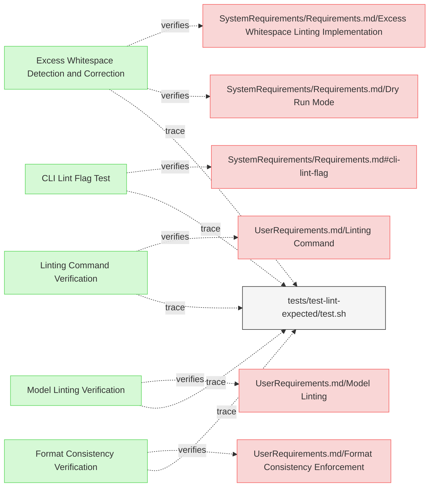

# Linting Tests

This document verifies the requirements for Reqvire's linting functionality.

## Linting Functionality Tests

---

### Excess Whitespace Detection and Correction

The verification test checks that Reqvire correctly identifies and fixes excess whitespace after headers.

#### Metadata
  * type: verification

#### Acceptance Criteria
- System should detect excess whitespace after headers
- System should fix excess whitespace in linting mode
- The output should show before/after changes

#### Test Criteria
- Command exits with success (0) return code
- Output shows whitespace being fixed
- Output should contain diff-style formatting

#### Test Procedure
1. Create a test fixture in `/tests/fixtures/test-lint-headers/` with excess whitespace after headers
2. Run Reqvire linting in dry-run mode to check detection
3. Verify that excess whitespace is reported
4. Run Reqvire linting in normal mode to apply fixes
5. Verify that the whitespace has been corrected in the output files

#### Relations
  * verify: [SystemRequirements/Requirements.md/Excess Whitespace Linting Implementation](../SystemRequirements/Requirements.md#excess-whitespace-linting-implementation)
  * verify: [SystemRequirements/Requirements.md/Dry Run Mode](../SystemRequirements/Requirements.md#dry-run-mode)
  * trace: [tests/test-lint-expected/test.sh](../../tests/test-lint-expected/test.sh)

---

### Linting Command Verification

This test verifies that the system properly implements the linting command functionality with both automatic fix and preview options.

#### Metadata
  * type: verification

#### Details

##### Acceptance Criteria
- System should provide a linting command that can automatically apply fixes
- System should offer a preview option to show changes without applying them
- Linting command should be activated via the --lint flag
- Dry run mode should be activated via the --dry-run flag

##### Test Criteria
- Command exits with success (0) return code
- Linting fixes are properly applied in normal mode
- Changes are only displayed but not applied in dry-run mode
- The command provides clear output about what changes would be or have been made

##### Test Procedure
TODO: write test procedure

#### Relations
  * verify: [UserRequirements.md/Linting Command](../UserRequirements.md#linting-command)
  * trace: [tests/test-lint-expected/test.sh](../../tests/test-lint-expected/test.sh)

---

### Format Consistency Verification

This test verifies that the system properly enforces consistent formatting in requirements documents.

#### Metadata
  * type: verification

#### Details

##### Acceptance Criteria
- System should detect and fix excess whitespace after element names and relation identifiers
- System should normalize to exactly two newlines before subsections
- System should automatically insert separator lines between elements if not present
- System should ensure consistent indentation in relation lists

##### Test Criteria
- Command exits with success (0) return code
- Formatting issues are detected and fixed according to the standards
- The fixed documents maintain proper structure and content

##### Test Procedure
TODO: write test procedure

#### Relations
  * verify: [UserRequirements.md/Format Consistency Enforcement](../UserRequirements.md#format-consistency-enforcement)
  * trace: [tests/test-lint-expected/test.sh](../../tests/test-lint-expected/test.sh)

---

### Model Linting Verification

This test verifies that the system provides linting capabilities to identify and fix stylistic and non-critical issues in MBSE models.

#### Metadata
  * type: verification

#### Details

##### Acceptance Criteria
- System should identify stylistic and formatting issues in MBSE models
- System should fix non-critical issues without affecting functional integrity
- System should provide clear reporting of the issues it identifies

##### Test Criteria
- Command exits with success (0) return code
- Linting identifies all expected issue types across test files
- Fixes are appropriately applied without breaking model structure

##### Test Procedure
TODO: write test procedure

#### Relations
  * verify: [UserRequirements.md/Model Linting](../UserRequirements.md#model-linting)
  * trace: [tests/test-lint-expected/test.sh](../../tests/test-lint-expected/test.sh)

---

### CLI Lint Flag Test

This test verifies that the system provides a linting function activated by the --lint flag.

#### Metadata
  * type: verification

#### Details

##### Acceptance Criteria
- System shall provide a --lint flag in CLI
- Flag shall activate the linting process
- Linting shall execute upon user request
- Process shall apply fixes by default

##### Test Criteria
- Command with --lint flag runs successfully
- Linting process is executed on target files
- Linting issues are identified and fixed
- Changes are applied to files

##### Test Procedure
1. Create test fixtures with known linting issues (excess whitespace, inconsistent newlines, etc.)
2. Run Reqvire with --lint flag on the test fixtures
3. Verify that linting process is executed and files are modified
4. Compare output files with expected fixed versions
5. Run with --lint --dry-run and verify that issues are identified but files aren't changed

#### Relations
  * verify: [SystemRequirements/Requirements.md#cli-lint-flag](../SystemRequirements/Requirements.md#cli-lint-flag)
  * trace: [tests/test-lint-expected/test.sh](../../tests/test-lint-expected/test.sh)

---

## External Folders Tests

---

### External Folders Support Verification

The verification test checks that Reqvire correctly processes requirements in external folders.

#### Metadata
  * type: verification

#### Acceptance Criteria
- System should process requirements in external folders
- System should treat external requirements as system requirements
- User Requirements in external folders should cause validation errors

#### Test Criteria
- Validation succeeds with proper external folder setup
- Validation fails when external folder contains user requirements
- Diagram generation includes external folder requirements

#### Test Procedure
1. Set up test fixtures in `/tests/fixtures/test-external-folders/` with external folders configuration
2. Run Reqvire with invalid setup (user requirements in external folder)
3. Verify that validation reports the appropriate error
4. Run Reqvire with valid setup (only system requirements in external folder)
5. Verify that validation succeeds and requirements are properly processed

#### Relations
  * verify: [SystemRequirements/Requirements.md#External Folders Support](../SystemRequirements/Requirements.md#external-folders-support)
  * verify: [SystemRequirements/Requirements.md#Requirements Processing](../SystemRequirements/Requirements.md#requirements-processing)
  * trace: [tests/test-external-folders/test.sh](../../tests/test-external-folders/test.sh)

---

## Excluded Patterns Tests

---

### Excluded Patterns Verification

This test verifies that the system correctly handles excluded filename patterns in configuration.

#### Metadata
  * type: verification

#### Details

##### Acceptance Criteria
- Files matching excluded_filename_patterns should not be processed for validation
- Files matching excluded_filename_patterns should only be tracked for relation targets
- Only relations TO excluded files should be valid, not relations FROM excluded files

##### Test Criteria
- Command should not validate elements within files matching excluded patterns
- Elements in excluded files should not be in registry for direct access
- Only the file itself should be in the registry for relation validation

##### Test Procedure
1. Create configuration with excluded_filename_patterns set
2. Create test fixtures with files matching and not matching excluded patterns
3. Run Reqvire validation on the test fixtures
4. Verify that excluded files are not processed for validation
5. Verify that relations to excluded files are still considered valid

#### Relations
  * verify: [SystemRequirements/Requirements.md#Configurable Filename Exclusion Patterns](../SystemRequirements/Requirements.md#configurable-filename-exclusion-patterns)
  * verify: [SystemRequirements/Requirements.md#File Pattern Exclusion for Linting](../SystemRequirements/Requirements.md#file-pattern-exclusion-for-linting)
  * trace: [tests/test-excluded-patterns/test.sh](../../tests/test-excluded-patterns/test.sh)

---

### Excluded Linting Verification

This test verifies that the system's linting functionality correctly respects excluded filename patterns.

#### Metadata
  * type: verification

#### Details

##### Acceptance Criteria
- Files matching excluded_filename_patterns should not be linted
- Reqvire should skip linting checks on excluded files

##### Test Criteria
- Command should not lint files matching excluded patterns
- Linting output should not include issues from excluded files

##### Test Procedure
1. Create configuration with excluded_filename_patterns set
2. Create test fixtures with files matching and not matching excluded patterns
3. Run Reqvire linting on the test fixtures
4. Verify that excluded files are not included in linting output
5. Verify that no linting errors are reported for excluded files

#### Relations
  * verify: [SystemRequirements/Requirements.md#Configurable Filename Exclusion Patterns](../SystemRequirements/Requirements.md#configurable-filename-exclusion-patterns)
  * verify: [SystemRequirements/Requirements.md#File Pattern Exclusion for Linting](../SystemRequirements/Requirements.md#file-pattern-exclusion-for-linting)
  * trace: [tests/test-excluded-linting/test.sh](../../tests/test-excluded-linting/test.sh)