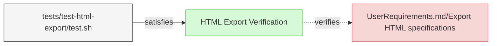

# Miscellaneous Verifications

This document contains miscellaneous verification tests that don't fit into the other verification categories.

## Export and Context Verifications

---

### HTML Export Verification

This test verifies that the system exports specifications into HTML format and saves them in the designated output location.

#### Metadata
  * type: verification

#### Details

##### Acceptance Criteria:
- System should export specifications to HTML format
- HTML files should be saved in the designated output location
- HTML output should maintain the structure and content of the original specifications
- SpecificationIndex.md should be renamed to index.html in output
- Links in diagrams and text must be converted to use .html instead of .md
- Paths in HTML files should maintain the original relative structure
- System should work in environments without Git repositories

##### Test Criteria:
- Command exits with success (0) return code
- HTML files are generated at the expected location with .html extension
- SpecificationIndex.md is converted to index.html
- HTML content preserves the structure and information from the source files
- Links in HTML files use .html extension instead of .md
- Mermaid click links are properly converted from .md to .html
- Both GitHub-style URLs and direct file paths in mermaid click links are handled correctly
- Paths should not have duplicated folder names (e.g., specifications/specifications)

#### Relations
  * verify: [UserRequirements.md/Export HTML specifications](../UserRequirements.md#export-html-specifications)
  * satisfiedBy: [tests/test-html-export/test.sh](../../tests/test-html-export/test.sh)

---