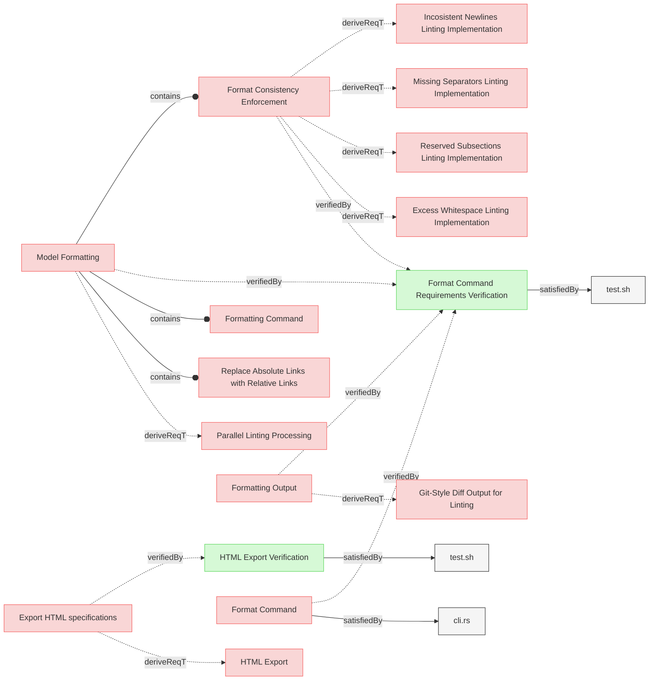

# Miscellaneous Verifications

This document contains miscellaneous verification tests that don't fit into the other verification categories.

## Export and Context Verifications

### HTML Export Verification

This test verifies that the system exports specifications into HTML format and saves them in the designated output location.

#### Details

##### Acceptance Criteria:
- System should export specifications to HTML format
- HTML files should be saved in the designated output location
- HTML output should maintain the structure and content of the original specifications
- SpecificationIndex.md should be renamed to index.html in output
- Links in diagrams and text must be converted to use .html instead of .md
- Paths in HTML files should maintain the original relative structure
- System should work in environments without Git repositories

##### Test Criteria:
- Command exits with success (0) return code
- HTML files are generated at the expected location with .html extension
- SpecificationIndex.md is converted to index.html
- HTML content preserves the structure and information from the source files
- Links in HTML files use .html extension instead of .md
- Mermaid click links are properly converted from .md to .html
- Both GitHub-style URLs and direct file paths in mermaid click links are handled correctly
- Paths should not have duplicated folder names (e.g., specifications/specifications)

#### Metadata
  * type: verification

#### Relations
  * verify: [Export HTML specifications](../UserRequirements.md#export-html-specifications)
  * satisfiedBy: [test.sh](../../tests/test-html-export/test.sh)

---

### Format Command Requirements Verification

This test verifies the format command requirements from SystemRequirements and UserRequirements, focusing on normalizing and standardizing MBSE models for consistency and readability.

#### Details

##### Acceptance Criteria

**Format Command Functionality:**
- System shall provide format command that normalizes and standardizes markdown documents
- System shall support --dry-run flag to preview changes without applying them
- System shall display changes in git diff style with line numbers and colors
- System shall preserve all document content while improving formatting consistency

**Content Preservation:**
- System shall preserve personas sections and other non-element content
- System shall maintain element ordering within sections
- System shall preserve section ordering throughout documents
- System shall preserve page content (frontmatter before first section)
- System shall preserve section content (content between section headers and first element)

**Formatting Consistency:**
- System shall trim excess whitespace from lines
- System shall normalize line endings consistently
- System shall insert proper separators between elements
- System shall normalize consecutive separators to single separators
- System shall normalize relation indentation to proper 2-space format
- System shall format relation links with human-readable names
- System shall clean up file references to show filename only for implementation files

**Change Preview Quality:**
- System shall show file identification clearly in change output
- System shall display line references with consistent width based on maximum line number
- System shall visualize trailing whitespace removal with special characters
- System shall use colors to distinguish additions (green) and removals (red)
- System shall group changes by file with clear separators
- System shall only show lines that have changes, omitting unchanged content
- System shall provide context lines before and after changes for better readability
- System shall maintain sequential line numbering that reflects final file positions
- System shall ensure line number continuity throughout diff output

**Relation Link Enhancement:**
- System shall convert simple identifiers (non-markdown format) to proper markdown link format
- System shall convert absolute links to relative links where appropriate
- System shall preserve already correct relative links without modification
- System shall replace fragment-only same-file references with full element names
- System shall convert implementation file paths to clean filename references
- System shall preserve external URLs without modification

##### Test Criteria

1. **Basic format functionality**
   - Format command runs successfully on test markdown files
   - Dry-run mode shows preview without making changes
   - Actual format command applies changes correctly

2. **Content preservation verification**
   - Personas sections remain intact after formatting
   - Element content and structure preserved
   - Section ordering maintained correctly
   - Page and section content preserved

3. **Change detection and preview**
   - Changes are clearly identified by file
   - Line references include consistent number width
   - Trailing whitespace removal is visualized
   - Color coding distinguishes addition/removal changes
   - Context lines provide readable context around changes
   - Line numbering maintains sequential continuity reflecting final file positions

4. **Relation link quality**
   - Simple identifiers are converted to proper markdown link format
   - Absolute links are converted to relative links where appropriate
   - Already correct relative links remain unchanged
   - Same-file references use human-readable element names
   - Implementation file references show clean filenames
   - Fragment references use proper notation

5. **Formatting consistency**
   - Excess whitespace is trimmed appropriately
   - Separators are inserted correctly between elements
   - Consecutive separators are normalized to single separators
   - Relation indentation is normalized to proper 2-space format
   - Line endings are normalized

6. **Line numbering accuracy**
   - Line numbers in diff output are sequential and consistent
   - Context lines maintain proper numbering continuity
   - Added lines show correct position in final file
   - Line numbering reflects final file structure accurately

#### Metadata
  * type: verification

#### Relations
  * verify: [Format Command](../SystemRequirements/Requirements.md#format-command)
  * verify: [Model Formatting](../UserRequirements.md#model-formatting)
  * verify: [Format Consistency Enforcement](../UserRequirements.md#format-consistency-enforcement)
  * verify: [Formatting Output](../UserRequirements.md#formatting-output)
  * satisfiedBy: [test.sh](../../tests/test-advanced-format/test.sh)

---