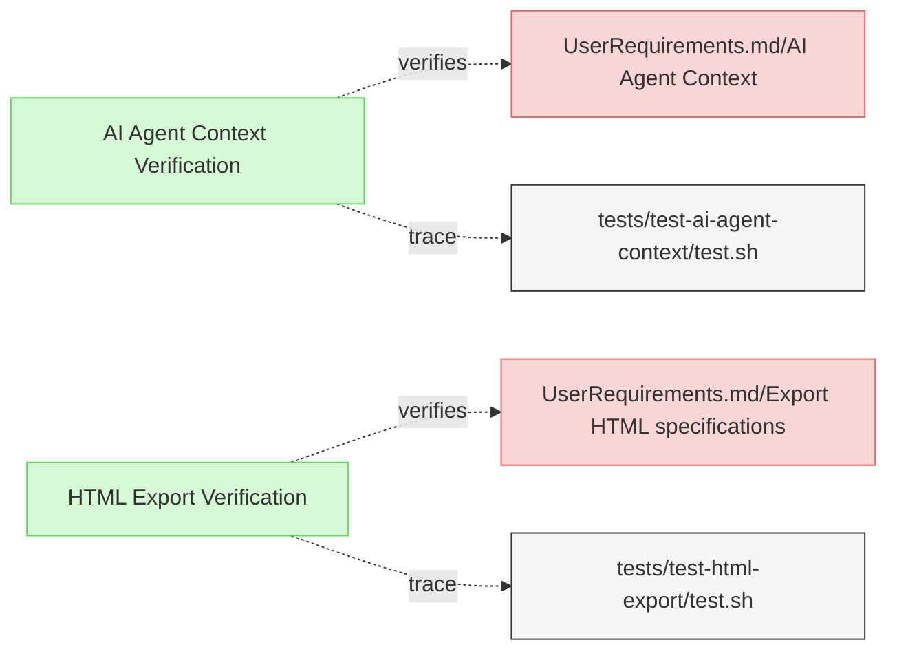
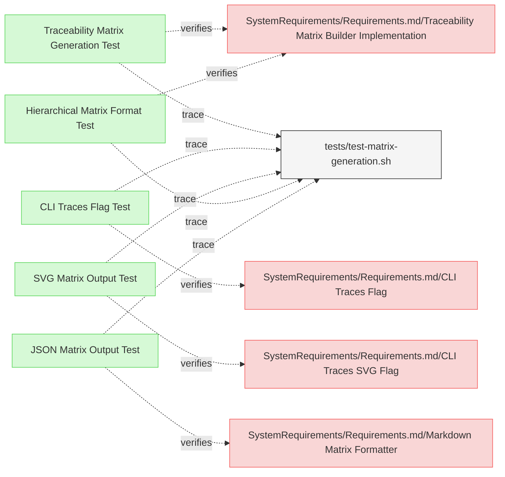

# Miscellaneous Verifications

This document contains miscellaneous verification tests that don't fit into the other verification categories.

## Export and Context Verifications

## Traceability Matrix Verifications

---

### HTML Export Verification

This test verifies that the system exports specifications into HTML format and saves them in the designated output location.

#### Metadata
  * type: verification

#### Details

##### Acceptance Criteria
- System should export specifications to HTML format
- HTML files should be saved in the designated output location
- HTML output should maintain the structure and content of the original specifications

##### Test Criteria
- Command exits with success (0) return code
- HTML files are generated at the expected location
- HTML content preserves the structure and information from the source files

##### Test Procedure
1. Prepare test fixtures with Markdown files containing links to other documents
2. Ensure there's a README.md file to test conversion to index.html
3. Run ReqFlow with the --html flag
4. Verify that HTML files are generated for all Markdown files
5. Verify that README.md is converted to index.html
6. Verify that links use .html extension instead of .md
7. Verify that structure and content are preserved in the HTML files

#### Relations
  * verify: [UserRequirements.md/Export HTML specifications](../UserRequirements.md#export-html-specifications)
  * trace: [tests/test-html-export/test.sh](../../tests/test-html-export/test.sh)

---

### AI Agent Context Verification

This test verifies that the system provides necessary context for AI agents to understand how to use ReqFlow and its methodology.

#### Metadata
  * type: verification

#### Details

##### Acceptance Criteria
- System should provide comprehensive context for AI agents
- Context should include information about ReqFlow usage and methodology
- Context should be accessible via a dedicated command

##### Test Criteria
- Command exits with success (0) return code
- Context information is comprehensive and usable by AI agents
- Command output is properly formatted for AI consumption

##### Test Procedure
1. Run ReqFlow with the `--llm-context` flag to generate the AI context
2. Verify that the output contains essential ReqFlow concepts (Requirements, Relations, Verification, Metadata)
3. Verify that the output is properly formatted in markdown with headers
4. Verify that the command returns a successful exit code

#### Relations
  * verify: [UserRequirements.md/AI Agent Context](../UserRequirements.md#ai-agent-context)
  * trace: [tests/test-ai-agent-context/test.sh](../../tests/test-ai-agent-context/test.sh)

---

### Traceability Matrix Generation Test

This test verifies that the system can generate a traceability matrix that accurately displays relationships between requirements and other elements.

#### Metadata
  * type: verification

#### Details

##### Acceptance Criteria
- System should generate a traceability matrix showing relationships between requirements and verification elements
- Matrix should organize requirements in a hierarchical structure
- Matrix should indicate verification status for each requirement
- Matrix should show relationships between requirements and verification elements

##### Test Criteria
- Command returns success (0) exit code
- Output contains a properly formatted matrix with requirements and verification elements
- Matrix includes hierarchy indicators for parent-child relationships
- Matrix includes verification status indicators (✅/❌)
- Matrix follows the specified format with proper table structure

##### Test Procedure
1. Run ReqFlow with the `--traces` flag
2. Verify the output contains a properly formatted markdown table
3. Check for the presence of hierarchy indicators (↳, __↳, etc.)
4. Verify the presence of verification status indicators (✅/❌)
5. Check that requirement elements are organized by root requirements
6. Verify that table structure is properly formatted with headers and separators

#### Relations
  * verify: [SystemRequirements/Requirements.md/Traceability Matrix Builder Implementation](../SystemRequirements/Requirements.md#traceability-matrix-builder-implementation)
  * trace: [tests/test-matrix-generation.sh](../../tests/test-matrix-generation.sh)

---

### CLI Traces Flag Test

This test verifies that the system provides a command-line flag for generating traceability matrices.

#### Metadata
  * type: verification

#### Details

##### Acceptance Criteria
- System should provide a `--traces` flag for generating traceability matrices
- Command should execute without errors when the flag is used
- Output should be a properly formatted traceability matrix

##### Test Criteria
- Command with `--traces` flag returns success (0) exit code
- Command produces the expected traceability matrix output
- Help text includes documentation for the `--traces` flag

##### Test Procedure
1. Run ReqFlow with the `--traces` flag
2. Verify the command executes without errors
3. Verify that a traceability matrix is generated in markdown format
4. Check that the command's help text includes information about the `--traces` flag

#### Relations
  * verify: [SystemRequirements/Requirements.md/CLI Traces Flag](../SystemRequirements/Requirements.md#cli-traces-flag)
  * trace: [tests/test-matrix-generation.sh](../../tests/test-matrix-generation.sh)

---

### SVG Matrix Output Test

This test verifies that the system can generate an SVG representation of the traceability matrix.

#### Metadata
  * type: verification

#### Details

##### Acceptance Criteria
- System should generate an SVG version of the traceability matrix when requested
- SVG should display full element names without truncation
- SVG should maintain hierarchical structure from the markdown matrix
- SVG should use appropriate visual indicators for verification status

##### Test Criteria
- Command with `--traces --svg` flags returns success (0) exit code
- Output is a valid SVG document
- Element names are displayed in full without truncation
- Hierarchical structure is preserved with visual indicators
- Verification status is clearly indicated

##### Test Procedure
1. Run ReqFlow with the `--traces --svg` flags
2. Verify that a valid SVG document is generated
3. Check that the SVG includes full element names without truncation
4. Verify that hierarchical structure is preserved with appropriate indentation
5. Check that verification status is indicated with visual symbols
6. Verify that column widths are dynamically sized based on content

#### Relations
  * verify: [SystemRequirements/Requirements.md/CLI Traces SVG Flag](../SystemRequirements/Requirements.md#cli-traces-svg-flag)
  * trace: [tests/test-matrix-generation.sh](../../tests/test-matrix-generation.sh)

---

### Hierarchical Matrix Format Test

This test verifies that the traceability matrix properly represents the hierarchical relationships between requirements.

#### Metadata
  * type: verification

#### Details

##### Acceptance Criteria
- Matrix should organize requirements in a hierarchical structure
- Parent-child relationships should be visually indicated with indentation
- Requirements should be grouped by root requirements

##### Test Criteria
- Matrix output contains hierarchical organization
- Parent-child relationships are visually indicated with proper indentation
- Requirements are grouped by their root requirements

##### Test Procedure
1. Run ReqFlow with the `--traces` flag
2. Verify that requirements are organized hierarchically
3. Check that child requirements are indented with appropriate symbols
4. Verify that requirements are grouped by their root requirements
5. Confirm that indentation levels reflect the actual hierarchy in the model

#### Relations
  * verify: [SystemRequirements/Requirements.md/Traceability Matrix Builder Implementation](../SystemRequirements/Requirements.md#traceability-matrix-builder-implementation)
  * trace: [tests/test-matrix-generation.sh](../../tests/test-matrix-generation.sh)

---

### JSON Matrix Output Test

This test verifies that the system can export the traceability matrix in a structured JSON format.

#### Metadata
  * type: verification

#### Details

##### Acceptance Criteria
- System should generate a JSON representation of the traceability matrix when requested
- JSON should include all information from the markdown matrix
- JSON should preserve hierarchical relationships
- JSON should use relative paths for element identifiers

##### Test Criteria
- Command with `--traces --json` flags returns success (0) exit code
- Output is valid JSON with required sections
- Hierarchical relationships are preserved in the JSON structure
- Element identifiers use relative paths

##### Test Procedure
1. Run ReqFlow with the `--traces --json` flags
2. Verify that valid JSON is generated
3. Check that the JSON includes all required sections (metadata, sources, targets, matrix, verificationStatus)
4. Verify that hierarchical relationships are preserved
5. Check that element identifiers use relative paths from the repository root

#### Relations
  * verify: [SystemRequirements/Requirements.md/Markdown Matrix Formatter](../SystemRequirements/Requirements.md#markdown-matrix-formatter)
  * trace: [tests/test-matrix-generation.sh](../../tests/test-matrix-generation.sh)

---