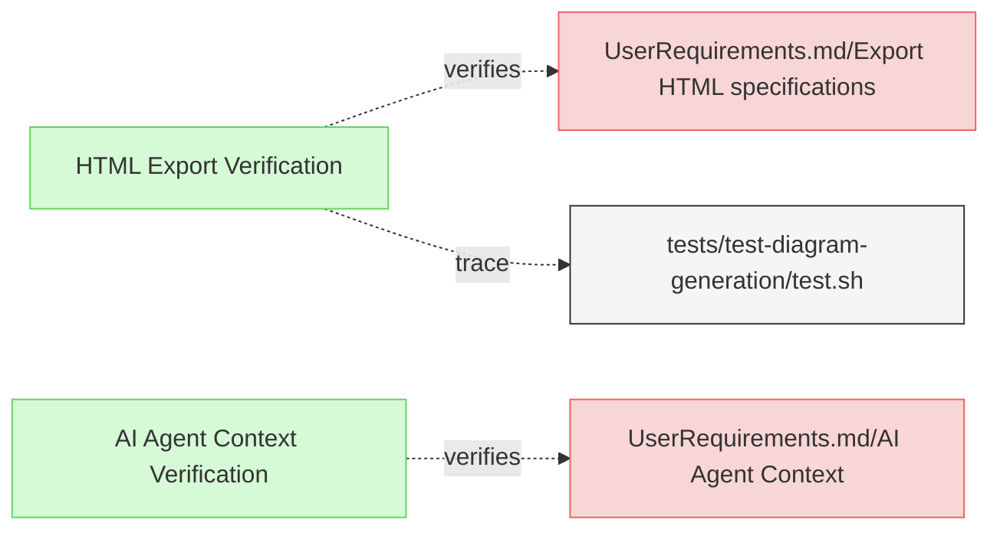

# Miscellaneous Verifications

This document contains miscellaneous verification tests that don't fit into the other verification categories.

## Export and Context Verifications

---

### HTML Export Verification

This test verifies that the system exports specifications into HTML format and saves them in the designated output location.

#### Metadata
  * type: verification

#### Details

##### Acceptance Criteria
- System should export specifications to HTML format
- HTML files should be saved in the designated output location
- HTML output should maintain the structure and content of the original specifications

##### Test Criteria
- Command exits with success (0) return code
- HTML files are generated at the expected location
- HTML content preserves the structure and information from the source files

##### Test Procedure
1. Prepare test fixtures with Markdown files containing links to other documents
2. Ensure there's a README.md file to test conversion to index.html
3. Run ReqFlow with the --html flag
4. Verify that HTML files are generated for all Markdown files
5. Verify that README.md is converted to index.html
6. Verify that links use .html extension instead of .md
7. Verify that structure and content are preserved in the HTML files

#### Relations
  * verify: [UserRequirements.md/Export HTML specifications](../UserRequirements.md#export-html-specifications)
  * trace: [tests/test-html-export/test.sh](../../tests/test-html-export/test.sh)

---

### AI Agent Context Verification

This test verifies that the system provides necessary context for AI agents to understand how to use ReqFlow and its methodology.

#### Metadata
  * type: verification

#### Details

##### Acceptance Criteria
- System should provide comprehensive context for AI agents
- Context should include information about ReqFlow usage and methodology
- Context should be accessible via a dedicated command

##### Test Criteria
- Command exits with success (0) return code
- Context information is comprehensive and usable by AI agents
- Command output is properly formatted for AI consumption

##### Test Procedure
1. Run ReqFlow with the `--llm-context` flag to generate the AI context
2. Verify that the output contains essential ReqFlow concepts (Requirements, Relations, Verification, Metadata)
3. Verify that the output is properly formatted in markdown with headers
4. Verify that the command returns a successful exit code

#### Relations
  * verify: [UserRequirements.md/AI Agent Context](../UserRequirements.md#ai-agent-context)
  * trace: [tests/test-ai-agent-context/test.sh](../../tests/test-ai-agent-context/test.sh)

---
