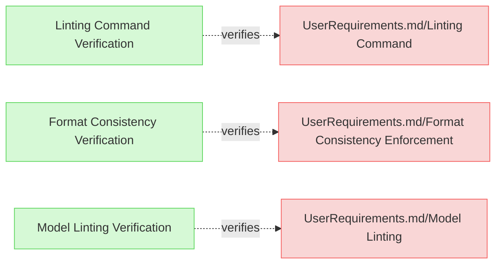
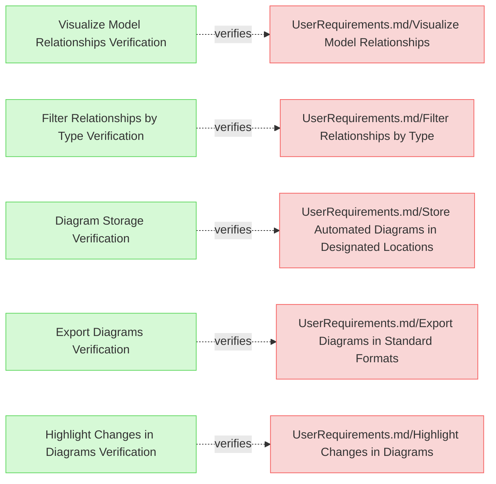
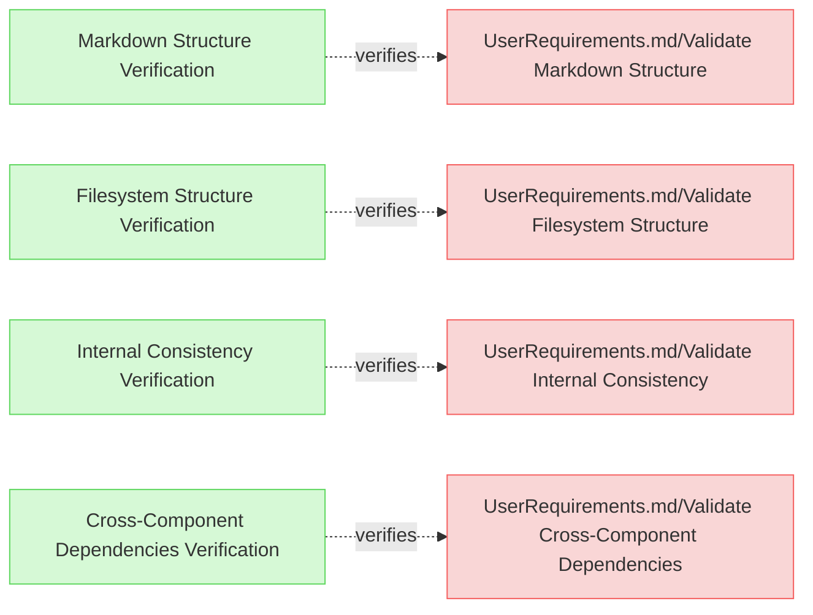
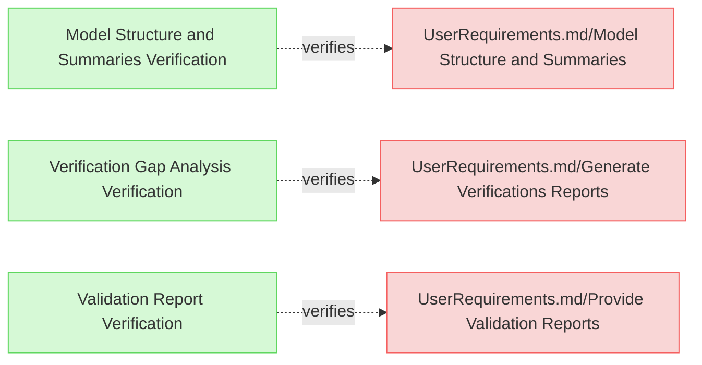
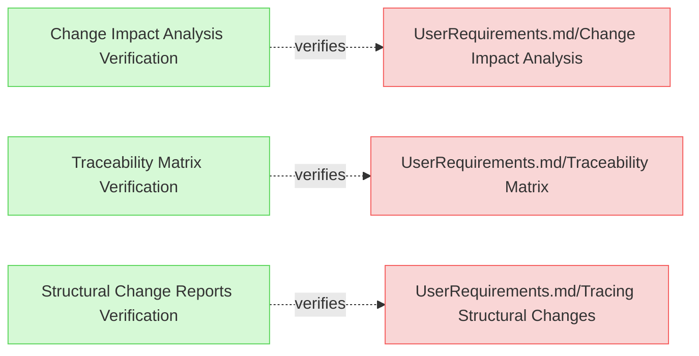
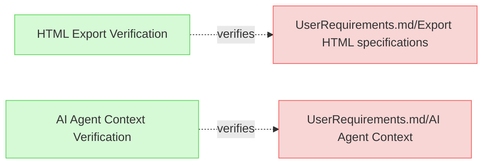

# Missing Verifications

This document contains verification definitions for user requirements that currently lack verification elements.

## Linting Verifications

---

### Linting Command Verification

This test verifies that the system properly implements the linting command functionality with both automatic fix and preview options.

#### Metadata
  * type: verification

#### Details

##### Acceptance Criteria
- System should provide a linting command that can automatically apply fixes
- System should offer a preview option to show changes without applying them
- Linting command should be activated via the --lint flag
- Dry run mode should be activated via the --dry-run flag

##### Test Criteria
- Command exits with success (0) return code
- Linting fixes are properly applied in normal mode
- Changes are only displayed but not applied in dry-run mode
- The command provides clear output about what changes would be or have been made

##### Test Procedure
TODO: write test procedure

#### Relations
  * verify: [UserRequirements.md/Linting Command](../UserRequirements.md#linting-command)
  * trace: [tests/test-lint-expected/test.sh](../../tests/test-lint-expected/test.sh)

---

### Format Consistency Verification

This test verifies that the system properly enforces consistent formatting in requirements documents.

#### Metadata
  * type: verification

#### Details

##### Acceptance Criteria
- System should detect and fix excess whitespace after element names and relation identifiers
- System should normalize to exactly two newlines before subsections
- System should automatically insert separator lines between elements if not present
- System should ensure consistent indentation in relation lists

##### Test Criteria
- Command exits with success (0) return code
- Formatting issues are detected and fixed according to the standards
- The fixed documents maintain proper structure and content

##### Test Procedure
TODO: write test procedure

#### Relations
  * verify: [UserRequirements.md/Format Consistency Enforcement](../UserRequirements.md#format-consistency-enforcement)
  * trace: [tests/test-lint-expected/test.sh](../../tests/test-lint-expected/test.sh)

---

### Model Linting Verification

This test verifies that the system provides linting capabilities to identify and fix stylistic and non-critical issues in MBSE models.

#### Metadata
  * type: verification

#### Details

##### Acceptance Criteria
- System should identify stylistic and formatting issues in MBSE models
- System should fix non-critical issues without affecting functional integrity
- System should provide clear reporting of the issues it identifies

##### Test Criteria
- Command exits with success (0) return code
- Linting identifies all expected issue types across test files
- Fixes are appropriately applied without breaking model structure

##### Test Procedure
TODO: write test procedure

#### Relations
  * verify: [UserRequirements.md/Model Linting](../UserRequirements.md#model-linting)
  * trace: [tests/test-lint-expected/test.sh](../../tests/test-lint-expected/test.sh)

---

## Diagram Verifications

---

### Visualize Model Relationships Verification

This test verifies that the system provides visual representations of relationships within the MBSE model in the generated diagrams.

#### Metadata
  * type: verification

#### Details

##### Acceptance Criteria
- System should generate diagrams showing relationships between model elements
- Diagrams should clearly represent different relationship types
- Visual representation should aid in understanding dependencies between elements

##### Test Criteria
- Command exits with success (0) return code
- Generated diagrams contain all expected relationship types
- Relationships are visually differentiated based on their type
- Element dependencies are clearly displayed in the diagrams

##### Test Procedure
TODO: write test procedure

#### Relations
  * verify: [UserRequirements.md/Visualize Model Relationships](../UserRequirements.md#visualize-model-relationships)
  * trace: [tests/test-diagram-generation/test.sh](../../tests/test-diagram-generation/test.sh)

---

### Filter Relationships by Type Verification

This test verifies that the system allows users to filter relationships in diagrams by type.

#### Metadata
  * type: verification

#### Details

##### Acceptance Criteria
- System should allow filtering of relationships by type when generating diagrams
- Filtering should support different relationship types (dependency, refinement, verification, etc.)
- Filtered diagrams should only show the selected relationship types

##### Test Criteria
- Command exits with success (0) return code
- Filtering options are correctly applied to diagram generation
- Filtered diagrams contain only the specified relationship types

##### Test Procedure
TODO: write test procedure

#### Relations
  * verify: [UserRequirements.md/Filter Relationships by Type](../UserRequirements.md#filter-relationships-by-type)
  * trace: [tests/test-diagram-generation/test.sh](../../tests/test-diagram-generation/test.sh)

---

### Diagram Storage Verification

This test verifies that the system properly stores automatically generated diagrams in pre-configured locations.

#### Metadata
  * type: verification

#### Details

##### Acceptance Criteria
- System should store generated diagrams in pre-configured locations
- Storage paths should be configurable
- Diagrams should be accessible after generation

##### Test Criteria
- Command exits with success (0) return code
- Diagrams are saved to the expected pre-configured locations
- Diagram files are properly formatted and accessible

##### Test Procedure
TODO: write test procedure

#### Relations
  * verify: [UserRequirements.md/Store Automated Diagrams in Designated Locations](../UserRequirements.md#store-automated-diagrams-in-designated-locations)
  * trace: [tests/test-diagram-generation/test.sh](../../tests/test-diagram-generation/test.sh)

---

### Export Diagrams Verification

This test verifies that the system allows users to export generated diagrams in standard formats.

#### Metadata
  * type: verification

#### Details

##### Acceptance Criteria
- System should export diagrams in standard formats (PNG, SVG, PDF)
- Export functionality should be user-accessible
- Exported diagrams should maintain visual quality and content

##### Test Criteria
- Command exits with success (0) return code
- Diagrams are exported in the requested format
- Exported files contain the expected diagram content

##### Test Procedure
TODO: write test procedure

#### Relations
  * verify: [UserRequirements.md/Export Diagrams in Standard Formats](../UserRequirements.md#export-diagrams-in-standard-formats)
  * trace: [tests/test-diagram-generation/test.sh](../../tests/test-diagram-generation/test.sh)

---

### Highlight Changes in Diagrams Verification

This test verifies that the system provides an option to highlight changes made to the model in generated diagrams.

#### Metadata
  * type: verification

#### Details

##### Acceptance Criteria
- System should highlight changes in the model when generating diagrams
- Highlighting should visually differentiate added, modified, and removed elements
- Change highlighting should be optional and user-configurable

##### Test Criteria
- Command exits with success (0) return code
- Changes in the model are visually highlighted in the diagrams
- Different types of changes have distinct visual indicators

##### Test Procedure
TODO: write test procedure

#### Relations
  * verify: [UserRequirements.md/Highlight Changes in Diagrams](../UserRequirements.md#highlight-changes-in-diagrams)
  * trace: [tests/test-diagram-generation/test.sh](../../tests/test-diagram-generation/test.sh)

---

## Validation Verifications

---

### Markdown Structure Verification

This test verifies that the system validates the Markdown structure of MBSE documentation.

#### Metadata
  * type: verification

#### Details

##### Acceptance Criteria
- System should validate markdown structure against formatting standards
- System should detect deviations from the expected markdown structure
- System should provide clear reporting of structure validation issues

##### Test Criteria
- Command exits with success (0) return code for valid structures
- Command reports issues for invalid structures
- Validation messages include file paths and line numbers for issues

##### Test Procedure
TODO: write test procedure

#### Relations
  * verify: [UserRequirements.md/Validate Markdown Structure](../UserRequirements.md#validate-markdown-structure)
  * trace: [tests/test-invalid-relations/test.sh](../../tests/test-invalid-relations/test.sh)

---

### Filesystem Structure Verification

This test verifies that the system validates the organization of files and folders in the repository.

#### Metadata
  * type: verification

#### Details

##### Acceptance Criteria
- System should validate filesystem structure against expected organization
- System should verify that required folders exist
- System should verify that files are appropriately placed

##### Test Criteria
- Command exits with success (0) return code for valid structures
- Command reports issues for invalid structures
- Validation includes checks for missing required folders

##### Test Procedure
TODO: write test procedure

#### Relations
  * verify: [UserRequirements.md/Validate Filesystem Structure](../UserRequirements.md#validate-filesystem-structure)
  * trace: [tests/test-external-folders/test.sh](../../tests/test-external-folders/test.sh)

---

### Internal Consistency Verification

This test verifies that the system checks the internal consistency of the MBSE model.

#### Metadata
  * type: verification

#### Details

##### Acceptance Criteria
- System should validate internal consistency of the model
- System should detect circular dependencies
- System should identify orphaned elements
- System should detect inconsistent relationship patterns

##### Test Criteria
- Command exits with success (0) return code for consistent models
- Command reports issues for inconsistent models
- Validation includes detailed reporting of inconsistencies

##### Test Procedure
TODO: write test procedure

#### Relations
  * verify: [UserRequirements.md/Validate Internal Consistency](../UserRequirements.md#validate-internal-consistency)
  * trace: [tests/test-invalid-relations/test.sh](../../tests/test-invalid-relations/test.sh)

---

### Cross-Component Dependencies Verification

This test verifies that the system validates dependencies across different components of the MBSE model.

#### Metadata
  * type: verification

#### Details

##### Acceptance Criteria
- System should validate dependencies across different model components
- System should verify proper alignment between architectural layers
- System should validate alignment between requirement levels and verification elements

##### Test Criteria
- Command exits with success (0) return code for valid dependencies
- Command reports issues for invalid dependencies
- Validation includes detailed reporting of dependency mismatches

##### Test Procedure
TODO: write test procedure

#### Relations
  * verify: [UserRequirements.md/Validate Cross-Component Dependencies](../UserRequirements.md#validate-cross-component-dependencies)
  * trace: [tests/test-invalid-relations/test.sh](../../tests/test-invalid-relations/test.sh)

---

## Report Verifications

---

### Model Structure and Summaries Verification

This test verifies that the system generates reports summarizing the structure and relationships in the MBSE model.

#### Metadata
  * type: verification

#### Details

##### Acceptance Criteria
- System should generate summary reports of model structure
- Reports should include counts and types of connections
- Summary should provide an overview of model composition

##### Test Criteria
- Command exits with success (0) return code
- Report contains expected structural elements
- Relationship counts and types are accurately reported

##### Test Procedure
TODO: write test procedure

#### Relations
  * verify: [UserRequirements.md/Model Structure and Summaries](../UserRequirements.md#model-structure-and-summaries)
  * trace: [tests/test-element-content-extraction/test.sh](../../tests/test-element-content-extraction/test.sh)

---

### Verification Gap Analysis Verification

This test verifies that the system produces reports identifying User and Mission requirements that lack verification relationships.

#### Metadata
  * type: verification

#### Details

##### Acceptance Criteria
- System should identify User and Mission requirements without verifiedBy relationships
- System should generate a report of verification gaps
- Report should be formatted to aid in addressing verification gaps

##### Test Criteria
- Command exits with success (0) return code
- Report accurately identifies requirements without verification
- Report includes all required information to address gaps

##### Test Procedure
TODO: write test procedure

#### Relations
  * verify: [UserRequirements.md/Generate Verifications Reports](../UserRequirements.md#generate-verifications-reports)
  * trace: [tests/test-invalid-relations/test.sh](../../tests/test-invalid-relations/test.sh)

---

### Validation Report Verification

This test verifies that the system generates detailed validation reports highlighting any inconsistencies or errors.

#### Metadata
  * type: verification

#### Details

##### Acceptance Criteria
- System should generate validation reports of model structure
- Reports should highlight inconsistencies and errors
- Validation details should include clear descriptions of issues

##### Test Criteria
- Command exits with success (0) return code
- Report contains detailed validation information
- Issues are clearly identified with relevant context

##### Test Procedure
TODO: write test procedure

#### Relations
  * verify: [UserRequirements.md/Provide Validation Reports](../UserRequirements.md#provide-validation-reports)
  * trace: [tests/test-invalid-relations/test.sh](../../tests/test-invalid-relations/test.sh)

---

## Change Impact Verifications

---

### Change Impact Analysis Verification

This test verifies that the system generates change impact reports when requested.

#### Metadata
  * type: verification

#### Details

##### Acceptance Criteria
- System should generate change impact reports in Markdown format
- System should support JSON output for change impact reports
- Reports should include an overview of model changes and their impact

##### Test Criteria
- Command exits with success (0) return code
- Reports contain expected impact information
- Both Markdown and JSON formats are properly supported

##### Test Procedure
TODO: write test procedure

#### Relations
  * verify: [UserRequirements.md/Change Impact Analysis](../UserRequirements.md#change-impact-analysis)
  * trace: [tests/test-change-impact-detection/test.sh](../../tests/test-change-impact-detection/test.sh)

---

### Traceability Matrix Verification

This test verifies that the system generates traceability matrices in Markdown format.

#### Metadata
  * type: verification

#### Details

##### Acceptance Criteria
- System should generate traceability matrices in Markdown format
- Matrices should support different views (Requirements-to-Verification, etc.)
- Matrices should efficiently represent relationships between elements

##### Test Criteria
- Command exits with success (0) return code
- Generated matrices contain expected relationship information
- Different matrix views are properly supported

##### Test Procedure
TODO: write test procedure

#### Relations
  * verify: [UserRequirements.md/Traceability Matrix](../UserRequirements.md#traceability-matrix)
  * trace: [tests/test-change-impact-detection/test.sh](../../tests/test-change-impact-detection/test.sh)

---

### Structural Change Reports Verification

This test verifies that the system analyzes and reports on structural changes in the MBSE model.

#### Metadata
  * type: verification

#### Details

##### Acceptance Criteria
- System should analyze structural changes in the MBSE model
- System should identify affected components through relationship traversal
- System should generate reports of impacted elements and structures

##### Test Criteria
- Command exits with success (0) return code
- Change reports correctly identify affected elements
- Relationship traversal properly determines impact propagation

##### Test Procedure
TODO: write test procedure

#### Relations
  * verify: [UserRequirements.md/Tracing Structural Changes](../UserRequirements.md#tracing-structural-changes)
  * trace: [tests/test-change-impact-detection/test.sh](../../tests/test-change-impact-detection/test.sh)

---

## Other Verifications

---

### HTML Export Verification

This test verifies that the system exports specifications into HTML format and saves them in the designated output location.

#### Metadata
  * type: verification

#### Details

##### Acceptance Criteria
- System should export specifications to HTML format
- HTML files should be saved in the designated output location
- HTML output should maintain the structure and content of the original specifications

##### Test Criteria
- Command exits with success (0) return code
- HTML files are generated at the expected location
- HTML content preserves the structure and information from the source files

##### Test Procedure
TODO: write test procedure

#### Relations
  * verify: [UserRequirements.md/Export HTML specifications](../UserRequirements.md#export-html-specifications)
  * trace: [tests/test-diagram-generation/test.sh](../../tests/test-diagram-generation/test.sh)

---

### AI Agent Context Verification

This test verifies that the system provides necessary context for AI agents to understand how to use ReqFlow and its methodology.

#### Metadata
  * type: verification

#### Details

##### Acceptance Criteria
- System should provide comprehensive context for AI agents
- Context should include information about ReqFlow usage and methodology
- Context should be accessible via a dedicated command

##### Test Criteria
- Command exits with success (0) return code
- Context information is comprehensive and usable by AI agents
- Command output is properly formatted for AI consumption

##### Test Procedure
TODO: write test procedure

#### Relations
  * verify: [UserRequirements.md/AI Agent Context](../UserRequirements.md#ai-agent-context)
  * trace: [cli/src/llm_context.md](../../cli/src/llm_context.md)