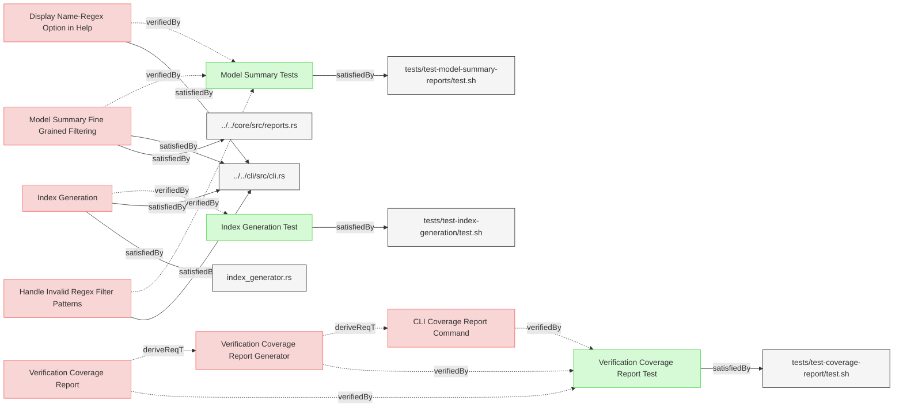

# Report Generation Tests

This document contains verification tests for Reqvire's report generation capabilities.

## Report Generation Tests

---

### Index Generation Test

This test verifies that the system correctly generates an index document with links and summaries to all specification documents.

#### Metadata
  * type: verification

#### Details

##### Acceptance Criteria
- System shall generate README.md in the specifications folder
- README.md shall contain links to all specification documents
- README.md shall be properly structured with sections
- README.md shall include brief summaries of each document

##### Test Criteria
- Command with --generate-index flag runs successfully
- README.md file is created in the specifications folder
- README.md contains links to all specification documents
- README.md structure follows expected format

#### Relations
  * verify: [SystemRequirements/Requirements.md#index-generation](../SystemRequirements/Requirements.md#index-generation)
  * satisfiedBy: [tests/test-index-generation/test.sh](../../tests/test-index-generation/test.sh)

---

### Model Summary Tests

This test verifies that the system provides a CLI flag and functionality for generating summary reports of model structure and relationships including varius filters.

#### Metadata
  * type: verification

#### Details

##### Acceptance Criteria
- Running `reqvire --model-summary --json` produces a valid, pretty-printed JSON summary.
- Running `reqvire --model-summary` (no `--json`) prints a human-readable markdown text summary beginning with `--- MBSE Model summary ---`.
- Both JSON and text summaries include exactly five elements with the identifiers:
  - `Requirement-with-Valid-Standard-Relations`
  - `Requirement-with-Valid-Markdown-Relations`
  - `Requirement-with-DesignSpecifications-Reference`
  - `Requirement-with-Many-Subsections`
  - `Verification-of-Standard-Relations`
- When any filter flags (`--filter-file`, `--filter-section`, `--filter-type`, `--filter-name-regex`, `--filter-content`, `--filter-is-verified`, `--filter-is-satisfied`) are supplied with `--model-summary` (and optionally `--json`), only elements matching **all** specified filters appear in both outputs.
- Supplying multiple filters in combination yields the intersection of their individual results.
- Running any filter flag **without** `--model-summary` fails with a non-zero exit code and a help message indicating the dependency.
- Supplying an invalid regex to `--filter-name-regex` or `--filter-content` fails with a non-zero exit code and displays a `ReqvireError::InvalidRegex` message.
- Model summary report must include all relations for each element, showing both explicit relations and their opposite relations (e.g., if a requirement has `verifiedBy`, the verification element should show `verify`; if a verification has `verify`, the requirement should show `verifiedBy`).
- **Enhanced Content Display**: Model summary must display page content (frontmatter before first section) and section content (content between section headers and first element).
- **Count Information**: Model summary must show counts for files, pages, sections, and elements in both text and JSON formats.
- **Content Formatting**: Page content and section content must use consistent newline formatting (`\n`) matching element content display format.
- **Global Statistics**: Summary must include comprehensive global counters including total files, sections, elements, and verification/satisfaction statistics.

##### Test Criteria

1. **Base JSON summary**  
   Command: `reqvire --model-summary --json`  
   - exits code **0**  
   - output parses under `jq`  
   - `.model_summary.global_counters.total_elements == 5`  
   - `.model_summary.files` contains key `"Requirements.md"`  
   - `.model_summary.files["Requirements.md"]["Requirements"]` contains exactly the five identifiers above  

2. **Base text summary**  
   Command: `reqvire --model-summary`  
   - exits code **0**  
   - first line is `--- MBSE Model summary ---`  
   - exactly five lines matching `🔹 Element: <identifier>` for the five identifiers above  
   - each element block includes `- Name:`, `- Section:`, `- File:`, `- Type:`, and `- Content:`  

3. **Individual filters**  
   For each flag in turn, run both JSON and text modes:  
   - `--filter-file="Requirements.md"`  
   - `--filter-section="Requirements"`  
   - `--filter-type="user-requirement"`  
   - `--filter-name-regex="^Requirement with Valid Standard"`  
   - `--filter-content="subsection"`  
   - `--filter-is-verified`  
   - `--filter-is-satisfied`  
   Assert for each:  
   - exit code **0**  
   - total elements < 5 (unless the filter matches all)  
   - only the expected subset of identifiers appears  

4. **Filter combinations**  
   Combine two filters (e.g. `--filter-type=user-requirement` + `--filter-is-satisfied`) and verify both outputs contain exactly those identifiers passing both filters.

5. **Invalid regex**  
   Command: `reqvire --model-summary --json --filter-name-regex="***"`  
   - exits non-zero  
   - stderr contains `Invalid regex`  

6. **Filter without model-summary**
   Command: `reqvire --filter-file="*.md"`
   - exits non-zero
   - stderr indicates `requires --model-summary`

7. **Relations coverage**
   Command: `reqvire --model-summary --json`
   - For any requirement with `verifiedBy` relations, verify that the target verification elements show corresponding `verify` relations pointing back to the requirement
   - For any verification with `verify` relations, verify that the target requirement elements show corresponding `verifiedBy` relations pointing back to the verification
   - Same pattern applies to other relation pairs: `satisfiedBy`/`satisfy`, `containedBy`/`contain`, `derivedFrom`/`derive`, `refine`/`refinedBy`
   - Both JSON and text outputs must show complete bidirectional relationship information

8. **Enhanced content and counts verification**
   Command: `reqvire --model-summary --json`
   - JSON output must include `page_content` field for files that have frontmatter content
   - JSON output must include `section_content` field for sections that have content
   - JSON output must include count fields: `total_files`, `total_sections`, `total_elements` in global counters
   - JSON output must include per-file counts: `total_sections`, `total_elements` in file summaries
   - JSON output must include per-section counts: `element_count` in section summaries

9. **Enhanced text output verification**
   Command: `reqvire --model-summary`
   - Text output must show file counts in format: `📂 File: path (sections: N, elements: N)`
   - Text output must show section counts in format: `📖 Section: name (elements: N)`
   - Text output must display page content with `📄 Page content: "content with \n"` format when present
   - Text output must display section content with `📝 Section content: "content with \n"` format when present
   - Global summary must include counts for total files, sections, and elements

#### Relations
  * satisfiedBy: [tests/test-model-summary-reports/test.sh](../../tests/test-model-summary-reports/test.sh)

---

### Verification Coverage Report Test

This test verifies that the system correctly generates verification coverage reports showing the percentage and details of satisfied and unsatisfied verifications.

#### Metadata
  * type: verification

#### Details

##### Acceptance Criteria
- System shall provide a CLI command `coverage-report` that generates coverage reports
- Command shall support `--json` flag for JSON output format
- Coverage report shall include summary section with total counts and percentages
- Coverage report shall show breakdown by verification type (test, analysis, inspection, demonstration)
- Coverage report shall list satisfied verifications grouped by file and section
- Coverage report shall list unsatisfied verifications with details
- JSON output shall be valid and machine-readable
- Text output shall be human-readable with clear formatting

##### Test Criteria

1. **Basic Coverage Report**
   Command: `reqvire coverage-report`
   - exits code **0**
   - output contains `=== Verification Coverage Report ===`
   - output contains `Summary:` section with total counts
   - output contains `Verification Types:` breakdown
   - output contains coverage percentage calculation
   - satisfied verifications are marked with ✅
   - unsatisfied verifications are marked with ❌

2. **JSON Coverage Report**
   Command: `reqvire coverage-report --json`
   - exits code **0**
   - output parses as valid JSON
   - JSON contains `summary` object with required fields
   - JSON contains `satisfied_verifications` and `unsatisfied_verifications` sections
   - verification details include identifier, name, section, type, and satisfied_by relations

3. **Coverage Calculation**
   - Coverage percentage calculated as (satisfied/total * 100)
   - Verification types correctly categorized
   - Satisfied verifications have non-empty `satisfied_by` relations
   - Unsatisfied verifications have empty `satisfied_by` relations

#### Relations
  * satisfiedBy: [tests/test-coverage-report/test.sh](../../tests/test-coverage-report/test.sh)

---