# Report Generation Tests

This document contains verification tests for Reqvire's report generation capabilities.

## Report Generation Tests

```mermaid
graph LR;
  %% REQVIRE-AUTOGENERATED-DIAGRAM
  %% Graph styling
  classDef userRequirement fill:#f9d6d6,stroke:#f55f5f,stroke-width:1px;
  classDef systemRequirement fill:#fce4e4,stroke:#e68a8a,stroke-width:1px;
  classDef verification fill:#d6f9d6,stroke:#5fd75f,stroke-width:1px;
  classDef default fill:#f5f5f5,stroke:#333333,stroke-width:1px;

  76ae69270700044b["Model Summary Tests"];
  class 76ae69270700044b verification;
  click 76ae69270700044b "ReportsTests.md#model-summary-tests";
  7b75340700b95177["test.sh"];
  class 7b75340700b95177 default;
  click 7b75340700b95177 "../../tests/test-model-summary-reports/test.sh";
  76ae69270700044b -->|satisfiedBy| 7b75340700b95177;
  fa3c1ae9e9b91644["Verification Traces From-Folder Test"];
  class fa3c1ae9e9b91644 verification;
  click fa3c1ae9e9b91644 "ReportsTests.md#verification-traces-from-folder-test";
  c4c5998e49538704["test.sh"];
  class c4c5998e49538704 default;
  click c4c5998e49538704 "../../tests/test-verification-traces/test.sh";
  fa3c1ae9e9b91644 -->|satisfiedBy| c4c5998e49538704;
  958d9af6695bd8a["Verification Traces Filter Options Test"];
  class 958d9af6695bd8a verification;
  click 958d9af6695bd8a "ReportsTests.md#verification-traces-filter-options-test";
  c4c5998e49538704["test.sh"];
  class c4c5998e49538704 default;
  click c4c5998e49538704 "../../tests/test-verification-traces/test.sh";
  958d9af6695bd8a -->|satisfiedBy| c4c5998e49538704;
  349f5e874cf22d98["Verification Coverage Report Test"];
  class 349f5e874cf22d98 verification;
  click 349f5e874cf22d98 "ReportsTests.md#verification-coverage-report-test";
  7099e5b2f8a08808["test.sh"];
  class 7099e5b2f8a08808 default;
  click 7099e5b2f8a08808 "../../tests/test-coverage-report/test.sh";
  349f5e874cf22d98 -->|satisfiedBy| 7099e5b2f8a08808;
  9bf743e946ad83ea["Sections Summary Tests"];
  class 9bf743e946ad83ea verification;
  click 9bf743e946ad83ea "ReportsTests.md#sections-summary-tests";
  bf32ae8da9b17852["test.sh"];
  class bf32ae8da9b17852 default;
  click bf32ae8da9b17852 "../../tests/test-sections-summary/test.sh";
  9bf743e946ad83ea -->|satisfiedBy| bf32ae8da9b17852;
  6c3185c2d992e9fb["Model Command Verification"];
  class 6c3185c2d992e9fb verification;
  click 6c3185c2d992e9fb "ReportsTests.md#model-command-verification";
  b50359102e04bf09["CLI Sections Summary Command"];
  class b50359102e04bf09 systemRequirement;
  click b50359102e04bf09 "../SystemRequirements/Requirements.md#cli-sections-summary-command";
  80defdd4cbc7ee18["cli.rs"];
  class 80defdd4cbc7ee18 default;
  click 80defdd4cbc7ee18 "../../cli/src/cli.rs";
  b50359102e04bf09 -->|satisfiedBy| 80defdd4cbc7ee18;
  994f165ff784760d["sections_summary.rs"];
  class 994f165ff784760d default;
  click 994f165ff784760d "../../core/src/sections_summary.rs";
  b50359102e04bf09 -->|satisfiedBy| 994f165ff784760d;
  b50359102e04bf09 -.->|verifiedBy| 9bf743e946ad83ea;
  34c75e4a88e1f381["CLI Help Structure Verification"];
  class 34c75e4a88e1f381 verification;
  click 34c75e4a88e1f381 "Misc.md#cli-help-structure-verification";
  b50359102e04bf09 -.->|verifiedBy| 34c75e4a88e1f381;
  5ae7a9223cb08424["Model Diagram Output Formats"];
  class 5ae7a9223cb08424 systemRequirement;
  click 5ae7a9223cb08424 "../SystemRequirements/Requirements.md#model-diagram-output-formats";
  dad7eeb932afdb92["diagrams.rs"];
  class dad7eeb932afdb92 default;
  click dad7eeb932afdb92 "../../core/src/diagrams.rs";
  5ae7a9223cb08424 -->|satisfiedBy| dad7eeb932afdb92;
  5ae7a9223cb08424 -.->|verifiedBy| 6c3185c2d992e9fb;
  8cafc3875f5e4938["Display Name-Regex Option in Help"];
  class 8cafc3875f5e4938 systemRequirement;
  click 8cafc3875f5e4938 "../SystemRequirements/Requirements.md#display-name-regex-option-in-help";
  80defdd4cbc7ee18["cli.rs"];
  class 80defdd4cbc7ee18 default;
  click 80defdd4cbc7ee18 "../../cli/src/cli.rs";
  8cafc3875f5e4938 -->|satisfiedBy| 80defdd4cbc7ee18;
  8cafc3875f5e4938 -.->|verifiedBy| 76ae69270700044b;
  721f66c3bade6da1["Forward-Only Relation Traversal"];
  class 721f66c3bade6da1 systemRequirement;
  click 721f66c3bade6da1 "../SystemRequirements/Requirements.md#forward-only-relation-traversal";
  dad7eeb932afdb92["diagrams.rs"];
  class dad7eeb932afdb92 default;
  click dad7eeb932afdb92 "../../core/src/diagrams.rs";
  721f66c3bade6da1 -->|satisfiedBy| dad7eeb932afdb92;
  721f66c3bade6da1 -.->|verifiedBy| 6c3185c2d992e9fb;
  73db87f73ef4c5a2["Model Summary Fine Grained Filtering"];
  class 73db87f73ef4c5a2 systemRequirement;
  click 73db87f73ef4c5a2 "../SystemRequirements/Requirements.md#model-summary-fine-grained-filtering";
  c4ea332ba94e8299["reports.rs"];
  class c4ea332ba94e8299 default;
  click c4ea332ba94e8299 "../../core/src/reports.rs";
  73db87f73ef4c5a2 -->|satisfiedBy| c4ea332ba94e8299;
  80defdd4cbc7ee18["cli.rs"];
  class 80defdd4cbc7ee18 default;
  click 80defdd4cbc7ee18 "../../cli/src/cli.rs";
  73db87f73ef4c5a2 -->|satisfiedBy| 80defdd4cbc7ee18;
  73db87f73ef4c5a2 -.->|verifiedBy| 76ae69270700044b;
  8d93a79de428970["CLI Coverage Command"];
  class 8d93a79de428970 systemRequirement;
  click 8d93a79de428970 "../SystemRequirements/Requirements.md#cli-coverage-command";
  80defdd4cbc7ee18["cli.rs"];
  class 80defdd4cbc7ee18 default;
  click 80defdd4cbc7ee18 "../../cli/src/cli.rs";
  8d93a79de428970 -->|satisfiedBy| 80defdd4cbc7ee18;
  8d93a79de428970 -.->|verifiedBy| 349f5e874cf22d98;
  8d93a79de428970 -.->|verifiedBy| 34c75e4a88e1f381;
  40ff89d68c242f45["Handle Invalid Regex Filter Patterns"];
  class 40ff89d68c242f45 systemRequirement;
  click 40ff89d68c242f45 "../SystemRequirements/Requirements.md#handle-invalid-regex-filter-patterns";
  80defdd4cbc7ee18["cli.rs"];
  class 80defdd4cbc7ee18 default;
  click 80defdd4cbc7ee18 "../../cli/src/cli.rs";
  40ff89d68c242f45 -->|satisfiedBy| 80defdd4cbc7ee18;
  40ff89d68c242f45 -.->|verifiedBy| 76ae69270700044b;
  920a8118d579854b["CLI Traces Filter Options"];
  class 920a8118d579854b systemRequirement;
  click 920a8118d579854b "../SystemRequirements/Requirements.md#cli-traces-filter-options";
  920a8118d579854b -.->|verifiedBy| 958d9af6695bd8a;
  ddec547537f501ee["CLI Traces From-Folder Option"];
  class ddec547537f501ee systemRequirement;
  click ddec547537f501ee "../SystemRequirements/Requirements.md#cli-traces-from-folder-option";
  ddec547537f501ee -.->|verifiedBy| fa3c1ae9e9b91644;
```

### Model Summary Tests

This test verifies that the system provides a CLI flag and functionality for generating summary reports of model structure and relationships including varius filters.

#### Details

##### Acceptance Criteria
- Running `reqvire summary --json` produces a valid, pretty-printed JSON summary.
- Running `reqvire summary` (no `--json`) prints a human-readable markdown text summary beginning with `--- MBSE Model summary ---`.
- Both JSON and text summaries include exactly five elements with the identifiers:
  - `Requirement-with-Valid-Standard-Relations`
  - `Requirement-with-Valid-Markdown-Relations`
  - `Requirement-with-DesignSpecifications-Reference`
  - `Requirement-with-Many-Subsections`
  - `Verification-of-Standard-Relations`
- When any filter flags (`--filter-file`, `--filter-section`, `--filter-type`, `--filter-name`, `--filter-content`, `--filter-is-verified`, `--filter-is-satisfied`) are supplied with `summary` (and optionally `--json`), only elements matching **all** specified filters appear in both outputs.
- Supplying multiple filters in combination yields the intersection of their individual results.
- Supplying an invalid regex to `--filter-name` or `--filter-content` fails with a non-zero exit code and displays a `ReqvireError::InvalidRegex` message.
- Model summary report must include all relations for each element, showing both explicit relations and their opposite relations (e.g., if a requirement has `verifiedBy`, the verification element should show `verify`; if a verification has `verify`, the requirement should show `verifiedBy`).
- **Enhanced Content Display**: Model summary must display page content (frontmatter before first section) and section content (content between section headers and first element).
- **Count Information**: Model summary must show counts for files, pages, sections, and elements in both text and JSON formats.
- **Content Formatting**: Page content and section content must use consistent newline formatting (`\n`) matching element content display format.
- **Global Statistics**: Summary must include comprehensive global counters including total files, sections, elements, and verification/satisfaction statistics.

##### Test Criteria
1. **Base JSON summary**
   Command: `reqvire summary --json`
   - exits code **0**
   - output parses under `jq`
   - `.model_summary.global_counters.total_elements == 5`
   - `.model_summary.files` contains key `"Requirements.md"`
   - `.model_summary.files["Requirements.md"]["Requirements"]` contains exactly the five identifiers above

2. **Base text summary**
   Command: `reqvire summary`
   - exits code **0**
   - first line is `--- MBSE Model summary ---`
   - exactly five lines matching `🔹 Element: <identifier>` for the five identifiers above
   - each element block includes `- Name:`, `- Section:`, `- File:`, `- Type:`, and `- Content:`

3. **Individual filters**
   For each flag in turn, run both JSON and text modes:
   - `--filter-file="Requirements.md"`
   - `--filter-section="Requirements"`
   - `--filter-type="user-requirement"`
   - `--filter-name="^Requirement with Valid Standard"`
   - `--filter-content="subsection"`
   - `--filter-is-verified`
   - `--filter-is-satisfied`
   Assert for each:
   - exit code **0**
   - total elements < 5 (unless the filter matches all)
   - only the expected subset of identifiers appears

4. **Filter combinations**
   Combine two filters (e.g. `--filter-type=user-requirement` + `--filter-is-satisfied`) and verify both outputs contain exactly those identifiers passing both filters.

5. **Invalid regex**
   Command: `reqvire summary --json --filter-name="***"`
   - exits non-zero
   - stderr contains `Invalid regex`

6. **Relations coverage**
   Command: `reqvire summary --json`
   - For any requirement with `verifiedBy` relations, verify that the target verification elements show corresponding `verify` relations pointing back to the requirement
   - For any verification with `verify` relations, verify that the target requirement elements show corresponding `verifiedBy` relations pointing back to the verification
   - Same pattern applies to other relation pairs: `satisfiedBy`/`satisfy`, `derivedFrom`/`derive`
   - Both JSON and text outputs must show complete bidirectional relationship information

7. **Enhanced content and counts verification**
   Command: `reqvire summary --json`
   - JSON output must include `page_content` field for files that have frontmatter content
   - JSON output must include `section_content` field for sections that have content
   - JSON output must include count fields: `total_files`, `total_sections`, `total_elements` in global counters
   - JSON output must include per-file counts: `total_sections`, `total_elements` in file summaries
   - JSON output must include per-section counts: `element_count` in section summaries

8. **Enhanced text output verification**
   Command: `reqvire summary`
   - Text output must show file counts in format: `📂 File: path (sections: N, elements: N)`
   - Text output must show section counts in format: `📖 Section: name (elements: N)`
   - Text output must display page content with `📄 Page content: "content with \n"` format when present
   - Text output must display section content with `📝 Section content: "content with \n"` format when present
   - Global summary must include counts for total files, sections, and elements

#### Metadata
  * type: test-verification

#### Relations
  * verify: [Display Name-Regex Option in Help](../SystemRequirements/Requirements.md#display-name-regex-option-in-help)
  * verify: [Model Summary Fine Grained Filtering](../SystemRequirements/Requirements.md#model-summary-fine-grained-filtering)
  * verify: [Handle Invalid Regex Filter Patterns](../SystemRequirements/Requirements.md#handle-invalid-regex-filter-patterns)
  * satisfiedBy: [test.sh](../../tests/test-model-summary-reports/test.sh)
---

### Verification Coverage Report Test

This test verifies that the system correctly generates verification coverage reports focusing on leaf requirements, showing the percentage and details of satisfied and unsatisfied test-verification elements, and identifying orphaned verifications.

#### Details

##### Acceptance Criteria
- System shall provide a CLI command `coverage` that generates coverage reports focusing on leaf requirements
- Command shall also support legacy `coverage-report` command (deprecated)
- Command shall support `--json` flag for JSON output format
- Coverage report shall include summary section with total counts and percentages for leaf requirements
- Coverage report shall show breakdown by verification type (test, analysis, inspection, demonstration)
- Coverage report shall list verified leaf requirements grouped by file and section
- Coverage report shall list unverified leaf requirements with details
- Coverage report shall list satisfied test-verification elements (those with satisfiedBy relations)
- Coverage report shall list unsatisfied test-verification elements (those without satisfiedBy relations)
- Coverage report shall list orphaned verifications (verifications without any verify relations to requirements)
- Coverage report shall show orphaned verifications count and percentage in summary section
- Non-test-verification elements (analysis, inspection, demonstration) are considered satisfied by default (no satisfiedBy required)
- JSON output shall be valid and machine-readable
- Text output shall be human-readable with clear formatting

##### Test Criteria
1. **Basic Coverage Report**
   Command: `reqvire coverage-report`
   - exits code **0**
   - output contains `=== Verification Coverage Report ===`
   - output contains `Summary:` section with leaf requirements counts and percentages
   - output contains `Verification Types:` breakdown
   - output contains coverage percentage calculation for leaf requirements
   - verified leaf requirements are marked with ✅
   - unverified leaf requirements are marked with ❌
   - satisfied test-verification elements are marked with ✅
   - unsatisfied test-verification elements are marked with ❌

2. **JSON Coverage Report**
   Command: `reqvire coverage-report --json`
   - exits code **0**
   - output parses as valid JSON
   - JSON contains `summary` object with leaf requirements counts and percentages
   - JSON contains `verified_leaf_requirements` and `unverified_leaf_requirements` sections
   - JSON contains `satisfied_test_verifications` and `unsatisfied_test_verifications` sections
   - verification details include identifier, name, section, type, and satisfied_by relations (for test-verification only)

3. **Coverage Calculation**
   - Leaf requirements coverage percentage calculated as (verified_leaf_requirements/total_leaf_requirements * 100)
   - Test-verification satisfaction percentage calculated as (satisfied_test_verifications/total_test_verifications * 100)
   - Verification types correctly categorized
   - Test-verification elements without satisfiedBy relations are flagged as unsatisfied
   - Test-verification elements with valid satisfiedBy relations are considered satisfied
   - Analysis, inspection, and demonstration verifications are considered satisfied by default (no satisfiedBy evaluation)

#### Metadata
  * type: test-verification

#### Relations
  * verify: [CLI Coverage Command](../SystemRequirements/Requirements.md#cli-coverage-command)
  * satisfiedBy: [test.sh](../../tests/test-coverage-report/test.sh)
---

### Sections Summary Tests

This test verifies that the system provides `section-summary` command functionality for generating focused reports of file and section structure without individual elements.

#### Details

##### Acceptance Criteria
- Running `reqvire section-summary --json` produces a valid, pretty-printed JSON summary with sections information.
- Running `reqvire section-summary` (no `--json`) prints a human-readable text summary showing files and sections.
- Both JSON and text outputs include file paths, section names, section order indices, and section content.
- Section order indices preserve the original document structure and enable reconstruction.
- Individual elements (requirements, verifications) are excluded from the output.
- When filter flags are supplied, only sections matching **all** specified filters appear in both outputs.
- Command supports filtering by file path (glob), section name (glob), and section content (regex).
- JSON output includes section order information for document structure reconstruction.

##### Test Criteria
1. **Base JSON sections summary**
   Command: `reqvire section-summary --json`
   - exits code **0**
   - output parses under `jq`
   - `.files` contains file path keys
   - Each file contains sections with `name`, `content`, and `section_order` fields
   - No individual elements are included in the output

2. **Base text sections summary**
   Command: `reqvire section-summary`
   - exits code **0**
   - output shows file paths and section information
   - sections are ordered by their `section_order` index
   - section content is displayed but individual elements are not

3. **Section filtering**
   For each filter flag, run both JSON and text modes:
   - `--filter-file="Requirements.md"` (glob pattern)
   - `--filter-section="Requirements*"` (glob pattern)
   - `--filter-content="system"` (regex pattern)
   - Each filter produces subset of sections matching criteria
   - Filters work independently and in combination

4. **Section order preservation**
   - JSON output includes `section_order` field for each section
   - Text output displays sections in document order
   - Order indices enable reconstruction of original document structure

#### Metadata
  * type: test-verification

#### Relations
  * verify: [CLI Sections Summary Command](../SystemRequirements/Requirements.md#cli-sections-summary-command)
  * satisfiedBy: [test.sh](../../tests/test-sections-summary/test.sh)
---

### Verification Traces Filter Options Test

This test verifies that the verification-traces command filter options work correctly when generating upward trace trees from verification elements to root requirements.

#### Details

##### Acceptance Criteria
- System shall provide CLI command `traces` that generates upward trace trees from verifications
- Command shall also support legacy `verification-traces` command (deprecated)
- Command shall output to stdout in Markdown format with embedded Mermaid diagrams by default
- Command shall support `--json` flag for structured JSON output without diagrams
- Mermaid diagrams shall show verification element as root with arrows following relation semantics
- Mermaid diagrams shall include clickable links on all nodes (verifications and requirements)
- Directly verified requirements shall be marked/highlighted in diagrams using CSS classes
- System shall traverse all upward parent relations to reach root requirements
- System shall merge multiple verification paths into single tree per verification
- Markdown output shall display list of redundant relations under each verification's diagram when detected
- JSON output shall include `redundant_relations` array for each verification (empty if none)
- System shall support `--filter-id=<id>` filter for specific verification element
- System shall support `--filter-name=<regex>` for filtering by verification name pattern
- System shall support `--filter-type=<type>` for filtering by verification type
- Multiple filters shall be combinable using AND logic
- JSON output shall include verification ID, directly verified requirements, and complete trace tree structure

##### Test Criteria
1. **Basic Markdown Output**
   Command: `reqvire verification-traces`
   - exits code **0**
   - output contains `# Verification Traceability Report`
   - output contains Mermaid diagram blocks with `graph BT`
   - diagrams include verification element nodes and requirement nodes
   - diagrams include click handlers for all nodes (format: `click NODE_ID "url"`)
   - directly verified requirements have `:::verified` CSS class in diagram

2. **JSON Output**
   Command: `reqvire verification-traces --json`
   - exits code **0**
   - output parses as valid JSON
   - JSON contains `verifications` array
   - each verification includes `verification_id`, `verification_name`, `verification_type`
   - each verification includes `directly_verified_requirements` array
   - each verification includes `trace_tree` with nested requirement structure

3. **Correct Arrow Directions**
   - Mermaid diagrams use `SYS001 -.->|verify| VER001` format (requirement verifies verification)
   - Mermaid diagrams use `USER001 -.->|deriveReqT| SYS001` format (parent derives child)
   - Arrow directions match Reqvire relation semantics (TargetToElement, ElementToTarget)

4. **Specific Verification Filter**
   Command: `reqvire verification-traces --filter-id="specifications/Verifications/ValidationTests.md#invalid-relations-test"`
   - exits code **0**
   - output contains only trace for specified verification
   - other verifications are excluded

5. **Name Pattern Filter**
   Command: `reqvire verification-traces --filter-name=".*Coverage.*"`
   - exits code **0**
   - output contains only verifications matching regex pattern
   - non-matching verifications are excluded

6. **Type Filter**
   Command: `reqvire verification-traces --filter-type="test-verification"`
   - exits code **0**
   - output contains only test-verification elements
   - analysis, inspection, demonstration verifications are excluded

7. **Combined Filters**
   Command: `reqvire verification-traces --filter-type="test-verification" --filter-name=".*Test"`
   - exits code **0**
   - output contains only verifications matching ALL filter criteria (AND logic)
   - verifications matching only one filter are excluded

8. **Redundant Relations Display in Markdown**
   Command: `reqvire verification-traces`
   - for verifications with redundant relations, output contains `**Redundant Relations:**` heading after the diagram
   - redundant requirements are listed with markdown links
   - only ancestor requirements of leaf requirements are flagged as redundant
   - verifications without redundancies do not show the redundant relations section

9. **Redundant Relations in JSON Output**
   Command: `reqvire verification-traces --json`
   - exits code **0**
   - each verification includes `redundant_relations` array field
   - for verifications without redundancies, array is empty `[]`
   - for verifications with redundancies, array contains requirement identifiers of ancestor requirements

#### Metadata
  * type: test-verification

#### Relations
  * verify: [CLI Traces Filter Options](../SystemRequirements/Requirements.md#cli-traces-filter-options)
  * satisfiedBy: [test.sh](../../tests/test-verification-traces/test.sh)
---

### Verification Traces From-Folder Test

This test verifies that the --from-folder option correctly generates relative links in verification traces output when the output file will be saved in a specific folder location.

#### Details

##### Acceptance Criteria
- System shall provide `--from-folder=<path>` option for `traces` command
- Option shall accept a relative path to the folder where output will be saved
- When `diagrams_with_blobs` is false (default), generated Mermaid diagram links shall be relative to the specified folder
- When `diagrams_with_blobs` is true with Git info, links shall remain as GitHub blob URLs (absolute)
- Links shall be correctly calculated so they work when output file is saved in the from-folder location
- Option shall work with both Markdown and JSON output formats
- Option shall work in combination with filter options

##### Test Criteria
1. **Basic From-Folder Option**
   Command: `reqvire traces --from-folder=docs/reports`
   - exits code **0**
   - output contains Mermaid diagrams with click handlers
   - click handler links are relative paths calculated from `docs/reports/` to git root
   - example: if element identifier is `specifications/file.md#element`, link should be `../../specifications/file.md#element`

2. **From-Folder with Current Directory**
   Command: `reqvire traces --from-folder=.`
   - exits code **0**
   - links are relative to current directory (git root)
   - same as omitting --from-folder option

3. **From-Folder with Nested Path**
   Command: `reqvire traces --from-folder=output/verification/traces`
   - exits code **0**
   - links correctly navigate up three levels then to specifications
   - example: `../../specifications/file.md#element` becomes `../../../specifications/file.md#element`

4. **From-Folder with JSON Output**
   Command: `reqvire traces --from-folder=docs/reports --json`
   - exits code **0**
   - JSON output parses correctly
   - JSON element identifiers remain absolute (from git root)
   - from-folder only affects Markdown diagram links, not JSON structure

5. **From-Folder Combined with Filters**
   Command: `reqvire traces --from-folder=docs/reports --filter-type=test-verification`
   - exits code **0**
   - filtering works correctly
   - generated links still relative to `docs/reports/`

6. **From-Folder with Git Blobs Enabled**
   Environment: `diagrams_with_blobs=true` in config
   Command: `reqvire traces --from-folder=docs/reports`
   - exits code **0**
   - links remain as GitHub blob URLs (absolute)
   - from-folder has no effect on external GitHub links

7. **From-Folder Path Calculation Correctness**
   - For from-folder `a/b/c` and identifier `specs/req.md#id`:
     - Link should be `../../../specs/req.md#id`
   - For from-folder `output` and identifier `specifications/UserRequirements.md#element`:
     - Link should be `../specifications/UserRequirements.md#element`
   - Path traversal (..) count matches folder depth

8. **From-Folder Special Case for Root**
   Command: `reqvire traces --from-folder=/`
   - exits code **0**
   - identifiers remain as git-root-relative paths (no relative path calculation)
   - links use identifiers as-is (e.g., `specifications/file.md#element`)
   - special case `/` indicates reqvire root (git root)

#### Metadata
  * type: test-verification

#### Relations
  * verify: [CLI Traces From-Folder Option](../SystemRequirements/Requirements.md#cli-traces-from-folder-option)
  * satisfiedBy: [test.sh](../../tests/test-verification-traces/test.sh)
---

### Model Command Verification

Comprehensive test verifying model command generates correct output in different modes.

#### Details

##### Acceptance Criteria
1. `reqvire model` generates markdown with complete model diagram showing all elements
2. `reqvire model --root-id=<id>` generates diagram with only forward-related elements from root
3. `reqvire model --json` generates valid JSON structure with all model data
4. `reqvire model --root-id=<id> --json` generates filtered JSON with forward-related elements
5. Filtered diagrams include only elements reachable via forward relations
6. JSON output can be parsed and contains expected fields (folders, relations)

##### Test Criteria
1. **Full Model Markdown Output**
   Command: `reqvire model`
   - exits code **0**
   - output contains `# Model Diagram Report`
   - output contains Mermaid diagram block with `graph TD`
   - diagram includes all test elements
   - diagram shows hierarchical structure (folders > files > sections > elements)

2. **Filtered Model Markdown Output**
   Command: `reqvire model --root-id=<test-element-id>`
   - exits code **0**
   - output contains `# Model Diagram Report`
   - output contains Mermaid diagram with filtered elements
   - diagram includes only elements reachable via forward relations from root
   - elements not in forward path are excluded

3. **Full Model JSON Output**
   Command: `reqvire model --json`
   - exits code **0**
   - output parses as valid JSON
   - JSON contains `folders` array
   - JSON contains `relations` array
   - folders contain files, files contain sections, sections contain elements
   - all test elements are present in JSON structure

4. **Filtered Model JSON Output**
   Command: `reqvire model --root-id=<test-element-id> --json`
   - exits code **0**
   - output parses as valid JSON
   - JSON contains only elements reachable via forward relations
   - filtered elements count is less than full model

5. **Forward-Only Traversal Verification**
   - Create test with element A that derives B, and B derives C
   - Running `reqvire model --root-id=<A-id>` includes B and C
   - Create element D that is derived from B (backward relation)
   - Running `reqvire model --root-id=<A-id>` includes B and C but NOT D
   - Confirms only forward relations (derive, satisfiedBy, verifiedBy, trace) are followed

6. **JSON Structure Validation**
   Command: `reqvire model --json`
   - JSON has keys: `folders`, `relations`
   - Each folder has: `name`, `path`, `files`
   - Each file has: `name`, `path`, `sections`
   - Each section has: `name`, `elements`
   - Each element has: `identifier`, `name`, `element_type`
   - Each relation has: `source_id`, `target_id`, `relation_type`, `is_external`

#### Metadata
  * type: test-verification

#### Relations
  * verify: [Forward-Only Relation Traversal](../SystemRequirements/Requirements.md#forward-only-relation-traversal)
  * verify: [Model Diagram Output Formats](../SystemRequirements/Requirements.md#model-diagram-output-formats)
---