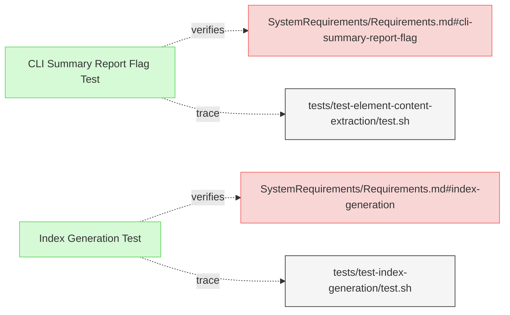

# Report Generation Tests

This document contains verification tests for Reqvire's report generation capabilities.

## Report Generation Tests

---

### CLI Summary Report Flag Test

This test verifies that the system provides a CLI flag for generating summary reports of model structure and relationships.

#### Metadata
  * type: verification

#### Details

##### Acceptance Criteria
- System shall provide a --model-summary flag
- Flag shall activate the summary report generation
- Report shall include model structure information
- Report shall include relationship counts and types

##### Test Criteria
- Command with --model-summary flag runs successfully
- Summary report is generated with expected sections
- Report includes counts of element types
- Report includes information about relationship types and counts
- Elements are organized by file and section

##### Test Procedure
1. Create test fixtures with various elements and relationship types
2. Run Reqvire with --model-summary flag on the test fixtures
3. Verify that summary report is generated with expected format
4. Confirm that all element types and counts are accurately reported
5. Verify that relationship information is correctly represented

#### Relations
  * verify: [SystemRequirements/Requirements.md#cli-summary-report-flag](../SystemRequirements/Requirements.md#cli-summary-report-flag)
  * trace: [tests/test-element-content-extraction/test.sh](../../tests/test-element-content-extraction/test.sh)

---

### Index Generation Test

This test verifies that the system correctly generates an index document with links and summaries to all specification documents.

#### Metadata
  * type: verification

#### Details

##### Acceptance Criteria
- System shall generate README.md in the specifications folder
- README.md shall contain links to all specification documents
- README.md shall be properly structured with sections
- README.md shall include brief summaries of each document

##### Test Criteria
- Command with --generate-index flag runs successfully
- README.md file is created in the specifications folder
- README.md contains links to all specification documents
- README.md structure follows expected format

##### Test Procedure
1. Create test fixtures with multiple specification documents in various folders
2. Run Reqvire with --generate-index flag
3. Verify that README.md is created in the specifications folder
4. Verify that README.md contains links to all specification documents
5. Verify that document structure and summaries are included

#### Relations
  * verify: [SystemRequirements/Requirements.md#index-generation](../SystemRequirements/Requirements.md#index-generation)
  * trace: [tests/test-index-generation/test.sh](../../tests/test-index-generation/test.sh)

---