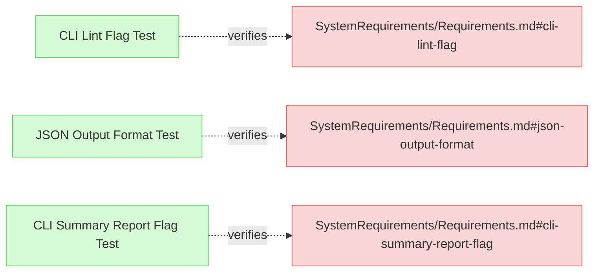
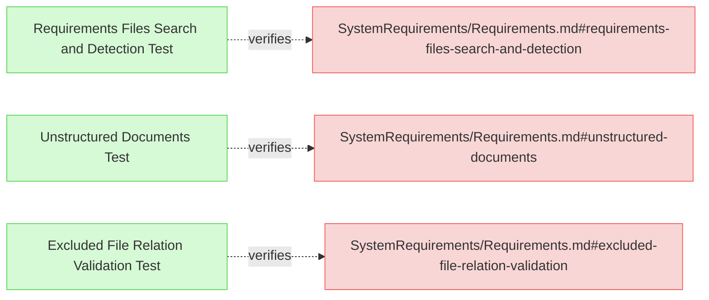
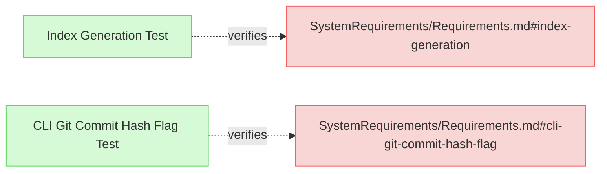

# System Requirements Verifications

This document contains verification tests for system-level requirements that aren't directly covered by existing verification files.

## Command Line Interface Verifications

---

### CLI Lint Flag Test

This test verifies that the system provides a linting function activated by the --lint flag.

#### Metadata
  * type: verification

#### Details

##### Acceptance Criteria
- System shall provide a --lint flag in CLI
- Flag shall activate the linting process
- Linting shall execute upon user request
- Process shall apply fixes by default

##### Test Criteria
- Command with --lint flag runs successfully
- Linting process is executed on target files
- Linting issues are identified and fixed
- Changes are applied to files

##### Test Procedure
1. Create test fixtures with known linting issues (excess whitespace, inconsistent newlines, etc.)
2. Run ReqFlow with --lint flag on the test fixtures
3. Verify that linting process is executed and files are modified
4. Compare output files with expected fixed versions
5. Run with --lint --dry-run and verify that issues are identified but files aren't changed

#### Relations
  * verify: [SystemRequirements/Requirements.md#cli-lint-flag](../SystemRequirements/Requirements.md#cli-lint-flag)
  * trace: [tests/test-lint-expected/test.sh](../../tests/test-lint-expected/test.sh)

---

### JSON Output Format Test

This test verifies that the system properly implements JSON output formatting for validation and other commands.

#### Metadata
  * type: verification

#### Details

##### Acceptance Criteria
- System shall support --json flag for validation commands
- JSON output shall be properly formatted according to a consistent schema
- JSON structure shall be parsable and machine-readable
- All relevant validation data shall be included in the output

##### Test Criteria
- Commands with --json flag produce valid JSON
- JSON output can be parsed without errors
- Output structure matches expected schema
- All validation errors are properly represented in JSON format

##### Test Procedure
1. Create test fixtures with known validation issues
2. Run ReqFlow with --validate --json flag on the test fixtures
3. Verify that output is valid JSON by parsing it
4. Confirm all validation errors are represented in the JSON output
5. Verify that JSON structure is consistent across different validation scenarios

#### Relations
  * verify: [SystemRequirements/Requirements.md#json-output-format](../SystemRequirements/Requirements.md#json-output-format)
  * trace: [tests/test-invalid-relations/test.sh](../../tests/test-invalid-relations/test.sh)

---

### CLI Summary Report Flag Test

This test verifies that the system provides a CLI flag for generating summary reports of model structure and relationships.

#### Metadata
  * type: verification

#### Details

##### Acceptance Criteria
- System shall provide a --model-summary flag
- Flag shall activate the summary report generation
- Report shall include model structure information
- Report shall include relationship counts and types

##### Test Criteria
- Command with --model-summary flag runs successfully
- Summary report is generated with expected sections
- Report includes counts of element types
- Report includes information about relationship types and counts
- Elements are organized by file and section

##### Test Procedure
1. Create test fixtures with various elements and relationship types
2. Run ReqFlow with --model-summary flag on the test fixtures
3. Verify that summary report is generated with expected format
4. Confirm that all element types and counts are accurately reported
5. Verify that relationship information is correctly represented

#### Relations
  * verify: [SystemRequirements/Requirements.md#cli-summary-report-flag](../SystemRequirements/Requirements.md#cli-summary-report-flag)
  * trace: [tests/test-element-content-extraction/test.sh](../../tests/test-element-content-extraction/test.sh)

---

## Validation Verifications

---

### Requirements Files Search and Detection Test

This test verifies that the system correctly searches for and detects requirements files according to specified patterns and configurations.

#### Metadata
  * type: verification

#### Details

##### Acceptance Criteria
- System shall find all requirements files in project structure based on configuration
- System shall respect excluded file patterns defined in configuration
- System shall handle nested directory structures correctly
- System shall correctly identify and categorize different file types
- System shall process both specifications and external folders

##### Test Criteria
- All expected requirements files are identified
- Files matching exclusion patterns are skipped
- Nested directories are correctly traversed
- Both specifications and external folders are processed
- Non-markdown files are handled appropriately

##### Test Procedure
1. Create test fixtures with various directory structures including:
   - Files in different levels of nesting
   - Files matching exclusion patterns
   - Files in both specifications and external folders
2. Configure ReqFlow with specific pattern rules
3. Run ReqFlow on the test fixtures
4. Verify that all expected files are found and processed
5. Verify that excluded files are correctly skipped
6. Verify correct handling of nested directories

#### Relations
  * verify: [SystemRequirements/Requirements.md#requirements-files-search-and-detection](../SystemRequirements/Requirements.md#requirements-files-search-and-detection)
  * trace: [tests/test-excluded-patterns/test.sh](../../tests/test-excluded-patterns/test.sh)

---

### Unstructured Documents Test

This test verifies that the system correctly handles unstructured documents for relation targets.

#### Metadata
  * type: verification

#### Details

##### Acceptance Criteria
- System shall allow referencing unstructured documents (text files, code files)
- System shall not attempt to parse unstructured documents as requirements
- System shall validate that referenced unstructured documents exist
- System shall not report validation errors for valid references to unstructured documents

##### Test Criteria
- Relations referencing unstructured documents are treated as valid
- No attempt is made to extract elements from unstructured documents
- Validation succeeds when referenced unstructured documents exist
- Validation fails when referenced unstructured documents don't exist

##### Test Procedure
1. Create test fixtures with:
   - Requirements referencing unstructured documents (.txt, .cpp files)
   - Valid references to existing unstructured documents
   - Invalid references to non-existent unstructured documents
2. Run ReqFlow validation on the test fixtures
3. Verify that valid references to unstructured documents are accepted
4. Verify that invalid references to non-existent files are reported
5. Verify that unstructured documents are not parsed for elements

#### Relations
  * verify: [SystemRequirements/Requirements.md#unstructured-documents](../SystemRequirements/Requirements.md#unstructured-documents)
  * trace: [tests/test-valid-relations/test.sh](../../tests/test-valid-relations/test.sh)

---

### Excluded File Relation Validation Test

This test verifies that the system correctly validates relations to excluded files.

#### Metadata
  * type: verification

#### Details

##### Acceptance Criteria
- System shall validate existence of excluded files referenced in relations
- System shall not parse excluded files for elements
- System shall allow relations TO excluded files but not FROM excluded files
- System shall apply exclusion patterns based on configuration

##### Test Criteria
- Relations to excluded files are treated as valid if files exist
- Relations from excluded files are not processed
- Excluded files are not parsed for elements
- Files matching exclusion patterns are correctly identified

##### Test Procedure
1. Create test fixtures with:
   - Files matching exclusion patterns
   - Requirements referencing excluded files
   - Requirements referenced by excluded files (should be ignored)
2. Configure ReqFlow with specific exclusion patterns
3. Run ReqFlow validation on the test fixtures
4. Verify that relations to excluded files are validated for file existence
5. Verify that excluded files are not parsed for elements
6. Verify that relations from excluded files are not processed

#### Relations
  * verify: [SystemRequirements/Requirements.md#excluded-file-relation-validation](../SystemRequirements/Requirements.md#excluded-file-relation-validation)
  * trace: [tests/test-excluded-patterns/test.sh](../../tests/test-excluded-patterns/test.sh)

---

## Index and Report Verifications

---

### Index Generation Test

This test verifies that the system correctly generates an index document with links and summaries to all specification documents.

#### Metadata
  * type: verification

#### Details

##### Acceptance Criteria
- System shall generate README.md in the specifications folder
- README.md shall contain links to all specification documents
- README.md shall be properly structured with sections
- README.md shall include brief summaries of each document

##### Test Criteria
- Command with --generate-index flag runs successfully
- README.md file is created in the specifications folder
- README.md contains links to all specification documents
- README.md structure follows expected format

##### Test Procedure
1. Create test fixtures with multiple specification documents in various folders
2. Run ReqFlow with --generate-index flag
3. Verify that README.md is created in the specifications folder
4. Verify that README.md contains links to all specification documents
5. Verify that document structure and summaries are included

#### Relations
  * verify: [SystemRequirements/Requirements.md#index-generation](../SystemRequirements/Requirements.md#index-generation)
  * trace: [tests/test-index-generation/test.sh](../../tests/test-index-generation/test.sh)

---

### CLI Git Commit Hash Flag Test

This test verifies that the system properly handles the git commit hash flag for change impact analysis.

#### Metadata
  * type: verification

#### Details

##### Acceptance Criteria
- System shall support --git-commit flag for change impact analysis
- System shall use specified commit hash as base for comparison
- System shall default to HEAD when flag is not specified
- System shall handle relative commit references (HEAD~1, etc.)

##### Test Criteria
- Command with explicit --git-commit flag runs successfully
- Command without flag defaults to HEAD commit
- Relative commit references are correctly resolved
- Invalid commit references are reported appropriately
- Change impact analysis correctly uses specified commit as baseline

##### Test Procedure
1. Create test fixtures with git repository containing multiple commits
2. Run ReqFlow with --change-impact --git-commit=HEAD~1
3. Verify that the specified commit is used as baseline
4. Run ReqFlow with --change-impact (no git-commit flag)
5. Verify that HEAD is used as default baseline
6. Run with invalid commit reference and verify appropriate error

#### Relations
  * verify: [SystemRequirements/Requirements.md#cli-git-commit-hash-flag](../SystemRequirements/Requirements.md#cli-git-commit-hash-flag)
  * trace: [tests/test-change-impact-detection/test.sh](../../tests/test-change-impact-detection/test.sh)

---
