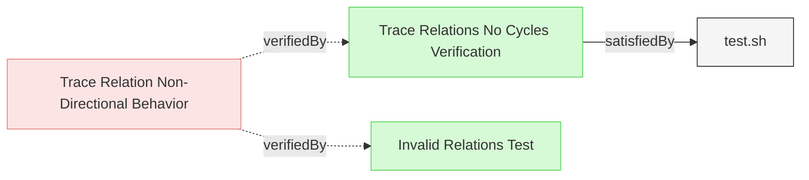

# Trace Relation Tests

This document verifies the requirements for Reqvire's trace relation behavior.

## Trace Relation Circular Dependency Test

### Trace Relations No Cycles Verification

This test verifies that trace relations do not trigger circular dependency errors even when they form cycles, confirming that trace relations are correctly excluded from dependency cycle detection.

#### Details
The test creates a model with trace relations forming cycles (Alpha→Beta→Gamma→Alpha) and verifies that:
- Validation succeeds without circular dependency errors
- The model is processed correctly with all requirements recognized
- Trace relations maintain their traceability purpose without creating false dependencies

##### Acceptance Criteria
- System shall allow trace relations to form cycles without validation errors
- Circular dependency detection shall exclude trace relations from traversal
- Model validation shall succeed when only trace relations form cycles
- All requirements with trace cycles shall be properly processed

##### Test Criteria
- Command exits with success (zero) return code
- No circular dependency errors in output
- JSON output is valid and complete
- Expected number of requirements (8 total: 4 user, 4 system) are processed

#### Metadata
  * type: test-verification

#### Relations
  * verify: [Trace Relation Non-Directional Behavior](../ReqvireTool/ModelManagement/DiagramGeneration.md#trace-relation-non-directional-behavior)
  * satisfiedBy: [test.sh](../../tests/test-trace-no-cycles/test.sh)
---